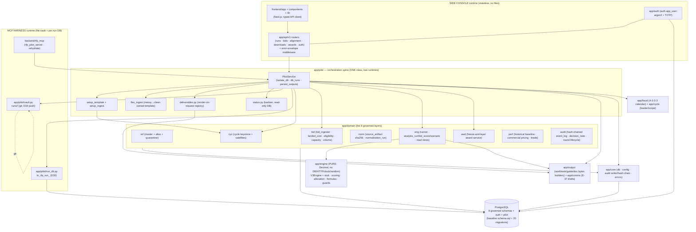
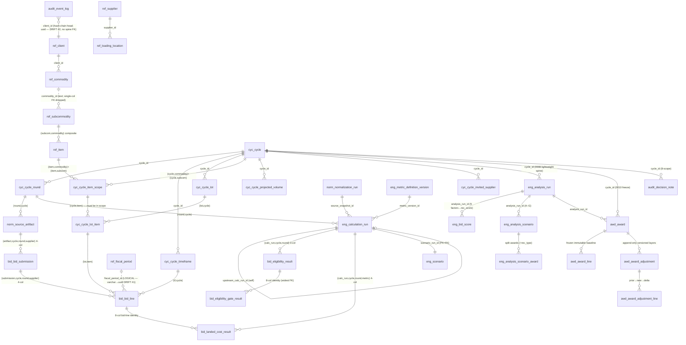
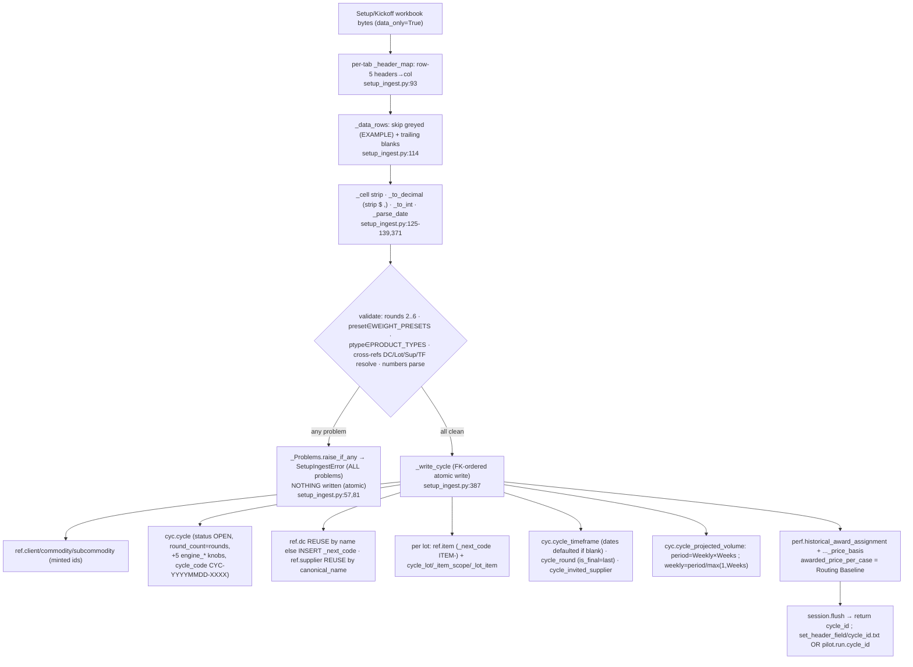
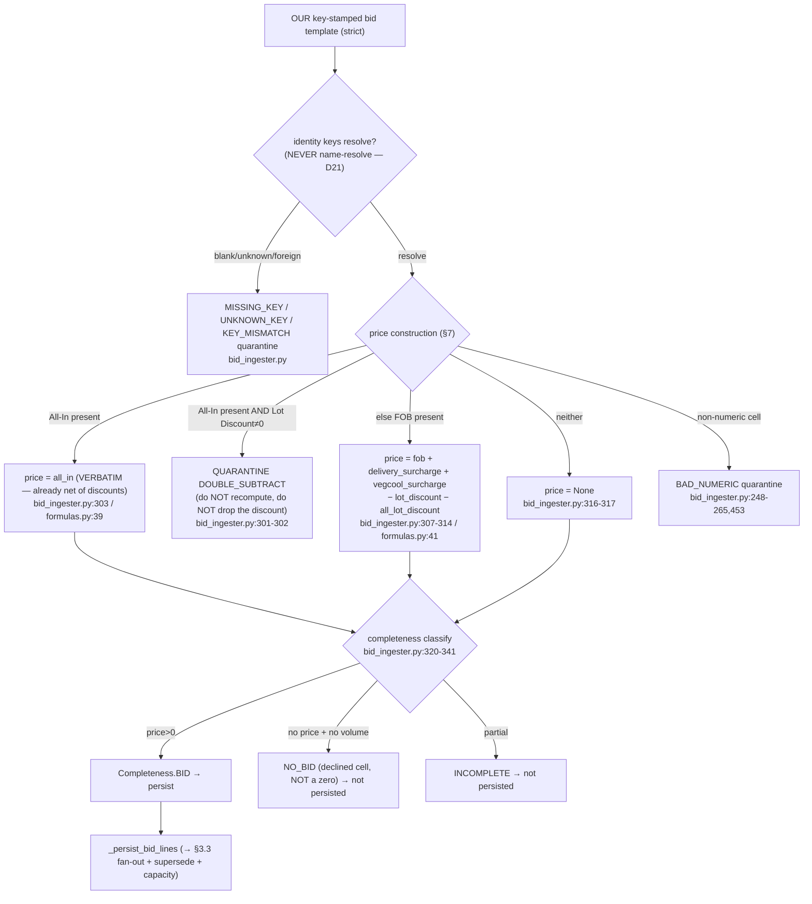
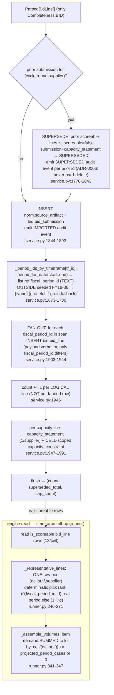
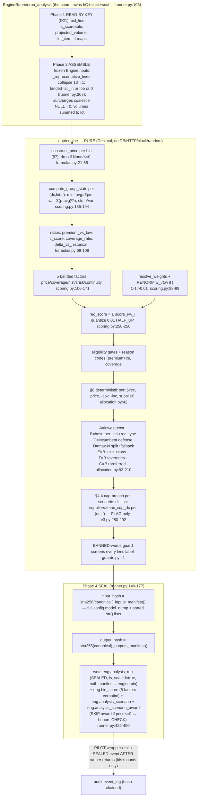
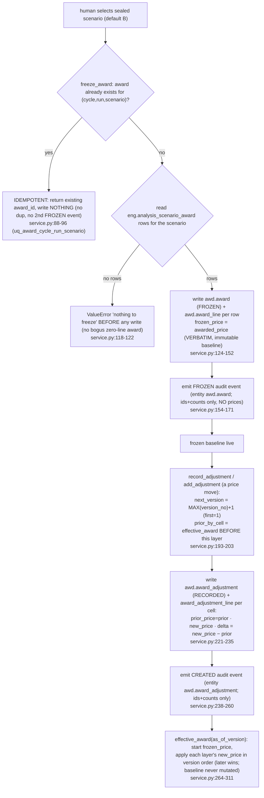
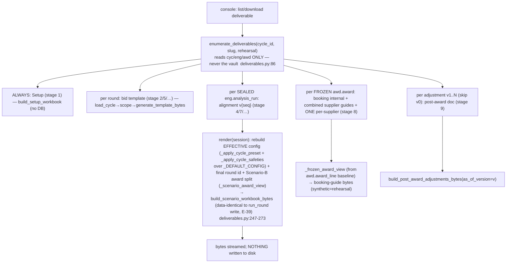
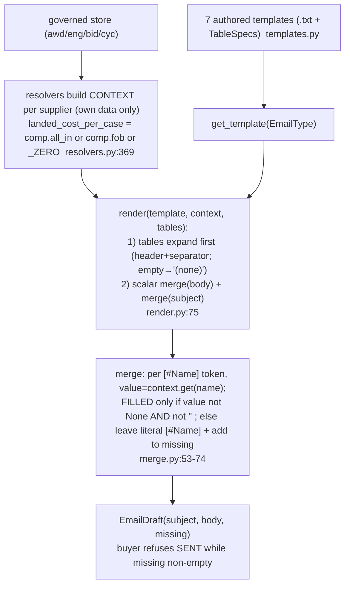
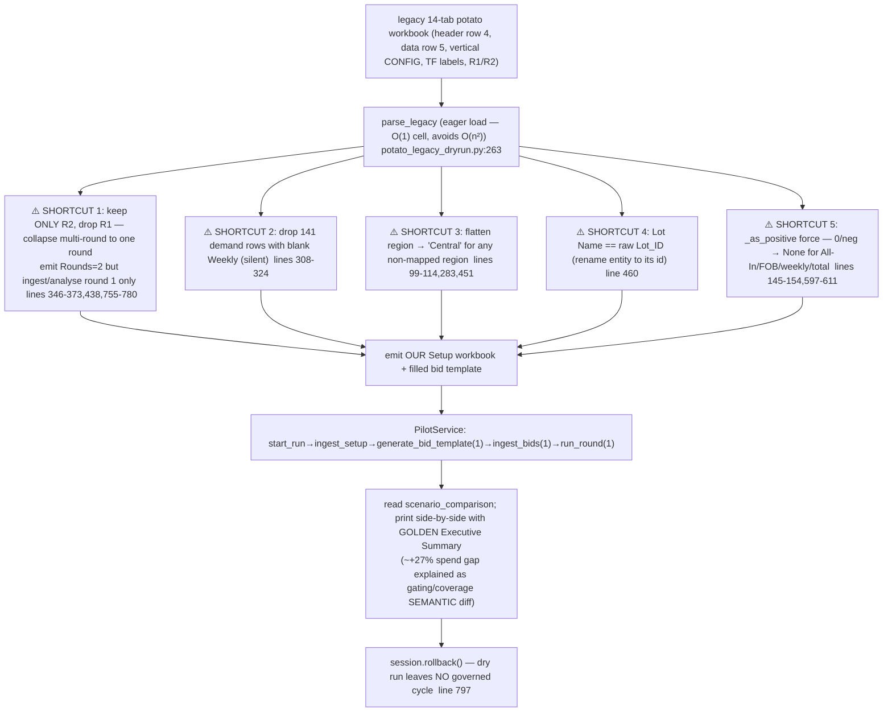

# LAYER 1 — Architecture · Data · Data-flows

> **Reading contract (AUDIT_STANDARD §LAYER-1).** This document maps (1) every backend package + frontend area and the two-runtime split; (2) every schema/table/column with its precision, keys, and the 46 composite FKs + the 4 confirmed type drifts; (3) every data flow charted value-by-value, with the precision inventory. "If a decimal moves one pixel it gets mapped." Whole-slice prose is **synthesized, not re-pasted**; citations point back to the slice for the exhaustive per-file detail.

---

# SECTION 1 — ARCHITECTURE MAP

## 1.0 The two runtimes (the load-bearing architectural fact)

The system is **one application surface (`backend/app`) wrapped by two runtimes** that share the same domain/engine/output code but differ in where state lives. This split is the single most important thing to understand and it is enforced by three constructor flags on `PilotService` (`service.py:209–231`; B2 §service.py):

| | **MCP harness runtime** (skill / `rfp_mcp`) | **Stateless web console** (HTTP API / `frontend`) |
|---|---|---|
| Run identity | a **vault folder** `runs/<slug>/` in a git repo (`app/pilot/vault.py`) | a **`pilot.run` DB row** (`app/pilot/models.py`, migration 0019) |
| Governed data | a **per-run Postgres database** `kr_rfp_run_<slug>` (`run_db.py`, D30) | the **shared console DB** (single source of truth) |
| Files | written to disk (`inputs/ outputs/ memory/`), git-committed, pushed (D34) | **NO server-side files** — deliverables render **on request** from the DB (`deliverables.py`, ADR-0018, CLAUDE.md req #4) |
| Flags | `isolate_db=True, db_runs=False, persist_outputs=True` | `isolate_db=False/shared, db_runs=True, persist_outputs=False` |
| Cycle-id resolution | `cycle_id.txt` file | `pilot.run.cycle_id` column |
| Rehearsal/synthetic provenance | `.rehearsal` sentinel file | `pilot.run.rehearsal` boolean |

The two runtimes **never contend**: the harness keeps its file vault and its own DB; the console reads/writes the `pilot.run` table + the shared DB and writes no files. `persist_outputs=False` makes the console do ONLY the governed DB writes (engine seal, audit events, awd-service writes) and skip every vault side-effect, which then re-materialize identically through `enumerate_deliverables` (E-39: render-on-request bytes are data-identical to the harness write path). [B2 §service.py runtime flags; §deliverables.py; B6 output slice]

The **engine is a third, purely-functional inner box** (`app/engine`): no DB, no HTTP, no clock, no randomness except via injected config — which is what makes a sealed run reproducible. The runner (`app/domain/eng/runner.py`) owns the I/O, clock, transaction, and seal around it. [B1 §interface.py purity; §2 pipeline]

## 1.1 Backend package map (`backend/app/**`)

Synthesized from B1–B6 + the schema's eight logical layers. Each package's WHY = "what breaks without it."

| Package | Owns | WHY / what breaks without it | Slice |
|---|---|---|---|
| `app/engine` | The pure math core: frozen `Engine` interface, `EngineConfig` (every knob), the canonical formula table (`formulas.py`), the five banded factor scores + `rec_score` (`scoring.py`), the A–G lenses + max-N split allocator (`allocation.py`), the BANNED-words decision-support guard (`guards.py`), `V3Engine` (real brain) + `DeterministicStubEngine` (tagged placeholder) | No reproducible recommendation; the only rounding points + the whole scoring/allocation logic live here. Purity = sealing works. | B1 |
| `app/pilot` | The run lifecycle + ingest + orchestration spine: vault scaffold, setup template + ingest, flexible bid ingest, per-run DB isolation, the kanban, the DB-backed deliverable registry, the `PilotService` conductor | No run lifecycle, no setup ingest, no isolation, no kanban, no deliverables — just domain engines with no driver. | B2 |
| `app/domain/ref` | Reference/master-data ORM (commodity, subcommodity, dc, supplier, item, loading_location, the typed alias spine, the master-data quarantine, fiscal_calendar) — the **never-guess resolution layer** | Raw text could not resolve to master records; ambiguity could not be quarantined. | B3 |
| `app/domain/cyc` | The cycle keystone ORM + all kickoff satellites (objective/pricing/scope_item/pba/commercial/rfi/timeline/narrative/safety) | The RFP setup model — nearly every fact FKs into `cyc.cycle`. | B3 |
| `app/domain/bid` | Bid intake: the key-stamped template generator + schema, the **strict `bid_ingester`** (price construction + quarantine + completeness), landed-cost result, eligibility, capacity, the volume-scope spine | No bids enter the system; the FOB→landed + double-subtract guard lives here. | B3 |
| `app/domain/eng` | The runner (seals analysis runs), the read views (`read.py` — list_analyses/scenarios/awards), the `eng.*` ORM (sealed calc-run spine + the lightweight `analysis_run`/`bid_score`/`analysis_scenario`/`analysis_scenario_award` decision-support spine) | No sealed runs, no scenario reads — the engine output has nowhere governed to land. | B4 |
| `app/domain/awd` | The **freeze-and-layer** award service: promote a selected scenario to a FROZEN immutable baseline, then append-only versioned adjustment layers; the award read views | No award can be asserted/frozen; post-award reprices have no governed home. | B4 |
| `app/domain/norm` | Normalization lineage ORM (source_artifact sha256, normalization_run + sources, the attribute taxonomy) | A fact could not be traced to the exact file (+hash) it came from. | B4 |
| `app/domain/perf` | Historical award baseline + the 10-table commercial pricing layer + `itrade_receipt` (the actual-paid savings baseline) | No incumbent/savings denominator; no index-pricing layer. | B4 |
| `app/domain/audit` | The hash-chained event-log ORM + decision notes + round lifecycle | No tamper-evident governed-mutation ledger. | B4 |
| `app/core` | Cross-cutting: `db` (Base/metadata/session/types), `config` (the single typed settings surface), `audit` (the `AuditWriter` hash-chain writer + `DomainEvent`/`EventType`/`client_id_for_cycle`), `errors` (the `AppError`/`ErrorCode` taxonomy + envelopes) | No DB session, no config, no audit chain, no error envelopes. | B5 |
| `app/api/v1` | The HTTP console API: routers (`runs`, `bids`, alignment, downloads, awards, auth), `pilot_common` wiring, request/response schemas, the error-envelope middleware | The web console has no backend. | B5/B6 |
| `app/auth` | Console identity (`auth.app_user`: argon2 hash + TOTP-2FA + active flag), login/session | No console login. Lives OUTSIDE the eight governed layers (its own `auth` schema). | B6 |
| `app/comms` | The E-37 supplier comms drafts (award/feedback/rejection emails) — merge sealed records + the supplier's OWN guide into a draft; `resolvers.py` pulls gate strings + bid components | No supplier notices; the comms merge flow. | B6 |
| `app/output` | The deliverable bytes builders: setup template, bid template, scenario/alignment workbook, booking guides (internal + per-supplier), post-award doc; shared `formatting` | No rendered deliverables (workbooks/guides/docs). | B6 |
| `app/fiscal` | The Kroger 4-3-3-3 fiscal calendar (`calendar.py`: `period_for_date`/`all_periods`/`FiscalPeriod`) + the seeded period data | The flat-13 fan-out has no period dimension to fan into. | B6 |
| `app/cycle` | `loader.load_cycle` + `scope.build_scope_from_cycle` — assemble the in-memory cycle view + scope the template/ingest/engine read | No cycle view; template/ingest/engine cannot be scoped. | B6 |
| `backend/alembic` | The 20-migration chain + `env.py` (schema-aware autogenerate, respects a pre-set URL for per-run DBs) | No schema evolution; per-run provisioning could not migrate to head. | B7_migrations |
| `backend/rfp_mcp` | The MCP harness server (`rfp_pilot_server`) + `rehydrate` — wraps `PilotService` for the skill runtime (file vault + per-run DB) | The skill runtime has no server. | D5 |
| `backend/demo`, `backend/rehearsal`, `backend/scripts` | The demo seed (`run_cycle_demo`), rehearsal synthetic fill, the legacy converter dry-run (`potato_legacy_dryrun`) | No demo/seed/rehearsal/legacy-conversion entrypoints. | B9 |

## 1.2 Frontend areas (`frontend/**`)

Synthesized from F1 (app routes) + F3 (lib/config) + the F2* component slices (cross-checked). The console is a Next.js app that calls the `app/api/v1` HTTP surface; it holds no governed state.

| Area | Owns | WHY | Slice |
|---|---|---|---|
| `frontend/app/**` (routes) | The console screens: run list, run detail/kanban, setup upload, bid upload (strict + flexible confirm), alignment/scenario review, award freeze, post-award adjustments, downloads, auth/login | The buyer-facing surface for the whole RFP loop. | F1 |
| `frontend/lib/**` | The API client (typed fetch wrappers to `/api/v1`), config, formatting helpers (currency/%/decimals — the pixel-level precision rendering) | Routes need a typed, consistent backend client + render formatting. | F3 |
| `frontend/components/**` | Shell/auth (F2a), alignment + awards (F2b), intake + runs (F2c) presentational + container components | Reusable UI; the data-binding surface (Layer-3 detail). | F2a/b/c |
| Root config (`frontend/*` config) | Next/TS/build/env wiring | The app builds + points at the API. | F3/R1 |

## 1.3 Component diagram (mermaid)

---

# SECTION 2 — DATA MODEL (consolidated)

> Source: `B7_schema.md` (the baseline `db/baseline/schema.sql`, rev 0001 — 64 `CREATE TABLE`) + `B7_migrations.md` (the 20-migration chain that grows it to head). Every table below carries a one-line purpose + key columns/precision/PK/notable CHECK/FK with a slice/migration citation. The schema is **clean PG15** (no SQLite-isms — `boolean`, real predicates), eight logical-layer schemas (`ref norm cyc bid eng awd perf audit`) + two non-governed schemas (`auth`, `pilot`). [B7-S.0]

## 2.0 The PK convention + the canonicalization contract (root cause of the drifts)

- **Net-new spine tables** (`ref.client`, `ref.commodity`, `audit.event_log`, `ref.fiscal_period`, `auth.app_user`, `perf.itrade_receipt`) use native **`uuid` PKs** with `gen_random_uuid()`. [B7-S.0.3]
- **The ~60 adopted as-built tables** retain their **text-UUID (`varchar(36)`) PKs verbatim** so the 46 composite-identity FKs re-express byte-for-byte. This is the load-bearing reason the whole adopted spine is `varchar(36)` not `uuid` — and the root cause of drift #1 and #2 below (an adopted text-UUID table referencing a net-new uuid table). [B7-S.0.3, §B7-S.14]
- Tables + schema canonicalize; **columns keep their as-built names** (`NAMING_MAP.md` rule 4). [B7-S.0.6]
- 4 single-column commodity FKs (from item/subcommodity/cycle/item_alias → the old text `commodity_master_db`) were **dropped** because canonical `ref.commodity` is uuid-keyed; those tables keep their text `commodity_id` columns + all composite pairs among themselves. [B7-S.0.4]
- Tenancy (`client_id` weave + RLS) is **M10/E-03, deferred** — M0 keeps `client_id` only on `ref.client` + `ref.commodity`. [B7-S.0.5]

## 2.1 `ref` — reference / dimensions + tenant root (12 baseline tables)

| Table | Purpose (one line) | Key columns / precision / PK / notable CHECK·FK | Cite |
|---|---|---|---|
| `ref.client` | Tenant root; `client_id` FKs hang off this; the audit hash-chain head keys on it | PK `id uuid` gen_random_uuid; `UNIQUE(client_code)`; `ck_client_code_not_empty` (net-new CHECK) | B7-S.1.1 |
| `ref.commodity` | Canonical commodity dim, **tenant-scoped** (the M0 tenancy demonstrator) | PK `id uuid`; `client_id uuid→ref.client` (nullable); `uq_commodity_code_per_client UNIQUE(client_id,commodity_code)` (NULL client treated distinct — load-bearing for backfill 0018); `ck_commodity_code_not_empty`; `ix_commodity_client` | B7-S.1.2 |
| `ref.subcommodity` | Subcommodity dim; keeps the `(subcommodity_id,commodity_id)` pair item/cycle reference | PK `subcommodity_id varchar(36)`; `uq_subcom_commodity_pair UNIQUE(subcommodity_id,commodity_id)` (composite-FK target) | B7-S.1.3 |
| `ref.dc` | Distribution-center dim; grain anchor for almost every fact | PK `dc_id varchar(36)`; `UNIQUE(dc_code)`, `UNIQUE(dc_name)` | B7-S.1.4 |
| `ref.supplier` | Supplier dim; canonical name is the dedupe key | PK `supplier_id varchar(36)`; `UNIQUE(canonical_name)` | B7-S.1.5 |
| `ref.item` | Item/SKU dim; keeps `(item_id,commodity_id)`/`(item_id,subcommodity_id)` pairs | PK `item_id varchar(36)`; `fk_item_subcom_in_commodity (subcommodity_id,commodity_id)→ref.subcommodity` (composite FK #1); `UNIQUE(upc)`, `UNIQUE(item_code)` | B7-S.1.6 |
| `ref.loading_location` | Supplier loading/origin locations; `(location_id,supplier_id)` pair bid_line/landed FK into | PK `location_id`; `uq_loc_supplier_pair`; `ck_loc_country_code_two_char (len=2)`; `ck_loc_active_dates_ordered`; COALESCE-expr unique `uq_loc_supplier_name_geo` (NULL region→'') | B7-S.1.7 |
| `ref.fiscal_calendar` | Calendar-date→fiscal-coordinate lookup (one row/date) — distinct from net-new `ref.fiscal_period` | PK `calendar_date`; the 4-3-3-3 guards: quarter 1–4, period 1–13, period-week 1–5, week 1–53 | B7-S.1.8 |
| `ref.supplier_alias` | Typed supplier aliases, partial-unique-active + deactivation lineage | PK `supplier_alias_id`; `ck_supplier_alias_deactivation_consistency` (biconditional active⇔deactivation-cols-null); `uq_supplier_alias_norm_typed_active` partial UNIQUE `WHERE active_flag` | B7-S.1.9 |
| `ref.item_alias` | Item aliases, commodity/subcommodity-scoped, same lineage | PK `item_alias_id`; partial unique with COALESCE sentinels `'__GLOBAL__'`/`'__ANY__'`; text commodity_id (why text, not uuid) | B7-S.1.10 |
| `ref.dc_alias` | DC text resolution (untyped) | PK `dc_alias_id`; `uq_dc_alias_normalized_active` partial UNIQUE | B7-S.1.11 |
| `ref.master_data_quarantine` | The **never-guess queue** (CLAUDE.md req #3 in the DB) | PK `quarantine_id`; `uq_quarantine_source_row_domain`; `fk_quarantine_cycle→cyc.cycle` (DEFERRED guarded block) | B7-S.1.12 |

**Migration adds to `ref`:** `ref.fiscal_period` (0014 — net-new uuid PK, **273 seeded rows FY16..FY36**, `UNIQUE(fiscal_year,period)`); orphan-commodity backfill (0018, DML only). [B7-M §M14, §M18]

## 2.2 `cyc` — cycle keystone + setup (8 baseline + 9 migration tables)

| Table | Purpose | Key columns / precision / PK / notable CHECK·FK | Cite |
|---|---|---|---|
| `cyc.cycle` | **The keystone** — the RFP cycle nearly everything FKs into | PK `cycle_id varchar(36)`; `target_savings_amt numeric(18,2)`; `ck_cycle_round_count_range (2..6)` (the multi-round guard, CLAUDE.md req #3); `fk_cycle_subcom_in_commodity` composite; `uq_cycle_commodity_pair`, `uq_cycle_subcom_pair`; `UNIQUE(cycle_code)`. **Most-extended table: +13 cols across 0002/0012/0013 → 26 cols** | B7-S.2.1; B7-M.2.3 |
| `cyc.cycle_timeframe` | Timeframes (demand/pricing grain); `(tf_id,cycle_id)` pair is the heavily-referenced FK target | PK `tf_id`; `uq_tf_cycle_pair`; `ck_tf_week_count_positive`, `ck_tf_date_range_positive (end>start)` | B7-S.2.2 |
| `cyc.cycle_round` | Rounds (forward-only); `(round_id,cycle_id)` = the **most-referenced FK target** | PK `round_id`; `uq_round_cycle_pair`; `uq_round_number_per_cycle`; `ck_round_number_positive` | B7-S.2.3 |
| `cyc.cycle_item_scope` | In/out scope per item per cycle; the strongest composite-identity rigor | PK `(cycle_id,item_id)`; **4 composite FKs** (scope↔cycle commodity+subcom, scope↔item commodity+subcom) | B7-S.2.4 |
| `cyc.cycle_lot` | Lots within a cycle | PK `lot_id`; `uq_lot_cycle_pair`; `uq_lot_code_per_cycle` | B7-S.2.5 |
| `cyc.cycle_lot_item` | Items→lots, one lot per item per cycle | PK `lot_item_id`; `uq_item_per_lot`; `uq_one_lot_per_item_per_cycle`; `fk_lotitem_lot_in_cycle`, `fk_lotitem_in_cycle_scope` composite | B7-S.2.6 |
| `cyc.cycle_projected_volume` | Projected demand at DC×item×tf | PK `volume_id`; `projected_weekly_cases`/`projected_period_cases numeric(18,3)`; `growth_override_pct numeric(9,6)`; `uq_volume_cell`; `ck_volume_method_consistency`; `ck_volume_period_nonneg`; `fk_volume_normalization_run` (DEFERRED) | B7-S.2.7 |
| `cyc.cycle_invited_supplier` | Who was invited (the submitted-vs-missing denominator); +`is_incumbent` (0002) | PK `(cycle_id,supplier_id)` | B7-S.2.8 |
| **migration cyc satellites (0002):** `cycle_objective` (partial-unique one-primary), `cycle_pricing` (**ONE row/cycle, PK cycle_id**, D9), `cycle_scope_item` (`lot_id` unconstrained — drift #4), `cycle_pba_term`, `cycle_commercial_term`, `cycle_rfi_question`, `cycle_timeline_event`, `cycle_narrative` (versioned richtext) | — | the kickoff header/render contract | B7-M §M02 |
| **`cyc.cycle_safety` (0003):** the **five PRICING-CONTRACT safeties** (COLLAR/ROLLING_MIDPOINT/TOLERANCE_BAND/DISASTER/INVERSE_DISASTER), PK `(cycle_id,safety_type)`, real typed columns, **engine IGNORES these** | `cap`/`floor`/`band numeric(18,6)`; `ck_cycle_safety_collar_ordered` | distinct from the engine safeties (0012) | B7-M §M03 |
| **`cyc.cycle` engine knobs:** +4 engine safeties (0012 — `engine_premium_ceiling/coverage_floor/conc_thresh numeric(18,6)`, `engine_max_sup_dc int`, the engine **DOES** consume these) + `engine_weight_preset` (0013, CHECK-guarded preset name) | all nullable (blank→preset default) | B7-M §M12, §M13 |

## 2.3 `norm` — normalization lineage (3 baseline + 2 migration)

| Table | Purpose | Key columns / PK / FK | Cite |
|---|---|---|---|
| `norm.source_artifact` | sha256 lineage of every uploaded file + provenance quads (no file storage — DB is truth) | PK `artifact_id`; `file_hash_sha256 varchar(64)`; `uq_artifact_identity_quad`, `uq_artifact_cycle_supplier`, `uq_artifact_round` (composite-FK targets); `ck_artifact_bid_provenance`, `ck_artifact_capacity_provenance`; `fk_artifact_round_in_cycle` composite | B7-S.3.1 |
| `norm.normalization_run` | A normalized load (which files, approval state) | PK `normalization_run_id`; FK→cyc.cycle | B7-S.3.2 |
| `norm.normalization_run_source` | M:N run↔artifacts with a role | PK `(normalization_run_id,source_artifact_id)` | B7-S.3.3 |
| `norm.attribute_def` (0004) | ONE shared superset attribute catalog (D14) | PK `attribute_code varchar(60)`; `ck_attribute_def_data_type`, `ck_attribute_def_label_not_empty` | B7-M §M04 |
| `norm.lot_attribute` (0004) | SPARSE per-lot attributes | PK `(lot_id,attribute_code)`; `lot_id` **unconstrained** (drift #4); `attribute_code`→`attribute_def` | B7-M §M04 |

## 2.4 `eng` — sealed calc-run spine + version pins + scenarios (10 baseline + 4 migration + cols)

| Table | Purpose | Key columns / precision / PK / notable CHECK·FK | Cite |
|---|---|---|---|
| `eng.metric_definition_version` | Formula version pin (reproducibility) | PK `metric_version_id`; `tolerance_abs numeric(18,6)`, `tolerance_pct numeric(9,6)`; `uq_formula_family_version` | B7-S.4.1 |
| `eng.scenario_config_version` | Solver config version pin | PK; `uq_scenario_config_label_version` | B7-S.4.2 |
| `eng.engine_release` | Engine version pin (git sha) | PK; `ck_engine_sha_min_length (>=7)`; `ck_engine_released_requires_timestamp` | B7-S.4.3 |
| `eng.calculation_run` | **The sealed run spine** — hashed manifests + version pins + identity triples; `upstream_calc_run_id` self-FK | PK `calc_run_id`; `uq_calcrun_identity_triple`, `uq_calcrun_identity_metric_quad` (composite-FK targets); **`ck_calcrun_failed_has_errorlog`** = the de-no-op'd CHECK (FAILED⇔error_log present); `ck_calcrun_success_completeness`; 6 more CHECKs | B7-S.4.4; B7-S.0.2 |
| `eng.calculation_run_input` | Frozen inputs, one/type, canonical hash | PK; `uq_calcrun_input_one_per_type`; `ck_calcrun_input_hash_min_length(>=8)` | B7-S.4.5 |
| `eng.round_analysis_snapshot` | One canonical run/round — anchors "open last cycle" | PK `snapshot_id`; `is_canonical`; `uq_ras_one_link_per_run_per_round`; `fk_ras_round_in_cycle` composite | B7-S.4.6 |
| `eng.scenario` | A scenario result over a calc run (1:1, `scenario_run_id` IS a calc_run PK) | PK=FK `scenario_run_id→eng.calculation_run`; `objective_total_spend numeric(18,6)`; `ck_scenario_a_result_status_objective` (FEASIBLE⇒spend>0) | B7-S.6.1 |
| `eng.scenario_award` | Single-winner cell assignment; **0005 re-grains to per-supplier split** | PK `cell_assignment_id`; `cell_period_cases numeric(18,3)`, `cell_spend numeric(18,6)`; baseline `uq_scenario_a_cell_assignment_cell` DROPPED+regrained by 0005 to `(…,supplier_id)`; +`volume_share numeric(9,6)`, `is_fallback`, `cap_breach_flag` (0005); `ck_…status_shape` | B7-S.6.2; B7-M §M05 |
| `eng.scenario_line_detail` | Per-item cost detail under a cell | PK; `projected_period_cases numeric(18,3)`, `authoritative_landed_cost_case`/`line_spend numeric(18,6)`; traces upstream landed-cost | B7-S.6.3 |
| `eng.scenario_capacity_usage` | Capacity arithmetic per constraint per scenario | PK; `…numeric(18,3)`; **`ck_…arithmetic (remaining = limit − assigned)`** (arithmetic enforced at rest); `ck_…satisfied_consistent` | B7-S.6.4 |
| **`eng.analysis_run` (0008)** | The **lightweight sealed decision-support spine** (one sealed run/cycle/round; ADR-0006) | PK `analysis_run_id`; `is_sealed`; `input/output_hash_manifest`; `uq_analysis_run_identity`; `fk_analysis_run_round_in_cycle` composite; **+`label varchar(120)` (0020 — named savepoint, NO audit event)** | B7-M §M08, §M20 |
| **`eng.bid_score` (0008)** | The five banded factors → `rec_score` per scored bid | PK `bid_score_id`; `price/coverage/hist/zrisk/continuity/rec_score numeric(9,4)`; `gate_flags text`; `uq_bid_score_per_run_line` | B7-M §M08 |
| **`eng.analysis_scenario` (0008)** | The A–G lens headers | PK; `objective_total_spend numeric(18,6)`; `uq_analysis_scenario_per_run_code` | B7-M §M08 |
| **`eng.analysis_scenario_award` (0008)** | The **SPLIT award rows** (per-supplier cell grain) | PK `award_id`; `volume_share numeric(9,6)`, `awarded_price numeric(18,6)`; `is_recommended/is_fallback/cap_breach_flag`; **+`rec_type varchar(40)` (0009 — B-only reason label)**; `ck_…volume_share_range(0..1)`, `ck_…price_positive(>0)` | B7-M §M08, §M09 |

## 2.5 `bid` — intake, eligibility, capacity, landed cost, volume (13 baseline + cols)

| Table | Purpose | Key columns / precision / PK / notable CHECK·FK | Cite |
|---|---|---|---|
| `bid.bid_submission` | Submission header; identity quad + artifact provenance | PK `submission_id`; `uq_submission_identity_quad`; **`fk_submission_artifact_provenance` 4-col composite FK**; `ck_submission_version_positive` | B7-S.5.1 |
| `bid.bid_line` | **The central priced line** + the 8-col identity octuple | PK `bid_line_id`; **every money col `numeric(18,6)`** (`submitted_all_in_case`, `fob_case`, `freight_case`, `fuel_case`, `accessorial_case`, `item_discount_case`, `shrink_case`); `moq_cases`/`volume_minimum_cases numeric(18,3)`; `uq_bid_line_identity_full` 8-col; 5 composite FKs; `ck_bid_all_in_positive`, `ck_bid_fob_positive` (>0). **2nd-most-extended: +6 cols 0007/0011/0015 + constraint flip 0016 → 41 cols** | B7-S.5.2; B7-M.2.3 |
| `bid.supplier_capability` | The CONFIRMED_CAPABLE gate per (dc,lot,tf) cell | PK; `uq_capability_per_cell`; `ck_capability_confirmed_requires_evidence` | B7-S.5.3 |
| `bid.capacity_statement` | Supplier capacity declaration tied to an artifact | PK; 3 composite FKs (artifact triple, artifact round-pair, submission quad); `uq_capstmt_id_cycle` | B7-S.5.4 |
| `bid.capacity_constraint` | Capacity limits, **5 scopes** (CELL/DC_TF/LOT_TF/SUPPLIER_TF/TOTAL_CYCLE) | PK; `max_weekly_cases`/`max_period_cases numeric(18,3)`; `ck_capacity_scope_field_match` (5-way); `ck_capacity_has_a_max`; `fk_capcon_stmt_cycle` composite | B7-S.5.5 |
| `bid.eligibility_result` | Per-cell eligibility verdict of a calc run | PK; `uq_eligibility_result_full_identity` 8-col; 5 composite FKs; 3 eligible⇔reason⇔submission CHECKs (incl. `null_submission_blocks_eligible`) | B7-S.5.6 |
| `bid.eligibility_gate_result` | Per-gate rows under a result | PK; **`fk_gate_eligibility_full_identity` 8-col = widest composite FK**; `ck_gate_deferred_only_for_capacity`; `ck_gate_blocked_has_reason` | B7-S.5.7 |
| `bid.eligibility_exception` | Recorded eligibility overrides (who/when/why NN) | PK; `uq_exception_per_cell_type` | B7-S.5.8 |
| `bid.landed_cost_result` | **The landed-cost computation** per line per run — 5 modes, awardable-shape CHECKs | PK; **all money `numeric(18,6)`** (`submitted_all_in_case`, `reconstructed_all_in_case`, `authoritative_landed_cost_case`, `variance_case`, `tolerance_case_used`); `uq_landed_cost_per_bidline_per_run`; `fk_landed_cost_metric_matches_run` 4-col, `fk_landed_cost_bidline_full_identity` 8-col; `ck_landed_cost_awardable_shape` + `ck_…nonawardable_shape` (pin the 5-mode contract) | B7-S.5.9 |
| `bid.volume_scope_source_row` | Raw demand/capacity rows; the demand≠capacity firewall | PK; `volume_measure numeric(18,6)`; **`ck_vsp_capacity_never_active_demand`** | B7-S.5.10 |
| `bid.normalized_volume_scope` | Validated demand-only output (the engine's clean demand) | PK; `volume_measure numeric(18,6)`; `ck_vsp_norm_precedence_range(1..4)` | B7-S.5.11 |
| `bid.volume_scope_override` | Demand overrides with lineage | PK; `original_value`/`override_value numeric(18,6)` | B7-S.5.12 |
| `bid.volume_scope_prep_issue` | Persisted volume-prep issues (~24 codes) | PK; issue/severity/resolution | B7-S.5.13 |

**Migration cols on `bid.bid_line`:** +4 engine cost components (0007 — `delivery_surcharge_case`/`vegcool_surcharge_case`/`lot_discount_case numeric(18,6)`, `price_basis_resolved`, **+`ck_bid_line_no_double_discount`** the §7 double-subtract guard at rest); +`transit_days int` (0011, hidden cost not a scoring factor); +`fiscal_period_id varchar(36)` (0015 — **drift #1**); the uniqueness flip (0016 — drop `uq_bid_line_cell_per_submission`, add two partial-unique indexes for the flat-13 grain). [B7-M §M07, §M11, §M15, §M16]

## 2.6 `awd` — the greenfield freeze-and-layer award schema (migration 0010, NOT in baseline)

| Table | Purpose | Key columns / precision / PK / FK | Cite |
|---|---|---|---|
| `awd.award` | One FROZEN award per selected (cycle, run, scenario) | PK `award_id`; `uq_award_cycle_run_scenario`; FK→cyc.cycle, eng.analysis_run; `status DEFAULT 'FROZEN'` | B7-M §M10 |
| `awd.award_line` | The **immutable baseline** — one row/awarded cell at `frozen_price` (NEVER updated) | PK; `volume_share numeric(9,6)`, `frozen_price numeric(18,6)`; `uq_award_line_cell` | B7-M §M10 |
| `awd.award_adjustment` | An APPEND-ONLY VERSIONED layer | PK; `version_no int`; `uq_award_adjustment_version`; `ck_…version_positive(>=1)` | B7-M §M10 |
| `awd.award_adjustment_line` | Per-cell prior→new→delta for one layer | PK; `prior_price`/`new_price`/`delta numeric(18,6)`; `uq_adj_line_cell` | B7-M §M10 |

## 2.7 `perf` — historical baseline + commercial pricing + iTrade (13 baseline + 1 migration)

| Table | Purpose | Key columns / precision | Cite |
|---|---|---|---|
| `perf.historical_award_assignment` | Historical award assignments (incumbent baseline) | PK; `awarded_volume_cases`/`weekly_volume_cases numeric(18,6)`; `uq_…identity (cell+supplier+window)` | B7-S.7.1 |
| `perf.historical_awarded_price_basis` | Awarded price/assignment/basis; one preferred/assignment | PK; `awarded_price_per_case numeric(18,6)`; partial unique `…one_preferred WHERE preferred_basis_flag`; **the only `ON DELETE CASCADE` in baseline** | B7-S.7.2 |
| `perf.historical_awarded_cost_ingestion_issue` | Importer issues for the historical feed | PK; issue/severity | B7-S.7.3 |
| `perf.commercial_pricing_window` … `commercial_market_kickoff_snapshot` (10 tables) | The commercial/index-pricing layer (windows, market reference safety params, three-value pricing model, 20 component types, 5-level proxy, replayable formula audit, QDP, lot-market-delta, kickoff snapshot) | all cycle-scoped; money `numeric(18,6)`, rates `numeric(9,6)`; `uq_cpm_priced_offer_grain`; `ck_cpm_proxy_fallback_range(1..5)` | B7-S.7.4–7.13 |
| `perf.itrade_receipt` (0006) | The real **43-column iTrade "Data"** feed; the actual-paid savings baseline | PK `receipt_id uuid`; cost cols `numeric(18,6)` (`final_price_fob`,`freight`,`total_w_freight`,`cogs`…), qty `numeric(18,3)`; flag-first gate (`flag_canceled/zero_cost/zero_qty`); **+VIEW `v_itrade_actual_paid_baseline`** (vol-weighted `Σ(cogs·qty)/Σqty` per subcommodity×dc×fy×period — the only VIEW in the chain) | B7-M §M06 |

## 2.8 `audit` — hash-chained event log + decision notes + round lifecycle (5 baseline)

| Table | Purpose | Key columns / PK / notable | Cite |
|---|---|---|---|
| `audit.event_log` | **The hash-chained immutable governed-mutation ledger** (net-new uuid; reconciled to the live writer) | PK `id uuid`; `client_id uuid`, `seq bigint`; `prev_event_hash`/`event_hash char(64)` NN; **`uq_event_log_client_seq UNIQUE(client_id,seq)`** = the per-tenant gapless hash-chain head; `entity_id`/`cycle_id` are `uuid` (drift #2); **NO FK to the spine — by design** (write-only, tenant-keyed) | B7-S.8.1 |
| `audit.decision_note` | Append-only note, 8-scope bindable | PK `note_id`; `ck_…text_not_empty`; 7 scope FKs + NN cycle | B7-S.8.2 |
| `audit.round_supplier_participation` | A supplier's participation decision/round | PK; `fk_rsp_round_in_cycle` composite | B7-S.8.3 |
| `audit.round_feedback_issued` | Drafted-only feedback to suppliers | PK; `fk_rfi_round_in_cycle` composite; `ck_…text_not_empty` | B7-S.8.4 |
| `audit.round_field_reduction_decision` | The next-round invitation list (who advances) | PK; `fk_rfrd_round_in_cycle` composite | B7-S.8.5 |

## 2.9 Non-governed schemas (outside the eight layers; not autogenerate-managed)

- **`auth.app_user` (0017):** console identity — PK `id uuid`, `username Text` UNIQUE, `password_hash` (argon2), `totp_secret`/`totp_enabled` (2FA), `is_active`. Lives in `auth` so console identity never pollutes the data spine. [B7-M §M17]
- **`pilot.run` (0019):** DB-backed run identity — PK `slug Text`, `commodity`/`label` NN, `rehearsal bool`, **`cycle_id Text` (nullable, NOT an FK — drift #3)**, `created_at`. Severs run identity from the vault folder so the stateless console resolves runs with no filesystem. [B7-M §M19; B2 §models.py]

## 2.10 The 46 composite-identity FKs (summarized)

Verified count **46** (`grep -cE "FOREIGN KEY \([a-z_]+, "` over `schema.sql` = 46; matches README + AUDIT_STANDARD). They are the "an entity is provably the same entity in the same context" rigor. Grouped by declaring table [full enumeration in B7-S.13]:

| Declaring table | # | The widest / most notable |
|---|---|---|
| `ref.item` | 1 | `(subcommodity_id,commodity_id)→ref.subcommodity` |
| `cyc.cycle` | 1 | `(subcommodity_id,commodity_id)→ref.subcommodity` |
| `cyc.cycle_item_scope` | 4 | the 4 scope↔cycle/item commodity+subcom FKs (strongest rigor) |
| `cyc.cycle_lot_item` | 2 | `(cycle_id,item_id)→cycle_item_scope` (item must be in scope) |
| `cyc.cycle_projected_volume` | 2 | `(cycle_id,item_id)→cycle_item_scope` |
| `norm.source_artifact` | 1 | `(round_id,cycle_id)→cyc.cycle_round` |
| `eng.calculation_run` | 1 | `(round_id,cycle_id)→cyc.cycle_round` |
| `eng.round_analysis_snapshot` | 1 | `(round_id,cycle_id)→cyc.cycle_round` |
| `bid.bid_submission` | 2 | **`(source_artifact_id,cycle_id,round_id,supplier_id)→norm.source_artifact` 4-col** |
| `bid.bid_line` | 5 | `(submission_id,cycle,round,supplier)` 4-col; `(lot_id,item_id)→cycle_lot_item` |
| `bid.supplier_capability` | 2 | lot-in-cycle, tf-in-cycle |
| `bid.capacity_statement` | 4 | artifact triple + artifact round-pair + submission quad |
| `bid.capacity_constraint` | 3 | `(capacity_statement_id,cycle_id)→capacity_statement` |
| `bid.eligibility_result` | 5 | `(calc_run,cycle,round)` 3-col + submission quad |
| `bid.eligibility_gate_result` | 3 | **`(elig_result,calc_run,cycle,round,supplier,dc,lot,tf)` 8-col = WIDEST FK** |
| `bid.eligibility_exception` | 2 | lot/tf-in-cycle |
| `bid.landed_cost_result` | 4 | `(calc_run,cycle,round,metric)` 4-col + **`(bid_line + 7 grain)` 8-col** |
| `audit.round_supplier_participation` | 1 | `(round_id,cycle_id)→cyc.cycle_round` |
| `audit.round_feedback_issued` | 1 | `(round_id,cycle_id)→cyc.cycle_round` |
| `audit.round_field_reduction_decision` | 1 | `(round_id,cycle_id)→cyc.cycle_round` |
| **TOTAL** | **46** | ✓ | 

Migrations add more composite FKs on net-new tables (e.g. `eng.analysis_run`'s `fk_analysis_run_round_in_cycle`, `analysis_scenario_award`'s lot/tf-in-cycle), but the 46 figure is the **baseline** catalog count the brief and README pin. [B7-S.11, S.13]

## 2.11 The 4 CONFIRMED type drifts (the brief's named four)

| # | Drift | Detail | Why it exists / status | Cite |
|---|---|---|---|---|
| 1 | **`bid_line.fiscal_period_id varchar(36)` vs `ref.fiscal_period.id uuid`** | 0015 adds `fiscal_period_id varchar(36)` (ORM `String(36)`); the table it logically references (`ref.fiscal_period`, 0014) has a `uuid` PK. The reference is **logical only — NO FK** ("Logical reference, unenforced like tf_id"). | Intentional per the PK convention (§2.0) — adopted bid_line stays text-UUID to match its sibling id cols; but a real silent type discontinuity at the boundary. | B7-S.14 #1; B7-M §M15 |
| 2 | **`audit.event_log.cycle_id`/`entity_id uuid` vs the adopted spine `varchar(36)`** | The audit writer stamps uuid cycle ids; `cyc.cycle.cycle_id` is varchar(36). A join would need a cast. **No FK bridges them — by design** (write-only, tenant-keyed). | The deliberate uuid-audit ↔ text-UUID-spine boundary (header PK convention). | B7-S.14 #2 |
| 3 | **`pilot.run.cycle_id text`, explicitly NOT an FK** | 0019 makes `cycle_id` plain `text`; cycle ids are text throughout the pilot path and the row must be insertable **before a cycle exists**. | Deliberate text-vs-typed boundary; an FK would force the cycle to pre-exist, breaking create-run-then-ingest order. | B7-S.14 #3; B2 §models.py |
| 4 | **Unconstrained `lot_id` (`cyc.cycle_scope_item` 0002 / `norm.lot_attribute` 0004)** | `lot_id varchar(36)` with **no FK** because the persistent `norm.lot` store (M2/G8) does not exist on disk. Both docstrings promise an additive FK "when norm.lot lands." | Not a type drift per se — an **unenforced reference** dependent on a future migration not yet present. | B7-S.14 #4; B7-M §M03/§G-B7-M-3 |

## 2.12 ER diagram — the core spine (ref→cyc→bid→eng→awd + audit)

---

# SECTION 3 — DATA-FLOWS (charted, value-level)

> Each flow below carries a mermaid chart AND a transformation/decimal table — every value change with its formula + `file:line`. The brief's required flows: setup-ingest→cycle; bid-ingest→bid_line (incl. FOB+freight→landed + double-subtract guard); flat-13 fan-out→timeframe roll-up; engine run→scores→scenarios→sealed; freeze→layers; deliverable render-on-request; comms merge; the legacy converter. The precision inventory is §3.9. Sources: B2 §L1-A..G, B1 §2, B4 §3.2, B6 §3/§4.

## 3.1 Setup-ingest → cycle (workbook cell → governed cycle row)

The first ingest hop and the canonical data-fidelity proof: validation is strict, collects EVERY unresolvable row, and a dirty workbook ingests **nothing** (atomic). [B2 §setup_ingest.py, §L1-A]

| # | source | transformation | formula | file:line |
|---|---|---|---|---|
| 1 | `$`/`,`-formatted number cell | currency/thousands strip | `Decimal(raw.replace(",","").replace("$","").strip())` | setup_ingest.py:127 |
| 2 | `Rounds` cell | int coerce + range gate | `_to_int(...) or 2`; require `2≤r≤6` (matches `ck_cycle_round_count_range`) | setup_ingest.py:209-215 |
| 3 | `Weekly Cases`,`Weeks` | period total | `period_cases = weekly × Decimal(weeks)` | setup_ingest.py:299 |
| 4 | (period_cases, weeks) | weekly re-derivation for the weekly column | `projected_weekly_cases = period / Decimal(max(1, weeks))` (÷0 guard) | setup_ingest.py:635 |
| 5 | `Routing Baseline $/case` | verbatim → price basis (the savings reference) | `awarded_price_per_case = routing` (no sign/scale coercion) | setup_ingest.py:317,690-701 |
| 6 | `Target Effective Date` blank | non-identity default | `effective = target_effective or date(year,12,31)` | setup_ingest.py:417 |
| 7 | TF `start/end` blank | quarter-window default | `date(year,1+(i-1)*3,1)` / `date(year,3+(i-1)*3,28)` | setup_ingest.py:594-595 |

**Fidelity (CLAUDE.md #3):** no row dropped, no dimension flattened, no value force-positived; bad numbers are `_Problems` that abort the whole ingest. The only defaults are non-identity metadata (dates). [B2 §L1-A fidelity note]

## 3.2 Bid-ingest → bid_line (FOB+freight→landed + double-subtract guard)

The strict ingest reads OUR key-stamped template, constructs the §7 price, classifies completeness, then `_persist_bid_lines` writes the rows (with the flat-13 fan-out, §3.3). Price construction is the single definition in `formulas.construct_price_from_parts`, shared by the engine scorer AND the ingester. [B2 §L1-B; B1 §formulas.py:21-66]

| branch | formula | file:line |
|---|---|---|
| All-In present | `price = all_in` (verbatim — already net) | bid_ingester.py:303 / formulas.py:39 |
| All-In present **AND** Lot Discount ≠ 0 | **QUARANTINE `DOUBLE_SUBTRACT`** (no recompute, no drop) | bid_ingester.py:301-302 |
| else FOB present | `price = fob + delivery_surcharge + vegcool_surcharge − lot_discount − all_lot_discount` | bid_ingester.py:307-314 / formulas.py:41 |
| neither | `price = None` → NO_BID/INCOMPLETE | bid_ingester.py:316-317 |
| completeness | `price>0`→BID; no price-intent + no volume→NO_BID; else INCOMPLETE | bid_ingester.py:320-341 |

**No force-positive:** a non-positive constructed price is left for the engine to DROP (`_dropped_row`), never coerced (formulas.construct_price returns None for `price<=0`, scoring.py:343-365). The double-subtract guard exists in **three places**: the ingester quarantine (above), the formula's verbatim-All-In branch (formulas.py:39), and the DB CHECK `ck_bid_line_no_double_discount` (migration 0007). [B2 §L1-B; B1 §formulas.py]

## 3.3 Flat-13 fan-out → timeframe roll-up

The central grain mechanic (INTAKE §1a / Option B): bids are STORED flat at the 13 fiscal periods so storage matches the engine's per-period allocation grain; the engine then COLLAPSES back to timeframe grain via a deterministic representative-row pick. The fan-out PRESERVES the grain (no double-count); the de-fan-out read recovers the logical count exactly. This is the answer to "no flattening/coercing dimensions." [B2 §L1-C/§L1-D §_persist_bid_lines; B4 §runner._representative_lines]

| # | hop | detail | file:line |
|---|---|---|---|
| 1 | flat-13 FAN-OUT (write) | one `bid.bid_line` PER fiscal period in the tf span; payload replicated verbatim, only `fiscal_period_id` differs; `[None]`→single tf-grain row | service.py:1898-1944 |
| 2 | logical count (write) | `count += 1` per LOGICAL priced line (NOT per fanned storage row) → preserves `ingested == N` API contract | service.py:1945 |
| 3 | dates→periods (write) | `period_for_date(start/end)` then inclusive (FY,period) walk across ≤2 FYs; period→`id::text` (uuid stored as text — drift #1) | service.py:1696-1736 (calendar.py:137) |
| 4 | outside calendar | `period_for_date` raises ValueError → span `[None]` (graceful) | service.py:1705-1709 |
| 5 | Option-B COLLAPSE (read) | 13→1 per cell, deterministic pick (NULL period sorts AFTER real → prefer a fanned row); makes the sealed input-hash reproducible | runner.py:246-271,294 |
| 6 | item→lot volume roll-up (read) | `by_cell[(dc,lot,tf_code)] += projected_period_cases or 0`; unmapped item/tf SKIPPED (no fudge) | runner.py:341-347 |
| 7 | de-fan-out read (export) | logical count = `count(DISTINCT (supplier_id,dc_id,lot_id,item_id,tf_id))` filtered `is_scoreable=true` | service.py:1136 |

## 3.4 Engine run → scores → scenarios → sealed

The runner is THE seam: read-by-key → assemble FROZEN inputs → run the pure `V3Engine` → seal (hash + write). The engine itself is pure Decimal math; the only rounding inside it is the `rec_score` quantize. [B1 §2 pipeline + scoring/allocation; B4 §runner.py]

| # | hop | formula | file:line | precision |
|---|---|---|---|---|
| E1 | landed-cost selection | `landed = submitted_all_in_case or fob_case or Decimal("0")` (all-in already landed; no recompute) | runner.py:307 | stored 6-dp Decimal |
| E2 | surcharge/discount coalesce | `delivery/vegcool/lot = …_case or Decimal("0")` | runner.py:303-305 | NULL→0, verbatim |
| E3 | weight renormalization | `raw = (w_i/Σw)` when `Σ≠0 and |Σ−1|>0.01`; Σ=0→no renorm | scoring.py:98-99 | Decimal |
| E4 | construct price (§7) | All-In verbatim else `fob+delivery+vegcool−lot_disc−all_lot_disc`; drop `None`/`<=0` | formulas.py:21-66 | Decimal, no quantize |
| E5 | group stats | `avg=Σp/n`; population `var=Σ(p−avg)²/n` (ddof=0); `std=√var`; `min` | scoring.py:185-194 | Decimal sqrt (no float) |
| E6 | four ratios | `premium=(price−low)/low`; `z=(price−avg)/std`; `cov=offered/required`; `Δhist=(price−base)/base` (÷0→None) | formulas.py:69-108 | Decimal or None |
| E7 | five band scores | step functions on the ratios (100/85/80/70/60/50/45/40/30/20/0) | scoring.py:106-171 | exact band literals |
| E8 | **composite rec_score** | `rec = Σ(score_i·w_i).quantize(Decimal("0.01"), ROUND_HALF_UP)` — **the only rounding in scoring** | scoring.py:250-256 | **0.01 HALF_UP** |
| E9 | SupRankScore (D) | `rank = avg_score·0.60 + lots·5 + clip(avg_cov,0,1.2)·10` | allocation.py:243-244 | Decimal |
| E10 | concentration (§4.5) | `spend=price·vol`; flag supplier if `spend/total ≥ conc_thresh(0.40)` | allocation.py:299-304 | Decimal |
| E11 | per-lens objective spend | `spend[code] += awarded_price · vol · volume_share`; no-demand cell → `vol=1` | runner.py:532-537 | exact Decimal |
| E12 | input/output manifest | every Decimal `str()`-coerced; lists sorted; full `config.model_dump(mode="json")` | runner.py:467-520 | exact (string), order-independent |
| E13 | seal hash | `sha256(json.dumps(m, sort_keys=True, separators=(",",":"), default=str))` | runner.py:460-464 | 64-hex |

**Decision-support invariants (ADR-0006):** cap-breach (§4.4) + concentration (§4.5) are FLAGS, never auto-rejects; the BANNED-words guard screens every label; the engine PROPOSES, the human selects. The single-round guard (`prior_round_code is None → {}`) prevents the R1-only crash (v3.py:145-147). The stub's separate 4-dp price-score quantize (`0.0001`, stub.py:77) is NOT on the delivered path (`V3Engine` is the runner default). [B1 §3]

## 3.5 Freeze → layers (immutable baseline + append-only versioned adjustments)

ADR-0014 freeze-and-layer: a human selects a sealed scenario → it is PROMOTED to a FROZEN award (`awd.award` + `awd.award_line` at `frozen_price`, never updated). Post-award reprices are APPEND-ONLY date-stamped versioned layers; the effective price = baseline overlaid by each layer up to a version (later layer wins). A move SUPERSEDES via a new row, never an UPDATE. [B4 §awd/service.py]

| # | hop | formula | file:line |
|---|---|---|---|
| F1 | freeze baseline price | `frozen_price = awarded_price` (the selected scenario's price, copied) | service.py:149 |
| F2 | next version | `next_version = COALESCE(MAX(version_no),0)+1` (first layer = 1; CHECK `version_no>=1`) | service.py:193-199 |
| F3 | prior (before layer) | `prior = effective_award(award_id).get(cell, Decimal("0"))` (no baseline → 0) | service.py:203,221-223 |
| F4 | adjustment delta | `delta = price_delta(new_price, prior) = new_price − prior` | service.py:233 / formulas.py:154-157 |
| F5 | effective overlay | start `frozen_price` per cell; apply each layer `new_price` in `version_no` order, `≤ as_of_version`; later wins | service.py:287-310 |
| F6 | v0 history (synthesized) | v0 = the freeze itself (type FROZEN, `n_lines=count(award_line)`); v1..vN from layers (OUTER JOIN → zero-line layers still appear) | service.py:327-380 |
| F7 | read delta (JSON) | `delta = price_delta(effective, frozen) = eff − frozen` (0 if never adjusted) then `float()` | awd/read.py:184 |

**Immutability:** `frozen_price` is NEVER updated (DB COMMENT); a reprice is a new `award_adjustment_line`, not a mutation. Audit events carry **ids + counts only, no commercial values** (Gap G-B). [B4 §awd/service.py, §4.2-4.3]

## 3.6 Deliverable render-on-request (no-file-storage)

The console stores NO files; `enumerate_deliverables` reads ONLY governed state (`cyc.*`/`eng.*`/`awd.*`, never the vault) and returns one `Deliverable` per item the harness WOULD have written, with the SAME normalized filename and a deferred `render(session)->bytes` that reuses the SAME bytes builders + view helpers as the harness write path — so on-request bytes can NEVER diverge (E-39). [B2 §deliverables.py, §L1-G]

| # | hop | detail | file:line |
|---|---|---|---|
| D1 | enumerate | reads governed state only; `cycle_id None`→setup only; names match `stage_filename` exactly | deliverables.py:86 |
| D2 | alignment re-render | rebuild seal-time config deterministically from the cycle → `build_scenario_workbook_bytes`; data-identical to `run_round` write | deliverables.py:247-273 |
| D3 | per-supplier isolation | one guide per AWARDED supplier (`DISTINCT supplier_id FROM awd.award_line`), named via `supplier_guide_label(award_id,…)` (no shadowing) | deliverables.py |
| D4 | provenance | `rehearsal` stamps SYNTHETIC on every artifact (mirrors `is_rehearsal`) | deliverables.py |

## 3.7 Comms merge (deterministic template-merge — NOT LLM)

The buyer authors plain-text templates with `[#Placeholder]` tokens; the resolvers build a merge CONTEXT from governed records and fill them deterministically (a mail-merge, no AI). Each supplier sees ONLY their own data. Comms uses EXACTLY the engine's landed-cost selection so a draft never contradicts the analysis. [B6 §3]

| # | hop | detail | file:line |
|---|---|---|---|
| C1 | token match | `_TOKEN = re.compile(r"\[#([A-Za-z0-9_]+)\]")`; `[plain]`/`[# spaced]`/`[#]` pass through (not tokens) | merge.py:24 |
| C2 | fill rule | filled ONLY when value not None AND not `""`; miss → leave literal `[#Name]` + add to `missing` (visible hole, never silent blank) | merge.py:68-74 |
| C3 | table expand | tables first (so row `[#DC]` merges per-row dict); empty rows → explicit `(none)` line | render.py:54-75 |
| C4 | landed cost (context) | `landed_cost_per_case = comp.all_in or comp.fob or _ZERO` (same selection as the engine) | resolvers.py:369 |
| C5 | premium/$ display | `premium_vs_low=(price−low)/low`; `premium$=price−low`; weekly impact `premium$·weekly`; `_pct(x)=x×100` 1-dp | resolvers.py:345-374, formulas.py:69,142,148 |

**Routed vs unrouted (verified gap):** only **3 of 7** touchpoints have governed-data resolvers wired (AWARD/`award_drafts`, ROUND_FEEDBACK/`feedback_drafts`, NON_SELECTION/`rejection_drafts`); INVITATION, TEMPLATE, INCOMPLETE_BID, PBA are render-ready templates with NO resolver/router. Flagged DRIFT/PENDING. [B6 §3.5; §3.8 conflicts]

## 3.8 The legacy converter (`potato_legacy_dryrun.py`) — ⚠️ ACTIVE D45 VIOLATION

A standalone migration-fidelity harness: converts the REAL legacy 14-tab potato workbook into OUR two intake workbooks, drives the whole pilot loop against a real governed DB, prints OUR A–G lens comparison side-by-side with the legacy GOLDEN, then **rolls back** (line 797) so no governed cycle remains. **It is the D45-named data-fidelity violation** (RATIFIED 2026-06-22) — its 5 shortcuts violate D19/CLAUDE.md §3, and its converters are reused by `deploy/gcp/seed.py::seed_potato()` which COMMITS them, so the shortcuts materialize the deployed POTATO cycle. [B9 §FILE 1]

| shortcut | what it does (forbidden) | file:line | faithful behavior it should have |
|---|---|---|---|
| 1 Single Delivered round | collapses a multi-round RFP to one round (keep R2, drop R1; Rounds=2 but round 2 empty) | 346-373, 438, 755-780 | ingest BOTH rounds (R1 FOB / R2 Delivered) or two price bases on one round; never drop R1 pricing |
| 2 141 dropped demand rows | silently drops demand rows with blank Weekly | 308-324 | convert via a period-total method or QUARANTINE with a reason; reconcile counts |
| 3 Region flatten | coerces non-mapped regions → `"Central"` (cosmetic — ingester does not validate region) | 99-114, 283, 451 | carry the real region (ingester does not enforce the closed set) or a reversible crosswalk |
| 4 Lot Name == Lot_ID | renames a lot to its raw id (so the by-name join is exact) | 460 | real human name + a Lot Name↔Lot_ID crosswalk (D23: names display, keys join) |
| 5 `_as_positive` force | silently coerces 0/negative All-In/FOB/weekly/total → absent (to satisfy `>0` CHECKs) | 145-154, 597-611 | record `FOB==0` as "Delivered-only / not separately quoted" or quarantine; never blank |

> **Note:** `_to_decimal` (strip `,`/`$`) and `parse_legacy` here mirror the legitimate ingest readers; the violation is the five SHORTCUTS, not the parsing. No FOB+freight→landed math happens here — the legacy All-In is taken as-is, FOB substitutes for a missing All-In (line 369). [B9 §FILE 1, line 288]

## 3.9 Precision inventory (the decimal's resting precision + every rounding point)

| Precision / cast | Where it applies | Cite |
|---|---|---|
| **`numeric(18,6)`** | All money: every `bid_line` cost column, `landed_cost_result` (submitted/reconstructed/authoritative/variance/tolerance), `scenario`/`scenario_award`/`scenario_line_detail` spend, all `awd.*` prices (`frozen_price`/`prior_price`/`new_price`/`delta`), `analysis_scenario_award.awarded_price`, `commercial_*`/`itrade` cost cols, `historical_*` prices, `volume_scope` measures, `tolerance_abs` | B7-S (all money tables); B4 §2.2 `_Money` |
| **`numeric(18,3)`** | Case quantities: `projected_weekly/period_cases`, `moq_cases`, `volume_minimum_cases`, `max_weekly/period_cases`, `cell_period_cases`, `projected_period_cases`, capacity-usage cases, iTrade qty cols | B7-S.2.7, S.5.x, S.6.x |
| **`numeric(18,2)`** | `cyc.cycle.target_savings_amt`, `annual_spend`, `cyc.cycle_commercial_term.benefit_value` | B7-S.2.1; B7-M §M02 |
| **`numeric(9,6)`** | Ratios/fractions in [0,1]: `volume_share` (`_Share`), `growth_override_pct`, `tolerance_pct`, `trigger_band_pct`, `qdp_rate` | B4 §2.2 `_Share`; B7-S.2.7 |
| **`numeric(9,4)`** | The five factor scores + `rec_score` (0–100) on `eng.bid_score` (`_Score`) | B4 §2.2 `_Score` |
| **float() display casts** | The JSON boundary in `eng/read.py`/`awd/read.py` — every Decimal coerced to `float` ONLY at the API edge (the last hop to the pixel); `flex_ingest._put_number` coerces messy cells to float (verbatim, no rounding); `synthetic.py` casts Decimal→float at the cell boundary | B4 §3.2 T15; B2 §L1-F, §synthetic.py |
| **rec_score 0.01 HALF_UP** | The composite `rec_score = Σ(score_i·w_i).quantize(Decimal("0.01"), ROUND_HALF_UP)` — the ONLY rounding in scoring | scoring.py:250-256 (B1 §scoring) |
| **stub 0.0001** | The stub's linear price-score quantize (`0.0001`) — NOT on the delivered path (V3Engine is default) | stub.py:77 (B1 §stub) |
| **STLY ×1.04, quantized 0.01** | `stly_total = (baseline_total × Decimal("1.04")).quantize(Decimal("0.01"))` — prior-year actual-paid modeled ~4% over baseline (clearly-labelled SYNTHETIC, D11/D26); the one explicit quantize in the scenario workbook | scenario_workbook.py:415,444 (B6 §4) |
| **Decimal end-to-end** | The engine + formulas never use float; manifests `str()`-coerce every Decimal (exact, order-independent) before sha256 | B1 §formulas; B4 §3.2 T6-T8 |
| **No force-positive** | The only positivity action is a SKIP (engine drops `awarded_price<=0` to honor the CHECK; `_dropped_row` for `price<=0`), never a coercion — except the legacy converter's `_as_positive` (§3.8, the D45 violation) | runner.py:433-434; scoring.py:343-365; potato_legacy_dryrun.py:145-154 |

---

# UNRESOLVED CONFLICTS / GAPS (carried from the slices)

These are slice-level findings the synthesis surfaces but does not resolve (read-only audit):

1. **`CROSSWALK.md` missing (G-B7-2):** both `NAMING_MAP.md` + `README.md` promise `db/baseline/CROSSWALK.md` (the 63-table physical→canonical crosswalk); it does not exist on disk. Delivered-vs-promised gap. [B7-S.15]
2. **CHECK count 71 vs 69 (G-B7-1):** static grep returns 71 `CHECK (` tokens; the authoritative live-catalog figure is 67 as-built + 2 net-new = 69. The 2-token gap is a multi-line-constraint grep artifact, not extra constraints. [B7-S.11/S.15]
3. **Migration 0010 downgrade doc-vs-code (G-B7-M-1):** the docstring says downgrade drops "the four tables + the schema"; `DOWNGRADE_SQL` drops only the four tables (leaves the empty `awd` schema). Harmless mismatch vs the 0017/0019 pattern. [B7-M §M10/§G-B7-M-1]
4. **Unenforced lot references (G-B7-M-3 / drift #4):** `cyc.cycle_scope_item.lot_id` (0002) + `norm.lot_attribute.lot_id` (0004) carry no FK because `norm.lot` (M2/G8) is not on disk; both docstrings promise an additive FK "when norm.lot lands." Dependent on a future migration. [B7-M; B4 §2.10]
5. **Rehydrated-snapshot orphan edge (G-B7-M-4):** a pre-G-B per-run DB rehydrated from a vault snapshot is not re-migrated (D34), so it stays orphaned and would raise on tenant resolution. Scoped out by migration 0018; a known accepted edge. [B7-M §M18]
6. **Comms 4/7 unrouted (DRIFT/PENDING):** INVITATION, TEMPLATE, INCOMPLETE_BID, PBA are render-ready templates with no governed-data resolver/router. The 3 award-terminal touchpoints are wired. [B6 §3.5]
7. **D45 legacy-converter violation (ACTIVE):** the 5 shortcuts in `potato_legacy_dryrun.py` remain a live data-fidelity violation as of 2026-06-22, and via `seed_potato()` are COMMITTED to the deployed POTATO cycle (not confined to the throwaway dry-run). [B9 §FILE 1; D45]
8. **Doc-vs-code drift (harmless):** pilot `__init__.py`/`service.py` docstrings call PART B "NotImplementedError stubs" (PART B is fully implemented — D19 satisfied in code); `eng/awd/norm/perf __init__` docstrings say "present-but-empty stub" (packages now have code); engine README frames the stub as the live body (V3Engine is the default); `audit/models.py` has no typed read ORM yet (the WRITE capability is functional via core/audit); 3 EventType members (SIGNED_OFF/SENT/GATE_APPROVED) are declared but emitted nowhere; `runner.run_analysis` does not set `eng.analysis_run.label` (only the pilot path does); `deliverables._stage` duplicates `PilotService._stage` (they agree but carry a drift risk); benign timezone mix (eng/awd naive `timestamp` vs norm/perf tz-aware `timestamptz`). [B2 §L2-DRIFT; B4 §6; B1 §3]

> **No conflict required spot-checking `schema.sql`/source to RESOLVE** beyond what the slices already verified: the 46-FK count, the 4 type drifts, the precision inventory, and the rec_score/STLY rounding were each cross-confirmed by their slice against the file (B7 by grep over `schema.sql`; B1/B4/B6 by reading the cited `file:line`). The above 8 are reported as-found, not adjudicated.

---

*End of LAYER1_ARCHITECTURE_DATA_DATAFLOWS.md — synthesized from the 22 per-file slices under `AS_BUILT/files/` to the AUDIT_STANDARD Layer-1 bar. Read-only; nothing in the codebase was modified.*
