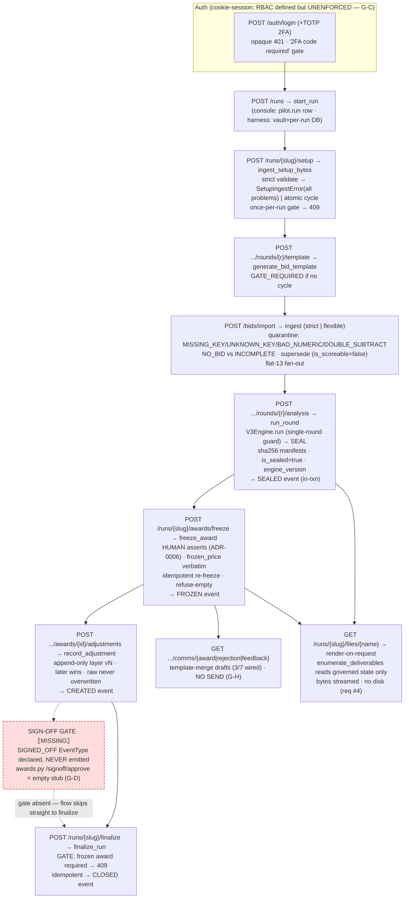

# LAYER 2 — Code · Process · Decision-points (as-built, exhaustive)

This is the synthesized Layer-2 of the exhaustive as-built audit. It honors the AUDIT_STANDARD bar:
every backend module mapped, every process traced end-to-end with EVERY branch/edge case, every
ratified decision D1–D45 (and the key epics E-xx) tied to the file:line that enforces it — or marked
**NOT enforced (drift)**. The ratified-but-unbuilt set is called out explicitly.

> **Two runtimes (ADR-0003), one codebase.** The same `PilotService` is wrapped by (a) the **MCP
> harness** (file vault + per-run DB, the live-run VERIFICATION ORACLE) and (b) the **web console**
> (no server-side files; DB is the single source of truth — CLAUDE.md req #4). The fork is three
> constructor flags: `isolate_db`, `db_runs`, `persist_outputs` (B2 service.py:209-231; B5 pilot_common.py:251).

---

# 1. CODE MAP — every backend module + the route inventory

## 1.1 Module map (one-liner WHY each; grouped by package)

### `app/engine/**` — the pure decision-support math core (B1; Decimal-only, NO db/http/clock/random)
| Module | Responsibility (one-liner) |
|---|---|
| `engine/__init__.py` | Public surface: re-exports the frozen interface trio + `V3Engine` + `DeterministicStubEngine`; curated `__all__` (B1 census 130). |
| `engine/interface.py` | THE FROZEN BOUNDARY — `Engine` ABC `run(inputs)->result`, every `frozen=True` pydantic IO type, `ScenarioCode` A–G, `WeightPreset`, the `PRESET_WEIGHTS` table (each vector sums 1.0). Consumers bind here so the body can be swapped (B1 census 134). |
| `engine/formulas.py` | THE CANONICAL CALC TABLE (E-39) — every cross-layer numeric formula defined ONCE (price construction §7, the four ratios, spend/savings) so no layer re-derives and drifts (B1 census 132). |
| `engine/scoring.py` | The five banded factor scores + weighted `rec_score` (quantize 0.01 HALF_UP) + eligibility gates with reason-code strings (V3 §2/§3/§7) (B1 census 135). |
| `engine/allocation.py` | Scenarios A/B/C/E/F/G as cell→pick maps + the §4 `max_two_per_dc` split (Scenario D) + §6 deterministic tie-break sort + §4.5 concentration flag (B1 census 131). |
| `engine/guards.py` | `assert_decision_support` — the BANNED-words screen; RAISES `BannedDecisionWordError` if a label asserts an award verdict (ADR-0006) (B1 census 133). |
| `engine/v3.py` | `V3Engine` — the REAL brain; orchestrates scoring→allocation→7 lenses→§4.4 cap-breach flag; the single-round guard (TOMATO_RUN fix); `engine_version="v3-cleanroom"` (B1 census 137). |
| `engine/stub.py` | `DeterministicStubEngine` — tagged cost-only placeholder behind the same interface; tags `"stub"` so no stubbed run is mistaken for a v3 run; NOT on the delivered path (V3Engine is the default) (B1 census 136). |

### `app/pilot/**` — the INGEST + ORCHESTRATION spine (B2)
| Module | Responsibility |
|---|---|
| `pilot/__init__.py` | Re-exports `PilotService` + `RunPaths` (B2 census 150). |
| `pilot/service.py` | `PilotService` — the whole-loop conductor (start_run→ingest_setup→template→ingest_bids/any→run_round→freeze_award→record_adjustment→finalize/close); the three runtime flags fork harness vs console (B2 census 157, 2376 ln). |
| `pilot/setup_template.py` | Builds the blank, validated, presentation-quality Setup/Kickoff workbook; SHARES tab/column constants + geometry with the ingester so they never drift (D24) (B2 census 159). |
| `pilot/setup_ingest.py` | `ingest_setup_workbook` — parses the filled Setup workbook → governed cycle; strict validation accumulates ALL problems then raises `SetupIngestError`; clean=atomic write, dirty=nothing written (B2 census 158). |
| `pilot/flex_ingest.py` | Flexible bid ingest — `infer_bid_mapping` (heuristic over the cycle's OWN names + synonyms, never invents identity) + `apply_mapping` (emits a CLEAN key-stamped owned template re-validated by the STRICT path) (B2 census 153). |
| `pilot/deliverables.py` | DB-backed deliverable registry — every output rendered ON REQUEST from governed state with the SAME filenames/bytes as the harness write path (no-file-storage; E-39 data-identity) (B2 census 152). |
| `pilot/vault.py` | Per-RFP Run Vault manager — identical folder scaffold, stage-named files, git commit/push, archive/zip/purge; filesystem + git only, never Postgres (B2 census 162). |
| `pilot/run_db.py` | Per-run database isolation (D30) — create+migrate blank DB per run, dump/restore to the vault SQL snapshot (D34), drop on purge (B2 census 155). |
| `pilot/run_repo.py` | Thin CRUD over the `pilot.run` ORM row; caller's UoW owns the transaction (B2 census 156). |
| `pilot/models.py` | The `Run` ORM (own `pilot` schema) — DB-backed run identity for the stateless console (`cycle_id` plain text, NULLABLE, not FK) (B2 census 154). |
| `pilot/status.py` | Renders RUN.md as the proactive kanban (Done/Doing/Next/Waiting) computed from DB + file presence; DB read-only (B2 census 160). |
| `pilot/synthetic.py` | Synthetic TOMATO cycle builders (the faithful in-memory fixtures) reused by the e2e test AND the deploy seed (B2 census 161). |
| `pilot/backfill_runs.py` | One-shot idempotent CLI to seed `pilot.run` rows for vault-only runs (Slice 2→3 hand-off) (B2 census 151). |

### `app/domain/**` — the governed data layers (B3 ref/cyc/bid; B4 eng/awd/norm/perf/audit)
| Module | Responsibility |
|---|---|
| `domain/ref/{models,repository,schemas,service}.py` | Tenancy keystone + reference dimensions: `ref.client`/`ref.commodity`/`ref.fiscal_period` ORM; tenant-scoped reads (`WHERE client_id=ctx`); add+flush+`CREATED` audit, UoW owns commit (B3). `ref.dc/supplier/item/...` are declared in the init docstring but ORM-mapped out-of-slice. |
| `domain/cyc/models.py` | The cyc schema ORM: kickoff satellites (objective/pricing/scope_item/pba_term/commercial_term/rfi/timeline/narrative/safety) + a PARTIAL map of the baseline spine (round/timeframe/lot/item_scope/lot_item/projected_volume), engine-read columns only (B3). |
| `domain/bid/bid_ingester.py` | The INGEST end (D20/D21): strict `ingest_template`, legacy `ingest_template_resolved`, `ingest_capacity`; §7 `construct_price`; completeness classify; quarantine (B3). |
| `domain/bid/template_schema.py` | The owned template CONTRACT — `BidColumn`/`CapacityColumn` enums, `KEY_ID_COLUMNS`, `ScopeRow`/`CycleScope` with `key_set()` allow-lists (B3). |
| `domain/bid/template_generator.py` | GENERATE end — multi-sheet xlsx, embeds key IDs, hides UUID columns (D23), traffic-light formula, returns bytes (B3). |
| `domain/bid/template_preset.py` | Compose a lean template from the PRICE_COLUMNS superset (D29); unknown→FULL fallback (B3). |
| `domain/bid/period_fanout.py` | Flat-13 fan-out (D38): `fan_out` copies a timeframe payload verbatim onto each covered fiscal period; `fan_out_all` raises on overlap (B3). |
| `domain/bid/legacy_adapter.py` | Migration bridge ONLY — maps a synthetic legacy layout onto the owned Bids grain; the only caller of `ingest_template_resolved` (B3). |
| `domain/bid/models.py` | ORM for `bid.bid_line` (intake target + engine source) + `CapacityStatement`/`CapacityConstraint` (E-38) (B3). |
| `domain/eng/runner.py` | THE SEAM — `EngineRunner.run_analysis`: read-by-key → assemble frozen `EngineInputs` → run pure `V3Engine` (default at runner.py:103) → SEAL (sha256 manifests + write rows); no commit (B4). |
| `domain/eng/models.py` | ORM for `eng.analysis_run`/`bid_score`/`analysis_scenario`/`analysis_scenario_award` (the lightweight SEALED decision-support spine) (B4). |
| `domain/eng/read.py` | JSON read layer for the web alignment screens — reshapes (never recomputes) the workbook's pure gathers so web ≡ Excel (B4). |
| `domain/awd/service.py` | FREEZE + LAYER — `freeze_award`, `add_adjustment`, `effective_award` overlay, `award_versions` (v0→vN); immutable frozen baseline, append-only layers (ADR-0014) (B4). |
| `domain/awd/models.py` | ORM for `award`/`award_line` (frozen baseline) + `award_adjustment`/`award_adjustment_line` (append-only versioned layers) (B4). |
| `domain/awd/read.py` | JSON read layer for post-award screens (same numbers as the post-award doc, reshaped) (B4). |
| `domain/norm/models.py` | `norm.attribute_def` + `norm.lot_attribute` — D14 shared sparse taxonomy; `lot_id` no-FK until `norm.lot` lands (M2/G8) (B4). |
| `domain/perf/models.py` | `perf.itrade_receipt` (43-col iTrade feed, E-08/D11); the D11 actual-paid baseline is a migration-only VIEW (`v_itrade_actual_paid_baseline`) (B4). |
| `domain/audit/{__init__,models}.py` | Design statement: writes go through core/audit; `models.py` defines `AuditBase` only, NO mapped classes (typed read ORM deferred) (B4). |

### `app/core/**` — cross-cutting platform (B5)
| Module | Responsibility |
|---|---|
| `core/config/settings.py` | Typed env-config (pydantic-settings); `get_settings()` `@lru_cache` process-singleton (B5 census 83). |
| `core/db/{base,session,types}.py` | Declarative `Base` + 8-schema convention; `unit_of_work()` (single commit owner, audit-in-same-txn); `Money = Numeric(18,6)`, uuid/created_at helpers (B5 census 84-87). |
| `core/audit/{events,writer,recorder,guards}.py` | `EventType` (9) + frozen `DomainEvent`; `AuditWriter` hash-chain appender (`FOR UPDATE` per-tenant); `client_id_for_cycle/_award` FK-walkers; SQLAlchemy guards refusing to mutate sealed runs / frozen awards (409 immutable), wired at main.py:62 (B5 census 77-81). |
| `core/errors/{taxonomy,handlers}.py` | `ErrorCode` enum + `AppError` + `ProblemDetail`; FastAPI exception handlers → RFC-7807 `application/problem+json`; CORS-on-500 fix (B5 census 88-90). |
| `core/security/{principal,rbac,deps,tenant}.py` | The DESIGNED security boundary — `Principal`, `Role`/`Permission`/`ROLE_PERMISSIONS` matrix, `require_permission` guard, `TenantContext` — **attached to ZERO routes** (B5 census 91-95). |

### `app/auth/**`, `app/comms/**`, `app/output/**`, `app/cycle/**`, `app/fiscal/**` (B6)
| Module | Responsibility |
|---|---|
| `auth/security.py` | Pure auth primitives — argon2 hash/verify, `kr_session` JWT mint/decode, TOTP secret/uri/verify (B6 census 63). |
| `auth/deps.py` | `get_current_user` + `CurrentUser` alias; uniform 401 on every failure branch (B6 census 61). |
| `auth/models.py` | `AppUser` → `auth.app_user` (username unique, password_hash, totp_secret/enabled, is_active) (B6 census 62). |
| `auth/create_user.py` | Idempotent seed/upsert CLI `python -m app.auth.create_user` — bootstrap-first-admin path (B6 census 60). |
| `comms/merge.py` | Pure scalar `[#Name]` parser+filler; a miss leaves a VISIBLE `[#Name]` hole + records `missing` (never silent blank) (B6 census 65). |
| `comms/render.py` | Table-aware render (subject routing tags + `[#XxxTable]` blocks); tables expand before scalars (B6 census 66). |
| `comms/templates.py` | Registry of the 7 `CommsTemplate` touchpoints; bodies loaded VERBATIM from `.txt` (versioned data, not Python) (B6 census 68). |
| `comms/resolvers.py` | Per-touchpoint governed-data context builders + draft generators; DRAFT-ONLY, per-supplier data isolation; NO send (B6 census 67). |
| `output/scenario_workbook.py` | The ~20-tab manipulable alignment Scenario Workbook from a sealed run (D26/D27); the synthetic ×1.04 STLY proxy lives here (B6 census 147, 4280 ln). |
| `output/booking_guide.py` | Post-award booking guide from the FROZEN award (D22) — internal master + per-supplier files for E-37 (B6 census 143). |
| `output/post_award_doc.py` | ADR-0014 versioned post-award adjustments doc (3 tabs); reads baseline+layers, NEVER mutates (B6 census 146). |
| `output/capacity_check.py` | E-38 capacity evaluator — flags allocation beyond stated capacity (PERIOD+WEEKLY); decision-support FLAG only (B6 census 144). |
| `output/formatting.py` | D24 shared xlsx styling pass; number-format vocab; formula-injection guard; decision-support strap (B6 census 145). |
| `output/synthetic.py` | SYNTHETIC region/transit/freight model (`WEEKS_PER_TF=13`); decomposes All-In without changing the landed price (B6 census 148). |
| `output/types.py` | `CycleView`/`Entity` — the in-memory name-resolved scope every generator reads (B6 census 149). |
| `cycle/loader.py` | `load_cycle(session, cycle_id)->CycleView` — governed records → name-resolved view (inverse of the demo seed) (B6 census 97). |
| `cycle/scope.py` | `build_scope_from_cycle(cycle, round_no)->CycleScope` — builds the intake scope the bid template embeds + the ingester validates; round_no validated, never defaulted (B6 census 98). |
| `fiscal/calendar.py` | Authoritative 4-3-3-3 13-period calendar (data-driven from CSV); lookups, timeframe grouping, `expand_to_periods` flat-13 fan-out (B6 census 139). |
| `fiscal/data/kroger_fiscal_periods.csv` | Sponsor period→date table, FY2016–FY2036 × 13 = 273 rows; 4 leap P13 rows (5-week) (B6 census 140). |
| `app/main.py` | FastAPI app factory `create_app`; mounts `/api/v1`, registers handlers + immutability guards; tenant-context middleware STUB (dev principal non-prod, None prod = DEP-4); CORS outermost (B6 census 141). |

### `backend/scripts/**`, `backend/demo/**`, `deploy/gcp/**` (B9)
| Module | Responsibility |
|---|---|
| `scripts/potato_legacy_dryrun.py` | Migration-fidelity DRY-RUN harness: real legacy potato workbook → OUR setup+bid workbooks → full pilot loop → OURS-vs-GOLDEN A–G print → ROLLBACK. **The D45 data-fidelity VIOLATION file** (918 ln) (B9). |
| `demo/run_cycle_demo.py` | End-to-end "see it working" demo on real Postgres with SYNTHETIC (faithful) data; COMMITS on clean exit (B9). |
| `deploy/gcp/deploy.sh` | One-command idempotent GCP Cloud Run + Cloud SQL deploy; runs migrate + seed as Cloud Run jobs (B9). |
| `deploy/gcp/seed.py` | COMMITTING seed driver: admin user + TOMATO synthetic + **POTATO real-data cycle (wires the converter into the deployed DB)** (B9). |

## 1.2 API ROUTE INVENTORY — the LIVE HTTP surface

All routes are `/api/v1`-prefixed (mounted in `main.py`). The console auth is **cookie-session
`CurrentUser`** (`Annotated[AppUser, Depends(get_current_user)]`, auth/deps.py:60). **No route attaches
an RBAC permission guard** (see §3 RBAC drift). The prompt's "26 live routes" is the substantive console
surface; B5 enumerates **28 named live route rows** across four routers (the eng/awd/comms reads on
runs.py push the total up). Reconciliation: `2 health + 5 auth + 24 runs + 2 bids` (B5 §3).

### `api/v1/health.py` (census 55) — 2 routes, UNAUTHENTICATED
| Method | Path | Auth | Service / behavior |
|---|---|---|---|
| GET | `/health` | none | literal `{"status":"ok"}` — no DB (liveness) |
| GET | `/ready` | none | `db.execute(text("SELECT 1"))` (health.py:32); DB outage → catch-all → 500 internal_error (no tailored not_ready) |

### `api/v1/auth.py` (census 50) — 5 routes (console auth)
| Method | Path | Auth | Service / errors |
|---|---|---|---|
| POST | `/auth/login` | **none** (pre-session) | `verify_password`+`verify_totp`; 401 opaque "Invalid username or password." (anti-enumeration); 401 "2FA code required" when 2FA on & code missing/wrong; sets `kr_session` cookie (auth.py:128-141) |
| POST | `/auth/logout` | none | 204; idempotent; `delete_cookie` matching set-attrs |
| GET | `/auth/me` | `CurrentUser` | `_user_view(user)`; 401 if no session |
| POST | `/auth/2fa/enroll` | `CurrentUser` | `generate_totp_secret()` → stores secret, `totp_enabled=False`; returns otpauth_uri+secret |
| POST | `/auth/2fa/verify` | `CurrentUser` | `verify_totp`; 400 if no enrolment in progress; 401 wrong code; flips `totp_enabled=True` |

### `api/v1/runs.py` (census 58) — 24 routes (the console RFP loop); all `CurrentUser`
| # | Method | Path | Service (PilotService) · key errors |
|--:|---|---|---|
| 1 | GET | `/runs` | `list_run_records`+`_board_for` |
| 2 | POST | `/runs` | `svc.start_run` → **201** |
| 3 | GET | `/runs/{slug}` | resolve_run+run_paths; 404 |
| 4 | GET | `/runs/{slug}/files` | `_run_files` (render-on-request projection) |
| 5 | GET | `/runs/{slug}/files/{name}` | `_resolve_deliverable`→`render(db)`; xlsx attachment; 404 |
| 6 | GET | `/runs/{slug}/archive` | `_run_archive_zip` (in-memory zip) |
| 7 | POST | `/runs/{slug}/setup` | `svc.ingest_setup_bytes` (bytes streamed, never on disk); **409** if run already has a cycle |
| 8 | POST | `/runs/{slug}/rounds/{round}/template` | `svc.generate_bid_template`; **400 GATE_REQUIRED** (no cycle) vs **400 VALIDATION_ERROR** (round out of range) via resolve_round_id |
| 9 | POST | `/runs/{slug}/rounds/{round}/analysis` | `svc.run_round(actor=user.username)`; 400 GATE/VALIDATION; **500** if it sealed nothing |
| 10 | GET | `/runs/{slug}/strategy` | `svc.get_strategy`; 400 GATE if no cycle |
| 11 | PUT | `/runs/{slug}/strategy` | `svc.set_strategy` (governed); 400 GATE/VALIDATION; 422 bounds |
| 12 | PATCH | `/runs/{slug}/analysis/{analysis_run_id}` | `svc.name_version` — **NOT governed** (no audit event, E-43); 404 LookupError / 400 ValueError |
| 13 | GET | `/runs/{slug}/analysis` | `svc.list_analyses` — 200 **empty list** (never a gate); 404 no run |
| 14 | GET | `/runs/{slug}/analysis/{id}/scenarios` | `svc.scenario_comparison`; 400 GATE/404 via `_ensure_analysis` |
| 15 | GET | `/runs/{slug}/analysis/{id}/scenarios/{scenario_code}` | `svc.scenario_detail`; 400 VALIDATION on unknown code |
| 16 | POST | `/runs/{slug}/awards/freeze` | `svc.freeze_award` — **governed FROZEN event** (ADR-0006); idempotent re-freeze |
| 17 | POST | `/runs/{slug}/finalize` | `svc.finalize_run` — **governed CLOSED event** (E-42); **409** no frozen award; idempotent |
| 18 | GET | `/runs/{slug}/awards` | `svc.list_awards` — 200 empty list; 404 no run |
| 19 | GET | `/runs/{slug}/awards/{award_id}` | `award_detail`; 404 no cycle/ValueError |
| 20 | POST | `/runs/{slug}/awards/{award_id}/adjustments` | `svc.record_adjustment` — **governed CREATED event** (ADR-0014); 400 VALIDATION off-award/repeated cell; `new_price` → `Decimal(str(...))` (runs.py:914) |
| 21 | GET | `/runs/{slug}/awards/{award_id}/comms/award` | `award_email_drafts` (E-37 draft) |
| 22 | GET | `/runs/{slug}/awards/{award_id}/comms/rejection` | `rejection_email_drafts` (E-37 draft) |
| 23 | GET | `/runs/{slug}/analysis/{id}/comms/feedback` | `feedback_email_drafts` (E-37 draft); 400 GATE/404 |

(B5 records `runs.py` = "24 routes"; the 24th is the create/list pairing — treat the surface as 24.)

### `api/v1/bids.py` (census 52) — 2 routes; all `CurrentUser`
| Method | Path | Service / behavior |
|---|---|---|
| POST | `/bids/import` | multipart `file/run/round/mode∈{strict,flexible}/confirm`; strict→`_ingest_bids_bytes`; flexible+confirm=False→`ingest_any_bytes` proposal (nothing written); flexible+confirm=True→write; bytes streamed, never on disk; 400 GATE/VALIDATION; 404 |
| GET | `/bids` | hand-written `SELECT … WHERE is_scoreable IS TRUE … DISTINCT ON (supplier,dc,lot,item,tf)` — Option-B de-fan from flat-13 storage to identity grain (bids.py:226-280) |

## 1.3 The FOUR empty stub routers — present-but-empty BY DESIGN (dead mounts)

All four define `router = APIRouter()` + a docstring + a `# TODO(phase-X)` and **NO routes**; any path
404s. Their designed capabilities all SHIP elsewhere (freeze/finalize/comms/setup/bid-import on
`runs`/`bids`). Load-bearing only for `router.py:12`'s import (deleting one breaks app start). (B5 §4.)

| Census | File | Prefix | TODO | Designed-but-unbuilt-here |
|---:|---|---|---|---|
| 53 | `cycles.py` | `/cycles` | phase-C | `/cycles` CRUD, `/cycles/{id}/rounds`, Stage-0 in-gate (G12) |
| 51 | `awards.py` | `/awards` | phase-E | `/awards/select` (AWARD_SELECT), `/signoff/approve` (SIGNOFF_APPROVE), draft→SENT (DRAFT_SEND) |
| 54 | `documents.py` | `/documents` | phase-E | `/documents` generate (DOCUMENT_DRAFT) |
| 56 | `ingest.py` | `/ingest` | phase-B | `/ingest/itrade`, `/ingest/kcms`, `/ingest/normalize/propose`+`/confirm` |

> Per DRIFT_RECONCILIATION (D): `awards/cycles/documents` are **dead files, not capability gaps**;
> `ingest.py` is the one that genuinely has **no feed** (iTrade/KCMS importers unbuilt — E-08/E-09).

---

# 2. PROCESSES END-TO-END — every step, every branch/edge case

For each process: the happy-path step list AND its full branch/edge enumeration, with the error
envelope (`gate_required` / `validation_error` / `not_found` / `conflict` / `immutable`) and the
file:line. The governed lifecycle mermaid is at the end of this section.

## 2.1 Auth — login + 2FA (B5/B6)

**Steps (happy path).** POST `/auth/login` with `{username,password,totp_code?}` → ONE lookup by
username → `verify_password` (argon2) → branch on `user.totp_enabled` → mint `kr_session` JWT (HS256,
`{sub,username,iat,exp}`) → set httpOnly+Secure+SameSite cookie (auth.py:_set_session_cookie).
Subsequent requests: `get_current_user` decodes the cookie (auth/deps.py:28).

**Branches / edges.**
- Bad user OR inactive OR bad password → **ALL collapse to the same 401 "Invalid username or
  password."** (anti-enumeration; auth.py:128-141, security/PLAN).
- 2FA enabled + code missing → **401 "2FA code required"**; wrong code → **same 401 detail** (so the UI
  re-prompts, "gate not failure"; `TWO_FACTOR_REQUIRED_DETAIL` at auth.py:37).
- Any cookie/JWT failure (`decode_session_token`→None, non-str/non-UUID `sub`, user None/inactive) →
  **uniform 401** "Session is invalid or expired." (no leak of which check failed; auth/deps.py:24).
- Logout: **204**, idempotent (safe with no session).
- 2FA enrol: stores secret with `totp_enabled=False`; verify: **400 VALIDATION_ERROR** if no enrolment
  in progress; **401** wrong code; flips `totp_enabled=True` only on a valid code (`verify_totp` ±1
  time-step skew, security.py:97). `UserView` NEVER carries `password_hash`/`totp_secret`.

## 2.2 Setup ingest (B2 setup_ingest.py)

**Steps.** Load workbook `data_only=True` → check the 7 required tabs exist → parse Cycle (single row,
strategy knobs) → DCs/Suppliers/Timeframes/Lots&Items → Volumes (cross-refs) → Incumbents (cross-refs)
→ `_Problems.raise_if_any()` → `_write_cycle` (atomic FK-ordered insert) → flush → return `cycle_id`.

**Branches / edges (every drop is a SURFACED problem that aborts — never silent).**
- Missing required tab → abort before any read. No cycle row → abort.
- Rounds ∉ 2..6 → problem (the `cyc.cycle.round_count` CHECK is 2..6).
- Unknown weight preset / product type → problem.
- Duplicate DC/supplier/lot/TF name → problem, row skipped.
- Volume/incumbent cross-ref to an unnamed entity → problem.
- Non-numeric Weekly/Weeks/Routing → problem, row skipped.
- Unparseable date → SILENT default (non-identity metadata only; documented).
- DC/supplier name collision in the shared DB → **REUSE by name** (not an error; shared master data).
- **ANY accumulated problem → `SetupIngestError` (lists ALL problems) and NOTHING is written**
  (atomic; CLAUDE.md req #3 — bad data surfaced as quarantine).
- **Once-per-run gate:** a second ingest → `AppError(CONFLICT, 409)` ("re-ingesting would orphan it").

## 2.3 Template generation (B2/B3)

**Steps.** `load_cycle` → `build_scope_from_cycle(round_no)` → `generate_template_bytes` (multi-sheet
xlsx with embedded key IDs + hidden UUID columns + traffic-light formula). CONSOLE returns the path
(renders on request); HARNESS writes `0X_round{n}_bid_template.xlsx` into inputs/ + kanban + commit.

**Branches / edges.** `round_no` 1-based; `if not (1<=round_no<=len(rounds)): raise ValueError`
(cycle/scope.py:27 — never silently picks a default round). No cycle yet → `ValueError` ("ingest the
setup workbook first") on `_load_cycle`.

## 2.4 Bid ingest — strict + flexible + capacity (B3 bid_ingester.py; B2 flex_ingest + persist)

**Strict steps (`ingest_template`).** Build `valid_keys = scope.key_set()` → per body row read embedded
keys → validate against scope → resolve identity DIRECTLY from keys → name cross-check (warn-only) →
construct price (§7) → classify completeness → build `ParsedBidLine`. Then `_persist_bid_lines`
fans out flat-13 + supersedes any prior submission.

**Price construction (§7) + the double-subtract guard (bid_ingester.py:288-317).**
- `all_in` present AND `lot_discount != 0` → **QUARANTINE `DOUBLE_SUBTRACT`** (do NOT recompute, do NOT
  drop the discount; bid_ingester.py:301-302,456-457). DB backstop `ck_bid_line_no_double_discount`.
- `all_in` present, no discount → **All-In taken VERBATIM** (already net; no arithmetic).
- else `fob` present → `price = FOB + delivery_surcharge + vegcool_surcharge − lot_discount`
  (formulas.py:41, the single shared §7 definition; bid_ingester.py:307-313).
- neither → `price=None` (no-bid/incomplete).

**Completeness classification (bid_ingester.py:320-341).** `price>0` → **BID**; no price-intent AND no
volume → **NO_BID** (a DECLINED cell, NOT a zero); else → **INCOMPLETE**. (`price>0` mirrors the
engine's `<=0` drop — a non-positive price is never stored as a bid.)

**Quarantine reasons — the closed set (exact reason strings + file:line).**
| Reason | Trigger | file:line |
|---|---|---|
| `MISSING_KEY` | blank embedded key cell (bids) | bid_ingester.py:499-503 |
| `MISSING_KEY` | blank key cell (capacity) | bid_ingester.py:706-710 |
| `UNKNOWN_KEY` (alias `KEY_MISMATCH`) | keys not in cycle scope / wrong cycle (bids) | bid_ingester.py:506-514 |
| `UNKNOWN_KEY` | keys not in capacity scope | bid_ingester.py:713-719 |
| `BAD_NUMERIC` | non-numeric price cell (bids) | bid_ingester.py:452-453 |
| `BAD_NUMERIC` | non-numeric / **negative** max (capacity) | bid_ingester.py:724-725,727-731 |
| `DOUBLE_SUBTRACT` | All-In + non-zero Lot Discount | bid_ingester.py:456-457 (guard 301-302) |
| `MISSING_IDENTITY` | blank legacy scope label | bid_ingester.py:580-584 |
| `UNRESOLVED_{SUPPLIER,DC,LOT,ITEM,TF}` | legacy resolver returns None | bid_ingester.py:586-600 |

**Name cross-check (D21).** Key and name both present and differing → `NameMismatchWarning`, but the
row STILL LOADS on keys (names are attributes, never identity; bid_ingester.py:538-561). **Identity is
NEVER name-resolved** on the live path.

**Capacity ingest (E-38, `ingest_capacity`).** Capacity sheet is OPTIONAL — **missing sheet → `[]`**
(bid_ingester.py:675-677, contrast bids which raises `ValueError` if `SHEET_BIDS` missing). Per row:
blank key → `MISSING_KEY`; out-of-scope → `UNKNOWN_KEY`; non-numeric/negative max → `BAD_NUMERIC`;
**both maxes None → no statement** (blank cell ≠ zero); else CELL-scoped `ParsedCapacityLine`. The
ingester does NOT compute an over-cap flag — capacity is stored per-cell to be compared to the engine's
allocation downstream; the `cap_breach_flag` is set by the engine on `eng.analysis_scenario_award`.

**Supersede (ADR-0006).** A prior submission for the same (cycle, round, supplier) → prior lines
`is_scoreable=false`, submission + capacity statement → `SUPERSEDED`, with a `SUPERSEDED` audit event
per prior id (B2 service.py:1778-1843). Append-only; never a hard delete. No double-count: the logical
`count` is per-logical-line, not per fanned row (service.py:1945).

**Flexible ingest (flex_ingest.py).** `confirm=False` → `infer_bid_mapping` returns the proposal,
NOTHING written. Branches: two columns claim one field → ambiguity (keep higher confidence); missing
identity/price column → ambiguity (`is_confident=False`); messy row missing supplier/dc/lot → skipped;
blank/non-numeric price → skipped. `confirm=True` → `apply_mapping` emits a CLEAN key-stamped owned
template → re-validated by the STRICT path (never persisted directly — it only re-shapes). NO
force-positive, NO rounding in `_put_number`.

## 2.5 Engine run / seal (B4 runner.py + B1 v3.py)

**Steps (`run_analysis`).** (1) read-by-key (`WHERE is_scoreable IS TRUE` — supersede not delete) →
(2) assemble frozen `EngineInputs` (Option-B representative-line collapse 13→1 so the input hash is
reproducible, runner.py:246-271) → (3) `V3Engine.run(inputs)` (PURE — single-round guard, scoring,
7 lenses, §4 split, §4.4 cap-breach flag, banned-words screen) → (4) SEAL: sha256 input/output
manifests over the FULL frozen config, write `AnalysisRun(status="SEALED", is_sealed=True,
engine_version, input_hash_manifest, output_hash_manifest)` + scores/scenarios/awards; **no commit**.

**What makes it immutable / reproducible.** `is_sealed=True` + DB CHECK
`ck_analysis_run_sealed_finished` (eng/models.py:176) → append-only (ADR-0006). The
immutability GUARDS (core/audit/guards.py, wired main.py:62) **reject** any UPDATE/DELETE on a sealed
run (**409 immutable**). `engine_version` is the version pin. `_canonical_hash` is order-independent +
str-coerced (no float) so the same inputs always hash identically. **Re-runs become NEW runs** — each
`run_analysis` mints a fresh `analysis_run_id`; `list_analyses` offers only sealed versions with a
1-based ordinal.

**Branches / edges.** Single-round cycle (`prior_round_code is None`) → empty prior-price map, **no
crash** (the v3 latent defect fix, v3.py:145-147; TOMATO_RUN). Empty inputs → empty awards (no crash).
Award with `awarded_price<=0` → **SKIPPED** (runner.py:433-434, honours `ck_analysis_award_price_positive`
— a SKIP, never a force-positive). The governed seal + `SEALED` event always run; the vault
side-effects (alignment workbook, kanban, run_data, commit) are gated by `persist_outputs` (B2).

## 2.6 Freeze + adjustment layering (B4 awd/service.py)

**Freeze steps.** `freeze_award` reads the human-selected scenario's split rows from
`eng.analysis_scenario_award` → writes `Award(status="FROZEN")` + one `AwardLine` per row with
`frozen_price` copied VERBATIM (the immutable baseline) → emits the `FROZEN` audit event (ids+counts
only, G-B; awd/service.py:154-171). The HUMAN asserts the award (ADR-0006 — the engine only proposes).

**Freeze branches / edges.**
- **Idempotent re-freeze:** an Award already exists for (cycle, run, scenario) → return the existing
  `award_id`, write NOTHING (no dup, no second event; backed by UNIQUE `uq_award_cycle_run_scenario`;
  awd/service.py:88-96).
- **Refuse-empty:** scenario has no award rows → `ValueError("...nothing to freeze...")` BEFORE any
  write (no bogus zero-line FROZEN award; awd/service.py:118-122). API surfaces 400 VALIDATION_ERROR; a
  typo'd scenario "writes nothing" (test-guarded).
- Tenant unresolvable (`client_id_for_cycle`) → ValueError → whole freeze rolls back (same txn).

**Adjustment layering steps (`add_adjustment`, ADR-0014).** `next_version =
COALESCE(MAX(version_no),0)+1` (first layer = v1; **v0 is the frozen baseline, synthesised not stored**)
→ compute `prior_by_cell = effective_award(...)` BEFORE writing → write
`AwardAdjustment(status="RECORDED")` + per-cell `AwardAdjustmentLine(prior_price, new_price,
delta=new_price−prior)` → emit `CREATED` event (ids+counts only). **Later layers WIN; the raw frozen
baseline is NEVER mutated.** `effective_award` overlays layers in `version_no` order (optionally
`as_of_version`). Branches: cell with no baseline → prior=0; empty `line_changes` → valid no-op header;
bogus award_id → rollback. A re-price is a NEW row, never an UPDATE (supersede semantics).

## 2.7 Finalize / close-out (B2 service.py)

**Steps (`finalize_run`).** GATE: a FROZEN award for the run's cycle is REQUIRED → pick the earliest
FROZEN award → `won = len(award_email_drafts)`, `not_won = len(rejection_email_drafts)` (reuse the SAME
render-on-request generators so counts can't diverge) → append a governed `CLOSED` `DomainEvent` (entity
= the cycle, ids+counts only, E-42).

**Branches / edges.** No cycle → **409**; no frozen award → **409**; already CLOSED → **idempotent
no-op** (same summary, NO second CLOSED event, no forked audit chain). Does NOT persist a file, does NOT
delete the run. `close_run` (vault) archives then the skill confirms then `purge_run` (folder gone;
governed Postgres records REMAIN; the archive preserves history).

## 2.8 Deliverable render (B2 deliverables.py)

**Steps.** `enumerate_deliverables(cycle_id, slug, rehearsal)` reads ONLY governed state
(`cyc.*`/`eng.*`/`awd.*`, NEVER the vault) → one `Deliverable` per item with the SAME `stage_filename`
and a deferred `render(session)->bytes`. On request, `render` rebuilds the EXACT view inputs the harness
write path used (E-39 data-identity), streams bytes, writes nothing to disk.

**Branches / edges.** No cycle → setup only. No sealed analysis → no alignment items. No frozen award →
no guides/post-award. v0-only award → no post-award doc. `rehearsal` stamps SYNTHETIC on every artifact.

## 2.9 Comms (E-37) — deterministic template-merge, NOT AI (B6)

**Steps.** Buyer authors `.txt` templates with `[#Placeholder]` tokens → resolver builds the
governed-data context → `merge`/`render` fills tokens (tables expand first, then scalars). A miss
leaves a VISIBLE `[#Name]` hole AND records `missing` — never a silent blank, so a draft can be refused
while `missing` is non-empty (comms/merge.py:68-74). Per-supplier data isolation (a supplier never sees
another's file/data; resolvers.py:122-126).

**Branches / state.** **3 of 7 touchpoints are WIRED** (have a resolver + service caller + route):
`award` (route 21), `rejection` (route 22), `feedback` (route 23). **4 of 7 are UNROUTED** — INVITATION,
TEMPLATE, INCOMPLETE_BID, PBA have authored templates + TableSpecs but **no resolver, no caller, no
endpoint** (render-ready, not wired; E-37 increment). **SEND is NOT built** — everything is draft-only
("the buyer reviews/edits/sends"); the `DRAFT_SEND` permission + draft→SENT transition belong to the
unbuilt `awards.py` stub. `feedback_drafts` threshold resolution uses `is not None` (honours an explicit
0 ceiling/floor); one hard-ask row per breached gate.

## 2.10 Error envelopes (RFC-7807 `application/problem+json`; B5 core/errors)

`ErrorCode` taxonomy (taxonomy.py): `unauthenticated, forbidden, tenant_mismatch, validation_error,
not_found, conflict, immutable, gate_required, quarantined, internal_error`. Clients branch on `code`,
never message; messages never carry commercial values / cross-tenant ids. Surfacing:
- **`gate_required` (400) vs `validation_error` (400)** distinguished ONCE in
  `pilot_common.resolve_round_id` (pilot_common.py:91-105): no cycle → GATE_REQUIRED ("ingest the setup
  workbook first"); round out of range → VALIDATION_ERROR. Reused by every round-scoped route.
- **`not_found` (404):** `resolve_run` (no `pilot.run` row), `_resolve_deliverable`, `_ensure_analysis`.
- **`conflict` (409):** setup (run already has a cycle), finalize (no frozen award).
- **`immutable` (409):** audit/guards.py on any sealed-run / frozen-award mutation or delete.
- Pydantic validation → **422** `validation_error` with `errors=[{loc,msg}]`; catch-all → **500**
  `internal_error` (with the CORS-on-500 fix so the console doesn't see an opaque CORS error).

## 2.11 The governed lifecycle — mermaid

> **The MISSING gate.** The designed lifecycle is setup→intake→analysis→freeze→**sign-off**→finalize.
> The sign-off gate is **not built**: `SIGNED_OFF` is a declared `EventType` that is emitted NOWHERE
> (B4 §5), and `awards.py /signoff/approve` is an empty stub (B5 §4). The console flows
> freeze→adjust→finalize with no portfolio sign-off / savings-vs-STLY gate (E-22 / G-D).

---

# 3. DECISION-ENFORCEMENT INDEX — every D1–D45 + key epics → enforced where, or DRIFT

Status legend: ✅ enforced in code (with file:line) · ◐ partial/below-bar · ⬜ ratified-but-unbuilt
(deferred) · 🔴 drift/violation · 📝 ratification status only (no code surface).

## 3.1 Decisions D1–D45

| D | Title (abbrev) | Status | Enforced / where (slice · file:line) |
|---|---|:--:|---|
| D1 | Clean-room reconciliation (ADR-0001) | ✅ | `backend/` never imports `reference/`; AST guard `test_cleanroom_import.py` (B8b); v3 lifted from spec (B1 v3.py:2-4) |
| D2 | Adopt v3 (Option A) (ADR-0006) | ✅ | `V3Engine` is the runner default (B4 runner.py:103); `engine_version="v3-cleanroom"` (B1) |
| D3 | Pricing placement & safeties | 📝 OPEN | engine-safety knobs ingested to `cyc.cycle` (B2 setup_ingest); pricing-safety TERMS stored, engine ignores (D13) |
| D4 | Outward sequence (award→freeze→signoff→outputs) | ◐ | award→freeze→outputs built; **sign-off step missing** (E-22/G-D) |
| D5 | Net-new enterprise scope (tenancy/RBAC/NFR) | ◐ | designed (core/security) but RBAC/RLS unenforced (see D8 + G-C) |
| D6 | React/Next.js SPA (ADR-0002) | ✅ | frontend (Layer-3) |
| D7 | Plan-then-scaffold (ADR-0003) | 📝 | process decision |
| D8 | Multi-tenant-capable, single-operated (ADR-0004) | 🔴 DRIFT | `client_id` on a couple of `ref` tables only; **NO RLS**; `unit_of_work` issues no `SET LOCAL` tenant GUC (B5 db/session.py); `ref.commodity.client_id` NULLABLE (B4 R-PD5) |
| D9 | One pricing model / RFP + item participation | ✅ | `CyclePricing` PK cycle_id; `CycleScopeItem.participates` (B3 cyc/models.py) |
| D10 | Split awards (auto max-2 + manual per-cell) | ✅ | Scenario D split (B1 allocation.py:251); `eng.analysis_scenario_award.volume_share` (B4) |
| D11 | Incumbent + historical baseline (+ iTrade) | ◐ | incumbent continuity wired (B4 runner.py:317); iTrade baseline is a migration VIEW with **no live consumer** → STLY runs on a synthetic ×1.04 proxy (output/scenario_workbook; G-F) |
| D12 | Period-grain storage, file-driven display (ADR-0013) | ✅ | flat-13 storage (D38); display TF-grain |
| D13 | Pricing safeties = contract terms, NOT engine inputs (ADR-0014) | ✅ | `CycleSafety` TERMS-only; engine does NOT consume (B3 cyc/models.py:256-280) |
| D14 | One shared attribute catalog, sparse | ✅ | `norm.attribute_def`+`norm.lot_attribute` (B4 norm/models.py:30-67) |
| D15 | Gate-closure backup export (DR) | ⬜ | E-31, deferred |
| D16 | AI assistant (read-only) | ⬜ | E-32 wish-list, P3 |
| D17 | Reference files = AS-IS evidence | ✅ | owned template design, no reference import (B3) |
| D18 | Strategy-agnostic platform (ADR-0016) | ✅ | every knob in `EngineConfig`; preset remap on setup (B1 interface.py; B2 _apply_cycle_preset). Minor latent: `single_supplier_per_lot` not branched; `rec_type` two hardcoded literals (B1 §3) |
| D19 | NOT MVP — full-fidelity prototypes | ◐ 🔴 | engine+governed spine full-fidelity (B1/B4); **but 4 frontend MVP-cuts + the potato converter violate it** (DRIFT_RECON B; stale "stub" docstrings B2 §L2-DRIFT) |
| D20 | Round-trip ingest (system ingests its own files) | ✅ | one template contract (B3 template_schema) + generator + `ingest_template`; `test_round_trip.py` (B8b) |
| D21 | Explicit key IDs; never guess identity | ✅ | `KEY_ID_COLUMNS`; `_parse_keyed_row` quarantines unknown keys, name-mismatch warns-not-resolves (B3 bid_ingester.py:487-561) |
| D22 | Booking guide = final post-award output, 2 audiences | ✅ | `output/booking_guide.py` internal + per-supplier (B6) |
| D23 | Human outputs render NAMES, never key IDs | ✅ | `_hide_columns` (B3 template_generator.py:79-83); name index in `export_run_data` (B2); booking/scenario by name |
| D24 | Presentation-quality outputs | ✅ | `output/formatting.format_table` + setup_template `_render_tab` (B6/B2) |
| D25 | Live interactive scenario | ✅ | scenario_workbook (D26/D27) + frontend alignment (Layer-3) |
| D26 | Scenario workbook = alignment/comparison tool | ✅ | `output/scenario_workbook.py` (B6) |
| D27 | Manipulable analytical surfaces | ✅ | scenario_workbook pivots/drill/custom-scenario (B6) |
| D28 | Explanatory text = engine's computed reason (never LLM) | ✅ | rec_type sealed (B4 runner.py:448; eng/read.py); comms is template-merge not AI (B6) |
| D29 | Bid column set is a SUPERSET; processes use a subset | ✅ NOTE | `template_preset` from PRICE_COLUMNS superset (B3) |
| D30 | Per-run data isolation (blank, no cross-run) | ✅ NOTE | `run_db.py`; `start_run` provision / `purge_run` drop / snapshot+rehydrate (B2); `test_run_isolation` (B8a) |
| D31 | 3-agent MCP harness | 📝 NOTE | WEB_DEPLOYMENT.md; mcp/ (out of backend slices) |
| D32 | Version isolation (pinned head) | ✅ NOTE | `provision_run_database` migrates to head; restore without migrate (B2 run_db.py) |
| D33 | Scenario B MAY breach cap (FLAGGED); D hard-enforces | ✅ NOTE | B-flag `_breach_set` flags never rejects (B1 v3.py:280-292); `cap_breach_flag` on award (B4 eng/models.py); D split is the hard cap (B1 allocation.py:251) |
| D34 | Run DB rides the vault git as a SQL snapshot | ✅ NOTE | `snapshot_run`/`rehydrate_runs` (B2); `test_vault_autopush` (B8a) |
| D35 | Kroger fiscal calendar stored authoritatively | ✅ NOTE | `fiscal/calendar.py` data-driven from CSV; 273 rows, 4-3-3-3, 53-week leap (B6); `ref.fiscal_period` seed parity test (B8b) |
| D36 | One shared governed DB, per-run scoping (console) | ✅ NOTE | natural-key reuse-by-name (B2 setup_ingest; B3 ref); `db_runs` console fork (B5 pilot_common) |
| D37 | As-Built Audit event-triggered + release gate | 📝 | governance (D1 02 §8 / 07) |
| D38 | Flat-13 period storage (Option B) | ✅ | `period_fanout.fan_out`+overlap guard (B3); `_persist_bid_lines` fan-out (B2 service.py:1898-1944); de-fan read (bids.py); `test_period_import.py` (B8b) |
| D39 | As-Built Audit = living model of reality | 📝 | governance |
| D40 | Hosting GCP (Cloud Run + Cloud SQL) (ADR-0017) | ✅ | `deploy/gcp/deploy.sh` (B9) |
| D41 | DB is SoR; deliverables render on request (ADR-0018) | ✅ | `deliverables.py`; `persist_outputs=False` console (B2/B5); `test_downloads.py`/`test_bids.py` no-disk proofs (B8a) |
| D42 | Price-component grain by surface | ◐ | components stored on bid_line; full per-period granulation parked behind the live-test freeze (D44; B9/D1) |
| D43 | Pricing modality (FOB/DELIVERED/XDOC) + cost breakdown | ◐ | price_basis carried (`ALL_IN`/`COMPONENT_FALLBACK`); modality knob parked (E-44; D1) |
| D44 | Live-test spec freeze + DRY/LIVE tiers | 📝 | governance (D1 PRE_TEST_READINESS) |
| D45 | Operating contract operationalized; data fidelity = NO-MVP | ✅ contract / 🔴 1 open violation | CLAUDE.md + agent injection (this audit honors it); the **potato converter is the one open D45 violation** (§4) |

## 3.2 Key epics E-xx

| Epic | Title (abbrev) | Status | Where |
|---|---|:--:|---|
| E-05 | Live audit hash-chain (G-B) | ✅ closed | `AuditWriter` (B5 writer.py); `test_decision_events.py` (B8b) |
| E-18 | v3 5-factor scoring + eligibility | ✅ | `engine/scoring.py` (B1); golden test (B8b) |
| E-19 | Scenarios A–G | ✅ | `engine/allocation.py` + v3 (B1) |
| E-20 | Split allocation + cap-breach | ✅ operational | allocation.py:251 + `_breach_set` (B1) |
| E-21 | Award → freeze → layer | ✅ | `awd/service.py` (B4) |
| E-22 | Portfolio sign-off + savings-vs-STLY | ⬜ 🔴 | **NOT built** — `SIGNED_OFF` never emitted (B4 §5); `awards.py /signoff` empty stub (G-D) |
| E-37 | Supplier comms (6+ touchpoints, mechanism) | ◐ | 3/7 wired (award/rejection/feedback); 4/7 unrouted; **NO send** (B6; G-H) |
| E-38a/b | Capacity ingest + persist + check | ✅ done | `ingest_capacity` (B3); `capacity_check` workbook tab (B6); E-38c dashboard deferred |
| E-39 | Canonical formula registry | ✅ | `engine/formulas.py` (B1); render-on-request data-identity (B2) |
| E-42 | Stateless storage (DB SoR, render on request) | ✅ done | `deliverables.py`; finalize CLOSED (B2); `test_downloads`/`test_bids` (B8a) |
| E-43 | Version savepoints + compare + ROUND/FINAL marker | ✅ built | `name_version` no-audit savepoint (B2; runs.py:12); `test_version_save.py`/`test_award_read.py` (B8) |
| E-08/E-09 | iTrade / KCMS importers | ⬜ | `ingest.py` empty stub (B5); `perf.itrade_receipt` mapped but **no consumer** (B4) — STLY on a synthetic proxy |
| E-29 | Safety reprice + USDA market feed | ⬜ | 5 safety types STORED, never computed (B3 cyc/models.py); no reprice engine path |
| E-33 | PBA / contract builder | ⬜ | template only; `documents.py` empty stub (B5) |

## 3.3 RATIFIED-BUT-UNBUILT (the explicit deferred / decorative set)

- **RBAC (G-C) — zero-enforced.** `Role`/`Permission`/`ROLE_PERMISSIONS` + `require_permission` fully
  defined (B5 rbac.py:62-151) but attached to **ZERO routes** (grep over `app/api/**` empty). Any
  signed-in `CurrentUser` can call freeze/finalize/set-strategy/adjust (runs.py 16/17/11/20). Highest-
  severity drift. (DRIFT_RECON C; B5 §1.)
- **Sign-off gate (E-22/G-D) — `SIGNED_OFF` EventType declared, NEVER emitted** (B4 §5). The portfolio
  sign-off + savings-vs-STLY gate is the MISSING lifecycle step.
- **`SENT` + `GATE_APPROVED`** EventTypes also declared, emitted NOWHERE (3 dead governance hooks of 9).
- **iTrade dormant (E-08/G-F).** `perf.itrade_receipt` mapped, `v_itrade_actual_paid_baseline` is a
  migration VIEW with **no live read** → savings-vs-STLY runs on the synthetic `×1.04` proxy
  (`_STLY_UPLIFT`) in `output/scenario_workbook.py` (B6 census 147:415,444,4019; backlog note).
- **Safety reprice absent (E-29).** 5 safety TYPES stored (`cyc.cycle_safety`), never computed; no
  USDA/market feed consumer (B3; DRIFT_RECON C).
- **Tenancy / RLS (D8/G-J).** Decided "client_id on every row + RLS"; built as client_id on a couple of
  `ref` tables, **no RLS**, no tenant GUC on the session (B5 db/session.py; DRIFT_RECON B3).
- **Setup-ingest + capacity-ingest UNAUDITED.** Two governed write-points emit **no audit event** (the
  audit layer itself flags this; B4 §5 confirms no emit-point inside `bid_ingester`; DRIFT_RECON B4).
- **Baseline solver spine dormant.** `eng.calculation_run`/`eng.scenario`/`eng.scenario_award` (the M0
  heavyweight solver) are SQL-managed, NOT ORM-mapped; the runner writes the lightweight sealed spine
  instead (B4 eng/models.py:16-18) — a documented grep-trap (D1 anomaly 10).

---

# 4. DRIFT & GAP REGISTER (consolidated)

Merges DRIFT_RECONCILIATION + every gap the slices flagged. Severity: 🔴 violation/highest · 🟠 medium ·
🟡 low/cosmetic.

| # | Finding | Sev | Ref (slice · file) |
|--:|---|:--:|---|
| 1 | **Potato converter D45 data-fidelity VIOLATION — live, committed to prod.** `potato_legacy_dryrun.py`: single Delivered round only (drops FOB/multi-round, :346-373, emits `Rounds:2` at :438 but only ingests round 1); **141 demand rows dropped** (:321-323); regions flattened to forced closed set unknown→"Central" (:99-114, :451); **Lot Name == raw Lot_ID** (:460); values **force-positived** `_as_positive` (:145-154, applied :597-611); `weight_preset` hardcoded "balanced" (:221). **`deploy/gcp/seed.py::seed_potato` imports it (:211) and drives it through the COMMITTING console path (`_drive_console_cycle` commits :169)** — so the violation MATERIALIZES the POTATO cycle the console shows. D45 ordered it rebuilt faithfully FIRST; unmet. | 🔴 | B9; DRIFT_RECON B1; verified seed.py:211 |
| 2 | **4 frontend MVP-cuts violate D19/NO-MVP** — A1 Cycle Setup/Strategy (thin panel, weights read-only, no scope read-back/lens-select/generate gate, no `/setup` route); A3/M1 column mapper confirm-only not editable; M5 quarantine surface-only no fix-and-retry; alignment single-matrix (missing diligence tabs + B6 landed view + B5 filter-recompute). | 🔴 | DRIFT_RECON B2 (Layer-3) |
| 3 | **RBAC defined, ZERO enforcement (G-C).** `require_permission`+matrix attached to no route; governed transitions callable by any session. | 🔴 | B5 rbac.py:62-151; §1 |
| 4 | **Sign-off gate decorative (E-22/G-D).** `SIGNED_OFF` declared, never emitted; `awards.py /signoff` empty stub. | 🔴 | B4 §5; B5 §4 |
| 5 | **Tenancy drift (D8/G-J).** client_id on a couple of `ref` tables, **no RLS**, no tenant GUC on the UoW; `ref.commodity.client_id` NULLABLE. | 🟠 | DRIFT_RECON B3; B5 db/session.py; B4 R-PD5 |
| 6 | **2 governed write-points outside the audit hash-chain.** setup-ingest + capacity-ingest emit no event. | 🟠 | DRIFT_RECON B4; B4 §5 |
| 7 | **`bid_line.fiscal_period_id` is `varchar(36)` not `uuid`+FK** to `ref.fiscal_period` — D38 cleanup; no DB integrity between bid line and the governed period. | 🟠 | B4 bid/models.py:54-56; DRIFT_RECON B5 |
| 8 | **iTrade dormant → STLY on synthetic ×1.04 proxy** (`_STLY_UPLIFT`). `perf.itrade_receipt` mapped, no consumer; baseline is a migration VIEW only. | 🟠 | B4 perf/models; B6 scenario_workbook:415,444,4019; DRIFT_RECON C |
| 9 | **Safety reprice + USDA feed absent (E-29).** 5 safety types stored, never computed. | 🟠 | B3 cyc/models.py:256-280; DRIFT_RECON C |
| 10 | **Baseline solver spine dormant** (`eng.calculation_run`/`scenario`/`scenario_award`) — SQL-managed, unmapped; runner writes the lightweight sealed spine. A naming grep-trap (DORMANT vs ACTIVE `eng.*`/`awd.*`). | 🟠 | B4 eng/models.py:16-18; D1 anomaly 10 |
| 11 | **norm persistent lot store dormant** (`norm.lot`/`item_lot_map`/`source_artifact`/`normalization_run` migration-only; only the attribute catalog mapped). `norm.lot_attribute.lot_id` no-FK until `norm.lot` lands (M2/G8). | 🟠 | B4 norm/models.py:51-53 |
| 12 | **audit typed READ models unbuilt.** `audit/models.py` = `AuditBase` only; reads use raw SQL (write path IS functional). | 🟠 | B4 §domain/audit |
| 13 | **runner emits no audit event AND never sets `eng.analysis_run.label`.** A direct (non-pilot) runner caller seals an unnamed, unaudited version (SEALED + E-43 name applied only on the pilot path). | 🟠 | B4 runner.py:155-168 (D-DRIFT-3) |
| 14 | **4/7 comms touchpoints unrouted** (INVITATION/TEMPLATE/INCOMPLETE_BID/PBA) — templates+TableSpecs exist, no resolver/caller. **SEND not built (G-H).** | 🟠 | B6 resolvers.py; templates.py |
| 15 | **STALE "PART B = NotImplementedError stubs" docstrings.** `pilot/__init__.py:7-9` + `service.py:8-17` — PART B is fully implemented (grep finds only the prose). Code satisfies D19; the prose lies. | 🟡 | B2 §L2-DRIFT |
| 16 | **STALE "present-but-empty stub" package docstrings** — `eng/__init__`, `awd/__init__` (+ `cyc`/`bid`/`norm`/`perf` self-label "stub") though all carry models/service/read. | 🟡 | B4 D-DRIFT-1; B3 |
| 17 | **DUPLICATED `_stage` numbering** — `deliverables._stage` re-implements `PilotService._stage` (they AGREE today; drift RISK if one changes). | 🟡 | B2 §L2-DRIFT |
| 18 | **Stale `router.py:3-6` docstring** lists `bids`/`runs` as "present-but-empty" though both are fully implemented. | 🟡 | B5 §2 |
| 19 | **Divergent stage classifiers** — ingester `_classify` (BID/NO_BID/INCOMPLETE) vs generator traffic-light Excel formula (Complete/Incomplete/Not bid); intentionally parallel but different vocabularies; the mapping is implicit, not shared in code. | 🟡 | B3 bid_ingester.py:320-341 vs template_generator.py:164-219 |
| 20 | **runner omits `all_lot_discount`?** DRIFT_RECON B6 flags `runner.py:300-306` may omit `all_lot_discount` (possible silent under-count). **B4 re-read finds NO omission** — lines 300-306 pass `lot_discount` verbatim; `all_lot_discount` is a fallback-branch field the runner doesn't surface. **Unresolved conflict** between the triage note and the B4 slice; needs a direct check. | 🟡 | DRIFT_RECON B6 vs B4 runner.py:300-306 |
| 21 | **`EngineConfig.single_supplier_per_lot` latent** — declared knob, NOT branched (single-winner-per-cell implemented unconditionally; a `False` value has no effect). | 🟡 | B1 §3 interface.py:155 |
| 22 | **`rec_type` two hardcoded literals** (`prem<=0.02`, `cov>1.2`) inside an otherwise config-driven function (minor ADR-0016 drift; affects a B label only). | 🟡 | B1 §3 allocation.py:109,111 |
| 23 | **Orphan bytecode** `engine/__pycache__/read_views.cpython-312.pyc` with no source (harmless; never imported). | 🟡 | B1 §0.3 |
| 24 | **Census omission** — `HANDOVER.md` + `VAULT.md` not in `FILE_CENSUS.md` (census generated 18:52Z; both committed 18:54Z) — violates "every file listed." | 🟡 | D1 anomaly 1 |
| 25 | **README / 07 internal staleness** — README cites "D1..D39/E-00..E-27/~28 routes" (now D45/E-44/29); 07 §12.3 reads "v1.24" under a v1.26 header; "86 vs 87 tables". Coarse front-doors. | 🟡 | D1 anomalies 7,8 |
| 26 | **Two distinct 7-phase models** (05 build phases 0/A–F vs 08 release phases 1–7) — easy to conflate ("Phase B" ≠ "Phase 1"). | 🟡 | D1 anomaly 5 |
| 27 | **DATA_AND_PROCESS_MAP stale on finalize/CLOSED** (v1.0 02:11 calls it a GAP; 07 v1.26 02:32 records it BUILT) — governed by "07 wins" disclaimer. | 🟡 | D1 anomaly 2 |
| 28 | **DESIGN_BRIEF hosting drift** (Vercel/"not Azure" vs D40 GCP) — disclaimed advisory. | 🟡 | D1 anomaly 6 |
| 29 | **CROSSWALK.md / token drift** — named by the prompt; **NOT found** in B3/B4. Unverifiable from these slices (likely a Layer-1/schema-slice concern; flag for the schema synthesizer). | 🟡 | B3/B4 absent |
| 30 | **Timezone inconsistency** — eng/awd use naive `timestamp`; norm/perf use `timestamptz` (two clock conventions). | 🟡 | B4 §9 |
| 31 | **ci.yml deferred legs** (main→build-push→deploy commented out pending DEP-4); demo/output checked-in artifacts can go stale; backend/README "Docker migrates then serves" wrong. | 🟡 | B9 §A5 |

---

# 5. TEST-COVERAGE MAP — what's guarded vs ungated

## 5.1 GUARDED (test → invariant)

**Golden-master (the numeric oracle).** `tests/engine/test_engine_golden.py` (295 ln, PURE) asserts
`V3Engine().run(build_inputs())` reproduces `golden_expectations.json` (102 ln) EXACTLY — values traced
BY HAND from the V3 spec band tables (clean-room), via the `golden_fixture.py` synthetic fixture (283 ln).
**Pinned numbers (exact):** default weights 0.35/0.25/0.20/0.10/0.10; price-band recs (LP01/02 80.00
eligible, LP07 52.00 NOT eligible "Price premium exceeds threshold"); coverage-band (LC01 55.00
ineligible "Insufficient volume (<80%)", LC06/07 80.00, >1.20 step-down 78.75); historical-band (LH01/02
90.00 … LH06 74.00, no-baseline 80.00); zrisk (z-low 60 "Low price outlier", z-high 40 "High price
outlier"); continuity (incumbent rec 90.00 vs rival 80.00); cost (fallback 95.00 = 90+5+3−2−1;
double-subtract 95.00 — Lot 2 NOT re-subtracted; zero-price ineligible "No valid price"); scenario_a SX0
@ 100.00; scenario_d split top-2 {S31,S33}, LT03→S32 `fallback=true`; scenario_c retains incumbent S70;
concentration `["S50"]`; **cap_breach `["DC11","TF1"]`**; weight_renorm raw sum 1.20 → 0.35/0.25/0.20/0.10/0.10;
`engine_version == "v3-cleanroom"` + determinism (`test_engine_is_deterministic_and_versioned`).
Golden fixture paths: `backend/tests/engine/{golden_expectations.json,golden_fixture.py,test_engine_golden.py}`.

**Flat-13 invariant.** `bid/test_period_fanout.py` (PURE — full-year→1..13, payload deep-copied, overlap
rejected, 4+3+3+3=13). `bid/test_period_import.py` (504 ln, INTEGRATION) — THE STORAGE GUARD:
`len(all_rows) == n_lines * n_periods`, distinct cells == n_lines; AND the HARD invariant
`test_period_grain_storage_leaves_engine_output_unchanged` — `_representative_lines` collapses fanned
rows → exactly n_lines, engine-facing inputs IDENTICAL, `eng.bid_score == n_lines`,
`eng.analysis_scenario == 7`, alignment body rows == n_lines; plus unmappable-tf NULL fallback +
resubmission-supersedes-in-every-read. `test_pilot_cycle_e2e::test_resubmission_supersedes_prior`
(scoreable 8×4, superseded 8×4, distinct cells 8, run_round scores exactly 8 — no doubling).
`ref/test_fiscal_period_table.py` (DB count 273 = FY16..36) + `fiscal/test_calendar.py`.

**Versioning math.** `awd/test_post_award_versioning.py` (383 ln) — full ADR-0014: freeze baseline
(100.00/120.00), idempotent re-freeze same award_id, v1 MARKET_HIKE 100→108, v2 TOLERANCE_BAND 108→112,
`effective_award` overlay, `as_of_version=1` time-travel, **prior-price chaining** (v2 prior = v1
effective 108 not frozen 100), history [0,1,2], byte-stable doc. `awd/test_award_read.py` (read layer,
names resolved D23, cross-run scoped). `api/test_version_save.py` (PATCH names a version, NO audit event,
NO award; empty→422, whitespace→400). `api/test_alignment.py` (2nd analysis → version==2; list oldest-first).

**Engine scoring/scenarios/cap-breach.** `engine/test_engine_golden.py` (bands, gates, A–G, split D +
fallback, cap-breach `test_cap_breach_surfaces`/`test_cap_breach_consistent_across_scenarios`,
concentration, cost fallback+double-subtract, renorm, determinism). `engine/test_engine_invariants.py`
(banned-word guard raises, never names a single winner, shares 0..1, A always present, B-only rec_type
∈ the 5 labels). `engine/test_engine_single_round.py` (single-round completes — the exact v3 bug).
`engine/test_engine_stub.py` (purity/clean-room, stub tags "stub" vs "v3-cleanroom").
`engine/test_formulas.py` (§7 math exact). `engine/test_input_manifest.py` (C2 — sealed hash covers FULL
config). `engine/test_runner_incumbent.py` (incumbent per-cell not per-supplier). `comms/test_formulas.py`.

**Bid ingest quarantine/completeness/supersede/capacity.** `bid/test_round_trip.py` (305 ln — grain+
component round-trip exact; tampered key→UNKNOWN_KEY; blank→MISSING_KEY; name mismatch warns). 
`bid/test_completeness_and_guards.py` (no_bid placed-not-dropped, DOUBLE_SUBTRACT quarantine, unknown
supplier NAME warns-not-quarantines). `bid/test_legacy_resilience.py` (UNRESOLVED_SUPPLIER; No Bid →
landed None not zero). `bid/test_capacity_round_trip.py` (blank-is-not-zero, tampered→UNKNOWN_KEY,
missing→MISSING_KEY, negative→BAD_NUMERIC). `bid/test_capacity_persist.py` (CELL constraints, resubmit
supersedes). `output/test_capacity_check.py`/`test_capacity_tab.py`/`test_line_price.py`.

**Setup ingest atomicity.** `tests/pilot/test_pilot_setup.py` (scaffold identity, 7 tabs+dropdowns, full
round-trip with exact counts + incumbent baseline 11.20; second setup → 409 prior cycle untouched;
unresolved rows surfaced — quarantine not drop). `test_pilot_cycle_e2e.py` (safeties layer over preset;
unknown preset rejected at ingest; preset remaps weights).

**Sealed immutability + audit decision events.** `audit/test_decision_events.py` (286 ln) — hash-chain
emits IMPORTED/SEALED/FROZEN/CREATED (exactly 2 IMPORTED for 2 suppliers); contiguous seq, genesis prev
`"0"*64`, recomputed hash == stored (tamper-evidence); SUPERSEDED on re-ingest; actor threads; event
rides caller-txn rollback. `audit/test_commodity_client_backfill.py`. `api/test_alignment.py`
(`test_freeze_emits_frozen_audit_event` + typo'd scenario writes nothing). `api/test_finalize.py`
(exactly 1 CLOSED, idempotent, refused without frozen award).

**API routes.** `api/test_alignment.py` (11 fns incl. `test_read_layer_matches_workbook_gather` — web
read layer == Excel gather, the single most important data-fidelity guard). `api/test_bids.py` (17 fns;
**no-server-side-storage proof** `_disk_files == set()` at every step; cross-run isolation 8 never 16;
path traversal/gate/validation/conflict/404/422). `api/test_runs.py` (DB-resolved identity / no vault
folder). `api/test_downloads.py` (render-on-request from EMPTY outputs/, data-identical). `api/test_cors.py`
(credentialed CORS, Content-Disposition, CORS-on-500). `api/test_auth.py` (argon2, opaque 401, 3-state
2FA, cookie lifecycle). `api/test_post_award.py` (append-only, off-award/dup/empty rejected, CREATED
event). `api/test_comms.py` (12 fns — draft only, all placeholders filled, per-award stamped guides).
`api/test_strategy.py` (GET/PUT persisted, preset remap, bad input rejected).

**Infra/cross-cutting.** `test_cleanroom_import.py` (AST guard — backend never imports reference/);
`test_migrations_roundtrip.py` (all 20 migrations up→down→up); `test_tenant_isolation.py` (app-layer
CommodityRepository scoping); `mcp/test_server_imports.py` (17 MCP tools); `tests/pilot/` run
identity/isolation/persistence/autopush/deliverables-parity.

## 5.2 UNGATED / NOT covered (with refs)

- **The potato converter's data fidelity — WHOLLY UNGATED.** No test asserts the 5 D45 shortcuts are
  remediated or that rows/regions/rounds are preserved; `test_period_import.py` uses the potato sample
  only for realistic prices (with a synthetic fallback, B8b:1041-1043). The active violation has no
  guard. 🔴
- **RBAC / role authorization** — not tested (auth tests cover authentication + 2FA only, not roles).
- **Sign-off gate** — no enforcement test; `select_award_from_scenario` NOTES ">>> FREEZE + SIGN-OFF
  GATES WOULD SIT HERE <<<" (run_cycle_demo.py).
- **Comms SEND** — all comms tests assert DRAFT-only; no send path exercised.
- **RLS / DB-level tenancy backstop** — `test_tenant_isolation.py` covers only the app layer; the RLS
  backstop is "tested separately" (NOT in this suite; B8b:168).
- **Frontend behavior** — `ci.yml` frontend is path-filtered npm typecheck only (no behavior tests in
  scope until Phase F).
- Suite shape: **65 owned test files** (63 .py + 1 .json + markers); B8a counts 114 test functions
  (api+pilot), B8b enumerates 44 files. No single "~247" figure appears in the slices (the 247 figure is
  the NO_FILE_STORAGE_PLAN's pass count, D1).

---

## Cross-references
- Layer-1 (architecture, data model, value transformations + mermaid flows): `LAYER1_ARCHITECTURE_DATA_DATAFLOWS.md`.
- Layer-3 (the 4 frontend MVP-cuts, screens/components/states): `LAYER3_UX_UI.md`.
- Per-file slices: `AS_BUILT/files/{B1,B2,B3,B4,B5,B6,B7,B8a,B8b,B9,D1}.md`.
- Triage: `project/triage/DRIFT_RECONCILIATION.md`; governance D1–D45 / E-00…E-44: `project/03_DECISION_LOG.md` + `project/04_PROGRAM_BACKLOG.md`.
