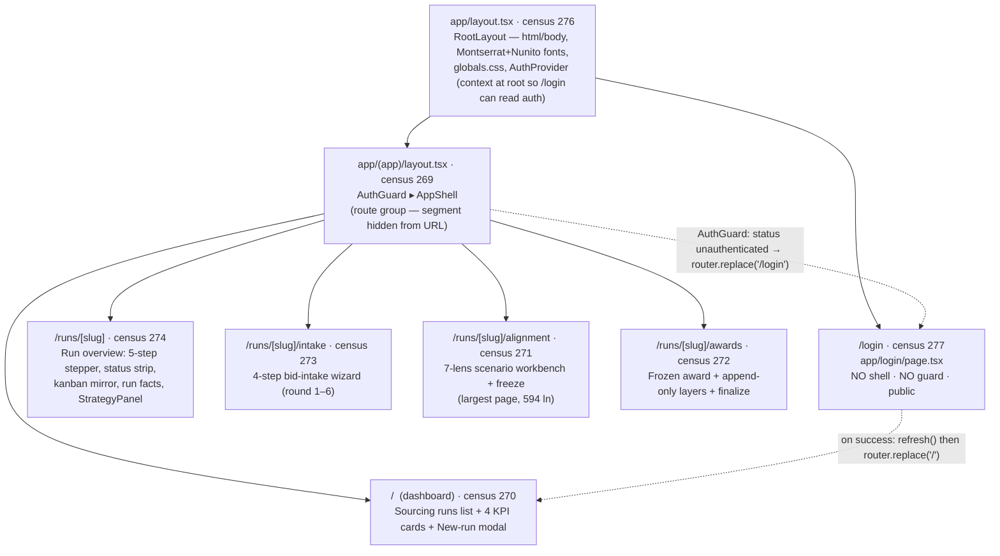
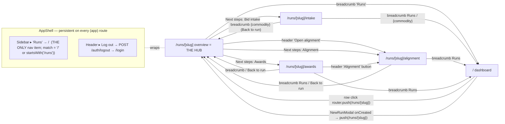

# LAYER 3 — UX / UI (the as-built console, pixel-level)

The frontend is a **pure client** of the FastAPI backend (ADR-0002 / `next.config.mjs`): nothing here holds
server state; every screen reads from a GET and writes through a typed `apiFetch`. It is a **mono-section
product** — one nav item ("Runs") — built as a Next.js 14 App Router app with a locked-v2 Tailwind design
system (brand `#084999`). This document synthesizes the four required sections: the **screen catalog** (§1),
the **component inventory + governed status language** (§2), the **data-binding & precision table** (§3), and
the **designed-vs-built & MVP-cuts** map (§4). Every citation is `slice · file:line`.

This is **Layer 3** of a three-layer audit. Layer 1 (architecture/data/flows) and Layer 2
(code/process/decisions) are synthesized separately; cross-refs to those layers are by name. The
backend value-math (FOB+freight→landed, renormalization, force-positive) lives in Layer 1 — Layer 3 owns
only the **display-shape hop** (`lib/format.ts`) and the field→pixel binding (the decimal's last hop).

---

## 1. SCREEN CATALOG

Next.js 14 App Router. The `(app)` segment is a **route group** — invisible in the URL — that attaches the
shared `AuthGuard ▸ AppShell` chrome to every protected route. `/login` lives **outside** the group so it
renders un-gated and un-chromed (you must reach it while signed out). [F1 · F1_app_routes.md:38-59,139-172]

There are **6 built screens**: Login, Dashboard, Run Overview, Intake, Alignment, Awards. The design system of
record (D3) specifies **5 further lifecycle screens** (Cycle Setup, Reconciliation, Sign-off, Settings,
Suppliers) that are **designed-not-built** — see §4.

### 1.1 Route tree (mermaid)

[F1 · F1_app_routes.md:45-59]

### 1.2 In-run navigation reachability (mermaid) — the single-item sidebar

[F1 · F1_app_routes.md:61-102; F2a · F2a_...:615-643 (NAV = exactly one item)]

**Reachability findings (verifiable, gap-adjacent):**
- **Single-item sidebar.** `AppShell.NAV` has **exactly one** entry — `{href:"/", label:"Runs", match:(p)=>p==="/"||p.startsWith("/runs")}`. Every run sub-route highlights that one item via the `match` predicate. This is a deliberate as-built fact (the console is one workflow), not a stub — the `NavItem`/`map` machinery is fully built; there is simply one destination. [F2a · F2a_...:615-643,912-914]
- **The overview is the only hub.** There is **no direct Dashboard → Intake/Alignment/Awards** link, and **no run-scoped tab rail**. All inter-surface travel funnels through `/runs/[slug]`. Intake has no forward link to alignment/awards; alignment has no forward link to awards; awards links **back** to alignment but not forward. Every sub-page is ~2 clicks from any sibling. [F1 · F1_app_routes.md:97-102,749-752]
- **Orphaned designed surfaces** (D3): Cycle Setup, Reconciliation, Sign-off, Settings, Suppliers are designed in redesign3 but **un-routed and un-navigated** — the run-scoped tab rail the redesign assumes does not exist in the build. Sign-off is the worst orphan (no Awards→Sign-off link). [D3 · D3_design.md:274,295-296]
- **One orphaned built component:** `runs/KanbanBoard.tsx` (census 299) is fully implemented but **has no importer** anywhere in `frontend/**` — the overview renders its own kanban (`ActivityBoard`); the intake page normalizes kanban but mounts no board. Latent/complete-but-dead. [F2c · F2c_...:695-713,906]

### 1.3 Screen-by-screen catalog

Each screen: purpose · WHY · every STATE · key interactions→endpoints.

---

#### LOGIN — `/login` · `app/login/page.tsx` (census 277, 277 ln, `"use client"`)
**Purpose.** The only public route — a two-stage sign-in: credentials → (conditionally) a 6-digit TOTP step.
**WHY two-stage.** The backend does not advertise 2FA; it answers the first attempt with `401 "2FA code required"` (exact string) when a code is needed. The page submits username/password first, reveals the TOTP field only after that specific 401, so non-2FA users never see a code field. [F1 · F1_app_routes.md:174-181]

**STATES (every one):** [F1 · F1_app_routes.md:193-212]
- **Default / credentials** (`!totpRequired`): "Sign in"; Username + Password; submit "Continue".
- **2FA step** (`totpRequired`): lock tile + "Two-factor code"; single centered 6-digit OTP `Input` (`tracking-[0.5em]`, `inputMode="numeric"`, `maxLength=6`, sanitized `replace(/\D/g,"")`); **Back** button; submit "Verify & sign in".
- **Submitting** (`submitting`): every input disabled; `<Button loading>` spins; Back early-returns so you can't change steps mid-request.
- **Error** (`error!=null`): `role="alert"` red box (`border-danger/30 bg-danger-bg text-danger`). 401 non-2FA → "Incorrect username, password, or 2FA code."; other ApiError → `err.detail`; non-ApiError → "Unexpected error.". The 2FA-required 401 is **not** an error (clears it, flips `totpRequired`).
- **Already-authenticated:** `useEffect` bounces `status==="authenticated"` → `router.replace("/")`.
- **No loading/empty/not-found/gated/rehearsal/post-close** — pure form, no backend GET (documented N/A, not skipped).

**Interactions → endpoint:** form submit → `login({username,password,totp_code?})` → **`POST /api/v1/auth/login`**; success → `refresh()` (re-GET `/auth/me`) → `replace("/")`; the 2FA branch hinges on `ApiError.twoFactorRequired` (client.ts: `status===401 && detail.trim().toLowerCase()==="2fa code required"`). [F1 · F1_app_routes.md:214-235; F3 · F3_...:75-89,302-304]

---

#### DASHBOARD — `/` · `app/(app)/page.tsx` (census 270, 332 ln, `"use client"`)
**Purpose.** The Sourcing-runs dashboard — a 4-card KPI strip + a searchable table of every RFP cycle + a New-run modal. The app's home and the only sidebar destination; the fan-out point into `/runs/[slug]`. [F1 · F1_app_routes.md:242-247]
**Load:** `listRuns()` → **`GET /api/v1/runs`** → `RunSummary[]`, once on mount.

**STATES (every one):** [F1 · F1_app_routes.md:268-279]
- **Loading** (`loading`): centered spinner + "Loading runs…" (KPI strip + search hidden).
- **Error** (`!loading && error`): centered red text + **Retry** → `load()`.
- **Empty — no runs** (`runs.length===0`): "No runs yet" + helper + **New run** button → modal.
- **Empty — filtered to nothing** (`filtered.length===0` but runs exist): table header renders + a centered "No runs match "{query}"." row.
- **Populated** (`hasRuns && !error`): KPI strip + runs table.
- **Locked rule:** all KPI counts reflect the **filtered** set, not the full list (`(app)/page.tsx:114-135`).

**Interactions → endpoint:** New run → opens `NewRunModal` (which posts **`POST /runs`**); search → re-derives `filtered`+KPIs live; row click → `router.push(/runs/{slug})`; `NewRunModal onCreated` → `load()` + push to the new run. [F1 · F1_app_routes.md:309-321]

---

#### RUN OVERVIEW — `/runs/[slug]` · `app/(app)/runs/[slug]/page.tsx` (census 274, 388 ln, `"use client"`)
**Purpose.** The hub for one cycle — a 5-step lifecycle stepper, a persistent status strip, the activity kanban (display-only mirror), a "Run facts" card, the engine `StrategyPanel` (only once a cycle exists), and a "Next steps" rail into intake/alignment/awards. Derives **all** lifecycle/status from the single `RunDetail.stage` string (no extra API calls). [F1 · F1_app_routes.md:325-333]
**Load:** `getRun(slug)` → **`GET /api/v1/runs/{slug}`** → `RunDetail` (=`RunSummary` + `kanban`). 404 → `{notFound:true}`.

**Lifecycle stepper** (5 stages `setup→intake→analysis→award→close`; `stageIndex` first-match regex on `stage.toLowerCase()`): `/(close|final|complete|done)/`→4; `/(post[- ]?award|award|frozen)/`→3; `/(analy|seal|align|scenario)/`→2; `/(intake|bid|round|import|load)/`→1; `/(setup|kickoff|cycle)/` or `has_cycle`→0; else→0. Out-of-vocab stage falls back to Setup. [F1 · F1_app_routes.md:338-354]

**STATES (every one):** [F1 · F1_app_routes.md:379-391]
- **Loading:** Panel spinner + "Loading run…".
- **Error — generic** (`!notFound`): "Something went wrong" + message + **Retry** + ghost **Back to runs**.
- **Error — not-found** (404): "Run not found" + **Back to runs** only (no Retry — retrying a 404 is pointless).
- **Loaded:** the full overview.
- **Rehearsal:** header `<StatusChip amber>Rehearsal</StatusChip>` when `run.rehearsal`; "Run facts → Mode = Rehearsal".
- **Post-award:** header `<StatusChip frozen>Post-award</StatusChip>` when `currentStage>=3`.
- **Cycle-gated:** `StrategyPanel` renders **only if `run.has_cycle`** — before setup there is no strategy to resolve.

**Interactions → endpoint:** breadcrumb "Runs" → `/`; `DownloadArchiveButton` → **`GET /runs/{slug}/archive`** (.zip); "Open alignment" → alignment; StrategyPanel → its own GET/PUT `/runs/{slug}/strategy`; Next-steps Links → the 3 sub-routes. [F1 · F1_app_routes.md:405-412]

---

#### INTAKE — `/runs/[slug]/intake` · `.../intake/page.tsx` (census 273, 265 ln, `"use client"`)
**Purpose.** A 4-step sequential wizard (**Setup → Template → Import → Review**) scoped to a selectable **round (1–6)**. Soft-gated: each step disables until the prior is done; the **backend is the hard gate** (returns `gate_required`), the page mirrors it as local disabling so the user is guided, not surprised. [F1 · F1_app_routes.md:420-426]
**Loads:** `getRun(slug)` (run + kanban) + `listRunFiles(slug)` → **`GET /runs/{slug}/files`** → `RunFile[]` (independent loading/error).

**Gating derivation:** `setupDone = setupDoneThisSession || run.has_cycle || hasRoundTemplate`; `templateDone = templateDoneThisSession || hasRoundTemplate` (durable across reload via the `round{n}_bid_template` input file). `TemplateSection disabled={!setupDone}`; `ImportSection disabled={!templateDone}`; Review never disabled. Round switch resets round-scoped `templateDoneThisSession` but **not** `setupDone` (the cycle is run-wide). [F1 · F1_app_routes.md:434-454]

**STATES (every one):** [F1 · F1_app_routes.md:456-465]
- **Loading run:** spinner + "Loading run…".
- **Error generic / not-found:** same two-variant pattern (Retry only when not 404; ghost Back to run).
- **Loaded:** header + round selector + status strip + 4 step cards.
- **Files loading/error:** surfaced *inside* `SetupSection` (not page-level) so the wizard frame stays up.
- **Step-gated:** Template disabled until `setupDone`; Import disabled until `templateDone`.
- **No rehearsal/post-close** (intake is pre-analysis by definition).

**Interactions → endpoint:** SetupSection → **`POST /runs/{slug}/setup`** (multipart); TemplateSection → **`POST /runs/{slug}/rounds/{round}/template`**; ImportSection → **`POST /bids/import`** (multipart, confirm=false dry-run / confirm=true write); ReviewSection → **`GET /bids?run={slug}&round={round}`**. Each step callback normalizes the loose kanban (`normalizeKanban`) and reloads files. [F1 · F1_app_routes.md:487-495]
**Note:** intake builds+stores `kanban` but **renders no board** on this page (the board lives on the overview) — computed-but-unused-for-render here. [F1 · F1_app_routes.md:479-485,747]

---

#### ALIGNMENT — `/runs/[slug]/alignment` · `.../alignment/page.tsx` (census 271, 594 ln, `"use client"`)
**Purpose.** The centerpiece workbench — run a round's analysis, pick a sealed analysis version, compare the **seven lenses (A–G)**, inspect one lens cell-by-cell, optionally compare two versions, save a named savepoint (E-43), and **freeze** a chosen lens into a governed award. The most stateful page (18 pieces of state) — it orchestrates four cascading, race-safe selections (analysis → comparison → lens → detail) plus three modals and read-only gating. [F1 · F1_app_routes.md:503-517]

**Cascading loads (every effect):** [F1 · F1_app_routes.md:519-532]
1. `getRun` → `RunDetail` (404/other handled).
2. `listAnalyses(slug)` → **`GET /runs/{slug}/analysis`** → `AnalysisSummary[]`; throw is **non-fatal** → `[]` (renders calmly as "no analyses" when no cycle yet).
3. Comparison (abortable, on `selectedAnalysisId`): `getScenarioComparison` → **`GET .../analysis/{id}/scenarios`** → `ScenarioComparisonRow[]`; auto-selects the recommended lens (`is_recommended`, i.e. **B**), else `rows[0]`.
4. Detail (abortable, on `selectedCode`): **synchronously clears `detail` first** (so a stale lens can never render/freeze), then `getScenarioDetail` → **`GET .../scenarios/{code}`** → `ScenarioDetail`.

**Read-only / historic derivation:** `readOnly = selectedAnalysis.version !== liveAnalysis.version` (live = highest version). When true: an amber banner "viewing a sealed, read-only analysis (v{n})… switch to live to build or freeze" + **View live version** button; `ScenarioDetailPanel` gets `readOnly` to disable Freeze. [F1 · F1_app_routes.md:534-541]

**STATES (every one):** [F1 · F1_app_routes.md:559-579]
- Run loading / error (generic + not-found) — two-variant pattern.
- Run loaded: strip + optional read-only banner + decision-header chips + analyses panel + (conditional) compare controls + comparison table + detail panel + modals.
- **No analyses** (`!selectedAnalysisId`): comparison/detail hidden; `AnalysisRunsPanel` shows its empty/run-CTA.
- Comparison: loading ("Loading scenarios…") · error (`<Alert error>`) · loaded (`ScenarioComparisonTable`).
- Detail: loading ("Loading scenario {code}…") · error · loaded (guarded `detail.code===selectedCode`).
- **Read-only (historic):** banner + disabled governed actions.
- **Running analysis** (`running`): `AnalysisRunsPanel` busy; `runAnalysisError` as a top `<Alert>`.
- **Compare-active:** a saved version chosen → `ScenarioComparePanel` renders.
- Freeze / SaveVersion submitting / error: inside their modals.

**Interactions → endpoint:** Run analysis → **`POST /runs/{slug}/rounds/{round}/analysis`**; Save version → **`PATCH /runs/{slug}/analysis/{id}`** (`{label}`); Select lens → detail effect; Freeze → `FreezeAwardModal` → **`POST /runs/{slug}/awards/freeze`** (records `frozen["{id}:{code}"]=award_id`). `suggestedAwardCode = AWD-{COMMODITY_SLUG}-{lens}` (commodity upper-cased, non-alnum→`-`, ≤16 chars). [F1 · F1_app_routes.md:601-612]

---

#### AWARDS — `/runs/[slug]/awards` · `.../awards/page.tsx` (census 272, 386 ln, `"use client"`)
**Purpose.** The post-award terminal — list a run's frozen awards, inspect one (frozen baseline → current effective price per line + the versioned layer history), record an append-only **adjustment** layer, and **finalize & close** the run (gated on a frozen award). The freeze lives on alignment; close-out lives here because this is the terminal post-decision surface. [F1 · F1_app_routes.md:620-628]

**Loads:** `listAwards(slug)` → **`GET /runs/{slug}/awards`** → `AwardSummary[]` (throw → non-fatal `[]`); detail (abortable, on `selectedId` or `reloadNonce`) → `getAward` → **`GET /runs/{slug}/awards/{id}`** → `AwardDetail` (cleared synchronously; `reloadNonce` bumped after an adjustment). [F1 · F1_app_routes.md:629-637]

**STATES (every one):** [F1 · F1_app_routes.md:649-665]
- Run loading / error (generic + not-found) — two-variant pattern.
- Loaded: strip + header + (conditional close notice) + `AwardsListPanel` + (conditional) detail block.
- **No awards** (`!selectedId`): detail hidden; `AwardsListPanel` empty state.
- Detail: loading ("Loading award…") · error · loaded (guarded `detail.award_id===selectedId`).
- **Closed / finalized** (`closed && finalizeNotice`): success `<Alert>` "Run closed · {won} award + {not_won} rejection notice(s) drafted · CLOSED event recorded." (pluralizes).
- **Adjustment recorded** (`adjustNotice`): success `<Alert>` "Recorded adjustment v{n}." + **Download the updated post-award document** button.
- Finalize submitting / error: inside the `AssertModal`.
- **canFinalize gate:** `hasFrozenAward && !closed` → Finalize button enabled only with a frozen, un-closed run.

**Interactions → endpoint:** Select award → load detail; Record adjustment → `RecordAdjustmentModal` → **`POST /runs/{slug}/awards/{id}/adjustments`** (sets notice, bumps `reloadNonce`, re-lists); Download updated doc → **`GET /runs/{slug}/files/{name}`** (.xlsx); Finalize → `AssertModal (eventType CLOSED)` → **`POST /runs/{slug}/finalize`**; header "Alignment" → alignment. [F1 · F1_app_routes.md:687-696]

---

## 2. COMPONENT INVENTORY

Grouped: **ui/shell/auth** (the design-system primitives + chrome + session), **alignment/awards** (the analysis & governed-decision UI), **intake/runs** (the wizard + run companions). 1-liner + states each. The governed **StatusChip** and **RunStatusStrip** tone maps (exact hex) and the **3 AssertModal gates** follow.

### 2.1 ui / shell / auth [F2a]

| Component (census) | 1-liner | States |
|---|---|---|
| **ui/Button** (305) | The single button primitive — 4 variants, 2 sizes, built-in loading spinner; `disabled={disabled\|\|loading}` so a submit can't be double-fired. | primary/secondary/ghost/danger × sm/md; loading (spinner + disabled); disabled. **Drift:** `danger` variant uses raw `red-700/red-50`, not the `danger` token. [F2a:59-119,898] |
| **ui/Input** (308) | Styled native `<input>` with an `invalid` red-border flag; forwarded ref. | default · focus (ring `accent/40`) · disabled · invalid (`border-red-400` — raw, drift). [F2a:123-155] |
| **ui/FormField** (307) | Label + hint + error wrapper; error suppresses hint (error wins). | neither · hint-only · error-only. Required `*` + error text = raw `red-600` (drift). [F2a:159-196] |
| **ui/Panel** + **PanelHeader** (310) | The bordered card surface + its header (title/description/actions row, bottom divider). | static (no states; content owns states). [F2a:200-238] |
| **ui/Table** (THead/TBody/TR/TH/TD) (312) | Six dense table primitives; `TR` becomes clickable (hover tint) when `onClick` given. | clickable vs non-clickable row. [F2a:242-282] |
| **ui/StatusChip** + `stageTone` (311) | The governed status pill — always **colour + text** (WCAG AA, never hue alone). | 9 tones (see §2.4). [F2a:286-360] |
| **ui/Modal** (309) | Generic dialog — backdrop + centered panel, Escape-close, body-scroll-lock, backdrop-click (target-guarded), focus-trap. | closed (renders null) · open. [F2a:364-419] |
| **ui/AssertModal** (304) | The governed-action gate (see §2.5) — summary → cautions → (rationale) → named assertion checkbox → confirm. | summary/cautions/rationale present-or-not; asserted vs not (confirm disabled until checked); loading; destructive; error. [F2a:423-513] |
| **ui/FileInput** (306) | Controlled `.xlsx` file picker (parent owns `file`) so it can reset after upload (clears native `.value`). | empty ("No file selected") · selected (name + clear) · disabled. [F2a:517-571] |
| **ui/index.ts** (313) | Barrel — single import surface for the primitives. | n/a. [F2a:574-599] |
| **shell/AppShell** (302) | The authenticated chrome — 248px navy sidebar (one nav item "Runs") + 56px header (user chip + Log out) + scrolling `<main max-w-6xl>`. | desktop (sidebar) vs mobile (hidden, brand in header); user present vs null; nav active/inactive. [F2a:604-673] |
| **shell/RunStatusStrip** (303) | The persistent 4-cell lifecycle readout (Run · Analysis · Award · Audit) — dot + caps label + value (see §2.4). | per-cell dot tone (live/frozen/sealed/idle); idle = not reached. [F2a:677-735] |
| **auth/AuthProvider** + `useAuth` (286) | Session context — `status`+`user`, `refresh()`/`logout()`, mount-time `me` probe (abortable); any `me` failure = unauthenticated (fail-safe). | loading · authenticated · unauthenticated. [F2a:741-811] |
| **auth/AuthGuard** (285) | Gates the `(app)` group — spinner while checking, redirect on unauth, children when authed. | loading ("Checking your session…") · authenticated (children) · unauthenticated ("Redirecting to sign in…" → `replace("/login")`). Spinner uses **legacy tokens** (`border-line-strong/border-t-accent`) — drift. [F2a:815-852,754] |

### 2.2 alignment / awards [F2b]

| Component (census) | 1-liner | States |
|---|---|---|
| **alignment/AnalysisRunsPanel** (278) | Version selector/ledger of sealed analysis runs (latest=Live, older=Read-only) + the Run-analysis control header. | empty ("No sealed analysis yet…") · populated. [F2b:53-114] |
| **alignment/RunAnalysisControl** (280) | Round-number picker + "Run analysis" submit; the only UI entry to run the engine. | default(valid "1") · invalid(red ring) · running(spinner). [F2b:117-154] |
| **alignment/SaveVersionModal** (281) | Lightweight savepoint (name/rename a sealed version) — built on `Modal`, **NOT** AssertModal; "no governance copy, no audit event, no award." | default · pre-filled(rename) · submitting · error. [F2b:157-201] |
| **alignment/ScenarioComparePanel** (282) | Side-by-side version comparison (live working build vs a saved version), matched by lens code, saved−working Δ; re-uses sealed reads (no re-derivation). | error · loading ("Loading comparison…") · loaded. [F2b:204-262] |
| **alignment/ScenarioComparisonTable** (283) | **The seven-lens table A–G** — the "which scenario" decision surface; B=recommended, A=Δ benchmark; scrolls horizontally <1100px (never reflows). | rows + selected-lens highlight; cap-breach count chip; modeled chip on STLY. [F2b:265-318] |
| **alignment/ScenarioDetailPanel** (284) | **The cell-by-cell matrix + freeze trigger** — 4 stat tiles, capacity-feasibility chip, the Freeze button, per-(DC×Lot×Item×TF) competitive grid with expandable supplier rows. | frozen-already (chip replaces button) · read-only (Freeze disabled) · cell collapsed/expanded · no-bids cell. [F2b:320-420] |
| **alignment/FreezeAwardModal** (279) | **Gate #1 — FROZEN.** Freeze a lens into the immutable award; on `AssertModal` (`eventType="FROZEN"`); collects award code. | default(prefilled, un-asserted→disabled) · code-blank(guidance error) · asserted(enabled) · submitting · error. [F2b:422-480] |
| **awards/AwardsListPanel** (288) | The cycle's frozen-awards table (latest layer version per award); selecting drives the detail panel. | empty ("No frozen award yet…") · populated. [F2b:485-523] |
| **awards/AwardDetailPanel** (287) | **Baseline→effective lines + audit trail** — two columns: award card (frozen vs effective $/case + Δ per cell) + chronological version history (v0 FROZEN → vN). | Δ rose(red+)/dropped(green−)/unchanged(—); baseline-only award. [F2b:525-604] |
| **awards/RecordAdjustmentModal** (289) | **Gate #2 — ADJUSTMENT.** Append-only post-award layer (cells to reprice + new $/case + type + effective date + reason); on `AssertModal` `withRationale` required. | default("Select at least one cell") · cell-selected(seeded) · invalid-price(red ring) · type/date-missing · asserted+reason(enabled) · submitting · error. [F2b:606-694] |

### 2.3 intake / runs [F2c]

| Component (census) | 1-liner | States |
|---|---|---|
| **intake/Alert** (290) | Inline message box — 4 tones; sets `role="alert"` for error (assertive) else `status` (polite). | error/success/info/warning (stateless). [F2c:76-114] |
| **intake/StepHeader** (297) | Shared header for the 4 step cards — numbered badge → green ✓ when done. | done(green ✓) · current(brand #) · todo(faint #). [F2c:117-157] |
| **intake/RunFilesTable** (295) | Run-folder file list with authenticated per-row Download (cookie-bearing `apiDownload`, not a plain `<a>`). | empty · error(Alert) · per-row downloading (others disabled) · idle. [F2c:160-220] |
| **intake/DownloadArchiveButton** (291) | "Download run folder (.zip)" — streamed on request (no-file-storage); never navigates away on failure. | idle · busy(spinner) · error(line beneath). [F2c:224-261] |
| **intake/SetupSection** (296) — STEP 1 | Lists input files + `.xlsx` setup upload that opens the cycle; reports `cycle_id`. | files loading/error/loaded · upload idle/submitting/error · success("Cycle opened · {id}") · header complete/in-progress. [F2c:265-321] |
| **intake/TemplateSection** (298) — STEP 2 | Generates the round-{n} bid template; durable "done" via the `round{n}_bid_template` input file; handles `gate_required`. | disabled/todo · gate(warning) · error · success · submitting · done(label→"Regenerate"). [F2c:325-389] |
| **intake/ImportSection** (292) — STEP 3 | Bid-import surface — strict vs flexible mode; flexible = two-phase dry-run(propose)→confirm(write). **Largest intake file.** | disabled/locked · in-progress · strict/flexible · submitting · gate · error · proposal-present(Cancel/Confirm) · imported(success) · empty. **MVP-cut: confirm-only, no editable mapper.** [F2c:393-514,903] |
| **intake/MappingProposal** (293) | **Read-only** dry-run view — field→source→column→basis→confidence + ambiguities; makes "nothing written yet" explicit. | always-on warning banner · optional summary · no-mappings · ambiguities-present. **MVP-cut: strictly read-only, no per-row override.** [F2c:518-587,903] |
| **intake/ReviewSection** (294) — STEP 4 | Imported-bid review — top Exception queue (quarantine surface) + full 11-col bid table; reloads on `refreshKey`. | loading · error(Retry) · empty · exception-queue(>0 quarantined) · bids-table · header Clean/{n} need-review. **MVP-cut: quarantine surface-only, no fix-and-retry.** [F2c:591-684,904] |
| **runs/KanbanBoard** (299) | 4-column board renderer (Done/Doing/Next/Waiting). **ORPHANED — no importer.** | per-column empty · populated. [F2c:695-742,906] |
| **runs/NewRunModal** (300) | "New run" dialog — Commodity + Label + Rehearsal checkbox → `POST /runs`. | idle · submitting(no-dismiss) · error(role=alert) · invalid(Create disabled). [F2c:746-801] |
| **runs/StrategyPanel** (301) | Run-Detail engine-config — weight preset + 4 safeties editable, **5 weights READ-ONLY** (% display); GET/PUT `/strategy`. | loading · loaded · error · dirty/saved/up-to-date · saving · gated mount (`has_cycle`). **MVP-cut: the minimal A1.** [F2c:804-895,905] |

### 2.4 The governed status language — exact tone→hex maps

Two parallel governed maps, both honoring **"colour is always backed by text, never hue alone"** (WCAG AA, locked v2). Hex from `tailwind.config.ts`. [F2a:286-360,677-735,884-894; F3 · F3_...:471-501]

**StatusChip** (`ui/StatusChip.tsx`) — pill base `text-2xs uppercase tracking-wide ring-1 ring-inset`:

| tone | bg / text / ring tokens | resolved hex | governed meaning |
|---|---|---|---|
| `neutral` | surface.muted / text.muted / border | bg `#eef0f3`, text `#5b6b82`, ring `#e3e8ef` | neutral default |
| `accent` | accent.soft / accent / accent@25% | bg `#e8eff8`, text `#084999` | selected / in-progress |
| `amber` | warning.bg / warning / warning@30% | bg `#fdf6e8`, text `#c98a1a` | wait/review (= `modeled` palette) |
| `green` | success.bg / success / success@30% | bg `#e7f3ea`, text `#1a7a4f` | done/savings |
| `slate` | slate-100 / slate-600 / slate-300 | **raw Tailwind slate** (not a locked token — drift) | incumbent/neutral non-output |
| **`frozen`** | success.bg / success / success@30% | bg `#e7f3ea`, text `#1a7a4f` | a frozen award/scenario (terminal good); reuses success green |
| **`sealed`** | sealed.bg / sealed / sealed@25% | bg `#eef4ff`, text **`#1d4ed8`** | immutable/audit-sealed artifact; the only governed color **not** reused (dedicated blue) |
| **`modeled`** | warning.bg / warning / warning@30% | bg `#fdf6e8`, text `#c98a1a` | modeled/synthetic (e.g. Save-vs-STLY ×1.04 proxy); reuses warning amber |
| **`gated`** | danger.bg / danger / danger@30% | bg `#fbe9e7`, text `#b3261e` | action blocked / infeasible; danger red |

**RunStatusStrip** (`shell/RunStatusStrip.tsx`) — dot domain `live\|frozen\|sealed\|idle`:

| tone | class | resolved hex | meaning |
|---|---|---|---|
| `live` | `bg-success` | `#1a7a4f` (green) | active/current |
| `frozen` | `bg-success` | `#1a7a4f` (green) | frozen award present (**same green as live** — distinction carried by text, never hue alone) |
| `sealed` | `bg-sealed` | `#1d4ed8` (blue) | a sealed/immutable analysis exists |
| `idle` | `bg-text-faint` | `#9aa7b6` (grey) | not yet reached (default) |

The 4 strip cells are fed per page: **Run state** (stage / Live·Alignment / Historic / Closed), **Analysis** (Sealed·v{n} or Not sealed), **Award** (Frozen or Not yet frozen), **Audit** ("Current" / "Hash-chain current" — always live). [F2a:708-714; F1 · F1_app_routes.md:356-365,445-448,543-548,643-647]

### 2.5 The three governed AssertModal gates (FROZEN / ADJUSTMENT / CLOSED)

All three route through `ui/AssertModal.tsx` (census 304): summary → (optional cautions) → (optional required rationale) → **named assertion checkbox bound to `user.username`** → Confirm **disabled until asserted** (+ rationale if required). The audit event that **will** be written is disclosed up front as a `sealed` chip. `canConfirm = asserted && rationaleOk && !loading`. The checkbox is **reset on every open** (a prior assertion never carries over). This is the product's single, consistent accountability gate for irreversible actions (ADR-0006 lineage). [F2a:423-513; F2b:725-730]

| Gate | eventType chip | Component | withRationale | Endpoint | Cautions |
|---|---|---|---|---|---|
| **#1 FROZEN** | `FROZEN` | `FreezeAwardModal` (alignment, 279) | no | **`POST /runs/{slug}/awards/freeze`** | "immutable — later changes are append-only layers, never edits" [F2b:456-467] |
| **#2 ADJUSTMENT** | `ADJUSTMENT` | `RecordAdjustmentModal` (awards, 289) | **yes (required)** | **`POST /runs/{slug}/awards/{id}/adjustments`** | "writes an append-only layer; the baseline never changes" [F2b:663-669] |
| **#3 CLOSED** | `CLOSED` | inline `AssertModal` on the awards page (not a slice component) | no | **`POST /runs/{slug}/finalize`** | "locks the run"; gated on `hasFrozenAward && !closed` [F2b:718-723; F1:694-695] |

**DRIFT note (design vs code):** the design asserts a `CLOSED` event type, but the backend `EventType` enum (CREATED/SEALED/FROZEN/SUPERSEDED/SIGNED_OFF/SENT/GATE_APPROVED/IMPORTED) **has no `CLOSED`** — flagged in HANDOFF_NOTES + DATA_AND_PROCESS_MAP (open product call: add `CLOSED` or map). [D3 · D3_design.md:148,294]

---

## 3. DATA-BINDING & PRECISION TABLE — the decimal's journey DB→pixel

### 3.1 The consolidated formatter contract (`frontend/lib/format.ts`, census 323)

The wire carries **raw numbers** (dollars as numbers, percentages as **fractions**); these six pure formatters own the precision/locale presentation in **one place** — "the decimal's last hop." `Intl`/`toLocaleString` with `undefined` locale = the **browser's locale** (grouping/month names environment-dependent). Every formatter null-coalesces to an **em-dash `—`** (U+2014) so a missing value renders as a placeholder, **never** `NaN`/`null`/`0` (which would misstate an RFP figure). [F3 · F3_...:412-449; F2b:19-37]

| Formatter | Precision rule | Null | Example |
|---|---|---|---|
| **`formatMoney(v, {cents?})`** | `style:"currency"`, USD. **Default 0 fraction digits → WHOLE dollars** (large spend/savings; cents are noise). `{cents:true}` → 2 dp (**not used in any shipped slice**). Locale comma groups; Intl half-away-from-zero (V8). | `—` | `1234567.5` → `"$1,234,568"` |
| **`formatPercent(frac)`** | `style:"percent"`, **1 fraction digit**. **Input is a FRACTION** — Intl multiplies ×100. This is the last hop for every `*_pct` field on the wire (all fractions per `types.ts`). | `—` | `0.0524` → `"5.2%"` |
| **`formatPrice(v)`** | `toLocaleString` **exactly 2 fraction digits, NO currency symbol** (bare $/case number; symbol shown/implied separately). Locale grouping. | `—` | `12.5` → `"12.50"` |
| **`formatCount(v)`** | `toLocaleString()` default — **integer**, locale grouping, no forced decimals. | `—` | `12345` → `"12,345"` |
| **`formatBytes(b)`** | `<1024`→"{n} B" (0 dp); else /1024 stepping KB/MB/GB/TB, `toFixed(value>=10 \|\| unit===0 ? 0 : 1)` → **0 dp when ≥10 or first KB step, else 1 dp**. `<0`/non-finite → `—`. | `—` | `1536` → `"1.5 KB"` |
| **`formatTimestamp(iso)`** | `toLocaleString {year, month short, day, hour 2-digit, minute 2-digit}` — **no seconds**, localized. `NaN` date → returns the **raw iso** verbatim (never throws). | (raw iso) | `"2026-06-22T11:17Z"` → `"Jun 22, 2026, 11:17 AM"` |

**Inline (not via format.ts):** [F2b:33-37,408-409]
- `rec_score.toFixed(1)` — RecScore to **1 decimal** (0–100 scale); `null`→`—`.
- `effective_price.toFixed(2)` — adjustment-draft seed, **2 dp** initial string.
- `frozenAwardId.slice(0,8)` — frozen award id truncated to **8 chars** for the chip.
- price-Δ = `Math.abs(l.delta)` via `formatPrice`, sign **prepended manually**: `+` for rises / `−` **(U+2212 true minus, not hyphen)** for drops.
- `pct(n) = Math.round(n*100)+"%"` — StrategyPanel read-only weights, **whole percent, no decimals** (e.g. 0.35→"35%"). [F2c:880-881]
- `ingested` (ImportSection) rendered **raw** (`{ingested}`, no `formatCount`) — a minor inconsistency vs ReviewSection's grouped counts. [F2c:498-500,908-911]

`tabular-nums` (CSS `font-variant-numeric: tabular-nums`, plus the global `"tnum" 1` in `globals.css`) is applied to **every** numeric cell so digits column-align. [F1 · F1_app_routes.md:718-725; F2b:39-41]

### 3.2 Per-surface field → element → format (the binding table)

Backend field semantics live in `types.ts`; the format/precision is applied at render. Dollars vs fractions vs 0–100 vs counts are the **field contract**; the formatter is the **pixel contract**.

**Dashboard (`/`)** — `RunSummary[]`: [F1 · F1_app_routes.md:281-307]
| Field | Element | Format |
|---|---|---|
| `kpis.total/active/production/rehearsal` | 4 MetricCards | **`formatCount`** (grouped integer), Montserrat 2xl `tabular-nums`; null→`—` |
| `run.commodity` | avatar glyph + name | `slice(0,1).toUpperCase()` tile + name text |
| `run.label` | Cycle cell | medium muted |
| `run.rehearsal` | Type | `<StatusChip amber>Rehearsal</StatusChip>` else "Production" |
| `run.stage` | Stage | `<StatusChip tone={stageTone(stage)}>` + **binary** progress bar (`w-full` vs `w-1/2`; *not* a measured %) |

**Run overview (`/runs/[slug]`)** — `RunDetail`: Commodity/Cycle/Stage/Mode/Run-ID in the `<dl>`; status strip + stepper numbers `tabular-nums`; kanban counts `tabular-nums`. No money/percent on this page. [F1 · F1_app_routes.md:393-403]

**Intake review (`ReviewSection`)** — `BidLineView[]`: [F2c:645-674]
| Field | Element | Format/precision |
|---|---|---|
| `submitted_all_in_case ?? fob_case` | All-in/case | **`formatPrice`** 2 dp + `currency_code` suffix; null→`—` |
| `price_basis_resolved ?? price_basis` | Price basis | raw string or `—` |
| `volume_minimum_cases` | Min vol | **`formatCount`** integer; null→`—` |
| `validity_status` / `is_scoreable` / `is_awardable` | chips | `validityTone` StatusChip / BoolChip (Yes green / No slate) |
| quarantine row | Exception queue | reason chip `gated` (not scoreable) / `amber` (not awardable); identity = **raw cell-key ids** |

**Alignment — `ScenarioComparisonTable`** (`ScenarioComparisonRow`): [F2b:306-315]
| Field | Format/precision |
|---|---|
| `total_spend` | **`formatMoney`** whole-dollar |
| `delta_vs_a` | `formatMoney` whole-dollar; lens A shows `—` (own Δ=0) |
| `savings_vs_incumbent_pct` (fraction) | **`formatPercent`** 1 dp, always green |
| `savings_vs_stly_pct` (fraction) | `formatPercent` 1 dp + **`modeled` amber chip** (synthetic ×1.04 proxy, faint) |
| `supplier_count` / `cell_count` | **`formatCount`** integer |
| `cap_breach_count` | `gated` chip "{n} over" / faint "Feasible" |

**Alignment — `ScenarioDetailPanel`** (`ScenarioDetail`): stat tiles `formatMoney` (spend/savings whole-dollar) + `formatPercent` 1 dp (sub); award-cell count = **raw integer**. Matrix: `volume` **`formatCount`**; `baseline_price`/`min_price`/`recommended.price` **`formatPrice`** 2 dp; SupplierGrid `price_per_case` `formatPrice` 2 dp, `rec_score` **`.toFixed(1)`** 1 dp, `volume_share` **`formatPercent`** 1 dp (zero share→`—`, not "0.0%"). DC/Lot/Item/TF = **resolved names** (D23), never raw ids. [F2b:372-410]

**Awards — `AwardDetailPanel`** (`AwardLineView` + `AwardVersionView`): [F2b:566-596]
| Field | Format/precision |
|---|---|
| `volume_share` (fraction 0–1) | **`formatPercent`** 1 dp (e.g. `100.0%`) |
| `frozen_price` | **`formatPrice`** 2 dp, faint (immutable baseline, de-emphasized) |
| `effective_price` (baseline overlaid by every layer) | `formatPrice` 2 dp, strong (live price, emphasized) |
| `delta` (= effective − frozen) | sign **manual** `+`/`−`(U+2212) on `formatPrice(abs)` 2 dp; `>0`→danger, `<0`→success, `0`→`—` |
| `version_no` | `v0`→`frozen` chip "v0 · FROZEN"; later→`amber` "v{n}" |
| `effective_date` | **raw `YYYY-MM-DD`** (a date, not a moment — NOT through formatTimestamp) |
| `frozen_at` / `created_at` | **`formatTimestamp`** localized (no seconds) |
| `n_lines` / `line_count` | raw integer |

**Awards — `RecordAdjustmentModal`**: each cell's current `effective_price` shown via `formatPrice` 2 dp; the new-price input seeds with `effective_price.toFixed(2)`; `isValidPrice` requires strictly `> 0` (rejects 0/negatives — no force-positive coercion). [F2b:649-683]

**StrategyPanel**: the 5 weights render **read-only** as `pct(n)` = whole percent, no decimals. [F2c:875-887]

**Precision summary at a glance:** spend/savings $ = whole dollars (0 dp); % (savings, share) = 1 dp from a fraction; $/case prices = 2 dp no symbol; RecScore = 1 dp; weights = whole %; counts = integer; effective_date = raw `YYYY-MM-DD`; timestamps = localized no-seconds; null everywhere → `—`. **`{cents:true}` exists but is unused in any shipped surface.** [F2b:732-739]

**GAPS (Layer-3, verifiable):** `formatMoney` half-even-vs-half-up is engine/locale-dependent (`.50` totals not pinned in code); locale is `undefined` → grouping/month-names environment-dependent; `cap_breach_count` semantics are backend-side (UI only displays the count). [F2b:747-754]

---

## 4. DESIGNED-VS-BUILT & MVP-CUTS

Synthesized from D3 (REDESIGN3_GAP_ANALYSIS + DATA_AND_PROCESS_MAP) and the four MVP-cut flags surfaced in the component slices. The design system of record (`project/design/**`) is the **visual source of truth to rebuild**, NOT shipped code — the `.dc.html` are HTML prototypes. [D3 · D3_design.md:17-21,244-246]

### 4.1 The 6 BUILT screens (route + nav)

Login (`/login`), Dashboard (`/`), Run Detail (`/runs/[slug]`), Bid Intake (`/runs/[slug]/intake`), Alignment (`/runs/[slug]/alignment`), Awards (`/runs/[slug]/awards`) — all shipped in E-26, "exact"/"mostly" map to the locked handoff baseline. (The prompt's "6–7 built": **6** routed screens; the **7th** is the run-scoped surface set if you count the inline `StrategyPanel` on Run Detail as a built fragment of the designed Cycle-Setup screen.) [D3 · D3_design.md:250-256,38]

### 4.2 The 4 SIMPLIFIED (built surface, designed refinement cut) — each flagged vs CLAUDE.md REQ #1

| # | Surface | Designed (source) | As-built (the cut) | REQ #1 (NO MVP / full capability) flag |
|---|---|---|---|---|
| **S1** | **MappingProposal / ImportSection flexible flow** | **Editable column mapper** (A3 / M1) — per-column field `<select>`, ambiguity assignment, override-then-confirm | **Confirm-only / read-only.** Mapping table is display-only; only **Confirm & import** or **Cancel**; ambiguities listed, not resolvable. ("confirm-only, NO editable override — G-seam") | **MVP-CUT vs REQ #1.** A near-miss inference can't be corrected in-app — Cancel, fix the source workbook, re-upload. The propose+confirm half is real & wired; the **override half is unbuilt**. [F2c:411-418,533-544,903; D3 · D3_design.md:259] |
| **S2** | **ReviewSection exception queue** | **M5 quarantine resolution** — the fix-and-retry surface | **Surface-only.** Lists each non-scoreable/non-awardable line with reason/validity; **no edit/requeue/fix-and-retry**. | **MVP-CUT vs REQ #1** (partial). Satisfies "surface, never fudge" (REQ #3 — every quarantined line visible with why) but resolution requires correcting the source and re-importing the round. The in-app fix loop is the **unbuilt half**. [F2c:605-612,904; D3 · D3_design.md:265] |
| **S3** | **StrategyPanel (Cycle Setup A1)** | **Full A1** — ingested **scope read-back**; **5 weights editable**; exclusions/preferred suppliers; lenses to run; **D43 pricing-basis** (modality picker FOB/DELIVERED/XDOC + cost-line manager) | **Minimal A1.** Preset + 4 safeties editable; **5 weights READ-ONLY** (whole-% display); **none** of scope read-back / exclusions/preferred / lens picker / pricing-basis / cost-line controls. | **MVP-CUT vs REQ #1.** Buyer picks a preset profile + tunes 4 guardrails but **cannot hand-tune weights, exclude/prefer suppliers, choose lenses, or set the award modality/cost-lines** in-app. Wiring to `get/updateStrategy` is complete for what ships. (The D43 pricing half is **NOT-designed** at all — E-44 PARKED per sponsor.) [F2c:821-833,905; D3 · D3_design.md:167,257] |
| **S4** | **Alignment diligence depth** | **G-I deep workbench / E-41** — bring the ~18-tab Excel alignment workbench on-screen (8 diligence tabs: Suppliers/Lowest-cost/Coverage/Scoring/Landed/Share/Incumbent/Negotiation) + version-compare + B6 mixed-grain breakdown | Built: 7-lens comparison + cell-by-cell ScenarioDetailPanel (supplier/price/RecScore/share/flags) + version-compare (`ScenarioComparePanel`, E-43). **Not built:** the 8-tab diligence rail and the **B6 mixed-grain** breakdown (the designed "Landed" view is a flat stacked single-grain placeholder — the layout B6 says to avoid). | **MVP-CUT vs REQ #1** (alignment diligence depth). The full per-cell diligence taxonomy + mixed-grain landed breakdown are designed-beyond-spec but **unbuilt**; the as-built ships the competitive-grid evidence surface, not the deep workbench. (B6/E-44 PARKED.) [D3 · D3_design.md:164,271-273; F2b:320-420] |

### 4.3 The 5+ NOT-BUILT (designed-not-routed) + the missing tab rail

| Surface | Design home | Decision/epic | Build status |
|---|---|---|---|
| **Cycle Setup** (full strategy + scope read-back + M6 date-confirm) | `Cycle Setup.dc.html` | E-26-adj / A1 | **DESIGNED-not-built** — no `/setup` route; only the minimal `StrategyPanel` inline; orphaned from the hub (no Setup tab). [D3:256,167] |
| **Reconciliation** (M2 lot↔SKU sticky · M3 supplier/DC identity · M4 unit/pack) | `Reconciliation.dc.html` | E-11/E-08/E-34 | **DESIGNED-not-built** — no route/nav; orphaned. [D3:264,171] |
| **Sign-off** (approver gate, author≠approver, SIGNED_OFF) | `Sign-off.dc.html` | G-D | **DESIGNED-not-built — WORST orphan** (no Awards→Sign-off link; a user who freezes has no in-product path to the gate). [D3:261,174] |
| **Settings & Admin** (Users/Roles/permission matrix) | `Settings.dc.html` | G-C/G-J | **DESIGNED-not-built** — no route/nav. [D3:262,173] |
| **Suppliers** (master + importer + participant pick) | `Suppliers.dc.html` | E-34 | **DESIGNED-not-built** — no route/nav; in-Setup participant entry unwired. [D3:263,175] |
| **A4 Supplier comms (E-37)** | — (absent) | E-37 | **NOT-designed** — deliberately PARKED. [D3:260] |
| **A1 D43 pricing basis / B6 mixed-grain** | — (absent / flat placeholder) | D43/D42/E-44 | **NOT-designed (#1 & #2 gaps)** — E-44 design PARKED per sponsor banner; not a live-test blocker per D44. [D3:257,271] |
| **Run-scoped tab rail** (Setup·Overview·Intake·Recon·Alignment·Awards·Sign-off) | implied across R3 sidebars (inconsistent) | E-26 nav | **NOT-built — the biggest single navigation build item.** `AppShell.tsx` has **1 nav item ("Runs")**; no two R3 sidebars agree on the tab set. This is the **root cause** of every orphaned surface above. [D3:274,295] |

**Root cause of the #1 gap (traceability):** the designer was handed the **older** `DESIGN_REQUESTS.md` snapshot (`redesign3/uploads/...`, 11,783 b) whose A1 brief has **no D43 pricing-basis text** — so redesign3's Cycle Setup got the strategy half but not the pricing half. [D3 · D3_design.md:218,283]

### 4.4 No mock/placeholder data — real-data-wired (REQ #1 / #3 compliance)

Across all built screens and components: **no stubs, no placeholders, no mock/illustrative content** in any shipped path. Every numeric/text binding renders a **real backend field** (sealed-engine reads, award lines, bid lines, run summaries) through the typed `apiFetch` client. The em-dash `—` is a **genuine null/zero placeholder**, not mock data. The two-phase flexible import writes **nothing** on the dry run (data-fidelity: no silent coercion); quarantined lines are **surfaced, never fudged** (REQ #3). The S1–S3 simplifications are deliberate scope cuts of *refinement surfaces* (documented as seam gaps / minimal slices), and S4 is designed-beyond-spec-but-unbuilt — **none** introduces fake data into a built screen. [F2b:755-757; F2c:913-915; F3 · F3_...:644-654]

**Documentation drift (not a functional stub):** `package.json` description, the `gen:api` script ("No-op stub"), and `README.md` still call the frontend a "stub/placeholder with only `.gitkeep` in `lib/api/`" — **stale**; the real `lib/api/**` is a complete hand-written typed client (8 modules, 25 functions) wired to live endpoints. Flag for a doc refresh; the delivered code path is complete. [F3 · F3_...:26-31,645-654]

---

## 5. SECTION / LINE COUNTS · UNRESOLVED CONFLICTS

**Sections:** 5 (1 Screen catalog · 2 Component inventory · 3 Data-binding & precision · 4 Designed-vs-built & MVP-cuts · 5 this).
**Coverage:** 6 built screens fully cataloged (purpose · all states · interactions→endpoints); 2 mermaid charts (route tree + in-run nav reachability with the single-item sidebar); 30 components inventoried across 3 groups; 2 governed tone maps with exact hex (StatusChip 9 tones, RunStatusStrip 4 tones); 3 AssertModal gates; the 6-formatter contract + per-surface binding tables; the designed-vs-built map (6 built · 4 simplified · 5+ not-built · missing tab rail) all flagged vs CLAUDE.md REQ #1.

**Sources synthesized (all DONE per 00_INDEX):** F1 (794 ln) · F2a (922 ln) · F2b (757 ln) · F2c (915 ln) · F3 (666 ln) · D3 (307 ln, designed-vs-built).

**Unresolved conflicts / drift carried forward (not resolvable in Layer-3 — flagged, not fudged):**
1. **`CLOSED` event-type DRIFT** — gate #3 (finalize) writes a `CLOSED` audit event the backend `EventType` enum does not contain (design asserts what code lacks). Open product call. [D3:294; F2b:718-723]
2. **Three divergent stage classifiers** in the frontend — `isClosedStage` (dashboard), `stageIndex` (overview), `stageTone` (StatusChip) — different regex alternations; the same `stage` string can be classified/coloured inconsistently across surfaces (e.g. "archived" closes the dashboard count but is not a stepper terminal). No single stage→lifecycle source of truth. [F1:737-743]
3. **Token drift** — `Button danger`/`Input invalid`/`FormField` error use raw Tailwind `red-*` not the v2 `danger` token; `StatusChip slate` uses raw slate; `AuthGuard` spinner uses legacy `border-line-strong`/`border-t-accent`. Visual-only; flagged for the config/styles reconciliation. [F2a:898-908; F1:754-760]
4. **Count-format inconsistency** — ImportSection renders `ingested` raw; ReviewSection groups via `formatCount` (invisible <1000, divergent at 4+ digits). [F2c:908-911]
5. **Display-precision not pinned** — `formatMoney` half-rounding direction on exact `.50` totals and the `undefined` locale (grouping/month-names) are environment-dependent. [F2b:751-754]
6. **Orphans** — `KanbanBoard` (complete but no importer) and 5 designed-not-routed lifecycle screens (Cycle Setup/Reconciliation/Sign-off/Settings/Suppliers) reachable only by the **unbuilt run-scoped tab rail**. [F2c:906; D3:274,295-296]

These are reported, not reconciled — Layer-3 surfaces the seams; the product calls (add `CLOSED`, unify stage classifier, build the tab rail, finish the editable mapper / fix-and-retry / full A1, reconcile tokens) are tracked in the design gap-analysis and decision log, outside this read-only synthesis.
