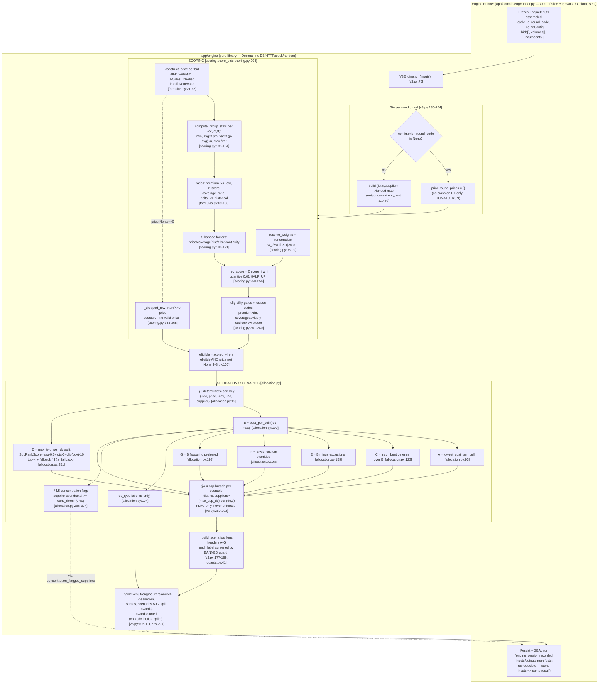

# B1 — THE ENGINE (math core). Exhaustive as-built.

## 0. SLICE INVENTORY — every file under `backend/app/engine/`

`find backend/app/engine -type f` yields 17 paths. They split into three classes. **Nothing is
skipped**; vendored/generated bytecode is counted, not per-file audited, per AUDIT_STANDARD rule 6.

### 0.1 OWNED SOURCE (9 files — audited in full below; census rows 129–137)

| # | path | ext | empty? | bytes | created | modified | census row |
|---|------|-----|--------|-------|---------|----------|-----------|
| 1 | `backend/app/engine/README.md` | md | no | 1758 | 2026-06-18T05:37:44Z | 2026-06-18T05:37:44Z | 129 |
| 2 | `backend/app/engine/__init__.py` | py | no | 599 | 2026-06-18T05:37:44Z | 2026-06-19T14:00:21Z | 130 |
| 3 | `backend/app/engine/allocation.py` | py | no | 12248 | 2026-06-19T14:00:21Z | 2026-06-20T20:54:10Z | 131 |
| 4 | `backend/app/engine/formulas.py` | py | no | 6019 | 2026-06-21T14:18:47Z | 2026-06-21T15:34:20Z | 132 |
| 5 | `backend/app/engine/guards.py` | py | no | 1991 | 2026-06-19T14:00:21Z | 2026-06-19T14:00:21Z | 133 |
| 6 | `backend/app/engine/interface.py` | py | no | 12321 | 2026-06-18T05:37:44Z | 2026-06-20T19:35:33Z | 134 |
| 7 | `backend/app/engine/scoring.py` | py | no | 12576 | 2026-06-19T14:00:21Z | 2026-06-21T15:23:20Z | 135 |
| 8 | `backend/app/engine/stub.py` | py | no | 4810 | 2026-06-18T05:37:44Z | 2026-06-18T05:54:08Z | 136 |
| 9 | `backend/app/engine/v3.py` | py | no | 13376 | 2026-06-19T14:00:21Z | 2026-06-20T21:32:40Z | 137 |

No empty files in this slice (the 18 census-wide empties are elsewhere, e.g. `backend/tests/engine/__init__.py`).

### 0.2 GENERATED BYTECODE (`__pycache__/`, 8 files — counted, not per-file audited)

CPython 3.12 compiled cache; regenerated from the `.py` sources on import; NOT owned, NOT in the
census. `__init__`, `allocation`, `formulas`, `guards`, `interface`, `scoring`, `stub`, `v3`
`.cpython-312.pyc`. Excluded from per-file audit per AUDIT_STANDARD rule 6 (vendored/generated).

### 0.3 ANOMALY — ORPHANED BYTECODE: `__pycache__/read_views.cpython-312.pyc`

`backend/app/engine/__pycache__/read_views.cpython-312.pyc` exists (17027 bytes, modified
2026-06-21T06:05) but **there is no `backend/app/engine/read_views.py`** source — verified by
`ls` (No such file) and `git log -- backend/app/engine/read_views.py` (empty: never tracked under
engine). This is a **stale compiled artifact** of a module that was renamed/moved or never existed
at this path. The live read-view module is `backend/app/domain/eng/read.py` (engine-run read views).
The only string "read_views" in `backend/app/engine/`-adjacent code is a **comment** in
`backend/app/pilot/service.py:2108` ("Thin wrapper over `read_views.list_analyses` …"), not an
import. **Impact: none at runtime** — Python only loads a `.pyc` whose source exists; an orphan
`.pyc` with no `.py` is never imported in normal package import. **Recommendation (read-only audit,
not actioned): delete the stale pyc** so it cannot mislead. Flagged here so it is not a silent skip.

---

## 1. FILE-BY-FILE AUDIT

Each entry: path · extension · empty? · WHAT · DETAILED WHY · every member (signature / inputs /
outputs / side-effects / raised errors / why) · Layer-1 (data + every numeric transformation with
formula + file:line) · Layer-2 (branches, edge cases, decisions D-/E- enforced) · dependencies ·
dependents.

---

### FILE 1 — `backend/app/engine/README.md` · md · not empty (census 129)

**WHAT.** Human-readable charter for the `app/engine` package: declares the engine a *pure library
behind a stable interface* (not a service), names the frozen boundary (`interface.py`), the
placeholder (`stub.py`), and the D2-spike swap plan (adopt v3 Option A behind the same interface).

**DETAILED WHY it exists.** It is the on-disk statement of the engine's architectural contract so
any future contributor (or agent) reads, before touching code, the two non-negotiables: (a) PURITY
— "never touches the database, the session, HTTP, the clock, or randomness (except via injected
config)" (README l.4-5), which is what makes sealed runs reproducible (S2) and unit-testable in
isolation; and (b) SWAP-DON'T-REWRITE — when the D2 spike closes, the real scorer/allocator replace
the stub *body* behind the unchanged interface, because consumers bind to the interface and the
sealed records, "not the math" (l.26-27). **What breaks without it:** the purity invariant and the
clean-room rule (ADR-0001: v3 logic is *lifted/re-expressed*, never imported; "`backend/` never
imports from `reference/`", l.29-30) become tribal knowledge and drift; a contributor could wire a
DB call into the engine and silently break reproducibility.

**WHY shaped this way.** Two sections mirror the two-file frozen boundary it documents
(`interface.py` types listed l.11-14; `stub.py` semantics l.17-19). The "D2 is in spike" section
(l.20-27) records that the stub is intentionally a placeholder and how the real engine arrives —
context that the README must carry because the stub's existence would otherwise look like an MVP
shortcut (forbidden by D19). Note: the README still describes the stub as the live body ("the real
scorer + allocator replace the stub **body**"); in the as-built the swap has **already happened** —
`V3Engine` is wired as the default in the runner (`runner.py:103`). The README is thus slightly
behind the code (drift: documentation lag, not behavioral). Flagged.

**Layer-1 (data/flow).** None — prose only; no values, no transformations.

**Layer-2 (process/decisions).** References ADR-0006 (engine brain), ADR-0001 (clean-room), S2
(sealed-run reproducibility), the D2 spike (`SPIKE_D2_engine.md`, Option A). No branches.

**Dependencies:** none. **Dependents:** none (documentation). Cross-ref census row 129.

---

### FILE 2 — `backend/app/engine/__init__.py` · py · not empty (census 130)

**WHAT.** The package's public surface. Re-exports the frozen interface trio and the two engine
implementations, and defines `__all__`.

**DETAILED WHY.** It collapses the package's stable public API into one import site so consumers
write `from app.engine import V3Engine` instead of reaching into `app.engine.v3`. The module
docstring (l.1-6) re-states the purity rule ("NO db/http/clock imports") and the dual-engine reality:
`V3Engine` is the real full-fidelity brain (ADR-0006, clean-room of v3 steps 1-7), while
`DeterministicStubEngine` "remains as the tagged placeholder for contexts that have not yet wired
the real feeds." **What breaks without it:** consumers couple to internal module paths; a refactor
that moves `v3.py` would break every call site. The curated `__all__` (l.12) also prevents
`from app.engine import *` from leaking internals.

**Every member.**
- Module docstring (l.1-6) — declares purity + the two engines. WHY: the contract travels with the
  package entry point.
- `from app.engine.interface import Engine, EngineInputs, EngineResult` (l.8) — the frozen
  base-class + IO bundle types.
- `from app.engine.stub import DeterministicStubEngine` (l.9).
- `from app.engine.v3 import V3Engine` (l.10).
- `__all__ = ["Engine", "EngineInputs", "EngineResult", "DeterministicStubEngine", "V3Engine"]`
  (l.12) — the explicit export list (5 names). Side-effects: importing this module imports
  `interface`, `stub`, `v3` (and transitively `formulas`, `scoring`, `allocation`, `guards`).
  Raises: none of its own; would surface any ImportError from the submodules.

**Layer-1.** No values/transformations. Defines the import graph only.

**Layer-2.** No branches. Decision linkage: ADR-0006 (the real brain is the default), D19 (no stub
masquerades as the real thing — `V3Engine` and the stub are distinct exports, distinctly versioned).

**Dependencies (imports):** `app.engine.interface`, `app.engine.stub`, `app.engine.v3`.
**Dependents:** any `from app.engine import …` site; notably `backend/demo/run_cycle_demo.py`
imports `EngineConfig, WeightPreset` via the package. Cross-ref census row 130.

---

### FILE 3 — `backend/app/engine/guards.py` · py · not empty (census 133)

**WHAT.** The decision-support restraint screen: a banned-words list + a function that raises if any
human-facing engine label asserts an award verdict. Pure (stdlib `re` only).

**DETAILED WHY.** ADR-0006 + SPIKE_D2 §4: the engine "computes, scores, compares, and *proposes* — a
human selects" (docstring l.3-6). It must never emit a label that reads as an asserted award
("awarded", "winner", "must award"). This guard enforces that at *construction time* of every
scenario label, so a banned verb RAISES rather than ships. **What breaks without it:** a scenario
label like "Supplier X — awarded" could surface to the buyer, turning a decision-support proposal
into an apparent verdict — a governance violation; the quality suite (S3) asserts the list is
non-empty and enforced, so removing it also fails QA.

**WHY shaped this way.** The match is *word-boundary aware* and whitespace-flexible so benign
substrings don't false-trip while multi-word phrases still catch (see `assert_decision_support`).
The list is a module-level constant so tests can assert its contents and non-emptiness.

**Every member.**
- Module docstring (l.1-9) — the restraint rationale; "Pure: stdlib only."
- `BANNED_DECISION_WORDS: tuple[str, ...]` (l.17-30) — 12 verbs/phrases: `awarded`, `award to`,
  `won`, `winner`, `selected`, `final decision`, `must award`, `shall award`, `you will award`,
  `is awarded`, `contract granted`, `approved for award`. WHY: the exact denylist of asserted-award
  language; non-empty by contract (S3).
- `class BannedDecisionWordError(ValueError)` (l.33-34) — raised when a label asserts an award. WHY:
  a typed error so callers/tests can target it; subclasses `ValueError` so generic handlers still
  catch it.
- `_normalize(text: str) -> str` (l.37-38) — inputs: any string; output: case-folded, whitespace-
  collapsed (`re.sub(r"\s+", " ", text.casefold()).strip()`). No side-effects. WHY: normalize both
  haystack and needle so "Award  To" matches "award to".
- `assert_decision_support(label: str) -> str` (l.41-57) — input: a candidate human-facing label;
  output: the SAME `label` unchanged iff clean; side-effects: none; **raises**
  `BannedDecisionWordError` (l.53-56) if any banned phrase matches. Mechanism: builds a regex
  `\b<escaped phrase, spaces -> \s+>\b` per banned phrase (l.51) and `re.search`es the normalized
  haystack (l.52). WHY word-boundary: "reward"/"lawned" must NOT trip; "award to" must.

**Layer-1.** No numeric transformation. String normalization only (l.38). No decimals.

**Layer-2 — branches/edges.** (a) Clean label -> returned verbatim. (b) Any match -> RAISE. (c)
Benign substring (e.g. "reward") -> `\b` prevents a match -> clean. (d) Phrase with extra internal
whitespace -> `\s+` substitution still matches. Decision linkage: ADR-0006 / SPIKE_D2 §4 / S3
(decision-support-only). Enforced at `v3.py:185-187` (every lens label + description screened).

**Dependencies:** stdlib `re`, `__future__.annotations`. **Dependents:** `app.engine.v3`
(`_build_scenarios`). Cross-ref census row 133.

---

### FILE 4 — `backend/app/engine/interface.py` · py · not empty (census 134) — THE FROZEN BOUNDARY

**WHAT.** The fixed contract: the `Engine` ABC with `run(inputs) -> result`, every pydantic IO type
(config, bid, components, volume, incumbent, scores, scenario, award, result bundles), the
`ScenarioCode` A–G and `WeightPreset` enums, and the canonical `PRESET_WEIGHTS` table.

**DETAILED WHY.** This is the contract every consumer binds to (Runner, API, tests) so the engine
*body* can be swapped (stub -> v3) without touching them (docstring l.1-7). All types are
`frozen=True` pydantic models, which is what makes a sealed run reproduce under its exact inputs
(immutability + purity). The dataclasses were fleshed out *backward-compatibly* — "every added field
carries a default" (l.10-11) — so the frozen `run` signature never changed even as real-run fields
were added. **What breaks without it:** there is no stable seam; any math change ripples into every
consumer, and reproducibility/sealing is impossible. The PURITY CONTRACT (l.16-20) and CLEAN-ROOM
note (l.22-24, "the quarantined `rfp_analysis_engine_v3.py` is never read/imported/copied, and
`backend/` never imports from `reference/`") are stated here because this is the file consumers see.

**Every member (signatures · WHY).**

Enums:
- `ScenarioCode(StrEnum)` (l.36-45): A lowest-cost reference (benchmark, never auto-applied); B
  risk-adjusted recommendation (the `rec_score` default); C incumbent defense; D max-N per DC; E
  exclusion; F custom override; G preferred supplier. WHY StrEnum: serializes as its letter for
  sealed records and sort keys; A–G is the fixed lens vocabulary (ENG-PLAN §2).
- `WeightPreset(StrEnum)` (l.48-55): `balanced`, `price_focus`, `coverage_focus`, `risk_averse`,
  `custom`. WHY: ADR-0016 named presets; CUSTOM = "use the explicit weights as given" (no remap).

Constant:
- `PRESET_WEIGHTS: dict[WeightPreset, dict[str, Decimal]]` (l.64-93) — the canonical five-factor
  weight vectors per named preset (price·coverage·historical·zrisk·continuity). **Every vector sums
  to 1.0:**
  - BALANCED (l.65-71): 0.31, 0.22, 0.18, 0.09, 0.20 → 1.00.
  - PRICE_FOCUS (l.72-78): 0.50, 0.18, 0.12, 0.06, 0.14 → 1.00.
  - COVERAGE_FOCUS (l.79-85): 0.24, 0.38, 0.12, 0.08, 0.18 → 1.00.
  - RISK_AVERSE (l.86-92): 0.20, 0.20, 0.20, 0.18, 0.22 → 1.00.
  WHY: ADR-0016; CUSTOM is intentionally ABSENT (l.61-62) — it means use explicit weights. Continuity
  stays materially weighted in every preset (incumbency value in a repeated game). Used by
  `app.pilot.service` (resolves a preset to a vector). NOTE: the *engine itself* reads only the
  explicit `weight_*` floats off `EngineConfig`; the preset→vector mapping is applied by the
  Runner/pilot layer before the config is frozen, then `resolve_weights` renormalizes.

Rule inputs (all `frozen=True`):
- `ExclusionRule` (l.96-104): `supplier_id`, optional `dc_no`/`lot_id`/`tf_code` (None = wildcard).
  WHY: Scenario E input — drop a supplier, optionally cell-scoped.
- `CustomOverrideRule` (l.107-115): `dc_no`, `lot_id`, `tf_code`, `supplier_id` (all required). WHY:
  Scenario F — force a named supplier at a specific cell.
- `PreferredRule` (l.118-126): `lot_id`, `supplier_id`, optional `dc_no`/`tf_code`. WHY: Scenario G —
  prefer a supplier on a lot.

Config:
- `EngineConfig(BaseModel, frozen)` (l.129-180) — "EVERY knob the engine reads lives here. Nothing is
  hardcoded in the implementation" (l.132-133; ADR-0016). Fields + DEFAULTS + WHY:
  - `preset: WeightPreset = CUSTOM` (l.139).
  - `weight_price=0.35, weight_coverage=0.25, weight_historical=0.20, weight_zrisk=0.10,
    weight_continuity=0.10` (l.140-144) → these defaults sum to **1.00**. The five-factor weights.
  - `premium_band_comparable=0.03` (l.147) — ≤3% → price score 100; RecType "Comparable".
  - `premium_band_defensible=0.07` (l.148) — ≤7% → 80; "Defensible".
  - `premium_band_max=0.12` (l.149) — ≤12% → 50; >12% → 20.
  - `global_premium_threshold=0.12` (l.150) — default eligibility ceiling (GATE_PREMIUM).
  - `coverage_floor=0.80` (l.151) — eligibility coverage floor (GATE_COVERAGE; the "<80%").
  - `max_sup_dc=2` (l.154) — max suppliers per DC (the `max_two_per_dc` default).
  - `single_supplier_per_lot=True` (l.155) — one award per cell outside D. (Declared knob; the impl
    awards `volume_share=1.0` single-winner per cell for A/B/C/E/F/G, so this is honored implicitly;
    the flag is not branched on in code — see drift note in §3.)
  - `conc_thresh=0.40` (l.156) — category-concentration flag threshold (§4.5).
  - `active_tf_codes: tuple = ()` (l.159), `final_round_code: str|None=None` (l.160),
    `prior_round_code: str|None=None` (l.161) — "None for a single-round (R1-only) cycle -> guarded".
  - `lenses: tuple[ScenarioCode,...]` default all A–G (l.164-172).
  - `exclusions`, `custom_overrides`, `preferred_rules` default `()` (l.175-177) — E/F/G rule inputs.
  - `lot_premium_thresholds: tuple[tuple[str, Decimal],...] = ()` (l.180) — per-lot premium overrides
    (lot_id → effective threshold); else global.

Bid/demand/baseline inputs (all `frozen=True`):
- `BidComponents` (l.183-198): `all_in: Decimal|None`, `fob: Decimal|None`,
  `delivery_surcharge/vegcool_surcharge/lot_discount/all_lot_discount` (default `Decimal("0")`). WHY:
  §7 cost construction parts; docstring states the price rule and the *double-subtract guard* (l.185-
  189): discounts apply ONLY on the fallback branch; All-In is taken verbatim (already net).
- `BidInput` (l.201-225): `bid_id, supplier_id, dc_no, lot_id, tf_code: str`;
  `landed_cost_per_case: Decimal` (the as-built landed layer output + default Price);
  `eligible: bool=True`; `gate_flags: tuple[str,...]=()`; `is_incumbent: bool=False`; real-run extras
  `components: BidComponents|None=None`, `weekly_vol_offered/total_vol_offered: Decimal|None=None`,
  `is_as_needed: bool=False` ("As-Needed -> coverage score 70, skips the coverage gate"). WHY: one
  landed-costed bid line; the frozen fields keep the as-built eligibility/landed layers feeding the
  scorer (ADR-0006).
- `VolumeRequirement` (l.228-238): `dc_no, lot_id, tf_code`; `weekly_volume/total_volume: Decimal|
  None`; `weeks: int|None`. WHY: demand for one cell — drives the coverage ratio + Scenario-A spend.
- `IncumbentBaseline` (l.241-253): `dc_no, lot_id, supplier_id`; `routing_cost_per_case: Decimal|
  None` ("None -> no baseline -> historical score 50"). WHY: incumbent identity + the DeltaVsHist
  baseline (§2.3).
- `EngineInputs` (l.256-266): `cycle_id, round_code: str`; `config: EngineConfig`; `bids`, `volumes`,
  `incumbents` tuples default `()`. WHY: the frozen input bundle for one run.

Outputs (all `frozen=True`):
- `BidScore` (l.269-282): `bid_id`; the five factor scores `price_score/coverage_score/hist_score/
  zrisk_score/continuity_score: Decimal`; `rec_score: Decimal`; `eligible: bool`; `gate_flags`. WHY:
  per-bid output row.
- `ScenarioAward` (l.285-300): `scenario_code: ScenarioCode`; `dc_no/lot_id/tf_code/supplier_id`;
  `volume_share: Decimal` ("0..1; sums to 1.0 per cell", l.295); `awarded_price: Decimal`;
  `is_recommended/is_fallback/cap_breach_flag: bool` (default False); `rec_type: str|None` (B-only §5
  reason label). WHY: one split-award row.
- `Scenario` (l.303-310): `code, label, description`. WHY: a lens header.
- `EngineResult` (l.313-321): `engine_version: str` (Field desc "Tags the run; the stub tags itself
  'stub'."); `scores/scenarios/awards` tuples default `()`. WHY: the frozen result bundle.

The ABC:
- `class Engine(ABC)` (l.324-339): class attr `version: str = "abstract"` (Runner records it on
  `eng.analysis_run`, l.327); `@abstractmethod run(self, inputs: EngineInputs) -> EngineResult`
  (l.330-339) — inputs: a frozen `EngineInputs`; output: a frozen `EngineResult`; side-effects: NONE
  by contract ("no I/O, no clock, no randomness except via `inputs.config`", l.334-335); **raises**
  `NotImplementedError` if a subclass fails to override (l.339). WHY: the single, frozen entry point;
  same inputs must always yield the same result (reproducibility — hard requirement for sealing and
  the real-data pilot).

**Layer-1 (data + transformations).** This module DEFINES the data structures the whole engine
consumes/produces; the only numeric content is the `PRESET_WEIGHTS` constants (each vector summing to
1.0, l.64-93) and the `EngineConfig` numeric defaults (l.140-156) — these are *inputs*, no
transformation occurs here. Precision: every money/ratio is `Decimal` (never float) so arithmetic is
reproducible. `volume_share` is documented 0..1, summing to 1.0 per cell (l.295).

**Layer-2 (decisions enforced).** D19 (no stub mistaken for real — `EngineResult.engine_version`
tags every run; the stub tags itself "stub"). ADR-0006 (frozen interface, decision-support).
ADR-0016 (strategy-agnostic: every knob in `EngineConfig`). ADR-0001 (clean-room — stated l.22-24).
Single-round handling is *configured* here (`prior_round_code=None`, l.161) and *enforced* in v3.
Edge: every added field defaults, so an old caller still constructs a valid bundle (backward compat).

**Dependencies:** stdlib (`abc`, `decimal`, `enum`), `pydantic`. NO sqlalchemy/fastapi/http/datetime/
random (purity, l.16-20). **Dependents (broad):** `app.engine.{stub,v3,scoring,formulas,allocation}`;
`app.domain.eng.runner` (`EngineInputs/EngineResult/ScenarioCode/…`); `app.pilot.service`
(`PRESET_WEIGHTS, EngineConfig, WeightPreset`); `app.output.scenario_workbook` (`EngineConfig`);
`app.comms.resolvers` (`BidComponents, BidInput`); `backend/demo/run_cycle_demo.py`. Census row 134.

---

### FILE 5 — `backend/app/engine/formulas.py` · py · not empty (census 132) — THE CANONICAL CALC TABLE

**WHAT.** The single "table of calcs" — every cross-layer numeric formula defined ONCE and imported
wherever needed (engine scorer, scenario views, comms drafts, generated documents) so no layer
re-derives a value and drifts. Pure: stdlib + `Decimal` only.

**DETAILED WHY.** "Add a formula here — with its spec citation — and reference it; never copy a
calculation into a call site" (l.5-6). The whole point is drift elimination (decision-weighting
rubric criterion 4): if the scorer, the comms rejection draft, and the booking guide each computed
"premium vs low" inline, three definitions would drift. **What breaks without it:** the alignment
workbook and the app could report different savings %, premium %, or landed cost — a DATA FIDELITY
violation (CLAUDE.md §3). The engine-purity boundary is restated (l.8-9): stdlib + `Decimal` only, so
the frozen engine may depend on this module.

**Every function (signature · inputs · outputs · WHY · the exact transformation + line).**

Cost construction (§7):
- `construct_price_from_parts(all_in, fob, delivery_surcharge=0, vegcool_surcharge=0, lot_discount=0,
  all_lot_discount=0) -> Decimal|None` (l.21-42). **THE raw §7 price arithmetic, single definition.**
  - If `all_in is not None`: return `all_in` VERBATIM (l.38-39) — the **double-subtract guard**:
    All-In is assumed already net of discounts, so discounts are NOT subtracted again.
  - Elif `fob is not None`: **Price = `fob + delivery_surcharge + vegcool_surcharge − lot_discount −
    all_lot_discount`** (l.41). This is the fallback branch where discounts DO apply.
  - Else: `None` (l.42) — neither All-In nor FOB.
  - No `<=0` filtering, no quarantine here — those are CALLER policies (l.33-35). Shared by the
    engine scorer AND the bid ingester (`bid_ingester.py:55`) so the arithmetic lives in one place.
- `construct_price(bid: BidInput) -> Decimal|None` (l.45-66). Per-bid wrapper.
  - If `bid.components is None`: `price = bid.landed_cost_per_case` (l.53-54) — the precomputed
    landed layer value is used directly.
  - Else: `price = construct_price_from_parts(comp.all_in, comp.fob, …)` (l.55-63).
  - **Drop rule:** `if price is None or price <= 0: return None` (l.64-65) — a non-positive or
    unconstructable price is DROPPED. WHY: such a bid is not awardable (§7 l.603 → `_dropped_row`).

Scoring ratios (the four §2 ratios the scorer gates/bands on):
- `premium_vs_low(price, market_low) -> Decimal|None` (l.69-77): **`(price − market_low) / market_low`
  if `market_low > 0` else `None`** (l.77). Premium over the cell's market low as a FRACTION (V3
  §2.4). None when benchmark non-positive. Quoted by the scorer (GATE_PREMIUM) AND comms drafts.
- `z_score(price, avg_price, std_price) -> Decimal|None` (l.80-86): **`(price − avg_price) /
  std_price` if `std_price > 0` else `None`** (l.86). Standardized price within its group (V3 §2.3).
  None for single bidder / no spread.
- `coverage_ratio(offered, required) -> Decimal|None` (l.89-97): **`offered / required`** (l.97);
  `None` if `offered is None or required is None or required <= 0` (l.95-96). Volume coverage (§2.2).
  As-Needed exception handled by the scorer before calling.
- `delta_vs_historical(price, routing_baseline) -> Decimal|None` (l.100-108): **`(price −
  routing_baseline) / routing_baseline`** (l.108); `None` if baseline None or ≤0 (l.106-107). Price
  vs incumbent routing baseline (V3 §2.5).

Spend & savings (reporting — alignment views, booking guide, comms):
- `awarded_cases(period_cases, volume_share) -> Decimal` (l.114-117): **`period_cases ×
  volume_share`** (l.117). Cases awarded to a supplier on a cell.
- `line_spend(price_per_case, cases) -> Decimal` (l.120-123): **`price_per_case × cases`** (l.123).
- `savings_dollars(baseline_spend, actual_spend) -> Decimal` (l.126-129): **`baseline_spend −
  actual_spend`** (l.129).
- `savings_fraction(baseline_spend, actual_spend) -> Decimal` (l.132-139): **`(baseline_spend −
  actual_spend) / baseline_spend` if `baseline_spend > 0` else `0`** (l.139). The single savings-%
  definition the scenario-comparison view, lens detail, and booking guide all quote.
- `premium_dollars(price, market_low) -> Decimal` (l.142-145): **`price − market_low`** (l.145). The
  $ analog of the % premium.
- `weekly_impact(premium_per_case, weekly_cases) -> Decimal` (l.148-151): **`premium_per_case ×
  weekly_cases`** (l.151).
- `price_delta(current, baseline) -> Decimal` (l.154-157): **`current − baseline`** (l.157). A
  post-award price move.

**Layer-1.** This file IS the transformation catalog. Every formula above is listed with its exact
file:line. Precision: all `Decimal`; **no rounding/quantize in this module** — quantization is a
caller policy (the scorer quantizes the composite `rec_score`; the stub quantizes the price score).
`_ZERO = Decimal("0")` (l.18) is the shared sentinel for the divide-by-zero guards.

**Layer-2 — edges.** Divide-by-zero is guarded in all four ratios + savings_fraction (return
None or 0). `construct_price` drop on `<=0`/None is the **No-valid-price** edge that feeds
`_dropped_row`. Decision linkage: V3_ENGINE_LOGIC §2/§7; DATA FIDELITY (one definition, no drift).

**Dependencies:** stdlib `decimal`; `app.engine.interface.BidInput`. **Dependents (broad — the drift
guard's whole value):** `app.engine.scoring` (construct_price, the four ratios), `app.engine.stub`
(none directly — stub uses landed cost), `app.output.booking_guide` (awarded_cases, line_spend,
savings_fraction), `app.output.capacity_check` (awarded_cases), `app.output.scenario_workbook`,
`app.output.post_award_doc` (price_delta), `app.comms.resolvers`, `app.domain.eng.read`
(savings_dollars), `app.domain.awd.{service,read}` (price_delta), `app.domain.bid.bid_ingester`
(construct_price_from_parts). Census row 132.

---

### FILE 6 — `backend/app/engine/scoring.py` · py · not empty (census 135) — THE FIVE BANDED FACTORS

**WHAT.** Clean-room re-impl of V3_ENGINE_LOGIC §2/§3/§7: derive Price, compute market stats per
cell, compute the five banded factor scores, the weighted composite `rec_score`, and the eligibility
gates with reason codes. Pure: stdlib + `Decimal`.

**DETAILED WHY.** This is the heart of the scoring math. The band *score outputs* (100/80/50/20 etc.)
are the only hardcoded numbers and they are *logic, not strategy* (docstring l.4-5); all *thresholds*
are config-driven (ADR-0016). **What breaks without it:** there is no `rec_score`, no eligibility,
no gate flags — every downstream lens (allocation) and the whole recommendation collapse. Banding
(rather than a continuous curve) is deliberate: it makes the score explainable to a buyer ("≤3%
premium → top band") and reproducible.

**Constants (reason codes, §3 — exact strings):** `GATE_NO_PRICE="No valid price"` (l.26),
`GATE_PREMIUM="Price premium exceeds threshold"` (l.27), `GATE_COVERAGE="Insufficient volume (<80%)"`
(l.28), `GATE_LOW_OUTLIER="Low price outlier: validate sustainability"` (l.29),
`GATE_HIGH_OUTLIER="High price outlier"` (l.30), `GATE_LOW_BIDDER="Low bidder count (<3): Z-score
less reliable"` (l.31). `_ZERO=Decimal("0")`, `_ONE=Decimal("1")` (l.33-34). WHY exact strings:
they're surfaced to the buyer and consumed by `comms/resolvers.py` (imports GATE_COVERAGE/NO_PRICE/
PREMIUM), so they are an API.

**Dataclasses:**
- `GroupStats(frozen)` (l.37-44): `min_price, avg_price, std_price: Decimal`, `bidder_count: int`.
  Market stats per (dc,lot,tf) group.
- `ScoredBid(frozen)` (l.47-64): the internal scored row — `bid`, derived `price: Decimal|None`
  (None = dropped), the ratios `prem_vs_low/total_cov_ratio/delta_vs_hist/z_score: Decimal|None`, the
  five factor scores, `rec_score`, `eligible`, `gate_flags`. WHY frozen: an immutable scored record.
- `Weights(frozen)` (l.73-79): `price/coverage/historical/zrisk/continuity: Decimal`.

**Functions (signature · transformation + line · WHY).**
- `resolve_weights(config) -> Weights` (l.82-100). Reads the five `weight_*` off config (l.90-96);
  `total = sum(raw)` (l.97). **RENORMALIZATION (§2.6): if `total != 0 and |total − 1.0| > 0.01`, each
  weight is divided by total: `raw = tuple(w/total for w in raw)`** (l.98-99). WHY: keep the
  composite a convex combination so "cost is 35% of the decision, not 100%." Edge: total exactly 0 →
  no renorm (avoids /0); drift ≤1% → left as-is (tolerance band).
- `price_score(prem_vs_low, config) -> Decimal` (l.106-117). **§2.1 banded on PremVsLow:** None → 0
  (l.109-110); ≤`premium_band_comparable`(0.03) → 100 (l.111-112); ≤`premium_band_defensible`(0.07) →
  80 (l.113-114); ≤`premium_band_max`(0.12) → 50 (l.115-116); else → 20 (l.117).
- `coverage_score(ratio, is_as_needed) -> Decimal` (l.120-135). **§2.2:** As-Needed → 70 (l.123-124);
  None → 30 penalty (l.125-126); <0.50 → 0 (l.127-128); <0.80 → 40 (l.129-130); <1.00 → 70 (l.131-
  132); ≤1.20 → 100 (l.133-134); else (>1.20) → 95 (l.135). WHY the >1.20 step-down to 95:
  over-coverage is slightly less ideal than exact cover.
- `hist_score(delta_vs_hist) -> Decimal` (l.138-151). **§2.3:** None (no baseline) → 50 (l.141-142);
  ≤−0.10 → 100 (l.143-144); ≤−0.03 → 85 (l.145-146); ≤0.03 → 70 (l.147-148); ≤0.07 → 45 (l.149-150);
  else → 20 (l.151).
- `zrisk_score(z_score) -> Decimal` (l.154-165). **§2.4:** None → 100 (no spread/single bidder, not
  an outlier, l.157-158); −1≤z≤1 → 100 (l.159-160); z<−2 → 60 (l.161-162); z>2 → 40 (l.163-164); else
  → 80 (l.165). NOTE asymmetry: a low-price outlier (z<−2 → 60) is penalized LESS than a high one
  (z>2 → 40).
- `continuity_score(bid) -> Decimal` (l.168-171). **§2.5:** incumbent → 100 else 0 (l.171). Marginal
  tie-break only.
- `_dec_sqrt(value) -> Decimal` (l.177-182): `value.sqrt()` via Decimal context; ≤0 → 0 (l.180-181).
  Reproducible sqrt, no float.
- `compute_group_stats(prices: list[Decimal]) -> GroupStats` (l.185-194). n=0 → all-zero stats
  (l.189-190). Else: `avg = sum(prices)/n` (l.191-192); **population variance `var = Σ(p−avg)² / n`**
  (l.193, ddof=0 to match numpy); `std = _dec_sqrt(var)`; `min = min(prices)`; bidder_count=n
  (l.194). WHY population (÷n not ÷(n−1)): matches the reference v3 numpy default.
- `_cell(bid) -> (dc,lot,tf)` (l.200-201). The group key.
- **`score_bids(bids, volumes_by_cell, incumbent_routing, config) -> list[ScoredBid]`** (l.204-287) —
  THE full scoring pass.
  1. `weights = resolve_weights(config)` (l.216); `lot_thresh = dict(config.lot_premium_thresholds)`
     (l.217).
  2. **Construct Price + group:** `priced = [(b, construct_price(b)) for b in bids]` (l.220); build
     `cell_prices` from valid (non-None) prices (l.221-224); `stats = {cell: compute_group_stats(ps)}`
     (l.225).
  3. Per bid: if `price is None or gst is None` → `_dropped_row(bid)` and continue (l.232-234).
  4. Ratios (l.237-241): `prem_vs_low = premium_vs_low(price, gst.min_price)`;
     `z_score = compute_z_score(price, gst.avg_price, gst.std_price)`;
     `cov_ratio = _coverage_ratio(bid, volumes_by_cell.get(cell))`;
     `routing = incumbent_routing.get((dc,lot))`; `delta_vs_hist = delta_vs_historical(price,
     routing)`.
  5. Factor scores `ps,cs,hs,zs,cns` (l.244-248).
  6. **COMPOSITE rec_score (l.250-256):** `rec = (ps·w.price + cs·w.coverage + hs·w.historical +
     zs·w.zrisk + cns·w.continuity).quantize(Decimal("0.01"), rounding=ROUND_HALF_UP)`. The ONLY
     rounding in scoring — composite quantized to 2 decimals, half-up. WHY half-up to 0.01: a stable,
     buyer-legible score (two decimals) with deterministic tie behavior.
  7. Gates (l.259-267) → append `ScoredBid` (l.269-286).
- `_coverage_ratio(bid, total_required) -> Decimal|None` (l.290-298): As-Needed → None (l.296-297);
  else `coverage_ratio(bid.total_vol_offered, total_required)` (l.298). The bid-level As-Needed
  exception wraps the canonical formula.
- **`_gates(*, bid, prem_vs_low, cov_ratio, z_score, bidder_count, lot_thresh, config) ->
  (bool, tuple[str,...])`** (l.301-340) — §3 eligibility.
  - Gate 2 (premium): `max_thresh = lot_thresh.get(bid.lot_id, config.global_premium_threshold)`
    (l.318); if `prem_vs_low is not None and prem_vs_low > max_thresh` → flag GATE_PREMIUM, eligible
    = False (l.319-321). Per-lot override else global.
  - Gate 3 (coverage): if `not is_as_needed and cov_ratio is not None and cov_ratio <
    config.coverage_floor` → flag GATE_COVERAGE, eligible=False (l.324-325).
  - Advisory (do NOT set eligible False on their own): z<−2 → GATE_LOW_OUTLIER (l.329-330); z>2 →
    GATE_HIGH_OUTLIER (l.331-332); bidder_count<3 → GATE_LOW_BIDDER (l.333-334).
  - **Merge upstream flags:** `merged = bid.gate_flags + flags` (l.337); `if not bid.eligible:
    eligible=False` (l.338-339) — the as-built eligibility-layer verdict is preserved (an upstream
    ineligible bid stays ineligible regardless of engine gates).
- `_dropped_row(bid) -> ScoredBid` (l.343-365): a NaN/≤0 price bid — all factor scores 0, rec_score
  0, eligible=False, `gate_flags = bid.gate_flags + (GATE_NO_PRICE,)` (l.364). WHY: such rows exist in
  output ONLY to surface "No valid price"; never selectable.

**Layer-1 (every transformation + line).** (a) renormalize weights `w_i/Σw` when |Σ−1|>0.01
(l.98-99); (b) `avg=Σp/n` (l.192); (c) population variance `Σ(p−avg)²/n` (l.193) + sqrt (l.182);
(d) the four ratios via formulas; (e) the five band step-functions (l.106-171); (f) the composite
`Σ score_i·w_i` quantized 0.01 HALF_UP (l.250-256). Precision: all Decimal; only quantize is the
rec_score (0.01). Min price = market low feeds premium; avg/std feed z.

**Layer-2 — branches/edges/decisions.** Edges: no bids in a cell → no stats → dropped; single bidder
→ std 0 → z None → zrisk 100 + GATE_LOW_BIDDER advisory; As-Needed → coverage 70, skips coverage
gate; missing requirement → cov None → coverage 30 (penalty) but NOT a gate; no incumbent baseline →
hist 50; upstream-ineligible bid stays ineligible (l.338-339). Decisions: V3_ENGINE_LOGIC §2/§3/§7;
ADR-0016 (thresholds from config); ADR-0006 (gates flag, the human decides — gates set eligible but
nothing here auto-rejects an award). E-scoring epic. Cross-ref census row 135.

**Dependencies:** stdlib (`collections.defaultdict`, `dataclasses`, `decimal`); `app.engine.formulas`
(construct_price + 4 ratios + z_score alias); `app.engine.interface` (BidInput, EngineConfig).
**Dependents:** `app.engine.v3` (score_bids, ScoredBid), `app.engine.allocation` (ScoredBid),
`app.comms.resolvers` (GATE_* strings).

---

### FILE 7 — `backend/app/engine/allocation.py` · py · not empty (census 131) — SCENARIOS + SPLIT

**WHAT.** Clean-room re-impl of V3_ENGINE_LOGIC §4-§6: the deterministic tie-break sort (§6), the
per-cell winners, scenarios A/B/C/E/F/G as cell→pick maps, the `max_two_per_dc` split allocator
(§4, Scenario D) with fallback fill, the Scenario-B RecType labels (§5), and the §4.5 concentration
flag. Pure: stdlib + `Decimal`.

**DETAILED WHY.** This is where scored bids become *proposed* awards across the seven lenses. The
§6 sort is "load-bearing for reproduction" (l.32) — without a total deterministic order, two runs on
the same inputs could pick different winners on ties. **What breaks without it:** no scenarios, no
split awards, no recommendation; non-determinism would break sealing and the golden test. All
controls come from frozen config (ADR-0016); "scenarios PROPOSE; the human selects" (l.4-5).

**Types.** `Cell = (dc,lot,tf)` (l.27). `_ZERO/_ONE` (l.25-26).

**Functions (signature · math + line · WHY).**
- `_det_sort_key(sb) -> (Decimal,Decimal,Decimal,int,str)` (l.33-42). **§6 deterministic key:**
  `(-sb.rec_score, price, -cov, -inc_boost, supplier_id)` (l.42) — RecScore DESC (negated), Price
  ASC, CovRatio DESC (negated), incumbent boost DESC (1 if incumbent else 0, negated), supplier ASC.
  Missing price → sentinel `Decimal("999999999")` (l.39) so it sorts last; missing cov → 0 (l.40).
  WHY: a total order → the *minimum* under this key is the unambiguous winner; ties broken first by
  cheaper price, then more coverage, then incumbency, then supplier id (alphabetical, the final
  tiebreak that makes it fully deterministic).
- `_best_per_cell(rows) -> dict[Cell, ScoredBid]` (l.45-51): group by cell, `min(group,
  key=_det_sort_key)` per cell (l.51). The cell winner under §6.
- `_lowest_cost_per_cell(rows) -> dict[Cell, ScoredBid]` (l.54-65): **Scenario-A key
  `(price, supplier_id)`** (l.61-64), cheapest then supplier-asc. Missing price → sentinel
  999999999 (l.63).
- `_award(sb, code, *, is_recommended=False, is_fallback=False, cap_breach_flag=False) ->
  ScenarioAward` (l.68-87): builds a single-winner award — **`volume_share=_ONE`** (l.82, full share),
  `awarded_price = sb.price or _ZERO` (l.83). WHY full share: A/C/D-pick/E/F/G cells are single-winner
  per cell (the split is across cells/DCs, not within a cell here).
- `scenario_a(eligible) -> list[ScoredBid]` (l.93-94): `list(_lowest_cost_per_cell(...).values())`.
  Lowest-cost reference.
- `scenario_b(eligible) -> dict[Cell, ScoredBid]` (l.100-101): `_best_per_cell(...)`. The main
  recommendation (highest RecScore per cell).
- `rec_type(sb, config) -> str` (l.104-117). **§5 B RecType label (config-driven, decision-support
  phrasing):** prem ≤0.02 → "Lowest cost" (l.109-110); cov >1.2 → "Coverage advantage" (l.111-112);
  prem ≤`premium_band_comparable` → "Comparable premium" (l.113-114); prem
  ≤`premium_band_defensible` → "Defensible premium" (l.115-116); else "Risk-adjusted" (l.117). NOTE:
  the 0.02 and 1.2 here ARE hardcoded literals (not config) — see drift note §3.
- `scenario_c(eligible, b_pick, config) -> dict[Cell, ScoredBid]` (l.123-143). **§5 C incumbent
  defense:** for each incumbent bid, retain iff `prem_ok` (`prem_vs_low ≤ premium_band_comparable`,
  l.132) AND `cov_ok` (As-Needed OR cov None OR `cov ≥ coverage_floor`, l.133-137); among incumbents
  per cell pick the `_det_sort_key`-min (l.141); result = `{**b_pick, **inc_by_cell}` (l.143) — B's
  picks overlaid by retained incumbents. WHY: defends the incumbent only where they're genuinely
  competitive, else falls back to B's pick.
- `_excluded(sb, rule) -> bool` (l.149-156): supplier match AND (None-or-equal) on dc/lot/tf
  (wildcards). Scenario-E predicate.
- `scenario_e(eligible, config) -> dict[Cell, ScoredBid]` (l.159-165): no exclusions → `_best_per_cell`
  (E==B) (l.162-163); else drop excluded then `_best_per_cell(kept)` (l.164-165).
- `scenario_f(eligible, b_pick, config) -> dict[Cell, ScoredBid]` (l.168-182): start from B; build
  `(cell,supplier)->sb` index (l.174-176); for each override rule, if the named supplier has an
  eligible bid at that cell, replace the cell's pick (l.177-181); else silent skip (runner logs,
  l.180). Custom override.
- `_preferred_matches(sb, rule) -> bool` (l.185-190): lot match AND (None-or-equal) dc/tf wildcards.
- `scenario_g(eligible, b_pick, config) -> dict[Cell, ScoredBid]` (l.193-210): start from B; per rule
  per existing cell, collect matching preferred-supplier eligible bids and if any, set the cell to
  the `_det_sort_key`-min (l.199-209); else keep B. Preferred supplier.
- `SupplierStrength(frozen)` (l.216-224): `supplier_id, avg_score, lots_covered, avg_price,
  avg_coverage, rank_score`.
- `_supplier_strength(rows) -> list[SupplierStrength]` (l.226-248). **§4.1 SupRankScore:** per
  supplier within a DC×TF, `n=len(group)`; `avg_score = Σ rec_score / n` (l.237); `lots =
  #distinct lot_id` (l.238); `avg_price = Σ price / #priced` (l.239-240); AvgCoverage = mean of
  `total_cov_ratio.fillna(1.0)` (l.241-242); **`clipped = max(0, min(avg_cov, 1.2))`** (l.243);
  **`rank = avg_score·0.60 + lots·5 + clipped·10`** (l.244). Sort `(-rank, avg_price)` (l.246-247).
  WHY: ranks suppliers by quality (score), breadth (lots), and coverage — the weighting (0.60/5/10)
  is the §4.1 spec; clipping coverage at 1.2 stops an over-coverer dominating.
- **`scenario_d(eligible, config) -> list[ScenarioAward]`** (l.251-278) — **§4 the split allocator.**
  Group by (dc,tf) (l.254-256); per group: `strengths`, `top_set` = first `config.max_sup_dc`
  suppliers (l.260-261); `kept` = group bids whose supplier ∈ top_set; **if empty kept → fall back to
  the whole group (§4.2)** (l.264-265); 4.2 per-lot award within kept via `_best_per_cell(kept)` →
  award each (l.268-271); **4.3 fallback fill:** `_best_per_cell(group)` over the WIDER field; any
  cell not covered by the top-N → award best-from-wider flagged `is_fallback=True` (l.273-277). WHY:
  concentrate to the strongest N suppliers per DC but never leave a lot uncovered — the fallback fill
  is flagged so the buyer sees it's outside the top-N.
- `concentration_flags(b_pick, volumes_by_cell, config) -> set[str]` (l.286-304). **§4.5:** per cell
  in B, `vol = volumes_by_cell.get(cell) or _ONE` (As-Needed/missing → per-case weight 1, l.298);
  `spend = sb.price·vol` (l.299) accumulated per supplier and into `total`; if total ≤0 → empty set
  (l.302-303); return **suppliers with `spend/total ≥ conc_thresh`(0.40)** (l.304). NOTE comment
  l.284-285: §4.4 cap-breach is per-scenario in v3's `_breach_set`, NOT here — concentration ≠ cap.

**Layer-1 (transformations + lines).** Sort keys (l.42, l.61-64); SupRankScore `avg_score·0.60 +
lots·5 + clip(avg_cov,0,1.2)·10` (l.243-244); coverage clip (l.243); avg_score/avg_price/avg_cov
means (l.237-242); concentration `spend=price·vol`, ratio `spend/total ≥ 0.40` (l.299-304). Precision:
all Decimal; **no rounding/quantize in this file** (the composite was already quantized in scoring);
`volume_share` is always exactly `1` here. Sentinel `999999999` for missing price (l.39, l.63).

**Layer-2 — branches/edges/decisions.** Edges: empty kept set → whole group (l.264-265, prevents an
empty DC); no exclusions → E==B; override/preferred supplier without an eligible bid → keep B (skip);
total spend ≤0 → no concentration flags; missing price → sentinel sorts last; incumbent not
competitive → C keeps B's pick. Decisions: §4 max_two_per_dc (D enforces the cap as a *split*, not a
hard reject — proposes); §4.4 cap-breach is a B-flag computed in v3 (`_breach_set`), §4.5
concentration is a flag (neither auto-rejects — ADR-0006 decision-support); §6 deterministic sort
(reproducibility / sealing). ADR-0016 (controls from config). Cross-ref census row 131.

**Dependencies:** stdlib (`collections`, `dataclasses`, `decimal`); `app.engine.interface`
(EngineConfig, ExclusionRule, PreferredRule, ScenarioAward, ScenarioCode); `app.engine.scoring`
(ScoredBid). **Dependents:** `app.engine.v3` (imports scenario_a..g, rec_type, concentration_flags).

---

### FILE 8 — `backend/app/engine/stub.py` · py · not empty (census 136) — THE TAGGED PLACEHOLDER

**WHAT.** `DeterministicStubEngine`: a pure, deterministic, cost-only placeholder behind the frozen
interface — single Scenario A, single-winner awards `volume_share=1.0`, tagged `engine_version="stub"`.

**DETAILED WHY (and the D19 tension, explicitly).** The docstring (l.1-17) states it is "NOT the real
v3 brain": cost-only `rec_score`, other factors zeroed; one Scenario A; cheapest eligible bid per
cell. It is tagged "stub" "so no stubbed run is ever mistaken for a validated v3 run" (l.12-13).
**Reconciliation with D19 (NO STUBS):** in the as-built the REAL engine (`V3Engine`) is wired as the
runner default (`runner.py:103`), so the *delivered path* is NOT a stub — D19 is satisfied. This file
remains as: (a) a reproducibility/contract test double (cost-only is trivially predictable), and (b)
the original placeholder kept for "contexts that have not yet wired the real feeds" (`__init__`
docstring). Its continued existence is a documentation-vs-code drift point: the README still frames
the stub as the live body, but it is not. **What breaks without it:** the engine-interface contract
tests (`test_engine_stub.py`) and any not-yet-wired consumer lose their deterministic double.

**Members.**
- `STUB_VERSION = "stub"` (l.34). The version tag.
- `class DeterministicStubEngine(Engine)` (l.37-130); `version = STUB_VERSION` (l.40).
- `run(self, inputs) -> EngineResult` (l.42-59): `eligible = [b for b in inputs.bids if b.eligible]`
  (l.43); `scores=self._score(...)`, `awards=self._allocate(eligible)`; one Scenario A "Lowest-cost
  reference" (l.47-53); returns `EngineResult(engine_version="stub", scores, scenarios, awards)`
  (l.54-59). Side-effects: none (pure). Raises: none of its own.
- `_score(all_bids, eligible) -> list[BidScore]` (l.61-94). **Cost-only price score, linear:**
  `costs = [b.landed_cost_per_case for b in eligible]`; `lo=min, hi=max, spread=hi-lo` (l.64-67). Per
  bid: ineligible → price 0 (l.71-72); `spread==0` → 100 (l.73-74); else **`price = (100·(hi −
  landed)/spread).quantize(Decimal("0.0001"))`** (l.76-78) — cheapest→100, dearest→0, quantized to 4
  decimals. `rec_score = price` (cost-only, other factors 0, l.79-91). Sort by bid_id (l.93). WHY
  4-dp here vs 2-dp in v3: the stub's own choice; not the real scoring precision.
- `_allocate(eligible) -> list[ScenarioAward]` (l.96-122). Single-winner: cheapest eligible per
  (dc,lot,tf) via `_cheaper` (l.99-104); award `volume_share=Decimal("1.0")`,
  `awarded_price=landed_cost_per_case`, `is_recommended=True`, no fallback/breach (l.106-120); sort by
  (dc,lot,tf,supplier) (l.121).
- `_cheaper(candidate, current) -> bool` (staticmethod, l.124-130): cheaper landed cost wins; tie →
  lower `bid_id` (l.128-130). **Deterministic tie-break** (not insertion-order dependent).

**Layer-1 (transformations + lines).** Linear price score `100·(hi−landed)/spread` quantized
`0.0001` (l.76-78); spread = hi−lo (l.67); `volume_share` fixed `1.0` (l.113); `awarded_price` =
landed cost verbatim (l.114). All Decimal. The ONLY rounding is the 4-dp price-score quantize.

**Layer-2 — branches/edges/decisions.** Edges: no eligible bids → empty costs → lo=hi=0, spread=0 →
every eligible price 100 (l.65-66, 73-74); ineligible bid → price 0, still emitted (surfaces in
output); single eligible → spread 0 → 100. Decisions: ENG-PLAN §5 (tagged stub guardrail);
ADR-0003 (stub behind frozen interface until D2); D19 reconciliation as above. Cross-ref census 136.

**Dependencies:** stdlib `decimal`; `app.engine.interface` (BidInput, BidScore, Engine, EngineInputs,
EngineResult, Scenario, ScenarioAward, ScenarioCode). **Dependents:** `app.engine.__init__`
(exported); `backend/tests/engine/test_engine_stub.py`.

---

### FILE 9 — `backend/app/engine/v3.py` · py · not empty (census 137) — THE REAL ENGINE / ORCHESTRATOR

**WHAT.** `V3Engine` — the real decision-support brain. Orchestrates §7 cost construction, §2/§3
scoring (delegates to `scoring.score_bids`), the seven lenses + §4 split (delegates to `allocation`),
the §4.4 cap-breach per scenario, the §4.5 concentration flag, the BANNED-words guard, and the
single-round guard. Replaces the stub *body* behind the frozen interface. Pure: stdlib + pydantic.

**DETAILED WHY.** ADR-0006: this IS the engine. It is a clean-room re-impl "lifted from our own spec
V3_ENGINE_LOGIC.md (never from the quarantined source; `backend/` never imports `reference/`,
ADR-0001)" (l.2-4). It is the full-fidelity prototype (D19 — no stubs/MVP, l.7). The single-round
guard (l.13-15) is the fix for the latent v3 defect that crashed an R1-only cycle (TOMATO_RUN.md).
**What breaks without it:** there is no real recommendation engine — only the stub; the platform
could not run a live RFP accurately.

**Module constants.** `V3_VERSION="v3-cleanroom"` (l.52); `Cell`, `_ONE`, `_ZERO` (l.54-56).
`_LENS_META: dict[ScenarioCode, (label, desc)]` (l.59-67) — the seven lens headers in
decision-support phrasing (screened by the guard at construction, l.181).

**Class `V3Engine(Engine)` (l.70-315); `version = V3_VERSION` (l.73).**

- **`run(self, inputs) -> EngineResult`** (l.75-111) — the pipeline.
  1. **Single-round guard:** `prior_round_prices = self._prior_round_prices(inputs)` (l.84). The v3
     defect crashed on R1-only because it indexed `prior_round['Round']` unconditionally
     (`None['Round']` → TypeError); the guard returns an empty map when there's no prior round (l.78-
     83). The historical factor uses the *incumbent baseline*, not the prior round, so scoring is
     unaffected either way (l.82-83).
  2. **Lookups (None-safe):** `volumes_by_cell = {(dc,lot,tf): v.total_volume}` (l.87-89);
     `incumbent_routing = {(dc,lot): i.routing_cost_per_case}` (l.90-92).
  3. `assert prior_round_prices is not None` (l.96) — keeps the guard live (always a dict, possibly
     empty); the prior-price map participates in NO scoring math (round deltas are an output caveat
     §7, l.94-95).
  4. **Score:** `scored = score_bids(inputs.bids, volumes_by_cell, incumbent_routing, config)`
     (l.99); `eligible = [sb for sb in scored if sb.eligible and sb.price is not None]` (l.100).
  5. `scores=self._build_scores(scored)`; `scenarios=self._build_scenarios(config)`;
     `awards=self._build_awards(eligible, volumes_by_cell, config)` (l.102-104).
  6. Return `EngineResult(engine_version="v3-cleanroom", scores, scenarios, awards)` (l.106-111).
  Side-effects: none (pure). Raises: `BannedDecisionWordError` (via `_build_scenarios`) if a lens
  label is non-compliant (it never is, but the screen is live); `KeyError` if `config.lenses`
  contains a code missing from `_LENS_META` (would be a config error).
- `concentration_flagged_suppliers(self, inputs) -> set[str]` (l.113-132): re-scores + B-pick +
  `concentration_flags` to expose the §4.5 set to the runner (Share-of-Business view) and the golden
  fixture. WHY separate: the frozen `ScenarioAward` carries only the per-DC cap flag, not the
  category-concentration set; "neither flag auto-rejects (decision-support only)" (l.119-120).
- `_prior_round_prices(inputs) -> dict[(lot,tf,supplier), Decimal]` (staticmethod, l.135-154). **THE
  GUARD:** `if config.prior_round_code is None: return {}` (l.145-147) — single-round cycle, never
  subscript the absent prior round. Else collect prior-round bid prices keyed (lot,tf,supplier), NO
  DC (§7 caveat, l.137, l.150) — only when `inputs.round_code == prior` (l.151-153). WHY lot-level no
  DC: matches the §7 caveat for round-over-round price lookup.
- `_build_scores(scored) -> tuple[BidScore,...]` (staticmethod, l.157-174): map every `ScoredBid` →
  `BidScore` (l.159-172), sort by bid_id (l.173). Deterministic output order.
- `_build_scenarios(config) -> tuple[Scenario,...]` (l.177-189): for each `code in config.lenses`,
  build `Scenario(code, label=assert_decision_support(label), description=assert_decision_support(
  desc))` (l.182-188). **Every human-facing label screened by the BANNED guard** (l.181, 185-187).
- **`_build_awards(eligible, volumes_by_cell, config) -> tuple[ScenarioAward,...]`** (l.192-278) — the
  lens fan-out. `lenses = set(config.lenses)` (l.198); `b_pick = scenario_b(eligible)` (l.202) is the
  reference C/E/F/G build from. For each lens IN `lenses`:
  - A (l.204-214): `a_picks=scenario_a`; `breach_a=_breach_set(a_picks, config)`; per pick `_mk(...,
    cap_breach=(dc,tf) in breach_a)`.
  - B (l.216-229): `breach_b=_breach_set(b_pick.values())`; per pick `_mk(..., is_recommended=True,
    cap_breach=…, rec_type_label=rec_type(sb, config))` — B carries the authoritative §5 RecType
    (single source of truth; "the output renders it, never re-derives it", l.225-226).
  - C (l.231-239): `scenario_c(eligible, b_pick, config)` → breach → `_mk`.
  - D (l.241-243): `for award in scenario_d(eligible, config): awards.append(award)` — D builds its
    OWN `ScenarioAward` (the split + fallback flags), so v3 does not wrap it.
  - E (l.245-253), F (l.255-263), G (l.265-273): each scenario → its own `_breach_set` → `_mk`.
  Final **sort key `(scenario_code, dc, lot, tf, supplier)`** (l.275-277) — deterministic award order.
- `_breach_set(bids, config) -> set[(dc,tf)]` (staticmethod, l.280-292). **§4.4 cap-breach,
  PER-SCENARIO:** per (dc,tf) collect distinct suppliers (l.289-291); **`return {k for k, sups if
  len(sups) > config.max_sup_dc}`** (l.292). WHY per-scenario (not off B): "the flag is a property of
  the award, not of the lens" (l.284-287) — two scenarios with an identical split carry identical
  breach flags. This is the **B-flags (not D-enforces)** rule: a cap-breach is FLAGGED on the award,
  never used to drop a supplier.
- `_mk(sb, code, *, is_recommended=False, cap_breach=False, rec_type_label=None) -> ScenarioAward`
  (staticmethod, l.294-315): `volume_share=_ONE` (l.309), `awarded_price=sb.price or _ZERO` (l.310),
  `is_fallback=False` (l.312, only D sets fallback via `_award`), `cap_breach_flag=cap_breach`,
  `rec_type=rec_type_label` (l.314).

**Layer-1 (transformations + lines).** v3 itself adds NO new numeric transformation — it delegates:
scoring math to `scoring.score_bids`, ratios to `formulas`, split/rank/concentration to `allocation`.
Its own "math" is set membership: cap-breach `len(distinct suppliers) > max_sup_dc` per (dc,tf)
(l.292); award `volume_share=1` (l.309). The prior-round map (l.148-154) maps (lot,tf,supplier)→
landed cost but is NOT used in scoring (output caveat only). Determinism via sort keys (l.173, 275-
277). Precision: Decimal throughout; no rounding here (composite already quantized in scoring).

**Layer-2 — branches/edges/decisions.** Branches: per lens present/absent in `config.lenses` (only
configured lenses produce awards); single-round guard (prior None → empty map, no crash, l.145-147);
empty inputs → empty scored → empty eligible → empty awards (no crash). Edges: a lens code not in
`_LENS_META` → KeyError (config error). Decisions enforced: ADR-0006 (decision-support; the guard at
l.185-187; nothing auto-rejects); ADR-0001 clean-room (no `reference/` import); ADR-0016 (config-
driven); D19 (full-fidelity, no stub — the version is "v3-cleanroom"); §4.4 cap-breach is a B-flag
(`_breach_set` flags, never enforces a drop); §4.5 concentration is a flag (exposed via
`concentration_flagged_suppliers`); single-round guard (TOMATO_RUN.md). Cross-ref census row 137.

**Dependencies:** stdlib (`collections.abc.Iterable`, `decimal`); `app.engine.allocation`
(concentration_flags, rec_type, scenario_a..g); `app.engine.guards` (assert_decision_support);
`app.engine.interface` (BidScore, Engine, EngineConfig, EngineInputs, EngineResult, Scenario,
ScenarioAward, ScenarioCode); `app.engine.scoring` (ScoredBid, score_bids). **Dependents:**
`app.engine.__init__` (exported); `app.domain.eng.runner` (`from app.engine.v3 import V3Engine`; the
runner default at `runner.py:103`).

---

## 2. THE ENGINE RUN PIPELINE — mermaid (inputs → scoring → allocation → scenarios → sealed output)

The engine library is the pure inner box; the Runner (`app/domain/eng/runner.py`, OUT of this slice)
owns the store I/O, the clock, the transaction, and the seal. The boundary is the frozen `Engine.run`.

---

## 3. CROSS-CUTTING FINDINGS / DRIFT (read-only; not actioned)

1. **Orphan bytecode** `__pycache__/read_views.cpython-312.pyc` with no `read_views.py` source — a
   stale compiled artifact (the live read views are `app/domain/eng/read.py`). Harmless at runtime
   (Python doesn't import a `.pyc` whose source is absent in normal package import). §0.3.
2. **README documentation lag** — README.md frames the stub as the live engine *body* and v3 as the
   future swap; in the as-built `V3Engine` is the default (`runner.py:103`). Doc-vs-code drift, not
   behavioral. (FILE 1.)
3. **`EngineConfig.single_supplier_per_lot`** (interface.py:155) is a declared knob that is NOT
   branched on in the engine code — single-winner-per-cell is implemented unconditionally for
   A/B/C/E/F/G (`volume_share=1.0`), so the behavior matches the default `True`, but a `False` value
   would have no effect. Latent config with no code path. (FILE 4 / §3.)
4. **`rec_type` hardcoded literals** — `allocation.py:109` (`prem <= 0.02` "Lowest cost") and
   `allocation.py:111` (`cov > 1.2` "Coverage advantage") are hardcoded thresholds inside an
   otherwise config-driven function (the later branches use `config.premium_band_*`). Minor ADR-0016
   (strategy-agnostic) drift for these two label thresholds only — they affect a B *label*, not
   eligibility or selection. (FILE 7.)
5. **Decision-support enforcement is consistent** — cap-breach (§4.4) and concentration (§4.5) are
   FLAGS, never auto-rejects; the guard screens labels; the engine PROPOSES, the human decides
   (ADR-0006). No drift here; recorded as a positive confirmation.

All five are documentation/latent-config observations; none changes a computed value. No data-fidelity
violation found in the engine math: every value is `Decimal`, the only rounding points are the
rec_score quantize (0.01 HALF_UP, scoring.py:256) and the stub price-score quantize (0.0001,
stub.py:77), both mapped above.
