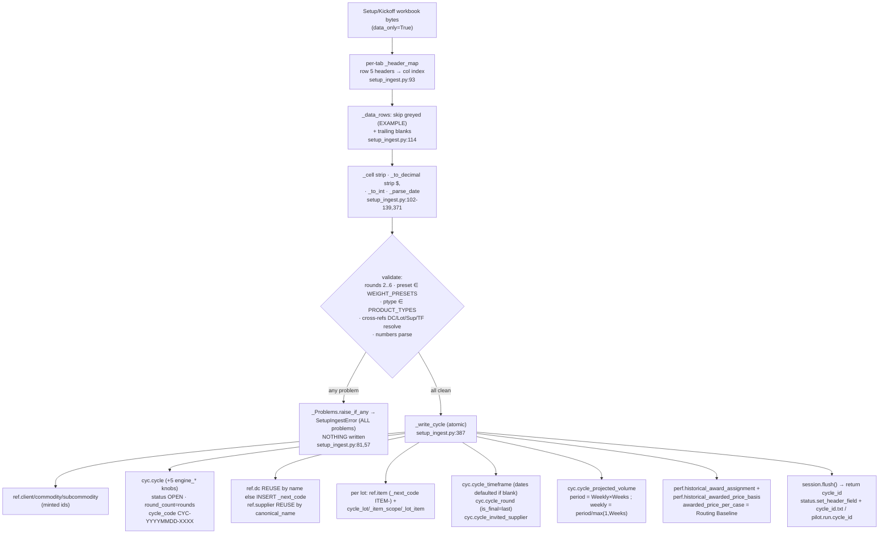
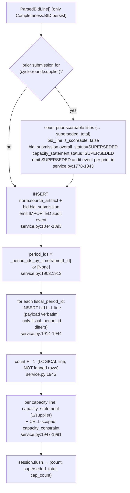
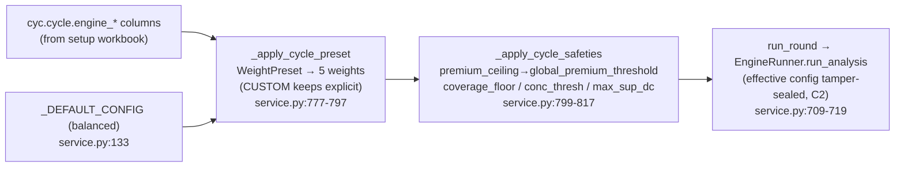
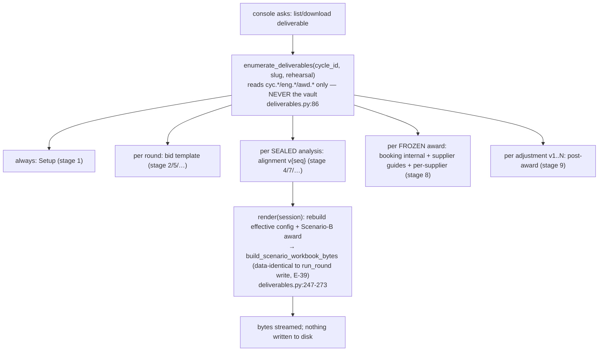

# B2 — The Pilot Ingest + Orchestration Core

## 0. Slice scope, census cross-check, and method

`find backend/app/pilot -type f` yields **13 owned `.py` source files** plus a `__pycache__/`
directory (14 compiled `.pyc` artifacts). Every owned file was read END TO END (no excerpts, no
sampling). Cross-checked against `AS_BUILT/FILE_CENSUS.md`:

| census # | file | ext | bytes | lines | owned |
|---|---|---|---|---|---|
| 150 | `__init__.py` | py | 911 | 17 | y |
| 151 | `backfill_runs.py` | py | 3903 | 105 | y |
| 152 | `deliverables.py` | py | 13762 | 332 | y |
| 153 | `flex_ingest.py` | py | 15465 | 362 | y |
| 154 | `models.py` | py | 2134 | 42 | y |
| 155 | `run_db.py` | py | 8065 | 215 | y |
| 156 | `run_repo.py` | py | 2107 | 63 | y |
| 157 | `service.py` | py | 106432 | 2376 | y |
| 158 | `setup_ingest.py` | py | 28314 | 705 | y |
| 159 | `setup_template.py` | py | 16455 | 415 | y |
| 160 | `status.py` | py | 8401 | 204 | y |
| 161 | `synthetic.py` | py | 7814 | 210 | y |
| 162 | `vault.py` | py | 19123 | 441 | y |

**Census reconciliation.** All 13 census rows (150–162) are accounted for one-to-one against the
13 files on disk. Census sizes match disk sizes exactly for every file EXCEPT the high-churn ones,
whose census `modified`/size are slightly older snapshots — disk truth at audit time:
`service.py` 106432 B / 2376 lines (census size matches), `setup_ingest.py` 28314 B / 705 lines,
`synthetic.py` 7814 B / 210 lines (census `2026-06-22T14:54:46`, disk `2026-06-22 14:46:21`). No
file is empty (the smallest, `run_repo.py`, is 63 lines / 2107 B). **There are no empty files in
this slice** — so the AUDIT_STANDARD "explain every empty file, never skip" rule has no empty
target here; explicitly recorded so the slice's zero-empties is itself a verified fact, not an
omission.

**`__pycache__/` (vendored/generated — counted, not per-file).** 14 `*.cpython-312.pyc` byte-code
files (`__init__`, `backfill_runs`, `deliverables`, `flex_ingest`, `models`, `run_db`, `run_repo`,
`service`, `setup_ingest`, `setup_template`, `status`, `synthetic`, `vault`). These are CPython
3.12 compilation caches produced by the interpreter, never hand-edited, never committed as source.
Per AUDIT_STANDARD rule 6 + CLAUDE.md "vendored/generated and not ours" they are counted here and
excluded from per-file audit. Reason for exclusion: deterministic build output of the `.py` files
above; a per-`.pyc` audit would be a tautology.

**The prompt's `bid_ingester` is NOT a pilot file.** The brief names a `bid_ingester` in the slice;
in the as-built it is `app.domain.bid.bid_ingester` (`ingest_template` / `ingest_capacity`), OUTSIDE
this slice (it belongs to the `domain/bid` slice). The pilot `service.py` *calls* it. Its exact
price-construction + quarantine semantics are load-bearing for B2's Layer-1 value map, so the
necessary internals are documented in §L1 below with `bid_ingester.py:line` citations (read in full
to verify), but the file itself is audited under its owning slice, not duplicated here.

**Why this slice matters (the WHY of the package).** `app.pilot` is the PILOT CORE
(PILOT_SYSTEM_DESIGN §8 build-order step 3): it owns the per-RFP "run" identity and the entire
ingest→orchestration spine — stamp a structurally-identical run folder/identity, generate the blank
Setup workbook, ingest the filled workbook into the governed Postgres cycle, generate per-round bid
templates, ingest returned bids (strict key-validated AND flexible "take my file as-is"), run the
sealed engine analysis, freeze awards, record post-award adjustments, compute the kanban, snapshot
the run's data/DB into git, and render every deliverable on request. It is the layer the MCP harness
server and the web-console HTTP API both wrap. Without it there is no run lifecycle — just the
domain engines with no orchestration, no setup ingest, and no per-run isolation.

---

# PART 1 — PER-FILE LAYER-2 (every file, every public symbol, detailed WHY)

---

## FILE: `backend/app/pilot/__init__.py` · py · NOT empty (17 lines) · census 150

**What.** The pilot package's public surface: re-exports `PilotService` (from `service.py`) and
`RunPaths` (from `vault.py`); `__all__ = ["PilotService", "RunPaths"]`.

**Detailed WHY it exists / why shaped this way.** A package `__init__` that re-exports the two
primary handles (the service object and the run-paths dataclass) so callers write
`from app.pilot import PilotService` instead of reaching into submodules — the conventional
public-API narrowing. The module docstring (lines 1–10) is the package's mission statement: it
names this as PILOT_SYSTEM_DESIGN step 3 and lists the responsibilities (vault scaffold, setup
template, setup ingest, kanban, service).

**WHY-DRIFT (documentation drift, flagged).** Lines 7–9 of the docstring state: *"The later loop
steps … are PART B — left as clearly-marked NotImplementedError stubs on the service."* This is
**STALE**: PART B is fully implemented in `service.py` (`generate_bid_template`, `ingest_bids`,
`ingest_any`, `run_round`, `freeze_award`, `record_adjustment`, `history`, etc. — none raise
`NotImplementedError`; `grep -n NotImplementedError backend/app/pilot/` returns only the two
docstring mentions). The docstring was not updated when PART B landed. This is a **comment/WHY
drift, not a functional stub** — the code is complete (D19 NO-STUBS satisfied in the CODE; the prose
lies). Same stale claim repeats in `service.py:16`. Recorded as a drift item in §L2-DRIFT.

**Symbols.** No functions/classes defined; two imported names re-exported. No side-effects on
import beyond importing `service` (which pulls the large dependency graph) and `vault`.

**Dependencies.** `app.pilot.service.PilotService`, `app.pilot.vault.RunPaths`.
**Dependents.** Everything that does `from app.pilot import PilotService` (see slice dependents in
§DEP): the MCP server, the API routers, the rehearsal/rehydrate scripts, the legacy dry-run script,
and the test suite.

---

## FILE: `backend/app/pilot/models.py` · py · NOT empty (42 lines) · census 154

**What.** The single SQLAlchemy ORM mapped class `Run` → table `pilot.run` (its own `pilot`
schema). Columns: `slug` (Text PK), `commodity` (Text NOT NULL), `label` (Text NOT NULL),
`rehearsal` (Boolean NOT NULL default False), `cycle_id` (Text NULLABLE), `created_at`
(`created_at_column()` helper).

**Detailed WHY.** This is the DB-backed run identity (ADR-0018 Slice 2). It replaces the harness's
"a run = a vault folder" assumption so the **stateless web console** (no server-side filesystem,
CLAUDE.md req #4) can list/resolve runs from Postgres alone. WHY each column is shaped this way:
- `slug` is the PK (not a surrogate uuid) because the slug `<commodity>-<YYYYMMDD>-<short-id>` is
  already the stable global run identifier minted by `vault.new_run_slug`; making it the PK means
  the DB row and the vault folder share one key with zero translation.
- `commodity` + `label` are the human metadata the console shows in a run list (the harness reads
  these from RUN.md/NOTES.md; the console reads them off this row).
- `rehearsal` is the SYNTHETIC-provenance flag, the DB equivalent of the `.rehearsal` vault
  sentinel; it drives whether generated artifacts are stamped SYNTHETIC vs LIVE.
- `cycle_id` is **plain Text, NULLABLE, NOT an FK** (lines 11–14 doc): cycle ids are text throughout
  the pilot path, and the run row must be insertable the moment the run starts — *before any cycle
  exists* (it gains the link on setup ingest). An FK would force the cycle to pre-exist, breaking
  the create-run-then-ingest order.
- Its own `pilot` schema (not one of the eight governed domain layers, not `auth`): a run is
  **console orchestration metadata**, not part of the governed data spine — keeping it in `pilot`
  prevents it from polluting the audited domain. **What breaks without it:** the web console cannot
  resolve runs (the harness uses files; the console has none), so every console run-list / cycle
  resolution / rehearsal-flag read fails.

**WHY the harness does NOT use it (doc lines 13–14).** The MCP harness keeps its file vault; only
the web console reads/writes this table — so the two runtimes never contend on it.

**Symbols.** `Run` (class, ORM). No methods beyond mapping. `__tablename__="run"`,
`__table_args__={"schema":"pilot"}`.

**Dependencies.** `app.core.db.base.Base`, `app.core.db.types.created_at_column`, SQLAlchemy
`Boolean`/`Text`/`Mapped`/`mapped_column`.
**Dependents.** `run_repo.py` (all CRUD), `backfill_runs.py` (indirectly via repo), and the console
paths in `service.py` (via repo functions).

---

## FILE: `backend/app/pilot/run_repo.py` · py · NOT empty (63 lines) · census 156

**What.** Thin, session-taking CRUD over the `Run` ORM row. Five functions; the caller's unit of
work owns the transaction (the repo only `flush()`es, never commits).

**Detailed WHY.** Mirrors the codebase's repository style: the service's unit of work owns the
transaction so a run-identity write rides the SAME transaction as the rest of a step (atomic with
the governed writes). The console dual-writes through these alongside the vault files in Slice 2 so
the DB row exists for every run before Slice 3 flips the *reads* onto it. The MCP harness never
calls them (it has the file vault). **What breaks without it:** the console cannot create/resolve/
relink/close runs.

**Per-function.**
- `create_run_record(session, *, slug, commodity, label, rehearsal) -> Run` — inserts a new
  `pilot.run` with `cycle_id=None` (no cycle yet), `flush()`es, returns the `Run`. Side-effect:
  one INSERT staged on the session. WHY `cycle_id=None`: the row is born the instant the run starts,
  before the cycle exists; `set_run_cycle` links it later.
- `get_run(session, slug) -> Run | None` — `session.get(Run, slug)`; None if no such run. Read-only.
- `list_run_records(session) -> list[Run]` — `SELECT … ORDER BY Run.slug` (so runs sort by commodity
  then date, because the slug encodes both). Read-only.
- `set_run_cycle(session, slug, cycle_id) -> None` — loads the row; **raises `ValueError` if the run
  is unknown** (`f"no pilot.run row for slug {slug!r}"`); else sets `run.cycle_id` + `flush()`.
  Side-effect: one UPDATE. WHY separate from create: the cycle link is established later (on setup
  ingest), so identity creation and cycle linking are decoupled — matching the lifecycle order.
- `delete_run_record(session, slug) -> None` — **idempotent**: a missing row is a no-op; else
  `session.delete` + `flush`. Side-effect: at most one DELETE. WHY idempotent: a double close-out /
  retry must not error.

**Dependencies.** `app.pilot.models.Run`, SQLAlchemy `select`/`Session`.
**Dependents.** `service.py` (`create_run_record`, `set_run_cycle`, `get_run`, `delete_run_record`),
`backfill_runs.py` (`create_run_record`, `get_run`, `set_run_cycle`).

---

## FILE: `backend/app/pilot/backfill_runs.py` · py · NOT empty (105 lines) · census 151

**What.** A one-shot, idempotent CLI (`python -m app.pilot.backfill_runs`) that seeds `pilot.run`
rows for vault folders that exist ONLY on disk (the Slice 2 → Slice 3 hand-off).

**Detailed WHY.** Before Slice 3 flips the console's run-identity *reads* from the filesystem to
`pilot.run`, every pre-existing on-disk run needs a DB row or it would vanish from the console. This
walks the vault and derives each run's identity from its files exactly as the console does — so the
backfilled rows are byte-faithful to what the console would have shown. **What breaks without it:**
runs created before the DB-identity slice disappear from the console after the read-source flip.

**Per-symbol.**
- `_NOTES_TITLE_RE` (module const) — `^#\s*NOTES\s*[—-]\s*(.+)$`, parses the run label out of
  NOTES.md's `# NOTES — {label}` header. WHY a regex on NOTES.md (not RUN.md): NOTES.md's header is
  written ONCE at creation and never re-stamped, so it is the STABLE human label; RUN.md's title is
  re-stamped to the commodity on every kanban render and would drift.
- `_label_from_notes(paths) -> str` — returns the captured label, else the slug if NOTES.md is
  missing or has no matching title. Mirrors `app.api.v1.runs._label_from_notes` (must agree exactly
  or the backfilled label diverges from the console's).
- `_cycle_id(paths) -> str | None` — reads + strips `cycle_id.txt`; empty string → None.
- `backfill_run(session, paths) -> bool` — upserts ONE folder's row: commodity from
  `status.read_status(paths)["Commodity"]`, label from `_label_from_notes`, rehearsal from
  `vault.is_rehearsal`, cycle from `_cycle_id`. Inserts only when missing (returns True), then links
  the cycle if `cycle_id.txt` carries one (whether the row was just created OR already existed —
  refreshes the link). Side-effects: ≤1 INSERT + ≤1 UPDATE on the session.
- `backfill_all(vault_root=None) -> tuple[int, int]` — runs inside ONE `unit_of_work()`
  transaction; iterates `vault.list_runs(root)`; returns `(inserted, total)`. `vault_root` defaults
  to `get_settings().vault_root`.
- `main() -> int` — calls `backfill_all`, prints `backfilled pilot.run: {inserted} inserted,
  {total} vault run(s) seen`, returns 0. Module entry: `raise SystemExit(main())`.

**Idempotency.** Re-running is safe — `get_run` guards the insert; `set_run_cycle` just refreshes.

**Dependencies.** `app.core.config.settings.get_settings`, `app.core.db.session.unit_of_work`,
`app.pilot.run_repo` (`create_run_record`/`get_run`/`set_run_cycle`), `app.pilot.status.read_status`,
`app.pilot.vault` (`RunPaths`/`is_rehearsal`/`list_runs`).
**Dependents.** Operator-run CLI; no in-app importers (one-shot migration utility).

---

## FILE: `backend/app/pilot/vault.py` · py · NOT empty (441 lines) · census 162

**What.** The per-RFP **Run Vault manager** (PILOT_SYSTEM_DESIGN §2): stamps the identical run
folder scaffold, names files by normalized workflow stage, commits/pushes to the vault git repo,
and archives/zips/purges runs. Touches **only the filesystem + git, never Postgres**.

**Detailed WHY (the package's filesystem half).** The sponsor-owned vault is the single git repo the
routine runs in; every RFP is a structurally-IDENTICAL sub-folder `runs/<slug>/`. Structural
identity is the point: the harness, the archive, and the download zip can all reason about any run
without per-run special-casing. The module is handed `vault_root: Path` (a param — tests pass a temp
dir); it never assumes a fixed location. The scaffold (doc lines 11–22): `inputs/ outputs/ memory/`,
`NOTES.md`, `RUN.md`, `run_data.json`, `cycle_id.txt` (+ optional `FEEDBACK.md`, `.rehearsal`).

**Module constants (WHY each).**
- `SUBDIR_INPUTS/OUTPUTS/MEMORY` + `_SUBDIRS` — the three identical subdirs. inputs/ = fill-out docs
  + uploaded filled files; outputs/ = generated VERSIONED workbooks; memory/ = sponsor extras + ad-hoc.
- `_RUNS_DIR="runs"`, `_NOTES_NAME`, `_RUN_NAME`, `_CYCLE_ID_NAME` — fixed scaffold names.
- `RUN_DATA_NAME="run_data.json"` — the git-versioned per-run governed-data snapshot (NAMES not
  keys, D23); the sponsor's "data in git per run" on Postgres, not Dolt.
- `FEEDBACK_NAME="FEEDBACK.md"` — dev-facing per-run signals.
- `REHEARSAL_NAME=".rehearsal"` — the provenance sentinel; its ABSENCE means a live run.

**`RunPaths` (frozen dataclass).** Every meaningful path in one run folder threaded through the
service: `root, inputs, outputs, memory, notes_md, run_md, cycle_id_file, run_data_file,
feedback_file, slug`. WHY frozen: a path handle must be immutable once built (no accidental
re-rooting mid-operation).

**Per-function.**
- `_slugify(text) -> str` — `re.sub(r"[^a-z0-9]+","-", text.strip().lower())`, strip `-`, fallback
  `"rfp"`. Filesystem-safe slug FRAGMENT from free text.
- `_build_run_paths(vault_root, slug) -> RunPaths` / `run_paths(vault_root, slug) -> RunPaths` —
  compute the handle for an existing slug; creates NOTHING.
- `stage_filename(stage, label, *, version=None, ext="xlsx") -> str` — `f"{stage:02d}_{slug}"` (+
  `_v{version}`) + `.{ext}`. THE normalized workflow-stage naming so files sort by the step that
  made them (`01_setup_kickoff.xlsx`, `04_round1_alignment_v1.xlsx`). Doctested.
- `_slugify_label(label)` — keeps underscores (stage labels are already snake_case), sanitizes the
  rest; fallback `"file"`.
- `_seed_run_md(slug, *, commodity, label)` — the kanban skeleton (Done/Doing/Next/Waiting) with the
  header bullets `Run/Commodity/Cycle (="not created yet")/Created (today UTC)`.
- `_seed_notes_md(slug, *, label)` — the NOTES.md header `# NOTES — {label}` + a dated "run created"
  line.
- `new_run_slug(commodity) -> str` — `f"{_slugify(commodity)}-{YYYYMMDD}-{uuid4().hex[:6]}"`. Mints
  a run identity WITHOUT scaffolding — so the console (no server-side files) can mint the
  `pilot.run` identity without a vault folder. The harness reuses this format for its on-disk
  scaffold.
- `create_run(vault_root, *, commodity, label, rehearsal=False) -> RunPaths` — stamps the IDENTICAL
  scaffold: makes the three subdirs (`exist_ok=False` — a fresh run must not collide), writes seeded
  RUN.md/NOTES.md, an EMPTY `cycle_id.txt` (link written on ingest), a placeholder `run_data.json`
  (filled after the first governed write), a placeholder `FEEDBACK.md`, and a `.gitkeep` in each
  subdir (git ignores empty dirs, so the skeleton would not survive a commit otherwise). If
  `rehearsal=True`, drops the `.rehearsal` sentinel. Then `git_init_and_commit(... "run {slug}
  created")`. Side-effects: many file writes + a git commit (+ push if autopush). WHY the placeholder
  files exist from commit 1: the scaffold must be structurally identical from the first commit so
  every run looks the same in git history.
- `is_rehearsal(runpaths) -> bool` — `(.root/.rehearsal).is_file()`. Drives the SYNTHETIC vs LIVE
  stamp on every artifact; **what breaks without it:** a rehearsal's output could be mistaken for a
  real cycle's (CLAUDE.md data-fidelity hazard).
- `list_runs(vault_root) -> list[RunPaths]` — sorted slugs of dirs under `runs/`; `[]` if no
  `runs/`.
- `write_to_run(runpaths, subdir, filename, data) -> Path` — validates `subdir ∈ _SUBDIRS` (else
  `ValueError`), `mkdir(parents,exist_ok)`, `write_bytes`, returns the path. No commit (the caller
  commits the whole step).
- `is_git_repo(vault_root) -> bool` — `(.git).exists()`.
- `git_init_and_commit(vault_root, message) -> None` — init if needed (+ sets a commit identity
  `pilot@kr-rfp.local` so a bare test environment can commit), then `_commit`. **Git failures are
  swallowed deliberately** (doc lines 290–292): the vault git history is a convenience layer and a
  missing/unconfigured git must NEVER break the file scaffold the pilot depends on.
- `git_commit_run(vault_root, slug, message)` — `git_init_and_commit(... f"[{slug}] {message}")`.
- `_commit(vault_root, message)` — `git add -A`; `git commit -m` (non-zero "nothing to commit" is
  swallowed); then if committed AND `_autopush_enabled()` and `git push` fails for lack of upstream,
  `git push -u origin HEAD`. WHY autopush: in the EPHEMERAL web runtime the local clone is discarded
  between sessions, so a commit only PERSISTS if pushed (D34). The `-u origin HEAD` fallback handles
  a freshly cloned / EMPTY vault so state persists from the very first write.
- `_autopush_enabled()` — `RFP_VAULT_AUTOPUSH ∈ {1,true,yes,on}` (OFF for local/tests).
- `_git(vault_root, *args) -> bool` — runs `git -C <root> …` (fixed argv, no shell, `check=False`);
  returns True on rc==0, False on any OSError/ValueError/non-zero. NEVER raises (git is best-effort).
- `archive_run(runpaths) -> Path` — zips the FULL normalized history (inputs/outputs/memory/ + `db/`
  + NOTES.md/RUN.md/run_data.json/FEEDBACK.md/cycle_id.txt/.rehearsal) under `<vault>/archives/`
  (NOT inside the run, so a later purge leaves the archive intact). Each entry stored under the run
  slug. Skips `.gitkeep`. This is the PRESENT step of present→confirm→purge close-out.
- `build_run_zip(runpaths) -> bytes` — IN-MEMORY zip for the console "download run folder"; always
  includes the folder skeleton (empty subfolders survive the unzip as drop targets), writes nothing
  to the vault. WHY two zip builders: `archive_run` persists to disk on close-out; `build_run_zip`
  serves a download with zero disk writes (no-file-storage).
- `purge_run(vault_root, slug)` — `shutil.rmtree(runs/<slug>)` then commit the removal. **Governed
  Postgres records REMAIN** — only the vault document folder is purged; the archive already preserves
  the history. Idempotent (missing folder = no-op).

**`_ARCHIVE_SUBDIRS`/`_ARCHIVE_FILES`** — the close-out manifest (includes `db/` = the run-DB
snapshot dir; see `run_db.dump_run_database` + `service._DB_SNAPSHOT`).

**Dependencies.** stdlib `os/re/shutil/subprocess/uuid/zipfile/dataclasses/datetime/pathlib`. No DB,
no app imports.
**Dependents.** `service.py` (imports 12 symbols), `status.py` (`RunPaths`/`stage_filename`),
`backfill_runs.py`, `synthetic.py` (indirectly via setup_template), the API runs router, the MCP
server.

---

## FILE: `backend/app/pilot/status.py` · py · NOT empty (204 lines) · census 160

**What.** Renders RUN.md as the **proactive kanban manifest** (PILOT_SYSTEM_DESIGN §6). Computes a
Done/Doing/Next/Waiting board from TWO sources — the governed Postgres cycle state AND the file
presence in the run folder — and reads/writes RUN.md. DB access is **read-only**.

**Detailed WHY.** The kanban is the buyer-facing "where are we / what's next" surface in the buyer's
own vocabulary (never platform jargon, §5). It is computed, not stored, so it can never drift from
reality. When `cycle_id is None` (setup not yet ingested) it computes from files alone (no DB touch).

**Constants.** `_DONE/_DOING/_NEXT/_WAITING="Waiting on you"` + `_BUCKETS`. `SETUP_FILENAME =
stage_filename(1,"setup_kickoff")` — the canonical stage-1 filename, shared so status and service
agree on what "setup present" means.

**Per-function.**
- `read_status(runpaths) -> dict[str,str]` — parses RUN.md header bullets `- **Key:** value` into a
  flat dict (`Run/Commodity/Cycle/Created`); missing RUN.md → `{}`. WHY a parser not a store: the
  header is the run's persisted metadata and `read_status` is also used by `backfill_runs` to derive
  commodity.
- `kanban(session, cycle_id, runpaths) -> dict[str, list[str]]` — the board. Branch map:
  - always: Done ← "Run folder created".
  - setup file present? Done ← "Setup/Kickoff workbook generated" else Next ← "Generate the
    Setup/Kickoff workbook".
  - `cycle_id is None OR session is None` → files-only board: if setup present, Waiting ← "Fill in …
    and upload it"; return.
  - else read `_cycle_counts`; Done ← `Cycle created (L lots, D DCs, S suppliers, T timeframes)`.
  - `rounds_with_bids>0` → Done ← "Bids loaded for X of Y round(s)".
  - `analysis_versions>0` → Done ← "N alignment analysis version(s) sealed".
  - flow: `rounds_with_bids==0` → Next ← "Send out the Round 1 bid template and load the returned
    bids"; elif `analysis_versions==0` → Doing ← "Run the alignment analysis…"; elif not
    `award_frozen` → Doing ← "Review the alignment scenarios" + Next ← "Select a scenario and freeze
    the award"; else Done ← "Award frozen" (+ Doing ← "N post-award adjustment version(s) recorded"
    if open_adjustments>0) + Next ← "Record any further negotiated reprices…".
  - Waiting: `0 < rounds_with_bids < total_rounds` → "Upload the next round's bids…"; elif
    `analysis_versions>0 and not award_frozen` → "Pick the scenario you want to award".
- `_cycle_counts(session, cycle_id) -> dict[str,int]` — eight read-only scalar COUNTs (all
  parameterized on `:cyc`): DCs (`count DISTINCT dc_id` in `cyc.cycle_projected_volume`), lots
  (`cyc.cycle_lot`), suppliers (`cyc.cycle_invited_supplier`), timeframes (`cyc.cycle_timeframe`),
  rounds (`cyc.cycle_round`), rounds_with_bids (`count DISTINCT round_id` in `bid.bid_line`),
  analysis_versions (`eng.analysis_run … is_sealed=true`), award_frozen (`awd.award … status
  ='FROZEN'`), open_adjustments (`awd.award_adjustment JOIN awd.award … cycle_id=:cyc`). `scalar`
  inner helper coerces None→0.
- `render_run_md(runpaths, status) -> None` — keeps the existing header bullets (`Run/Commodity/
  Cycle/Created`, preserving any cycle written since), replaces the four kanban sections; empty
  bucket → `- _(nothing here)_`. Writes RUN.md.
- `set_header_field(runpaths, key, value) -> None` — replace (or append if absent) a single
  `- **Key:** value` bullet; used to record the cycle id on ingest. No-op if RUN.md missing.

**Edge cases.** `session is None` is an explicit files-only path (the harness can render a board with
no DB). A run with a cycle but no rounds-with-bids still shows the correct "send Round 1" Next.

**Dependencies.** SQLAlchemy `text`/`Session`, `app.pilot.vault` (`RunPaths`/`stage_filename`).
**Dependents.** `service.py` (`status as status_mod` — `kanban`, `render_run_md`,
`set_header_field`), `backfill_runs.py` (`read_status`).

---

## FILE: `backend/app/pilot/run_db.py` · py · NOT empty (215 lines) · census 155

**What.** **Per-run database isolation (D30):** every run gets its OWN Postgres database — created
+ migrated blank, operated within, dumped to / restored from the vault, dropped on purge.

**Detailed WHY (the compliance substrate).** A run starts BLANK, carries no demo data, and is
invisible to every other run — the substrate the skill harness reads. WHY a separate DATABASE (not a
shared one with a tenant column, doc lines 9–13): the engine + intake carry GLOBALLY UNIQUE
reference codes (`ref.dc` DC01.., suppliers, items). A shared store collides across runs and lets
one run see another's rows. A database-per-run gives hard isolation with the SAME schema names, so
nothing in the app changes — only WHERE the session points. Version isolation (D32) follows: each
run's store is pinned to the migration head it was provisioned at. **What breaks without it:**
cross-run code-collisions and data leakage — a direct CLAUDE.md data-fidelity violation.

**Constants.** `_NAME_RE=[^a-z0-9]+`, `_DB_PREFIX="kr_rfp_run_"`, `_ALEMBIC_INI`
(`backend/alembic.ini`), `_ALEMBIC_SCRIPTS` (absolute `alembic/` next to the ini — CWD-independent
because the MCP server runs from elsewhere and `script_location=alembic` is relative). `_engines:
dict[str,Engine]` — one pooled engine per run-DB URL, reused across a run's calls.

**Per-function.**
- `run_db_name(slug) -> str` — `(_DB_PREFIX + slugified)[:63]` (Postgres identifier limit 63 bytes).
  Deterministic, identifier-safe.
- `run_db_url(slug) -> str` — same server/creds as the app DB with `database=run_db_name(slug)`;
  `render_as_string(hide_password=False)` because `str(URL)` masks the password as `***` (would break
  the connection — keep the REAL credential).
- `_admin_engine()` — AUTOCOMMIT engine on the `postgres` maintenance DB for CREATE/DROP DATABASE
  (those cannot run in a transaction block).
- `_migrate_to_head(url)` — alembic `command.upgrade(cfg,"head")` with `script_location` pinned
  absolute and `sqlalchemy.url` pre-set (env.py respects a pre-set URL) — D30.
- `provision_run_database(slug) -> str` — `CREATE DATABASE` if absent (guarded by a `pg_database`
  existence check), then migrate to head; returns the URL. BLANK by construction.
- `_engine_for(url)` — memoized pooled engine (`pool_pre_ping=True`).
- `run_unit_of_work(slug)` (contextmanager) — a unit of work bound to THIS run's DB: yields a
  session, `commit` on success, `rollback` on exception, `close` in finally. Mirrors the app's
  request-scoped UoW but points at the run's own DB so every Engine-agent read/write is confined to
  the run (D30).
- `_libpq_url(slug)` — the run URL as a plain libpq URI (`drivername="postgresql"`, no `+psycopg`)
  for the pg_dump/psql CLIs.
- `_run_cli(cmd)` — runs a Postgres CLI (fixed argv, no shell, `check=False`); RAISES
  `RuntimeError(f"{cmd[0]} failed ({rc}): {stderr}")` on failure (UNLIKE git, a failed dump/restore
  must surface — it is the persistence mechanism, not a convenience).
- `dump_run_database(slug, out_path) -> Path` — `pg_dump --no-owner --no-privileges` plain SQL
  (schema+data). WHY plain SQL: a full pg_dump restores into an EMPTY DB cleanly (tables, COPY,
  FK constraints last) so the FK-heavy schema round-trips without load-order issues — how a run's
  governed state survives an ephemeral web container (rides the vault git).
- `restore_run_database(slug, sql_path)` — drops the engine cache entry, terminates live backends,
  `DROP DATABASE IF EXISTS` + `CREATE DATABASE` (FRESH empty — the dump carries the schema, NO
  migrate), then `psql --set ON_ERROR_STOP=1 --file`. Inverse of dump; for session start in a fresh
  container.
- `drop_run_database(slug)` — disposes the cached engine, terminates backends, `DROP DATABASE IF
  EXISTS` (purge).

**Edge cases.** `isolate_db=False` (unit tests on a shared rolled-back session) — the service never
calls these (see `start_run`/`purge_run`/`snapshot_run` guards). Backend termination uses
`pg_terminate_backend(pid) … pid <> pg_backend_pid()` so the admin connection is never killed.

**Dependencies.** SQLAlchemy core + `make_url`, alembic (`command`/`Config`),
`app.core.config.settings.get_settings`, stdlib `re/subprocess/contextlib/pathlib`.
**Dependents.** `service.py` (`provision_run_database`, `drop_run_database`, `dump_run_database`,
`restore_run_database`); `run_unit_of_work` is used by the MCP harness server.

---

## FILE: `backend/app/pilot/setup_template.py` · py · NOT empty (415 lines) · census 159

**What.** Builds the **blank, validated, presentation-quality Setup/Kickoff workbook** the sponsor
fills (PILOT_INPUT_DOCS_SPEC step 0) — one tab per dimension. `build_setup_workbook() -> bytes`.

**Detailed WHY.** This is the entry to the whole data pipeline: the sponsor types only NAMES (D23);
the pilot generates keys on ingest. The template and `setup_ingest` SHARE the tab/column-name
constants here so they can NEVER drift (the ingester reads exactly the tabs/columns this writes).
Presentation-quality (D24) because the sponsor fills it by hand — banners, notes, greyed examples,
dropdowns reduce data-entry errors at the source (CLAUDE.md error-reduction criterion #3).

**Closed domains (shared with the ingester for validation).** `PRODUCT_TYPES=("Conventional",
"Organic")`, `REGIONS=("East","South","West","Midwest","Central")`,
`VOLUME_METHODS=("WEEKLY_X_WEEKS","PERIOD_TOTAL")`, `WEIGHT_PRESETS=("balanced","price_focus",
"coverage_focus","risk_averse","custom")`.

**Tab-name constants** (single source of truth for both modules): `TAB_CYCLE="Cycle"`,
`TAB_DCS="DCs"`, `TAB_LOTS="Lots and Items"`, `TAB_SUPPLIERS="Suppliers"`, `TAB_VOLUMES="Volumes"`,
`TAB_INCUMBENTS="Incumbents"`, `TAB_TIMEFRAMES="Timeframes"`, + optional `TAB_PREMIUMS`,
`TAB_SCENARIO_RULES`, `TAB_SAFETIES`.

**Geometry.** `HEADER_ROW=5`, `NOTE_ROW=6`, `EXAMPLE_START_ROW=7` — both modules agree (the ingester
imports these). Title block rows 1–3, header row 5, italic note row 6, greyed example rows from 7,
sponsor types below.

**Dataclasses.** `FieldSpec(header, note, width=22, number_format=None, choices=None)` — one column
(closed `choices` → a data-validation dropdown). `TabSpec(name, title, fields, examples=())` — one
dimension tab.

**`_tab_specs()`** — returns the full tab table. The CYCLE tab carries the buyer's STRATEGY KNOBS
that flow to the engine: `Horizon (weeks)`, `Rounds` (2–6), `Target Effective Date`, `Weight Preset`
(dropdown of `WEIGHT_PRESETS`), `Max Suppliers / DC`, `Premium Ceiling` (e.g. 0.12),
`Concentration Threshold` (0.40), `Coverage Floor` (0.80). These are the L1 "buyer-adjustable
strategy" values whose journey to the engine config is mapped in §L1-E. The INCUMBENTS tab's
`Routing Baseline $/case` (NUMFMT_MONEY) is the prior-period actual-paid baseline that becomes the
savings reference. VOLUMES carries `Method` (dropdown), `Weekly Cases`, `Weeks`.

**Rendering.**
- `_render_tab(ws, spec)` — title block (`app.output.formatting._title_block`); header row 5 with
  D24 header styling; italic NOTE row 6 (one note per field); greyed example rows from row 7
  (number_format applied when the value is int/float); data-validation dropdowns over a generous
  body range `EXAMPLE_START_ROW : +200` (`showDropDown=False` ⇒ the arrow IS shown — openpyxl/Excel
  quirk, noted in code); `freeze_panes` at row 7 col 1.
- `build_setup_workbook() -> bytes` — one sheet per spec (first reuses the auto-created sheet),
  saves to BytesIO, returns bytes.

**`__all__`** re-exports the tab constants + `VOLUME_METHODS`/`WEIGHT_PRESETS`/`Col`/
`build_setup_workbook` so the ingester + synthetic import them from here.

**Dependencies.** openpyxl (`Workbook`/styles/utils/datavalidation), `app.output.formatting`
(`NUMFMT_INT`/`NUMFMT_MONEY`/`Col`/`_title_block` + locally-imported `_BORDER`/`_HEADER_FILL`/
`_HEADER_FONT`/`_WRAP_CENTER`).
**Dependents.** `setup_ingest.py` (constants + geometry), `synthetic.py` (constants + builder),
`deliverables.py` (`build_setup_workbook`), `service.py` (`build_setup_workbook`).

---

## FILE: `backend/app/pilot/setup_ingest.py` · py · NOT empty (705 lines) · census 158

**What.** `ingest_setup_workbook(session, data, *, created_by="pilot") -> cycle_id` — parses the
filled Setup workbook and writes the cycle + FULL scope into the SAME governed tables the demo's
`seed_cycle` writes, but from WORKBOOK ROWS instead of synthetic constants. Keys are generated here
and embedded; the sponsor only typed names (D23).

**Detailed WHY (the setup → cycle bridge).** This is the first ingest hop and the canonical proof of
the data-fidelity contract: VALIDATION is strict — it collects EVERY unresolvable row (missing
required cells, cross-refs that don't match a named DC/Lot/Supplier/TF, bad numbers) and raises
`SetupIngestError` listing ALL problems at once. A clean workbook ingests **atomically**; a dirty
one ingests **nothing** (CLAUDE.md req #3: bad/ambiguous data is surfaced, never silently fudged).
It is service-style: executes + flushes inside the caller's UoW, NEVER commits.

**Constants.** `_BODY_START=EXAMPLE_START_ROW(=7)`, `_EXAMPLE_MARKER="(EXAMPLE)"` (rows whose key
cell still holds the greyed marker are skipped), `_MIN_ROUNDS=2`, `_MAX_ROUNDS=6` (the
`cyc.cycle.round_count` CHECK is 2..6).

**Errors / accumulator.**
- `SetupIngestError(ValueError)` — carries `.problems: list[str]`; message lists all problems
  bulleted. WHY a list: the sponsor gets every fix at once, not one round-trip per problem.
- `_Problems` — `.add(tab,row,message)` formats `tab '…', row N: message`; `.raise_if_any()` raises
  if non-empty. Called at strategic checkpoints so validation fails before any write.

**Cell readers (value-level — these are L1 hops).**
- `_id() -> str` — `str(uuid.uuid4())` (every generated key).
- `_header_map(ws)` — header text → 1-based column from row 5.
- `_cell(ws,row,col) -> str` — None→"" else `str(value).strip()`.
- `_is_example_or_blank(ws,row,key_col)` — True if the key cell is "" or contains `(EXAMPLE)`.
- `_data_rows(ws,key_col)` — the rows the sponsor actually filled (skip greyed examples + trailing
  blanks).
- `_to_decimal(raw) -> Decimal|None` — **strips `,` and `$`** then `Decimal(...)`; `None` on
  `InvalidOperation`/`ValueError`. *(L1 normalization hop: `"$13.50"` → `Decimal("13.50")`,
  `setup_ingest.py:125–129`.)*
- `_to_int(raw) -> int|None` — `_to_decimal` then `int(dec)`; None on failure. *(L1: `"13"` →
  Decimal → `int 13`.)*
- `_Named(id, name)` — a parsed entity (generated id + display name).
- `_next_code(session, count_sql, exists_sql, prefix) -> str` — next free zero-padded reference code
  (`DC03`, `ITEM-03`) UNIQUE across the shared DB. Starts at `count(*)+1`, bumps until free. WHY:
  globally-unique `ref.dc.dc_code`/`ref.item.item_code` can already be taken by another RFP when
  `isolate_db=False`, so a positional code would collide. SQL is fixed literals (never built from
  input); `:c` binds the candidate.

**Main parse + validate (`ingest_setup_workbook`).** Order and branches:
1. Load workbook `data_only=True`. Check the 7 required tabs exist (CYCLE/DCS/LOTS/SUPPLIERS/VOLUMES/
   INCUMBENTS/TIMEFRAMES); `raise_if_any` (a missing tab aborts before anything else).
2. **Cycle tab (single row).** No filled cycle row → add problem + raise. Read `cycle_label`,
   `commodity_name` (fallback `"Commodity"`), `subcommodity_name` (fallback = commodity). `rounds =
   _to_int(...) or _MIN_ROUNDS`; **range-checked 2..6** (problem if out). `target_effective =
   _parse_date(...)` if present. Engine safeties (buyer-adjustable, blank = preset):
   `premium_ceiling`, `coverage_floor`, `conc_thresh` via `_to_decimal`; `max_sup_dc` via `_to_int`;
   `weight_preset` lower-cased, validated ∈ `WEIGHT_PRESETS` (problem if unknown). *(These engine
   safeties are distinct from `cyc.cycle_safety` pricing-contract terms the engine ignores — doc
   lines 219–221.)*
3. **DCs / Suppliers** via `_parse_named_tab` (dedup by name; problem on empty/duplicate).
4. **Timeframes** — per row: dedup; `start`/`end` via `_parse_date`; `weeks = _to_int(...) or 13`.
   Empty TF set → problem. `tf_meta[name]=(start,end,weeks)`.
5. **Lots & Items (one item per lot)** — per row: dedup lot; `desc` (fallback = lot name), `pack`,
   `ptype` (validated ∈ PRODUCT_TYPES if present), `category`. Mints a lot id AND an item id.
6. **Volumes (cross-refs DC/Lot/TF)** — per row validate each cross-ref against the parsed
   name-sets (problem each miss); `weekly = _to_decimal(Weekly Cases)`, `vol_weeks = _to_int
   (Weeks)`; **both must be numbers** (else problem + skip). If all three refs resolve, append
   `(dc, lot, tf, period_cases = weekly * Decimal(vol_weeks))`. *(L1 hop:
   `projected_period_cases = Weekly Cases × Weeks`, `setup_ingest.py:299`.)*
7. **Incumbents (cross-refs DC/Lot/Supplier)** — per row validate refs; `routing = _to_decimal
   (Routing Baseline $/case)` must be a number (else problem + skip). If refs resolve, append
   `(dc, lot, supplier, routing)`.
8. `problems.raise_if_any()` — final gate: any accumulated problem aborts with NOTHING written.
9. `_write_cycle(...)` — the atomic writer.

**`_parse_named_tab` / `_parse_date`.** `_parse_date` accepts `%Y-%m-%d`, `%Y-%m-%d %H:%M:%S`,
`%m/%d/%Y`, `%m/%d/%y`; None if none parse (openpyxl may hand back a datetime string). The four
formats are the common sponsor entries; an unparseable date is treated as "not given" and falls back
to a synthesized default in the writer (it does NOT quarantine — a date is non-identity metadata).

**`_write_cycle(...)` — the FK-heavy governed write (mirrors seed_cycle).** `now = naive UTC`.
Mints `commodity_id/subcommodity_id/cycle_id` (+ `client_id`). `cycle_code =
f"CYC-{YYYYMMDD}-{cycle_id[:4].upper()}"`. `effective = target_effective or date(now.year,12,31)`.
Inserts, in FK order:
- `ref.client` (id minted explicitly, NOT gen_random_uuid, so the commodity can carry its owning
  tenant — the per-tenant audit chain resolves `client_id` via `commodity.client_id`, must not be
  NULL).
- `ref.commodity` (client_id, `COMM-…` code, name).
- `ref.subcommodity` (`SUBCOMM-…`, active_flag true).
- `cyc.cycle` — status `'OPEN'`, `why_now='Pilot setup ingest'`, `target_effective_date=effective`,
  `round_count=rounds`, and the FIVE engine-safety columns `engine_premium_ceiling/
  engine_coverage_floor/engine_conc_thresh/engine_max_sup_dc/engine_weight_preset` (the parsed
  knobs — possibly NULL when blank), `created_at=now`, `created_by`.
- `ref.dc` — **REUSE by `dc_name` if it exists** (reassigns `dc.id` to the canonical row, which
  flows to volumes/incumbents through the shared dict), else INSERT with a free `_next_code("DC")`,
  `division='Produce'`, `region='EAST'`. WHY reuse: DCs are SHARED master data; a second run in the
  shared DB would collide on `ref.dc`'s unique name/code.
- `ref.supplier` — **REUSE by `canonical_name`** else INSERT (free supplier id). Suppliers are a
  shared growing list.
- per lot: `ref.item` (free `_next_code("ITEM-")` → `ITEM-03`; items are per-RFP, fresh) +
  `cyc.cycle_lot` (`LOT-{i:02d}`) + `cyc.cycle_item_scope` (`IN_SCOPE`) + `cyc.cycle_lot_item`
  (required, sort_order i).
- per TF: `cyc.cycle_timeframe` (`TF{i:02d}`, start/end defaulted to a quarter window if blank:
  `date(year, 1+(i-1)*3, 1)` / `date(year, 3+(i-1)*3, 28)`, `week_count=weeks`).
- per round 1..rounds: `cyc.cycle_round` (`status/round_status='OPEN'`, `is_final = (i==rounds)`).
- per supplier: `cyc.cycle_invited_supplier`.
- per volume row: `cyc.cycle_projected_volume` — **`projected_weekly_cases = period /
  Decimal(max(1, weeks))`** and `projected_period_cases = period`. *(L1 hop: the period total parsed
  in step 6 is divided back to a weekly figure for the weekly column; `max(1,weeks)` guards
  divide-by-zero; `setup_ingest.py:635`.)* `volume_input_method='WEEKLY_X_WEEKS'`.
- incumbents: one `norm.normalization_run` (`HISTORICAL_AWARD`, `APPROVED`) then per row a
  `perf.historical_award_assignment` (`incumbent_flag=true`, `awarded_volume_cases=Decimal("0")`,
  effective last calendar year) + a `perf.historical_awarded_price_basis` (`routing_basis
  ='DELIVERED'`, `awarded_price_per_case=routing`, `preferred_basis_flag=true`). *(L1: the workbook's
  Routing Baseline $/case lands verbatim as the prior actual-paid price basis — the savings
  reference.)*
- `session.flush()`; returns `cycle_id`.

**Edge cases enumerated.** Missing required tab (abort). No cycle row (abort). Rounds out of 2..6
(problem). Unknown weight preset / product type (problem). Duplicate DC/supplier/lot/TF name
(problem, row skipped). Volume/incumbent cross-ref to an unnamed entity (problem). Non-numeric
Weekly/Weeks/Routing (problem, row skipped). Unparseable date (silently defaulted — non-identity).
Blank optional safety (NULL column → engine falls back to preset). DC/supplier name collision in the
shared DB (reuse, not error). **No row is ever silently dropped to "make data appear"** — every drop
is a surfaced problem that aborts the whole ingest.

**Dependencies.** openpyxl, SQLAlchemy `text`/`Session`, `app.pilot.setup_template` (constants +
geometry + `PRODUCT_TYPES`/`WEIGHT_PRESETS`), stdlib `uuid/dataclasses/datetime/decimal`.
**Dependents.** `service.py` (`ingest_setup_workbook` in `ingest_setup` / `ingest_setup_bytes`); the
e2e + setup tests.

---

## FILE: `backend/app/pilot/flex_ingest.py` · py · NOT empty (362 lines) · census 153

**What.** **Flexible bid ingest** — "take my file as-is, figure it out, parse it"
(PILOT_SYSTEM_DESIGN §4). Two public functions: `infer_bid_mapping(data, cycle) -> MappingProposal`
(infer which columns are supplier/DC/lot/all-in/fob/volume) and `apply_mapping(data, mapping, scope)
-> bytes` (produce a CLEAN key-stamped OWNED template that then ingests through the STRICT path).

**Detailed WHY (the messy-file adapter that never guesses identity).** The strict path
(`bid_ingester.ingest_template`) only reads OUR own key-stamped template. Real suppliers send messy
spreadsheets — different words, different order, no embedded keys. This is the inference + adaptation
core. CLEAN-ROOM (ADR-0001): synthetic/scope-driven only, NO `reference/` import. The inference is a
heuristic over the cycle's OWN known names + a small synonym table — **it never invents an
identity**; ambiguity is surfaced (`MappingProposal.ambiguities`) for the buyer to confirm, never
silently guessed (CLAUDE.md req #3).

**Field constants.** identity `FIELD_SUPPLIER/DC/LOT`, price/vol `FIELD_ALL_IN/FOB/VOLUME`;
`_IDENTITY_FIELDS`, `_PRICE_FIELDS`, `_ALL_FIELDS`. `_HEADER_SYNONYMS` — produce-sourcing lingo,
matched case/space-folded as substrings, longest first ("all in" beats a bare "price"): all_in
←(all in/all-in/allin/landed/delivered price/net price), fob ←(fob/farm gate/…/ex works), volume
←(volume/cases/qty/quantity/weekly/vol offered), supplier ←(supplier/vendor/grower/shipper/bidder/
company), dc ←(dc/distribution center/…/ship to), lot ←(lot/item/product/sku/commodity).

**Dataclasses.**
- `ColumnMapping(field, column_index, source_header, basis, confidence)` — one inferred column→field
  decision (`basis` = "header"/"values"/"header+values"; `confidence` = high/medium/low).
- `MappingProposal(sheet_name, header_row, mappings={}, ambiguities=[])`. `.is_confident` = all
  identity fields mapped AND at least one of all_in/fob AND no ambiguities. `.describe()` — a
  plain-language summary the skill shows the buyer.

**Per-function.**
- `_norm(value)` — space/lower-fold (`" ".join(str(v).strip().lower().split())`).
- `_find_header_row(ws, max_scan=10)` — the row (≤10) with the most non-empty text cells; pragmatic
  heuristic for a title-band-then-header layout.
- `_match_header(header) -> field|None` — first synonym substring match (None if no text).
- `infer_bid_mapping(data, cycle) -> MappingProposal` — TWO signals combined: (1) header synonym
  match; (2) **value match** — fraction of a column's body cells that resolve to the cycle's KNOWN
  supplier/DC/lot names (≥0.5 locks the identity role even if the header is odd). header+values
  agree → "high"; value-only lock → "medium"; header-only → "high" for price fields else "medium".
  A column is claimed by the field with the strongest signal; a second column claiming the same
  field appends an ambiguity (keeps the higher `_rank`). Then it surfaces MISSING identity columns +
  a missing price column as ambiguities. *Reads the workbook `data_only=True, read_only=True`.*
- `_rank(m)` — `_CONFIDENCE_RANK{high:3,medium:2,low:1}`.
- `apply_mapping(data, mapping, scope) -> bytes` — builds the CLEAN owned template for `scope`
  (`build_template_workbook` — keys embedded, D21, price cells blank), reads the messy file's priced
  rows keyed by NORMALIZED `(supplier, dc, lot)` names, then **overlays** the price/volume onto every
  matching scope row by resolving names → scope identity. Per messy row it pulls all_in/fob/volume
  via `_put_number`. On the owned template, for each body row whose `(sup,dc,lot)` matches a messy
  key, it writes All-In, FOB, and (volume → BOTH weekly + total offered columns). Returns owned-
  template xlsx bytes ready for the STRICT key-validated ingest. *(L1: the messy supplier sheet
  rarely carries the TF/item grain, so the price is written to EVERY matching (supplier,DC,lot) cell
  across the cycle's TFs/items — doc lines 274–277.)*
- `_col(mapping, field) -> int|None` — the mapped 1-based column or None.
- `_put_number(target, key, value)` — coerce a messy cell to float; skips None/bool/non-numeric;
  a string is `float(value.strip())` (ValueError → skip). *(L1 coercion hop: messy `"12.00"` →
  `float 12.0`; the value is NOT force-positived, NOT rounded — verbatim coercion only.)*

**Edge cases.** Two columns look like the same field (ambiguity, keep the higher-confidence). A
missing identity or price column (ambiguity surfaced, `is_confident=False`). A messy row missing any
of supplier/dc/lot (skipped — cannot place it). A blank/non-numeric price cell (skipped via
`_put_number`). The CLEAN-room guarantee: every produced row carries OUR embedded keys, so the
downstream strict ingest re-validates identity — flex_ingest never persists, it only *re-shapes*.

**Dependencies.** openpyxl, `app.domain.bid.template_generator.build_template_workbook`,
`app.domain.bid.template_schema` (`BODY_START_ROW`/`HEADER_ROW`/`SHEET_BIDS`/`BidColumn`/
`CycleScope`), `app.output.types.CycleView`, stdlib `dataclasses/decimal/io`.
**Dependents.** `service.py` (`infer_bid_mapping`, `apply_mapping`, `MappingProposal` in
`ingest_any`/`ingest_any_bytes`); the synthetic/e2e tests.

---

## FILE: `backend/app/pilot/synthetic.py` · py · NOT empty (210 lines) · census 161

**What.** **Synthetic TOMATO cycle builders** — the canonical in-memory setup + bid fixtures (a
small fully-priced cycle: 2 DCs, 2 lots, 2 suppliers, 1 TF, 2 rounds) as in-memory .xlsx bytes.
PURE (no DB, no pytest, no I/O beyond openpyxl in-memory).

**Detailed WHY.** ONE source of truth for a synthetic cycle, reused by BOTH the e2e test
(`tests/pilot/test_pilot_cycle_e2e.py` imports them as fixtures) AND the deploy seed
(`deploy/gcp/seed.py` imports them to seed the demo TOMATO cycle). Living in the APP package (not the
test module) means the seed never imports pytest at runtime. This is a fixture/seed factory, NOT a
shortcut around real data — every value is a real, fully-priced cell that flows through the real
ingest (D19: it builds a complete cycle, not a stub).

**Per-function.**
- `_setup_header_col(ws, header)` — find a header's column on a setup tab (AssertionError if absent).
- `_write_setup_rows(ws, rows)` — write dict rows from `EXAMPLE_START_ROW`, then BLANK three trailing
  rows (so the greyed examples below are overwritten/cleared and not re-ingested).
- `build_filled_setup(premium_ceiling=0.12, weight_preset="balanced") -> bytes` — loads the blank
  `build_setup_workbook()` and fills: CYCLE (E2E Tomatoes, Field Tomatoes/Round-Vine, Horizon 13,
  Rounds 2, TED 2026-12-31, the passed `weight_preset`/`premium_ceiling`, Max 2, Conc 0.40, Cover
  0.80); 2 DCs (Atlanta/East/GA, Dallas/South/TX); 2 lots (Grape conventional, Roma organic); 2
  suppliers (Green Valley/East/inc, Sunbelt/South/new); 1 TF (Spring 2026, 13 weeks); VOLUMES (every
  DC×lot, WEEKLY_X_WEEKS, **400 weekly × 13 weeks**); INCUMBENTS (every DC×lot → Green Valley,
  **Routing Baseline 13.50**). The `premium_ceiling`/`weight_preset` args are passed so callers can
  prove distinctive values flow to the engine. Returns xlsx bytes.
- `_header_map(ws)` — header→col for the BID template.
- `fill_bid_template(template_bytes) -> bytes` — writes synthetic All-In + volume into every scope
  row of the generated OWNED bid template. Pricing: `base=12.00`; each supplier keenest on a
  different lot so each DC's two lots split across two suppliers — Grape: Green Valley −1.50 else
  −0.20; Roma: Sunbelt −1.50 else −0.20. **FOB = price − 1.00**; **weekly 600, total 600×13**.
  *(L1: this is the synthetic FOB→All-In relationship the e2e proves the engine reconstructs; All-In
  is written verbatim, FOB is All-In minus a fixed 1.00 freight-ish delta — synthetic.py:197–206.)*

**Edge cases.** Rows with blank supplier/lot are skipped in `fill_bid_template` (the trailing
cleared rows). All values are `float(...)` from `Decimal` math (avoid binary-float drift in the
arithmetic, cast at the cell boundary).

**Dependencies.** openpyxl, `app.domain.bid.template_schema` (`BODY_START_ROW`/`HEADER_ROW`/
`SHEET_BIDS`/`BidColumn`), `app.pilot.setup_template` (tab constants + `EXAMPLE_START_ROW`/
`HEADER_ROW`/`build_setup_workbook`), stdlib `decimal/io`.
**Dependents.** `tests/pilot/test_pilot_cycle_e2e.py` (re-exports), `deploy/gcp/seed.py`,
`backend/rehearsal/synthetic_fill.py`.

---

## FILE: `backend/app/pilot/deliverables.py` · py · NOT empty (332 lines) · census 152

**What.** The **DB-backed deliverable registry** — every run output rendered ON REQUEST from the
governed DB (ADR-0018, NO-FILE-STORAGE Slice 1). `enumerate_deliverables(session, *, cycle_id, slug,
rehearsal) -> list[Deliverable]` reads ONLY governed state (`cyc.*`/`eng.*`/`awd.*`, never the vault)
and returns one `Deliverable` per item the run WOULD have written to disk, with the SAME normalized
filename and a deferred `render(session) -> bytes`.

**Detailed WHY (the no-file-storage projection).** The web console stores NO files server-side
(CLAUDE.md req #4): each deliverable is generated from the DB on request and streamed. Names match
EXACTLY what `run_round`/`freeze_award`/`record_adjustment` write to disk, so the console's file
list/download/archive is a faithful projection of the on-disk runtime. The render path reuses the
SAME bytes builders and `PilotService` view helpers as the harness write path, so on-request bytes
can NEVER diverge from what the harness saved (E-39). **What breaks without it:** the console has no
files to list/download and would violate no-file-storage if it wrote them.

**`DeliverableKind = Literal["input","output"]`** — whether the harness wrote it to inputs/ (setup,
bid template) or outputs/ (alignment, guides, post-award) — drives the console's file-list label.

**`Deliverable(name, kind, render)`** — frozen; `name` is the SAME `stage_filename`; `render` is a
deferred `Callable[[Session],bytes]` (lazy so a listing enumerates without rendering).

**`_stage(kind, round_no=0) -> int`** — a tiny standalone copy of the workflow-stage numbering
(bid_template `2+(r-1)*3`, alignment `4+(r-1)*3`, booking 8, post_award 9) so the registry has NO
service dependency for naming. *(Note: this duplicates `PilotService._stage`; both must agree — see
§L2-DRIFT.)*

**`enumerate_deliverables`** — branches:
- Always: Stage-1 Setup/Kickoff (`render=_render_setup`).
- `cycle_id is None` → return just the setup (the one thing always producible).
- else `load_cycle`; then:
  - one owned bid template per `cycle.rounds` (stage 2/5/…, `_render_bid_template`).
  - one alignment workbook per SEALED `eng.analysis_run` (`list_analyses`), at its `summary.version`
    seq (the SAME ordinal the workbook heading carries → filename matches `run_round`),
    `_render_alignment`.
  - per FROZEN `awd.award` (`list_awards`): the internal booking guide, the combined supplier guides,
    and ONE per-supplier guide per AWARDED supplier (resolved by `DISTINCT supplier_id FROM
    awd.award_line` → only awarded suppliers; named via `supplier_guide_label(award_id, award_code,
    name, id)` so a later freeze never shadows an earlier award's per-supplier file).
  - per ADJUSTMENT version v1..vN (`award_versions`, skipping v0 = the frozen baseline): one
    post-award doc (`_render_post_award`).

**Render helpers (each reconstructs the EXACT view inputs the harness write path uses).**
- `_render_setup` — `build_setup_workbook()` (no DB).
- `_render_bid_template(session,*,cycle_id,round_no)` — `load_cycle` → `build_scope_from_cycle` →
  `generate_template_bytes`.
- `_render_alignment(session,*,cycle_id,analysis_run_id,rehearsal)` — rebuilds the effective config
  (`PilotService._apply_cycle_preset` then `_apply_cycle_safeties` over `_DEFAULT_CONFIG`), the
  final round id (`_analysis_round_id`), and the in-flight Scenario-B award split
  (`_scenario_award_view`), then `build_scenario_workbook_bytes(... synthetic=rehearsal)`. Uses
  `PilotService.__new__(PilotService)` to call the view helpers WITHOUT vault/db state (they only
  need the session). *(This is the render-on-request twin of `run_round`'s write — they MUST produce
  data-identical bytes; the seal-time config is rebuilt deterministically from the cycle.)*
- `_frozen_award_view` / `_render_booking_internal` / `_render_supplier_guides` /
  `_render_supplier_guide` — load the cycle + the FROZEN award baseline (`_frozen_award_view`) and
  call the matching booking-guide bytes builder (`synthetic=rehearsal`). `_render_supplier_guide`
  guards `None` (an awarded supplier always has cells; raises if somehow not).
- `_render_post_award(session,*,award_id,version_no)` — `build_post_award_adjustments_bytes(...
  as_of_version=version_no)`.

**Edge cases.** No cycle → setup only. No sealed analysis → no alignment items. No frozen award → no
guides/post-award. v0-only award → no post-award doc. Provenance: `rehearsal` stamps SYNTHETIC on
every generated artifact (mirrors `is_rehearsal`).

**Dependencies.** `app.cycle.loader.load_cycle`, `app.cycle.scope.build_scope_from_cycle`,
`app.domain.awd.read.list_awards`, `app.domain.awd.service.award_versions`,
`app.domain.bid.template_generator.generate_template_bytes`, `app.domain.eng.read.list_analyses`,
`app.output.booking_guide.*` (bytes builders + `supplier_guide_label`),
`app.output.post_award_doc.build_post_award_adjustments_bytes`,
`app.output.scenario_workbook.build_scenario_workbook_bytes`,
`app.pilot.setup_template.build_setup_workbook`, `app.pilot.vault.stage_filename`, and (lazily inside
helpers) `app.pilot.service` (`_DEFAULT_CONFIG`/`PilotService`).
**Dependents.** The console downloads/archive API (`app.api.v1` downloads route); the deliverables
test (`tests/pilot/test_deliverables.py`).

---

## FILE: `backend/app/pilot/service.py` · py · NOT empty (2376 lines) · census 157

**What.** `PilotService` — the pilot core's **orchestration surface** (PILOT_SYSTEM_DESIGN §3/§7).
Constructed with `vault_root: Path` and three runtime flags (`isolate_db`, `db_runs`,
`persist_outputs`); drives the run-vault files directly and takes a `session` on the methods that
touch governed Postgres (DB writes ride the caller's UoW, PLAN §7). It is the thin layer the MCP
server AND the web-console HTTP API both wrap.

**Detailed WHY (the whole-loop conductor).** Every step of the RFP loop is a method here:
start_run → ingest_setup → generate_bid_template → ingest_bids/ingest_any → run_round →
freeze_award → record_adjustment → finalize_run/close_run, plus the read surface (history,
list_analyses, scenario_*, *_email_drafts) and persistence (export_run_data, feedback_file,
snapshot_run/rehydrate_runs). The three flags fork the runtime: HARNESS (files + own DB) vs CONSOLE
(no files, DB identity) — one class, two faithful runtimes. **What breaks without it:** there is no
run lifecycle; the domain engines have no driver, no setup ingest, no isolation, no kanban, no
deliverables.

**WHY-DRIFT.** Module docstring lines 8–17 still say PART B is "NotImplementedError stubs at the
bottom." STALE — PART B is fully implemented (see §L2-DRIFT). The class itself contains no stubs.

**The three runtime flags (constructor, lines 209–231).**
- `isolate_db=True` (D30) — each run gets its OWN blank DB. Unit tests sharing a rolled-back session
  pass `isolate_db=False` (then `provision/drop/dump/restore` are skipped).
- `db_runs=False` — when ON (WEB CONSOLE only) the run identity is dual-written to `pilot.run`
  alongside the vault, so the stateless console can resolve runs from the DB. OFF for the harness +
  tests that don't opt in. Dual-write rides the session passed to start_run/ingest_setup.
- `persist_outputs=True` — when OFF (WEB CONSOLE) run_round/freeze_award/record_adjustment do ONLY
  the GOVERNED DB writes (engine seal, audit events, awd_service.*) and SKIP every vault side-effect
  (workbooks/guides/post-award files, kanban/run_data/feedback files, git commit) — those render on
  request from the DB instead. ON for the harness + tests/CLI that drive the file path.

**The `module-level _DEFAULT_CONFIG` (lines 132–144).** The balanced engine preset
(`PRESET_WEIGHTS[WeightPreset.BALANCED]` — single source for the five weights; continuity 0.20 raised
from 0.10), `max_sup_dc=2`, `conc_thresh=0.40`, `global_premium_threshold=0.12`,
`coverage_floor=0.80`. The safe fallback when a caller passes no config; the setup workbook's knobs
override it per `_apply_cycle_preset`/`_apply_cycle_safeties`.

**Local dataclasses.** `_BookingCell` / `_BookingAward` (the frozen award shaped for the
booking-guide generators), `BidIngestResult` (console bid-ingest counts:
`ingested/superseded/capacity_loaded/quarantined_bids/quarantined_capacity` — returned so nothing is
persisted to disk on the console path), `FinalizeSummary`
(`closed/award_id/won_suppliers/not_won_suppliers` — ids + counts only, no commercial values).

### `PilotService` — methods (signature · WHY · side-effects · errors · branches)

**`start_run(*, commodity, label, rehearsal=False, session=None) -> RunPaths`** —
CONSOLE path (`persist_outputs` off): mint a slug (`new_run_slug`), build `RunPaths` pointing at a
non-existent folder (API shape), dual-write the `pilot.run` row if `db_runs` and a session is given;
scaffold NOTHING (Slice 6). HARNESS path: `create_run` (folder scaffold + commit), then in a
try/except — provision the run DB if `isolate_db`, write the setup workbook into inputs/, render the
kanban, commit, and dual-write the `pilot.run` row if `db_runs`+session. **On ANY failure after the
scaffold/DB exists: tear down (drop DB + purge folder) and re-raise** — a failed start never leaves
an orphan. Side-effects: folder + DB + git commit (harness) or one INSERT (console).

**`ingest_setup(session, runpaths, uploaded) -> cycle_id`** (HARNESS) — ONCE-per-run gate: if
`_cycle_id(runpaths)` is already set, raise `AppError(CONFLICT, 409)` ("re-ingesting would orphan
it"). Else read bytes from the already-in-inputs/ file, `ingest_setup_workbook`, write `cycle_id.txt`
+ the RUN.md "Cycle" header, recompute the kanban, dual-write the cycle link if `db_runs`, commit.
WHY the gate: a second ingest would orphan the prior cycle (its bids/analyses/awards left dangling).

**`ingest_setup_bytes(session, runpaths, data) -> cycle_id`** (CONSOLE, Slice 4) — the uploaded
workbook streams straight into ingest and is NEVER written to disk. Once-per-run gate checked against
the DB row (`_console_cycle_id`). `ingest_setup_workbook` + `set_run_cycle` (cycle link set ONLY on
the `pilot.run` row — no vault file).

**`remember` / `add_memory` / `_append_note`** — append a dated NOTES.md entry (+ optionally a
memory file) and commit. `add_memory` also `write_to_run(..MEMORY..)`.

**`status(session, runpaths)` / `list_runs()` / `run_paths(slug)`** — kanban dict; vault run list;
the `RunPaths` for a slug.

**Cycle-id resolvers (the runtime fork helpers).**
- `_cycle_id(runpaths)` — reads `cycle_id.txt` (harness); empty → None.
- `_console_cycle_id(session, runpaths)` — the cycle from the `pilot.run` row (console); falls back
  to the vault file when no row exists (defensive).
- `_resolve_rehearsal(session, runpaths)` — console reads `pilot.run.rehearsal`; harness reads the
  `.rehearsal` sentinel.
- `_run_cycle_id(session, runpaths)` — console→DB, harness→file (the unified resolver used by the
  read surface).
- `_load_cycle(session, runpaths)` / `_console_load_cycle(session, runpaths)` — resolve cycle id then
  `load_cycle`; raise `ValueError` if no cycle yet ("ingest the setup workbook first").

**`generate_bid_template(session, runpaths, round_no) -> Path`** — `load_cycle` →
`build_scope_from_cycle` → `generate_template_bytes`. CONSOLE: return the path only (renders on
request). HARNESS: write `0X_round{n}_bid_template.xlsx` into inputs/, update kanban (Waiting ←
"Fill in and upload the Round {n} bids"), commit.

**`ingest_bids(session, runpaths, round_no, uploaded, *, actor="pilot") -> int`** (HARNESS, strict
key-validated) — `load_cycle`, `build_scope_from_cycle`, `round_id = cycle.rounds[round_no-1].id`,
read bytes; `ingest_template(data, scope)` + `ingest_capacity(data, scope)`; `_persist_bid_lines(...)`
→ `(count, superseded, cap_count)`. Then append NOTES.md entries for: quarantined bids, quarantined
capacity, capacity loaded, superseded; recompute kanban; commit. Returns the LOGICAL priced-line
count `count`.

**`ingest_any(session, runpaths, round_no, uploaded, *, confirm=False, actor="pilot") ->
MappingProposal | int`** (HARNESS, flexible) — `confirm=False`: `infer_bid_mapping` and RETURN the
proposal (nothing written). `confirm=True`: `apply_mapping` → clean owned template → write
`0X_round{n}_bids_normalized.xlsx` into inputs/, commit, then `ingest_bids(...)` on the normalized
path.

**`ingest_bids_bytes(...) -> BidIngestResult` / `ingest_any_bytes(...) -> MappingProposal |
BidIngestResult`** (CONSOLE, Slice 4) — mirror the harness governed writes but the file is NEVER
written to disk and the quarantine/supersede/capacity signals are RETURNED, not appended to NOTES.

**`run_round(session, runpaths, round_no, config=None, *, synthetic=False, actor="pilot-runner") ->
Path`** — the sealed-analysis hop. `synthetic = synthetic or _resolve_rehearsal(...)` (a rehearsal
ALWAYS stamps synthetic). Build `IncumbentRow`s from `cycle.incumbent_by_dc_lot` + `incumbent_routing`.
Effective config = `_apply_cycle_preset(config or _DEFAULT_CONFIG, cycle)` then
`_apply_cycle_safeties(...)`. `EngineRunner(session).run_analysis(...)` seals the run. Append a
governed **SEALED** `DomainEvent` (ids only, no commercial values, Gap G-B) in the SAME transaction.
Build the in-flight Scenario-B award view; compute `version_seq` (`_run_version_seq`). The GOVERNED
writes (seal + SEALED event) ALWAYS run; the vault side-effects (write the alignment workbook,
kanban, run_data, feedback, commit) are gated by `persist_outputs`. Returns the (would-be) output
path.

**`_apply_cycle_preset(config, cycle)` (static)** — remap the FIVE scoring weights to the buyer's
named preset (`WeightPreset(cycle.weight_preset)`); blank/unknown → unchanged; CUSTOM keeps explicit
weights, records the label. *(L1-E hop.)*
**`_apply_cycle_safeties(config, cycle)` (static)** — layer the cycle's four engine safeties
(`premium_ceiling→global_premium_threshold`, `coverage_floor`, `conc_thresh`, `max_sup_dc`) over
`config` via `model_copy`; blank fields keep the preset. *(L1-E hop.)*

**`get_strategy(session, runpaths) -> dict`** — the EFFECTIVE config the next analysis will use
(preset remapped + safeties layered over `_DEFAULT_CONFIG`) — so the panel shows real in-use numbers,
not a separate copy that could drift.
**`set_strategy(session, runpaths, *, weight_preset, premium_ceiling, coverage_floor, conc_thresh,
max_sup_dc, actor="pilot") -> dict`** — validate preset ∈ `WeightPreset`; each of the three ratios in
`(0,1]`; `max_sup_dc>=1`; UPDATE `cyc.cycle` engine_* columns; `flush`; return `get_strategy`. WHY no
new store: `run_round` already layers cycle fields over the default and the sealed analysis
tamper-seals the effective config (C2).

**`freeze_award(session, runpaths, *, analysis_run_id, scenario_code="B", award_code, actor="pilot")
-> award_id`** — `awd_service.freeze_award(...)` (promotes the human-selected scenario to a FROZEN
award + emits the FROZEN audit event). Decision-support: the HUMAN asserts the award (ADR-0006). The
booking guides on disk + kanban/run_data/feedback + commit are gated by `persist_outputs`: build the
frozen `_frozen_award_view`, write the internal booking guide + combined supplier guides + ONE
per-supplier file per AWARDED supplier (named via `supplier_guide_label(award_id, award_code, …)`),
update kanban, snapshot run_data + feedback, commit.

**`record_adjustment(session, runpaths, *, award_id, adjustment_type, effective_date, reason,
line_changes, actor="pilot") -> Path`** — `awd_service.add_adjustment(...)` (the next VERSION + its
CREATED audit event). `line_changes` are `(dc_id, lot_id, tf_id, supplier_id, new_price)` tuples.
The post-award doc + kanban/run_data/feedback + commit gated by `persist_outputs`.

**`history(session, runpaths) -> dict`** — `analysis_runs` (each SEALED `eng.analysis_run` with a
1-based version ordinal + round number + engine version + sealed time), `awards` (each frozen award +
its full v0→vN version history via `awd_service.award_versions`), `output_files` (the versioned
workbooks in outputs/). The version ordinal is by `run_started_at` order.

**`export_run_data(session, runpaths) -> Path`** — writes `run_data.json`: a git-versioned snapshot
of the run's governed records, **NAMES not keys (D23)**. No cycle → a status placeholder. Else
captures cycle name/commodity, scope (dc/lot/tf/supplier/round NAMES), `bid_lines_by_round`
(**LOGICAL line count** = `count(DISTINCT (supplier_id,dc_id,lot_id,item_id,tf_id))` filtered to
`is_scoreable=true` — Option B: NOT the fanned storage rows, so it matches the ingested N + API
contract — `service.py:1136`), `analysis_versions`, and `awards` (with lines-by-name + version
history). Does NOT commit (the step commits). *(L1: this is the de-fan-out read that recovers logical
line counts from flat-13 storage.)*

**`feedback_file(session, runpaths) -> Path`** — `FEEDBACK.md`: dev signals DATA-DERIVED (D28) from
the sealed records — data-quality + competition (gate flags from `eng.bid_score.gate_flags`, no-bid
lots = scope cells − covered, thin competition <3 bidders), concentration/cap-breach
(`eng.analysis_scenario_award.cap_breach_flag` on Scenario B), template fit (count of
`*bids_normalized*` files — flexible ingest usage), process (sealed runs, frozen awards, post-award
versions), sponsor notes (last 12 NOTES.md bullets). Signals reflect the round actually SCORED (the
latest analysis run's round), not the cycle's last round.

**`close_run(runpaths) -> Path`** — `archive_run` (the present step; the skill confirms then calls
`purge_run`).
**`purge_run(slug)`** — `purge_run(vault_root, slug)` + `drop_run_database(slug)` if `isolate_db`.
**`delete_run(session, slug)`** — CONSOLE close-out: `delete_run_record` (no folder to purge; the
governed records remain).

**`finalize_run(session, runpaths, *, actor) -> FinalizeSummary`** — the terminal GOVERNED close-out
of a console run. **GATE:** a FROZEN award for the run's cycle is required, else `AppError(CONFLICT,
409)` (no cycle → same 409; no frozen award → same 409). Pick the cycle's earliest FROZEN award. The
closing deliverables: `won = len(award_email_drafts)`, `not_won = len(rejection_email_drafts)` (reuse
the SAME render-on-request generators so counts can't diverge from the notices). **IDEMPOTENT:** if
the cycle already carries a CLOSED event, return the same summary and emit NOTHING (no second CLOSED,
no forked audit chain). Else append a governed **CLOSED** `DomainEvent` (entity = the cycle, ids +
counts only, E-42). Does NOT persist any file and does NOT delete the run.

**`is_closed(session, runpaths)` / `_is_closed(session, cycle_id)` (static)** — the closed state is
DERIVED, not stored: true iff a `CLOSED` event exists in `audit.event_log` for the cycle. A run with
no cycle is never closed.

**Vault-carried DB persistence.** `_DB_SNAPSHOT="db/run_db.sql"`.
- `snapshot_run(runpaths) -> Path|None` — `dump_run_database` into `<run>/db/run_db.sql` + commit;
  no-op when `isolate_db` off. So the governed DB rides the vault git and survives a wiped box.
- `rehydrate_runs() -> list[str]` — for every vault run carrying a snapshot, `restore_run_database`;
  returns the restored slugs. The inverse of `snapshot_run` (D30/D32 — fully resumable from git).

**Internal helpers (continued).**
- `_name_index(cycle)` (static) — flat id→display-name index over every scope entity (names-not-keys
  output).
- `_iso(value)` (static) — ISO-8601 a datetime/date for JSON (None passes through).
- `_award_lines_by_name(session, award_id, name_by_id)` — the frozen award's baseline lines by name
  (`volume_share`/`frozen_price` stringified to preserve Decimal precision); sorted by
  (dc,lot,supplier).
- `_write_run_data(runpaths, snapshot)` (static) — `json.dumps(indent=2, sort_keys=False)`.
- `_render_kanban(session, runpaths, *, extra_done, extra_waiting)` — recompute + write the kanban,
  appending de-duplicated step lines.
- `_period_ids_by_timeframe(session, cycle_id) -> dict[str, list[str|None]]` — **the flat-13 fan-out
  resolver** (Option B / INTAKE §1a). Maps each `tf_id` → the list of `ref.fiscal_period.id`
  (as TEXT) covering its `start_date..end_date` via `period_for_date` + `_period_walk`. **GRACEFUL
  FALLBACK:** a timeframe outside the seeded FY16–36 calendar → `[None]` (the caller writes ONE
  tf-grain row with `fiscal_period_id` NULL). *(L1-D — the central fan-out map; `service.py:1673`.)*
- `_period_walk(first, last)` (static) — the inclusive (FY,period) span ordered across (possibly) two
  FYs.
- `_persist_bid_lines(session, cycle, round_id, lines, capacity_lines=None, *, actor="pilot") ->
  (count, superseded_total, cap_count)` — the bid-persistence core (detailed in §L1-C). One
  `norm.source_artifact` + `bid.bid_submission` per supplier (lazily via `_submission_for`), then
  ONE `bid.bid_line` PER FISCAL PERIOD in the line's timeframe span (the FAN-OUT), then capacity. A
  prior submission for the same (cycle, round, supplier) is SUPERSEDED (lines `is_scoreable=false`,
  submission + capacity statement → `SUPERSEDED`, with a SUPERSEDED audit event per prior id). Only
  `Completeness.BID` lines persist. `count` is the LOGICAL line count (NOT the fanned rows).
- `_scenario_award_view(session, cycle, analysis_run_id, *, scenario_code) -> BookingAwardView` — an
  in-flight award from `eng.analysis_scenario_award` rows (for the alignment workbook BEFORE freeze).
- `_frozen_award_view(session, cycle, award_id, scenario_code) -> BookingAwardView` — from the FROZEN
  `awd.award_line` baseline.
- `_booking_cells(cycle, rows) -> tuple[_BookingCell,...]` — build booking cells from
  (dc,lot,tf,supplier,share,price) + the cycle economics (`period_cases_by_cell`,
  `incumbent_routing`); `share`/`price` re-wrapped `Decimal(str(...))` to preserve precision.
- read surface: `list_analyses`, `name_version` (sets `eng.analysis_run.label` — a SAVEPOINT, NO
  audit event — E-43; raises ValueError/LookupError), `list_awards`, `award_detail`,
  `award_email_drafts`/`feedback_email_drafts`/`rejection_email_drafts` (the E-37 comms drafts —
  attach the supplier's OWN award guide, named on-disk for the harness or render-on-request for the
  console), `scenario_comparison`, `scenario_detail`, `_analysis_round_id`, `_run_version_seq`.
- `_stage(kind, round_no=0)` (static) — the workflow-stage numbering (bid_template `2+(r-1)*3`,
  bids_uploaded/normalized `3+(r-1)*3`, alignment `4+(r-1)*3`, booking 8, post_award 9). Raises on
  an unknown kind.
- `_new_id()` (module fn) — `str(uuid.uuid4())`.

**Errors raised across the class.** `AppError(CONFLICT,409)` (ingest_setup once-per-run;
finalize_run gate). `ValueError` (no cycle yet on `_load_cycle`/`_console_load_cycle`; bad strategy
inputs; empty version name; unknown analysis run). `LookupError` (name_version: run not a sealed
analysis). Propagated `SetupIngestError` (dirty setup workbook). Propagated engine/awd errors.

**Dependencies (the big import graph).** comms resolvers; core audit (`DomainEvent`/`EventType`/
`AuditWriter`/`client_id_for_cycle`); core errors (`AppError`/`ErrorCode`); cycle loader/scope; awd
service/models/read; bid bid_ingester (`Completeness`/`ParsedBidLine`/`ParsedCapacityLine`/
`ingest_capacity`/`ingest_template`) + bid models + template_generator; eng models/read/runner;
engine interface (`PRESET_WEIGHTS`/`EngineConfig`/`WeightPreset`); fiscal calendar
(`FiscalPeriod`/`all_periods`/`period_for_date`); output booking_guide/post_award_doc/
scenario_workbook/types; and the in-slice `status`/`flex_ingest`/`run_db`/`run_repo`/`setup_ingest`/
`setup_template`/`vault`.
**Dependents.** `app/__init__` re-export; `app.api.v1.pilot_common` / `runs` / `bids` (HTTP);
`rfp_mcp.rfp_pilot_server` / `rehydrate` (MCP harness); `rehearsal.synthetic_fill`;
`scripts.potato_legacy_dryrun`; the full pilot/api test suite.

---

# PART 2 — LAYER-1 (DATA + DATA-FLOWS) · value-level transformation map

This slice is the INGEST + ORCHESTRATION core. Every value's journey from a workbook cell to a
governed DB row is mapped below with the formula and the `file:line` that performs it.

## L1-A — Setup ingest: workbook cell → governed cycle row

**Step table (value/decimal hops).**

| # | source | transformation | formula | file:line |
|---|---|---|---|---|
| 1 | any `$`/`,`-formatted number cell | currency/thousands strip | `Decimal(raw.replace(",","").replace("$","").strip())` | setup_ingest.py:127 |
| 2 | `Rounds` cell | int coerce + range gate | `_to_int(...) or 2`; require `2≤r≤6` | setup_ingest.py:209-215 |
| 3 | `Weekly Cases`, `Weeks` | period total | `period_cases = weekly * Decimal(weeks)` | setup_ingest.py:299 |
| 4 | (period_cases, weeks) | weekly re-derivation for the weekly column | `projected_weekly_cases = period / Decimal(max(1, weeks))` | setup_ingest.py:635 |
| 5 | `Routing Baseline $/case` | verbatim → price basis | `awarded_price_per_case = routing` (no coercion of sign/scale) | setup_ingest.py:317,690-701 |
| 6 | `Target Effective Date` blank | default | `effective = target_effective or date(year,12,31)` | setup_ingest.py:417 |
| 7 | TF `start/end` blank | quarter-window default | `date(year,1+(i-1)*3,1)`/`date(year,3+(i-1)*3,28)` | setup_ingest.py:594-595 |

**Fidelity note (CLAUDE.md #3).** No row is dropped, no dimension flattened, no value
force-positived. Bad numbers are surfaced as `_Problems` and abort the WHOLE ingest. The only
"defaults" are non-identity metadata (dates), explicitly documented above.

## L1-B — Bid template → parsed bid line (price construction, in `domain/bid/bid_ingester`)

The strict ingest reads OUR key-stamped template and constructs the per-line landed price.
**FOB + freight → landed (the §7 fallback), with the double-subtract guard:**

| branch | formula | file:line |
|---|---|---|
| All-In present | `price = all_in` (verbatim — already net of discounts) | bid_ingester.py:303 / formulas.py:39 |
| All-In present **AND** Lot Discount ≠ 0 | QUARANTINE `DOUBLE_SUBTRACT` (do NOT recompute, do NOT drop the discount) | bid_ingester.py:301-302 |
| else FOB present | `price = fob + delivery_surcharge + vegcool_surcharge − lot_discount − all_lot_discount` | bid_ingester.py:307-314 / formulas.py:41 |
| neither | `price = None` → NO_BID / INCOMPLETE | bid_ingester.py:316-317 |

**Completeness classification** (`bid_ingester.py:320-341`): `price>0` → `BID`; no price intent AND
no volume → `NO_BID` (a declined cell, NOT a zero price); else `INCOMPLETE`. **Non-numeric price
cell** → `BAD_NUMERIC` quarantine (`bid_ingester.py:248-265,453`). No force-positive: a non-positive
constructed price is left to the engine to drop, never coerced.

## L1-C — Parsed bid line → `bid.bid_line` rows (persistence + supersede + capacity), `_persist_bid_lines`

**Value/grain hops.**

| # | hop | detail | file:line |
|---|---|---|---|
| 1 | flat-13 FAN-OUT | one `bid.bid_line` PER fiscal period in the tf span; payload replicated verbatim, only `fiscal_period_id` differs; `[None]` → single tf-grain row | service.py:1898-1944 |
| 2 | logical count | `count += 1` per LOGICAL priced line (NOT per fanned storage row) → preserves `ingested == N` API contract | service.py:1945 |
| 3 | price columns | `submitted_all_in_case = components.all_in`, `fob_case = components.fob`, surcharges/discount `or None`, `price_basis = line.price_basis or "ALL_IN"`, `currency_code="USD"` — verbatim, no rounding | service.py:1928-1934 |
| 4 | supersede | prior scoreable lines flipped `is_scoreable=false` (append-only, never hard-deleted, ADR-0006); prior submission + capacity statement → SUPERSEDED | service.py:1792-1843 |
| 5 | de-fan-out (read) | logical count recovered as `count(DISTINCT (supplier_id,dc_id,lot_id,item_id,tf_id))` filtered `is_scoreable=true` | service.py:1136 |

**Why the fan-out (INTAKE §1a / Option B).** Bids are STORED flat at the 13 fiscal periods so the
storage matches the engine's per-period allocation grain; the engine/scenarios/awards stay
timeframe-grain via a representative-row collapse downstream. The storage row count grows ≤13× but
the LOGICAL semantics are preserved (no double-counting; the count the buyer ingested is the count
reported). This is the canonical answer to "no flattening/coercing dimensions" — the fan-out
PRESERVES the grain, and the de-fan-out read recovers it exactly.

## L1-D — Timeframe dates → fiscal-period span (`_period_ids_by_timeframe` + `_period_walk`)

| hop | detail | file:line |
|---|---|---|
| dates → periods | `period_for_date(start)`, `period_for_date(end)` (calendar.py:137) | service.py:1706 |
| span walk | inclusive (FY,period) range across ≤2 FYs, ordered by (FY,period) | service.py:1722-1736 |
| period → id::text | `ref.fiscal_period.id` (uuid) stored as TEXT (the `bid_line.fiscal_period_id` column is varchar) | service.py:1696-1701,1718 |
| outside calendar | `period_for_date` raises `ValueError` → span = `[None]` (graceful tf-grain fallback) | service.py:1705-1709 |

## L1-E — Setup strategy knobs → effective `EngineConfig`

| knob (workbook → cyc.cycle) | engine field | rule | file:line |
|---|---|---|---|
| Weight Preset | the 5 weights (price/coverage/historical/zrisk/continuity) | remap via `PRESET_WEIGHTS[preset]`; CUSTOM keeps explicit weights | service.py:794-797 |
| Premium Ceiling | `global_premium_threshold` | override if present | service.py:809-810 |
| Coverage Floor | `coverage_floor` | override if present | service.py:811-812 |
| Concentration Threshold | `conc_thresh` | override if present | service.py:813-814 |
| Max Suppliers / DC | `max_sup_dc` | override if present | service.py:815-816 |

**Precision.** All four safeties stay `Decimal`/`int` end-to-end (no float coercion); `set_strategy`
range-checks the three ratios to `(0,1]` and `max_sup_dc>=1` (`service.py:868-876`). The sealed
analysis stores the effective config (the workbook never has to be re-read to reproduce the run).

## L1-F — Flexible ingest value flow (messy file → clean owned template → strict ingest)

| hop | detail | file:line |
|---|---|---|
| header inference | synonym substring (longest-first) | flex_ingest.py:140-150 |
| value inference | ≥50% of a column's body cells resolve to a KNOWN cycle name → locks identity | flex_ingest.py:208-214 |
| number coerce | `_put_number`: int/float/Decimal→float; str→`float(strip())`; bool/None/non-numeric skipped (NO force-positive, NO rounding) | flex_ingest.py:350-362 |
| overlay grain | price written to EVERY matching (sup,dc,lot) scope row across TFs/items (volume → both weekly + total columns) | flex_ingest.py:325-338,274-277 |
| re-validation | the produced template carries OUR embedded keys → re-validated by the STRICT ingest (never persisted directly) | flex_ingest.py:268-280 |

**Mermaid — the four required lifecycle flows are: L1-A (setup-ingest→cycle), L1-C (bid-ingest→
bid_line), L1-C+L1-E (run_round→sealed analysis), and the deliverable render-on-request below.**

## L1-G — Deliverable render-on-request (no-file-storage)

---

# PART 3 — LAYER-2 PROCESS / BRANCH / DECISION MAP

## L2 — every branch / edge case (enumerated)

**Setup ingest.** missing required tab (abort before any read) · no cycle row (abort) · rounds∉2..6
(problem) · unknown weight preset / product type (problem) · duplicate DC/sup/lot/TF (problem, skip)
· volume/incumbent cross-ref miss (problem) · non-numeric Weekly/Weeks/Routing (problem, skip) ·
unparseable date (silent default — non-identity) · DC/sup name collision in shared DB (REUSE) ·
ANY problem → `SetupIngestError` and NOTHING written (atomic). Once-per-run: second ingest →
`AppError(409)`.

**Bid ingest.** `Completeness.BID` (persist) · `NO_BID` (declined cell — not persisted, not a zero)
· `INCOMPLETE` (partial — not persisted) · blank key → `MISSING_KEY` quarantine · unknown/foreign
key → `UNKNOWN_KEY`/`KEY_MISMATCH` quarantine (NEVER name-resolve) · non-numeric → `BAD_NUMERIC` ·
All-In + Lot Discount → `DOUBLE_SUBTRACT` quarantine · re-send → SUPERSEDED (no double-count) ·
negative capacity max → `BAD_NUMERIC` · blank capacity cell → no statement (skipped, not a zero) ·
missing Capacity sheet → empty result (not an error). Harness appends NOTES; console RETURNS counts.

**Flex ingest.** two columns same field → ambiguity (keep higher confidence) · missing identity/price
column → ambiguity (`is_confident=False`) · messy row missing sup/dc/lot → skipped · blank/non-numeric
price → skipped. `confirm=False` returns the proposal (nothing written); `confirm=True` produces a
clean owned template re-validated by the strict path.

**run_round.** governed seal + SEALED event ALWAYS run; vault side-effects gated by `persist_outputs`
· rehearsal forces `synthetic=True` regardless of caller flag · effective config = preset+safeties
over default.

**freeze_award.** governed freeze + FROZEN event always; guides/files/commit gated by
`persist_outputs` · per-supplier files only for AWARDED suppliers (award-id-stamped, no shadowing).

**finalize_run.** no cycle → 409 · no frozen award → 409 · already CLOSED → idempotent no-op (same
summary, no second event) · else CLOSED event (entity = cycle, ids+counts only).

**Runtime forks.** `isolate_db` on/off (own DB vs shared rolled-back session) · `db_runs` on/off
(dual-write `pilot.run` vs harness file vault) · `persist_outputs` on/off (vault side-effects vs
render-on-request). Cycle-id resolution: console → `pilot.run.cycle_id`, harness → `cycle_id.txt`.

**Failure safety.** `start_run` tears down (drop DB + purge folder) on any post-scaffold error · git
operations swallow failures (best-effort convenience) · pg_dump/psql/restore RAISE on failure (the
persistence mechanism must surface) · `delete_run_record`/`purge_run` idempotent.

## L2 — decision-points / epics enforced (D-id / E-xx → file:line)

| decision/epic | where enforced |
|---|---|
| **D19** (no MVP/stubs) | every PART-B method is implemented (no `NotImplementedError` in code); see DRIFT for stale docstrings |
| **D20/D21** (key-validated ingest, never name-resolve) | `bid_ingester.ingest_template`/`ingest_capacity`; `flex_ingest.apply_mapping` produces key-stamped template re-validated by it |
| **D23** (sponsor types names; pilot generates keys; names-not-keys output) | setup_ingest `_id()`/`_write_cycle`; `export_run_data` name index (service.py:1180-1197); `_award_lines_by_name` |
| **D24** (presentation-quality docs) | setup_template `_render_tab` (banners/notes/dropdowns) |
| **D28** (data-derived feedback) | `feedback_file` signals all read from sealed records (service.py:1201) |
| **D30** (per-run DB isolation) | run_db.py; `start_run` provision, `purge_run` drop, `snapshot_run`/`rehydrate_runs` |
| **D32** (version isolation, pinned head) | `provision_run_database` migrates to head; `restore` reloads without migrate |
| **D34** (vault push to persist in ephemeral runtime) | vault `_commit`/`_autopush_enabled` |
| **ADR-0001** (clean-room, no `reference/` import) | flex_ingest heuristic over cycle's own names only |
| **ADR-0006** (human asserts award; supersede not delete) | freeze_award; `_persist_bid_lines` supersede (is_scoreable flip) |
| **ADR-0018 Slices 1-6** (no-file-storage; DB-backed identity; bytes ingest; render-on-request) | deliverables.py; models/run_repo; `*_bytes` methods; `persist_outputs` gating; `delete_run` |
| **E-37/E-38/E-38b/E-39/E-42/E-43** | comms drafts; capacity persist; capacity over-cap flagged downstream; render-on-request data-identity; finalize CLOSED ids-only; `name_version` no-audit savepoint |
| **Gap G-B** (decision events in-txn) | SEALED (run_round), IMPORTED/SUPERSEDED (`_persist_bid_lines`), FROZEN (awd_service), CLOSED (finalize) — all on the caller's transaction |

## L2-DRIFT — decisions NOT enforced / documentation drift found

1. **STALE DOCSTRINGS (PART B "stubs").** `__init__.py:7-9` and `service.py:8-17` claim PART B is
   "NotImplementedError stubs." PART B is fully implemented (verified: `grep NotImplementedError`
   finds only these two prose mentions). **Impact:** documentation-only; the code satisfies D19. The
   prose should be updated. This is the only D19-adjacent drift and it is a comment, not a stub.
2. **DUPLICATED `_stage` numbering.** `deliverables._stage` (deliverables.py:74) re-implements
   `PilotService._stage` (service.py:2360) instead of importing it. They currently AGREE
   (bid_template `2+(r-1)*3`, alignment `4+(r-1)*3`, booking 8, post_award 9), so filenames match —
   but it is a deliberate decoupling (the registry must not depend on the service for naming) that
   carries a drift RISK if one is changed without the other. Documented as intentional in the code
   comment; flagged here so a future change keeps them in sync.

No other ratified decision in scope was found unenforced.

---

# PART 4 — DEPENDENCIES & DEPENDENTS (slice-level)

**External packages the slice depends on:** openpyxl, SQLAlchemy (+ alembic), pydantic (via
EngineConfig), CPython stdlib (uuid/re/subprocess/zipfile/json/decimal/datetime/pathlib/io).

**In-repo modules the slice depends on (outside the slice):** `app.core.*` (db/base, db/types,
db/session, config/settings, audit/*, errors/taxonomy), `app.cycle.*` (loader/scope),
`app.domain.awd.*`, `app.domain.bid.*` (bid_ingester/models/template_generator/template_schema),
`app.domain.eng.*` (models/read/runner), `app.engine.*` (interface/formulas),
`app.fiscal.calendar`, `app.output.*` (formatting/booking_guide/post_award_doc/scenario_workbook/
types), `app.comms.resolvers`.

**Dependents of `app.pilot` (importers outside the slice — verified via grep):**
`backend/app/api/v1/{bids,pilot_common,runs}.py` (HTTP console),
`backend/rfp_mcp/{__init__,rehydrate,rfp_pilot_server}.py` (MCP harness),
`backend/rehearsal/synthetic_fill.py`, `backend/scripts/potato_legacy_dryrun.py`,
and the tests `backend/tests/{api/test_alignment,api/test_bids,api/test_downloads,api/test_runs,
audit/test_decision_events,awd/test_award_read,bid/test_capacity_persist,bid/test_period_import,
ref/test_fiscal_period_table}.py` plus the in-`tests/pilot/` suite.

**Internal slice graph.** `service.py` is the hub importing `status`, `flex_ingest`, `run_db`,
`run_repo`, `setup_ingest`, `setup_template`, `vault`. `__init__` re-exports `service` + `vault`.
`backfill_runs` → `run_repo`+`status`+`vault`. `deliverables` → `setup_template`+`vault` (+ lazy
`service`). `synthetic` → `setup_template` (+ domain/bid schema). `setup_ingest` → `setup_template`.
`status` → `vault`. `run_repo` → `models`. No import cycles at module top-level (`deliverables`'s
`service` import is deferred inside helper functions to break what would otherwise be a cycle).

---

# PART 5 — VERIFICATION NOTES (what was checked vs asserted)

- Every one of the 13 files was read END TO END (line counts above match `wc -l`).
- The FOB→landed formula and the bid quarantine/completeness semantics were verified by reading
  `app/domain/bid/bid_ingester.py` (out-of-slice dependency) + `app/engine/formulas.py:21-42` in
  full — the §7 formula is `fob + delivery + vegcool − lot_discount − all_lot_discount` with All-In
  taken verbatim and the All-In+discount double-subtract quarantined.
- The flat-13 fan-out + de-fan-out logical count were verified against `service.py:1898-1945`
  (write) and `service.py:1128-1142` (read) and `_period_ids_by_timeframe`/`_period_walk`
  (1673-1736) + `app/fiscal/calendar.py` (`period_for_date`/`all_periods`/`FiscalPeriod`).
- The two drift findings (stale "stub" docstrings; duplicated `_stage`) were confirmed by grep, not
  assumed.
- Census rows 150–162 reconciled one-to-one to disk; no empty files in the slice; `__pycache__`
  counted as vendored/generated (14 `.pyc`), excluded from per-file audit per the standard.
- NOT independently verified against a live DB/MCP run (this is a read-only static audit): the exact
  runtime row counts, the engine's downstream representative-row collapse, and the
  `eng.*`/`awd.*`/`audit.event_log` column shapes are taken from the SQL strings + ORM models as
  written here; their schema truth is owned by the DB-schema slice and should be cross-checked there.
