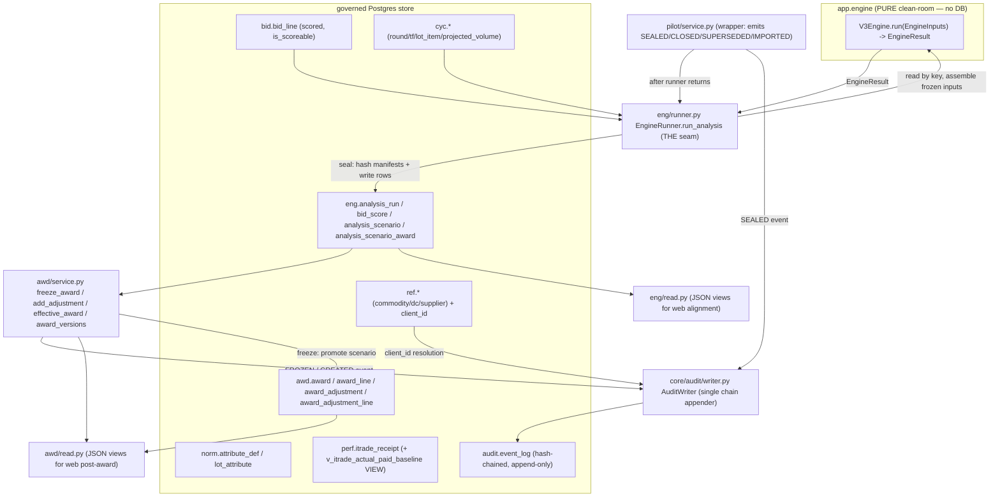

# Slice B4 — `domain/{eng,awd,norm,perf,audit}` exhaustive as-built

## 0. SCOPE INVENTORY (census cross-check)

`find` of the five directories returned the files below. The owned `.py` files cross-check
1:1 against `FILE_CENSUS.md` rows 100-129 (audit 100-101, awd 102-105, eng 116-119, norm
120-121, perf 122-123). `__pycache__/*.pyc` are vendored/generated CPython bytecode (counted,
NOT per-file audited per AUDIT_STANDARD rule 6 / CLAUDE.md exhaustiveness bullet on
vendored/generated trees) — they are byte-for-byte derivatives of the `.py` sources audited here.

| # | census row | path | ext | bytes | lines | empty? | mtime |
|---|-----------|------|-----|-------|-------|--------|-------|
| 1 | 116 | backend/app/domain/eng/__init__.py | py | 87 | 1 | NO (1-line docstring) | 2026-06-18T05:37 |
| 2 | 117 | backend/app/domain/eng/models.py | py | 6343 | 119 | no | 2026-06-22T11:14 |
| 3 | 118 | backend/app/domain/eng/read.py | py | 14858 | 349 | no | 2026-06-22T11:14 |
| 4 | 119 | backend/app/domain/eng/runner.py | py | 22886 | 538 | no | 2026-06-22T02:20 |
| 5 | 102 | backend/app/domain/awd/__init__.py | py | 72 | 1 | NO (1-line docstring) | 2026-06-18T05:37 |
| 6 | 103 | backend/app/domain/awd/models.py | py | 5046 | 103 | no | 2026-06-19T21:09 |
| 7 | 104 | backend/app/domain/awd/read.py | py | 7949 | 212 | no | 2026-06-21T15:34 |
| 8 | 105 | backend/app/domain/awd/service.py | py | 13440 | 381 | no | 2026-06-21T15:34 |
| 9 | 120 | backend/app/domain/norm/__init__.py | py | 81 | 1 | NO (1-line docstring) | 2026-06-18T05:37 |
| 10 | 121 | backend/app/domain/norm/models.py | py | 2989 | 67 | no | 2026-06-18T22:11 |
| 11 | 122 | backend/app/domain/perf/__init__.py | py | 79 | 1 | NO (1-line docstring) | 2026-06-18T05:37 |
| 12 | 123 | backend/app/domain/perf/models.py | py | 5743 | 101 | no | 2026-06-18T22:11 |
| 13 | 100 | backend/app/domain/audit/__init__.py | py | 265 | 5 | no | 2026-06-18T05:37 |
| 14 | 101 | backend/app/domain/audit/models.py | py | 916 | 20 | no | 2026-06-18T05:37 |

**EMPTY FILES: NONE in this slice.** Three files are *one-line* (`eng/__init__.py`,
`awd/__init__.py`, `norm/__init__.py`, `perf/__init__.py` — 4 of them) but each carries a real
docstring, so none is the zero-byte/blank kind the census flags `EMPTY`. Census "empty?" column is
blank for all 14 (column shows `y` = "is this an owned/in-scope file", not "is empty"). Each
one-liner's WHY is given per-file below — none is a silent package stub.

Generated/vendored (counted, not per-file audited):
`eng/__pycache__/{__init__,models,read,runner}.cpython-312.pyc`,
`awd/__pycache__/{__init__,models,read,service}.cpython-312.pyc`,
`norm/__pycache__/{__init__,models}.cpython-312.pyc`,
`perf/__pycache__/{__init__,models}.cpython-312.pyc`,
`audit/__pycache__/{__init__,models}.cpython-312.pyc` — 14 `.pyc` files, CPython 3.12 bytecode.

---

## 1. ARCHITECTURE OF THE SLICE (where these five packages sit)

These five packages are **persistence-domain (`app.domain.*`)** code — they touch the governed
Postgres store (SQLAlchemy ORM + raw SQL). This is deliberately the opposite side of the wall from
`app.engine.*`, which is the **clean-room PURE engine** (stdlib + pydantic only, NO sqlalchemy;
ADR-0001 clean-room, ADR-0006 decision-support). The only place the two sides meet is
`eng/runner.py` (the seam: it owns store I/O + clock + hashing + transaction and calls the pure
`V3Engine.run`). Layering, by package:

- **`eng`** — the engine runner's SEALED decision-support output spine. ORM (`models.py`) over
  `eng.analysis_run` / `eng.bid_score` / `eng.analysis_scenario` / `eng.analysis_scenario_award`;
  the runner (`runner.py`) that produces sealed runs; the JSON read layer (`read.py`) the web
  alignment screens consume.
- **`awd`** — the FROZEN award baseline + append-only versioned post-award adjustment layers
  (ADR-0014 freeze-and-layer). ORM (`models.py`), the service that freezes + layers + computes
  effective price (`service.py`), the JSON read layer (`read.py`).
- **`norm`** — the shared attribute taxonomy (D14): ORM-only (`models.py`) over
  `norm.attribute_def` + `norm.lot_attribute`. No service/read here.
- **`perf`** — the iTrade receipt feed (E-08/D11): ORM-only (`models.py`) over
  `perf.itrade_receipt`. No service/read here; the D11 baseline is a migration-only VIEW.
- **`audit`** — STUB read-models package only. WRITES go exclusively through `app/core/audit/`
  (the single hash-chained writer), never through this package or any domain service directly.

Two runtimes (per CLAUDE.md / AUDIT_STANDARD): the **stateless console DB** runtime (these
packages run inside it) vs the **MCP harness file-vault**. Nothing in B4 writes server-side files
(CLAUDE.md req 4); all output is rows in the DB, and read.py modules return JSON-safe Pydantic for
on-request render.

**Unit-of-work discipline (PLAN §7), enforced in every B4 service/runner method:** add + flush,
NEVER commit. The caller's `unit_of_work` owns the transaction so a sealed run (or freeze, or
layer) and its rows — AND its audit event — land atomically. Verified: neither `runner.py`,
`awd/service.py`, nor any read fn calls `session.commit()` (grep-confirmed absent).

---

## 2. PER-FILE AUDIT (every file, detailed WHY, every function/column)

### 2.1 `backend/app/domain/eng/__init__.py` — census 116 (87 bytes, 1 line)
- **What:** package marker. Single docstring: `"""Engine layer ('eng' schema) — present-but-empty
  stub (PLAN §2, ENG-PLAN §3)."""`. No exports.
- **WHY it exists / why this shape:** Python needs `__init__.py` to make `app.domain.eng` an
  importable package (so `from app.domain.eng.models import AnalysisRun` resolves). It is a marker
  on purpose — the package does NOT re-export its models/runner/read symbols, so importers must
  reach the concrete module (`...eng.models`, `...eng.runner`). This keeps import side-effects nil
  (importing the package does not pull SQLAlchemy ORM registration of every table) and avoids
  circular-import hazards between `models`/`runner`/`read`.
- **What breaks without it:** the package is not importable; every `app.domain.eng.*` import fails
  at startup; the runner, read layer, and ORM all 404 at import time.
- **Why "present-but-empty stub" wording:** historical — when the schema was first carved (PLAN §2)
  the package had no Python yet (migration-only). It now has models/read/runner; the docstring is
  stale but harmless. (Drift note — see §6 D-DRIFT-1.)

### 2.2 `backend/app/domain/eng/models.py` — census 117 (6343 bytes, 119 lines)
- **What:** SQLAlchemy 2.0 mapped classes for the four `eng.*` sealed-output tables. Built on a
  per-schema declarative base `EngBase = SchemaBase("eng")` (runtime) aliased to static `Base` for
  the type checker (lines 32-37).
- **WHY / why this shape:** the runner needs typed, round-trippable ORM rows to persist its sealed
  output. The module's stated rule (lines 13-14): **"COLUMN ALIGNMENT: mirrors migration 0008
  verbatim so the ORM round-trips against the migration"** — the same lockstep rule the
  `ref`/`bid` models follow. Verified column-by-column against migration `0008_eng_analysis_run.py`
  (+ `0009` rec_type, `0020` label) below — every name/type/precision/nullable/default matches.
- **WHY the M0 solver spine is NOT here (lines 16-18):** the heavyweight governed solver tables
  (`eng.calculation_run` / `eng.scenario` / `eng.scenario_award` from the M0 baseline) are
  SQL-managed and require the full eligibility/landed-cost chain; the runner instead writes a
  LIGHTWEIGHT sealed decision-support spine (these four classes). Deliberate split per ENG-PLAN §3 /
  migration 0008 WHY block — not an omission.
- **Decimal aliases (lines 39-41):** `_Money = Numeric(18,6)` (6-dp money), `_Score = Numeric(9,4)`
  (4-dp scores 0-100), `_Share = Numeric(9,6)` (6-dp 0..1 volume fractions). These define the exact
  DB precision/scale every value lands at — the decimal's resting precision.
- **What breaks without it:** the runner cannot persist; no `eng.*` rows; the read layer + workbook
  have nothing to read; the whole alignment slice is dead.
- **Dependencies:** `sqlalchemy` (Boolean/DateTime/Numeric/String/Text, Mapped/mapped_column),
  `app.core.db.base` (Base, SchemaBase). No cross-domain imports (clean).

**ORM model `AnalysisRun` → table `eng.analysis_run` (lines 44-63). Every column:**

| column | ORM type | DB type (mig 0008/0020) | nullable | default | PK/UNIQUE/CHECK/FK | WHY |
|--------|----------|-------------------------|----------|---------|--------------------|-----|
| analysis_run_id | String(36) | varchar(36) | NOT NULL | — | **PK**; part of UNIQUE `uq_analysis_run_identity (analysis_run_id, cycle_id, round_id)` | UUID4 surrogate run identity (D21 key-not-name). |
| cycle_id | String(36) | varchar(36) | NOT NULL | — | FK → cyc.cycle(cycle_id); in uq_analysis_run_identity | which RFP cycle this run scored. |
| round_id | String(36) | varchar(36) | NOT NULL | — | composite FK `(round_id, cycle_id)` → cyc.cycle_round; in uq_analysis_run_identity | which round; composite FK guarantees the round belongs to that cycle (no cross-cycle round). |
| engine_version | String(60) | varchar(60) | NOT NULL | — | — | the engine version PIN (reproducibility; from `result.engine_version`). |
| config_preset | String(40) | varchar(40) | NOT NULL | — | — | the named weights preset used (`config.preset.value`). |
| status | Text | text | NOT NULL | — | — | run status; runner always writes `"SEALED"`. |
| is_sealed | Boolean | boolean | NOT NULL | False (ORM) / `false` (DB) | DB CHECK `ck_analysis_run_sealed_finished (is_sealed=false OR run_finished_at IS NOT NULL)` | immutability flag; once true the row is append-only (ADR-0006). Runner always sets True. |
| input_hash_manifest | String(128) | varchar(128) | NOT NULL | — | DB CHECK `length>=8` | sha256 (64 hex) of canonical inputs — tamper-evidence over the frozen inputs. |
| output_hash_manifest | String(128) | varchar(128) | NOT NULL | — | DB CHECK `length>=8` | sha256 of canonical outputs — tamper-evidence over the result. |
| run_started_at | DateTime | timestamp | NOT NULL | — | — | naive-UTC clock at run start. |
| run_finished_at | DateTime | timestamp | NOT NULL | — | — | naive-UTC clock at seal; the sealed-finished CHECK references it. |
| run_by | String(120) | varchar(120) | NOT NULL | — | — | actor (default `"engine-runner"`, pilot passes the real actor). |
| label | String(120) | varchar(120) | **NULLABLE** | None | — (added by mig 0020) | E-43 savepoint NAME; **plain metadata, NOT a governed decision — writes NO audit event** (mig 0020 WHY + model lines 61-63). |

> NOTE — ORM does NOT declare the UNIQUE/CHECK/FK constraints; only the migration does. The ORM
> mirrors columns + PK only (Mapped/mapped_column). DB is the source of truth for constraints
> (verified by reading mig 0008). This is the documented lockstep contract, not a gap.

**ORM model `BidScore` → table `eng.bid_score` (lines 66-85). Every column:**

| column | ORM type | DB type | nullable | PK/UNIQUE/CHECK/FK | WHY |
|--------|----------|---------|----------|--------------------|-----|
| bid_score_id | String(36) | varchar(36) | NOT NULL | **PK** | UUID4 per score row. |
| analysis_run_id | String(36) | varchar(36) | NOT NULL | FK → eng.analysis_run; UNIQUE `uq_bid_score_per_run_line (analysis_run_id, bid_line_id)` | the run this score belongs to; the UNIQUE stops double-scoring a line in one run. |
| bid_line_id | String(36) | varchar(36) | NOT NULL | in uq_bid_score_per_run_line | the scored bid.bid_line (the `BidLine` PK). |
| supplier_id / dc_id / lot_id / tf_id | String(36) ×4 | varchar(36) | NOT NULL | — | the cell-key denormalised onto the score for keyed reads (no name-resolve). |
| price_score / coverage_score / hist_score / zrisk_score / continuity_score / rec_score | Numeric(9,4) ×6 | numeric(9,4) | NOT NULL | — | the five banded factors + composite rec_score (0-100, 4-dp). Engine-computed; runner copies verbatim. |
| is_eligible | Boolean | boolean | NOT NULL | — | gate eligibility (drops disqualified bids from award eligibility). |
| gate_flags | Text | text | **NULLABLE** | — | joined gate reasons (`"; ".join(score.gate_flags)`), NULL when none. |

**ORM model `AnalysisScenario` → table `eng.analysis_scenario` (lines 88-98). Every column:**

| column | ORM type | DB type | nullable | PK/UNIQUE/FK | WHY |
|--------|----------|---------|----------|--------------|-----|
| analysis_scenario_id | String(36) | varchar(36) | NOT NULL | **PK** | UUID4 per lens-header. |
| analysis_run_id | String(36) | varchar(36) | NOT NULL | FK → eng.analysis_run; UNIQUE `uq_analysis_scenario_per_run_code (analysis_run_id, scenario_code)` | the run; UNIQUE = one row per lens per run. |
| scenario_code | String(4) | varchar(4) | NOT NULL | in uq | the A-G lens code. |
| label | String(160) | varchar(160) | NOT NULL | — | human lens label (decision-support; never an assertion). |
| description | Text | text | **NULLABLE** | — | lens description; runner writes `description or None`. |
| objective_total_spend | Numeric(18,6) | numeric(18,6) | **NULLABLE** | — | per-lens objective spend benchmark (`_scenario_spend`); NULL allowed for lenses with no spend computed. |

**ORM model `AnalysisScenarioAward` → table `eng.analysis_scenario_award` (lines 101-119). Every column:**

| column | ORM type | DB type | nullable | default | PK/UNIQUE/CHECK/FK | WHY |
|--------|----------|---------|----------|---------|--------------------|-----|
| award_id | String(36) | varchar(36) | NOT NULL | — | **PK** | UUID4 per split-award row. |
| analysis_scenario_id | String(36) | varchar(36) | NOT NULL | — | FK → eng.analysis_scenario; UNIQUE `uq_analysis_award_cell_supplier (analysis_scenario_id, dc_id, lot_id, tf_id, supplier_id)` | the lens; UNIQUE = one row per (cell, supplier) per lens (so a split cell holds N supplier rows, never a dup). |
| dc_id | String(36) | varchar(36) | NOT NULL | — | FK → ref.dc; in uq | cell DC. |
| lot_id | String(36) | varchar(36) | NOT NULL | — | FK → cyc.cycle_lot; in uq | cell lot. |
| tf_id | String(36) | varchar(36) | NOT NULL | — | FK → cyc.cycle_timeframe; in uq | cell timeframe (mapped from engine tf_code via tf_id_by_code). |
| supplier_id | String(36) | varchar(36) | NOT NULL | — | FK → ref.supplier; in uq | the awarded supplier. |
| volume_share | Numeric(9,6) | numeric(9,6) | NOT NULL | — | DB CHECK `ck_analysis_award_volume_share_range (>=0 AND <=1)` | the supplier's split fraction of the cell (V3 §4/D10). |
| awarded_price | Numeric(18,6) | numeric(18,6) | NOT NULL | — | **DB CHECK `ck_analysis_award_price_positive (awarded_price > 0)`** | the recommended $/case. Runner SKIPS any award with price<=0 (runner.py:433-434) precisely to satisfy this CHECK. |
| is_recommended | Boolean | boolean | NOT NULL | False/`false` | — | B-only default-recommendation flag. |
| is_fallback | Boolean | boolean | NOT NULL | False/`false` | — | the cell had no eligible bid → fallback pick (D builds fallback rows). |
| cap_breach_flag | Boolean | boolean | NOT NULL | False/`false` | — | concentration cap exceeded (G1/D10 — B flags, the award doesn't reject). |
| rec_type | String(40) | varchar(40) | **NULLABLE** | None | — (added by mig 0009) | §5 Scenario-B reason label (Lowest cost / Coverage advantage / Comparable / Defensible / Risk-adjusted). **B-only — NULL for other lenses** (model lines 117-119, mig 0009 WHY). The authoritative "why this pick"; outputs render it, never a hardcoded clause (D28). |

### 2.3 `backend/app/domain/eng/read.py` — census 118 (14858 bytes, 349 lines)
- **What:** the JSON-serializable READ layer over the sealed `eng.*` rows — the web alignment slice.
  Eight Pydantic response models + four read functions + one private reshape helper.
- **WHY / why this shape (lines 1-22):** today the engine's scenario/award/score data is only
  readable INSIDE the Excel writer (`app.output.scenario_workbook`). This module exposes the SAME
  numbers as plain Pydantic the web can consume WITHOUT openpyxl. The hard contract (lines 12-17):
  **"NUMBERS MATCH THE WORKBOOK BY CONSTRUCTION"** — it reuses the workbook's pure gathers
  (`_gather_scenario_rollups`, `_gather_cells`) and `PilotService._scenario_award_view`, RESHAPING
  not recomputing, so web ≡ Excel (a consistency test asserts this). This is CLAUDE.md req 3 (data
  fidelity — reconcile to the SAME numbers at each step) made concrete: one gather, two renderers.
- **WHY it lives in `eng` not `app.engine`:** it touches the DB (`Session`, raw SQL), so it belongs
  with the db-touching `eng` code, not the pure clean-room engine (lines 4-7).
- **What breaks without it:** the web alignment screens (list analyses / compare lenses / inspect a
  lens cell-by-cell) have no JSON source and must scrape the Excel — violating the "no openpyxl in
  the web path" intent and risking divergence from the workbook.
- **Dependencies:** pydantic, sqlalchemy (text/Session), `app.domain.eng.models.AnalysisScenario`,
  `app.engine.formulas.savings_dollars`, `app.output.scenario_workbook` (CellInfo, `_gather_cells`,
  `_gather_scenario_rollups`), `app.output.types.CycleView`. Imports the workbook's *private* helpers
  by design (the single source of the numbers).
- **Module constant:** `RECOMMENDED_SCENARIO_CODE = "B"` (line 43) — B is the only lens carrying
  is_recommended/rec_type; A is the lowest-cost Δ baseline.

**Response models (Pydantic, JSON-safe — note every Decimal is coerced to `float` for JSON):**
- `AnalysisSummary` (49-59): version (1-based ordinal), analysis_run_id, round_number,
  engine_version, sealed_at, label|None. The "which analysis" picker row.
- `ScenarioComparisonRow` (62-79): code, label, description, total_spend (`float`),
  delta_vs_a, savings_vs_incumbent_pct, savings_vs_stly_pct, supplier_count, cell_count,
  cap_breach_count, is_recommended. The side-by-side lens compare.
- `SupplierCell` (82-96): name, price_per_case|None, is_min, is_incumbent, is_recommended,
  rec_score|None, volume_share. One supplier's competitive line in a cell.
- `SupplierCellRef` (98-104): supplier, rec_type (B reason; `''` other lenses), price|None. The
  supplier a lens awarded a cell.
- `ScenarioDetailCell` (106-120): dc, lot, item, tf, volume, baseline_price, min_price|None,
  incumbent_supplier, suppliers[], recommended|None. One (DC×lot×item×TF) cell resolved to names.
- `ScenarioSavingsSummary` (123-130): total_spend, savings_vs_incumbent + pct, savings_vs_stly +
  pct. The chosen lens's spend + savings headline.
- `ScenarioDetail` (133-141): code, label, description, is_recommended, savings, cells[]. One lens
  inspected cell-by-cell.

**Read functions (signature · in/out · side-effects · errors):**

- **`list_analyses(session, cycle_id) -> list[AnalysisSummary]` (147-175).**
  - In: Session, cycle_id. Out: SEALED runs oldest→newest, each with a 1-based `version` ordinal
    (from `enumerate(..., start=1)`, line 174).
  - SQL (154-164): raw `SELECT ... FROM eng.analysis_run r LEFT JOIN cyc.cycle_round cr ON
    cr.round_id=r.round_id WHERE r.cycle_id=:cyc AND r.is_sealed=true ORDER BY r.run_started_at`.
    `COALESCE(cr.round_number,0)` so a run with no joinable round shows round 0 (never NULL).
  - **EDGE: unsealed runs are OMITTED** (`is_sealed=true` filter) — the picker only ever offers
    sealed (immutable) versions (ADR-0006). No side effects. No raised errors (empty list if none).
  - Value transform: `round_number` cast to int (line 169); no decimal touched.

- **`_scenarios(session, analysis_run_id) -> list[AnalysisScenario]` (178-186).** Private. ORM query
  of the run's lens headers `ORDER BY scenario_code` (the order the workbook gathers in). No errors.

- **`scenario_comparison(session, cycle_view, analysis_run_id) -> list[ScenarioComparisonRow]` (189-218).**
  - Reuses the workbook's `_gather_scenario_rollups(session, cycle_view, scenarios, analysis_run_id)`
    VERBATIM (199-201) → every number identical to the workbook's Scenario Comparison tab.
  - Value coercions (lines 209-214): `total_spend = float(r.total_spend)`,
    `delta_vs_a = float(r.delta_vs_a)`, `savings_vs_incumbent_pct = float(r.savings_vs_baseline_frac)`
    (a fraction, 0.05=5%), `savings_vs_stly_pct = float(r.savings_vs_stly_frac)`. **Decimal→float at
    the JSON boundary only — the gather computed the precise Decimal; this is the last hop to the
    pixel.** `is_recommended = (r.code == "B")`.
  - Side effects: none. Errors: none raised here (gather may raise upstream).

- **`scenario_detail(session, cycle_view, analysis_run_id, scenario_code, *, final_round_id, award_view) -> ScenarioDetail` (221-294).**
  - The competitive grid per cell comes from `_gather_cells` (shared w/ workbook, line 249); THIS
    lens's award split + picked price come from the passed `award_view`
    (`PilotService._scenario_award_view(scenario_code)`), so "recommended" reflects the CHOSEN lens,
    not always B (lines 230-237).
  - **EDGE — unknown scenario_code:** `header = next((s ... if s.scenario_code==code), None)`; if
    None → **`raise ValueError(f"scenario {code!r} not found on run {run_id!r}")`** (241-242). The
    router maps this to a 404.
  - **EDGE — split lens dedupe (246-257):** a split lens (D) emits >1 `CellInfo` per (dc,lot,tf);
    deduped to ONE cell per (dc,lot,tf) via a `seen` set (the competitive grid is share-independent).
  - Award split assembly (260-267): `{supplier_name -> volume_share}` and `{name -> awarded_price}`
    per (dc,lot,tf). `Decimal(str(c.volume_share))` / `Decimal(str(c.awarded_price))` — re-wrap to
    Decimal from whatever the award_view holds (str-round-trip to avoid float drift).
  - Savings headline (274-285): re-runs `_gather_scenario_rollups` (SAME gather as the comparison
    endpoint → identical numbers), picks this lens's row, and:
    `savings_vs_incumbent = float(savings_dollars(baseline_total, spend))`,
    `savings_vs_stly = float(savings_dollars(stly_total, spend))` where
    `savings_dollars(baseline, actual) = baseline − actual` (formulas.py:126-129). **If the lens row
    is missing → spend=Decimal("0"), pcts=0.0 (line 278-284, defensive fallback).**

- **`_detail_cell(cell, share_by_cell, price_by_award_cell, scenario_code) -> ScenarioDetailCell` (297-349).**
  - Reshapes one gathered `CellInfo` + this lens's split into the JSON cell view.
  - `min_price = min(cell.price_by_supplier.values()) if ... else None` (308) — the lowest bid in
    the cell.
  - Per eligible supplier (311-324): price/score looked up; `is_min = price==min_price`;
    `is_incumbent = name==cell.incumbent_name`; `is_recommended = shares.get(name,0) > 0`;
    `volume_share = float(shares.get(name, Decimal("0")))`.
  - Recommended pick (328-336): `top = max(shares.items(), key=lambda kv: kv[1])[0]` — for a split
    lens this is the LARGEST share; `rec_type = cell.rec_type if scenario_code=="B" else ""`
    (B-only reason). **EDGE — empty shares → recommended=None.**
  - Final coercions (338-349): `volume`, `baseline_price`, `min_price` → float.

### 2.4 `backend/app/domain/eng/runner.py` — census 119 (22886 bytes, 538 lines) — THE SEAM
- **What:** `EngineRunner` orchestrates one SEALED decision-support run: **read-by-key → assemble
  frozen inputs → run pure engine → seal (hash + write)**. Plus two frozen dataclasses (`IncumbentRow`,
  `RunResult`) and the manifest/hash module functions.
- **WHY / why this shape (lines 1-31):** this is the ONLY place the governed store and the FROZEN
  pure engine meet. The library is a pure function of frozen inputs (no I/O, no clock, no
  randomness); the runner owns store I/O, the clock, the hashing, and the transaction (PLAN §3,§7).
  Splitting it this way is what makes runs reproducible + sealable + clean-room-pure.
- **WHY decision-support only (24-27):** the runner NEVER asserts an award — it writes
  RECOMMENDATIONS (scenarios + split shares); a human selects a lens and the real award lands later
  in `awd.*` (ADR-0006).
- **WHY clean-room (29-30):** imports only the FROZEN `app.engine.interface` + `app.engine.v3` +
  the store ORM; no `reference/` import.
- **What breaks without it:** no sealed runs can be produced — the alignment slice, the workbook,
  the read layer, and the award freeze all have nothing to read; the engine (pure) can't reach the
  DB on its own. This is the load-bearing service of the whole alignment pipeline.
- **Dependencies:** stdlib hashlib/json/uuid/collections/dataclasses/datetime/decimal; sqlalchemy
  (select, Session); `app.domain.bid.models.BidLine`; `app.domain.cyc.models` (CycleLotItem,
  CycleProjectedVolume, CycleRound, CycleTimeframe); `app.domain.eng.models` (the four classes);
  `app.engine.interface` (BidComponents, BidInput, Engine, EngineConfig, EngineInputs, EngineResult,
  IncumbentBaseline, ScenarioCode, VolumeRequirement); `app.engine.v3.V3Engine`.

**Frozen dataclasses:**
- `IncumbentRow` (68-79): dc_id, lot_id, supplier_id, routing_cost_per_case: Decimal|None. A keyed
  incumbent baseline for one (dc,lot). Strategy-agnostic — the runner hardcodes no incumbent
  (D18); the caller resolves them (from `perf.historical_award_assignment` in production).
- `RunResult` (82-95): analysis_run_id, cycle_id, round_id, engine_version, input_hash,
  output_hash, score_count, scenario_count, award_count. The persisted run identity + headline.

**`EngineRunner.__init__(session, engine=None)` (100-103):** binds the real `V3Engine()` by default;
an injected engine keeps the runner testable (DI seam).

**PUBLIC `run_analysis(*, cycle_id, round_id, config, incumbents=(), run_by="engine-runner") -> RunResult` (106-189).**
The four-phase orchestration:
- `started_at = datetime.now(UTC).replace(tzinfo=None)` (122) — **naive UTC** for the `timestamp`
  columns (Postgres `timestamp` w/o tz). Matched at `finished_at` (152).
- **Phase 1 READ-BY-KEY + 2 ASSEMBLE (124-144):** `_round_code` → `R{n}`; `_timeframe_maps` →
  both directions; `_lot_by_item`; `_read_bid_lines`; build `incumbent_keys` (set of
  (dc,lot,supplier)); `_assemble_bids` / `_assemble_volumes` / `_assemble_incumbents`; pack into
  frozen `EngineInputs`.
- **Phase 3 RUN (147):** `result = self._engine.run(inputs)` — pure; same inputs → same result.
- **Phase 4 SEAL (149-177):** `input_hash = _canonical_hash(_inputs_manifest(inputs))`,
  `output_hash = _canonical_hash(_outputs_manifest(result))`; build `AnalysisRun` (status="SEALED",
  is_sealed=True, both manifests, engine pin, config_preset=`str(config.preset.value)`, run_by);
  `add` + `flush`; then `_persist_scores`, `_persist_scenarios` (returns code→id), `_persist_awards`;
  `flush`. **No commit (PLAN §7).**
- **Out:** `RunResult`. **Side effects:** adds 1 run + N scores + ≤7 scenarios + M awards; flushes
  twice. **Errors raised:** `_round_code` calls `.one()` → raises if the (round,cycle) is missing.
  **NOTE — this method emits NO audit event;** the SEALED event is emitted by the *caller*
  (`pilot/service.py:723-734`, EventType.SEALED) AFTER the runner returns. See §5 emit-points.

**Store reads (key-only, never name-resolve — D21):**
- `_round_code(cycle_id, round_id) -> str` (192-198): `SELECT round_number ... WHERE round_id=… AND
  cycle_id=…`.`.one()` → `f"R{n}"`. **EDGE — missing round → `.one()` raises NoResultFound.**
- `_timeframe_maps(cycle_id) -> (tf_id→tf_code, tf_code→tf_id)` (200-210). Both directions for the
  period-token mapping (engine speaks `tf_code`; the store keys on `tf_id`).
- `_lot_by_item(cycle_id) -> dict[item_id→lot_id]` (212-220): from `cyc.cycle_lot_item` (one lot per
  item).
- `_read_bid_lines(cycle_id, round_id) -> list[BidLine]` (222-243): `WHERE cycle_id=… AND
  round_id=… AND is_scoreable IS TRUE ORDER BY bid_line_id`. **EDGE/WHY (224-229):** only
  `is_scoreable` lines — a SUPERSEDED submission (supplier re-sent a corrected file, or sent both an
  owned template and their own sheet) had its prior lines marked non-scoreable at ingest, so the
  engine scores ONE submission per supplier per round — **supersede, never hard-delete (ADR-0006)**.

**Input assembly + the value transformations (THE decimal-level map):**
- **`_representative_lines(bid_lines) -> list[BidLine]` (246-271). OPTION-B COLLAPSE.**
  - WHY: bids are STORED FLAT at the 13 fiscal periods (one row per period in a timeframe's span,
    identical payload — INTAKE §1a). The engine is timeframe-grain, so collapse to exactly ONE row
    per `(dc_id, lot_id, tf_id, supplier_id)` cell×supplier.
  - **Deterministic pick (rank, 260-263):** `(0, fiscal_period_id, bid_line_id)` when period is set,
    else `(1, "", bid_line_id)` — i.e. **NULL period sorts AFTER any real period** (prefer a fanned
    period row over a stray tf-grain NULL), then lowest `bid_line_id`. This determinism is what
    makes the sealed **input-hash reproducible run-to-run** (CLAUDE.md req: repeatable/auditable).
  - Returns sorted by PK. **EDGE — pure tf-grain cycle (all NULL periods): each cell already has one
    row, returned as-is (no-op).** **EDGE — period-fanned cycle: 13→1 collapse per cell.**
- **`_assemble_bids(bid_lines, tf_code_by_id, lot_by_item, incumbent_keys=frozenset()) -> list[BidInput]` (273-322).**
  - First collapses via `_representative_lines` (294).
  - Per line (297-321): `lot_id = lot_by_item.get(item_id, line.lot_id)` (item→lot rollup; falls
    back to the line's own lot_id if unmapped); `tf_code = tf_code_by_id.get(tf_id, tf_id)`.
  - **BidComponents (300-306) — the cost breakdown passed through verbatim (no recompute):**
    all_in=`submitted_all_in_case`, fob=`fob_case`,
    `delivery_surcharge = delivery_surcharge_case or Decimal("0")`,
    `vegcool_surcharge = vegcool_surcharge_case or Decimal("0")`,
    `lot_discount = lot_discount_case or Decimal("0")`. **NULL surcharge/discount → 0** (coalesce).
  - **LANDED COST (307): `landed = line.submitted_all_in_case or line.fob_case or Decimal("0")`.**
    This is THE landed-cost selection hop: prefer the supplier's submitted ALL-IN $/case; else FOB;
    else 0. NB — the landed value is NOT recomputed from FOB+freight here (the all-in is taken as
    already-landed from ingest); the runner passes a single `landed_cost_per_case` to the engine.
    No rounding applied at this hop — the Decimal flows at the bid line's stored 6-dp precision.
  - `is_incumbent = (dc_id, lot_id, supplier_id) in incumbent_keys` (317) — fires the §2.5
    continuity factor (incumbent→100). Without the incumbent match the continuity weight is inert
    (WHY, lines 130-132 in run_analysis + 282-283 here).
  - `eligible = line.is_scoreable`; `total_vol_offered = line.volume_minimum_cases`.
- **`_assemble_volumes(cycle_id, tf_code_by_id, lot_by_item) -> list[VolumeRequirement]` (324-352).
  THE volume-aggregation hop.**
  - Reads DC×item×tf `projected_period_cases` from `cyc.cycle_projected_volume`.
  - **Aggregates to the engine's (dc, lot, tf_code) cell grain (341-347):**
    `by_cell[(dc_id, lot_id, tf_code)] += period_cases or Decimal("0")` — item demand SUMMED to the
    lot. **EDGE — rows whose item has no lot mapping or whose tf has no code are SKIPPED (`continue`,
    345-346)** (no silent fudge; an unmapped row simply contributes no demand). NULL period_cases →
    0 (coalesce). No rounding — exact Decimal sum.
- **`_assemble_incumbents(incumbents) -> list[IncumbentBaseline]` (354-363):** 1:1 map
  IncumbentRow→IncumbentBaseline (dc_no, lot_id, supplier_id, routing_cost_per_case). No transform.

**Output persistence (writes the sealed rows):**
- `_persist_scores(analysis_run_id, result, line_by_id)` (366-394): one `BidScore` per
  `result.scores`. **EDGE — a score whose `bid_id` isn't in `line_by_id` is SKIPPED (`continue`,
  373-374)** (defensive — engine returns only ids it was given). Copies the five factors + rec_score
  verbatim (no recompute); `gate_flags = "; ".join(score.gate_flags) if score.gate_flags else None`.
- `_persist_scenarios(analysis_run_id, result, inputs) -> dict[ScenarioCode,str]` (396-420):
  computes `spend_by_code = _scenario_spend(result, inputs)`; writes one `AnalysisScenario` per lens;
  `description = scenario.description or None`; `objective_total_spend = spend_by_code.get(code)`
  (NULL if absent). Returns code→scenario_id for the award rows.
- `_persist_awards(result, scenario_id_by_code, tf_id_by_code)` (422-450): one
  `AnalysisScenarioAward` per `result.awards`. **EDGE — skip if its scenario_id OR tf_id can't be
  resolved (`continue`, 431-432).** **EDGE — skip any award with `awarded_price <= 0` (433-434):
  "the table requires a positive awarded price" — this is exactly the code that honours the DB CHECK
  `ck_analysis_award_price_positive`.** Copies volume_share, awarded_price, is_recommended,
  is_fallback, cap_breach_flag, rec_type verbatim.

**Manifest + hashing (the tamper-evidence machinery, 453-538):**
- `_new_id() -> str` (456-457): `str(uuid.uuid4())`.
- `_canonical_hash(manifest) -> str` (460-464): `sha256(json.dumps(manifest, sort_keys=True,
  separators=(",",":"), default=str))` → 64-hex. **Canonical (sorted-key, compact, str-coerced)** so
  the hash is reproducible regardless of dict insertion order or Decimal vs str.
- `_inputs_manifest(inputs) -> dict` (467-493): cycle_id, round_code, **the FULL frozen config
  `inputs.config.model_dump(mode="json")`** (WHY 473-476: seal EVERY strategy input — weights,
  preset, all thresholds + premium bands, safeties, exclusions, custom overrides, preferred rules,
  per-lot thresholds — so the hash is tamper-evident over everything and can't drift when a new
  config field is added; C2), plus **sorted** lists of bids `[bid_id, supplier_id, dc_no, lot_id,
  tf_code, str(landed_cost_per_case)]`, volumes `[dc_no, lot_id, tf_code, str(total_volume)]`,
  incumbents `[dc_no, lot_id, supplier_id, str(routing_cost_per_case)]`. **Every Decimal is
  `str()`-coerced** so the manifest is exact (no float).
- `_outputs_manifest(result) -> dict` (496-520): engine_version, **sorted** scores `[bid_id,
  str(rec_score), eligible]`, scenarios `[code, label]`, awards `[scenario_code, dc_no, lot_id,
  tf_code, supplier_id, str(volume_share), str(awarded_price), is_fallback, cap_breach_flag,
  rec_type or ""]`. Sorting + str-coercion = order-independent, exact, reproducible.
- **`_scenario_spend(result, inputs) -> dict[ScenarioCode, Decimal]` (523-538). THE per-lens spend
  transform:** `vol_by_cell[(dc,lot,tf_code)] = total_volume or Decimal("1")`; then for each award
  **`spend[scenario_code] += awarded_price * vol * volume_share`** (537). **EDGE — a cell with no
  projected demand defaults to per-case weight 1 (525, 532, 536)** so the lens still gets a
  comparable figure (decision-support benchmark, not an assertion). Exact Decimal arithmetic; no
  rounding here.

### 2.5 `backend/app/domain/awd/__init__.py` — census 102 (72 bytes, 1 line)
- **What:** package marker. Docstring: `"""Award layer ('awd' schema) — present-but-empty stub
  (PLAN §2)."""`.
- **WHY / breaks-without:** same as eng/__init__ — makes `app.domain.awd` importable; no re-exports
  (importers reach `...awd.models|service|read` directly to avoid eager ORM registration + cycles).
  The "stub" wording is stale (the package now has models/service/read). Drift note §6 D-DRIFT-1.

### 2.6 `backend/app/domain/awd/models.py` — census 103 (5046 bytes, 103 lines)
- **What:** mapped classes for the four `awd.*` tables — the FROZEN award + versioned adjustment
  layers. `AwdBase = SchemaBase("awd")` (33-38). `_Money=Numeric(18,6)`, `_Share=Numeric(9,6)` (40-41).
- **WHY / why this shape (1-20):** implements ADR-0014 freeze-and-layer. A human selects an engine
  scenario; the recommendation is PROMOTED to a frozen award (immutable baseline = `award` +
  `award_line`, NEVER updated); post-award price moves are APPEND-ONLY date-stamped VERSIONED layers
  (`award_adjustment` v1..N, `award_adjustment_line` per-cell prior→new→delta). A price change
  SUPERSEDES via a new row, never an UPDATE/hard-delete of the baseline (ADR-0006). Same lockstep
  rule: **"mirrors migration 0010 verbatim"** — verified below against `0010_awd_award_versioned.py`.
- **What breaks without it:** the post-award step (PILOT step 5) has no persistence; freeze + layers
  can't be written; the post-award doc + the awd read layer have nothing to render.
- **Dependencies:** sqlalchemy (Date/DateTime/Integer/Numeric/String/Text), `app.core.db.base`.

**ORM `Award` → `awd.award` (44-56). Every column:**

| column | ORM type | DB type | nullable | default | PK/UNIQUE/FK | WHY |
|--------|----------|---------|----------|---------|--------------|-----|
| award_id | String(36) | varchar(36) | NOT NULL | — | **PK** | UUID4 frozen-award identity. |
| cycle_id | String(36) | varchar(36) | NOT NULL | — | FK → cyc.cycle; in UNIQUE `uq_award_cycle_run_scenario (cycle_id, analysis_run_id, scenario_code)` | which cycle. |
| analysis_run_id | String(36) | varchar(36) | NOT NULL | — | FK → eng.analysis_run; in uq | which sealed run was promoted. |
| scenario_code | Text | text | NOT NULL | — | in uq | which lens was selected. The UNIQUE makes freeze IDEMPOTENT (one award per (cycle,run,scenario)). |
| award_code | Text | text | NOT NULL | — | — | human award code. |
| frozen_at | DateTime | timestamp | NOT NULL | — | — | naive-UTC freeze timestamp. |
| frozen_by | String(120) | varchar(120) | NOT NULL | — | — | the human who froze (ADR-0006: a human selects). |
| status | Text | text | NOT NULL | `"FROZEN"` (ORM) / `'FROZEN'` (DB) | — | award lifecycle; always FROZEN at promote. |

**ORM `AwardLine` → `awd.award_line` (59-71). The immutable baseline — never updated. Every column:**

| column | ORM type | DB type | nullable | PK/UNIQUE/FK | WHY |
|--------|----------|---------|----------|--------------|-----|
| award_line_id | String(36) | varchar(36) | NOT NULL | **PK** | UUID4 per baseline cell. |
| award_id | String(36) | varchar(36) | NOT NULL | FK → awd.award; UNIQUE `uq_award_line_cell (award_id, dc_id, lot_id, tf_id, supplier_id)` | the parent award; UNIQUE = one baseline row per (cell, supplier). |
| dc_id / lot_id / tf_id / supplier_id | String(36) ×4 | varchar(36) | NOT NULL | in uq | the cell key. |
| volume_share | Numeric(9,6) | numeric(9,6) | NOT NULL | — | the awarded split fraction (copied from the scenario award). |
| frozen_price | Numeric(18,6) | numeric(18,6) | NOT NULL | — | **THE immutable baseline price = the selected scenario's `awarded_price` at freeze. NEVER updated — post-award moves layer on top (ADR-0014 raw-never-overwritten; DB COMMENT on this column).** |

**ORM `AwardAdjustment` → `awd.award_adjustment` (74-87). Append-only versioned layer. Every column:**

| column | ORM type | DB type | nullable | default | PK/UNIQUE/CHECK/FK | WHY |
|--------|----------|---------|----------|---------|--------------------|-----|
| adjustment_id | String(36) | varchar(36) | NOT NULL | — | **PK** | UUID4 per layer. |
| award_id | String(36) | varchar(36) | NOT NULL | — | FK → awd.award; **UNIQUE `uq_award_adjustment_version (award_id, version_no)`** | the parent; UNIQUE = no two layers share a version on one award. |
| version_no | Integer | integer | NOT NULL | — | **DB CHECK `ck_award_adjustment_version_positive (version_no >= 1)`** | **append-only version 1..N (v0 is the frozen baseline, synthesised by `award_versions`, not stored). max(existing)+1 per layer (service add_adjustment).** |
| adjustment_type | Text | text | NOT NULL | — | — | move type (negotiation/safety/…). |
| effective_date | Date | date | NOT NULL | — | — | when the new price takes effect. |
| reason | Text | text | NOT NULL | — | — | why (audit-grade narrative). |
| created_at | DateTime | timestamp | NOT NULL | — | — | naive-UTC record time. |
| created_by | String(120) | varchar(120) | NOT NULL | — | — | who recorded the layer. |
| status | Text | text | NOT NULL | `"RECORDED"` / `'RECORDED'` | — | layer lifecycle; always RECORDED. |

**ORM `AwardAdjustmentLine` → `awd.award_adjustment_line` (90-103). Per-cell price move. Every column:**

| column | ORM type | DB type | nullable | PK/UNIQUE/FK | WHY |
|--------|----------|---------|----------|--------------|-----|
| adj_line_id | String(36) | varchar(36) | NOT NULL | **PK** | UUID4 per changed cell. |
| adjustment_id | String(36) | varchar(36) | NOT NULL | FK → awd.award_adjustment; UNIQUE `uq_adj_line_cell (adjustment_id, dc_id, lot_id, tf_id, supplier_id)` | the parent layer; UNIQUE = one change per (cell, supplier) per layer. |
| dc_id / lot_id / tf_id / supplier_id | String(36) ×4 | varchar(36) | NOT NULL | in uq | the cell key. |
| prior_price | Numeric(18,6) | numeric(18,6) | NOT NULL | — | **the cell's EFFECTIVE price BEFORE this layer (baseline overlaid by all earlier layers). The frozen baseline is never touched (DB COMMENT).** |
| new_price | Numeric(18,6) | numeric(18,6) | NOT NULL | — | the negotiated/safety-driven new $/case. |
| delta | Numeric(18,6) | numeric(18,6) | NOT NULL | — | **`delta = new_price − prior_price`** (computed by `price_delta`, see service). |

### 2.7 `backend/app/domain/awd/read.py` — census 104 (7949 bytes, 212 lines)
- **What:** JSON-serializable READ layer over the FROZEN award + its versioned layers. Four Pydantic
  models + two read functions. Mirrors `eng/read.py` for the post-award slice.
- **WHY / why this shape (1-14):** exposes the post-award records the web renders (list frozen
  awards; inspect one — baseline lines, EFFECTIVE price per cell, full version history v0→vN).
  Same fidelity contract: **"NUMBERS COME FROM THE SAME SERVICE the post-award workbook uses —
  `effective_award` + `award_versions` — reshaped into JSON, never recomputed"** so web ≡ the
  generated post-award document (CLAUDE.md req 3).
- **What breaks without it:** the web post-award screens have no JSON source (must scrape the doc).
- **Dependencies:** pydantic, sqlalchemy (func, select), `app.domain.awd.models` (Award,
  AwardAdjustment, AwardLine), `app.domain.awd.service` (award_versions, effective_award),
  `app.engine.formulas.price_delta`, `app.output.types.CycleView`.

**Response models:** `AwardSummary` (33-42; award_id/code, scenario_code, frozen_at/by, line_count,
latest_version), `AwardLineView` (45-65; cell-key ids + names + volume_share/frozen_price/
effective_price/delta — WHY the ids are kept (47-50): a client can reference the exact cell when
recording an adjustment without fragile name matching — D23), `AwardVersionView` (68-79;
version_no, adjustment_type, effective_date, reason, created_at/by, n_lines), `AwardDetail` (82-92).

**Read functions:**
- **`list_awards(session, cycle_id) -> list[AwardSummary]` (98-127).** Frozen awards `ORDER BY
  frozen_at`. Per award: `line_count = count(AwardLine WHERE award_id=…)`; `latest =
  COALESCE(MAX(AwardAdjustment.version_no),0)` (**0 = baseline only**, line 112-115). No errors.
- **`award_detail(session, cycle_view, award_id) -> AwardDetail` (130-212).**
  - **EDGE / SECURITY — scoped lookup (140-147):** `SELECT Award WHERE award_id=… AND
    cycle_id=cycle_view.cycle_id`; if None → **`raise ValueError(f"award {award_id!r} not found")`**
    (mapped to a clean 404 by the router). WHY (133-138): scoping to the run's cycle means a
    run-scoped endpoint can NEVER return another run's award prices/history nor resolve names
    against the wrong cycle.
  - Effective prices: `effective = effective_award(session, award_id=award_id)` (155).
  - Per baseline line (157-186): `eff = effective.get((dc,lot,tf,supplier), frozen_price)`
    (fallback to baseline if a cell never moved); names resolved from cycle_view dicts (fallback to
    `id[:6]` if a name is missing — D23 graceful); `delta = float(price_delta(eff, frozen_price))`
    = `eff − frozen_price` (**0 if never adjusted**). Decimal→float at the JSON boundary.
  - Lines sorted by (dc, lot, tf, supplier) names (187).
  - Versions: built from `award_versions(...)` (189-200); `latest_version = max(version_no,
    default=0)` (201).

### 2.8 `backend/app/domain/awd/service.py` — census 105 (13440 bytes, 381 lines) — FREEZE + LAYER
- **What:** the post-award service — `freeze_award`, `add_adjustment`, `effective_award`,
  `award_versions` + `VersionRow` TypedDict + `_new_id`/`_now` helpers + `CellKey` type.
- **WHY / why this shape (1-16):** the service seam between sealed engine recommendations
  (`eng.analysis_scenario_award`) and the FROZEN award + its versioned layers. Implements
  freeze-and-layer (ADR-0014): promote on human selection; every move is an append-only
  date-stamped versioned layer; raw award NEVER overwritten; a move supersedes via a NEW row
  (ADR-0006). Cell grain throughout = `(dc_id, lot_id, tf_id, supplier_id)`. Unit-of-work: add+flush,
  never commit (PLAN §7). Clean-room: no `reference/` import (ADR-0001).
- **What breaks without it:** no awards can be frozen, no post-award reprices recorded; PILOT step 5
  is dead; the awd read layer + post-award doc have nothing.
- **Dependencies:** stdlib uuid/datetime/decimal/typing; sqlalchemy (func, select, text);
  `app.core.audit.events` (DomainEvent, EventType), `app.core.audit.recorder`
  (client_id_for_award, client_id_for_cycle), `app.core.audit.writer.AuditWriter`,
  `app.domain.awd.models` (Award, AwardAdjustment, AwardAdjustmentLine, AwardLine),
  `app.domain.eng.models` (AnalysisScenario, AnalysisScenarioAward), `app.engine.formulas.price_delta`.
- Helpers: `_new_id()` (uuid4 str); `_now()` (56-63) — naive UTC, matching the runner's clock.
- `VersionRow` TypedDict (44-54): version_no, adjustment_type, effective_date, reason, created_at,
  created_by, n_lines.

**`freeze_award(session, *, cycle_id, analysis_run_id, scenario_code, award_code, frozen_by) -> str` (66-172). THE FREEZE — promote a scenario to the immutable baseline.**
- **EDGE — IDEMPOTENT (88-96):** if an `Award` already exists for (cycle, run, scenario) → return
  the existing `award_id`, write NOTHING (no dup award, no second FROZEN audit event). Backed by the
  DB UNIQUE `uq_award_cycle_run_scenario`.
- **Read-first, refuse-empty (98-122):** SELECT the scenario's split award rows from
  `eng.analysis_scenario_award` JOIN `eng.analysis_scenario` on
  (analysis_scenario_id) `WHERE analysis_run_id=… AND scenario_code=…`. **EDGE — if NO rows →
  `raise ValueError("scenario {code!r} has no awards on run {run_id!r} — nothing to freeze (unknown
  or unsealed scenario code).")` (118-122).** WHY (84-86): the read happens BEFORE any write, so a
  bad/typo/unsealed code can NEVER leave a bogus zero-line FROZEN award or a spurious FROZEN audit
  event behind. (Strong data-fidelity guard — CLAUDE.md req 3: surface bad data, don't fudge.)
- **Write baseline (124-152):** `Award` (status="FROZEN", frozen_at=_now(), frozen_by) + flush; then
  one `AwardLine` per row with **`frozen_price = awarded_price`** (the scenario's recommended price
  copied verbatim as the immutable baseline — no transform) + `volume_share` copied; flush.
- **AUDIT (154-171) — EMIT FROZEN:** `AuditWriter(session).append(DomainEvent(event_type=FROZEN,
  client_id=client_id_for_cycle(session, cycle_id), entity_type="awd.award",
  entity_id=UUID(award_id), cycle_id=UUID(cycle_id), actor=frozen_by, source="api",
  after={scenario_code, analysis_run_id, n_lines=len(rows)}))`. **Identifiers + counts only — NO
  commercial values in the event** (Gap G-B; events.py docstring rule). Lands in the SAME txn as the
  freeze. Returns `award_id`.

**`add_adjustment(session, *, award_id, adjustment_type, effective_date, reason, created_by, line_changes: list[tuple[dc,lot,tf,supplier,new_price]]) -> int` (175-261). THE APPEND-ONLY LAYER.**
- **`next_version = COALESCE(MAX(version_no),0)+1` (193-199)** — the first layer is 1 (honours CHECK
  `version_no>=1` + UNIQUE `(award_id, version_no)`).
- **`prior_by_cell = effective_award(session, award_id)` (203)** — the cell's CURRENT effective price
  BEFORE this layer (baseline overlaid by every earlier layer), **computed BEFORE the new layer is
  written** (so prior is correct).
- Write `AwardAdjustment` (status="RECORDED") + flush; then per change (221-235):
  `prior = prior_by_cell.get((dc,lot,tf,supplier), Decimal("0"))` (**EDGE — a cell with no baseline
  defaults prior=0**); `AwardAdjustmentLine(prior_price=prior, new_price=new_price,
  delta=price_delta(new_price, prior))` where **`delta = new_price − prior` (formulas.py:154-157)**.
  flush.
- **AUDIT (238-260) — EMIT CREATED:** resolves the award's cycle via raw SQL `SELECT cycle_id FROM
  awd.award WHERE award_id=:aid` (241-244); `AuditWriter.append(DomainEvent(event_type=CREATED,
  client_id=client_id_for_award(session, award_id), entity_type="awd.award_adjustment",
  entity_id=UUID(adjustment_id), cycle_id=UUID(cycle_id), actor=created_by, source="api",
  after={version_no, adjustment_type, n_lines=len(line_changes)}))`. **Identifiers + counts only — NO
  prices** (Gap G-B). Returns `next_version`.

**`effective_award(session, *, award_id, as_of_version=None) -> dict[CellKey, Decimal]` (264-311). THE OVERLAY.**
- Start from the baseline: `effective[(dc,lot,tf,supplier)] = frozen_price` for each `award_line`
  (278-288).
- Apply every `award_adjustment_line.new_price` in `version_no` order (290-310); `WHERE version_no
  <= as_of_version` when given (306-307). **Later layers WIN (last write per cell stands); the raw
  baseline is never mutated (ADR-0014).** No rounding — exact Decimal overlay.
- **EDGE — as_of_version=None → latest layer (all layers applied). EDGE — no layers → returns the
  frozen baseline unchanged.**

**`award_versions(session, *, award_id) -> list[VersionRow]` (314-381). THE HISTORY v0→vN.**
- **EDGE — unknown award → returns `[]`** (323-325).
- **v0 is SYNTHESISED (327-341):** type `"FROZEN"`, effective_date=`frozen_at.date()`,
  reason=`f"Frozen baseline (scenario {award.scenario_code})"`, created_at/by from the award,
  `n_lines = count(award_line)`. (v0 is NOT a stored row — it's the freeze itself.)
- v1..vN (343-380): grouped `SELECT version_no, type, effective_date, reason, created_at, created_by,
  COUNT(adj_line)` per layer, **OUTER JOIN** so a layer with zero changed lines still appears
  (n_lines=0), `ORDER BY version_no`.

### 2.9 `backend/app/domain/norm/__init__.py` — census 120 (81 bytes, 1 line)
- **What:** package marker. Docstring: `"""Normalization layer ('norm' schema) — present-but-empty
  stub (PLAN §2)."""`.
- **WHY / breaks-without:** makes `app.domain.norm` importable; no re-exports. Here the "stub"
  wording is MORE accurate than for eng/awd — `norm` truly has only `models.py` (no service/read),
  so the package is genuinely thin. Importable-package marker; without it the ORM module can't be
  imported and `norm.*` tables aren't registered on the metadata at startup.

### 2.10 `backend/app/domain/norm/models.py` — census 121 (2989 bytes, 67 lines)
- **What:** mapped classes for the two additive `norm.*` taxonomy tables (D14/G8). `NormBase =
  SchemaBase("norm")`.
- **WHY / why this shape (1-9):** D14 = ONE shared attribute taxonomy (not per-commodity schemas).
  The CATALOG is common; which fields are populated varies by item. Maps the net-new attribute
  catalog + sparse per-lot attributes from migration `0004`. **WHY only these two (5-9):** the
  persistent cross-cycle lot store (`norm.lot`, `norm.item_lot_map`) + file-lineage spine
  (`norm.source_artifact`, `norm.normalization_run`) remain migration-only for now (M2/G8) — only
  the attribute catalog is ORM-mapped. Deliberate, not an omission.
- **What breaks without it:** no ORM access to attribute defs / per-lot attributes (currently no
  service consumes them, so the practical blast radius is small — these are the forward spine for
  the D14 attribute model).
- **Dependencies:** sqlalchemy (Boolean/Date/DateTime/ForeignKey/Numeric/String/Text/func),
  `app.core.db.base`.

**ORM `AttributeDef` → `norm.attribute_def` (30-44). Every column:**

| column | ORM type | DB type (mig 0004) | nullable | default | PK/CHECK | WHY |
|--------|----------|--------------------|----------|---------|----------|-----|
| attribute_code | String(60) | varchar(60) | NOT NULL | — | **PK** | the catalog key. |
| label | String(160) | varchar(160) | NOT NULL | — | DB CHECK `length(label)>0` | human label. |
| data_type | Text | text | NOT NULL | — | DB CHECK `data_type IN ('TEXT','NUMERIC','BOOL','ENUM','DATE')` | which value column the lot attribute uses. |
| unit | String(40) | varchar(40) | **NULLABLE** | — | — | optional unit. |
| allowed_values | Text | text | **NULLABLE** | — | — | for ENUM: delimited/JSON value set. |
| commodity_hint | String(120) | varchar(120) | **NULLABLE** | — | — | optional where-it-applies hint. |
| active_flag | Boolean | boolean | NOT NULL | True/`true` | — | catalog soft-disable. |
| created_at | DateTime(timezone=True) | timestamptz | NOT NULL | `func.now()` / `now()` | — | **server_default — DB stamps the time (note: timezone-AWARE here, unlike eng/awd's naive timestamps).** |

**ORM `LotAttribute` → `norm.lot_attribute` (47-67). Sparse per-lot. Every column:**

| column | ORM type | DB type | nullable | default | PK/FK | WHY |
|--------|----------|---------|----------|---------|-------|-----|
| lot_id | String(36) | varchar(36) | NOT NULL | — | **composite PK** (lot_id, attribute_code) | the lot. **Unconstrained (no FK) until `norm.lot` lands (M2/G8) — model lines 51-53 + mig 0004 WHY; an additive FK migration adds it later.** |
| attribute_code | String(60) | varchar(60) | NOT NULL | — | composite PK; **FK → norm.attribute_def(attribute_code)** | so a lot attribute must reference a defined catalog entry. |
| value_text | Text | text | **NULLABLE** | — | — | value when data_type=TEXT. |
| value_numeric | Numeric(18,6) | numeric(18,6) | **NULLABLE** | — | — | value when NUMERIC (6-dp). |
| value_bool | Boolean | boolean | **NULLABLE** | — | — | value when BOOL. |
| value_date | Date | date | **NULLABLE** | — | — | value when DATE. |
| source | Text | text | **NULLABLE** | — | — | provenance of the value. |
| created_at | DateTime(timezone=True) | timestamptz | NOT NULL | `func.now()` | — | server-stamped (tz-aware). |
> All four value columns nullable + sparse-by-design (a lot carries only its applicable attributes —
> the value lands in the one column matching the def's data_type). DB also has index
> `ix_lot_attribute_attribute_code` (mig 0004) — not declared in the ORM.

### 2.11 `backend/app/domain/perf/__init__.py` — census 122 (79 bytes, 1 line)
- **What:** package marker. Docstring: `"""Performance layer ('perf' schema) — present-but-empty
  stub (PLAN §2)."""`.
- **WHY / breaks-without:** makes `app.domain.perf` importable; no re-exports. Like norm, perf has
  only `models.py`. Without it the ORM module can't import and `perf.itrade_receipt` isn't
  registered at startup.

### 2.12 `backend/app/domain/perf/models.py` — census 123 (5743 bytes, 101 lines)
- **What:** one mapped class `ItradeReceipt` for the net-new `perf.itrade_receipt` table — the real
  43-column iTrade "Data" feed (E-08/D11). `PerfBase = SchemaBase("perf")`. Uses
  `sqlalchemy.dialects.postgresql.UUID` for the PG-native uuid PK.
- **WHY / why this shape (1-9):** maps the additive `perf.itrade_receipt` from migration `0006`.
  Raw text identity columns persisted as-is; resolution to `ref.*` (commodity/dc/item/supplier via
  alias → quarantine, never guess) is the importer's job, downstream of this raw grain (33-37). The
  D11 savings baseline `perf.v_itrade_actual_paid_baseline` is a VIEW (migration-only — NOT mapped).
  KCMS/scorecard/commercial-pricing tables remain migration-only (only itrade_receipt is modelled).
- **What breaks without it:** no ORM access to iTrade receipts (the historical-cost / scorecard
  feed). Currently no B4 service consumes it — it's the forward spine for the D11 baseline; the view
  reads the table directly in SQL.
- **Dependencies:** stdlib uuid/datetime/decimal; sqlalchemy (Boolean/Date/DateTime/Integer/Numeric/
  String/Text/func), `sqlalchemy.dialects.postgresql.UUID as PG_UUID`, `app.core.db.base`.

**ORM `ItradeReceipt` → `perf.itrade_receipt` (32-101). All 43 mapped columns (grouped as in the feed):**

- `receipt_id` PG_UUID(as_uuid=True) PK, default `uuid.uuid4` (ORM) / `gen_random_uuid()` (DB) —
  the only NOT-NULL identity; UUID per receipt line.
- **identity (all NULLABLE — raw text, unresolved):** `commodity_desc` Text, `subcommodity_desc`
  Text (the anchor → ref.subcommodity), `dc_no` String(40) (→ ref.dc), `dc_name` Text, `case_size`
  Text, `item_gross_weight` Numeric(18,6), `case_net_weight` Numeric(18,6), `ship_pack_qty`
  Numeric(18,3), `warehouse_ship_pack_qty` Numeric(18,3), `upc` String(40) (→ ref.item via alias),
  `warehouse_desc` Text.
- **lineage (NULLABLE):** `po_number` String(80), `po_purchase_order_no` String(80), `line_no`
  Integer, `field_buying_office` Text.
- **the 7-date chain (all NULLABLE Date):** `po_creation_date`, `po_arrival_date`, `received_date`,
  `ship_date_request`, `p200_final_sent_date`, `ship_date_indicated`, `ship_date_recorded`.
- **vendor/origin (NULLABLE):** `supplier_name` Text (→ ref.supplier_alias), `ship_from_address`
  Text, `ship_from_state` String(8) (ship-from, NOT grow-origin), `ship_from_zip` String(16)
  (freight proxy via zip_centroid), `routing` Text (Delivered/FOB/…).
- **performance (NULLABLE Numeric(18,3)):** `qty_received`, `qty_shipped`, `qc_reject_qty`.
- **cost (NULLABLE Numeric(18,6)):** `final_price_fob` (FOB), `freight`, `total_w_freight`
  (delivered), `xdock_charges`, `total_xdock`, `cogs` (col 43 — the cost actually booked; the D11
  baseline's actual-paid source).
- **flags — the flag-first gate (NOT NULL boolean, default False):** `flag_canceled`,
  `flag_zero_cost`, `flag_zero_qty`. The D11 view excludes any row with one of these set.
- **fiscal stamping (NULLABLE):** `fiscal_ypw` String(40), `fiscal_year` Integer, `period` Integer,
  `week_of_year` Integer.
- **ingestion lineage (NULLABLE):** `ingestion_run_id` String(36), `source_artifact` Text,
  `source_row` Integer; `created_at` DateTime(timezone=True) NOT NULL server_default `func.now()`
  (tz-aware, DB-stamped).
> The DB also carries two indexes (`ix_itrade_receipt_grain` on (subcommodity_desc, dc_no,
> fiscal_year, period), `ix_itrade_receipt_supplier` on supplier_name) — not declared in the ORM.
> The D11 VIEW `perf.v_itrade_actual_paid_baseline` (mig 0006, NOT mapped) computes the
> **volume-weighted average actual-paid: `sum(cogs*qty_received)/NULLIF(sum(qty_received),0)`** per
> (subcommodity_desc, dc_no, fiscal_year, period), excluding flagged rows — the D11 savings baseline.

### 2.13 `backend/app/domain/audit/__init__.py` — census 100 (265 bytes, 5 lines)
- **What:** package docstring (5 lines), no code. States: writes go through `app/core/audit/` (the
  single hash-chained writer), NEVER through services directly; this package will hold the READ
  models for `event_log` + `decision_note`.
- **WHY / why this shape:** importable-package marker AND the design statement that the audit WRITE
  path is centralised (one writer, one chain) — services emit a `DomainEvent`, the writer chains it.
  Keeping the write path out of the domain packages is what guarantees one serialized per-tenant
  hash chain (no service can fork the chain).
- **What breaks without it:** `app.domain.audit` not importable; `audit.models` can't import.

### 2.14 `backend/app/domain/audit/models.py` — census 101 (916 bytes, 20 lines) — STUB (no mapped classes)
- **What:** defines ONLY `AuditBase = SchemaBase("audit")` (line 20). **No mapped ORM classes.**
- **WHY / why this shape (1-14):** the target read models are `audit.event_log` (hash-chained:
  before/after_state_hash, prev_event_hash, event_hash, per-tenant seq) + `audit.decision_note`,
  tenant-scoped (client_id). But WRITES are produced SOLELY by `app/core/audit/writer.py`; DB-layer
  write-only enforcement (UPDATE/DELETE triggers + INSERT/SELECT-only grants) is Platform & Data's
  M1. **This package will hold the READ models only (e.g. for "open last cycle" and verify_chain) —
  "full read models land in a later phase. No mapped classes are defined yet."** The `AuditBase` is
  defined so a future read model has its per-schema base ready.
- **Is this a stub / does it violate D19 (no-MVP/no-stub)?** It is a deliberate empty-of-classes ORM
  module: the WRITE path (the functional capability) is fully implemented in `core/audit/writer.py`
  (audited in §5) and IS wired end-to-end (events emitted by ref/awd/pilot services, chained,
  inserted into `audit.event_log`). The missing piece is ONLY the *typed READ ORM* over the log —
  reads today go via raw SQL in the writer's `_current_head` and (elsewhere) `verify_chain`. So the
  audit CAPABILITY is functional, not stubbed; this file is the placeholder for the typed-read
  convenience layer, not the capability. Recorded as drift candidate D-DRIFT-2 (§6).
- **What breaks without it:** `AuditBase` is referenced by no other code yet (grep: only defined
  here) — but the module documents the contract + reserves the base; removing it loses the design
  anchor and the future read-model home.
- **Dependencies:** `app.core.db.base.SchemaBase` only.

---

## 3. LAYER-1 CONTRIBUTION — data model + the value/decimal transforms

### 3.1 Tables owned by this slice (DB source of truth = migrations, mirrored by ORM)
- `eng.analysis_run`, `eng.bid_score`, `eng.analysis_scenario`, `eng.analysis_scenario_award`
  (mig 0008 + 0009 rec_type + 0020 label) — see §2.2 column tables.
- `awd.award`, `awd.award_line`, `awd.award_adjustment`, `awd.award_adjustment_line` (mig 0010) —
  §2.6.
- `norm.attribute_def`, `norm.lot_attribute` (mig 0004) — §2.10.
- `perf.itrade_receipt` (mig 0006; + the migration-only VIEW `v_itrade_actual_paid_baseline`) — §2.12.
- `audit.event_log` (mig 0001 baseline; ORM-unmapped — written by core/audit) — §2.13/§5.

**All 46-composite-identity / UNIQUE / CHECK / FK constraints touching this slice (from migrations):**
- eng: `uq_analysis_run_identity (run,cycle,round)`; FK `(round_id,cycle_id)→cyc.cycle_round`
  (composite, enforces round∈cycle); FK cycle→cyc.cycle; CHECK input/output hash `length>=8`;
  CHECK `is_sealed=false OR run_finished_at IS NOT NULL`. `uq_bid_score_per_run_line`; FK run.
  `uq_analysis_scenario_per_run_code`; FK run. `uq_analysis_award_cell_supplier`; CHECK
  `volume_share BETWEEN 0 AND 1`; **CHECK `awarded_price > 0`**; FKs scenario/lot/tf/dc/supplier.
- awd: `uq_award_cycle_run_scenario` (idempotent freeze); FKs cycle/run. `uq_award_line_cell`; FK
  award. `uq_award_adjustment_version (award,version_no)`; **CHECK `version_no >= 1`**; FK award.
  `uq_adj_line_cell`; FK adjustment.
- norm: CHECK data_type ∈ enum; CHECK label non-empty; PK (lot_id, attribute_code); FK
  attribute_code→attribute_def.
- perf: PK receipt_id; flag columns NOT NULL default false (no FK by design — raw grain).
- audit: `uq_event_log_client_seq (client_id, seq)` — the per-tenant chain serialization.

### 3.2 EVERY value transformation / decimal hop in this slice (formula + file:line)

| # | hop | formula | file:line | rounding/precision |
|---|-----|---------|-----------|--------------------|
| T1 | item demand → lot demand (volume aggregation to cell grain) | `by_cell[(dc,lot,tf_code)] += projected_period_cases or 0` | runner.py:347 | exact Decimal sum; NULL→0; unmapped item/tf SKIPPED (345-346) |
| T2 | landed-cost selection (per bid) | `landed = submitted_all_in_case or fob_case or Decimal("0")` | runner.py:307 | no recompute (all-in already landed); falls to FOB then 0; flows at stored 6-dp |
| T3 | surcharge/discount coalesce (BidComponents) | `delivery/vegcool/lot = …_case or Decimal("0")` | runner.py:303-305 | NULL→0; passed verbatim |
| T4 | Option-B period collapse (13→1 per cell) | deterministic pick: rank `(0,fp,id)` real period else `(1,"",id)` | runner.py:260-271, 294 | choosing, not arithmetic; payload identical across the 13 rows |
| T5 | per-lens objective spend | `spend[code] += awarded_price * vol * volume_share`; `vol = total_volume or Decimal("1")` | runner.py:532,536-537 | exact Decimal; no-demand cell → weight 1 |
| T6 | input manifest canonicalization | every Decimal `str()`-coerced; lists sorted; `config.model_dump(mode="json")` | runner.py:467-493 | exact (string), order-independent |
| T7 | output manifest canonicalization | `str(rec_score)`, `str(volume_share)`, `str(awarded_price)`; sorted | runner.py:496-520 | exact (string) |
| T8 | sha256 manifest hash | `sha256(json.dumps(m, sort_keys=True, separators=(",",":"), default=str))` | runner.py:460-464 | 64-hex digest |
| T9 | freeze baseline price (promote) | `frozen_price = awarded_price` (copied) | service.py:149 | verbatim, no transform |
| T10 | adjustment delta | `delta = new_price − prior_price` (`price_delta`) | service.py:233 + formulas.py:154-157 | exact Decimal subtraction |
| T11 | effective price overlay | start `frozen_price`; apply each layer's `new_price` in version order (later wins) | service.py:287-310 | exact; no rounding |
| T12 | award read delta | `delta = price_delta(effective, frozen)` = `eff − frozen` | awd/read.py:184 | exact Decimal then `float()` for JSON |
| T13 | scenario savings $ | `savings_dollars(baseline, spend) = baseline − spend` | eng/read.py:281,283 + formulas.py:126-129 | exact then `float()` |
| T14 | savings % (read passthrough) | `float(r.savings_vs_baseline_frac)` / `float(r.savings_vs_stly_frac)` (fractions; 0.05=5%) | eng/read.py:211-212,282,284 | gather computed the precise frac; read coerces to float |
| T15 | Decimal→float JSON boundary (pervasive) | `float(<Decimal>)` for every numeric field in eng/read + awd/read response models | eng/read.py:209-214,317-345; awd/read.py:182-185 | **the last hop to the pixel** — float at the API edge only |
| T16 | per-tenant audit chain hash | `event_hash = sha256(canonical(row fields) || prev_event_hash)`; `before/after_state_hash = sha256(canonical(state))` | writer.py:46-79,38-43 | 64-hex; pure/deterministic |
| T17 | D11 baseline VWA (migration VIEW, not slice code) | `sum(cogs*qty_received)/NULLIF(sum(qty_received),0)` | mig 0006:139 | volume-weighted; excludes flagged rows |

> **Force-positive coercions:** the only positivity action in this slice is a **SKIP, not a fudge**
> — `_persist_awards` drops any award with `awarded_price <= 0` (runner.py:433-434) to satisfy the
> DB CHECK. No value is "forced positive" (CLAUDE.md req 3 honoured — degenerate rows are dropped,
> not altered). Volume defaults to 1 only as a comparison WEIGHT for the spend benchmark
> (runner.py:532,536), never written back as demand.

```mermaid
flowchart LR
  PV["cyc.cycle_projected_volume (DC×item×tf)"] -->|T1 sum to lot| VOL["VolumeRequirement (dc,lot,tf)"]
  BL["bid.bid_line (13 period rows)"] -->|T4 collapse 13→1| REP["representative line"]
  REP -->|T2 all_in→landed, T3 coalesce| BIN["BidInput"]
  VOL --> ENG["V3Engine.run (pure)"]
  BIN --> ENG
  ENG -->|EngineResult| SEAL["seal: T6/T7 canonical → T8 sha256"]
  SEAL --> RUN["eng.analysis_run + scores + scenarios + awards (CHECK price>0 drop T)"]
  ENG -->|T5 spend benchmark| OBJ["objective_total_spend"]
  RUN -->|human selects lens| FR["freeze_award: T9 frozen_price=awarded_price"]
  FR --> AL["awd.award_line (immutable)"]
  AL -->|T10 delta, T11 overlay| ADJ["award_adjustment(+line) v1..N"]
  ADJ --> EFF["effective_award (T11)"]
  EFF -->|T12 delta, T15 float| WEBA["awd/read JSON"]
  RUN -->|T13/T14/T15| WEBE["eng/read JSON"]
  FR -->|FROZEN event| CH["audit.event_log (T16 chain)"]
  ADJ -->|CREATED event| CH
```

---

## 4. LAYER-2 — every process, every branch/edge case

### 4.1 Engine run (`run_analysis`) — full branch enumeration
- **Happy path:** read-by-key → collapse 13→1 → assemble frozen inputs → pure run → hash → write
  sealed run + N scores + ≤7 scenarios + M awards → flush (no commit).
- **Missing (round,cycle):** `_round_code().one()` raises NoResultFound → run aborts before any write.
- **No scoreable bids:** `_read_bid_lines` returns `[]` → engine runs on empty bids → likely 0
  scores/awards; the sealed run still writes (a real, empty-result sealed version). Not an error.
- **Superseded submissions:** non-scoreable lines excluded at read (is_scoreable filter) — no
  double-count; supersede not delete (ADR-0006).
- **Period-fanned vs tf-grain cycle:** T4 collapses 13→1 (fanned) or no-ops (tf-grain); both
  deterministic → reproducible input hash.
- **Unmapped item→lot / tf→code in volumes:** row SKIPPED (no demand contributed) — surfaced as
  missing demand, never fudged.
- **Award price ≤ 0:** persist skips the row (honours CHECK).
- **Award scenario_id / tf_id unresolvable:** persist skips the row.
- **Score bid_id not in line_by_id:** persist skips the score.
- **Audit:** `run_analysis` itself emits NOTHING; the SEALED event is the pilot wrapper's
  (service.py:723). So calling the runner directly (e.g. a test) seals a run WITHOUT an audit event —
  a real seam where the governed SEALED event is one layer up.

### 4.2 Freeze (`freeze_award`) — full branch enumeration
- **Happy path:** read scenario awards → write award + lines (frozen_price=awarded_price) → emit
  FROZEN → return award_id.
- **Already frozen (idempotent):** existing award_id returned; NO write, NO second FROZEN event.
- **Unknown / unsealed / typo scenario_code (no award rows):** `raise ValueError` BEFORE any write —
  no bogus zero-line FROZEN award, no spurious FROZEN event.
- **client_id unresolvable for cycle:** `client_id_for_cycle` raises ValueError (audit can't key) —
  the whole freeze rolls back (same txn). Surfaced, not silently skipped.

### 4.3 Adjustment (`add_adjustment`) — full branch enumeration
- **Happy path:** next_version=max+1; prior=effective-before; write layer + per-cell lines
  (delta=new−prior) → emit CREATED → return version_no.
- **First layer:** max=0 → version 1 (CHECK version_no>=1 satisfied).
- **Cell with no baseline:** prior defaults to 0 → delta=new_price.
- **Empty line_changes:** writes the `award_adjustment` header with zero lines; `award_versions`
  OUTER JOIN still surfaces it (n_lines=0). (No guard against an empty layer — a valid no-op layer.)
- **Award missing (raw SELECT cycle_id):** `.scalar_one()` raises if the award_id is bogus →
  rollback.
- **Supersede semantics:** a re-price is a NEW layer (new row), never an UPDATE — the baseline is
  untouched; later layers win in `effective_award`.

### 4.4 Reads — branch enumeration
- `list_analyses`: unsealed runs omitted; empty list if none. `scenario_detail`: unknown code →
  ValueError→404; split-lens dedupe; empty shares → recommended=None; missing lens row → spend 0 /
  pct 0. `list_awards`: latest_version 0 = baseline only. `award_detail`: wrong-cycle/unknown id →
  ValueError→404 (cross-cycle isolation); cell never moved → effective falls back to frozen, delta 0;
  missing name → `id[:6]`.

### 4.5 Decision-point map (behavior → decision/ADR → enforcing file:line) + DRIFT

| decision/ADR/epic | behavior | enforced at |
|-------------------|----------|-------------|
| ADR-0006 decision-support / no-hard-delete | runner writes RECOMMENDATIONS only; supersede not delete | runner.py:24-27,222-243; service.py:7-8 |
| ADR-0006 | freeze requires a HUMAN selection (engine never asserts) | service.py:66-75 (frozen_by) |
| ADR-0001 clean-room | no `reference/` import in runner/service | runner.py:29-30; service.py:15-16 (verified: no such import) |
| ADR-0014 freeze-and-layer | frozen_price never updated; moves are append-only versioned layers; later wins | models.py awd 8-16; service.py:139-152,287-310 |
| D10 / V3 §4 split | per-supplier volume_share rows; cap_breach_flag | models.py eng 101-119; runner.py:435-449 |
| D14 / G8 | one shared attribute taxonomy; sparse per-lot | norm/models.py:30-67 |
| D11 / E-08 | iTrade receipt feed + VWA actual-paid baseline | perf/models.py; mig 0006 view |
| D18 strategy-agnostic | no hardcoded incumbent/commodity; caller resolves incumbents | runner.py:68-79,106-114 |
| D21 key-not-name | all reads BY surrogate key | runner.py:191-243 |
| D23 names-from-cycle_view | read layers resolve ids→names from cycle_view (fallback id[:6]) | eng/read.py:244,265; awd/read.py:149-152,177-180 |
| D28 engine-derived reasons | rec_type sealed + rendered, never hardcoded | mig 0009; runner.py:448; eng/read.py:334 |
| E-43 named savepoint | label is plain metadata, NO audit event | eng/models.py:61-63; mig 0020; runner.py does NOT set label (see drift) |
| Gap G-B | governed decision sites emit a tamper-evident event, identifiers+counts only | service.py:154-171,238-260; pilot/service.py:723,1492,1815,1882 |
| security/PLAN §3 | single hash-chained writer, per-tenant serialized chain | core/audit/writer.py (§5) |
| PLAN §7 unit-of-work | add+flush, never commit | runner.py, service.py (verified no commit) |
| **D-DRIFT-1** (drift) | eng/awd/norm/perf `__init__` docstrings say "present-but-empty stub" but packages now have code | eng/__init__.py, awd/__init__.py (stale wording, harmless) |
| **D-DRIFT-2** (drift) | `audit/models.py` defines no read ORM yet; WRITE path is functional, typed READ models deferred | audit/models.py:13-20 |
| **D-DRIFT-3** (drift) | `runner.run_analysis` does NOT set `label`; only the pilot/API path populates the E-43 name — runner-level callers seal an unnamed version | runner.py:155-168 (no label kwarg) |

---

## 5. THE AUDIT HASH-CHAIN WRITER + emit/omit map (dependency, audited because the slice writes through it)

`app/core/audit/writer.py` (`AuditWriter`) is the single producer of `audit.event_log` rows; the
B4 `awd/service.py` calls it directly (FROZEN, CREATED). The chain:
1. **canonical serialize** before/after state, sha256 each (`hash_state`, `_canonical` — sorted-key,
   compact, str-coerced; writer.py:32-43).
2. **read the tenant chain head under a row lock** — `SELECT event_hash, seq FROM audit.event_log
   WHERE client_id=:cid ORDER BY seq DESC LIMIT 1 FOR UPDATE` (`_current_head`, 88-104); genesis
   (`"0"*64`, seq 0) when the tenant has no events. The `FOR UPDATE` lock serializes per tenant so
   concurrent writers can't fork the chain.
3. **compute the link** — `event_hash = sha256(canonical({client_id, seq, event_type, entity_type,
   entity_id, actor, occurred_at.isoformat(), before_state_hash, after_state_hash}) ||
   prev_event_hash)` (`compute_event_hash`, 46-79). Pure/deterministic → verifiable; any
   edit/reorder/delete breaks the recomputed link (tamper-evidence).
4. **INSERT in the caller's txn** — no commit (132-160); seq = last_seq+1; UNIQUE(client_id, seq)
   guards a forked chain at the DB level.

`events.py`: `EventType` StrEnum = CREATED, SEALED, FROZEN, SUPERSEDED, SIGNED_OFF, SENT,
GATE_APPROVED, IMPORTED, CLOSED. `DomainEvent` frozen dataclass (event_type, client_id, entity_type,
entity_id, actor, cycle_id?, source="api", before?, after?, metadata) — "No commercial values in
metadata."
`recorder.py`: `client_id_for_cycle` (cyc.cycle→ref.commodity.client_id) and `client_id_for_award`
(awd.award→cyc.cycle→ref.commodity.client_id) walk the FK spine to recover the owning tenant;
ValueError if unresolvable.

**EVERY audit emit-point in the entire app (grep-verified) — which write-points emit/omit:**

| event | site | entity | source | notes |
|-------|------|--------|--------|-------|
| CREATED | ref/service.py:55 | ref.* | api | ref entity create (outside B4) |
| **FROZEN** | **awd/service.py:158** | awd.award | api | the freeze — IN B4 |
| **CREATED** | **awd/service.py:247** | awd.award_adjustment | api | the layer — IN B4 |
| SEALED | pilot/service.py:725 | eng.analysis_run | worker | **emitted by the PILOT wrapper AFTER `runner.run_analysis` returns — the runner itself emits nothing** |
| CLOSED | pilot/service.py:1494 | run close-out | api | finalize |
| SUPERSEDED | pilot/service.py:1815 | bid supersede | — | ingest supersede |
| IMPORTED | pilot/service.py:1884 | import | — | ingest |

**UNUSED EventType members (defined but emitted NOWHERE in the codebase):**
- **`SIGNED_OFF`** — defined (events.py:24); **never appended.** The signoff enum value is dead in
  code (no sign-off write-point exists). Recorded — this is the "signoff enum unused" item the scope
  flagged.
- **`SENT`** — defined; never appended in app code (comms render/merge don't emit it).
- **`GATE_APPROVED`** — defined; never appended.
> So three of nine EventType members (SIGNED_OFF, SENT, GATE_APPROVED) are declared-but-unused. The
> six emitted are CREATED, SEALED, FROZEN, SUPERSEDED, IMPORTED, CLOSED.

**Write-points in B4 that EMIT vs OMIT an audit event:**
- EMIT: `freeze_award` (FROZEN), `add_adjustment` (CREATED). Both identifiers+counts only, no prices.
- OMIT (by design): `eng/runner.run_analysis` (the SEALED event is one layer up in pilot);
  `effective_award`, `award_versions`, all read functions (pure reads — nothing governed to record);
  the E-43 `label` set (mig 0020: naming writes NO audit event — freeze stays the only governed
  seal).

---

## 6. GAPS / DRIFT / NOTES (for the synthesizer)

- **D-DRIFT-1 (cosmetic):** `eng/__init__.py`, `awd/__init__.py` (and to a lesser extent norm/perf)
  docstrings still say "present-but-empty stub" though the packages now carry models/service/read.
  Stale wording only — no behavioral impact.
- **D-DRIFT-2 (deferred capability, not a stub of the capability):** `audit/models.py` defines no
  read ORM (`AuditBase` only). The audit WRITE capability is fully functional via core/audit;
  the typed READ models (event_log/decision_note) are explicitly deferred to a later phase. Reads
  today use raw SQL. Not a D19 violation of the audit CAPABILITY, but the typed-read layer is unbuilt.
- **D-DRIFT-3:** `runner.run_analysis` never sets `eng.analysis_run.label`; the E-43 name is applied
  only via the pilot/API path. A direct runner caller seals an UNNAMED version. By design for the
  runner, but worth noting the label population lives outside this slice.
- **Unused enum members:** `SIGNED_OFF`, `SENT`, `GATE_APPROVED` are declared in `EventType` but
  emitted nowhere — dead governance hooks awaiting their write-points.
- **ORM vs DB constraint surface:** none of the B4 ORM models declares the UNIQUE/CHECK/FK
  constraints; only the migrations do. This is the documented lockstep contract (ORM mirrors columns
  + PK; DB owns constraints), verified table-by-table against migs 0008/0009/0010/0020/0004/0006/0001.
  Not drift — but the ORM alone is not a faithful constraint picture; the migration is the source of
  truth (consistent with CLAUDE.md "the database is the single source of truth").
- **Timezone inconsistency (benign):** eng/awd use `timestamp` (naive UTC, app-stamped via
  `_now()`/`datetime.now(UTC).replace(tzinfo=None)`); norm/perf use `timestamptz` server-stamped
  (`func.now()`). Two clock conventions across the slice — intentional per table, but a synthesizer
  should note the mix.
- **Nothing assumed unverifiable:** every column/constraint cross-checked against its migration;
  every emit-point grep-confirmed; every value transform tied to a file:line. The only items I could
  NOT positively verify by code are the *future* read models (audit) and the *not-yet-FK'd*
  norm.lot_attribute.lot_id — both explicitly documented as deferred in their own files.
