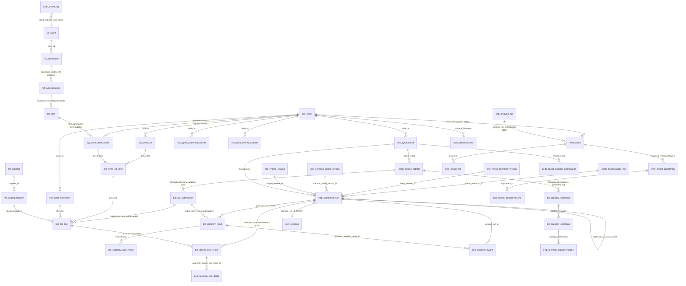

# SLICE B7 — DATA MODEL (Layer-1, exhaustive) — Part 1 of 2: THE BASELINE SCHEMA

> **Scope of this file:** `/home/user/KR_RFP/db/baseline/schema.sql` (1732 lines), `NAMING_MAP.md`, `README.md`.
> The 20 Alembic migrations + `env.py` are documented in the sibling file **`B7_migrations.md`** (this slice was split — see the reply note).
> Produced to AUDIT_STANDARD **Layer-1 "Data model — exhaustive"**: EVERY table, EVERY column (name, exact type, precision/scale, nullable, default), EVERY CHECK / UNIQUE / FK / index, with the **WHY** of the table and of each constraint. The 46 composite-identity FKs are enumerated in §B7-S.13. Type drift is flagged in §B7-S.14.
> **Read-only audit. Nothing in this slice was modified.**

---

## B7-S.0 — Provenance, the three source files, and the canonicalization contract

### B7-S.0.1 `db/baseline/schema.sql` — what it is and why it exists this way

`schema.sql` (1732 lines, 91 362 bytes; census row 249) is **the Alembic baseline (revision `0001`)**. It is a **clean-room re-expression** of the as-built schema as clean PostgreSQL 15 DDL — **our own artifact (ADR-0001), NOT an import** of the existing engine codebase (`specs/original-engine/BUILD_03_schema.sql`). Migration `0001_baseline.py` reads this exact file and `op.execute`s it verbatim (see `B7_migrations.md` §M01). The file's WHY, stated in its own header (lines 1–51):

- **Re-express, do not copy.** The asset being preserved is the as-built's *rigor* — composite-identity FKs, the sealed calc-run spine, the landed-cost shapes — re-authored as **reviewed SQL** so the clean-room boundary is auditable (data we re-authored, not code we inherited). Without this, the M0 baseline would be an opaque import and the "clean room" claim would be unverifiable.
- **63 as-built tables** re-expressed (64 `CREATE TABLE` statements = 62 adopted/cleaned + the reconciled `audit.event_log` + the net-new `ref.client` tenant root), organized into **eight logical-layer schemas** (`ref norm cyc bid eng awd perf audit`), schema-qualified per `NAMING_MAP.md`.
- **Three invariants the file must always hold** (header lines 19–22):
  1. **IDEMPOTENT** — re-running is a no-op. Every object uses `IF NOT EXISTS`; the two deferred cross-schema FKs are added inside a guarded `DO $$ ... $$` block that checks `pg_constraint` first. Breaks → `0001` could not re-run, the CI `up→down→up` roundtrip would fail.
  2. **SELF-CONTAINED** — no `\i` includes, no external functions; runs on a bare PG15. Breaks → the baseline could not be applied by a plain `op.execute(read_text())`.
  3. **CLEAN PG** — native `boolean` (no `DEFAULT 0/1`), no SQLite-isms, real predicates. The source was SQLite-flavoured auto-generated DDL; this is the de-SQLite-ification.

### B7-S.0.2 The SQLite-isms cleaned (audit `[D-6]`)

The re-expression removed the following defects (README lines 47–56, header lines 14–17):

| As-built defect | Cleaned to | Where it shows in this file |
|---|---|---|
| `BOOLEAN DEFAULT 0/1` | native `boolean DEFAULT false/true` | `bid.bid_line.is_scoreable/is_awardable/leverage_signal_flag/best_in_class_signal_flag/follow_up_recommended_flag` (lines 751–757) |
| comparison `is_eligible = 0`, `is_cost_awardable = 1`, `constraint_satisfied = 1/0`, `active_flag = 1/0` | real boolean predicates `= true` / `= false` | every alias-deactivation CHECK; `bid.landed_cost_result` awardable-shape CHECKs; `eng.scenario_capacity_usage` satisfied CHECK |
| **no-op CHECK branch** `OR length(error_log) >= 0` | **DELETED** — leaving the real rule | `eng.calculation_run.ck_calcrun_failed_has_errorlog` (lines 626–630) — the **"de-no-op'd"** constraint the audit calls out by name |
| money as varying types | kept uniformly as `numeric(18,6)` | all monetary columns |
| `VARCHAR(36)` UUID PKs | reviewed; **adopted tables keep text-UUID**, net-new spine uses native `uuid` | the PK convention, below |

### B7-S.0.3 The PK convention (Phase-0 decision; README lines 66–68; header lines 29–32)

- **Net-new spine tables** (`ref.client`, `ref.commodity`, `audit.event_log`) use native **`uuid` PKs** with `DEFAULT gen_random_uuid()`.
- **The ~60 adopted as-built tables** retain their **text-UUID (`varchar(36)`) PKs verbatim** so the 46 composite-identity FKs re-express **byte-for-byte**. Changing the key type would break the rigor mapping — this is the load-bearing reason the whole adopted spine is `varchar(36)` and not `uuid`.

### B7-S.0.4 The 4 dropped single-column commodity FKs (header lines 34–43; README lines 71–78)

The canonical `ref.commodity` is **uuid-keyed and tenant-scoped** (mirrors the ORM `Commodity`). The as-built `commodity_master_db` had a **text `commodity_id` PK** and a global `UNIQUE(commodity_code)`. Consequence: the **4 single-column as-built FKs** that pointed at `commodity_master_db(commodity_id)` — from `item`, `subcommodity`, `cycle`, `item_alias` — are **DROPPED** (the canonical commodity has no text `commodity_id` to reference). **But** those four tables KEEP their own `commodity_id varchar(36)` columns and **all composite-identity pairs/FKs among themselves** (item ↔ subcommodity ↔ cycle), so the enterprise rigor survives intact. This is the single biggest deviation from a literal copy, and it is deliberate (live ORM wins, ADR-0001).

### B7-S.0.5 Tenancy is M10, not M0 (header lines 24–27; README lines 85–86)

ADR-0004's broad `client_id` weave across all 63 tables is a **LATER migration (M10 / E-03)**. M0 keeps `client_id` ONLY where it already exists: `ref.client` (the tenant root) and `ref.commodity` (the tenant-scoping demonstrator the ORM is wired to). The other ~60 tables are **NOT yet tenant-scoped** in this file.

### B7-S.0.6 `NAMING_MAP.md` — the crosswalk rule (census row 247)

The canonical decision: **schema-qualified, brief-style names are canonical** (`cyc.cycle`, `eng.scenario_award`, `perf.itrade_receipt`). The eight logical layers become real PostgreSQL schemas so grants, `search_path`, RLS, and the "open last cycle" joins read better. The five rules:

1. **Schema placement** — each as-built table maps to its layer → that becomes its schema.
2. **Strip prefix/suffix noise** — `rfp_cycle` → `cyc.cycle`; `*_master`/`*_master_db` → drop suffix (`dc_master_db` → `ref.dc`).
3. **Flatten the `_a_` lens** — `scenario_a_*` → `eng.scenario*`, the single-scenario `_a_` lens replaced by a `scenario_code` column (carried by the G2 break).
4. **Tables + schema canonicalize; columns do NOT** — adopted tables KEEP their as-built column names (renaming is needless churn and breaks the KEEP rigor mapping). Only **table name** and **schema** change.
5. **PK convention** — new tables standardize on `id`; adopted tables retain their `*_id` text-UUID PKs.

> `NAMING_MAP.md` is the **key-mappings seed**; the complete physical→canonical table for all 63 as-built tables is promised as `db/baseline/CROSSWALK.md`. **GAP (G-B7-2):** `CROSSWALK.md` does not exist on disk (verified: no `db/baseline/CROSSWALK.md`) — `NAMING_MAP.md` is the only crosswalk present. See §B7-S.15.

### B7-S.0.7 The eight schemas (schema.sql lines 53–64)

All eight are created idempotently at the top of the file (and by `infra/postgres/init/01_schemas.sql`):

| Schema | Comment in file | What it owns |
|---|---|---|
| `ref` | reference / master data + tenant | dimensions, aliases, quarantine, tenant root, fiscal calendar |
| `norm` | normalization: lineage, runs, source artifacts | source-artifact sha256 lineage, normalization runs, attribute taxonomy (migration 0004) |
| `cyc` | RFP cycle keystone + scope + rounds | the cycle keystone + all kickoff satellites |
| `bid` | bid submissions, landed cost, eligibility, capacity, volume | intake → landed cost → eligibility → volume scope |
| `eng` | sealed calc runs, scenarios, version pins | the governed solver spine + the lightweight decision-support spine |
| `awd` | awards, layers, signoff, generated documents (greenfield; M8) | created by migration 0010, NOT in this file |
| `perf` | historical award cost, commercial pricing layer | historical awards + the 10-table commercial pricing layer + iTrade (migration 0006) |
| `audit` | hash-chained event log + decision notes + round lifecycle | the immutable event log + round lifecycle |

---

## B7-S.1 — `ref` schema (reference / dimensions + tenant root)

The `ref` schema holds master data. Two tables are **net-new uuid-keyed** (`client`, `commodity`); the rest are **adopted text-UUID** tables that retain their composite-identity discipline.

### B7-S.1.1 `ref.client` — the tenant root (NET-NEW; lines 74–84)

**Purpose / WHY:** The tenant root of the whole system. `client_id` FK columns hang off this; the broad tenant weave + RLS policy is deferred to M10 (E-03, Security). It exists now so the audit hash-chain (which keys on `client_id`) and `ref.commodity` have a tenant to point at. Without it, the audit chain has no per-tenant head and multi-tenant isolation is impossible.

| Column | Type | Null | Default | Notes |
|---|---|---|---|---|
| `id` | `uuid` | NO | `gen_random_uuid()` | **PK** (net-new uuid convention) |
| `client_code` | `varchar(40)` | NO | — | external tenant code |
| `client_name` | `varchar(160)` | NO | — | display name |
| `is_active` | `boolean` | NO | `true` | soft-disable |
| `created_at` | `timestamptz` | NO | `now()` | |

**Constraints + WHY:**
- `uq_client_code UNIQUE (client_code)` — one tenant per external code; the lookup key.
- `ck_client_code_not_empty CHECK (length(client_code) > 0)` — a tenant must have a real code (one of the two **net-new** CHECKs the README counts as 69−67).

### B7-S.1.2 `ref.commodity` — ADOPT of `commodity_master_db`, tenant-scoped (lines 90–103)

**Purpose / WHY:** The canonical commodity dimension, schema-qualified + **tenant-scoped** (`client_id`). KEEP EXACTLY as the ORM `Commodity` maps it. This is the **tenant-scoping demonstrator** — the one ~adopted table given `client_id` at M0 to prove the pattern. The as-built global `UNIQUE(commodity_code)`/`(commodity_name)` become a **per-tenant** unique.

| Column | Type | Null | Default | Notes |
|---|---|---|---|---|
| `id` | `uuid` | NO | `gen_random_uuid()` | **PK** (net-new uuid) |
| `client_id` | `uuid` | YES | — | `REFERENCES ref.client(id)` (single-col FK) |
| `commodity_code` | `varchar(40)` | NO | — | |
| `commodity_name` | `varchar(120)` | NO | — | |
| `abbreviation` | `varchar(20)` | YES | — | |
| `active_flag` | `boolean` | NO | `true` | |
| `created_at` | `timestamptz` | NO | `now()` | |

**Constraints + WHY:**
- `uq_commodity_code_per_client UNIQUE (client_id, commodity_code)` — per-tenant uniqueness (replaces the as-built global unique). **Load-bearing for migration 0018's backfill**: NULL `client_id` rows are treated distinct, so two orphan commodities can share a code (see `B7_migrations.md` §M18).
- `ck_commodity_code_not_empty CHECK (length(commodity_code) > 0)` — the second net-new CHECK.
- `ix_commodity_client INDEX (client_id)` — tenant-scoped scans / the future RLS join.

### B7-S.1.3 `ref.subcommodity` — ADOPT of `subcommodity_master` (lines 108–117)

**Purpose / WHY:** Subcommodity dimension. Keeps its **text `commodity_id`** column + the `(subcommodity_id, commodity_id)` composite-identity pair that `item`/`cycle` reference. The single-col FK to `commodity_master_db` is dropped (per §B7-S.0.4).

| Column | Type | Null | Default |
|---|---|---|---|
| `subcommodity_id` | `varchar(36)` | NO | — (**PK**) |
| `commodity_id` | `varchar(36)` | NO | — |
| `subcommodity_code` | `varchar(40)` | NO | — |
| `subcommodity_name` | `varchar(120)` | NO | — |
| `active_flag` | `boolean` | NO | — |

**Constraints + WHY:**
- `PRIMARY KEY (subcommodity_id)`.
- `uq_subcom_code_per_commodity UNIQUE (commodity_id, subcommodity_code)` — code unique within a commodity.
- `uq_subcom_commodity_pair UNIQUE (subcommodity_id, commodity_id)` — **the composite-identity pair**; this is the target of `item`'s and `cycle`'s `(subcommodity_id, commodity_id)` FKs. Without it those FKs cannot exist (a multi-col FK needs a unique on the referenced columns). **This is the keystone of the "subcommodity belongs to commodity" rigor.**

### B7-S.1.4 `ref.dc` — ADOPT of `dc_master_db` (lines 120–130)

**Purpose / WHY:** Distribution-center dimension (drop `_master_db`). The grain anchor for almost every fact table (`dc_id` appears across bid/eng/perf).

| Column | Type | Null |
|---|---|---|
| `dc_id` | `varchar(36)` | NO (**PK**) |
| `dc_code` | `varchar(10)` | NO |
| `dc_name` | `varchar(120)` | NO |
| `region` | `varchar(40)` | YES |
| `division` | `varchar(40)` | YES |
| `active_flag` | `boolean` | NO |

**Constraints:** `PRIMARY KEY (dc_id)`; `UNIQUE (dc_code)`; `UNIQUE (dc_name)` — both human identifiers are unique so alias resolution and display are unambiguous.

### B7-S.1.5 `ref.supplier` — ADOPT of `supplier_master` (lines 133–141)

**Purpose / WHY:** Supplier dimension. `aliases` is a free-text column; the typed alias spine lives in `ref.supplier_alias`.

| Column | Type | Null |
|---|---|---|
| `supplier_id` | `varchar(36)` | NO (**PK**) |
| `canonical_name` | `varchar(200)` | NO |
| `aliases` | `text` | YES |
| `active_flag` | `boolean` | NO |
| `created_at` | `timestamp` | NO |

**Constraints:** `PRIMARY KEY (supplier_id)`; `UNIQUE (canonical_name)` — the canonical name is the dedupe key.

### B7-S.1.6 `ref.item` — ADOPT of `item_master` (lines 145–162)

**Purpose / WHY:** Item (SKU) dimension. Keeps the composite `(item_id, commodity_id)` / `(item_id, subcommodity_id)` pairs + the `(subcommodity_id, commodity_id)` FK to `ref.subcommodity`. These pairs are what `cyc.cycle_item_scope` FKs into, so an item in a cycle is provably the same item under the same commodity.

| Column | Type | Null |
|---|---|---|
| `item_id` | `varchar(36)` | NO (**PK**) |
| `upc` | `varchar(40)` | YES |
| `item_code` | `varchar(60)` | NO |
| `description` | `varchar(300)` | NO |
| `pack_desc` | `varchar(60)` | YES |
| `commodity_id` | `varchar(36)` | NO |
| `subcommodity_id` | `varchar(36)` | YES |
| `active_start` | `date` | YES |
| `active_end` | `date` | YES |

**Constraints + WHY:**
- `PRIMARY KEY (item_id)`.
- `fk_item_subcom_in_commodity FOREIGN KEY (subcommodity_id, commodity_id) → ref.subcommodity(subcommodity_id, commodity_id)` — **composite FK #1**: an item's subcommodity must belong to the item's commodity. The rigor that stops a cross-commodity item/subcommodity mismatch.
- `uq_item_commodity_pair UNIQUE (item_id, commodity_id)` — composite-identity pair (FK target for scope/lot tables).
- `uq_item_subcom_pair UNIQUE (item_id, subcommodity_id)` — composite-identity pair.
- `UNIQUE (upc)`; `UNIQUE (item_code)` — both external identifiers unique for alias resolution.

### B7-S.1.7 `ref.loading_location` — ADOPT of `loading_location` (lines 165–186)

**Purpose / WHY:** Supplier loading/origin locations. The `(location_id, supplier_id)` composite pair is what `bid.bid_line` and `bid.landed_cost_result` FK into so a quoted loading location provably belongs to the quoting supplier.

| Column | Type | Null |
|---|---|---|
| `location_id` | `varchar(36)` | NO (**PK**) |
| `supplier_id` | `varchar(36)` | NO |
| `location_name` | `varchar(160)` | NO |
| `address_line` | `varchar(300)` | YES |
| `city` | `varchar(80)` | NO |
| `country_code` | `varchar(2)` | NO |
| `region_code` | `varchar(10)` | YES |
| `postal_code` | `varchar(20)` | YES |
| `active_start` | `date` | YES |
| `active_end` | `date` | YES |
| `evidence_reference` | `text` | YES |
| `active_flag` | `boolean` | NO |

**Constraints + WHY:**
- `PRIMARY KEY (location_id)`.
- `uq_loc_supplier_pair UNIQUE (location_id, supplier_id)` — composite-identity pair (FK target).
- `ck_loc_country_code_two_char CHECK (length(country_code) = 2)` — ISO-2 country guard.
- `ck_loc_active_dates_ordered CHECK (active_end IS NULL OR active_start IS NULL OR active_end >= active_start)` — no inverted validity window.
- `FOREIGN KEY (supplier_id) → ref.supplier` — location belongs to a real supplier.
- `uq_loc_supplier_name_geo` (UNIQUE INDEX) `ON (supplier_id, location_name, country_code, COALESCE(region_code, ''), city)` — **a COALESCE-expression partial-style unique**: dedupes locations by supplier+name+geo, treating a NULL region as `''` so two NULL-region rows collide. Prevents duplicate location records under the same supplier.

### B7-S.1.8 `ref.fiscal_calendar` — ADOPT of `fiscal_date_conversion` → CLEAN-renamed (lines 189–208)

**Purpose / WHY:** Calendar-date → fiscal-coordinate lookup (one row per calendar date). Distinct from the **net-new `ref.fiscal_period`** (created in migration 0014, a *period* dimension, not a *date* dimension) — note these are two different tables. Seeding is deferred ("seed at M-later").

| Column | Type | Null |
|---|---|---|
| `calendar_date` | `date` | NO (**PK**) |
| `fiscal_year` | `integer` | NO |
| `fiscal_quarter_number` | `integer` | NO |
| `fiscal_quarter_label` | `varchar(20)` | YES |
| `fiscal_period_number` | `integer` | NO |
| `fiscal_period_label` | `varchar(20)` | YES |
| `fiscal_period_week_number` | `integer` | NO |
| `fiscal_week_number` | `integer` | NO |
| `fiscal_week_label` | `varchar(20)` | YES |
| `source_calendar_id` | `varchar(36)` | YES |
| `source_file` | `text` | YES |
| `loaded_at` | `timestamp` | YES |
| `loaded_by` | `varchar(120)` | YES |

**Constraints + WHY (the 4-3-3-3 calendar guards):**
- `ck_fiscal_date_quarter_range CHECK (fiscal_quarter_number BETWEEN 1 AND 4)` — 4 quarters.
- `ck_fiscal_date_period_range CHECK (fiscal_period_number BETWEEN 1 AND 13)` — 13 periods (the Kroger 4-3-3-3 calendar).
- `ck_fiscal_date_period_week_range CHECK (fiscal_period_week_number BETWEEN 1 AND 5)` — a period has up to 5 weeks (P13 of a 53-week year).
- `ck_fiscal_date_week_range CHECK (fiscal_week_number BETWEEN 1 AND 53)` — 52/53-week years.

### B7-S.1.9 `ref.supplier_alias` — ADOPT (KEEP #6) (lines 212–235)

**Purpose / WHY:** Typed supplier-name aliases with **partial-unique-active** semantics and full deactivation lineage. The "never guess" resolution layer: raw supplier text resolves through aliases, never by fuzzy guess.

| Column | Type | Null |
|---|---|---|
| `supplier_alias_id` | `varchar(36)` | NO (**PK**) |
| `alias_text` | `text` | NO |
| `normalized_alias_text` | `text` | NO |
| `supplier_id` | `varchar(36)` | NO |
| `alias_type` | `text` | NO |
| `source` | `text` | NO |
| `created_by` | `varchar(120)` | NO |
| `created_at` | `timestamp` | NO |
| `active_flag` | `boolean` | NO |
| `notes` | `text` | YES |
| `active_from` | `timestamp` | YES |
| `active_until` | `timestamp` | YES |
| `deactivated_by` | `varchar(120)` | YES |
| `deactivated_at` | `timestamp` | YES |
| `deactivation_reason` | `text` | YES |

**Constraints + WHY:**
- `ck_supplier_alias_deactivation_consistency` — a **biconditional**: `active=true` ⇒ all three deactivation columns NULL; `active=false` ⇒ all three NOT NULL. Forces a full who/when/why on every deactivation; an active alias cannot carry stale deactivation metadata. (SQLite-ism `= 1/0` cleaned to `= true/false`.)
- `FOREIGN KEY (supplier_id) → ref.supplier`.
- `uq_supplier_alias_norm_typed_active` (UNIQUE INDEX) `ON (alias_type, normalized_alias_text) WHERE active_flag = true` — **partial unique**: at most one *active* alias per (type, normalized text); deactivated rows accumulate freely as history. This is the mechanism that lets an alias be retired and a new one created without a unique collision.

### B7-S.1.10 `ref.item_alias` — ADOPT (KEEP #6) (lines 238–269)

**Purpose / WHY:** Item aliases, **commodity/subcommodity-scoped**. Same deactivation-lineage pattern as supplier_alias.

| Column | Type | Null |
|---|---|---|
| `item_alias_id` | `varchar(36)` | NO (**PK**) |
| `alias_text` | `text` | NO |
| `normalized_alias_text` | `text` | NO |
| `item_id` | `varchar(36)` | NO |
| `alias_type` | `text` | NO |
| `source` | `text` | NO |
| `created_by` | `varchar(120)` | NO |
| `created_at` | `timestamp` | NO |
| `active_flag` | `boolean` | NO |
| `notes` | `text` | YES |
| `commodity_id` | `varchar(36)` | YES |
| `subcommodity_id` | `varchar(36)` | YES |
| `active_from` | `timestamp` | YES |
| `active_until` | `timestamp` | YES |
| `deactivated_by` | `varchar(120)` | YES |
| `deactivated_at` | `timestamp` | YES |
| `deactivation_reason` | `text` | YES |

**Constraints + WHY:**
- `ck_item_alias_deactivation_consistency` — same biconditional as supplier_alias.
- `FOREIGN KEY (item_id) → ref.item`; `FOREIGN KEY (subcommodity_id) → ref.subcommodity`.
- `uq_item_alias_norm_typed_active` (UNIQUE INDEX) `ON (alias_type, normalized_alias_text, COALESCE(commodity_id, '__GLOBAL__'), COALESCE(subcommodity_id, '__ANY__')) WHERE active_flag = true` — **partial unique with COALESCE sentinels**: one active alias per (type, normalized text) within a commodity/subcommodity scope; a NULL commodity means "global", a NULL subcommodity means "any". The text columns COALESCE cleanly (varchar, not uuid), preserving the as-built semantics. This is why `commodity_id`/`subcommodity_id` are text here and not the uuid `ref.commodity.id`.

### B7-S.1.11 `ref.dc_alias` — ADOPT (KEEP #6) (lines 272–294)

**Purpose / WHY:** DC text resolution.

| Column | Type | Null |
|---|---|---|
| `dc_alias_id` | `varchar(36)` | NO (**PK**) |
| `alias_text` | `text` | NO |
| `normalized_alias_text` | `text` | NO |
| `dc_id` | `varchar(36)` | NO |
| `source` | `text` | NO |
| `created_by` | `varchar(120)` | NO |
| `created_at` | `timestamp` | NO |
| `active_flag` | `boolean` | NO |
| `notes` | `text` | YES |
| `active_from` | `timestamp` | YES |
| `active_until` | `timestamp` | YES |
| `deactivated_by` | `varchar(120)` | YES |
| `deactivated_at` | `timestamp` | YES |
| `deactivation_reason` | `text` | YES |

**Constraints + WHY:**
- `ck_dc_alias_deactivation_consistency` — same biconditional.
- `FOREIGN KEY (dc_id) → ref.dc`.
- `uq_dc_alias_normalized_active` (UNIQUE INDEX) `ON (normalized_alias_text) WHERE active_flag = true` — one active alias per normalized text (DC aliases are untyped, so no `alias_type` in the key).

### B7-S.1.12 `ref.master_data_quarantine` — ADOPT (KEEP #6) (lines 297–320)

**Purpose / WHY:** The **"never guess" queue**. Any raw value that does not resolve to a master record (supplier/item/dc) lands here for analyst resolution rather than being silently fudged — this is the DB embodiment of CLAUDE.md ABSOLUTE REQUIREMENT #3 ("bad/ambiguous data is surfaced as quarantine, never silently fudged").

| Column | Type | Null |
|---|---|---|
| `quarantine_id` | `varchar(36)` | NO (**PK**) |
| `source_artifact` | `text` | NO |
| `source_sheet` | `text` | NO |
| `source_row` | `integer` | NO |
| `raw_value` | `text` | NO |
| `normalized_value` | `text` | NO |
| `domain` | `text` | NO |
| `rejection_reason` | `text` | NO |
| `candidate_matches_json` | `text` | YES |
| `ingestion_run_id` | `varchar(80)` | NO |
| `cycle_id` | `varchar(36)` | YES |
| `resolved_action` | `text` | YES |
| `analyst_resolution` | `text` | NO |
| `resolved_alias_id` | `varchar(36)` | YES |
| `resolved_to_target_id` | `varchar(36)` | YES |
| `resolved_by` | `varchar(120)` | YES |
| `resolved_at` | `timestamp` | YES |
| `notes` | `text` | YES |

**Constraints + WHY:**
- `uq_quarantine_source_row_domain UNIQUE (source_artifact, source_sheet, source_row, domain)` — one quarantine record per (artifact, sheet, row, domain); re-ingesting the same bad row does not duplicate the queue entry.
- `fk_quarantine_cycle FOREIGN KEY (cycle_id) → cyc.cycle` — **DEFERRED** to the guarded `DO` block at file end (lines 1703–1716), because `cyc.cycle` is defined *after* this table and `ref↔cyc↔norm` form a cross-schema reference cycle (§B7-S.12).

---

## B7-S.2 — `cyc` schema (cycle / setup — the keystone)

### B7-S.2.1 `cyc.cycle` — CLEAN of `rfp_cycle` (lines 331–352)

**Purpose / WHY:** The **keystone** of the entire model — the RFP cycle that nearly every other table FKs into. CLEAN-renamed from `rfp_cycle`. Keeps `why_now`/`target_savings_amt`/`round_count` + the `(cycle_id, commodity_id)` composite pair + the `(subcommodity_id, commodity_id)` FK. The brief's `pricing_basis`/`objective`/`horizon` are deferred to M9 (added by migration 0002's kickoff satellites). **Heavily extended by migrations 0002, 0012, 0013** (see `B7_migrations.md`).

| Column | Type | Null |
|---|---|---|
| `cycle_id` | `varchar(36)` | NO (**PK**) |
| `cycle_code` | `varchar(40)` | NO |
| `cycle_name` | `varchar(120)` | NO |
| `commodity_id` | `varchar(36)` | NO |
| `subcommodity_id` | `varchar(36)` | YES |
| `status` | `text` | NO |
| `why_now` | `text` | NO |
| `target_effective_date` | `date` | NO |
| `target_savings_amt` | `numeric(18,2)` | YES |
| `round_count` | `integer` | NO |
| `owner_actor_id` | `varchar(120)` | YES |
| `created_at` | `timestamp` | NO |
| `created_by` | `varchar(120)` | NO |

**Constraints + WHY:**
- `PRIMARY KEY (cycle_id)`.
- `ck_cycle_round_count_range CHECK (round_count BETWEEN 2 AND 6)` — **a cycle has 2–6 rounds** (the as-built rule; an RFP is inherently multi-round, never one-shot — this is the DB guard behind CLAUDE.md req #3's "never collapse a multi-round RFP to a single round").
- `fk_cycle_subcom_in_commodity FOREIGN KEY (subcommodity_id, commodity_id) → ref.subcommodity` — **composite FK**: a cycle's subcommodity belongs to its commodity.
- `uq_cycle_commodity_pair UNIQUE (cycle_id, commodity_id)` — composite-identity pair (FK target for `cycle_item_scope`).
- `uq_cycle_subcom_pair UNIQUE (cycle_id, subcommodity_id)` — composite-identity pair.
- `UNIQUE (cycle_code)` — human cycle code unique.

### B7-S.2.2 `cyc.cycle_timeframe` — ADOPT of `cycle_tf` (lines 355–370)

**Purpose / WHY:** Timeframes within a cycle (the demand/pricing grain). The `(tf_id, cycle_id)` composite pair is the FK target for every fact carrying `tf_id` — so a bid line's timeframe provably belongs to the bid's cycle.

| Column | Type | Null |
|---|---|---|
| `tf_id` | `varchar(36)` | NO (**PK**) |
| `cycle_id` | `varchar(36)` | NO |
| `tf_code` | `varchar(20)` | NO |
| `tf_name` | `varchar(120)` | NO |
| `start_date` | `date` | NO |
| `end_date` | `date` | NO |
| `week_count` | `integer` | NO |
| `rationale` | `text` | YES |

**Constraints + WHY:**
- `uq_tf_code_per_cycle UNIQUE (cycle_id, tf_code)` — code unique within cycle.
- `uq_tf_cycle_pair UNIQUE (tf_id, cycle_id)` — **the composite-identity pair** (heavily-referenced FK target).
- `ck_tf_week_count_positive CHECK (week_count > 0)`; `ck_tf_date_range_positive CHECK (end_date > start_date)` — a timeframe has positive duration.
- `FOREIGN KEY (cycle_id) → cyc.cycle`.

### B7-S.2.3 `cyc.cycle_round` — ADOPT of `cycle_round` (lines 373–388)

**Purpose / WHY:** The rounds of a cycle (forward-only `round_status`). The `(round_id, cycle_id)` pair is FK'd by every round-scoped fact (artifacts, submissions, calc runs, eligibility, participation, feedback). `status` (varchar) and `round_status` (text) coexist — the as-built carried both.

| Column | Type | Null |
|---|---|---|
| `round_id` | `varchar(36)` | NO (**PK**) |
| `cycle_id` | `varchar(36)` | NO |
| `round_number` | `integer` | NO |
| `status` | `varchar(40)` | NO |
| `round_status` | `text` | YES |
| `is_final` | `boolean` | NO |
| `invite_due_at` | `timestamp` | YES |
| `bid_due_at` | `timestamp` | YES |
| `meeting_due_at` | `timestamp` | YES |

**Constraints + WHY:**
- `uq_round_number_per_cycle UNIQUE (cycle_id, round_number)` — one row per round number per cycle.
- `uq_round_cycle_pair UNIQUE (round_id, cycle_id)` — **the composite-identity pair** (the most-referenced FK target in the model — see §B7-S.13).
- `ck_round_number_positive CHECK (round_number > 0)`.
- `FOREIGN KEY (cycle_id) → cyc.cycle`.

### B7-S.2.4 `cyc.cycle_item_scope` — ADOPT (lines 392–412)

**Purpose / WHY:** In/out scope per item per cycle with rationale. Its `(cycle_id, item_id)` PK is the FK target for `cycle_lot_item` and `cycle_projected_volume`, so a lot/volume row can only reference an item that is in-scope for the cycle. The four composite FKs make the scope provably consistent with both the cycle's and the item's commodity/subcommodity.

| Column | Type | Null |
|---|---|---|
| `cycle_id` | `varchar(36)` | NO (**PK part**) |
| `item_id` | `varchar(36)` | NO (**PK part**) |
| `commodity_id` | `varchar(36)` | NO |
| `subcommodity_id` | `varchar(36)` | YES |
| `inclusion_status` | `text` | NO |
| `rationale` | `text` | YES |
| `added_at` | `timestamp` | NO |
| `added_by` | `varchar(120)` | NO |

**Constraints + WHY:**
- `PRIMARY KEY (cycle_id, item_id)` — one scope decision per item per cycle.
- `fk_scope_cycle_commodity (cycle_id, commodity_id) → cyc.cycle` — scope commodity matches cycle commodity.
- `fk_scope_cycle_subcom (cycle_id, subcommodity_id) → cyc.cycle` — scope subcommodity matches cycle.
- `fk_scope_item_commodity (item_id, commodity_id) → ref.item` — scope commodity matches item.
- `fk_scope_item_subcom (item_id, subcommodity_id) → ref.item` — scope subcommodity matches item.
- plus single-col `FOREIGN KEY (cycle_id) → cyc.cycle` and `(item_id) → ref.item`.
- **These four composite FKs are the "an in-scope item is consistently classified" guarantee** — the single strongest example of composite-identity rigor in the schema.

### B7-S.2.5 `cyc.cycle_lot` — CLEAN of `cycle_lot` (lines 415–426)

**Purpose / WHY:** Lots within a cycle. (Becomes scope over a persistent `norm.lot` at M2/G8.) The `(lot_id, cycle_id)` pair is FK'd by every lot-scoped fact.

| Column | Type | Null |
|---|---|---|
| `lot_id` | `varchar(36)` | NO (**PK**) |
| `cycle_id` | `varchar(36)` | NO |
| `lot_code` | `varchar(40)` | NO |
| `lot_name` | `varchar(120)` | NO |
| `rationale` | `text` | YES |
| `active_flag` | `boolean` | NO |

**Constraints:** `uq_lot_code_per_cycle UNIQUE (cycle_id, lot_code)`; `uq_lot_cycle_pair UNIQUE (lot_id, cycle_id)` (composite pair); `FOREIGN KEY (cycle_id) → cyc.cycle`.

### B7-S.2.6 `cyc.cycle_lot_item` — CLEAN of `cycle_lot_item` (lines 429–443)

**Purpose / WHY:** Maps items to lots, **one lot per item per cycle**. The `(lot_id, item_id)` pair is the FK target for `bid.bid_line`'s `fk_bidline_item_in_lot`, so a bid line's item provably belongs to its lot.

| Column | Type | Null |
|---|---|---|
| `lot_item_id` | `varchar(36)` | NO (**PK**) |
| `cycle_id` | `varchar(36)` | NO |
| `lot_id` | `varchar(36)` | NO |
| `item_id` | `varchar(36)` | NO |
| `required_flag` | `boolean` | NO |
| `sort_order` | `integer` | NO |

**Constraints + WHY:**
- `uq_item_per_lot UNIQUE (lot_id, item_id)` — composite pair (FK target for bid_line).
- `uq_one_lot_per_item_per_cycle UNIQUE (cycle_id, item_id)` — **an item is in exactly one lot per cycle** (a hard structural rule of the RFP grain).
- `fk_lotitem_lot_in_cycle (lot_id, cycle_id) → cyc.cycle_lot` — the lot belongs to the cycle.
- `fk_lotitem_in_cycle_scope (cycle_id, item_id) → cyc.cycle_item_scope` — **the item must be in the cycle's scope** before it can be put in a lot.

### B7-S.2.7 `cyc.cycle_projected_volume` — ADOPT (lines 446–471)

**Purpose / WHY:** Projected demand at **DC × item × timeframe**. Two input methods (weekly×weeks or direct-period). The `normalization_run_id` links the volume to the normalization run that produced it (FK deferred to file end).

| Column | Type | Null |
|---|---|---|
| `volume_id` | `varchar(36)` | NO (**PK**) |
| `cycle_id` | `varchar(36)` | NO |
| `dc_id` | `varchar(36)` | NO |
| `item_id` | `varchar(36)` | NO |
| `tf_id` | `varchar(36)` | NO |
| `volume_input_method` | `text` | NO |
| `projected_weekly_cases` | `numeric(18,3)` | YES |
| `projected_period_cases` | `numeric(18,3)` | NO |
| `growth_override_pct` | `numeric(9,6)` | YES |
| `normalization_run_id` | `varchar(36)` | YES |

**Constraints + WHY:**
- `uq_volume_cell UNIQUE (cycle_id, dc_id, item_id, tf_id)` — one demand number per cell.
- `fk_volume_tf_in_cycle (tf_id, cycle_id) → cyc.cycle_timeframe` — timeframe belongs to cycle.
- `fk_volume_item_in_cycle_scope (cycle_id, item_id) → cyc.cycle_item_scope` — item is in scope.
- `ck_volume_method_consistency CHECK ((WEEKLY_X_WEEKS AND weekly NOT NULL) OR (DIRECT_PERIOD_CASES AND weekly NULL))` — **method/field consistency**: weekly cases are present iff the method is weekly. Stops a half-specified volume.
- `ck_volume_period_nonneg CHECK (projected_period_cases >= 0)` — no negative demand.
- `FOREIGN KEY (cycle_id) → cyc.cycle`; `(dc_id) → ref.dc`.
- `fk_volume_normalization_run (normalization_run_id) → norm.normalization_run` — **DEFERRED** to the guarded `DO` block (norm.* is created after cyc.*).

### B7-S.2.8 `cyc.cycle_invited_supplier` — ADOPT (KEEP) (lines 474–482)

**Purpose / WHY:** Which suppliers were invited to a cycle. **The submitted-vs-missing denominator** — the count of "who was asked" against which submissions are measured. Extended with `is_incumbent` by migration 0002.

| Column | Type | Null |
|---|---|---|
| `cycle_id` | `varchar(36)` | NO (**PK part**) |
| `supplier_id` | `varchar(36)` | NO (**PK part**) |
| `invited_at` | `timestamp` | NO |
| `invited_by` | `varchar(120)` | NO |

**Constraints:** `PRIMARY KEY (cycle_id, supplier_id)`; `FOREIGN KEY (cycle_id) → cyc.cycle`; `(supplier_id) → ref.supplier`.

---

## B7-S.3 — `norm` schema (normalization lineage)

### B7-S.3.1 `norm.source_artifact` — ADOPT (KEEP) (lines 490–516)

**Purpose / WHY:** sha256 lineage of every uploaded file + provenance identity quads. The single most-referenced provenance table — bid submissions and capacity statements FK into its identity tuples so a fact is provably traceable to the exact file (and its hash) it came from. Embodies the "DB is the single source of truth; uploads stream to ingest" contract (no file storage).

| Column | Type | Null |
|---|---|---|
| `artifact_id` | `varchar(36)` | NO (**PK**) |
| `artifact_type` | `text` | NO |
| `file_name` | `varchar(300)` | NO |
| `file_hash_sha256` | `varchar(64)` | NO |
| `received_at` | `timestamp` | NO |
| `location_reference` | `varchar(500)` | YES |
| `status` | `text` | NO |
| `cycle_id` | `varchar(36)` | YES |
| `round_id` | `varchar(36)` | YES |
| `supplier_id` | `varchar(36)` | YES |
| `created_by` | `varchar(120)` | NO |

**Constraints + WHY:**
- `fk_artifact_round_in_cycle (round_id, cycle_id) → cyc.cycle_round` — the artifact's round belongs to its cycle.
- `ck_artifact_bid_provenance CHECK (type<>'BID_SUBMISSION' OR (cycle/round/supplier all NOT NULL))` — a bid-submission artifact must carry full provenance (you cannot have an anonymous bid file).
- `ck_artifact_capacity_provenance CHECK (type<>'CAPACITY_EVIDENCE' OR (cycle/supplier NOT NULL))` — capacity evidence must name cycle+supplier.
- `uq_artifact_identity_quad UNIQUE (artifact_id, cycle_id, round_id, supplier_id)` — **composite-identity quad** (FK target for `bid_submission`).
- `uq_artifact_cycle_supplier UNIQUE (artifact_id, cycle_id, supplier_id)` — composite triple (FK target for `capacity_statement`).
- `uq_artifact_round UNIQUE (artifact_id, round_id)` — composite pair (FK target for `capacity_statement` round-match).
- `FOREIGN KEY (cycle_id) → cyc.cycle`; `(supplier_id) → ref.supplier`.

### B7-S.3.2 `norm.normalization_run` — ADOPT (KEEP) (lines 519–528)

**Purpose / WHY:** A normalized data load (which files fed it, approval state). FK target for `calculation_run.source_snapshot_id` and `cycle_projected_volume.normalization_run_id`.

| Column | Type | Null |
|---|---|---|
| `normalization_run_id` | `varchar(36)` | NO (**PK**) |
| `dataset_type` | `text` | NO |
| `cycle_id` | `varchar(36)` | YES |
| `status` | `text` | NO |
| `approved_at` | `timestamp` | YES |
| `approved_by` | `varchar(120)` | YES |

**Constraints:** `FOREIGN KEY (cycle_id) → cyc.cycle`.

### B7-S.3.3 `norm.normalization_run_source` — ADOPT (KEEP) (lines 531–539)

**Purpose / WHY:** Many-to-many link of a normalization run to its source artifacts, with a role.

| Column | Type | Null |
|---|---|---|
| `normalization_run_id` | `varchar(36)` | NO (**PK part**) |
| `source_artifact_id` | `varchar(36)` | NO (**PK part**) |
| `source_role` | `text` | NO |
| `added_at` | `timestamp` | NO |

**Constraints:** `PRIMARY KEY (normalization_run_id, source_artifact_id)`; FKs to `norm.normalization_run` and `norm.source_artifact(artifact_id)`.

---

## B7-S.4 — `eng` schema, part 1 (sealed calc-run spine + version pins)

> Authored before `bid.*` because `bid.landed_cost_result`/`eligibility_*` FK into it.

### B7-S.4.1 `eng.metric_definition_version` — ADOPT (KEEP) (lines 548–560)

**Purpose / WHY:** Formula version pin (a sealed run records *which* metric formula it used). Reproducibility: a recomputation must use the same pinned formula.

| Column | Type | Null |
|---|---|---|
| `metric_version_id` | `varchar(36)` | NO (**PK**) |
| `formula_family` | `varchar(80)` | NO |
| `version_code` | `varchar(40)` | NO |
| `status` | `text` | NO |
| `expression_text` | `text` | NO |
| `effective_from` | `timestamp` | NO |
| `approved_by` | `varchar(120)` | YES |
| `tolerance_abs` | `numeric(18,6)` | YES |
| `tolerance_pct` | `numeric(9,6)` | YES |

**Constraints:** `uq_formula_family_version UNIQUE (formula_family, version_code)` — one row per (family, version).

### B7-S.4.2 `eng.scenario_config_version` — ADOPT (KEEP) (lines 563–573)

**Purpose / WHY:** Config version pin (`parameters_json` holds the solver config). Same reproducibility logic.

| Column | Type | Null |
|---|---|---|
| `scenario_config_version_id` | `varchar(36)` | NO (**PK**) |
| `config_label` | `varchar(120)` | NO |
| `version_code` | `varchar(40)` | NO |
| `status` | `text` | NO |
| `parameters_json` | `text` | NO |
| `effective_from` | `timestamp` | NO |
| `approved_by` | `varchar(120)` | YES |

**Constraints:** `uq_scenario_config_label_version UNIQUE (config_label, version_code)`.

### B7-S.4.3 `eng.engine_release` — ADOPT (KEEP) (lines 576–591)

**Purpose / WHY:** Engine version pin (git sha). A sealed run records the exact engine commit, so a result can be tied to the code that produced it.

| Column | Type | Null |
|---|---|---|
| `engine_release_id` | `varchar(36)` | NO (**PK**) |
| `release_label` | `varchar(60)` | NO |
| `git_commit_sha` | `varchar(64)` | NO |
| `status` | `text` | NO |
| `released_at` | `timestamp` | YES |
| `test_status` | `varchar(40)` | YES |
| `notes` | `text` | YES |

**Constraints + WHY:**
- `uq_engine_release_label UNIQUE (release_label)`; `uq_engine_release_sha UNIQUE (git_commit_sha)` — one row per label, one per sha.
- `ck_engine_released_requires_timestamp CHECK ((status IN ('RELEASED','DEPRECATED') AND released_at NOT NULL) OR status IN ('DRAFT','TESTED'))` — a released/deprecated engine has a release timestamp.
- `ck_engine_sha_min_length CHECK (length(git_commit_sha) >= 7)` — a real git sha, not a placeholder.

### B7-S.4.4 `eng.calculation_run` — ADOPT (KEEP #2) — the sealed run spine (lines 595–652)

**Purpose / WHY:** The **sealed run spine**: hashed input/output manifests, execution contract, version pins, identity triples. The heart of the governed-solver audit story — a run is reproducible because every input it consumed and output it produced is hashed and version-pinned. This is also where the **de-no-op'd CHECK** lives. `upstream_calc_run_id` is a **self-FK** (a Scenario-A benchmark points at the candidate run it benchmarks).

| Column | Type | Null |
|---|---|---|
| `calc_run_id` | `varchar(36)` | NO (**PK**) |
| `cycle_id` | `varchar(36)` | NO |
| `round_id` | `varchar(36)` | YES |
| `run_type` | `text` | NO |
| `status` | `text` | NO |
| `source_snapshot_id` | `varchar(36)` | YES |
| `metric_version_id` | `varchar(36)` | YES |
| `scenario_config_version_id` | `varchar(36)` | YES |
| `engine_release_id` | `varchar(36)` | YES |
| `run_started_at` | `timestamp` | NO |
| `run_finished_at` | `timestamp` | YES |
| `run_by` | `varchar(120)` | NO |
| `input_hash_manifest` | `text` | YES |
| `output_hash_manifest` | `text` | YES |
| `error_log` | `text` | YES |
| `execution_contract` | `text` | YES |
| `upstream_calc_run_id` | `varchar(36)` | YES |

**Constraints + WHY:**
- `fk_calcrun_round_in_cycle (round_id, cycle_id) → cyc.cycle_round` — round belongs to cycle.
- `uq_calcrun_identity_triple UNIQUE (calc_run_id, cycle_id, round_id)` — **composite triple** (FK target for landed_cost / eligibility / gate).
- `uq_calcrun_identity_metric_quad UNIQUE (calc_run_id, cycle_id, round_id, metric_version_id)` — **composite quad** (FK target for `landed_cost_result.fk_landed_cost_metric_matches_run` — so the landed cost uses the *same* metric version the run pinned).
- `ck_calcrun_success_completeness CHECK (SUCCEEDED/FINAL_APPROVED ⇒ finished_at AND snapshot AND metric AND config AND engine all NOT NULL)` — a successful/final run has all four version pins + a finish time + a source snapshot. The reproducibility floor.
- `ck_calcrun_failed_has_errorlog CHECK ((FAILED AND error_log NOT NULL) OR (<>FAILED AND error_log NULL))` — **THE DE-NO-OP'd CHECK** (header lines 626–630): the as-built had a no-op `OR length(error_log) >= 0` branch (audit `[D-6]`); cleaned to the real biconditional — FAILED ⇒ error log present, non-FAILED ⇒ error log absent.
- `ck_calcrun_final_has_output_manifest CHECK (status<>'FINAL_APPROVED' OR output_hash_manifest NOT NULL)` — a final-approved run has a sealed output manifest.
- `ck_calcrun_round_required_for_round_scoped_types CHECK (run_type NOT IN (ROUND_ANALYSIS,CAT_MAN_RERUN,FINAL_ALIGNED,SCENARIO_A_BENCHMARK) OR round_id NOT NULL)` — round-scoped run types must name a round.
- `ck_calcrun_scenario_a_requires_upstream CHECK ((contract='GOVERNED_SCENARIO_A' AND upstream NOT NULL) OR ((contract NULL OR <>...) AND upstream NULL))` — a Scenario-A benchmark must point at an upstream run; a non-Scenario-A run must not.
- `ck_calcrun_contract_matches_run_type CHECK (contract NULL OR (CANDIDATE_ANALYSIS↔ROUND_ANALYSIS) OR (SCENARIO_A↔SCENARIO_A_BENCHMARK))` — execution contract and run type are consistent.
- `ck_calcrun_success_has_input_manifest CHECK (status NOT IN (SUCCEEDED,FINAL_APPROVED) OR input_hash_manifest NOT NULL)` — a successful run has a sealed input manifest.
- FKs: `(cycle_id)→cyc.cycle`, `(source_snapshot_id)→norm.normalization_run`, `(metric_version_id)→eng.metric_definition_version`, `(scenario_config_version_id)→eng.scenario_config_version`, `(engine_release_id)→eng.engine_release`, `(upstream_calc_run_id)→eng.calculation_run` (**self-FK**).

### B7-S.4.5 `eng.calculation_run_input` — ADOPT (KEEP) (lines 655–669)

**Purpose / WHY:** Frozen inputs, one-per-type, with a canonical hash. The granular input lineage behind the run's manifest.

| Column | Type | Null |
|---|---|---|
| `calc_run_input_id` | `varchar(36)` | NO (**PK**) |
| `calc_run_id` | `varchar(36)` | NO |
| `input_type` | `text` | NO |
| `source_entity_type` | `varchar(80)` | NO |
| `source_entity_reference` | `text` | NO |
| `canonical_hash` | `varchar(128)` | NO |
| `row_count` | `integer` | YES |
| `included_at` | `timestamp` | NO |

**Constraints + WHY:**
- `uq_calcrun_input_one_per_type UNIQUE (calc_run_id, input_type)` — one input per type per run.
- `ck_calcrun_input_row_count_nonneg CHECK (row_count IS NULL OR row_count >= 0)`.
- `ck_calcrun_input_hash_min_length CHECK (length(canonical_hash) >= 8)` — a real hash.
- `FOREIGN KEY (calc_run_id) → eng.calculation_run`.

### B7-S.4.6 `eng.round_analysis_snapshot` — ADOPT (KEEP) (lines 672–688)

**Purpose / WHY:** One canonical run per round — **anchors "open last cycle"**. The `is_canonical` flag marks the run a round resolves to.

| Column | Type | Null |
|---|---|---|
| `snapshot_id` | `varchar(36)` | NO (**PK**) |
| `cycle_id` | `varchar(36)` | NO |
| `round_id` | `varchar(36)` | NO |
| `calc_run_id` | `varchar(36)` | NO |
| `snapshot_label` | `varchar(160)` | NO |
| `is_canonical` | `boolean` | NO |
| `created_at` | `timestamp` | NO |
| `created_by` | `varchar(120)` | NO |

**Constraints + WHY:**
- `fk_ras_round_in_cycle (round_id, cycle_id) → cyc.cycle_round`.
- `uq_ras_one_link_per_run_per_round UNIQUE (cycle_id, round_id, calc_run_id)` — one snapshot link per (cycle, round, run).
- `ck_ras_label_not_empty CHECK (length(snapshot_label) > 0)`.
- FKs `(cycle_id)→cyc.cycle`, `(calc_run_id)→eng.calculation_run`.

---

## B7-S.5 — `bid` schema (intake, eligibility, capacity, landed cost, volume)

### B7-S.5.1 `bid.bid_submission` — ADOPT (lines 696–716)

**Purpose / WHY:** Submission header; **identity quad** + artifact provenance. The parent of `bid_line`; its `(submission_id, cycle_id, round_id, supplier_id)` quad is the FK target chained down to bid lines, eligibility, capacity, gate results.

| Column | Type | Null |
|---|---|---|
| `submission_id` | `varchar(36)` | NO (**PK**) |
| `cycle_id` | `varchar(36)` | NO |
| `round_id` | `varchar(36)` | NO |
| `supplier_id` | `varchar(36)` | NO |
| `source_artifact_id` | `varchar(36)` | NO |
| `submitted_at` | `timestamp` | NO |
| `version_number` | `integer` | NO |
| `overall_status` | `text` | NO |
| `standard_terms_accepted` | `boolean` | NO |
| `terms_exceptions_text` | `text` | YES |

**Constraints + WHY:**
- `uq_submission_identity_quad UNIQUE (submission_id, cycle_id, round_id, supplier_id)` — **the identity quad** (FK target for bid_line, eligibility, gate, capacity).
- `fk_submission_round_in_cycle (round_id, cycle_id) → cyc.cycle_round`.
- `fk_submission_artifact_provenance (source_artifact_id, cycle_id, round_id, supplier_id) → norm.source_artifact(artifact_id, cycle_id, round_id, supplier_id)` — **a 4-col composite FK**: the submission's artifact provenance must match the submission's own cycle/round/supplier. The strongest provenance guarantee in the bid layer.
- `ck_submission_version_positive CHECK (version_number > 0)`.
- FKs `(cycle_id)→cyc.cycle`, `(supplier_id)→ref.supplier`.

### B7-S.5.2 `bid.bid_line` — CLEAN of `bid_line` (lines 721–776)

**Purpose / WHY:** The **priced line** + **identity octuple**; `is_scoreable`/`is_awardable` flags + leverage signals. The central price fact of the whole system. Its 8-column identity unique is the FK target for `landed_cost_result`. **Heavily extended by migrations 0007 (engine cost components), 0011 (transit_days), 0015 (fiscal_period_id), 0016 (period uniqueness flip)** — see `B7_migrations.md`. SQLite-ism `BOOLEAN DEFAULT 0` → `boolean DEFAULT false`.

| Column | Type | Null | Default |
|---|---|---|---|
| `bid_line_id` | `varchar(36)` | NO | — (**PK**) |
| `submission_id` | `varchar(36)` | NO | — |
| `cycle_id` | `varchar(36)` | NO | — |
| `round_id` | `varchar(36)` | NO | — |
| `supplier_id` | `varchar(36)` | NO | — |
| `dc_id` | `varchar(36)` | NO | — |
| `lot_id` | `varchar(36)` | NO | — |
| `item_id` | `varchar(36)` | NO | — |
| `tf_id` | `varchar(36)` | NO | — |
| `currency_code` | `varchar(3)` | NO | — |
| `price_basis` | `text` | NO | — |
| `submitted_all_in_case` | `numeric(18,6)` | YES | — |
| `fob_case` | `numeric(18,6)` | YES | — |
| `freight_case` | `numeric(18,6)` | YES | — |
| `fuel_case` | `numeric(18,6)` | YES | — |
| `accessorial_case` | `numeric(18,6)` | YES | — |
| `item_discount_case` | `numeric(18,6)` | YES | — |
| `shrink_case` | `numeric(18,6)` | YES | — |
| `commercial_conditions_text` | `text` | YES | — |
| `moq_cases` | `numeric(18,3)` | YES | — |
| `volume_minimum_cases` | `numeric(18,3)` | YES | — |
| `exclusivity_required_flag` | `boolean` | NO | — |
| `effective_date_start` | `date` | YES | — |
| `effective_date_end` | `date` | YES | — |
| `loading_location_id` | `varchar(36)` | YES | — |
| `validity_status` | `text` | NO | — |
| `source_row_number` | `integer` | YES | — |
| `created_at` | `timestamp` | NO | — |
| `bid_line_status` | `text` | YES | — |
| `is_scoreable` | `boolean` | NO | `false` |
| `is_awardable` | `boolean` | NO | `false` |
| `incomplete_reason_code` | `text` | YES | — |
| `leverage_signal_flag` | `boolean` | NO | `false` |
| `leverage_signal_reason` | `text` | YES | — |
| `best_in_class_signal_flag` | `boolean` | NO | `false` |
| `follow_up_recommended_flag` | `boolean` | NO | `false` |

**Constraints + WHY:**
- `uq_bid_line_cell_per_submission UNIQUE (submission_id, dc_id, lot_id, item_id, tf_id)` — one line per cell per submission. **DROPPED by migration 0016** and replaced by two filtered partial-unique indexes (the flat-13 fan-out grain) — see §B7-S.14 + `B7_migrations.md` §M16.
- `uq_bid_line_identity_full UNIQUE (bid_line_id, cycle_id, round_id, supplier_id, dc_id, lot_id, item_id, tf_id)` — **the 8-column identity octuple** (FK target for `landed_cost_result.fk_landed_cost_bidline_full_identity`). The most-columned unique in the schema.
- `fk_bidline_to_submission_identity (submission_id, cycle_id, round_id, supplier_id) → bid.bid_submission` — line's quad matches its submission.
- `fk_bidline_lot_in_cycle (lot_id, cycle_id) → cyc.cycle_lot`; `fk_bidline_tf_in_cycle (tf_id, cycle_id) → cyc.cycle_timeframe` — lot/tf belong to the cycle.
- `fk_bidline_item_in_lot (lot_id, item_id) → cyc.cycle_lot_item` — item belongs to the lot.
- `fk_bidline_loc_belongs_to_supplier (loading_location_id, supplier_id) → ref.loading_location` — quoted location belongs to the quoting supplier.
- `ck_bid_all_in_positive CHECK (submitted_all_in_case IS NULL OR > 0)`; `ck_bid_fob_positive CHECK (fob_case IS NULL OR > 0)` — no zero/negative price.
- `FOREIGN KEY (dc_id) → ref.dc`.
- `ix_bid_line_cell INDEX (cycle_id, round_id, dc_id, lot_id, item_id, tf_id)` — the cell-scan read path.

### B7-S.5.3 `bid.supplier_capability` — ADOPT (KEEP #4) (lines 779–803)

**Purpose / WHY:** The `CONFIRMED_CAPABLE` gate — a supplier's confirmed ability to serve a (dc, lot, tf) cell. Eligibility consumes this.

| Column | Type | Null |
|---|---|---|
| `capability_id` | `varchar(36)` | NO (**PK**) |
| `cycle_id` | `varchar(36)` | NO |
| `supplier_id` | `varchar(36)` | NO |
| `dc_id` | `varchar(36)` | NO |
| `lot_id` | `varchar(36)` | NO |
| `tf_id` | `varchar(36)` | NO |
| `status` | `text` | NO |
| `evidence_reference` | `text` | YES |
| `confirmed_by_actor_id` | `varchar(120)` | YES |
| `confirmed_at` | `timestamp` | YES |
| `notes` | `text` | YES |

**Constraints + WHY:**
- `uq_capability_per_cell UNIQUE (cycle_id, supplier_id, dc_id, lot_id, tf_id)` — one capability per cell.
- `fk_capability_lot_in_cycle (lot_id, cycle_id) → cyc.cycle_lot`; `fk_capability_tf_in_cycle (tf_id, cycle_id) → cyc.cycle_timeframe`.
- `ck_capability_confirmed_requires_evidence CHECK (status<>'CONFIRMED_CAPABLE' OR (evidence AND confirmed_by AND confirmed_at all NOT NULL))` — **a confirmed capability must carry evidence + who/when** (no unsubstantiated confirmation).
- FKs `(cycle_id)→cyc.cycle`, `(supplier_id)→ref.supplier`, `(dc_id)→ref.dc`.

### B7-S.5.4 `bid.capacity_statement` — ADOPT (KEEP #4) (lines 806–829)

**Purpose / WHY:** A supplier's capacity declaration, tied to a source artifact (and optionally a submission/round).

| Column | Type | Null |
|---|---|---|
| `capacity_statement_id` | `varchar(36)` | NO (**PK**) |
| `cycle_id` | `varchar(36)` | NO |
| `round_id` | `varchar(36)` | YES |
| `supplier_id` | `varchar(36)` | NO |
| `submission_id` | `varchar(36)` | YES |
| `source_artifact_id` | `varchar(36)` | NO |
| `status` | `text` | NO |
| `effective_at` | `timestamp` | NO |
| `notes` | `text` | YES |

**Constraints + WHY:**
- `fk_capacity_stmt_round_in_cycle (round_id, cycle_id) → cyc.cycle_round`.
- `fk_capstmt_artifact_cycle_supplier (source_artifact_id, cycle_id, supplier_id) → norm.source_artifact` — **composite FK** (artifact provenance triple).
- `fk_capstmt_artifact_round_match (source_artifact_id, round_id) → norm.source_artifact` — **composite FK** (artifact round-match pair).
- `fk_capstmt_submission_identity (submission_id, cycle_id, round_id, supplier_id) → bid.bid_submission` — **composite FK** (submission identity quad).
- `ck_capstmt_submission_requires_round CHECK (submission_id IS NULL OR round_id IS NOT NULL)` — a submission-linked statement must name a round.
- `uq_capstmt_id_cycle UNIQUE (capacity_statement_id, cycle_id)` — composite pair (FK target for `capacity_constraint`).
- FKs `(cycle_id)→cyc.cycle`, `(supplier_id)→ref.supplier`.

### B7-S.5.5 `bid.capacity_constraint` — ADOPT (KEEP #4) (lines 832–860)

**Purpose / WHY:** The capacity limits under a statement — **5 capacity scopes** (CELL / DC_TF / LOT_TF / SUPPLIER_TF / TOTAL_CYCLE), with a scope/field-match CHECK so each scope populates exactly the right grain columns.

| Column | Type | Null |
|---|---|---|
| `capacity_constraint_id` | `varchar(36)` | NO (**PK**) |
| `capacity_statement_id` | `varchar(36)` | NO |
| `cycle_id` | `varchar(36)` | NO |
| `scope_type` | `text` | NO |
| `dc_id` | `varchar(36)` | YES |
| `lot_id` | `varchar(36)` | YES |
| `tf_id` | `varchar(36)` | YES |
| `max_weekly_cases` | `numeric(18,3)` | YES |
| `max_period_cases` | `numeric(18,3)` | YES |
| `conditions_text` | `text` | YES |

**Constraints + WHY:**
- `fk_capcon_stmt_cycle (capacity_statement_id, cycle_id) → bid.capacity_statement` — **composite FK**.
- `fk_capcon_lot_in_cycle (lot_id, cycle_id) → cyc.cycle_lot`; `fk_capcon_tf_in_cycle (tf_id, cycle_id) → cyc.cycle_timeframe`.
- `ck_capacity_scope_field_match CHECK (...)` — **the 5-way scope/field-match**: CELL ⇒ dc+lot+tf all set; DC_TF ⇒ dc+tf, lot null; LOT_TF ⇒ lot+tf, dc null; SUPPLIER_TF ⇒ tf only; TOTAL_CYCLE ⇒ all null. Stops a constraint from carrying a grain inconsistent with its scope.
- `ck_capacity_has_a_max CHECK (max_weekly_cases IS NOT NULL OR max_period_cases IS NOT NULL)` — a constraint must cap something.
- `ck_capacity_weekly_nonneg`, `ck_capacity_period_nonneg` — non-negative caps.
- `FOREIGN KEY (dc_id) → ref.dc`.

### B7-S.5.6 `bid.eligibility_result` — ADOPT (KEEP #4) (lines 863–902)

**Purpose / WHY:** Per-cell eligibility outcome of a calc run (is the supplier eligible to win this cell?). SQLite-ism `is_eligible = 0/1` cleaned to boolean. The three "eligible↔reason↔submission" CHECKs are the tightest consistency rules in the bid layer.

| Column | Type | Null |
|---|---|---|
| `eligibility_result_id` | `varchar(36)` | NO (**PK**) |
| `cycle_id` | `varchar(36)` | NO |
| `round_id` | `varchar(36)` | NO |
| `calc_run_id` | `varchar(36)` | NO |
| `submission_id` | `varchar(36)` | YES |
| `supplier_id` | `varchar(36)` | NO |
| `dc_id` | `varchar(36)` | NO |
| `lot_id` | `varchar(36)` | NO |
| `tf_id` | `varchar(36)` | NO |
| `is_eligible` | `boolean` | NO |
| `reason_code` | `text` | NO |
| `reason_detail` | `text` | YES |
| `input_snapshot_reference` | `text` | YES |
| `evaluated_at` | `timestamp` | NO |
| `eligibility_scope` | `text` | NO |
| `requires_scenario_capacity_validation` | `boolean` | NO |

**Constraints + WHY:**
- `uq_eligibility_per_cell_per_run UNIQUE (cycle_id, round_id, calc_run_id, supplier_id, dc_id, lot_id, tf_id)` — one verdict per cell per run.
- `uq_eligibility_result_full_identity UNIQUE (eligibility_result_id, calc_run_id, cycle_id, round_id, supplier_id, dc_id, lot_id, tf_id)` — **8-column identity** (FK target for `eligibility_gate_result`).
- `fk_eligibility_lot_in_cycle`, `fk_eligibility_tf_in_cycle`, `fk_eligibility_round_in_cycle` — grain-in-cycle composite FKs.
- `fk_eligibility_calc_run_identity (calc_run_id, cycle_id, round_id) → eng.calculation_run` — **composite FK** (run identity triple).
- `fk_eligibility_submission_identity (submission_id, cycle_id, round_id, supplier_id) → bid.bid_submission` — **composite FK**.
- `ck_eligibility_true_requires_eligible_reason_and_submission CHECK (NOT is_eligible OR (reason='ELIGIBLE' AND submission NOT NULL))` — if eligible, the reason is ELIGIBLE and a submission exists.
- `ck_eligibility_reason_eligible_requires_true_and_submission CHECK (reason<>'ELIGIBLE' OR (is_eligible AND submission NOT NULL))` — the converse.
- `ck_eligibility_null_submission_blocks_eligible CHECK (submission NOT NULL OR NOT is_eligible)` — **no submission ⇒ cannot be eligible** (you cannot win a cell you never bid).
- FKs `(cycle_id)→cyc.cycle`, `(supplier_id)→ref.supplier`, `(dc_id)→ref.dc`.

### B7-S.5.7 `bid.eligibility_gate_result` — ADOPT (KEEP #4) (lines 905–939)

**Purpose / WHY:** Per-gate outcome rows under an eligibility result (one row per gate code). Decomposes the eligibility verdict into its constituent gates.

| Column | Type | Null |
|---|---|---|
| `eligibility_gate_result_id` | `varchar(36)` | NO (**PK**) |
| `eligibility_result_id` | `varchar(36)` | NO |
| `calc_run_id` | `varchar(36)` | NO |
| `cycle_id` | `varchar(36)` | NO |
| `round_id` | `varchar(36)` | NO |
| `submission_id` | `varchar(36)` | YES |
| `supplier_id` | `varchar(36)` | NO |
| `dc_id` | `varchar(36)` | NO |
| `lot_id` | `varchar(36)` | NO |
| `tf_id` | `varchar(36)` | NO |
| `gate_code` | `text` | NO |
| `gate_status` | `text` | NO |
| `reason_code` | `text` | YES |
| `reason_detail` | `text` | YES |
| `evidence_reference` | `text` | YES |
| `evaluated_at` | `timestamp` | NO |

**Constraints + WHY:**
- `uq_gate_per_eligibility_result UNIQUE (eligibility_result_id, gate_code)` — one row per gate per result.
- `fk_gate_calc_run_identity (calc_run_id, cycle_id, round_id) → eng.calculation_run` — **composite FK**.
- `fk_gate_eligibility_full_identity (8 cols) → bid.eligibility_result` — **the widest composite FK in the schema** (eligibility_result_id + calc_run + cycle + round + supplier + dc + lot + tf).
- `fk_gate_submission_identity (submission_id, cycle_id, round_id, supplier_id) → bid.bid_submission` — **composite FK**.
- `ck_gate_deferred_only_for_capacity CHECK (gate_status<>'DEFERRED_SCENARIO' OR gate_code='CAPACITY')` — only the capacity gate can be deferred to scenario time.
- `ck_gate_blocked_has_reason CHECK (gate_status<>'BLOCKED' OR reason_code NOT NULL)` — a blocked gate explains itself.
- `ck_gate_pass_or_na_has_no_reason CHECK (gate_status NOT IN ('PASS','NOT_APPLICABLE') OR reason_code NULL)` — a passing/NA gate has no reason noise.
- FKs `(supplier_id)→ref.supplier`, `(dc_id)→ref.dc`.

### B7-S.5.8 `bid.eligibility_exception` — ADOPT (KEEP #4) (lines 942–964)

**Purpose / WHY:** Recorded eligibility overrides (an approver waives a gate for a cell).

| Column | Type | Null |
|---|---|---|
| `exception_id` | `varchar(36)` | NO (**PK**) |
| `cycle_id` | `varchar(36)` | NO |
| `supplier_id` | `varchar(36)` | NO |
| `dc_id` | `varchar(36)` | NO |
| `lot_id` | `varchar(36)` | NO |
| `tf_id` | `varchar(36)` | NO |
| `exception_type` | `text` | NO |
| `rationale` | `text` | NO |
| `approver_actor_id` | `varchar(120)` | NO |
| `approved_at` | `timestamp` | NO |
| `evidence_reference` | `text` | YES |
| `active` | `boolean` | NO |

**Constraints + WHY:**
- `uq_exception_per_cell_type UNIQUE (cycle_id, supplier_id, dc_id, lot_id, tf_id, exception_type)` — one exception per cell per type.
- `fk_exception_lot_in_cycle`, `fk_exception_tf_in_cycle` — grain-in-cycle composite FKs.
- `rationale`/`approver_actor_id`/`approved_at` all NOT NULL — **every override carries who/when/why** (governed override discipline).
- FKs `(cycle_id)→cyc.cycle`, `(supplier_id)→ref.supplier`, `(dc_id)→ref.dc`.

### B7-S.5.9 `bid.landed_cost_result` — ADOPT (KEEP #3) (lines 968–1019)

**Purpose / WHY:** The **landed-cost computation** per bid line per run — **5 modes**, 8 blocking reasons, awardable-shape CHECKs. This is where FOB+components reconcile to an authoritative landed cost, and where the awardable/non-awardable shapes are pinned. SQLite-ism `is_cost_awardable = 0/1` cleaned. The `numeric(18,6)` precision on every money column is the decimal grain the whole pricing flow rides on.

| Column | Type | Null |
|---|---|---|
| `landed_cost_result_id` | `varchar(36)` | NO (**PK**) |
| `calc_run_id` | `varchar(36)` | NO |
| `cycle_id` | `varchar(36)` | NO |
| `round_id` | `varchar(36)` | NO |
| `bid_line_id` | `varchar(36)` | NO |
| `supplier_id` | `varchar(36)` | NO |
| `dc_id` | `varchar(36)` | NO |
| `lot_id` | `varchar(36)` | NO |
| `item_id` | `varchar(36)` | NO |
| `tf_id` | `varchar(36)` | NO |
| `metric_version_id` | `varchar(36)` | NO |
| `landed_cost_mode` | `text` | NO |
| `is_cost_awardable` | `boolean` | NO |
| `blocking_reason_code` | `text` | YES |
| `blocking_reason_detail` | `text` | YES |
| `submitted_all_in_case` | `numeric(18,6)` | YES |
| `reconstructed_all_in_case` | `numeric(18,6)` | YES |
| `authoritative_landed_cost_case` | `numeric(18,6)` | YES |
| `variance_case` | `numeric(18,6)` | YES |
| `tolerance_case_used` | `numeric(18,6)` | NO |
| `loading_location_id` | `varchar(36)` | YES |
| `loading_location_valid_flag` | `boolean` | NO |
| `formula_version_reference` | `varchar(120)` | NO |
| `calculated_at` | `timestamp` | NO |

**Constraints + WHY:**
- `uq_landed_cost_per_bidline_per_run UNIQUE (calc_run_id, bid_line_id)` — one landed cost per line per run.
- `fk_landed_cost_calc_run_identity (calc_run_id, cycle_id, round_id) → eng.calculation_run` — **composite FK** (run triple).
- `fk_landed_cost_metric_matches_run (calc_run_id, cycle_id, round_id, metric_version_id) → eng.calculation_run` — **composite FK (quad)**: the landed cost uses the *same* metric the run pinned. Reproducibility at the line grain.
- `fk_landed_cost_bidline_full_identity (8 cols) → bid.bid_line` — **8-col composite FK** to the bid-line octuple.
- `fk_landed_cost_loc_belongs_to_supplier (loading_location_id, supplier_id) → ref.loading_location` — **composite FK**.
- `ck_landed_cost_tol_nonneg CHECK (tolerance_case_used >= 0)`.
- `ck_landed_cost_awardable_shape CHECK (NOT awardable OR (mode IN (DIRECT_ALL_IN,RECONCILED_ALL_IN,RECONSTRUCTED_APPROVED) AND authoritative NOT NULL AND >0 AND blocking_reason NULL))` — **an awardable cost is one of three good modes, has a positive authoritative cost, and no block**.
- `ck_landed_cost_nonawardable_shape CHECK (awardable OR (mode IN (MISMATCH_BLOCKED,FOB_PREVIEW_ONLY) AND authoritative NULL AND blocking_reason NOT NULL))` — **a non-awardable cost is one of two bad modes, has no authoritative cost, and carries a block reason**. Together these two pin the 5-mode contract exactly.
- FKs `(supplier_id)→ref.supplier`, `(dc_id)→ref.dc`, `(metric_version_id)→eng.metric_definition_version`.

### B7-S.5.10 `bid.volume_scope_source_row` — ADOPT (KEEP #5) (lines 1022–1060)

**Purpose / WHY:** Raw demand/capacity source rows with `active_demand_flag`. The `demand ≠ capacity` CHECK is the structural guard that capacity rows never count as demand.

| Column | Type | Null |
|---|---|---|
| `source_row_id` | `varchar(36)` | NO (**PK**) |
| `cycle_id` | `varchar(36)` | NO |
| `ingestion_run_id` | `varchar(36)` | NO |
| `input_class` | `text` | NO |
| `source_type` | `text` | NO |
| `precedence_rank` | `integer` | YES |
| `raw_dc_text` | `text` | YES |
| `raw_item_text` | `text` | YES |
| `raw_supplier_text` | `text` | YES |
| `resolved_dc_id` | `varchar(36)` | YES |
| `resolved_item_id` | `varchar(36)` | YES |
| `resolved_supplier_id` | `varchar(36)` | YES |
| `commodity_id` | `varchar(36)` | YES |
| `subcommodity_id` | `varchar(36)` | YES |
| `timeframe_start_date` | `date` | YES |
| `timeframe_end_date` | `date` | YES |
| `volume_measure` | `numeric(18,6)` | YES |
| `unit_of_measure` | `varchar(40)` | YES |
| `routing_basis` | `text` | YES |
| `zero_reason` | `text` | YES |
| `status` | `text` | NO |
| `active_demand_flag` | `boolean` | NO |
| `source_artifact` | `text` | YES |
| `source_sheet` | `text` | YES |
| `source_row` | `integer` | YES |
| `created_at` | `timestamp` | NO |
| `created_by` | `varchar(120)` | NO |

**Constraints + WHY:**
- `ck_vsp_source_timeframe_range CHECK (end IS NULL OR start IS NULL OR end >= start)`.
- `ck_vsp_capacity_never_active_demand CHECK (input_class='DEMAND' OR active_demand_flag=false)` — **a capacity row can never be flagged active demand** (the demand/capacity firewall; SQLite-ism cleaned).
- `FOREIGN KEY (cycle_id) → cyc.cycle`.
- `ix_vsp_source_cycle_active (cycle_id, active_demand_flag)`; `ix_vsp_source_run_status (ingestion_run_id, status)` — the demand-scan + run-status read paths.

### B7-S.5.11 `bid.normalized_volume_scope` — ADOPT (KEEP #5) (lines 1063–1095)

**Purpose / WHY:** Validated **demand-only** output (the clean demand the engine consumes). `precedence_rank` 1–4 ranks overlapping sources.

| Column | Type | Null |
|---|---|---|
| `scope_id` | `varchar(36)` | NO (**PK**) |
| `cycle_id` | `varchar(36)` | NO |
| `source_row_id` | `varchar(36)` | NO |
| `dc_id` | `varchar(36)` | NO |
| `item_id` | `varchar(36)` | NO |
| `supplier_id` | `varchar(36)` | YES |
| `commodity_id` | `varchar(36)` | YES |
| `subcommodity_id` | `varchar(36)` | YES |
| `source_type` | `text` | NO |
| `precedence_rank` | `integer` | NO |
| `timeframe_start_date` | `date` | NO |
| `timeframe_end_date` | `date` | NO |
| `volume_measure` | `numeric(18,6)` | NO |
| `unit_of_measure` | `varchar(40)` | NO |
| `fiscal_year` | `integer` | YES |
| `fiscal_period_number` | `integer` | YES |
| `routing_basis` | `text` | YES |
| `active_demand_flag` | `boolean` | NO |
| `created_at` | `timestamp` | NO |
| `created_by` | `varchar(120)` | NO |

**Constraints + WHY:**
- `ck_vsp_norm_volume_nonneg CHECK (volume_measure >= 0)`; `ck_vsp_norm_timeframe_range CHECK (end >= start)`.
- `ck_vsp_norm_precedence_range CHECK (precedence_rank BETWEEN 1 AND 4)` — 4 precedence levels.
- FKs `(cycle_id)→cyc.cycle`, `(source_row_id)→bid.volume_scope_source_row`, `(dc_id)→ref.dc`, `(item_id)→ref.item`, `(supplier_id)→ref.supplier`.
- `ix_vsp_norm_cycle_grain (cycle_id, dc_id, item_id)` — the demand-by-grain read path.

### B7-S.5.12 `bid.volume_scope_override` — ADOPT (KEEP #5) (lines 1098–1118)

**Purpose / WHY:** Demand overrides with lineage (original → override, who/when/why, approval status). Embodies "overrides are recorded, never silent".

| Column | Type | Null |
|---|---|---|
| `override_id` | `varchar(36)` | NO (**PK**) |
| `cycle_id` | `varchar(36)` | NO |
| `source_row_id` | `varchar(36)` | YES |
| `scope_id` | `varchar(36)` | YES |
| `affected_scope_desc` | `text` | NO |
| `source_type` | `text` | NO |
| `original_value` | `numeric(18,6)` | YES |
| `override_value` | `numeric(18,6)` | YES |
| `reason_note` | `text` | NO |
| `override_user` | `varchar(120)` | NO |
| `override_timestamp` | `timestamp` | NO |
| `approval_status` | `text` | NO |
| `created_at` | `timestamp` | NO |

**Constraints:** FKs `(cycle_id)→cyc.cycle`, `(source_row_id)→bid.volume_scope_source_row`, `(scope_id)→bid.normalized_volume_scope`; `ix_vsp_override_cycle (cycle_id, source_type)`.

### B7-S.5.13 `bid.volume_scope_prep_issue` — ADOPT (KEEP #5) (lines 1121–1148)

**Purpose / WHY:** Persisted volume-prep issues (~24 issue codes) — the quarantine/issue log for the volume-scope ingest.

| Column | Type | Null |
|---|---|---|
| `issue_id` | `varchar(36)` | NO (**PK**) |
| `ingestion_run_id` | `varchar(36)` | NO |
| `cycle_id` | `varchar(36)` | YES |
| `source_row_id` | `varchar(36)` | YES |
| `input_class` | `text` | YES |
| `issue_code` | `text` | NO |
| `severity` | `text` | NO |
| `field_name` | `text` | YES |
| `raw_value` | `text` | YES |
| `normalized_value` | `text` | YES |
| `message` | `text` | NO |
| `action_needed` | `text` | YES |
| `resolved_status` | `text` | NO |
| `resolved_by` | `varchar(120)` | YES |
| `resolved_at` | `timestamp` | YES |
| `source_artifact` | `text` | YES |
| `source_sheet` | `text` | YES |
| `source_row` | `integer` | YES |
| `created_at` | `timestamp` | NO |

**Constraints:** FKs `(cycle_id)→cyc.cycle`, `(source_row_id)→bid.volume_scope_source_row`; `ix_vsp_issue_cycle_resolved (cycle_id, resolved_status)`; `ix_vsp_issue_run_severity (ingestion_run_id, severity)`.

---

## B7-S.6 — `eng` schema, part 2 (Scenario A result family)

> CLEAN of `scenario_a_*` (the `_a_` lens flattened to a `scenario_code` column). These tables FK their `scenario_run_id`/`upstream_*` into `eng.calculation_run` (PK), so a scenario is a calc run.

### B7-S.6.1 `eng.scenario` — CLEAN of `scenario_a_result` (lines 1157–1171)

**Purpose / WHY:** A scenario result over a calc run (feasible/infeasible + objective spend). `scenario_run_id` **is** a `calculation_run` PK (1:1). `upstream_calc_run_id` points at the candidate run it benchmarks.

| Column | Type | Null |
|---|---|---|
| `scenario_run_id` | `varchar(36)` | NO (**PK**, also FK→calculation_run) |
| `upstream_calc_run_id` | `varchar(36)` | NO |
| `scenario_code` | `text` | NO |
| `solve_status` | `text` | NO |
| `objective_total_spend` | `numeric(18,6)` | YES |
| `solver_version_reference` | `varchar(120)` | NO |
| `calculated_at` | `timestamp` | NO |

**Constraints + WHY:**
- `ck_scenario_a_result_status_objective CHECK ((FEASIBLE AND spend NOT NULL AND >0) OR (INFEASIBLE AND spend NULL))` — feasible ⇒ a positive objective spend; infeasible ⇒ none. The solve-status/objective consistency rule.
- FKs `(scenario_run_id)→eng.calculation_run` and `(upstream_calc_run_id)→eng.calculation_run`.

### B7-S.6.2 `eng.scenario_award` — CLEAN of `scenario_a_cell_assignment` (lines 1175–1204)

**Purpose / WHY:** Single-winner cell assignment (G1 relaxes the uniqueness + adds `volume_share` at Phase D — **migration 0005 does exactly this** to this table). The AWARDED/NO_FEASIBLE_ASSIGNMENT status-shape CHECK is the core single-winner contract.

| Column | Type | Null |
|---|---|---|
| `cell_assignment_id` | `varchar(36)` | NO (**PK**) |
| `scenario_run_id` | `varchar(36)` | NO |
| `dc_id` | `varchar(36)` | NO |
| `lot_id` | `varchar(36)` | NO |
| `tf_id` | `varchar(36)` | NO |
| `assignment_status` | `text` | NO |
| `supplier_id` | `varchar(36)` | YES |
| `upstream_eligibility_result_id` | `varchar(36)` | YES |
| `cell_period_cases` | `numeric(18,3)` | NO |
| `cell_spend` | `numeric(18,6)` | YES |

**Constraints + WHY:**
- `uq_scenario_a_cell_assignment_cell UNIQUE (scenario_run_id, dc_id, lot_id, tf_id)` — **single-winner** uniqueness. **DROPPED + re-grained by migration 0005** to `(…, supplier_id)` so a cell can hold N suppliers (the split).
- `ck_scenario_a_cell_assignment_status_shape CHECK ((AWARDED AND supplier NOT NULL AND spend>0 AND upstream_elig NOT NULL) OR (NO_FEASIBLE_ASSIGNMENT AND supplier NULL AND spend NULL AND upstream_elig NULL))` — an awarded cell names a supplier, a positive spend, and the eligibility row it traces to; a no-feasible cell has none.
- `ck_scenario_a_cell_period_cases_positive CHECK (cell_period_cases > 0)`.
- FKs `(scenario_run_id)→eng.calculation_run`, `(dc_id)→ref.dc`, `(lot_id)→cyc.cycle_lot`, `(tf_id)→cyc.cycle_timeframe`, `(supplier_id)→ref.supplier`, `(upstream_eligibility_result_id)→bid.eligibility_result`.

### B7-S.6.3 `eng.scenario_line_detail` — CLEAN of `scenario_a_line_detail` (lines 1207–1230)

**Purpose / WHY:** Per-item cost detail under a cell (the line-grain spend behind a cell assignment). Traces to the upstream landed-cost row.

| Column | Type | Null |
|---|---|---|
| `line_detail_id` | `varchar(36)` | NO (**PK**) |
| `scenario_run_id` | `varchar(36)` | NO |
| `dc_id` | `varchar(36)` | NO |
| `lot_id` | `varchar(36)` | NO |
| `tf_id` | `varchar(36)` | NO |
| `item_id` | `varchar(36)` | NO |
| `supplier_id` | `varchar(36)` | NO |
| `upstream_landed_cost_result_id` | `varchar(36)` | NO |
| `projected_period_cases` | `numeric(18,3)` | NO |
| `authoritative_landed_cost_case` | `numeric(18,6)` | NO |
| `line_spend` | `numeric(18,6)` | NO |

**Constraints + WHY:**
- `uq_scenario_a_line_detail_cell_item UNIQUE (scenario_run_id, dc_id, lot_id, tf_id, item_id)` — one line per item per cell.
- `ck_scenario_a_line_detail_positive CHECK (period_cases>0 AND authoritative>0 AND line_spend>0)`.
- FKs `(scenario_run_id)→eng.calculation_run`, `(dc_id)→ref.dc`, `(lot_id)→cyc.cycle_lot`, `(tf_id)→cyc.cycle_timeframe`, `(item_id)→ref.item`, `(supplier_id)→ref.supplier`, `(upstream_landed_cost_result_id)→bid.landed_cost_result`.

### B7-S.6.4 `eng.scenario_capacity_usage` — CLEAN of `scenario_a_capacity_usage` (lines 1234–1258)

**Purpose / WHY:** Capacity arithmetic per constraint per scenario, with a **`remaining = limit − assigned` CHECK** (the arithmetic is enforced at rest, not just computed). SQLite-ism `constraint_satisfied = 1/0` cleaned.

| Column | Type | Null |
|---|---|---|
| `capacity_usage_id` | `varchar(36)` | NO (**PK**) |
| `scenario_run_id` | `varchar(36)` | NO |
| `supplier_id` | `varchar(36)` | NO |
| `capacity_statement_id` | `varchar(36)` | NO |
| `capacity_constraint_id` | `varchar(36)` | NO |
| `scope_type` | `text` | NO |
| `capacity_limit_period_cases` | `numeric(18,3)` | NO |
| `assigned_usage_period_cases` | `numeric(18,3)` | NO |
| `remaining_capacity_cases` | `numeric(18,3)` | NO |
| `constraint_satisfied` | `boolean` | NO |

**Constraints + WHY:**
- `uq_scenario_a_capacity_usage_per_constraint UNIQUE (scenario_run_id, capacity_constraint_id)` — one usage per constraint per scenario.
- `ck_scenario_a_capacity_usage_non_negative CHECK (limit>=0 AND assigned>=0)`.
- `ck_scenario_a_capacity_usage_arithmetic CHECK (remaining = limit − assigned)` — **the arithmetic identity at rest** (no inconsistent remaining).
- `ck_scenario_a_capacity_usage_satisfied_consistent CHECK ((satisfied AND assigned<=limit) OR (NOT satisfied AND assigned>limit))` — satisfied iff within the limit.
- FKs `(scenario_run_id)→eng.calculation_run`, `(supplier_id)→ref.supplier`, `(capacity_statement_id)→bid.capacity_statement`, `(capacity_constraint_id)→bid.capacity_constraint`.

---

## B7-S.7 — `perf` schema (historical award cost + commercial pricing layer)

### B7-S.7.1 `perf.historical_award_assignment` — CLEAN (lines 1267–1300)

**Purpose / WHY:** Historical award assignments (incumbent baseline). Becomes a derivation over `perf.itrade_receipt` at M4/G6 (migration 0006 creates `itrade_receipt`). The incumbent denominator for savings/continuity scoring.

| Column | Type | Null |
|---|---|---|
| `assignment_id` | `varchar(36)` | NO (**PK**) |
| `cycle_id` | `varchar(36)` | NO |
| `dc_id` | `varchar(36)` | NO |
| `item_id` | `varchar(36)` | NO |
| `supplier_id` | `varchar(36)` | NO |
| `effective_start_date` | `date` | NO |
| `effective_end_date` | `date` | NO |
| `awarded_volume_cases` | `numeric(18,6)` | NO |
| `weekly_volume_cases` | `numeric(18,6)` | YES |
| `nat_local_tag` | `text` | YES |
| `conv_org_tag` | `text` | YES |
| `rpc_required_flag` | `boolean` | YES |
| `rpc_size_text` | `text` | YES |
| `source_artifact` | `text` | YES |
| `source_sheet` | `text` | YES |
| `source_row` | `integer` | YES |
| `ingestion_run_id` | `varchar(36)` | NO |
| `award_round_id` | `varchar(36)` | YES |
| `incumbent_flag` | `boolean` | YES |
| `notes` | `text` | YES |
| `created_at` | `timestamp` | NO |
| `created_by` | `varchar(120)` | NO |

**Constraints + WHY:**
- `uq_historical_award_assignment_identity UNIQUE (cycle_id, dc_id, item_id, supplier_id, effective_start_date, effective_end_date)` — one assignment per (cell + supplier + window).
- `ck_historical_award_date_range CHECK (end >= start)`; `ck_historical_award_volume_nonneg CHECK (awarded_volume_cases >= 0)`.
- FKs `(cycle_id)→cyc.cycle`, `(dc_id)→ref.dc`, `(item_id)→ref.item`, `(supplier_id)→ref.supplier`, `(award_round_id)→cyc.cycle_round`.

### B7-S.7.2 `perf.historical_awarded_price_basis` — ADOPT (lines 1303–1317)

**Purpose / WHY:** Awarded price per assignment per routing basis, with a **partial unique "one preferred basis per assignment"**.

| Column | Type | Null |
|---|---|---|
| `price_basis_id` | `varchar(36)` | NO (**PK**) |
| `assignment_id` | `varchar(36)` | NO |
| `routing_basis` | `text` | NO |
| `awarded_price_per_case` | `numeric(18,6)` | NO |
| `preferred_basis_flag` | `boolean` | NO |
| `preferred_basis_source` | `text` | YES |
| `created_at` | `timestamp` | NO |

**Constraints + WHY:**
- `uq_historical_price_basis_per_assignment UNIQUE (assignment_id, routing_basis)` — one price per (assignment, basis).
- `ck_historical_price_nonneg CHECK (awarded_price_per_case >= 0)`.
- `FOREIGN KEY (assignment_id) → perf.historical_award_assignment ON DELETE CASCADE` — **the only `ON DELETE CASCADE` in the baseline** (price bases die with their assignment).
- `uq_historical_price_basis_one_preferred` (UNIQUE INDEX) `ON (assignment_id) WHERE preferred_basis_flag = true` — **partial unique**: exactly one preferred basis per assignment.

### B7-S.7.3 `perf.historical_awarded_cost_ingestion_issue` — ADOPT (lines 1320–1346)

**Purpose / WHY:** Persisted importer issues for the historical-cost feed.

| Column | Type | Null |
|---|---|---|
| `issue_id` | `varchar(36)` | NO (**PK**) |
| `ingestion_run_id` | `varchar(36)` | NO |
| `cycle_id` | `varchar(36)` | YES |
| `source_artifact` | `text` | YES |
| `source_sheet` | `text` | YES |
| `source_row` | `integer` | YES |
| `field_name` | `text` | YES |
| `issue_code` | `text` | NO |
| `severity` | `text` | NO |
| `raw_value` | `text` | YES |
| `normalized_value` | `text` | YES |
| `message` | `text` | NO |
| `action_needed` | `text` | YES |
| `resolved_status` | `text` | NO |
| `resolved_by` | `varchar(120)` | YES |
| `resolved_at` | `timestamp` | YES |
| `created_at` | `timestamp` | NO |
| `assignment_id` | `varchar(36)` | YES |

**Constraints:** FKs `(cycle_id)→cyc.cycle`, `(assignment_id)→perf.historical_award_assignment`; `ix_hac_ingestion_issue_cycle_resolved (cycle_id, resolved_status)`; `ix_hac_ingestion_issue_run_severity (ingestion_run_id, severity)`.

### B7-S.7.4–7.13 The commercial pricing layer (10 tables; lines 1351–1581)

> ADOPT (KEEP, re-point parameters to kickoff at G4). The index-pricing/commercial layer. All cycle-scoped. Columns documented below, then the constraints.

**`perf.commercial_pricing_window`** (1351–1366) — pricing windows: `window_id` PK, `cycle_id` NN, `label` NN, `window_start`/`window_end` NN dates, `source_owner` NN, `commodity_id`/`subcommodity_id` (text, nullable), `created_at`/`created_by` NN. CHECK `ck_cpm_window_range (window_end >= window_start)`; FK `(cycle_id)→cyc.cycle`; index `ix_cpm_window_cycle (cycle_id, label)`.

**`perf.commercial_market_reference`** (1369–1394) — the **safety parameters** (reset/trigger/collar). `market_reference_id` PK, `cycle_id` NN, `reference_source` NN, then `reference_commodity/pack/region/price_type` (varchar, nullable), `market_reference_price/mid` `numeric(18,6)`, `derived_trailing_mid` `numeric(18,6)`, `awarded_spread` `numeric(18,6)`, `reset_cadence` text, `trigger_band_pct` `numeric(9,6)`, `trigger_confirmation_days` integer, `collar_floor`/`collar_cap` `numeric(18,6)`, `freight_passthrough` boolean NN, `as_of_date` date, `created_at`/`created_by` NN. FK `(cycle_id)→cyc.cycle`; index `ix_cpm_market_ref_cycle (cycle_id, reference_source)`. (No CHECK — the parameters are free.)

**`perf.commercial_pricing_model`** (1397–1431) — three-value raw/derived/normalized rule. `pricing_model_id` PK, `pricing_run_id` NN, `cycle_id`/`dc_id`/`item_id` NN, `supplier_id`/`window_id` (nullable), `pricing_model_type` NN, `lane` NN, `routing_basis` text, `market_reference_id` (nullable), `raw_supplier_value`/`system_derived_value`/`normalized_comparable_value` `numeric(18,6)`, `raw_routing_basis` `varchar(40)`, `normalization_status` NN, `override_value` `numeric(18,6)`, `override_reason`/`override_user`, `created_at`/`created_by` NN. CHECKs: `uq_cpm_priced_offer_grain UNIQUE (cycle_id, dc_id, item_id, supplier_id, window_id, pricing_model_type)` (the priced-offer grain); `ck_cpm_normalized_nonneg (normalized_comparable_value IS NULL OR >= 0)`. FKs `(cycle_id)→cyc.cycle`, `(dc_id)→ref.dc`, `(item_id)→ref.item`, `(supplier_id)→ref.supplier`, `(window_id)→perf.commercial_pricing_window`, `(market_reference_id)→perf.commercial_market_reference`. Indexes `ix_cpm_cycle_grain (cycle_id, dc_id, item_id)`, `ix_cpm_run (pricing_run_id)`.

**`perf.commercial_price_component`** (1434–1445) — 20 component types. `component_id` PK, `pricing_model_id` NN, `component_type` NN, `plane` NN, `component_value` `numeric(18,6)`, `notes`, `created_at` NN. FK `(pricing_model_id)→perf.commercial_pricing_model`; index `ix_cpm_component_model (pricing_model_id, plane)`.

**`perf.commercial_market_proxy_basis`** (1448–1473) — 5-level fallback proxy. `proxy_id` PK, `cycle_id` NN, `pricing_model_id`/`target_item_id` (nullable), `reference_market_fob`/`historical_contract_delta`/`target_lot_proxy_fob` `numeric(18,6)` NN, `delta_type`/`delta_basis` NN, `fallback_level_used` integer NN, `confidence_level` NN, `manual_override_flag` boolean NN, `manual_override_reason`, `delta_source_contract`/`delta_source_date`, `notes`, `created_at`/`created_by` NN. CHECK `ck_cpm_proxy_fallback_range (fallback_level_used BETWEEN 1 AND 5)`. FKs `(cycle_id)→cyc.cycle`, `(pricing_model_id)→perf.commercial_pricing_model`, `(target_item_id)→ref.item`; index `ix_cpm_proxy_cycle (cycle_id)`.

**`perf.commercial_pricing_formula_audit`** (1476–1497) — replayable audit (KEEP). `audit_id` PK, `pricing_model_id` NN, `formula_type` NN, `formula_inputs`/`source_rows` text, `market_reference_id`/`proxy_id` (nullable), `user_override_applied` boolean NN, `user_override_reason`, `calculated_value` `numeric(18,6)` NN, `raw_value_link`/`derived_value_link` `numeric(18,6)`, `formula_version` `varchar(40)` NN, `created_at`/`created_by` NN. FKs `(pricing_model_id)→…model`, `(market_reference_id)→…reference`, `(proxy_id)→…proxy_basis`; index `ix_cpm_audit_model (pricing_model_id)`.

**`perf.commercial_pricing_validation_issue`** (1500–1517) — 18 codes. `issue_id` PK, `pricing_run_id` NN, `cycle_id`/`pricing_model_id` (nullable), `issue_code`/`severity` NN, `field_name`/`raw_value`, `message` NN, `action_needed`, `created_at` NN. FKs `(cycle_id)→cyc.cycle`, `(pricing_model_id)→…model`; index `ix_cpm_issue_run_severity (pricing_run_id, severity)`.

**`perf.commercial_qdp`** (1520–1535) — quantity-discount pricing. `qdp_id` PK, `cycle_id` NN, `pricing_model_id` (nullable), `qdp_basis` NN, `qdp_rate` `numeric(9,6)`, `qdp_value` `numeric(18,6)`, `qdp_source` NN, `applies_before_discount` boolean NN, `created_at`/`created_by` NN. FKs `(cycle_id)→cyc.cycle`, `(pricing_model_id)→…model`; index `ix_cpm_qdp_cycle (cycle_id)`.

**`perf.commercial_lot_market_delta`** (1538–1561) — `delta_id` PK, `cycle_id` NN, `reference_item_id`/`target_item_id`/`dc_id`/`supplier_id` (nullable), `timeframe_label`, `last_contracted_reference_fob`/`last_contracted_target_fob` `numeric(18,6)`, `delta_value` `numeric(18,6)` NN, `delta_type` NN, `source_contract`/`source_date`, `created_at`/`created_by` NN. FKs `(cycle_id)→cyc.cycle`, `(reference_item_id)→ref.item`, `(target_item_id)→ref.item`, `(dc_id)→ref.dc`, `(supplier_id)→ref.supplier`; index `ix_cpm_lot_delta_cycle (cycle_id)`.

**`perf.commercial_market_kickoff_snapshot`** (1564–1581) — `snapshot_id` PK, `cycle_id` NN, `market_reference_id` (nullable), `reference_name` NN, `reference_basis`, `lot_label`, `location`, `market_price` `numeric(18,6)` NN, `market_as_of_date` date NN, `captured_at`/`captured_by` NN, `source_notes`. FKs `(cycle_id)→cyc.cycle`, `(market_reference_id)→perf.commercial_market_reference`; index `ix_cpm_kickoff_cycle (cycle_id)`.

---

## B7-S.8 — `audit` schema (hash-chained event log + decision notes + round lifecycle)

### B7-S.8.1 `audit.event_log` — ADOPT→FINISH, RECONCILED TO THE LIVE WRITER (lines 1593–1612)

**Purpose / WHY:** The **hash-chained event log** — the immutable governed-mutation ledger. **NET-NEW uuid-keyed.** Reconciled toward the live writer (`app/core/audit/writer.py`), NOT the as-built `audit_event`: the writer INSERTs these exact columns and reads `(client_id, seq)` as the per-tenant hash-chain head, so the writer's shape wins (the as-built `audit_event` had `event_id`/`event_ts`/`success_status` and **no per-tenant `seq` chain**). M1 adds the write-only enforcement (UPDATE/DELETE triggers + INSERT/SELECT-only grants). **This table is also created idempotently by `0001_baseline.py`'s `AUDIT_EVENT_LOG_DDL`** so the writer's INSERT target exists from rev 0001 regardless of path.

| Column | Type | Null | Default |
|---|---|---|---|
| `id` | `uuid` | NO | `gen_random_uuid()` (**PK**) |
| `client_id` | `uuid` | NO | — |
| `occurred_at` | `timestamptz` | NO | `now()` |
| `actor` | `varchar(400)` | NO | — |
| `source` | `varchar(32)` | NO | — |
| `event_type` | `varchar(32)` | NO | — |
| `entity_type` | `varchar(128)` | NO | — |
| `entity_id` | `uuid` | NO | — |
| `cycle_id` | `uuid` | YES | — |
| `before_state_hash` | `char(64)` | YES | — |
| `after_state_hash` | `char(64)` | YES | — |
| `prev_event_hash` | `char(64)` | NO | — |
| `event_hash` | `char(64)` | NO | — |
| `seq` | `bigint` | NO | — |

**Constraints + WHY:**
- `uq_event_log_client_seq UNIQUE (client_id, seq)` — **the per-tenant hash-chain head**: seq is monotone per client, so the chain is gapless and tamper-evident. The single most important constraint for the audit's integrity story.
- `ix_event_log_client_id INDEX (client_id)` — per-tenant scans.
- Note: `entity_id`/`cycle_id` are `uuid` here, but the adopted spine uses `varchar(36)` cycle ids — a deliberate type boundary between the uuid audit layer and the text-UUID data spine (see §B7-S.14, drift #2).

### B7-S.8.2 `audit.decision_note` — ADOPT (KEEP) (lines 1615–1636)

**Purpose / WHY:** Append-only free-text note, **8-scope bindable** (cycle/round/scenario/supplier/dc/lot/tf). The analyst's narrative trail.

| Column | Type | Null |
|---|---|---|
| `note_id` | `varchar(36)` | NO (**PK**) |
| `cycle_id` | `varchar(36)` | NO |
| `round_id` | `varchar(36)` | YES |
| `scenario_run_id` | `varchar(36)` | YES |
| `supplier_id` | `varchar(36)` | YES |
| `dc_id` | `varchar(36)` | YES |
| `lot_id` | `varchar(36)` | YES |
| `tf_id` | `varchar(36)` | YES |
| `author` | `varchar(120)` | NO |
| `created_at` | `timestamp` | NO |
| `note_text` | `text` | NO |

**Constraints + WHY:**
- `ck_decision_note_text_not_empty CHECK (length(note_text) > 0)` — a note has content.
- FKs `(cycle_id)→cyc.cycle`, `(round_id)→cyc.cycle_round`, `(scenario_run_id)→eng.calculation_run`, `(supplier_id)→ref.supplier`, `(dc_id)→ref.dc`, `(lot_id)→cyc.cycle_lot`, `(tf_id)→cyc.cycle_timeframe` — the 8 scope bindings (7 FKs + the NN cycle).

### B7-S.8.3 `audit.round_supplier_participation` — ADOPT (KEEP) (lines 1639–1655)

**Purpose / WHY:** Round lifecycle — a supplier's participation decision per round.

| Column | Type | Null |
|---|---|---|
| `participation_id` | `varchar(36)` | NO (**PK**) |
| `cycle_id` | `varchar(36)` | NO |
| `round_id` | `varchar(36)` | NO |
| `supplier_id` | `varchar(36)` | NO |
| `participation_status` | `text` | NO |
| `decision_at` | `timestamp` | NO |
| `decided_by` | `varchar(120)` | NO |
| `decision_reason_text` | `text` | YES |

**Constraints:** `fk_rsp_round_in_cycle (round_id, cycle_id) → cyc.cycle_round` (**composite FK**); FKs `(cycle_id)→cyc.cycle`, `(supplier_id)→ref.supplier`; `ix_rsp_cycle_round_supplier (cycle_id, round_id, supplier_id)`.

### B7-S.8.4 `audit.round_feedback_issued` — ADOPT (KEEP) (lines 1658–1675)

**Purpose / WHY:** Drafted-only feedback to suppliers (SENT state added at G9).

| Column | Type | Null |
|---|---|---|
| `feedback_id` | `varchar(36)` | NO (**PK**) |
| `cycle_id` | `varchar(36)` | NO |
| `round_id` | `varchar(36)` | NO |
| `supplier_id` | `varchar(36)` | NO |
| `feedback_text` | `text` | NO |
| `drafted_at` | `timestamp` | NO |
| `drafted_by` | `varchar(120)` | NO |
| `status` | `text` | NO |

**Constraints:** `fk_rfi_round_in_cycle (round_id, cycle_id) → cyc.cycle_round` (**composite FK**); `ck_rfi_feedback_text_not_empty CHECK (length(feedback_text) > 0)`; FKs `(cycle_id)→cyc.cycle`, `(supplier_id)→ref.supplier`; `ix_rfi_cycle_round_supplier (cycle_id, round_id, supplier_id)`.

### B7-S.8.5 `audit.round_field_reduction_decision` — ADOPT (KEEP) (lines 1678–1692)

**Purpose / WHY:** The next-round invitation list (who advances). `next_round_invitation_list_json` carries the list.

| Column | Type | Null |
|---|---|---|
| `decision_id` | `varchar(36)` | NO (**PK**) |
| `cycle_id` | `varchar(36)` | NO |
| `round_id` | `varchar(36)` | NO |
| `next_round_invitation_list_json` | `text` | NO |
| `decided_at` | `timestamp` | NO |
| `decided_by` | `varchar(120)` | NO |
| `rationale_text` | `text` | YES |

**Constraints:** `fk_rfrd_round_in_cycle (round_id, cycle_id) → cyc.cycle_round` (**composite FK**); FK `(cycle_id)→cyc.cycle`; `ix_rfrd_cycle_round (cycle_id, round_id)`.

---

## B7-S.9 — The two deferred cross-schema FKs (lines 1695–1716)

`ref↔cyc↔norm` form a **cross-schema reference cycle**: `norm.source_artifact → cyc.cycle_round`, `cyc.cycle_projected_volume → norm.normalization_run`, `ref.master_data_quarantine → cyc.cycle`. A single linear CREATE order cannot satisfy all edges, so two FKs are added at file end inside a **guarded `DO $$ ... $$` block** that checks `pg_constraint` first (idempotent — `ADD CONSTRAINT` has no `IF NOT EXISTS` before PG16):

1. `fk_quarantine_cycle` — `ref.master_data_quarantine.cycle_id → cyc.cycle(cycle_id)`.
2. `fk_volume_normalization_run` — `cyc.cycle_projected_volume.normalization_run_id → norm.normalization_run(normalization_run_id)`.

**WHY this matters:** without the deferral the file could not be a single self-contained idempotent script (invariants 1+2). This is the mechanism that lets one `op.execute(read_text())` apply the whole baseline.

---

## B7-S.10 — Mermaid ER diagram of the core tables + FKs

> Core spine only (the keystone cycle + its rounds/timeframes/lots, the bid → eligibility → landed-cost → scenario chain, the calc-run pins, awards, and the audit log). Composite FKs shown as single edges for readability. `awd.*` is added by migration 0010.

---

## B7-S.11 — Constraint floor counts (verified against the file)

- **Composite-identity (multi-column) FKs in `schema.sql`: 46** — verified by `grep -cE "FOREIGN KEY \([a-z_]+, "` over the file = **46** (matches README's "verified in the live catalog: 46 multi-column FKs" and AUDIT_STANDARD's "all 46 composite-identity keys"). Enumerated in §B7-S.13.
- **CHECK constraints in `schema.sql`: 71** by `grep -cE "CONSTRAINT ck_|CHECK \("`. README states 67 as-built CHECKs + 2 net-new (`ref.client`/`ref.commodity` `ck_*_not_empty`) = 69 in the DB catalog. The raw grep of 71 counts every `CHECK (` token including the inline `REFERENCES` lines that wrap; the **authoritative figure is 67 preserved as-built CHECKs + 2 net-new** (the README's catalog count of 69). The difference is a grep-token artifact, not extra constraints. **The de-no-op'd `ck_calcrun_failed_has_errorlog` is among the 67.**
- **Partial / expression unique indexes preserved (5):** `uq_supplier_alias_norm_typed_active`, `uq_item_alias_norm_typed_active`, `uq_dc_alias_normalized_active`, `uq_historical_price_basis_one_preferred`, plus the COALESCE-expression `uq_loc_supplier_name_geo`.

---

## B7-S.12 — Table inventory (this file = the M0 baseline, 64 CREATE TABLE)

| Schema | Tables (count) |
|---|---|
| `ref` | client*, commodity*, subcommodity, dc, supplier, item, loading_location, fiscal_calendar, supplier_alias, item_alias, dc_alias, master_data_quarantine **(12; * = net-new uuid)** |
| `cyc` | cycle, cycle_timeframe, cycle_round, cycle_item_scope, cycle_lot, cycle_lot_item, cycle_projected_volume, cycle_invited_supplier **(8)** |
| `norm` | source_artifact, normalization_run, normalization_run_source **(3)** |
| `eng` | metric_definition_version, scenario_config_version, engine_release, calculation_run, calculation_run_input, round_analysis_snapshot, scenario, scenario_award, scenario_line_detail, scenario_capacity_usage **(10)** |
| `bid` | bid_submission, bid_line, supplier_capability, capacity_statement, capacity_constraint, eligibility_result, eligibility_gate_result, eligibility_exception, landed_cost_result, volume_scope_source_row, normalized_volume_scope, volume_scope_override, volume_scope_prep_issue **(13)** |
| `perf` | historical_award_assignment, historical_awarded_price_basis, historical_awarded_cost_ingestion_issue, commercial_pricing_window, commercial_market_reference, commercial_pricing_model, commercial_price_component, commercial_market_proxy_basis, commercial_pricing_formula_audit, commercial_pricing_validation_issue, commercial_qdp, commercial_lot_market_delta, commercial_market_kickoff_snapshot **(13)** |
| `audit` | event_log*, decision_note, round_supplier_participation, round_feedback_issued, round_field_reduction_decision **(5; * = net-new uuid)** |
| **Total** | **64 CREATE TABLE** (= 63 as-built re-expressed + net-new ref.client; the file header reconciles this as "62 adopted/cleaned + reconciled audit.event_log + net-new ref.client") |

> `awd.*` (4 tables) is **NOT** in this file — it is greenfield, created by migration `0010` (see `B7_migrations.md`).

---

## B7-S.13 — The 46 composite-identity FKs (enumerated)

Each line is a **multi-column FOREIGN KEY** in `schema.sql`, grouped by the table that declares it. Count = **46**.

**`ref.item` (1):** `fk_item_subcom_in_commodity (subcommodity_id, commodity_id) → ref.subcommodity`.

**`cyc.cycle` (1):** `fk_cycle_subcom_in_commodity (subcommodity_id, commodity_id) → ref.subcommodity`.

**`cyc.cycle_item_scope` (4):** `fk_scope_cycle_commodity (cycle_id, commodity_id) → cyc.cycle`; `fk_scope_cycle_subcom (cycle_id, subcommodity_id) → cyc.cycle`; `fk_scope_item_commodity (item_id, commodity_id) → ref.item`; `fk_scope_item_subcom (item_id, subcommodity_id) → ref.item`.

**`cyc.cycle_lot_item` (2):** `fk_lotitem_lot_in_cycle (lot_id, cycle_id) → cyc.cycle_lot`; `fk_lotitem_in_cycle_scope (cycle_id, item_id) → cyc.cycle_item_scope`.

**`cyc.cycle_projected_volume` (2):** `fk_volume_tf_in_cycle (tf_id, cycle_id) → cyc.cycle_timeframe`; `fk_volume_item_in_cycle_scope (cycle_id, item_id) → cyc.cycle_item_scope`.

**`norm.source_artifact` (1):** `fk_artifact_round_in_cycle (round_id, cycle_id) → cyc.cycle_round`.

**`eng.calculation_run` (1):** `fk_calcrun_round_in_cycle (round_id, cycle_id) → cyc.cycle_round`.

**`eng.round_analysis_snapshot` (1):** `fk_ras_round_in_cycle (round_id, cycle_id) → cyc.cycle_round`.

**`bid.bid_submission` (2):** `fk_submission_round_in_cycle (round_id, cycle_id) → cyc.cycle_round`; `fk_submission_artifact_provenance (source_artifact_id, cycle_id, round_id, supplier_id) → norm.source_artifact` *(4-col)*.

**`bid.bid_line` (5):** `fk_bidline_to_submission_identity (submission_id, cycle_id, round_id, supplier_id) → bid.bid_submission` *(4-col)*; `fk_bidline_lot_in_cycle (lot_id, cycle_id) → cyc.cycle_lot`; `fk_bidline_tf_in_cycle (tf_id, cycle_id) → cyc.cycle_timeframe`; `fk_bidline_item_in_lot (lot_id, item_id) → cyc.cycle_lot_item`; `fk_bidline_loc_belongs_to_supplier (loading_location_id, supplier_id) → ref.loading_location`.

**`bid.supplier_capability` (2):** `fk_capability_lot_in_cycle (lot_id, cycle_id) → cyc.cycle_lot`; `fk_capability_tf_in_cycle (tf_id, cycle_id) → cyc.cycle_timeframe`.

**`bid.capacity_statement` (4):** `fk_capacity_stmt_round_in_cycle (round_id, cycle_id) → cyc.cycle_round`; `fk_capstmt_artifact_cycle_supplier (source_artifact_id, cycle_id, supplier_id) → norm.source_artifact`; `fk_capstmt_artifact_round_match (source_artifact_id, round_id) → norm.source_artifact`; `fk_capstmt_submission_identity (submission_id, cycle_id, round_id, supplier_id) → bid.bid_submission` *(4-col)*.

**`bid.capacity_constraint` (3):** `fk_capcon_stmt_cycle (capacity_statement_id, cycle_id) → bid.capacity_statement`; `fk_capcon_lot_in_cycle (lot_id, cycle_id) → cyc.cycle_lot`; `fk_capcon_tf_in_cycle (tf_id, cycle_id) → cyc.cycle_timeframe`.

**`bid.eligibility_result` (5):** `fk_eligibility_lot_in_cycle (lot_id, cycle_id) → cyc.cycle_lot`; `fk_eligibility_tf_in_cycle (tf_id, cycle_id) → cyc.cycle_timeframe`; `fk_eligibility_round_in_cycle (round_id, cycle_id) → cyc.cycle_round`; `fk_eligibility_calc_run_identity (calc_run_id, cycle_id, round_id) → eng.calculation_run` *(3-col)*; `fk_eligibility_submission_identity (submission_id, cycle_id, round_id, supplier_id) → bid.bid_submission` *(4-col)*.

**`bid.eligibility_gate_result` (3):** `fk_gate_calc_run_identity (calc_run_id, cycle_id, round_id) → eng.calculation_run` *(3-col)*; `fk_gate_eligibility_full_identity (eligibility_result_id, calc_run_id, cycle_id, round_id, supplier_id, dc_id, lot_id, tf_id) → bid.eligibility_result` *(8-col, widest)*; `fk_gate_submission_identity (submission_id, cycle_id, round_id, supplier_id) → bid.bid_submission` *(4-col)*.

**`bid.eligibility_exception` (2):** `fk_exception_lot_in_cycle (lot_id, cycle_id) → cyc.cycle_lot`; `fk_exception_tf_in_cycle (tf_id, cycle_id) → cyc.cycle_timeframe`.

**`bid.landed_cost_result` (4):** `fk_landed_cost_calc_run_identity (calc_run_id, cycle_id, round_id) → eng.calculation_run` *(3-col)*; `fk_landed_cost_metric_matches_run (calc_run_id, cycle_id, round_id, metric_version_id) → eng.calculation_run` *(4-col)*; `fk_landed_cost_bidline_full_identity (bid_line_id, cycle_id, round_id, supplier_id, dc_id, lot_id, item_id, tf_id) → bid.bid_line` *(8-col)*; `fk_landed_cost_loc_belongs_to_supplier (loading_location_id, supplier_id) → ref.loading_location`.

**`audit.round_supplier_participation` (1):** `fk_rsp_round_in_cycle (round_id, cycle_id) → cyc.cycle_round`.

**`audit.round_feedback_issued` (1):** `fk_rfi_round_in_cycle (round_id, cycle_id) → cyc.cycle_round`.

**`audit.round_field_reduction_decision` (1):** `fk_rfrd_round_in_cycle (round_id, cycle_id) → cyc.cycle_round`.

**TOTAL = 1+1+4+2+2+1+1+1+2+5+2+4+3+5+3+2+4+1+1+1 = 46.** ✓ (matches the prompt's "all 46 composite-identity keys" and the README's catalog count.)

---

## B7-S.14 — Type-drift register

> Where the same logical key is represented by different physical types across the model. The prompt specifically calls out `bid_line.fiscal_period_id` varchar vs uuid.

1. **`bid.bid_line.fiscal_period_id` (`varchar(36)`) vs `ref.fiscal_period.id` (`uuid`)** — **CONFIRMED DRIFT.** Migration `0015` adds `bid.bid_line.fiscal_period_id varchar(36)` (and the ORM maps it `String(36)`). The table it logically references — `ref.fiscal_period`, created by migration `0014` — has a `uuid` PK (`PG_UUID(as_uuid=True)`). The reference is **logical only (NO FK)** — migration 0015's own docstring says "Logical reference, unenforced like tf_id." So the type mismatch is **silent**: a varchar(36) column pointing (by convention) at a uuid PK, never enforced. This is intentional per the doc (the whole adopted spine is text-UUID, so bid_line stays text-UUID for consistency with its sibling id columns), but it is a real type discontinuity at the bid_line↔fiscal_period boundary. **See §B7-S.0.3 PK convention for the root cause: net-new tables use uuid, adopted tables use text-UUID; this column sits on an adopted table but references a net-new table.**

2. **The whole adopted spine (`varchar(36)`) vs the net-new spine (`uuid`).** `audit.event_log.cycle_id`/`entity_id` are `uuid`, but `cyc.cycle.cycle_id` (and every adopted `*_id`) is `varchar(36)`. The audit writer stamps uuid cycle ids; the data spine stores text-UUID. This is the deliberate PK-convention boundary (header lines 29–32) — not a defect, but a drift the auditor must know: a join between `audit.event_log.cycle_id` and `cyc.cycle.cycle_id` would need a cast. No FK bridges them (audit.event_log has no FK to cyc.cycle — by design, the log is write-only and tenant-keyed, not spine-keyed).

3. **`pilot.run.cycle_id` (`text`) and `ref.commodity`/`cyc.cycle` ids.** Migration `0019` makes `pilot.run.cycle_id` a plain `text` column, explicitly NOT an FK (cycle ids are stored as text throughout the pilot path and the row must be insertable before a cycle exists). Another deliberate text-vs-typed boundary. (Documented in `B7_migrations.md` §M19.)

4. **`norm.lot_attribute.lot_id` / `cyc.cycle_scope_item.lot_id` (`varchar(36)`, unconstrained).** Migrations 0002/0004 add `lot_id` columns with **no FK** because the persistent `norm.lot` store is a LATER migration (M2/G8) that does not exist on disk. Not a type drift per se, but an **unenforced reference** that will need an additive FK when `norm.lot` lands. (Documented in `B7_migrations.md`.)

---

## B7-S.15 — GAPS / unverifiable / deviations found in this slice

- **G-B7-1 (doc claim vs grep):** README claims "DB shows 69 CHECKs". The static `schema.sql` grep returns 71 `CHECK (` tokens; the authoritative figure (67 as-built + 2 net-new = 69) is a *live-catalog* count, not a static-text count. The 2-token gap is a grep artifact (multi-line constraint wrapping), not extra constraints. Reconciled in §B7-S.11; flagged so a future reader does not chase a phantom.
- **G-B7-2 (`CROSSWALK.md` missing):** Both `NAMING_MAP.md` (line 70) and `README.md` (line 106) promise `db/baseline/CROSSWALK.md` as the complete 63-table physical→canonical crosswalk at M0. **It does not exist on disk** (`db/baseline/` holds only `schema.sql`, `NAMING_MAP.md`, `README.md` — census rows 247–249). `NAMING_MAP.md` (a partial key-mappings seed) is the only crosswalk present. **This is a delivered-vs-promised gap.**
- **G-B7-3 (deferred ADD CONSTRAINT not IF-NOT-EXISTS-able pre-PG16):** The two deferred FKs rely on a `pg_constraint` existence check inside a `DO` block for idempotency because `ALTER TABLE ADD CONSTRAINT` has no `IF NOT EXISTS` before PG16. Correct as written, but **PG-version-sensitive** — on PG16+ this could be simplified; on <PG15 `gen_random_uuid()` (pgcrypto/core) must be available. The file targets PG15 (header line 4), verified clean on PG16 (README line 88).
- **No FK from `audit.event_log` to the spine** — by design (write-only, tenant-keyed). Flagged so it is not mistaken for a missing FK.
- **Census cross-check:** all three `db/baseline/**` files (census rows 247–249) and `env.py`/`script.py.mako` (rows 23–24) and all 20 migrations (rows 25–44) are present and non-empty; the two `__pycache__` dirs under `backend/alembic/` are accounted for in bulk at census line 911 (`__pycache__ — 4671 files: third-party/generated, excluded from per-file audit`). **No file in this slice's scope is unaccounted for.**

---

*End of B7_schema.md (Part 1 of 2). The 20 migrations + `env.py` + `script.py.mako` are documented in `B7_migrations.md` (Part 2 of 2).*
