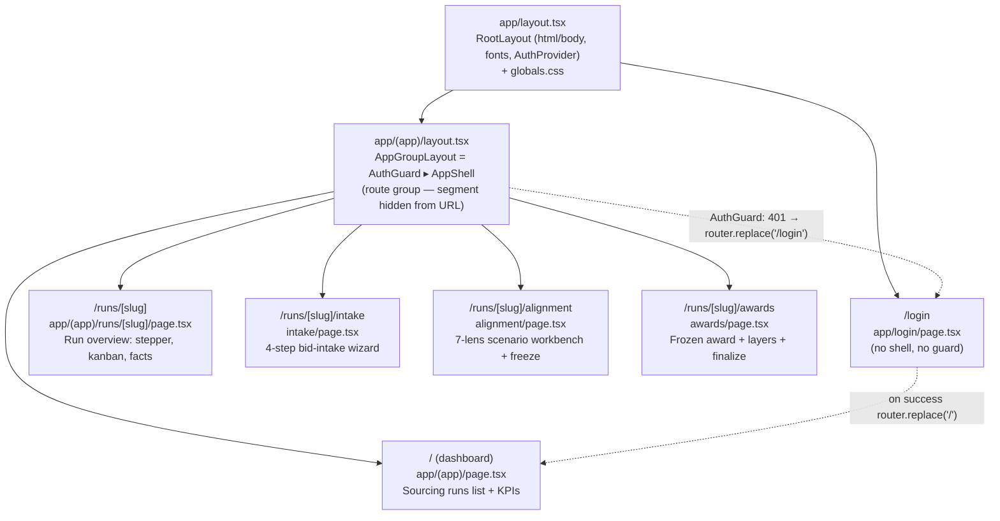
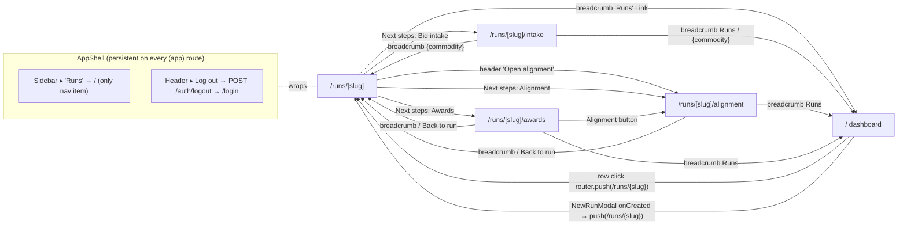

# AS-BUILT AUDIT — SLICE F1 · `frontend/app/**` (routes, layouts, globals)

> Scope: every file under `/home/user/KR_RFP/frontend/app/**`. Read-only. Produced to the
> AUDIT_STANDARD Layer-3 bar (every screen · every state · every data binding with format +
> precision · every interaction → handler/endpoint · navigation reachability) plus the per-file
> Layer-2 shape (path · ext · empty? · what · detailed WHY). Cross-checked against
> `AS_BUILT/FILE_CENSUS.md` rows **269–277** (all 9 files present, none empty, none missing).
>
> Load-bearing support files outside the F1 scope (read to nail format/precision of bindings) are
> referenced by path but audited in their own slices: `frontend/lib/api/*`, `frontend/lib/format.ts`,
> `frontend/lib/cn.ts`, `frontend/components/shell/*`, `frontend/components/ui/*`,
> `frontend/components/auth/*`, and the intake/alignment/awards/runs feature components.

---

## 0. FILE CENSUS CROSS-CHECK (F1 slice)

`find frontend/app -type f` returns exactly 9 files. Each maps 1:1 to a FILE_CENSUS row. **No
empty files in this slice** (the 18 repo-wide empties live elsewhere). Sizes/dates below are the
on-disk truth at audit time; census `created`/`modified` columns quoted alongside.

| # | Census row | Path | Ext | Bytes (disk) | Empty? | Census created → modified |
|---|-----------|------|-----|-------------|--------|---------------------------|
| 1 | 269 | `frontend/app/(app)/layout.tsx` | tsx | 474 | no | 2026-06-21T03:05:25 → 2026-06-21T03:05:25 |
| 2 | 270 | `frontend/app/(app)/page.tsx` | tsx | 11097 | no | 2026-06-21T03:05:25 → 2026-06-22T04:14:14 |
| 3 | 271 | `frontend/app/(app)/runs/[slug]/alignment/page.tsx` | tsx | 22609 | no | 2026-06-21T07:59:35 → 2026-06-22T11:21:20 |
| 4 | 272 | `frontend/app/(app)/runs/[slug]/awards/page.tsx` | tsx | 14260 | no | 2026-06-21T08:28:12 → 2026-06-22T04:20:27 |
| 5 | 273 | `frontend/app/(app)/runs/[slug]/intake/page.tsx` | tsx | 9692 | no | 2026-06-21T04:12:26 → 2026-06-22T04:18:37 |
| 6 | 274 | `frontend/app/(app)/runs/[slug]/page.tsx` | tsx | 15269 | no | 2026-06-21T03:05:25 → 2026-06-22T10:44:25 |
| 7 | 275 | `frontend/app/globals.css` | css | 719 | no | 2026-06-21T03:05:25 → 2026-06-22T04:05:25 |
| 8 | 276 | `frontend/app/layout.tsx` | tsx | 1072 | no | 2026-06-18T05:37:44 → 2026-06-22T04:05:25 |
| 9 | 277 | `frontend/app/login/page.tsx` | tsx | 10375 | no | 2026-06-21T03:05:25 → 2026-06-22T04:14:14 |

Census disk-byte figures match the on-disk `find -printf %s` figures exactly for all 9 rows. ✅

---

## 1. ROUTE TREE (mermaid)

Next.js 14 App Router. `(app)` is a **route group** — the `(app)` segment is *not* part of the URL;
it exists solely to attach a shared layout (`AuthGuard` + `AppShell`) to every route inside it
without nesting the URL. `/login` lives **outside** the group, so it renders with no shell and no
auth gate (you must be able to reach it while signed out).



### In-run navigation reachability (mermaid)



**Reachability note (gap-adjacent):** There is **no direct Dashboard → Intake/Alignment/Awards**
link; the only way to a run's sub-pages is through the run-overview page (`/runs/[slug]`) or by
typing the URL. The Sidebar has a **single** nav item ("Runs" → `/`). The sub-routes are reachable
via the overview's "Next steps" rail, the header "Open alignment", the breadcrumbs, and the
Awards-page "Alignment" button. Intake is reachable only from the overview "Next steps" (no
breadcrumb or sibling-page jump points *into* intake). See §11 Gaps.

---

## 2. FILE — `frontend/app/layout.tsx` (census 276)

- **Path/ext/empty:** `frontend/app/layout.tsx` · `.tsx` · not empty (1072 B, 35 lines).
- **What:** The Next.js **root layout** (Server Component — no `"use client"`). Renders the
  `<html>`/`<body>` shell for *every* route in the app, loads two Google fonts, imports the global
  stylesheet, sets the document `<Metadata>`, and wraps all children in `<AuthProvider>`.
- **DETAILED WHY:** App Router requires exactly one root layout that emits `<html>` and `<body>`;
  without it the app will not render. It is the single mount point for app-wide concerns that must
  exist on *both* the public `/login` and the gated `(app)` tree: (1) the font CSS variables, (2)
  the base body classes, (3) the **AuthProvider** context — placed at the root (not in `(app)`) so
  `/login` can read/refresh auth state and bounce an already-signed-in user to `/`. If AuthProvider
  lived only in `(app)/layout`, the login page could not call `useAuth()`.

**Bindings / structure (line-level):**
- L1 `import "./globals.css"` — pulls Tailwind layers + base rules (the `globals.css` audited in §8).
- L8–13 `Montserrat({ weight: ["600","700","800"], variable: "--font-montserrat", display:"swap" })`
  — the **display face** (headings, metrics, numerics). `display:"swap"` avoids invisible-text FOIT.
- L14–19 `Nunito({ weight: ["400","600","700","800"], variable:"--font-nunito" })` — the **body/UI**
  face. Both are exposed as CSS variables, not applied directly, so CSS owns which element uses which.
- L21–24 `metadata`: `title:"KR_RFP Console"`, `description:"Enterprise RFP sourcing console — pure
  client of the FastAPI backend."` → rendered into `<head>` by Next.
- L28 `<html lang="en" className="${montserrat.variable} ${nunito.variable}">` — both font vars are
  scoped at the `<html>` node so every descendant can reference them.
- L29 `<body className="min-h-screen bg-surface-app font-sans text-ink antialiased">` — full-height,
  app background token, default sans family, ink text colour, font smoothing.
- L30 `<AuthProvider>{children}</AuthProvider>` — context provider boundary (the `"use client"` lives
  inside AuthProvider; the layout itself stays a server component).
- **States:** none of its own (pure structural shell). Children supply all interactive states.
- **Interactions:** none.
- **Reachability:** wraps 100% of routes; cannot be navigated to/from.

---

## 3. FILE — `frontend/app/(app)/layout.tsx` (census 269)

- **Path/ext/empty:** `frontend/app/(app)/layout.tsx` · `.tsx` · not empty (474 B, 13 lines).
- **What:** The **route-group layout** for everything under `(app)`. Composes two wrappers:
  `<AuthGuard>` (enforces the session) → `<AppShell>` (sidebar + header + scroll container).
- **DETAILED WHY:** The `(app)` group exists so the auth gate and the persistent chrome attach to
  the dashboard + all run sub-pages **without adding `(app)` to the URL** (parentheses = group, not
  path segment). Putting AuthGuard here (not at root) is deliberate: `/login` must render
  *un-gated*. Without this file, each protected page would have to import the guard + shell itself —
  duplication and a real risk that one page forgets the gate and leaks data to a signed-out user.
- **Comment (L4–6, verbatim intent):** "Every route in this group is protected: AuthGuard enforces
  GET /auth/me and redirects to /login on 401, AppShell provides the left nav + header."

**Composition / states inherited:**
- `AuthGuard` (`components/auth/AuthGuard.tsx`) gates on `useAuth().status`:
  - `status==="loading"` → centered spinner + **"Checking your session…"**.
  - `status==="unauthenticated"` → `router.replace("/login")` and renders the same centered block
    reading **"Redirecting to sign in…"** (renders nothing of the app).
  - `status==="authenticated"` → renders `{children}` (i.e. AppShell + page).
  - *Note:* AuthGuard's spinner uses tokens `border-line-strong`/`border-t-accent`/`text-ink-muted`
    (legacy token names) — a stylistic inconsistency vs the rest of the app's `border-hairline`/
    `brand-primary` spinner tokens; flagged in §11.
- `AppShell` (`components/shell/AppShell.tsx`) provides: a 248px dark sidebar (`bg-brand-ink`,
  hidden below `md`) with the brand lockup + a single "Sourcing → Runs" nav item; a 56px header
  (`h-14`) with a mobile brand lockup, the signed-in user chip, and a **Log out** button; and a
  scrolling `<main>` whose content is centered in a `max-w-6xl` column with responsive padding.
- **Interactions surfaced by the shell (apply to all child routes):**
  - Sidebar "Runs" `<Link href="/">`; active when `pathname === "/" || pathname.startsWith("/runs")`.
  - Header user chip: avatar = `user.username.slice(0,2).toUpperCase()`; name = `user.username`;
    sub-label = `user.totp_enabled ? "2FA enabled" : "Signed in"`.
  - Header **Log out** → `useAuth().logout()` → `POST /api/v1/auth/logout` → clears local state →
    `router.replace("/login")` (clears even if the call errors, per AuthProvider L56–67).

---

## 4. SCREEN — `/login` · `frontend/app/login/page.tsx` (census 277)

- **Path/ext/empty:** not empty (10375 B, 277 lines). `"use client"` (L1).
- **What/WHY:** The unauthenticated **sign-in** screen with a two-stage flow: credentials →
  (conditionally) a TOTP 6-digit step. It is the only public route. WHY two-stage: the backend does
  **not** advertise whether 2FA is on; it answers the *first* login attempt with `401 "2FA code
  required"` when a code is needed. The page therefore submits username/password first, and only
  reveals the TOTP field after that specific 401 — so users without 2FA never see a code field.

### Purpose & layout
Split panel: a brand panel (hidden below `lg`, L101–140) and a form panel (L143–273). The brand
panel is pure marketing copy (no data binding): headline "Produce sourcing, run end to end.",
two value chips ("Decision-support · not auto-decided", "Audit-evented · hash-chained"), footer
"Enterprise RFP sourcing · Kroger".

### Local state (L41–47)
`username`, `password`, `totpCode` (strings); `totpRequired` (bool — true after the 2FA 401);
`error` (string|null); `submitting` (bool).

### STATES (every one)
- **Default / credentials (`!totpRequired`):** heading "Sign in" + sub "Access the enterprise
  produce-sourcing console."; Username + Password fields (L196–225); submit label **"Continue"**.
- **2FA step (`totpRequired`):** a lock icon tile, heading "Two-factor code", sub "Enter the 6-digit
  code from your authenticator app for **{username}**." (the bolded username only if non-blank,
  L184–190); a single centered 6-digit `Input` (L233–249); a **Back** button (L167–175); submit
  label **"Verify & sign in"**.
- **Submitting (`submitting===true`):** every input `disabled`; the `<Button loading>` shows its
  spinner and is disabled; the Back button is disabled and `backToCredentials()` early-returns
  (L92) so you can't change steps mid-request.
- **Error (`error!=null`):** a `role="alert"` red box (L253–260, `border-danger/30 bg-danger-bg
  text-danger`) showing the message. Sources: 401 (non-2FA) → "Incorrect username, password, or
  2FA code."; other ApiError → `err.detail` or "Sign in failed. Please try again."; non-ApiError →
  "Unexpected error. Please try again." (L76–84). The 2FA-required 401 is **not** an error — it
  clears `error` and flips `totpRequired` (L72–75).
- **Already-authenticated:** `useEffect` (L51–55) — if `status==="authenticated"` (e.g. user opens
  `/login` while signed in) → `router.replace("/")`. So the form never usefully renders for a
  signed-in user.
- **No loading/empty/not-found/gated/rehearsal/post-close states** — this page has no backend GET;
  it is a pure form. (Documented as N/A rather than skipped.)

### DATA BINDINGS (DB → pixel)
This page has **no read binding** (no field rendered from a GET). Its only data flow is *outbound*:
- Submit (L57–88) → `login({ username: username.trim(), password, totp_code: totpRequired &&
  totpCode ? totpCode.trim() : undefined })` → **`POST /api/v1/auth/login`** (`lib/api/auth.ts`).
  TOTP is sent only once the field is in play and filled.
- On success → `await refresh()` (re-checks `GET /auth/me`, populates the AuthProvider `user`) →
  `router.replace("/")`.
- `ApiError.twoFactorRequired` is computed in `client.ts` L40–41 as `status===401 &&
  detail.trim().toLowerCase()==="2fa code required"`. That exact-string contract is the hinge of the
  whole two-stage UX.
- **Format/precision of the inputs:** TOTP `onChange` (L244–246) strips non-digits
  (`replace(/\D/g,"")`) and clamps to 6 chars; the field is `inputMode="numeric"`,
  `autoComplete="one-time-code"`, `maxLength={6}`, rendered in display face, `tracking-[0.5em]`,
  centered — i.e. a fixed 6-slot OTP look. Username is `.trim()`'d on submit. Password is sent raw.

### INTERACTIONS → handler/endpoint
| Element | Handler | Effect |
|---|---|---|
| Form submit (Continue / Verify) | `onSubmit` L57 | `POST /auth/login`; success → `refresh()` + `replace("/")`; 2FA-401 → reveal TOTP; other → set `error` |
| Back (2FA step) | `backToCredentials` L91 | resets `totpRequired=false`, clears `totpCode` + `error`; no-op while submitting |
| Username/Password/TOTP inputs | local `setState` | controlled inputs; TOTP sanitized to digits |

### Reachability
Reached by: AuthGuard redirect (any 401 in `(app)`), AppShell **Log out**, AuthProvider `logout()`,
or direct URL. Leaves to: `/` (success or already-authenticated bounce).

---

## 5. SCREEN — `/` dashboard · `frontend/app/(app)/page.tsx` (census 270)

- **Path/ext/empty:** not empty (11097 B, 332 lines). `"use client"`.
- **What/WHY:** The **Sourcing runs** dashboard — a KPI strip + a searchable table of every RFP
  cycle, with a "New run" modal. It is the app's home and the only Sidebar destination. WHY it owns
  the run list: every workflow starts from a run; this is the fan-out point into `/runs/[slug]`.

### Local state (L87–91)
`runs: RunSummary[] | null` (null = not-yet-loaded), `error: string|null`, `loading: bool`,
`modalOpen: bool`, `query: string`.

### Load (L93–112)
`load()` → `listRuns()` → **`GET /api/v1/runs`** → `RunSummary[]`. Runs once on mount via `useEffect`.

### Derivations
- **`filtered`** (L116–123): the visible set. With a non-blank `query`, filters on
  `` `${commodity} ${label} ${stage} ${slug}`.toLowerCase().includes(q)``. **Locked rule (L114–115):
  all KPI counts reflect the *filtered* set, not the full list.**
- **`kpis`** (L125–135): `total = filtered.length`; `active = filtered.filter(!isClosedStage).length`;
  `rehearsal = filtered.filter(r.rehearsal).length`; `production = filtered.filter(!r.rehearsal).length`.
- **`isClosedStage(stage)`** (L50–52): regex `/(done|complete|award|closed|archiv)/i` on the
  free-form `stage` string. This is the dashboard's notion of "closed" (drives the "active" KPI and
  the muted progress bar) and is **distinct** from the run-overview's `stageIndex` regex (§7) — a
  divergence worth noting (two independent stage classifiers).
- **`hasRuns`** (L137): `runs !== null && runs.length > 0`.

### STATES (every one)
- **Loading (`loading`):** centered spinner + "Loading runs…" (L217–222). KPI strip and search are
  hidden (both gated on `hasRuns && !error`).
- **Error (`!loading && error`):** centered red `error` text + a secondary **Retry** button → `load()`
  (L224–231).
- **Empty — no runs at all (`runs && runs.length===0`):** centered "No runs yet" + helper copy + a
  **New run** button opening the modal (L233–244).
- **Empty — filtered to nothing (`filtered.length===0` but runs exist):** the table header renders,
  then a centered "No runs match "{query}"." row (L310–314).
- **Populated (`hasRuns && !error`):** KPI strip (4 cards) + the runs table.
- No not-found/gated/rehearsal-mode/post-close states at this level (per-row "Rehearsal" chip is a
  type indicator, not a screen state).

### DATA BINDINGS (DB → pixel, with format/precision)
KPI strip — `MetricCard` (L55–83): value in **Montserrat 2xl extrabold `tabular-nums`**, formatted
by `formatCount` (`Number.toLocaleString()` → grouped integer; null → "—").
| Card (L160–183) | Label | Value field | `sub` | Tone (colour) |
|---|---|---|---|---|
| 1 | "Total runs" / "Matching runs" (when query active) | `kpis.total` | "tracked" / "in view" | strong (`text-text-strong`) |
| 2 | "Active runs" | `kpis.active` | "in flight" | warning (`text-warning`) |
| 3 | "Production runs" | `kpis.production` | "governed" | success (`text-success`) |
| 4 | "Rehearsal runs" | `kpis.rehearsal` | "practice" | strong |

Panel header count badge (L191–195): `formatCount(filtered.length)` in `tabular-nums`, rendered only
when `hasRuns && !error`.

Runs table (L248–308), per `RunSummary` row (`key=run.slug`):
| Column | Element | Field → render | Format/precision |
|---|---|---|---|
| Commodity | avatar tile + name | `run.commodity.slice(0,1).toUpperCase()` (tile glyph) + `run.commodity` (text) | tile = display extrabold brand-primary on `accent-soft`; name = semibold `text-text` |
| Cycle | `<TD>` | `run.label` | medium `text-text-muted` |
| Type | chip / text | `run.rehearsal ? <StatusChip tone="amber">Rehearsal</StatusChip> : "Production"` | chip uppercase 2xs; "Production" = 2xs uppercase `text-text-subtle` |
| Stage | chip + bar | `<StatusChip tone={stageTone(run.stage)}>{run.stage}</StatusChip>` + progress bar | chip tone via `stageTone` regex (green/amber/accent/slate); bar = `closed ? w-full bg-success/40 : w-1/2 bg-brand-sky` where `closed = isClosedStage(run.stage)` |
| (open) | chevron | static `ChevronIcon` | `text-text-faint`, right-aligned |

`stageTone(stage)` (`StatusChip.tsx` L53–59): `/(done|complete|award|closed)/`→green;
`/(wait|review|action|hold|blocked)/`→amber; `/(active|progress|doing|open|round)/`→accent;
else slate. **Note:** the progress bar is **binary** (full vs half) — it is not a real percentage;
WHY: there is no progress field on `RunSummary`, so it is a visual hint derived purely from
`isClosedStage`. (Honest about the lack of precision: not a measured fraction.)

### INTERACTIONS → handler/endpoint
| Element | Handler | Effect |
|---|---|---|
| "New run" (header, L152) | `setModalOpen(true)` | opens `NewRunModal` |
| Search input (L204–211) | `setQuery` | re-derives `filtered` + all KPIs live; `aria-label="Search runs"` |
| Table row click (L264–267) | `router.push(/runs/${run.slug})` | whole row is clickable → run overview |
| Retry (error state) | `load()` | re-`GET /runs` |
| Empty-state "New run" | `setModalOpen(true)` | opens modal |
| `NewRunModal onCreated(run)` (L322–327) | closes modal → `load()` (refresh table) → `router.push(/runs/${run.slug})` | `POST /runs` happens inside the modal; here we only react |

### Reachability
Reached by: Sidebar "Runs", login success, every breadcrumb "Runs", AuthGuard. Leaves to: any
`/runs/[slug]` (row click or new-run).

---

## 6. SCREEN — `/runs/[slug]` overview · `frontend/app/(app)/runs/[slug]/page.tsx` (census 274)

- **Path/ext/empty:** not empty (15269 B, 388 lines). `"use client"`. Dynamic segment `[slug]`.
- **What/WHY:** The **run overview** — the hub for one cycle. It shows a 5-step lifecycle stepper, a
  persistent status strip, the activity kanban, a "Run facts" card, the engine **StrategyPanel**
  (only once a cycle exists), and a "Next steps" rail linking to intake/alignment/awards. WHY this
  is the hub: the dashboard fans into it and it fans into the three working surfaces; it also derives
  *all* lifecycle/status from the single `RunDetail.stage` string (no extra API calls).

### Load (L146–171)
`getRun(slug)` → **`GET /api/v1/runs/{slug}`** → `RunDetail` (extends `RunSummary` with `kanban`).
404 → `{ notFound:true }`; other → generic message.

### LIFECYCLE STEPPER DERIVATION (L17–33) — exhaustive
Five stages constant `LIFECYCLE` (L17–23): `setup` ("Cycle created"), `intake` ("Supplier bids
loaded"), `analysis` ("Sealed for review"), `award` ("Frozen scenario"), `close` ("Run finalised").
`stageIndex(stage, hasCycle)` returns the current 0-based index by **first-match** regex on
`stage.toLowerCase()`:
- `/(close|final|complete|done)/` → 4 (Close)
- `/(post[- ]?award|award|frozen)/` → 3 (Award)
- `/(analy|seal|align|scenario)/` → 2 (Analysis)
- `/(intake|bid|round|import|load)/` → 1 (Intake)
- `/(setup|kickoff|cycle)/` **or** `hasCycle===true` → 0 (Setup)
- else → 0.
Rendering (L260–306): for each stage `i`, `done = i < currentStage`, `current = i === currentStage`.
A done node shows a ✓ on `bg-success`; current shows `i+1` in `brand-primary` on `sealed-bg`; future
shows `i+1` in `text-text-faint`. Connector segment between nodes is `bg-success` when
`i <= currentStage`, else `bg-border`. Numbers are `tabular-nums`. **WHY derive from a free-form
string:** keeps the overview a single-GET page; the trade-off is that an out-of-vocabulary stage
falls back to Setup (index 0).

### STATUS-STRIP DERIVATION (L36–57) — `statusCells(run)`
`idx = stageIndex(run.stage, run.has_cycle)`. Four cells:
1. **RUN STATE** = `run.stage` (verbatim); tone `idle` if `idx>=4` else `live`.
2. **ANALYSIS** = `idx>=2 ? "Sealed" : "—"`; tone `sealed`/`idle`.
3. **AWARD** = `idx>=3 ? "Frozen" : "Not frozen"`; tone `frozen`/`idle`.
4. **AUDIT** = constant "Current", tone `live`.
Rendered by `RunStatusStrip` — each cell = a coloured dot (`dot` map: live/frozen→`bg-success`,
sealed→`bg-sealed`, idle→`bg-text-faint`) + caps label (`text-2xs uppercase`) + value (`text-sm
font-semibold text-text-strong truncate`). **WHY colour+text always:** WCAG AA — never hue alone
(comment in RunStatusStrip).

### KANBAN / ACTIVITY BOARD (L59–132)
`ActivityBoard` iterates the fixed `KANBAN_BUCKETS` order: **Done, Doing, Next, Waiting on you**.
- Per bucket: a header with a colour dot (`BUCKET_DOT`: Done→`bg-success`, Doing→`bg-brand-sky`,
  Next→`bg-text-faint`, Waiting on you→`bg-warning`), the bucket name, and a **count badge**
  (`cards.length`, `tabular-nums`).
- Cards (`run.kanban[bucket]`): empty → "No items" centered; else each card via `cardTitle` which
  handles the permissive `KanbanCard` union (string, or `{title|label|id}`), falling back to
  "Untitled item". `cardKey` makes a stable React key (`id`, else `i:title`). "Waiting on you" cards
  get a warning skin (`border-warning/30 bg-warning-bg`); others a subtle skin.
- **WHY this kanban is *display-only* here:** the cards come straight from `RunDetail.kanban`
  computed server-side; no drag/drop, no mutation — it is a status mirror, not a board you edit.

### STATES (every one)
- **Loading:** Panel with spinner + "Loading run…" (L185–192).
- **Error — generic (`!notFound`):** "Something went wrong" + message + **Retry** (`load()`) + ghost
  **Back to runs** (L194–215).
- **Error — not found (`notFound`, i.e. 404):** "Run not found" + message + secondary **Back to
  runs** only (no Retry — retrying a 404 is pointless) (L198–212).
- **Loaded (`run`):** the full overview (L217–384).
- **Rehearsal:** header shows `<StatusChip tone="amber">Rehearsal</StatusChip>` when `run.rehearsal`
  (L233); also "Run facts → Mode = Rehearsal/Production" (L334).
- **Post-award:** header shows `<StatusChip tone="frozen">Post-award</StatusChip>` when
  `currentStage >= 3` (L234–236).
- **Cycle-gated:** `StrategyPanel` renders **only if `run.has_cycle`** (L352–353) — before setup is
  ingested there is no strategy to resolve.

### DATA BINDINGS (DB → pixel)
| Element | Field → render | Format |
|---|---|---|
| Breadcrumb current | `run.commodity ?? slug` | bold `text-text-strong` |
| Header avatar | `run.commodity.charAt(0).toUpperCase()` | display xl extrabold `text-danger` on `bg-danger-bg` |
| Header title | `run.commodity` | 2xl extrabold |
| Header sub | `run.label` · `<code>{run.slug}</code>` | muted; slug in display xs `text-text-faint` |
| Run facts `<dl>` (L330–348) | Commodity=`run.commodity`; Cycle=`run.label`; Stage=`run.stage`; Mode=`run.rehearsal?"Rehearsal":"Production"`; Run ID=`run.slug` | each row: `dt` semibold subtle, `dd` bold strong right-aligned |
| Status strip | per §6 derivation | dot+caps+value |
| Stepper | per §6 derivation | numeric/✓ `tabular-nums` |
| Kanban counts | `cards.length` | `tabular-nums` |

### INTERACTIONS → handler/endpoint
| Element | Effect |
|---|---|
| Breadcrumb "Runs" (L178) | `Link href="/"` |
| `DownloadArchiveButton slug` (L248) | → `downloadRunArchive(slug)` → `GET /runs/{slug}/archive` → `.zip` browser download (via `apiDownload`) |
| Header "Open alignment" (L249–251) | `Link → /runs/{slug}/alignment` |
| StrategyPanel (L353) | its own GET/PUT `/runs/{slug}/strategy` (audited in its component slice) |
| Next steps: Bid intake / Alignment / Awards (L361–378) | `Link` to the three sub-routes |

### Reachability
Reached by: dashboard row/new-run, every sub-page breadcrumb/"Back to run". Leaves to: `/`, intake,
alignment, awards; triggers archive download.

---

## 7. SCREEN — `/runs/[slug]/intake` · `frontend/app/(app)/runs/[slug]/intake/page.tsx` (census 273)

- **Path/ext/empty:** not empty (9692 B, 265 lines). `"use client"`.
- **What/WHY:** The **bid-intake wizard** — a 4-step sequential flow (Setup → Template → Import →
  Review) scoped to a selectable **round (1–6)**. WHY a soft-gated wizard: each step depends on the
  prior; the backend is the hard gate (returns `gate_required` when a step runs too early), and the
  page mirrors that as local *disabling* so the user is guided, not blocked by surprise errors.

### Loads (L75–119)
- `loadRun()` → `getRun(slug)` → `RunDetail`; also seeds `kanban` from `data.kanban`.
- `loadFiles()` → `listRunFiles(slug)` → **`GET /runs/{slug}/files`** → `RunFile[]` (independent
  loading/error: `filesLoading`, `filesError`).
Both fire on mount.

### State & GATING DERIVATION (L57–73) — exhaustive
`round` (1, default), `cycleId`, `setupDoneThisSession`, `templateDoneThisSession`, `bidsRefreshKey`.
- `hasRoundTemplate` (L69–71): any file with `kind==="input"` whose name `includes("round{round}
  _bid_template")` — durable signal a template exists for the selected round.
- **`setupDone`** (L72) = `setupDoneThisSession || Boolean(run?.has_cycle) || hasRoundTemplate`.
  WHY three sources: this-session progress, the durable `has_cycle` (works for a returning user who
  never generated a template), or a round template (which implies the cycle).
- **`templateDone`** (L73) = `templateDoneThisSession || hasRoundTemplate`.
- Gating wiring: `TemplateSection disabled={!setupDone}`; `ImportSection disabled={!templateDone}`.
  `ReviewSection` is never disabled (it just lists whatever bids exist for the round).

### STATUS-STRIP DERIVATION (L30–37) — `statusCells(run, round)`
Static-ish: RUN STATE = `"Round {round} intake"` (live); ANALYSIS = "Not yet sealed" (idle);
AWARD = "Not yet frozen" (idle); AUDIT = "Current" (live). WHY hard-coded idle for analysis/award:
on the intake page nothing is sealed/frozen yet by definition.

### ROUND SELECTOR (L186–214)
A segmented control of buttons `1..MAX_ROUND` (`MAX_ROUND = 6`, L28). Active button = `bg-brand-
primary text-white`, `aria-pressed`. `role="group" aria-label="Select round"`. Switching round
(L198–202) sets `round` and **resets `templateDoneThisSession=false`** (round-scoped progress);
`setupDone` is *not* reset (the cycle is run-wide). Numbers `tabular-nums`.

### STATES (every one)
- **Loading run:** spinner + "Loading run…" (L135–142).
- **Error — generic / not-found:** same two-variant pattern as the overview (Retry only when not 404;
  ghost **Back to run** Link) (L144–165).
- **Loaded:** header + round selector + status strip + the four step sections.
- **Files loading/error:** surfaced *inside* `SetupSection` (passed `filesLoading`/`filesError`), not
  at page level — so the wizard frame still renders while files load.
- **Step-gated:** Template disabled until `setupDone`; Import disabled until `templateDone` (visual
  + behavioural).
- No explicit rehearsal/post-close states (intake is pre-analysis by definition).

### DATA BINDINGS (DB → pixel)
| Element | Field → render | Format |
|---|---|---|
| Breadcrumb | "Runs" / `run.commodity ?? slug` (Link) / "Bid intake" | muted; current bold |
| Header sub (L175–178) | `{run.commodity} · {run.label}` | muted |
| Status strip | per derivation | dot+caps+value |
| Round buttons | `1..6` | `tabular-nums` |
| `SetupSection` | consumes `files`, `filesLoading`, `filesError`, `cycleId` | (component-owned) |
| `TemplateSection` | consumes `files`, `round`, `disabled` | (component-owned) |
| `ImportSection` | consumes `round`, `disabled` | (component-owned) |
| `ReviewSection` | consumes `round`, `refreshKey` | (component-owned bid table) |

### `normalizeKanban` (L20–26)
Each step callback returns a loose `Record<string,string[]>` kanban; `normalizeKanban` coerces it to
the strict 4-bucket `Kanban` (missing bucket → `[]`) before `setKanban`. WHY: the intake endpoints
type kanban loosely; the strict shape is what any board renderer expects. (Note: `kanban` state is
set here but **not visibly rendered on this page** — it is plumbed for parity with the overview/board;
the visible board lives on the overview. Minor: `kanban` is computed and stored but unused for render
on intake — see §11.)

### INTERACTIONS → handler/endpoint (this page's wiring; deep behaviour in each section's slice)
| Element | Effect |
|---|---|
| Round buttons | set round; reset round-scoped template progress |
| `DownloadArchiveButton slug` | `GET /runs/{slug}/archive` → `.zip` |
| `SetupSection onSetupComplete(id, raw)` | sets `cycleId`, `setupDoneThisSession=true`, `setKanban(normalize(raw))`, reloads files. (Section posts `POST /runs/{slug}/setup` multipart.) |
| `TemplateSection onTemplateGenerated(_fn, raw)` | `templateDoneThisSession=true`, setKanban, reload files. (Section posts `POST /runs/{slug}/rounds/{round}/template`.) |
| `ImportSection onImported(_n, raw)` | setKanban, bump `bidsRefreshKey` (forces ReviewSection refetch), reload files. (Section posts `POST /bids/import` multipart.) |
| Retry / Back to run | `loadRun()` / `Link` |

### Reachability
Reached by: overview "Next steps → Bid intake" only (plus direct URL). Leaves to: `/`,
`/runs/{slug}` (breadcrumbs / Back). **No link out to alignment/awards from intake.**

---

## 8. SCREEN — `/runs/[slug]/alignment` · `.../alignment/page.tsx` (census 271)

- **Path/ext/empty:** not empty (22609 B, 594 lines — the largest page). `"use client"`.
- **What/WHY:** The **alignment workbench** — the centerpiece. Run a round's analysis, pick a sealed
  analysis version, compare the **seven lenses (A–G)**, inspect one lens cell-by-cell, optionally
  compare two versions, save a named version (savepoint, E-43), and **freeze** a chosen lens into a
  governed award. WHY it is the most stateful page: it orchestrates four cascading selections
  (analysis → comparison → lens → detail), each with race-safe abortable fetches, plus three modals
  (Freeze, SaveVersion) and read-only gating for historic versions.

### State (L43–77) — 18 pieces of state
Run header (`run`/`runErr`/`runLoading`); analyses (`analyses`, `selectedAnalysisId`, `running`,
`runAnalysisError`); comparison (`comparison`, loading/error, `selectedCode`); detail (`detail`,
loading/error); freeze (`freezeOpen`, `freezing`, `freezeError`, `frozen` map); save-version
(`saveOpen`, `saving`, `saveError`, `savingVersion`); compare (`compareRightId`).

### Cascading loads (every effect)
1. `loadRun()` (L79–99) → `getRun` → `RunDetail`. 404/other handled.
2. `loadAnalyses(selectId?)` (L101–118) → `listAnalyses(slug)` → **`GET /runs/{slug}/analysis`** →
   `AnalysisSummary[]`. Selection logic: explicit `selectId` wins; else keep current if still
   present; else default to the **last** (latest) row. A throw is **non-fatal** → `[]` + null (e.g.
   no cycle yet).
3. Comparison effect (L129–158): on `selectedAnalysisId` change, abortable
   `getScenarioComparison(slug, id, signal)` → **`GET /runs/{slug}/analysis/{id}/scenarios`** →
   `ScenarioComparisonRow[]`. Auto-selects the recommended lens (`is_recommended`, i.e. **B**), else
   the first row. AbortError = superseded selection (ignored).
4. Detail effect (L161–188): on `selectedCode` change, **synchronously clears `detail`** first (so a
   stale detail can never render against a newly-selected code — guarding the freeze modal from
   posting lens B while showing lens A), then abortable `getScenarioDetail(slug, id, code, signal)`
   → **`GET /runs/{slug}/analysis/{id}/scenarios/{code}`** → `ScenarioDetail`.

### READ-ONLY / HISTORIC DERIVATION (L283–295)
- `liveAnalysis` = the highest-`version` row (most-recently sealed).
- `selectedAnalysis` = the row matching `selectedAnalysisId`.
- **`readOnly`** = both exist **and** `selectedAnalysis.version !== liveAnalysis.version`. When true:
  a warning banner (L411–431) reads "You're viewing a sealed, read-only analysis (v{version}).
  Governed actions are disabled — switch to the live version to build or freeze." + a **View live
  version** button (`handleSelectAnalysis(liveAnalysis.id)`); and `ScenarioDetailPanel` receives
  `readOnly` to disable Freeze.

### STATUS-STRIP DERIVATION (inline L387–408)
1. **Run state** = `readOnly ? "Historic view" : "Live · Alignment"`; tone idle/live.
2. **Analysis** = `selectedAnalysis ? "Sealed · v{version}" : "Not sealed"`; tone sealed/idle.
3. **Award** = `anyFrozen ? "Frozen" : "Not yet frozen"`; tone frozen/idle (`anyFrozen =
   Object.keys(frozen).length>0`).
4. **Audit** = "Hash-chain current" (live).

### DECISION-HEADER CHIPS DERIVATION (L315–336) — `headerChips`
Computed from `detail` **only when `detail.code === selectedCode`** (so chips reflect the lens
actually shown). Sets of: DCs (`cell.dc`), lots (`cell.lot`), suppliers (flattened
`cell.suppliers[].name`), award cells (`cells.length`), timeframes (`cell.tf`). Chips:
`{n} DC(s)`, `{n} lot(s)`, `{n} supplier(s)`, `{n} award cell(s)`, and a TF chip joining the TFs
with " · ". Singular/plural handled per count. Plus a **Lens** chip with `<StatusChip>` showing
`selectedCode` (+ " · REC" if `selectedComparisonRow.is_recommended`, green tone; else sealed).
Counts render as `String(set.size)` (plain integers, no separators — small cardinalities).

### STATES (every one)
- **Run loading / error (generic + not-found):** same two-variant pattern (Retry unless 404; Back to
  run) (L352–382).
- **Run loaded:** strip + optional read-only banner + decision header + analyses panel + (conditional)
  compare controls + comparison table + detail panel + modals.
- **No analyses (`!selectedAnalysisId`):** comparison/detail blocks don't render; `AnalysisRunsPanel`
  shows its own empty/run-CTA state (component slice). `loadAnalyses` swallowing errors means "no
  cycle yet" renders calmly as "no analyses".
- **Comparison loading:** Panel spinner + "Loading scenarios…" (L520–527).
- **Comparison error:** `<Alert tone="error">` with `comparisonError` (L528–530).
- **Comparison loaded:** `ScenarioComparisonTable rows selectedCode onSelect` (L531–537).
- **Detail loading:** Panel spinner + "Loading scenario {code}…" (L543–550).
- **Detail error:** `<Alert tone="error">` (L551).
- **Detail loaded (guarded `detail.code === selectedCode`):** `ScenarioDetailPanel` (L554–565) with
  `frozenAwardId`, `readOnly`, `capBreachCount`, `onFreeze`.
- **Read-only (historic):** banner + disabled governed actions (above).
- **Running analysis (`running`):** `AnalysisRunsPanel` receives `running` to show its busy state;
  `runAnalysisError` surfaces as a top `<Alert>` (L478).
- **Compare-active:** when a saved version is chosen, `ScenarioComparePanel` renders (L514–516).
- **Freeze submitting / error:** inside `FreezeAwardModal` (`submitting`, `error`).
- **Empty `is_recommended`/no rec:** comparison auto-select falls back to `rows[0]`.

### DATA BINDINGS (DB → pixel) — page-level
| Element | Field → render | Format/precision |
|---|---|---|
| Breadcrumb | "Runs" / `run.commodity ?? slug` / "Alignment" | muted; current strong |
| Header sub (L440–442) | `{run.commodity} · {run.label}` | muted |
| Header chips | per `headerChips` derivation | plain integers; lens chip via StatusChip |
| Lens chip | `selectedCode` + optional " · REC" | uppercase 2xs chip; green if recommended |
| Status strip Analysis | `v{selectedAnalysis.version}` | integer version |
| Compare control (L490–513) | `v{version}` / `v{version} · {label}` options from `compareOptions` | option text |
| `ScenarioComparisonTable` | the 7 `ScenarioComparisonRow`s — `total_spend` ($), `delta_vs_a` ($), `savings_vs_incumbent_pct`/`savings_vs_stly_pct` (fractions→%), counts, `cap_breach_count` | **formatting owned by the table component**; the *fields'* contracts (types.ts L194–206): `total_spend`/`delta_vs_a` are dollars, the two `*_pct` are fractions (0.05 = 5%), counts are integers |
| `ScenarioDetailPanel` | one `ScenarioDetail` — `savings` summary (dollars + fractions) + `cells[]` (volume, `baseline_price`/`min_price` $/case, supplier `price_per_case`, `rec_score` 0–100, `volume_share` fraction) | formatting owned by the panel; field contracts in types.ts L209–256 |
| `suggestedAwardCode` (L272–279) | `AWD-{COMMODITY-SLUG}-{lens}` where commodity is upper-cased, non-alnum→`-`, trimmed, max 16 chars; lens = `selectedCode ?? "B"` | passed to FreezeAwardModal as the default award code |

**WHY the money/percent precision is *not* finalized on this page:** the alignment page passes raw
typed rows to `ScenarioComparisonTable`/`ScenarioDetailPanel`; those components apply
`formatMoney`/`formatPercent`/`formatPrice` (`lib/format.ts`): money = USD, whole dollars by default
(or 2dp with `{cents:true}`), percent = 1 decimal (`0.0524 → "5.2%"`), price = 2 decimals. Pixel-
level money/percent precision is therefore asserted in the **alignment component slice**, not here;
this page's contract is the *field semantics* (dollars vs fractions vs 0–100 score) above.

### INTERACTIONS → handler/endpoint
| Element | Handler | Endpoint / effect |
|---|---|---|
| Run analysis (in `AnalysisRunsPanel`) | `handleRun(round)` L190–207 | `runAnalysis(slug, round)` → **`POST /runs/{slug}/rounds/{round}/analysis`**; on success reset `selectedCode`, reload analyses selecting the new id |
| Select analysis | `handleSelectAnalysis(id)` L209–213 | sets selection; clears `selectedCode` + `detail` |
| Save version (savepoint) | `handleSaveVersion` → modal → `handleSaveConfirm(label)` L221–239 | `nameVersion(slug, id, label)` → **`PATCH /runs/{slug}/analysis/{id}`** body `{label}`; reload analyses |
| Select lens | `setSelectedCode` (table `onSelect`) | triggers detail effect |
| Compare-with select (L495–506) | `setCompareRightId` | renders `ScenarioComparePanel left=selectedAnalysis right=compareRight` |
| Clear compare | `setCompareRightId(null)` | hides compare panel |
| Freeze (in detail panel) | `onFreeze` → `setFreezeOpen(true)` → `handleFreezeConfirm(awardCode)` L241–266 | `freezeAward(slug, {analysis_run_id, scenario_code, award_code})` → **`POST /runs/{slug}/awards/freeze`**; on success records `frozen["{id}:{code}"]=award_id`, closes modal |
| View live version | `handleSelectAnalysis(liveAnalysis.id)` | exits read-only |

### Reachability
Reached by: overview header "Open alignment", overview "Next steps → Alignment", awards-page
"Alignment" button, breadcrumbs. Leaves to: `/`, `/runs/{slug}` (Back to run). Freezing an award is
the bridge to the Awards page (which then lists the new award).

---

## 9. SCREEN — `/runs/[slug]/awards` · `.../awards/page.tsx` (census 272)

- **Path/ext/empty:** not empty (14260 B, 386 lines). `"use client"`.
- **What/WHY:** The **post-award** screen — list a run's frozen awards, inspect one (frozen baseline
  → current effective price per line + the versioned layer history), record an append-only
  **adjustment** layer, and **finalize & close** the run (gated on a frozen award). WHY the freeze
  lives on alignment but close-out lives here: this is the terminal, post-decision surface; close-out
  is the run's last governed action and surfaces award/rejection notices.

### Loads (L69–137)
- `loadRun()` → `getRun` → `RunDetail` (404/other handled).
- `loadAwards()` (L91–104) → `listAwards(slug)` → **`GET /runs/{slug}/awards`** → `AwardSummary[]`.
  Selection: keep current if present, else default to **last** (latest) award. Throw → non-fatal `[]`
  + null (no cycle/award yet).
- Detail effect (L116–137): on `selectedId` **or `reloadNonce`** change, abortable `getAward(slug,
  id, signal)` → **`GET /runs/{slug}/awards/{id}`** → `AwardDetail`. Clears synchronously; only the
  live request resolves loading; AbortError ignored. `reloadNonce` is bumped after an adjustment so
  the now-superseded detail re-fetches.

### Gating / status derivation
- `hasFrozenAward` (L185) = `awards.length > 0` — a frozen award exists iff the run has ≥1 award;
  close-out (`canFinalize`) is gated on it (and `!closed`).
- `closed` (L186) = `!!finalizeNotice?.closed`.
- **STATUS-STRIP (inline L237–254):** Run state = `closed ? "Closed · Finalized" : "Live ·
  Post-award"` (frozen/live); Analysis = "Sealed" (sealed) — *constant*, because reaching the awards
  page implies a sealed analysis was frozen; Award = `hasFrozenAward ? "Frozen{ · Lens
  {detail.scenario_code}}" : "Not yet frozen"` (frozen/idle) — the lens suffix only when a detail is
  loaded; Audit = "Hash-chain current" (live).

### STATES (every one)
- **Run loading / error (generic + not-found):** same two-variant pattern (L202–232).
- **Loaded:** strip + header + (conditional close notice) + `AwardsListPanel` + (conditional) detail
  block.
- **No awards (`!selectedId`):** detail block hidden; `AwardsListPanel` shows its empty state.
- **Detail loading:** Panel spinner + "Loading award…" (L296–303).
- **Detail error:** `<Alert tone="error">` (L304).
- **Detail loaded (guarded `detail.award_id === selectedId`):** optional adjustment-success alert +
  `AwardDetailPanel` + the two modals (L305–378).
- **Closed / finalized (`closed && finalizeNotice`):** a success `<Alert>` (L283–290): "Run closed ·
  {won} award + {not_won} rejection notice(s) drafted · CLOSED event recorded." (pluralizes "notice").
- **Adjustment recorded (`adjustNotice`):** success `<Alert>` (L307–319): "Recorded adjustment
  v{version}." + a **Download the updated post-award document** button → `downloadRunFile(slug,
  filename)`.
- **Finalize submitting / error:** inside `AssertModal` (`loading`, `error`).
- **canFinalize gate:** `AwardDetailPanel` gets `canFinalize = hasFrozenAward && !closed` — the
  Finalize button is enabled only with a frozen award and an un-closed run.

### DATA BINDINGS (DB → pixel)
| Element | Field → render | Format |
|---|---|---|
| Breadcrumb | "Runs" / `run.commodity ?? slug` / "Awards" | muted; current strong |
| Header sub (L263–266) | `{run.commodity} · {run.label}` — "the frozen award and its append-only post-award layers." | muted |
| Status strip Award | `Frozen · Lens {detail.scenario_code}` | lens code verbatim |
| Close notice | `finalizeNotice.won_suppliers`, `.not_won_suppliers` (integers) | inline counts; pluralized noun |
| Adjustment notice | `adjustNotice.version` (int), `.filename` | "v{n}" + download link |
| `AwardsListPanel` | `AwardSummary[]` — `award_code`, `scenario_code`, `frozen_at` (ISO→`formatTimestamp`), `frozen_by`, `line_count`, `latest_version` | formatting owned by the panel; field contracts types.ts L276–284 |
| `AwardDetailPanel` | `AwardDetail` — `lines[]` (`volume_share` fraction 0–1, `frozen_price`, `effective_price`, `delta` $) + `versions[]` (v0 FROZEN → vN, dates/reasons) | formatting owned by the panel; contracts types.ts L288–348 |
| AssertModal summary | `<StatusChip frozen>Frozen · {detail.award_code}</StatusChip>` + `<StatusChip sealed>Lens {detail.scenario_code}</StatusChip>` | chips |
| AssertModal actor | `user?.username ?? "you"` | from `useAuth()` |

**WHY money/share precision is in the panel, not here:** identical pattern to alignment — the page
hands raw `AwardLineView`s to `AwardDetailPanel`, which applies `formatMoney`/`formatPrice`/
`formatPercent`. Field semantics asserted here: `volume_share` is a fraction (0–1), prices are
dollars, `delta = effective − frozen` (types.ts L297–301). The `effective_price` is "baseline
overlaid by every layer" — i.e. the running result after all adjustment layers (the per-hop value
math lives in the awd read layer / its component slice).

### INTERACTIONS → handler/endpoint
| Element | Handler | Endpoint / effect |
|---|---|---|
| Select award | `handleSelect(id)` L140–144 | sets `selectedId`; clears adjustment notice/error |
| Record adjustment | modal → `handleAdjustConfirm(body)` L146–166 | `recordAdjustment(slug, id, body)` → **`POST /runs/{slug}/awards/{id}/adjustments`**; on success set notice {version_no, filename}, bump `reloadNonce` (re-fetch detail), reload awards (advance latest_version) |
| Download updated doc | `downloadRunFile(slug, adjustNotice.filename)` | **`GET /runs/{slug}/files/{name}`** → `.xlsx` download |
| Open Adjust modal | `onAdjust` (detail panel) | clears error/notice, opens `RecordAdjustmentModal` (seeded with `award_code`, `lines`) |
| Open Finalize modal | `onFinalize` | opens `AssertModal` (eventType "CLOSED") |
| Finalize confirm | `handleFinalizeConfirm` L168–182 | `finalizeRun(slug)` → **`POST /runs/{slug}/finalize`**; on success set `finalizeNotice`, close modal |
| Header "Alignment" / "Back to run" | `Link` | sub-route nav |

### Reachability
Reached by: overview "Next steps → Awards", alignment (after freeze, by typing/back to overview then
Awards — there is **no** direct alignment→awards link), breadcrumbs. Leaves to: `/`,
`/runs/{slug}`, `/runs/{slug}/alignment`; triggers `.xlsx` download.

---

## 10. FILE — `frontend/app/globals.css` (census 275)

- **Path/ext/empty:** not empty (719 B, 38 lines). `.css`.
- **What/WHY:** The single global stylesheet — Tailwind layer directives + a handful of base rules
  the design system relies on app-wide. WHY it must exist: Tailwind utilities don't exist until
  `@tailwind` layers are emitted; and the *typographic / focus* contract (display face on headings,
  tabular numerals, the brand focus ring) has to be global, not per-component.
- **Contents (every rule):**
  - L1–3 `@tailwind base; components; utilities;` — emits the three Tailwind layers (required).
  - L5–7 `:root { color-scheme: light; }` — locks light scheme (UA form controls/scrollbars render
    light); the app is light-only by design.
  - L9–12 `html, body { height: 100% }` — enables the full-height shell (`min-h-screen` / the
    `h-screen` AppShell flex column).
  - L14–17 `body { @apply bg-surface-app text-ink antialiased; font-feature-settings: "tnum" 1; }`
    — app bg + ink text + smoothing; **`"tnum" 1` enables tabular figures globally** so numeric
    columns align (reinforced by per-element `.tabular-nums`).
  - L19–26 `h1,h2,h3,h4,.font-display { font-family: var(--font-montserrat), … }` — headings and any
    `.font-display` element render in the Montserrat display face (the font vars come from the root
    layout). WHY: metrics/headings are the display face; body stays Nunito (the `font-sans` default).
  - L28–31 `.tabular-nums { font-variant-numeric: tabular-nums }` — opt-in tabular figures for dense
    tables/metrics (used by KPI cards, stepper numbers, kanban counts, round buttons).
  - L33–37 focus ring: `:where(a,button,input,select,textarea,[tabindex]):focus-visible { outline:
    2px solid #2478ce; outline-offset: 2px }` — the accessible brand-sky focus ring on every
    interactive element (2px, 2px offset). WHY hard-coded hex `#2478ce`: it is the brand-sky value;
    using `:where()` keeps specificity 0 so components can still override.
- **States/interactions:** none (stylesheet). **Reachability:** imported by the root layout; affects
  every route.

---

## 11. GAPS / OBSERVATIONS (verifiable, not assumed)

1. **Two divergent stage classifiers.** The dashboard uses `isClosedStage` (regex
   `/(done|complete|award|closed|archiv)/i`, `(app)/page.tsx` L50) for "active"/progress; the
   overview uses `stageIndex` (different alternations, `runs/[slug]/page.tsx` L25–33) for the
   stepper/strip; `StatusChip.stageTone` is a *third* regex. The same `stage` string can be coloured/
   classified inconsistently across surfaces (e.g. "archived" closes the dashboard count but is not a
   stepper terminal — `stageIndex` has no `archiv`). Not a bug, but a drift risk: no single
   stage→lifecycle source of truth in the frontend.

2. **Intake `kanban` state computed but not rendered.** `intake/page.tsx` builds and stores `kanban`
   (via `normalizeKanban` on every step callback) yet renders no board on the intake page (the board
   lives on the overview). The state + normalization run for no visible effect on this page.

3. **No direct cross-links between working surfaces.** Intake has no link to alignment/awards;
   alignment has no link to awards; awards links back to alignment but not forward. All inter-surface
   travel funnels through `/runs/[slug]`. The Sidebar exposes a single nav item ("Runs"). Reachable,
   but every sub-page is ~2 clicks from any sibling.

4. **AuthGuard spinner uses legacy design tokens** (`border-line-strong`, `border-t-accent`,
   `text-ink-muted`, `ink-muted`) while every other spinner in the slice uses
   `border-border-hairline` / `border-t-brand-primary` / `text-text-muted`. Same for the Button
   component's variant palette (`bg-accent`, `text-ink`, `border-line-strong`) vs the pages'
   `brand-primary`/`text-text-*` tokens. Two token vocabularies coexist; if the legacy tokens aren't
   defined in the Tailwind config they would render as defaults. (Token *definitions* are in the
   Tailwind config — out of F1 scope; flagged for the config/styles slice to reconcile.)

5. **`params` consumed as a plain object** in the dynamic `[slug]` pages (`const { slug } = params;`
   with `params: { slug: string }`). This is the Next 14 client-component contract (noted in
   `runs/[slug]/page.tsx` L139). Correct for 14; would need `use(params)`/async under Next 15 — a
   forward-compat note, not a current defect.

6. **Progress bar on the dashboard is binary, not a measured percentage** (`w-full` vs `w-1/2`,
   `(app)/page.tsx` L294–296) — there is no progress field on `RunSummary`; it is an honest visual
   hint, not a precise value. Documented so it is not mistaken for a real metric.

7. **Money/percent pixel-precision is delegated to the feature components**
   (`ScenarioComparisonTable`, `ScenarioDetailPanel`, `AwardsListPanel`, `AwardDetailPanel`) via
   `lib/format.ts` (money = USD whole-dollar default / 2dp with `{cents}`; percent = 1dp; price =
   2dp). The route pages assert only field *semantics* (dollars vs fractions vs 0–100). The exact
   rendered decimals therefore must be confirmed in the alignment/awards **component** slices — noted
   so the pixel-level decimal journey is not assumed to terminate in this slice.

---

## 12. CONFIRMATIONS

- All 9 F1 files read end-to-end; all 9 present in FILE_CENSUS (rows 269–277); none empty; disk bytes
  match census bytes.
- Route tree + in-run navigation charted (mermaid, §1).
- Lifecycle stepper derivation (§6), status-strip derivations (§6/§7/§8/§9), and the kanban/activity
  board (§6) documented value-by-value.
- Every screen's states (loading/empty/error/not-found/gated/rehearsal/read-only/post-close),
  bindings (field → element, with format/precision or an explicit delegation note), and interactions
  (→ handler → endpoint) enumerated.
- Support files read for binding fidelity but audited elsewhere: `lib/api/{client,auth,runs,intake,
  alignment,awards,types,index}.ts`, `lib/format.ts`, `lib/cn.ts`, `components/shell/{AppShell,
  RunStatusStrip}.tsx`, `components/auth/{AuthProvider,AuthGuard}.tsx`, `components/ui/{index,Button,
  StatusChip}.tsx`.
```
