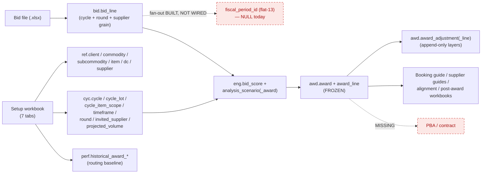

# As-Built Process Audit — Kroger Produce RFP Platform

A faithful, code-verified snapshot of the **RFP lifecycle as actually implemented today**, so we can see *every gate, every loop, every write-point, and how data is mapped* — and decide what to build next from the truth, not the plan. Every claim is traced to source (`backend/app/...`, file:line as of `d563aad`).

It is also a **UX/UI map**: each stage is shown in two layers — the *system* layer (method, tables written, gate) and the *human* layer (who acts, on which screen, doing what) — so the UX/UI build can map screens to the real process and see which surfaces exist vs. are missing.

> **Reading order:** the [Executive summary](#executive-summary) gives the headline + the material gaps; the [flowchart](#1-end-to-end-lifecycle-flowchart) is the one-page picture; everything after is the evidence.

---

## Executive summary

**What works end to end (driven by `PilotService` + the MCP harness):** start run → setup ingest (full cycle/scope creation) → bid template → bid intake (strict *and* flexible) → V3 engine (5-factor scoring, 7 scenario lenses A–G, split allocation) → human-selected award freeze → versioned post-award layers → generated workbooks (alignment, booking guide, per-supplier guides, post-award) → close-out (archive→purge). Sealed analysis runs and frozen awards are immutability-guarded. Per-run isolated databases keep runs apart at the harness runtime.

**The six material gaps** (detail + evidence below):

| # | Gap | Impact | Backlog |
|---|---|---|---|
| **G-A** | **Flat-13 period fan-out is built but NOT wired.** The column, indexes, and fan-out engine exist; the live ingest path never calls it, so bids are stored at the **timeframe** grain (`fiscal_period_id` NULL). | The "data flat at 13 periods" model (D35) isn't actually in effect for stored bids. | D35, migrations 0014–0016 |
| **G-B** | **The audit hash-chain doesn't cover award decisions.** The chained `audit.event_log` is mechanically correct but the **only** caller is commodity creation. Engine seal, award freeze, supersede, ingest emit **no** events. | The marketed tamper-evident provenance (E-05) does not currently record the decisions that matter. Provenance today rests on immutable sealed rows + git + run_data.json. | E-05 |
| **G-C** | **RBAC is defined but not enforced.** A full permission matrix + separation-of-duties exists; **no route uses it** — every route is bare session auth, and the dev principal holds all roles. | Author≠approver, sign-off/send restrictions, in-gate approval are not actually gated. | E-03 |
| **G-D** | **Sign-off is decorative.** It exists only as a workbook tab + an unused permission — no transition, no state, no gate. | No portfolio sign-off step (E-22) in the running system. | E-22 |
| **G-E** | **The HTTP API is front-half only.** `run_round`, `freeze_award`, `record_adjustment`, `history` are **MCP-only**; the `cycles`/`awards`/`documents`/`ingest` routers are empty stubs. | The web console can set up + take bids, but cannot run the engine, award, or adjust — those need the MCP harness. | E-25 |
| **G-F** | **PBA / contract builder is absent**, and so are external feeds (iTrade/KCMS), the supplier importer, and any deck/letter/email/send path. | The post-award final step and supplier master intake the sponsor flagged don't exist yet. | E-33, E-34, E-08/E-09, E-24 |

**Two runtimes, two isolation models (important):** the **MCP harness** gives each run its *own database* (D30, `kr_rfp_run_<slug>`); the **web console** runs against the *shared* app database with per-run `cycle_id`/`round_id` scoping (D36) and no per-query RLS yet. Both are real and coexist.

---

## 1. End-to-end lifecycle flowchart

Gates are diamonds; colour = status. **Green = enforced in code · Amber (dashed) = aspirational (defined, not wired) · Red (dashed) = missing · Blue = built process step.**

---

## 2. Stage-by-stage — system layer + human layer

System layer = what the code does. Human layer = who acts, on which **screen** (✅ built · ⬜ missing), doing what. "Persists" key: **V**=commits the vault (git) · **S**=snapshots the run DB (MCP runtime only) · **A**=emits an audit event.

| # | Stage | System: method (file:line) → writes | Persists | Exposure | Human: actor → screen → action |
|---|---|---|:--:|---|---|
| 0 | Start run | `start_run` (service.py:133) → FS scaffold + isolated DB | V | API `POST /runs` · MCP | Analyst → **Dashboard ✅** → "New run" |
| 1 | Setup ingest → cycle | `ingest_setup` (service.py:163) → `ingest_setup_workbook` (setup_ingest.py:171) → `ref.*`/`cyc.*`/`perf.*` | V·S | API `POST /runs/{slug}/setup` · MCP | Analyst → **Intake ✅** → download kickoff, upload filled |
| 2 | Bid template | `generate_bid_template` (service.py:235) → FS `..bid_template.xlsx` (in `inputs/`) | V | API `POST /runs/{slug}/rounds/{n}/template` · MCP | Buyer → **Intake ✅** → generate + download template |
| 3 | Bid intake (strict/flexible) | `ingest_bids` (service.py:261) / `ingest_any` (service.py:303) → `bid.bid_line` | V·S | API `POST /bids/import` · MCP | Buyer → **Intake ✅** → upload bids; confirm mapping |
| 4 | Engine run / scenarios | `run_round` (service.py:341) → `eng.analysis_run`/`bid_score`/`analysis_scenario(_award)` (sealed) | V·S | **MCP only** ⛔ | Buyer → **Alignment/Scenario screen ⬜** (only an Excel workbook today) |
| 5 | Award freeze | `freeze_award` (service.py:470) → `awd.award` FROZEN + `award_line` | V·S | **MCP only** ⛔ | Buyer/Approver → **Award screen ⬜** |
| 6 | Sign-off | — *(decorative tab + unused permission)* | — | — | Approver → **Sign-off screen ⬜** |
| 7 | Outputs | within run_round / freeze_award → FS workbooks | V | download via `GET /runs/{slug}/files` (partial) | Buyer → **Outputs/Downloads ◐** (file list + zip) |
| 8 | Post-award adjustments | `record_adjustment` (service.py:518) → `awd.award_adjustment(_line)` | V·S | **MCP only** ⛔ | Buyer → **Post-award screen ⬜** |
| 9 | History / versions | `history` (service.py:563) → read | — | **MCP only** ⛔ | Buyer → **Run detail ◐** (kanban only) |
| 10 | Close-out | `close_run`/`purge_run` (service.py:918/928) → archive zip; drop DB | V | **MCP only** ⛔ | Buyer → **Close-out screen ⬜** |
| — | PBA / contract | **absent** | — | — | → **Contract builder ⬜** |
| — | Supplier master + importer | **absent** (`ingest.py` empty) | — | — | Admin → **Supplier admin ⬜** |
| — | User / role admin | auth + 2FA built; no role enforcement/admin UI | — | API `/auth/*` | Admin → **User admin ⬜** |

**Screens that exist today:** Dashboard ✅, Run detail (kanban) ◐, Bid intake ✅, Login + 2FA ✅. **Everything from the engine onward is MCP-only with no web screen yet** — that is the bulk of the UX/UI still to build, and it lines up with the planned next slices (alignment/scenario centerpiece → award/post-award).

---

## 3. Data flow & write-points

**Every governed write is add+flush inside the caller's unit of work — never an internal commit** (the UoW owns the transaction; the vault commit + DB snapshot happen after it closes).

| Write point | file:line | Tables | Scoping |
|---|---|---|---|
| Cycle creation | setup_ingest.py:387–693 | `ref.*`, `cyc.*`, `perf.*`, `norm.normalization_run` | `cycle_id` on all cyc/perf rows; **`ref.dc`/`ref.supplier` reused by natural key** (shared master, D36); `ref.item` per-RFP with collision-safe codes |
| Bid lines | service.py:1071–1199 | `norm.source_artifact`, `bid.bid_submission`, `bid.bid_line` | every row carries `cycle_id`+`round_id`+`supplier_id` |
| Engine seal | runner.py:154–413 | `eng.analysis_run`/`bid_score`/`analysis_scenario`/`analysis_scenario_award` | `cycle_id`+`round_id`; children FK to run/scenario |
| Award freeze | awd/service.py:90–138 | `awd.award`, `awd.award_line` | idempotent on `cycle_id`+`analysis_run_id`+`scenario_code` |
| Post-award layer | awd/service.py:172–203 | `awd.award_adjustment`, `awd.award_adjustment_line` | `award_id`+`version_no` (unique) |
| Audit (commodities only) | ref/service.py:53 | `audit.event_log` | `client_id` + per-tenant `seq` |

---

## 4. Gates — enforced vs aspirational

| Gate | Status | Where |
|---|---|---|
| Award-select is **human, not engine** | ✅ enforced structurally | `freeze_award` needs explicit scenario+award from a human; engine never auto-freezes |
| Engine **decision-support language** guard | ✅ enforced | `assert_decision_support` on every scenario label/desc (engine/guards.py; v3.py:185) |
| **Frozen award** immutability (no update/delete) | ✅ enforced (app-layer) | SQLAlchemy listeners, guards.py:56/45 wired at main.py:62 |
| **Sealed analysis-run** immutability | ✅ enforced (app-layer) | guards.py:34/45 |
| Bid **key validation / quarantine** | ✅ enforced | bid_ingester.py:489–527 |
| **Double-subtract** price guard | ✅ enforced (app + DB CHECK) | bid_ingester.py:282; migration 0007:64 |
| Premium-ceiling / coverage-floor eligibility | ✅ enforced (engine-internal) | scoring.py:346/351; layered service.py:451 |
| Propose→confirm before flexible write | ✅ enforced | ingest_any (service.py:303) |
| Concentration / max-suppliers-per-DC | ⚠️ **advisory flag only** — never blocks | v3.py:281/113 |
| Tenant scoping | ✅ at the edge (no per-query RLS) | deps.py:21; principal-derived only |
| **In-gate G12** (open on real data) | ❌ aspirational | permission + event type exist; nothing enforces |
| **Round close** | ❌ aspirational | rounds created OPEN (setup_ingest.py:601), never transitioned; `is_final` set, never enforced |
| **Sign-off** | ❌ missing | tab + unused permission only |
| **Draft → SENT** | ❌ aspirational | permission + event type exist; `documents.py` empty |
| **RBAC separation of duties** | ❌ defined, not enforced | full matrix in rbac.py; **no route calls `require_permission`** |

---

## 5. Loops

| Loop | Where | Bound / exit |
|---|---|---|
| **Round loop R1..Rn** | external repeat of template→intake→run_round with `round_no`; rounds made at setup (setup_ingest.py:601) | round_count **2..6**; no auto-advance, no enforced final-round close |
| **Propose→confirm intake** | `ingest_any` (service.py:303) | exits on buyer confirm; ambiguities surfaced, never guessed |
| **Resubmit / supersede** | `_persist_bid_lines` (service.py:1091) | one scoreable submission per (cycle, round, supplier) |
| **Alignment re-run** | `run_round` repeatable; each a new sealed version (service.py:1301) | unbounded; every run sealed + immutable |
| **Post-award reprice** | `record_adjustment` (service.py:518) | unbounded, append-only over the frozen v0 baseline |
| **Close-out present→confirm→purge** | close_run → purge_run | terminal; archive retained |

There is **no optimisation loop inside the engine** — `run_analysis` is single-pass, deterministic, with hashed input/output manifests (runner.py:430/469).

---

## 6. Audit / event-log status (G-B detail)

The hash-chained `audit.event_log` is **mechanically complete and correct**: `prev_event_hash`→`event_hash = sha256(canonical(fields) || prev)`, per-tenant `seq` taken `FOR UPDATE`, genesis = 64 zeros, written in the caller's transaction (writer.py:46–82). Eight `EventType`s are defined (CREATED, SEALED, FROZEN, SUPERSEDED, SIGNED_OFF, SENT, GATE_APPROVED, IMPORTED).

**But the only caller in `app/` is commodity creation (ref/service.py:53).** Engine seal, award freeze, bid supersede, and ingest emit **no** events; there is no sign-off/send path to emit the rest. So the chain currently records none of the actual award decisions. Today's provenance for decisions = immutable sealed `eng.*`/`awd.*` rows + hashed engine manifests + the vault git history + `run_data.json` — **not** the audit chain. Closing G-B (E-05) = calling `AuditWriter.append` at each seal/freeze/supersede/ingest.

---

## 7. Built · partial · missing (gap analysis → backlog)

**Built (working):** vault scaffold + git + per-run isolated DBs + snapshot/rehydrate · setup ingest → full cycle/scope · bid template gen · strict + flexible intake w/ quarantine · V3 engine (5-factor scoring, eligibility gates, 7 lenses, split allocator, sealed reproducible runs) → **E-18/E-19/E-20** · award freeze + append-only post-award layers → **E-21** · alignment/booking-guide/supplier-guide/post-award workbooks → **E-23 (booking guide part)** · immutability guards · MCP surface covering the full lifecycle · web: auth+2FA, dashboard, run detail, **bid intake** → **E-26 (started)**.

**Partial / inert:**
- Audit event emission — writer live, lifecycle steps silent → **E-05**.
- RBAC matrix defined, **no route enforces** it → **E-03**.
- HTTP API front-half only; `cycles`/`awards`/`documents`/`ingest` routers empty → **E-25**.
- **Flat-13 fan-out built, not invoked** (bids at timeframe grain) → **D35 / migrations 0014–0016**.
- Outputs: workbooks only — **no deck/letter/email** → **E-23 (remainder)**.
- `is_awardable` set unconditionally true at ingest — no awardability logic.
- DB-level immutability triggers + tenant RLS — referenced as Platform-team-owned, **not present** here.

**Missing (absent):**
- **PBA / contract builder** → **E-33**.
- **Supplier importer / external feeds** (iTrade/KCMS/normalize) → **E-34, E-08/E-09**.
- **Document send / draft→SENT** → **E-24**.
- **Sign-off** transition/gate → **E-22**.
- **In-gate G12 / round-close** gates → **E-17 / E-16**.

---

## 8. Known issues queued (fix after this review)

Captured here so the audit reflects the true state; queued as the first post-review batch (sponsor: queue, not now):

1. **Intake soft-gating keys off output files** — setup + generated templates live in `inputs/`, so a returning user gets template/import re-locked until analysis outputs exist. Derive "done" from cycle/template state (the round template in `inputs/`), not outputs. *(Codex P2, intake/page.tsx)*
2. **Template section shows only `kind:"output"`** — the generated template is in `inputs/`, so its download table stays empty after "Generate". Show it from the returned filename / input template. *(Codex P2, TemplateSection.tsx)*
3. **Template round error mislabeled** — `generate_bid_template` maps every `ValueError` to `gate_required` ("no cycle yet"); an out-of-range round should be a `validation_error`, pre-validated like the bids endpoint. *(Codex P2, runs.py)*

---

## 9. Recommended priorities (to frame the review)

1. **Wire the flat-13 fan-out into intake** (G-A) — small, high-value, makes D35 real.
2. **Emit audit events at seal/freeze/supersede/ingest** (G-B, E-05) — closes the provenance gap on the decisions that matter.
3. **Build the alignment/scenario web screen + the award/post-award HTTP surface** (G-E, E-25) — the biggest missing UX and the planned centerpiece; unblocks running RFPs end-to-end in the console.
4. **Enforce RBAC + sign-off** (G-C/G-D, E-03/E-22) — author≠approver and a real sign-off gate before "official".
5. **Spec the PBA/contract builder + supplier importer** (G-F, E-33/E-34) — the sponsor-flagged post-award step and supplier master intake.
