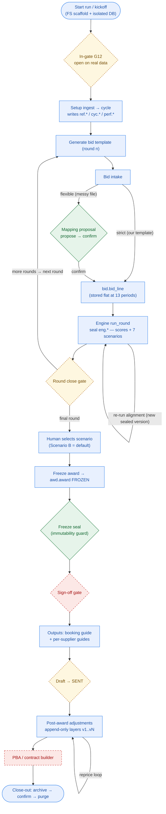
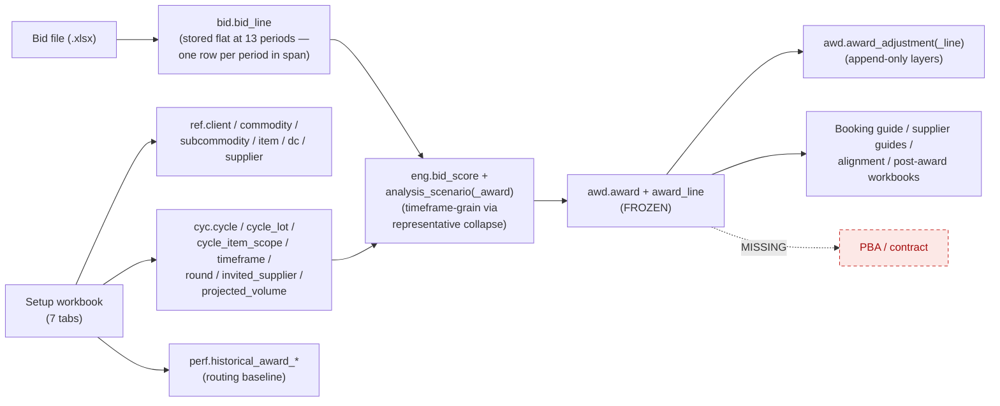

# As-Built Process Audit — Kroger Produce RFP Platform

A faithful, code-verified snapshot of the **RFP lifecycle as actually implemented today**, so we can see *every gate, every loop, every write-point, and how data is mapped* — and decide what to build next from the truth, not the plan. Every claim is traced to source (`backend/app/...`, file:line as of `d563aad`).

It is also a **UX/UI map**: each stage is shown in two layers — the *system* layer (method, tables written, gate) and the *human* layer (who acts, on which screen, doing what) — so the UX/UI build can map screens to the real process and see which surfaces exist vs. are missing.

> **Reading order:** the [Executive summary](#executive-summary) gives the headline + the material gaps; the [flowchart](#1-end-to-end-lifecycle-flowchart) is the one-page picture; everything after is the evidence.

---

## Executive summary

### Platform maturity snapshot — read this first

The whole platform at a glance. Status vocabulary (the governance set, D39): ✅ **Operational** · 🟡 **Partial** (built, not fully wired) · 🟠 **Defined but Unenforced** · 🔴 **Critical gap** · ⬜ **Missing** (not implemented).

| Domain | Status |
|---|---|
| Bid intake (strict + flexible) | ✅ Operational |
| Analysis engine (5-factor scoring) | ✅ Operational |
| Scenario generation (7 lenses A–G) | ✅ Operational |
| Award freezing + immutability | ✅ Operational |
| Post-award versioning (layers) | ✅ Operational |
| Document generation (workbooks) | ✅ Operational |
| Reproducible / sealed runs + per-run isolation | ✅ Operational |
| Web console (UI) | 🟡 Partial — dashboard, intake + **alignment/scenario/freeze** now wired; post-award/sign-off/close-out still MCP-only (G-E) |
| Flat-13 period model | ✅ Operational — bids stored flat at 13 periods (G-A closed v1.6) |
| **Audit provenance (decision trail)** | ✅ Operational — every existing decision chained in-txn (IMPORTED/SEALED/FROZEN/SUPERSEDED/adjustment); **G-B closed v1.4**. Sign-off/send events land with G-D. |
| RBAC enforcement | 🟠 Defined, not enforced (G-C) |
| Sign-off workflow | ⬜ Not implemented (G-D) |
| Contract generation (PBA) | ⬜ Not implemented (G-F) |
| External feeds / supplier import | ⬜ Not implemented (E-08/E-09/E-34) |

---

**What works end to end (driven by `PilotService` + the MCP harness):** start run → setup ingest (full cycle/scope creation) → bid template → bid intake (strict *and* flexible) → V3 engine (5-factor scoring, 7 scenario lenses A–G, split allocation) → human-selected award freeze → versioned post-award layers → generated workbooks (alignment, booking guide, per-supplier guides, post-award) → close-out (archive→purge). Sealed analysis runs and frozen awards are immutability-guarded. Per-run isolated databases keep runs apart at the harness runtime.

**The gaps — the critical one (G-B) CLOSED (v1.4) and G-A CLOSED (v1.6); four material remain.** This is the **gap register** (the spec's required fields: description · severity · impact · recommended action · status). Severity = inherent weight if unaddressed; status = where it stands today.

| # | Gap (description) | Severity | Impact | Recommended action | Status |
|---|---|---|---|---|---|
| **G-B** | The audit hash-chain didn't cover award decisions. Now fires in-transaction at ingest (IMPORTED), supersede (SUPERSEDED), engine seal (SEALED), freeze (FROZEN), adjustment (CREATED) — `app/core/audit/recorder.py` + emits in `pilot/service.py`, `awd/service.py`. | 🔴 Critical (existential) | The "why did Supplier A get 35%?" chain (bid → analysis → freeze → adjustment) is tamper-evident and recomputable. | E-05 — wire decision events in-txn; verify chain. | ✅ **Closed (v1.4)** |
| **G-A** | Flat-13 period fan-out was built but not wired. Intake now fans each priced line to one `bid.bid_line` per fiscal period in the timeframe span (`fiscal_period_id` populated); engine/award stay timeframe-grain via a deterministic representative-row collapse (Option B, **D38**); unmappable tf → single NULL-period row. | 🟠 Material | The "data flat at 13 periods" model (D35) is in effect for stored bids; engine/workbook output proven byte-identical to the pre-fan-out grain. | D35/D38 — fan-out + collapse; migrations 0014–0016. | ✅ **Closed (v1.6)** |
| **G-C** | RBAC is defined but not enforced: a full permission matrix + separation-of-duties exists, but **no route uses it** — every route is bare session auth and the dev principal holds all roles. | 🟠 Material | Author≠approver, sign-off/send restrictions, in-gate approval are not actually gated. | E-03 — call `require_permission` on routes; real principals. | 🔴 Open |
| **G-D** | Sign-off is decorative: a workbook tab + an unused permission — no transition, no state, no gate. | 🟠 Material | No portfolio sign-off step (E-22) in the running system. | E-22 — add the sign-off transition/state + gate; wire `SIGNED_OFF`. | 🔴 Open |
| **G-E** | The HTTP API was front-half only. Now the alignment slice is wired end to end: `run_round`, the scenario reads, and `freeze_award` have HTTP endpoints **and a web screen** (the alignment/scenario screen). Still MCP-only: `record_adjustment` (post-award) + `history`; the `documents` router is an empty stub. | 🟠 Material | The console can now run the engine, compare scenarios, and freeze an award from the browser; post-award adjustments + document send still need the MCP harness. | E-25 — remaining: post-award + document HTTP surface + screens. | 🟡 Partial (alignment shipped; post-award open) |
| **G-F** | PBA / contract builder is absent, as are external feeds (iTrade/KCMS), the supplier importer, and any deck/letter/email/send path. | 🟠 Material | The post-award final step and supplier-master intake the sponsor flagged don't exist yet. | E-33 (PBA), E-34 (importer), E-08/E-09 (feeds), E-24 (send). | 🔴 Open |

> **✅ G-B CLOSED in v1.4 (was the one existential gap).** The platform's thesis is *AI-generated, not AI-managed* — every number must be defensible by a human-owned, tamper-evident record. The first hard question in production is **"why did Supplier A receive 35% and Supplier B 15%?"**, and the answer must be a chain: **bid received → analysis run → scenario selected → award frozen → adjustment applied**. As of v1.4 each of those decisions appends a hash-chained `audit.event_log` row **in the decision's own transaction** — so an award cannot exist without its event — and the chain recomputes/verifies (tamper-evident; see `tests/audit/test_decision_events.py`). The remaining `SIGNED_OFF` / `SENT` event types stay unwired only because those features don't exist yet (G-D / E-24).

**Two runtimes, two isolation models (important):** the **MCP harness** gives each run its *own database* (D30, `kr_rfp_run_<slug>`); the **web console** runs against the *shared* app database with per-run `cycle_id`/`round_id` scoping (D36) and no per-query RLS yet. Both are real and coexist.

**Where the project stands.** This is not a prototype. It is a functioning RFP lifecycle + analysis engine + versioned awards + immutable analysis + reproducible runs + document generation + an MCP execution surface, with a partially built web console. The core risk is no longer *"can this work?"* — it is **"can governance, traceability, and operational controls catch up before adoption expands?"** The sections below (System of Record, Failure Domains, and the gap analysis) are written to answer that question.

---

## 1. End-to-end lifecycle flowchart

Gates are diamonds; colour = status. **Green = enforced in code · Amber (dashed) = aspirational (defined, not wired) · Red (dashed) = missing · Blue = built process step.**

---

## 2. Stage-by-stage — system layer + human layer

System layer = what the code does. Human layer = who acts, on which **screen** (✅ built · ⬜ missing), doing what. "Persists" key: **V**=commits the vault (git) · **S**=snapshots the run DB (MCP runtime only) · **A**=emits an audit event.

| # | Stage | System: method (file:line) → writes | Persists | Exposure | Human: actor → screen → action |
|---|---|---|:--:|---|---|
| 0 | Start run | `start_run` (service.py:133) → FS scaffold + isolated DB | V | API `POST /runs` · MCP | Analyst → **Dashboard ✅** → "New run" |
| 1 | Setup ingest → cycle | `ingest_setup` (service.py:163) → `ingest_setup_workbook` (setup_ingest.py:171) → `ref.*`/`cyc.*`/`perf.*` | V·S | API `POST /runs/{slug}/setup` · MCP | Analyst → **Intake ✅** → download kickoff, upload filled |
| 2 | Bid template | `generate_bid_template` (service.py:235) → FS `..bid_template.xlsx` (in `inputs/`) | V | API `POST /runs/{slug}/rounds/{n}/template` · MCP | Buyer → **Intake ✅** → generate + download template |
| 3 | Bid intake (strict/flexible) | `ingest_bids` (service.py:261) / `ingest_any` (service.py:303) → `bid.bid_line` | V·S | API `POST /bids/import` · MCP | Buyer → **Intake ✅** → upload bids; confirm mapping |
| 4 | Engine run / scenarios | `run_round` (service.py:341) → `eng.analysis_run`/`bid_score`/`analysis_scenario(_award)` (sealed) | V·S | API `POST /runs/{slug}/rounds/{n}/analysis` + scenario reads · MCP | Buyer → **Alignment screen ✅** → run analysis, compare the 7 lenses, inspect cell-by-cell |
| 5 | Award freeze | `freeze_award` (service.py:470) → `awd.award` FROZEN + `award_line` | V·S | API `POST /runs/{slug}/awards/freeze` · MCP | Buyer/Approver → **Alignment screen ✅** → freeze a chosen lens (governed) |
| 6 | Sign-off | — *(decorative tab + unused permission)* | — | — | Approver → **Sign-off screen ⬜** |
| 7 | Outputs | within run_round / freeze_award → FS workbooks | V | download via `GET /runs/{slug}/files` (partial) | Buyer → **Outputs/Downloads ◐** (file list + zip) |
| 8 | Post-award adjustments | `record_adjustment` (service.py:518) → `awd.award_adjustment(_line)` | V·S | **MCP only** ⛔ | Buyer → **Post-award screen ⬜** |
| 9 | History / versions | `history` (service.py:563) → read | — | **MCP only** ⛔ | Buyer → **Run detail ◐** (kanban only) |
| 10 | Close-out | `close_run`/`purge_run` (service.py:918/928) → archive zip; drop DB | V | **MCP only** ⛔ | Buyer → **Close-out screen ⬜** |
| — | PBA / contract | **absent** | — | — | → **Contract builder ⬜** |
| — | Supplier master + importer | **absent** (`ingest.py` empty) | — | — | Admin → **Supplier admin ⬜** |
| — | User / role admin | auth + 2FA built; no role enforcement/admin UI | — | API `/auth/*` | Admin → **User admin ⬜** |

**Screens that exist today:** Dashboard ✅, Run detail (kanban) ◐, Bid intake ✅, **Alignment / scenario ✅** (run analysis → compare the 7 lenses → inspect a lens cell-by-cell → freeze a chosen lens), Login + 2FA ✅. **Post-award, sign-off, and close-out remain MCP-only with no web screen yet** — that is the remaining UX/UI to build (the planned award/post-award slices follow the alignment centerpiece, now shipped).

---

## 3. Data flow & write-points

**Every governed write is add+flush inside the caller's unit of work — never an internal commit** (the UoW owns the transaction; the vault commit + DB snapshot happen after it closes).

| Write point | file:line | Tables | Scoping |
|---|---|---|---|
| Cycle creation | setup_ingest.py:387–693 | `ref.*`, `cyc.*`, `perf.*`, `norm.normalization_run` | `cycle_id` on all cyc/perf rows; **`ref.dc`/`ref.supplier` reused by natural key** (shared master, D36); `ref.item` per-RFP with collision-safe codes |
| Bid lines | service.py:1071–1199 | `norm.source_artifact`, `bid.bid_submission`, `bid.bid_line` | every row carries `cycle_id`+`round_id`+`supplier_id`; **each priced line fanned to one row per fiscal period in its timeframe span** (`fiscal_period_id`; D38) — `ingested` counts logical lines, not fanned rows |
| Engine seal | runner.py:154–413 | `eng.analysis_run`/`bid_score`/`analysis_scenario`/`analysis_scenario_award` | `cycle_id`+`round_id`; children FK to run/scenario |
| Award freeze | awd/service.py:90–138 | `awd.award`, `awd.award_line` | idempotent on `cycle_id`+`analysis_run_id`+`scenario_code` |
| Post-award layer | awd/service.py:172–203 | `awd.award_adjustment`, `awd.award_adjustment_line` | `award_id`+`version_no` (unique) |
| Audit (commodities only) | ref/service.py:53 | `audit.event_log` | `client_id` + per-tenant `seq` |

---

## 4. System of Record hierarchy

> **The rule.** For every business artifact there is **exactly one authoritative store**. Every other representation — a generated Excel, a JSON export, a cached view, a printout — is a **render** of that store at a point in time, never a source. **If a generated document and its governed record disagree, the record wins** and the document is stale or tampered. Declare this *before* the first production dispute ("the booking-guide Excel says X, the database says Y"), because after it starts there is no neutral way to pick a winner.

| Business artifact | System of record (authoritative) | Renders / exports (subordinate) |
|---|---|---|
| Cycle / RFP definition + scope | `cyc.cycle` + `cyc.*` (Postgres) | setup workbook (input), `run_data.json` |
| Reference master (DC / supplier / item) | `ref.dc` / `ref.supplier` / `ref.item` | setup workbook tabs; supplier import (future) |
| Supplier bid | `bid.bid_line` (+ `bid.bid_submission`) | uploaded bid workbook, normalized workbook |
| Analysis / scenarios | `eng.analysis_run` (sealed) + `eng.bid_score` / `eng.analysis_scenario(_award)` | alignment workbook |
| Award decision | `awd.award` + `awd.award_line` (FROZEN) | booking guide, per-supplier guides |
| Post-award changes | `awd.award_adjustment(_line)` (append-only) | post-award workbook |
| Provenance / who-did-what-when | `audit.event_log` (hash-chained) — **authoritative only once wired (G-B)** | git history + `run_data.json` (the *interim* stand-in today) |
| Generated document (the file itself) | vault filesystem (git-versioned) | — *(authoritative for the artifact, not for the values inside it)* |
| Official contract | **PBA — future (E-33)** | — |

Two consequences worth stating outright:
- **The database outranks every workbook.** A booking guide is a render of `awd.award`; an alignment sheet is a render of `eng.analysis_run`. The vault filesystem is authoritative for the *document as an artifact* (what was generated/sent), never for the decision values printed inside it.
- **Provenance has no real SoR yet.** Because the audit chain isn't wired (G-B), "who did what when" currently rests on immutable sealed rows + git history + `run_data.json`. Those are an *interim* stand-in; `audit.event_log` becomes the system of record for provenance only when G-B is closed — another reason G-B is critical.

---

## 5. Failure domains (load-bearing vs convenience)

Not every component carries equal weight. Two structural facts shape the blast radius: **(a)** every governed write is *add+flush inside the caller's unit of work — never an internal commit*, so a failure mid-stage **rolls the whole stage back atomically** (no partial/corrupt governed state); **(b)** vault git commit/push failures are **deliberately swallowed** (D34 — git is a persistence convenience, never a blocker).

| Component / failure | Immediate impact | Class |
|---|---|---|
| **Award freeze** (`freeze_award`) | no sealed official award can be produced | **Governance-critical** |
| **Audit writer** (`AuditWriter`) | a decision's provenance event is not recorded | **Governance-critical** (today *latent* — not yet wired, G-B) |
| **Immutability guards** (sealed/frozen) | sealed runs / frozen awards could be mutated | **Governance-critical** (integrity) |
| **Engine** (`run_round`) | no scenarios → award cannot proceed | Operational-blocking |
| **Bid intake** (`ingest_bids`/`ingest_any`) | a round cannot take bids → supplier blocked | Operational-blocking |
| **Post-award adjustment** | a reprice cannot be recorded → contract drift uncaptured | Governance-significant |
| **Vault commit / push** | document + state not persisted off-box | Provenance / recovery (DB still authoritative) |
| **Per-run DB provision / snapshot** (D30/D34) | a run cannot isolate or resume on a fresh box | Availability (harness runtime) |
| **Workbook generation** (`output/*`) | a document isn't produced; the data is intact in the DB and re-renderable | **Convenience** |

**Design implication for closing G-B:** because writes are atomic within the unit of work, **wiring each audit event into the same transaction as its decision makes the event atomic with the decision** — you cannot get a frozen award without its `FROZEN` event, or a sealed run without its `SEALED` event. That is the correct way to close G-B: not a best-effort side log, but an event that shares the decision's commit boundary (and therefore inherits its rollback).

---

## 6. Gates — enforced vs aspirational

| Gate | Status | Where |
|---|---|---|
| Award-select is **human, not engine** | ✅ enforced structurally | `freeze_award` needs explicit scenario+award from a human; engine never auto-freezes |
| Engine **decision-support language** guard | ✅ enforced | `assert_decision_support` on every scenario label/desc (engine/guards.py; v3.py:185) |
| **Frozen award** immutability (no update/delete) | ✅ enforced (app-layer) | SQLAlchemy listeners, guards.py:56/45 wired at main.py:62 |
| **Sealed analysis-run** immutability | ✅ enforced (app-layer) | guards.py:34/45 |
| Bid **key validation / quarantine** | ✅ enforced | bid_ingester.py:489–527 |
| **Double-subtract** price guard | ✅ enforced (app + DB CHECK) | bid_ingester.py:282; migration 0007:64 |
| Premium-ceiling / coverage-floor eligibility | ✅ enforced (engine-internal) | scoring.py:346/351; layered service.py:451 |
| Propose→confirm before flexible write | ✅ enforced | ingest_any (service.py:303) |
| Concentration / max-suppliers-per-DC | ⚠️ **advisory flag only** — never blocks | v3.py:281/113 |
| Tenant scoping | ✅ at the edge (no per-query RLS) | deps.py:21; principal-derived only |
| **In-gate G12** (open on real data) | ❌ aspirational | permission + event type exist; nothing enforces |
| **Round close** | ❌ aspirational | rounds created OPEN (setup_ingest.py:601), never transitioned; `is_final` set, never enforced |
| **Sign-off** | ❌ missing | tab + unused permission only |
| **Draft → SENT** | ❌ aspirational | permission + event type exist; `documents.py` empty |
| **RBAC separation of duties** | ❌ defined, not enforced | full matrix in rbac.py; **no route calls `require_permission`** |

---

## 7. Loops

| Loop | Where | Bound / exit |
|---|---|---|
| **Round loop R1..Rn** | external repeat of template→intake→run_round with `round_no`; rounds made at setup (setup_ingest.py:601) | round_count **2..6**; no auto-advance, no enforced final-round close |
| **Propose→confirm intake** | `ingest_any` (service.py:303) | exits on buyer confirm; ambiguities surfaced, never guessed |
| **Resubmit / supersede** | `_persist_bid_lines` (service.py:1091) | one scoreable submission per (cycle, round, supplier) |
| **Alignment re-run** | `run_round` repeatable; each a new sealed version (service.py:1301) | unbounded; every run sealed + immutable |
| **Post-award reprice** | `record_adjustment` (service.py:518) | unbounded, append-only over the frozen v0 baseline |
| **Close-out present→confirm→purge** | close_run → purge_run | terminal; archive retained |

There is **no optimisation loop inside the engine** — `run_analysis` is single-pass, deterministic, with hashed input/output manifests (runner.py:430/469).

---

## 8. Audit / event-log status (G-B detail)

The hash-chained `audit.event_log` is **mechanically complete and correct**: `prev_event_hash`→`event_hash = sha256(canonical(fields) || prev)`, per-tenant `seq` taken `FOR UPDATE`, genesis = 64 zeros, written in the caller's transaction (writer.py:46–82). Eight `EventType`s are defined (CREATED, SEALED, FROZEN, SUPERSEDED, SIGNED_OFF, SENT, GATE_APPROVED, IMPORTED).

**✅ Closed in v1.4.** Decision events now fire **in the decision's own transaction** at every governed step: `IMPORTED` + `SUPERSEDED` at bid ingest (`pilot/service._persist_bid_lines`), `SEALED` at engine seal (`pilot/service.run_round`), `FROZEN` at award freeze and `CREATED` at adjustment (`awd/service`). The tenant is resolved via `app/core/audit/recorder.py` (cycle/award → commodity → `client_id`); a decision whose tenant can't be resolved **raises** rather than skipping the event (no decision without provenance). The chain is verified end-to-end in `tests/audit/test_decision_events.py` (contiguous `seq`, prev→hash linkage, `compute_event_hash` recompute, and a savepoint-rollback proving the event rides the decision's transaction). Closing the linkage gap (`ref.commodity.client_id` was NULL in the pilot path) also fixed a latent ownership hole. **Still unwired:** `SIGNED_OFF` / `SENT` / `GATE_APPROVED` — only because those features don't exist yet (G-D, G-C in-gate, E-24).

---

## 9. Built · partial · missing (gap analysis → backlog)

**Built (working):** vault scaffold + git + per-run isolated DBs + snapshot/rehydrate · setup ingest → full cycle/scope · bid template gen · strict + flexible intake w/ quarantine · **flat-13 period storage (bids fanned to one row per fiscal period; engine/award stay timeframe-grain via representative collapse) → D35/D38 ✓ (v1.6)** · V3 engine (5-factor scoring, eligibility gates, 7 lenses, split allocator, sealed reproducible runs) → **E-18/E-19/E-20** · award freeze + append-only post-award layers → **E-21** · alignment/booking-guide/supplier-guide/post-award workbooks → **E-23 (booking guide part)** · immutability guards · **decision-point audit events (IMPORTED/SEALED/FROZEN/SUPERSEDED/CREATED), atomic + tamper-evident → E-05 ✓ (v1.4)** · MCP surface covering the full lifecycle · web: auth+2FA, dashboard, run detail, **bid intake**, **alignment/scenario screen (run analysis → compare 7 lenses → inspect cell-by-cell → freeze)** → **E-25/E-26**.

**Partial / inert:**
- Audit event emission for **sign-off / send** (`SIGNED_OFF`/`SENT`) — pending those features → **G-D / E-24** (decision events themselves are done, v1.4).
- RBAC matrix defined, **no route enforces** it → **E-03**.
- HTTP API: engine/scenario/freeze now wired (HTTP + alignment screen); **post-award (`record_adjustment`) + `history` + the `documents` router** still MCP-only/empty → **E-25 (remainder)**.
- Outputs: workbooks only — **no deck/letter/email** → **E-23 (remainder)**.
- `is_awardable` set unconditionally true at ingest — no awardability logic.
- DB-level immutability triggers + tenant RLS — referenced as Platform-team-owned, **not present** here.

**Missing (absent):**
- **PBA / contract builder** → **E-33**.
- **Supplier importer / external feeds** (iTrade/KCMS/normalize) → **E-34, E-08/E-09**.
- **Document send / draft→SENT** → **E-24**.
- **Sign-off** transition/gate → **E-22**.
- **In-gate G12 / round-close** gates → **E-17 / E-16**.

---

## 10. Known issues queued (fix after this review)

Captured here so the audit reflects the true state; queued as the first post-review batch (sponsor: queue, not now):

1. **Intake soft-gating keys off output files** — setup + generated templates live in `inputs/`, so a returning user gets template/import re-locked until analysis outputs exist. Derive "done" from cycle/template state (the round template in `inputs/`), not outputs. *(Codex P2, intake/page.tsx)*
2. **Template section shows only `kind:"output"`** — the generated template is in `inputs/`, so its download table stays empty after "Generate". Show it from the returned filename / input template. *(Codex P2, TemplateSection.tsx)*
3. **Template round error mislabeled** — `generate_bid_template` maps every `ValueError` to `gate_required` ("no cycle yet"); an out-of-range round should be a `validation_error`, pre-validated like the bids endpoint. *(Codex P2, runs.py)*

---

## 11. Recommended priorities (to frame the review)

0. **~~(CRITICAL) Wire audit events into every decision~~ ✅ DONE (v1.4)** (G-B, E-05) — decisions now emit `IMPORTED`/`SEALED`/`FROZEN`/`SUPERSEDED`/adjustment events in-transaction; chain verified by tests.
1. **~~Wire the flat-13 fan-out into intake~~ ✅ DONE (v1.6)** (G-A, D35/D38) — bids stored flat at 13 periods; engine/award stay timeframe-grain via representative collapse; output proven byte-identical.
2. **~~Build the alignment/scenario web screen~~ ✅ DONE (v1.8)** (G-E, E-25) — the centerpiece UX: run analysis, compare the 7 lenses, inspect a lens cell-by-cell, freeze a chosen lens — all from the browser. **Remaining for G-E:** the **post-award (adjustments) + document/send HTTP surface + screens** → **← next**.
3. **Enforce RBAC + sign-off** (G-C/G-D, E-03/E-22) — author≠approver and a real sign-off gate before "official"; wire `SIGNED_OFF`/`SENT` audit events when these land.
4. **Back the app-layer guards with DB-level enforcement** — immutability triggers + tenant RLS; today both rest on app-layer listeners + edge principal only.
5. **Spec the PBA/contract builder + supplier importer** (G-F, E-33/E-34) — the sponsor-flagged post-award step and supplier master intake.

---

## 12. Governance — triggers, questions, and the release gate

This audit is a **living model of reality**, not a statement of intent: it documents the system **as actually implemented**. If implementation and this document disagree, **implementation is reviewed and the audit is corrected to match reality** (ratified in **D39**; release-gate policy in **D37**; operationalized in `02_WAYS_OF_WORKING` §8 + Definition of Done). A calendar audit is mostly noise; an audit **after meaningful architectural change** catches drift while it is still cheap to fix.

### 12.1 Trigger conditions (re-audit on change, scoped to what changed)

| Category | Triggering change | Audit scope |
|---|---|---|
| **Workflow** | New process stage · lifecycle transition · approval path · human interaction · automation | Workflow (§1–§2) |
| **Persistence** | New table · file output · storage location · write path · system of record | State / write-location (§3–§4) |
| **Runtime** | New service · MCP tool · agent · orchestrator logic · execution boundary · integration | Runtime boundaries (§13) |
| **Security & governance** | New user role · permission/RBAC change · approval change · audit-logging change | RBAC + governance (§6, §8) |
| **User experience** | New screen · workflow surface · operator action · user-visible state | UX visibility (§2 human layer) |
| **Architecture** | New subsystem · dependency · runtime · deployment model | Full audit |
| **Major version / rollout** | New major version · pre-production rollout · post-production rollout | Full audit |

### 12.2 The questions every re-run must answer

1. **How does the system actually work?** — inputs → processing → outputs, human vs automated decisions (§1 flowchart, §2 stages).
2. **Where is information written?** — every write path has a defined destination (§3 data flow, §4 System of Record).
3. **Who can read / write / approve it?** — (§6 gates, §2 human layer, RBAC / G-C).
4. **What must be visible to operators?** — required screens, status, approval, and audit visibility (§2 human/UX layer, §13 trust boundaries).
5. **What can fail?** — failure domains, dependency chains, single points of failure, recovery (§5).
6. **Where are the gaps between design and implementation?** — (the gap register, §9).

The objective: any future developer, operator, auditor, or stakeholder can answer *how it works · where the data is · who can change it · what can fail · what changed since last version* **without reading source code**.

### 12.3 Release gate — a major version is not complete until

1. Implementation is complete; **2.** review is complete; **3.** this audit is updated; **4.** the gap register is updated; **5.** critical findings are reviewed. The gate then yields one of three **release states**:

| State | Meaning |
|---|---|
| ✅ **PASS** | The audit accurately reflects implementation; no critical control missing. |
| 🟡 **CONDITIONAL** | Known risks are documented **and explicitly accepted** (recorded in the gap register with an owner). |
| 🔴 **FAIL** | The audit does **not** reflect implementation, or a critical control is missing. **Do not ship.** |

### 12.4 Pre-merge audit-impact review (the review requirement)

On **every** change (PR review, incl. Codex), verify whether it affects: **workflow · state transitions · persistence · runtime boundaries · permissions · governance · auditability · user-visible behavior · failure domains**. If **any** answer is **yes**, `07_AS_BUILT_PROCESS_AUDIT.md` (and the gap register) **must be reviewed and updated before merge** — the audit moves with the code in the same change. This check is part of the Definition of Done (`02_WAYS_OF_WORKING` §8).

---

## 13. Runtime boundaries & trust boundaries

What actually runs, where, and where the trust lines fall. Two runtimes wrap the **same** `PilotService` domain logic; the unit of work owns the transaction (services `add+flush`, never an internal commit).

| Runtime / boundary | What it is | Isolation / trust |
|---|---|---|
| **Web console API** (FastAPI, `app/api`) | The browser-facing surface (auth+2FA, dashboard, run detail, bid intake). Front-half only today (G-E). | Runs against the **shared** app DB; per-run `cycle_id`/`round_id` scoping (D36); auth at the edge (`get_current_user`), **no per-query RLS yet**. |
| **MCP harness** (`PilotService(isolate_db=True)`) | The full-lifecycle execution surface (engine/award/post-award/close-out). | Each run gets its **own database** `kr_rfp_run_<slug>` (D30) — strong runtime isolation. |
| **Engine** (`app/engine`, clean-room v3) | Deterministic single-pass scoring/allocation. **Not an agent**, no optimisation loop, no autonomy. | **Purity boundary**: stdlib + pydantic only; the purity test forbids importing SQLAlchemy here. `app/domain/eng` adapts DB ↔ engine. |
| **Immutability guards** | Sealed analysis runs + frozen awards. | **App-layer** SQLAlchemy listeners (wired at `main.py`); DB-level triggers/RLS are Platform-team-owned and **not present here**. |
| **Audit writer** (`AuditWriter`) | Appends hash-chained `audit.event_log` rows. | **Atomic with the decision** — same transaction, inherits its rollback (G-B). |
| **Vault filesystem** (git per run) | Generated documents + `run_data.json`, git-versioned. | Persistence **convenience** — commit/push failures are deliberately swallowed (D34); the DB stays authoritative. |

**Agents:** none run autonomously in the platform — there is no in-loop AI making or managing decisions at runtime (the thesis is *AI-generated, not AI-managed*). **Integrations:** none live yet; iTrade/KCMS feeds (E-08/E-09/E-28) and the supplier importer (E-34) are future. **Execution environments:** Postgres 16 (shared for web, per-run for MCP), Alembic migrations, the git-versioned vault. The principal trust lines are the **auth edge** (no per-query RLS — G-C), the **engine purity boundary**, and the **app-layer-only immutability** (no DB-level enforcement yet — see §11 priority 4).

---

## Appendix — version history (track the delta)

The value of this audit is the **delta**, not the snapshot. Each entry records **Added** (capabilities), **Closed** (gaps), and **Introduced** (new gaps), so anyone can answer *"when did this capability appear?"* or *"when did this control disappear?"* without reverse-engineering git history.

- **v1.8 (2026-06-21)** — *Added:* the **alignment / scenario web screen** (`frontend/app/(app)/runs/[slug]/alignment` + `frontend/components/alignment/*` over a typed `lib/api/alignment` client) — the console can now **run a round's analysis, compare the seven lenses side by side (B pre-selected), inspect a lens cell-by-cell (per-cell competitive supplier grid + savings), and freeze a chosen lens into a governed award**, all from the browser against the PR #12 read layer (numbers identical to the alignment workbook by construction). Reachable from run detail. *Closed / advanced:* **G-E** moves 🔴 Open → 🟡 Partial — engine run + scenario reads + freeze are now wired end to end (HTTP + screen); **post-award adjustments + document/send remain MCP-only** (the next G-E increment). *UX-visibility audit (triggered by a new UI surface, per D39's pre-merge review):* §2 stages 4–5 re-mapped to the alignment screen; "screens that exist today" + the maturity snapshot updated. *Introduced:* none. *Triggers:* New UI surface added (scoped: UX-visibility + the G-E gap row re-verified).
- **v1.7 (2026-06-21)** — *Added (governance structure, ratified in D39):* this audit is now formally maintained as a **living model of reality** with a fixed required-section set. New **§13 Runtime boundaries & trust boundaries** (web vs MCP runtimes, engine purity boundary, app-layer immutability, auth edge); the gap summary is now a formal **gap register** (description · severity · impact · recommended action · status); **§12** reworked into the governance hub — categorized trigger conditions, the six standing questions, the **release-gate states** (PASS / CONDITIONAL / FAIL) + completion checklist, and the **pre-merge audit-impact review** requirement (any change touching workflow/state/persistence/runtime/permissions/governance/auditability/UX/failure-domains updates this audit before merge). Status vocabulary aligned to Operational / Partial / Defined-but-Unenforced / Critical / Missing. *Closed:* none (process/structure change). *Introduced:* none. *Triggers:* governance-process change — no implementation delta.
- **v1.6 (2026-06-21)** — *Added:* flat-13 period storage wired into intake (Option B, **D38**) — `_persist_bid_lines` fans each priced line to one `bid.bid_line` per fiscal period in its timeframe span (`fiscal_period_id` populated), `_representative_lines` collapses period rows back to timeframe grain for the engine, and the workbook/list/read paths dedupe per cell (`DISTINCT ON`); `tests/bid/test_period_import.py` proves engine + workbook output is byte-identical to the pre-fan-out grain, plus an unmappable-timeframe NULL-period fallback. Caught two latent workbook dedupe bugs (Detailed Scoring stats, Coverage rows) that would otherwise have inflated ×n_periods. Follow-up (Codex P2 + a self-found regression-test catch): **every `bid.bid_line` render read now filters to ACTIVE (`is_scoreable`) rows**, mirroring the engine's `_read_bid_lines` — the bids list, the `run_data` per-round count, and all five workbook reads (price grid, Detailed Scoring stats, Coverage, transit-by-lane MAX, round-evolution, Landed & Hidden Costs). This closes a latent superseded-leak (a re-submission supersedes prior rows but never deletes them, so an unfiltered dedupe could surface a stale price). A new resubmission regression test (`test_resubmission_supersedes_prior_period_rows_in_every_read`) scans the whole alignment workbook end-to-end and proves no superseded price reaches any sealed score or rendered tab. *Closed:* **G-A** — bids are now stored flat at the 13 fiscal periods (D35 in effect); the engine/award builder stay timeframe-grain by construction. *Introduced:* (minor, tracked in D38) `bid_line.fiscal_period_id` is `varchar(36)` nullable rather than a `uuid` FK — a deliberate low-risk choice (matches the existing text-id convention; no engine change); future cleanup to a typed FK + NOT NULL once tf→period mapping is universal. *Triggers:* New write-location grain change (scoped: §3 data flow + §2 stages re-verified). Next State/write-location + UX-visibility audit fires with the scenario screen frontend (G-E).
- **v1.5 (2026-06-21)** — *Added:* `RunSummary.has_cycle` (durable post-setup unlock signal); migration 0018 backfilling pre-G-B commodities' `client_id` (a per-orphan legacy client, so duplicate codes don't collide). *Closed:* the G-B backward-compat hole (pre-G-B cycles are no longer stranded by the now-mandatory tenant resolver); three Codex P2 intake findings (soft-gating signal, template-list source, round-error labeling). *Introduced:* none. *Triggers:* none major — the next State/write-location + UX-visibility audit fires with the engine/award HTTP surface + scenario screen (G-E).
- **v1.4 (2026-06-21)** — *Added:* decision-point audit events (`app/core/audit/recorder.py` + in-txn emits at ingest/seal/freeze/adjust) and `tests/audit/test_decision_events.py`; `ref.commodity.client_id` now populated at setup ingest (latent NULL fixed). *Closed:* **G-B** — the audit chain now covers every existing decision (IMPORTED/SEALED/FROZEN/SUPERSEDED/CREATED), atomic with the decision and tamper-evident. *Introduced:* none. *Note:* `SIGNED_OFF`/`SENT` events remain pending their features (G-D/E-24).
- **v1.3 (2026-06-21)** — *Added:* re-audit trigger table + five standing questions (§12); release-gate policy (D37, WAYS_OF_WORKING §8); this delta-format history. *Closed:* none. *Introduced:* none.
- **v1.2 (2026-06-21)** — *Added:* Platform maturity snapshot at the top. *Closed:* none. *Introduced:* none.
- **v1.1 (2026-06-21)** — *Added:* §4 System of Record hierarchy, §5 Failure domains, "where the project stands" framing. *Reclassified:* G-B → CRITICAL / existential. *Closed:* none. *Introduced:* none.
- **v1.0 (2026-06-21)** — Initial as-built audit at commit `d563aad`. *Baseline gaps opened:* G-A (flat-13 not wired), G-B (audit chain not on decisions), G-C (RBAC not enforced), G-D (sign-off decorative), G-E (HTTP API front-half only), G-F (PBA / importer / external feeds absent).
