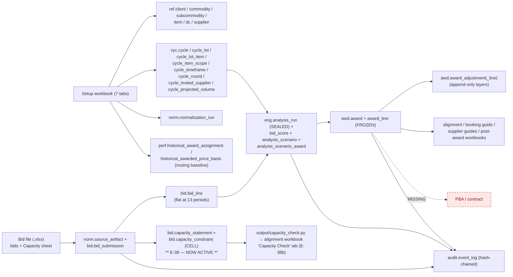

# As-Built Specification — Kroger Produce RFP Platform

> **This is the As-Built Specification: the single authoritative source of truth for what the system
> IS.** The codebase, prompts, workflows, templates, agents, reports, and other docs reconcile to
> this document. Governance rule (`08_RELEASE_GOVERNANCE.md`): **no sprint is complete until this
> specification is updated.** Current-state sections (Parts I–II) describe production reality;
> planned work lives **only** in the Backlog Registry (§20) and Future Roadmap (§21).

A faithful, **code-verified** snapshot of the **RFP lifecycle as actually implemented today** — *every
gate, every loop, every write-point, every table, every endpoint, and how data is mapped*. Every claim
is traced to source (`backend/app/...`, `file:line`). The design intent is a **stacked** audit: each
row aligns multiple layers (system + human + screen + persistence + exposure) so **break-points are
visible**. **Part I** (§1–§13) is the narrative + UX/UI map; **Part II** (§14–§21) is the reference
catalog; the **Appendix** is the versioned change log (the delta history).

> **Verification basis (v1.19):** rebuilt from three independent, read-only, file:line-traced sweeps
> (lifecycle/UX · data/schema · runtime/API/gaps) over `e28f57f` — the **source code-verified sweep basis** —
> cross-checked against each other and against `db/baseline/schema.sql` + migrations `0001–0018`. Stale
> v1.18 line refs corrected. **Commit distinction:** SOURCE was code-verified at `e28f57f`; this SPEC
> document is committed **later on the same branch** (`claude/wizardly-pasteur-n4acb8`); the source/doc
> trees outside this doc (07) + DESIGN_BRIEF match `e28f57f`'s parent.

> **Reading order:** the [Executive summary](#executive-summary) gives the headline + the gap register; the [flowchart](#1-end-to-end-lifecycle-flowchart) is the one-page picture; everything after is the evidence.

---

## Executive summary

### Platform maturity snapshot — read this first

Status vocabulary (D39): ✅ **Operational** · 🟡 **Partial** (built, not fully wired) · 🟠 **Defined but Unenforced** · 🔴 **Critical gap** · ⬜ **Missing**.

| Domain | Status |
|---|---|
| Bid intake (strict + flexible, key-validated + quarantine) | ✅ Operational |
| **Supplier capacity intake (E-38)** | ✅ Operational (file) — Capacity sheet ingested + persisted; allocation-vs-capacity now surfaced as the alignment-workbook **Capacity Check** tab (E-38b, G-G closed v1.20). In-app read endpoint/dashboard deferred (E-38c, Category C). |
| Analysis engine (5-factor scoring) | ✅ Operational |
| Scenario generation (7 lenses A–G) | ✅ Operational |
| Award freezing + immutability | ✅ Operational |
| Post-award versioning (layers) | ✅ Operational |
| Document generation (workbooks) | ✅ Operational |
| Supplier comms (email drafts, E-37) | 🟡 Partial — deterministic template-merge, draft-only HTTP reads (award · feedback · non-selection); **no send, no draft-review UI** (gap **G-H**); invite/template/incomplete-bid/PBA gated on data |
| Web console (UI) | 🟡 Partial — dashboard, run detail, intake, **alignment/scenario/freeze**, **awards (view + record adjustment)** all wired; **the alignment screen surfaces only a slice of the Excel alignment workbench** (gap **G-I**); sign-off, close-out, documents, comms-review, capacity surfaces still missing |
| Reproducible / sealed runs + per-run isolation | ✅ Operational |
| Flat-13 period model | ✅ Operational (G-A closed v1.6) |
| **Audit provenance (decision trail)** | ✅ Operational — **decision** audit chain operational (ingest/seal/freeze/supersede/adjustment chained in-txn; **G-B closed v1.4**); the **FULL write-point chain is NOT** — setup ingest and capacity ingest emit **no event**. Sign-off/send events land with G-D/E-24. |
| RBAC enforcement | 🟠 Defined, not enforced (G-C) — **zero routes call `require_permission`** |
| Sign-off workflow | ⬜ Not implemented (G-D) |
| Contract generation (PBA) | ⬜ Not implemented (G-F) |
| External feeds / supplier import | ⬜ Not implemented (E-08/E-09/E-34) |

**What works end to end** (`PilotService` + MCP harness): start run → setup ingest → bid template → bid intake (strict + flexible) **+ capacity ingest** → V3 engine (5-factor scoring, 7 lenses A–G, split allocation) → human-selected award freeze → versioned post-award layers → generated workbooks (alignment, booking guide, per-supplier guides, post-award) → close-out (archive→purge). Sealed runs + frozen awards are immutability-guarded; per-run isolated DBs at the MCP runtime.

### Gap register (description · severity · impact · recommended action · status)

| # | Gap | Severity | Impact | Recommended action | Owner | Status |
|---|---|---|---|---|---|---|
| **G-A** | Flat-13 period fan-out wired into intake | 🟠 Material | bids stored flat at 13 periods; engine output byte-identical | D35/D38 | — | ✅ **Closed v1.6** (`service.py:1402,1412-1444`) |
| **G-B** | Audit hash-chain now covers decisions | 🔴 Critical | bid→seal→freeze→adjust is tamper-evident + recomputable | E-05 | — | ✅ **Closed v1.4** (emits `service.py:486/1349/1418`, `awd/service.py:156/245`; `tests/audit/test_decision_events.py`) |
| **G-C** | RBAC defined but **not enforced** — no route calls `require_permission` (`rbac.py:131`, referenced only at `api/deps.py:10`); dev principal holds all roles (`main.py:34-47`) | 🟠 Material | author≠approver, freeze/import/adjust not gated | E-03 — add `Depends(require_permission(...))`; real principals | Ed (sponsor — accepted, Phase 1) | 🔴 Open |
| **G-D** | Sign-off decorative — unused permission + workbook tab; no transition/state/gate; `SIGNED_OFF` never emitted | 🟠 Material | no portfolio sign-off step | E-22 | Ed (sponsor — accepted, Phase 1) | 🔴 Open |
| **G-E** | HTTP API mostly wired; **`documents` router empty** (0 routes); draft→SENT absent | 🟠 Material | console runs/compares/freezes/views/adjusts/drafts; doc-gen/send surface missing | E-25 remainder + E-24 | Ed (sponsor — accepted, Phase 1) | 🟡 Partial |
| **G-F** | PBA/contract absent; feeds (`ingest` router empty); supplier importer; deck/letter/send path absent | 🟠 Material | post-award final step + supplier-master intake missing | E-33, E-34, E-08/09, E-24 | Ed (sponsor — accepted, Phase 1) | 🔴 Open |
| **G-G** *(new v1.19)* | **E-38 capacity check now surfaced** — `evaluate_capacity`/`load_active_capacity` (`output/capacity_check.py`) are wired into the alignment workbook via `scenario_workbook._gather_capacity_check` + `_write_capacity_check_tab` (c362f6c), rendering a **Capacity Check** tab (allocation vs stated period/weekly ceiling; OVER CAPACITY flagged) | 🟠 Material | the "never recommend beyond stated capacity" safety check is surfaced in the alignment workbook's Capacity Check tab; residual is the in-app read endpoint/screen (E-38c) | E-38b shipped (workbook surface); residual in-app surface = E-38c (deferred, Category C) | Build (Phase 1 / Live-Run) | ✅ **Closed v1.20 (workbook)** |
| **G-H** *(new v1.19)* | **Comms no-send / no draft-review UI** — drafts render on GET only; 4 of 7 touchpoints (invite/template/incomplete-bid/PBA) still data-gated | 🟠 Material | comms are read-only; no provenance for outward sends | E-37 remainder + E-24 (couples to G-D) | Build (Phase 1 / Live-Run) | 🔴 Open |
| **G-I** *(new v1.19)* | **Web alignment screen ≠ alignment workbook** — the screen surfaces the 7-lens compare + cell detail + freeze, but the workbook's analytical workbench (Supplier Comparison centerpiece, Custom Scenario builder, drill-downs, Lowest-Cost Check, Coverage, Detailed Scoring, Landed & Hidden Costs, Incumbent Retention, Share & Relationships, Negotiation Dynamics, Data-pivot) is **Excel-only** | 🟠 Material | the deep alignment/comparison experience is relegated to the output file; the screen is a thin slice | **first-draft design targets this** (`project/design/first_draft/` + `DESIGN_REVIEW.md`); scoped as **E-41** (Category C — Phase-4) | Build (Phase 1 / Live-Run) | 🔴 Open |
| **G-J** *(new v1.20 — tenancy)* | **Tenancy under-documented** — `auth.app_user` has no tenant/role field, and the run/vault listing is **not tenant-scoped** | 🟠 Material | acceptable for the single-operator Phase 1, but a real gap for multi-tenant (no per-user tenant/role; cross-tenant run visibility) | defer to multi-tenant work (Category C); add tenant/role to `auth.app_user` + tenant-scope the run/vault listing | Ed (sponsor — accepted, Phase 1) | 🔴 Open |

---

# Part I — As-Built Narrative & UX Map

## 1. End-to-end lifecycle flowchart

Gates are diamonds; colour = status. **Green = enforced · Amber (dashed) = aspirational (defined, not wired) · Red (dashed) = missing · Blue = built process step.**

```mermaid
flowchart TD
    classDef enforced fill:#e6f4ea,stroke:#137333,color:#0d652d;
    classDef aspirational fill:#fef7e0,stroke:#b06000,color:#7a4f01,stroke-dasharray:4 3;
    classDef missing fill:#fce8e6,stroke:#c5221f,color:#a50e0e,stroke-dasharray:5 4;
    classDef built fill:#e8f0fe,stroke:#1a73e8,color:#174ea6;

    A(["Start run / kickoff<br/>FS scaffold + isolated DB<br/>(service.py:175)"]):::built --> G0{"In-gate G12<br/>open on real data"}:::aspirational
    G0 --> B["Setup ingest → cycle (once-per-run)<br/>ref.* / cyc.* / perf.* / norm.*<br/>(service.py:206 → setup_ingest.py:425-693)"]:::built
    B --> C["Generate bid template (round n)<br/>3 sheets incl. Capacity<br/>(service.py:295)"]:::built
    C --> D["Bid intake"]:::built
    D -->|"strict (our template)"| INGEST["ingest_bids (service.py:321)<br/>→ ingest_template + ingest_capacity"]:::built
    D -->|"flexible (messy file)"| P{"Mapping proposal<br/>propose → confirm<br/>(service.py:389)"}:::enforced
    P -->|"confirm"| INGEST
    INGEST --> KEYVAL{"Key validation / quarantine<br/>bids + capacity<br/>(bid_ingester.py:371, :645)"}:::enforced
    KEYVAL --> E["bid.bid_line (flat at 13 periods)<br/>+ bid.capacity_statement/constraint (E-38)<br/>(service.py:1272 _persist_bid_lines)"]:::built
    E --> F["Engine run_round → SEAL eng.*<br/>5-factor scores + 7 lenses A-G<br/>(service.py:429 → runner.py:155)"]:::built
    F -->|"re-run alignment (new sealed version)"| F
    F --> SEALSEAL{"Run seal (immutability guard)"}:::enforced
    SEALSEAL --> GRC{"Round close gate<br/>is_final set, never enforced"}:::aspirational
    GRC -->|"more rounds → next round"| C
    GRC -->|"final round"| H["Human selects scenario<br/>(Scenario B = default)"]:::built
    H --> I["Freeze award → awd.award FROZEN<br/>(service.py:576 → awd/service.py:125)"]:::built
    I --> FRZ{"Freeze seal (immutability guard)"}:::enforced
    FRZ --> J{"Sign-off gate"}:::missing
    J --> K["Outputs: booking guide + per-supplier guides<br/>(service.py:578-600)"]:::built
    K --> CAPCHK["Capacity check → alignment workbook 'Capacity Check' tab (E-38b)<br/>(capacity_check.py:87/154)"]:::built
    CAPCHK --> COMMS["E-37 comms drafts (draft-only HTTP reads)<br/>award · feedback · rejection<br/>(runs.py:754/788/823)"]:::built
    COMMS --> SENT{"Draft → SENT"}:::missing
    SENT --> L["Post-award adjustments<br/>append-only layers v1..vN<br/>(service.py:612 → awd/service.py:175)"]:::built
    L -->|"reprice loop"| L
    L --> PBA["PBA / contract builder"]:::missing
    PBA --> M(["Close-out: archive → confirm → purge<br/>(service.py:1022 / 1032)"]):::built
```

## 2. Stage-by-stage — system layer + human layer (STACKED)

Persists key: **V**=vault git commit · **S**=run-DB snapshot (MCP runtime only) · **A**=audit event. Screen: built ✅ / partial ◐ / missing ⬜.

| Stage | System: method (file:line) → tables written | Persists | Exposure | Human: actor → screen → action |
|---|---|:--:|---|---|
| Start run | `start_run` (service.py:175) → FS scaffold + isolated DB | V·S | HTTP `POST /runs` (runs.py:299) · MCP `run_start` (:171) | Analyst → **Dashboard ✅** → "New run" |
| Setup ingest → cycle | `ingest_setup` (service.py:206) → `ingest_setup_workbook` (setup_ingest.py:425-693) → `ref.*`, `cyc.*`, `perf.*`, `norm.normalization_run`. **Once-per-run** (service.py:220): a 2nd ingest is refused (409 conflict) — `cycle_id.txt` is never overwritten, so the prior cycle is never orphaned. | V·S | HTTP `POST /runs/{slug}/setup` (runs.py:395) · MCP `setup_ingest` (:235) | Analyst → **Intake ✅** → download kickoff, upload filled |
| Bid template | `generate_bid_template` (service.py:295) → FS `..bid_template.xlsx` (3 sheets incl. **Capacity**) | V | HTTP `POST /runs/{slug}/rounds/{round}/template` (runs.py:424) · MCP `bid_template` (:256) | Buyer → **Intake ✅** → generate + download |
| Bid intake — strict | `ingest_bids` (service.py:321, `actor`-threaded) → `ingest_template` + `ingest_capacity` → `_persist_bid_lines` (service.py:1272): `norm.source_artifact` (`created_by` = actor), `bid.bid_submission`, `bid.bid_line` (fanned to 13 periods) **+ A: IMPORTED/SUPERSEDED** (actor = importing user) | V·S·A | HTTP `POST /bids/import` (bids.py:164) · MCP `ingest_bids` (:270) | Buyer → **Intake ✅** → upload bids |
| Bid intake — flexible | `ingest_any` (service.py:389): `infer_bid_mapping` → proposal; on confirm `apply_mapping` → `ingest_bids` (actor forwarded) | V·S·A | HTTP `POST /bids/import?mode=flexible` (bids.py:164) · MCP `ingest_any` (:285) | Buyer → **Intake ✅** → propose → review mapping → "Confirm & import" |
| **Capacity ingest (E-38)** | `ingest_capacity` (bid_ingester.py:645, key-validated vs `scope.capacity_key_set()`) → persisted in same pass by `_persist_bid_lines` (service.py:1481-1525): `bid.capacity_statement` (1/supplier) + `bid.capacity_constraint` (CELL: dc×lot×tf). Re-send supersedes prior (service.py:1372). Counts surfaced in NOTES. **No A event.** | V·S | **No own route/tool** — rides `POST /bids/import` + MCP `ingest_bids`/`ingest_any` | Buyer → **Intake ✅** (same upload) → capacity sheet ingests automatically. **No capacity screen ⬜** |
| Engine run / scenarios | `run_round` (service.py:429, `actor`-threaded → `run_by`) → `EngineRunner.run_analysis` (runner.py:155) → `eng.analysis_run` (sealed, hashed manifests), `eng.bid_score` (:377), `eng.analysis_scenario` (:411), `eng.analysis_scenario_award` (:436). **+ A: SEALED** (service.py:486, actor = running user). Writes versioned alignment workbook. | V·S·A | HTTP `POST …/rounds/{round}/analysis` (runs.py:457) + reads `GET …/analysis`, `…/scenarios`, `…/scenarios/{code}` (runs.py:500/521/544) · MCP `run_round` (:322) | Buyer → **Alignment ✅** → run analysis, compare 7 lenses (B pre-selected), inspect cell-by-cell. **Deep workbench is Excel-only (G-I).** |
| Award freeze | `freeze_award` (service.py:576) → `awd_service.freeze_award` (awd/service.py:66; `Award` :125, `AwardLine` :140) FROZEN. **+ A: FROZEN** (awd/service.py:156). Writes booking + per-supplier guides + individual files (service.py:610-632). Idempotent on (cycle, run, scenario). | V·S·A | HTTP `POST …/awards/freeze` (runs.py:576) · MCP `select_award` (:343) | Buyer/Approver → **Alignment ✅** (FreezeAwardModal) → freeze a chosen lens (actor = authenticated user) |
| Sign-off | — *(decorative: unused permission + workbook tab; no transition/state; `SIGNED_OFF` never emitted)* | — | — | Approver → **Sign-off screen ⬜** |
| Outputs (incl. E-37 comms) | Guides within `freeze_award`; post-award doc within `record_adjustment`. **E-37 comms** = deterministic template-merge, rendered on GET, never persisted/sent: `award_email_drafts` (service.py:1630), `feedback_email_drafts` (:1674), `rejection_email_drafts` (:1700) | V | Files: `GET …/files`, `…/files/{name}`, `…/archive`. Comms: `GET …/awards/{id}/comms/award` (:754), `…/comms/rejection` (:788), `…/analysis/{id}/comms/feedback` (:823). **`documents.py` empty.** | Buyer → **Outputs/Downloads ◐** (file list + zip). **No comms-draft review UI ⬜** |
| Post-award adjustments | `record_adjustment` (service.py:612) → `awd_service.add_adjustment` (awd/service.py:175; `AwardAdjustment` :206, `AwardAdjustmentLine` :223). **+ A: CREATED** (awd/service.py:245). Off-award + duplicate-cell validated at route. Append-only v1..N. | V·S·A | HTTP `POST …/awards/{id}/adjustments` (runs.py:668) · MCP `record_adjustment` (:373) | Buyer → **Awards ✅** (RecordAdjustmentModal) → pick cells → new $/case → type/date/reason → submit |
| History / versions | `list_awards` (service.py:1609), `award_detail` (:1620) over `awd/read.py` | — | HTTP `GET …/awards` (runs.py:614) + `…/{id}` (runs.py:635) · MCP `history` (:417) | Buyer → **Awards ✅** → frozen baseline + effective $/cell + Δ + version history (v0→vN) |
| Close-out | `close_run` (service.py:1022) → archive zip; `purge_run` (service.py:1032) → drop run DB | V | **MCP only** ⛔ `close_run` (:501) / `purge_run` (:518) | Buyer → **Close-out screen ⬜** |
| PBA / contract | **absent** | — | — | → **Contract builder ⬜** |

**Screens that exist today** (7 page routes; 7 screenshots in `/screenshots`): **Login + 2FA ✅** (`login/page.tsx`), **Dashboard / runs list ✅** (`(app)/page.tsx`), **Run detail / kanban ◐** (view + nav + zip only), **Bid intake ✅** (`intake/page.tsx`), **Alignment / scenario / freeze ✅** (`alignment/page.tsx` — 4 panels: AnalysisRunsPanel, ScenarioComparisonTable, ScenarioDetailPanel, FreezeAwardModal), **Awards / post-award ✅** (`awards/page.tsx` + RecordAdjustmentModal). **No UI** for: comms drafts (E-37), capacity (E-38), sign-off, close-out, documents — confirmed by repo-wide grep (zero `comms`/`capacity`/`signoff`/`closeout` in `frontend/`).

## 3. Data flow & write-points

**Every governed write is `add`/`execute` + `flush` inside the caller's unit of work — never an internal commit** (`core/db/session.py:43-59`: yield → `commit()` on success, `rollback()` on any exception, always `close()`); the vault git commit + DB snapshot happen *after* it closes.

| Write point | file:line | Tables | Scoping |
|---|---|---|---|
| Cycle creation (setup ingest) | `setup_ingest.py:425,436,448,462,501,529,544,563,570,585,598,616,626,638,658,668,690` | `ref.client/commodity/subcommodity/dc/supplier/item`, `cyc.cycle/cycle_lot/cycle_item_scope/cycle_lot_item/cycle_timeframe/cycle_round/cycle_invited_supplier/cycle_projected_volume`, `norm.normalization_run`, `perf.historical_award_assignment/awarded_price_basis` | `cycle_id` on all cyc/perf; `ref.dc`/`ref.supplier` reused by natural key (D36); `ref.item` per-RFP |
| Bid lines | `service.py:1347` (artifact), `:1365` (submission), `:1415` (`BidLine`), `:1294/:1328` (supersede UPDATE) | `norm.source_artifact`, `bid.bid_submission`, `bid.bid_line` | every row carries `cycle_id`+`round_id`+`supplier_id`; each priced line fanned to one row per fiscal period (`fiscal_period_id`, D38); `count` is logical lines |
| **Stated capacity (E-38, ACTIVE)** | `service.py:1459` (`CapacityStatement`), `:1477` (`CapacityConstraint`), `:1338` (supersede UPDATE) | **`bid.capacity_statement`, `bid.capacity_constraint`** | one statement/supplier/round on the SAME `submission_id`+`source_artifact_id` as that supplier's bids; one CELL constraint per stated dc×lot×tf; prior → SUPERSEDED. Runs on strict + flexible intake |
| Engine seal | `runner.py:155` (`AnalysisRun`), `:377` (`BidScore`), `:411` (`AnalysisScenario`), `:436` (`AnalysisScenarioAward`) | `eng.analysis_run`, `eng.bid_score`, `eng.analysis_scenario`, `eng.analysis_scenario_award` | `cycle_id`+`round_id`; children FK to run/scenario; `is_sealed=true`, hashed in/out manifests |
| Award freeze | `awd/service.py:125` (`Award`), `:140` (`AwardLine`) | `awd.award`, `awd.award_line` | idempotent on `cycle_id`+`analysis_run_id`+`scenario_code` |
| Post-award layer | `awd/service.py:206` (`AwardAdjustment`), `:223` (`AwardAdjustmentLine`) | `awd.award_adjustment`, `awd.award_adjustment_line` | `version_no` = max+1; append-only |
| Audit (decision events, in-txn) | `service.py:1349` (SUPERSEDED), `:1418` (IMPORTED), `:486` (SEALED); `awd/service.py:156` (FROZEN), `:245` (CREATED); writer `core/audit/writer.py:134` | `audit.event_log` | per-tenant `client_id`+`seq` (`FOR UPDATE`); tenant resolved cycle/award→commodity→client (`recorder.py:20,40`); **raises if unresolvable** |
| Auth user (out-of-band) | `auth/create_user.py:27` | `auth.app_user` | bootstrap/CLI helper; read at `auth/deps.py:54` |

## 4. System-of-Record hierarchy

> **The rule.** Every business artifact has **exactly one authoritative store**. Every other representation — a generated Excel, a JSON export, a printout — is a **render** at a point in time, never a source. **If a generated document and its governed record disagree, the record (Postgres) wins.**

| Business artifact | System of record (authoritative) | Renders (subordinate) |
|---|---|---|
| Cycle / RFP definition + scope | `cyc.cycle` + `cyc.cycle_*` | setup workbook (input), `run_data.json` |
| Reference master (DC/supplier/item/commodity) | `ref.dc` / `ref.supplier` / `ref.item` / `ref.commodity` | setup workbook tabs |
| Supplier bid | `bid.bid_line` (+ `bid.bid_submission`) | uploaded bid workbook, normalized workbook |
| **Stated capacity (E-38)** | **`bid.capacity_statement` + `bid.capacity_constraint`** | the returned Capacity sheet (input); the capacity-check evaluator (tested render, not yet wired) |
| Analysis / scenarios | `eng.analysis_run` (sealed) + `eng.bid_score` / `analysis_scenario` / `analysis_scenario_award` | alignment workbook, comms drafts |
| Award decision | `awd.award` + `awd.award_line` (FROZEN) | booking guide, per-supplier guides |
| Post-award changes | `awd.award_adjustment(_line)` (append-only) | post-award workbook |
| Provenance / who-did-what-when | `audit.event_log` (hash-chained; G-B closed v1.4) | git history + `run_data.json` (corroborating) |
| Generated document (the file) | vault filesystem (git-versioned) | — (authoritative for the artifact, not the values inside) |
| Web-console user identity | `auth.app_user` | — |
| Official contract | **PBA — future (E-33)** | — |

## 5. Failure domains

Two structural facts shape every blast radius: **(a)** every governed write is `add`/`execute`+`flush` inside the caller's unit of work — never an internal commit (`core/db/session.py:43`) — so a failure mid-stage **rolls the whole stage back atomically** (no partial/corrupt state; the decision's audit event rolls back with it); **(b)** vault git commit/push failures are **deliberately swallowed** (D34 — git is a convenience, never a blocker).

| Failure | Blast radius | Load-bearing? | Recovery |
|---|---|---|---|
| Bid intake (`ingest_bids`/`ingest_any`) | round can't take bids → supplier blocked; incl. capacity not loaded | Operational-blocking | UoW rollback; re-upload; supersede prevents double-count on retry |
| Engine (`run_round`) | no sealed run/scenarios → award can't proceed | Operational-blocking | UoW rollback; SEALED atomic with run (no orphan); re-run = new sealed version |
| Award freeze | no official award producible | **Governance-critical** | UoW rollback; reads-first-refuses-empty (no zero-line award/spurious event); idempotent → safe retry |
| Workbook generation | a document isn't produced; data intact + re-renderable | **Convenience** | re-run generator; DB authoritative |
| Audit writer (`AuditWriter.append`) | a decision's provenance event isn't recorded | **Governance-critical** — atomic with its decision (G-B); a writer failure rolls back the decision | UoW rollback; chain verified (`tests/audit/test_decision_events.py`) |
| Vault commit / push | document + run-state not persisted off-box | Provenance/recovery (DB still authoritative) | swallowed (D34); `RFP_VAULT_AUTOPUSH` retries |
| **DB drop mid-transaction** | the in-flight stage never commits | Availability | UoW `rollback()` on the exception (`session.py:55-57`); `pool_pre_ping=True` swaps dead connections; MCP runtime rehydrates from the last committed **vault DB snapshot** (`snapshot_run`/`rehydrate_runs`, D30/D32) |

## 6. Gates — enforced vs aspirational vs missing

| Gate | Status | Where (file:line) |
|---|---|---|
| Award-select is **human, not engine** | ✅ enforced structurally | `freeze_award` requires explicit run+scenario+award_code (service.py:576; runs.py:576); engine never auto-freezes |
| Engine **decision-support language** guard | ✅ enforced | `assert_decision_support` on every scenario label/desc (engine/guards.py:41; v3.py:185) |
| **Frozen award** immutability | ✅ enforced (app-layer) | `block_update_if_frozen`/`block_delete_governed` (core/audit/guards.py:56/45), registered main.py:62 |
| **Sealed analysis-run** immutability | ✅ enforced (app-layer) | core/audit/guards.py:34/45, registered main.py:62 |
| Bid **key validation / quarantine** | ✅ enforced | bid_ingester.py:371; MISSING_KEY/UNKNOWN_KEY/KEY_MISMATCH (bid_ingester.py:75-77) |
| **Capacity key validation / quarantine** (E-38) | ✅ enforced | `ingest_capacity`/`_parse_capacity_row` (bid_ingester.py:645/692); keys vs `scope.capacity_key_set()`; negative-max → BAD_NUMERIC; blank sheet tolerated |
| **Double-subtract** price guard | ✅ enforced (app + DB CHECK) | bid_ingester.py:288-302; DB `ck_bid_line_no_double_discount` (migration 0007:57-66) |
| Premium-ceiling / coverage-floor eligibility | ✅ enforced (engine-internal) | `GATE_PREMIUM` scoring.py:320, `GATE_COVERAGE` scoring.py:325; per-cycle overrides service.py:534-537 |
| Propose→confirm before flexible write | ✅ enforced | `ingest_any` returns proposal unless confirm (service.py:385) |
| **Capacity check** (allocation vs stated ceiling) | ✅ **surfaced (workbook)** — over-capacity flagged in the alignment workbook's Capacity Check tab (E-38b); advisory, never blocks | `scenario_workbook._gather_capacity_check` calls `evaluate_capacity` (capacity_check.py:87) + `load_active_capacity` (:154); rendered by `_write_capacity_check_tab` |
| Concentration / max-suppliers-per-DC | ⚠️ **advisory flag only** — never blocks | `cap_breach_flag` (v3.py:282); category-concentration (v3.py:113) |
| Tenant scoping | ✅ at the edge (no per-query RLS) | principal-derived; commodity create stamps `client_id` (ref/service.py:46) |
| **RBAC separation of duties** | ❌ defined, **not enforced (G-C)** | matrix `ROLE_PERMISSIONS`+`require_permission` (rbac.py:64/131); **0 routes apply it** |
| **In-gate G12** | ❌ aspirational | `GATE_APPROVED` (events.py:26) never emitted |
| **Round close** | ❌ aspirational | rounds created OPEN, `is_final` set, never transitioned (setup_ingest.py:616) |
| **Sign-off** | ❌ missing (G-D) | unused permission + tab; `SIGNED_OFF` never emitted |
| **Draft → SENT** | ❌ missing (G-E/E-24) | `SENT` never emitted; `documents.py` empty |

## 7. Loops

| Loop | Where (file:line) | Bound / exit |
|---|---|---|
| Round loop R1..Rn | external repeat per `round_no`; rounds at setup (setup_ingest.py:612-617) | round_count **2..6**; no auto-advance, no enforced final-round close |
| Propose→confirm intake | `ingest_any` (service.py:389); `infer_bid_mapping`/`apply_mapping` (flex_ingest.py:153/268) | exits on buyer `confirm=True`; ambiguities surfaced, never guessed |
| Resubmit / supersede (bids) | `_submission_for` (service.py:1273); prior lines `is_scoreable=false` (:1294), submission → SUPERSEDED (:1326) + event (:1313) | one scoreable submission per (cycle, round, supplier) |
| Resubmit / supersede (capacity, E-38) | prior `bid.capacity_statement` → SUPERSEDED (service.py:1336-1343) | latest statement only; append-only (status flip, rows retained) |
| Alignment re-run | `run_round` repeatable; new sealed version (`_run_version_seq` service.py:1771) | unbounded; every run sealed + immutable |
| Post-award reprice | `record_adjustment` (service.py:612) → `version_no = max+1` (awd/service.py:195) | unbounded, append-only over frozen v0 |
| Close-out present→confirm→purge | `close_run` → `purge_run` (service.py:1022/1032) | terminal; archive retained, run DB dropped |

There is **no optimisation loop inside the engine** — `run_analysis` is single-pass, deterministic, with hashed input/output manifests (runner.py:150-155).

## 8. Audit / event-log status (G-B detail)

Mechanics (`core/audit/writer.py`): `prev_event_hash → event_hash = sha256(canonical(fields) ‖ prev)` (`compute_event_hash:46-79`), per-tenant `seq` `FOR UPDATE` (:95-104), genesis = 64 zeros, appended in the caller's txn — **no internal commit** (:106-111). Tenant resolved cycle→commodity→`client_id` / award→cycle→commodity (`recorder.py:20,40`); unresolvable tenant **raises**. **8 EventTypes defined** (events.py:20-27).

| Event | Fires at (file:line) | In-txn? | Notes |
|---|---|---|---|
| `IMPORTED` | service.py:1418 (in `_persist_bid_lines`) | ✅ | one per new `bid.bid_submission`; actor = importing user (HTTP `user.username`) / `pilot` (MCP) |
| `SUPERSEDED` | service.py:1349 | ✅ | one per prior submission, before the status flip; actor as IMPORTED |
| `SEALED` | service.py:486 (in `run_round`) | ✅ | engine seal; actor = running user (HTTP `user.username`) / `pilot-runner` (MCP) |
| `FROZEN` | awd/service.py:156 | ✅ (after flush :152) | actor = `frozen_by` (authenticated user) |
| `CREATED` | awd/service.py:245 (in `add_adjustment`) | ✅ (after flush :236) | post-award layer |
| `CREATED` (commodity) | ref/service.py:53 | ✅ | tenant-root commodity create |
| `SIGNED_OFF` | — | ⬜ unwired | feature absent (G-D) |
| `SENT` | — | ⬜ unwired | feature absent (E-24) |
| `GATE_APPROVED` | — | ⬜ unwired | G12 in-gate absent (E-17) |

**Decision audit chain operational** (ingest/seal/freeze/supersede/adjustment) ✅ (G-B closed v1.4; `tests/audit/test_decision_events.py`). **Actor fidelity:** all five decision events now record the *authenticated* operator — the HTTP path threads `user.username` through `ingest_bids`/`run_round`/`freeze_award`/`record_adjustment`, the MCP harness (no web auth) keeps the `pilot`/`pilot-runner` defaults; the importing user is also stamped on `norm.source_artifact.created_by` (`test_actor_threads_to_audit_events`). **The FULL write-point chain is NOT** — setup ingest (cycle creation) emits **no** event, and capacity ingest emits **no** event. Provenance of decisions = the hash-chain; provenance of cycle/capacity creation = the immutable rows + git + `run_data.json`.

## 9. Built · partial · missing (gap analysis → backlog)

**Built (working):** vault + per-run isolated DB + snapshot/rehydrate · setup ingest → cycle/scope · bid template · strict+flexible intake w/ quarantine · flat-13 storage (G-A) · V3 engine (5 factors, gates, 7 lenses, split, sealed runs) · award freeze + append-only layers · alignment/booking/supplier/post-award workbooks · immutability guards · decision audit events (G-B) · MCP 17-tool surface · web: auth+2FA, dashboard, run detail, bid intake, **alignment screen, awards screen (read + adjustment form)**, comms draft reads · **E-38 capacity ingest+persist** (`bid.capacity_statement`/`capacity_constraint`) + pure evaluator (`output/capacity_check.py`) · capacity check surfaced in the alignment workbook (Capacity Check tab, E-38b).

**Partial / inert:** RBAC matrix defined, no route enforces (G-C) · `documents` router empty (G-E) · comms draft-only/no-send (G-H) · **web alignment screen ≠ alignment workbook (G-I)** · `is_awardable` set unconditionally `True` at ingest (service.py:1441) — no awardability logic · DB-level immutability triggers/RLS absent.

**Missing:** PBA/contract (E-33) · supplier importer / feeds (E-34, E-08/09 — `ingest` router empty) · send/draft→SENT (E-24) · sign-off transition (E-22) · in-gate G12 / round-close (E-17/E-16).

## 10. Known issues queued (fix after this review)

1. **Intake soft-gating keys off output files** — a returning user gets template/import re-locked until outputs exist; derive "done" from cycle/template state. *(intake/page.tsx)*
2. **Template section shows only `kind:"output"`** — the generated template is in `inputs/`, so its download table stays empty after "Generate". *(TemplateSection.tsx)* — partly mitigated by `resolve_round_id` (pilot_common.py:54); verify the FE still routes the two error codes.
3. **`is_awardable` unconditionally `True` at ingest** (service.py:1441) — no awardability logic yet (latent).

## 11. Build authorization → governed by `08_RELEASE_GOVERNANCE.md`

What may be built and when is governed by `08_RELEASE_GOVERNANCE.md` (default-to-backlog; A/B/C classification; the 7 phases; current phase = **Phase 1, pre–Live Run #1**). This document is current-state only; it does not authorize work. Approved Phase-1 build: the **E-38 capacity accuracy-core** (slice 2b — the workbook Capacity Check tab — shipped v1.20; the in-app surface is E-38c, deferred).

## 12. Governance — triggers, questions, and the release gate

This audit is a **living model of reality**: it documents the system **as actually implemented**. If implementation and this document disagree, **implementation is reviewed and the audit is corrected to match reality** (D39; release-gate policy D37; operationalized in `02_WAYS_OF_WORKING` §8 + Definition of Done).

### 12.1 Trigger conditions (re-audit on change, scoped to what changed)

| Category | Triggering change | Audit scope |
|---|---|---|
| **Workflow** | New stage · transition · approval · human interaction · automation | §1–§2 |
| **Persistence** | New table · file output · storage location · write path · SoR | §3–§4 |
| **Runtime** | New service · MCP tool · agent · orchestrator · execution boundary · integration | §13 |
| **Security & governance** | New role · permission/RBAC · approval · audit-logging change | §6, §8 |
| **User experience** | New screen · workflow surface · operator action · user-visible state | §2 human layer |
| **Architecture** | New subsystem · dependency · runtime · deployment model | Full audit |
| **Major version / rollout** | New major version · pre-/post-production rollout | Full audit |

### 12.2 The questions every re-run must answer

1. **How does the system actually work?** (§1 flowchart, §2 stages)
2. **Where is information written?** (§3 data flow, §4 SoR)
3. **Who can read / write / approve it?** (§6 gates, §2 human layer, RBAC/G-C)
4. **What must be visible to operators?** (§2 human/UX, §13 trust boundaries)
5. **What can fail?** (§5 failure domains)
6. **Where are the gaps between design and implementation?** (gap register, §9)

The objective: any future developer/operator/auditor/stakeholder can answer *how it works · where the data is · who can change it · what can fail · what changed since last version* **without reading source code**.

### 12.3 Release gate — a major version is not complete until

Implementation complete · review complete · this audit updated · gap register updated · critical findings reviewed. The gate yields: ✅ **PASS** (audit reflects implementation; no critical control missing) · 🟡 **CONDITIONAL** (known risks documented + explicitly accepted in the gap register with an owner) · 🔴 **FAIL** (audit doesn't reflect implementation, or a critical control is missing — do not ship).

**Current release-gate read (v1.20):** 🟡 **CONDITIONAL** — the audit now reflects implementation, and the open gaps (G-C/D/E/F/H/I and G-J) are documented + owner-assigned. Not ✅ because G-C (RBAC) leaves freeze/adjust/import un-gated.

### 12.4 Pre-merge audit-impact review

On **every** change (now **agent self-review** at each control point; Codex retired — see `08` Review cadence), verify whether it affects: **workflow · state transitions · persistence · runtime boundaries · permissions · governance · auditability · user-visible behavior · failure domains**. If **any** is **yes**, this doc (and the gap register) **must be updated before merge** — the audit moves with the code.

## 13. Runtime boundaries & trust boundaries

Two runtimes wrap the **same** `PilotService`; the unit of work owns the transaction (services `add+flush`, never an internal commit).

| Boundary | What it is | Isolation / trust |
|---|---|---|
| **Web console API** (FastAPI, `app/api`) | Browser surface: auth+2FA, dashboard, run detail, intake, alignment/compare/freeze, frozen-award read, post-award adjustment write, comms draft reads (E-37). Gaps: `documents` empty (G-E), sign-off/send (G-D/E-24). | **Shared** app DB (`isolate_db=False`); **DB is the SOLE store — writes NO files** (ADR-0018, E-42 done): run identity in `pilot.run` (`db_runs=True`), deliverables render on request (`persist_outputs=False`, `app/pilot/deliverables.py`), uploads stream to ingest (`ingest_*_bytes`); auth at edge (`get_current_user` auth/deps.py:28); **no per-query RLS, no `require_permission` on any route (G-C)** |
| **MCP harness** (`PilotService`, `isolate_db=True`) | Full-lifecycle execution surface (`rfp_mcp/rfp_pilot_server.py`). **Live-run VERIFICATION ORACLE** — kept file-based on purpose so its engine/analysis files cross-check the manual work + the app (same engine + E-39 → identical analysis on identical inputs). | Each run gets its **own DB** `kr_rfp_run_<slug>` (D30); snapshot/rehydrate to vault git; defaults `db_runs=False, persist_outputs=True` (file vault retained) |
| **Engine** (`app/engine`, clean-room v3) | Deterministic single-pass scoring/allocation. **Not an agent; no optimisation loop; no autonomy.** | **Purity boundary**: stdlib + `Decimal` only; `app/domain/eng` adapts DB↔engine |
| **Immutability guards** | Sealed `eng.analysis_run` + frozen `awd.award`. | **App-layer only** — SQLAlchemy listeners (core/audit/guards.py), wired main.py:62; DB triggers/RLS Platform-owned, **not present** |
| **Audit writer** (`AuditWriter`) | Appends hash-chained `audit.event_log`. | **Atomic with the decision** — no internal commit; inherits the decision's rollback (G-B) |
| **Vault filesystem** (git per run) | Generated docs + `run_data.json`, git-versioned. **MCP-harness-only since E-42** — the web console no longer scaffolds or writes a vault. | Persistence **convenience** — commit/push failures swallowed (D34); DB authoritative |

**Agents:** none autonomous at runtime — *AI-generated, not AI-managed*. Comms (E-37) are deterministic template-merge (no model in the loop), rendered on GET, never persisted/sent. **Integrations:** none live (iTrade/KCMS/importer future). **Execution environments:** Postgres 16, Alembic 0001–0018, git vault.

---

# Part II — As-Built Inventories & Registries

*Reference catalog (current state). Code-verified via three read-only sweeps over HEAD `e28f57f`. Planned work is in §20–§21 only.*

## 14. Functional inventory (HTTP surface) — exhaustive

Routers mounted at `app/api/router.py:16-23`. **Live routes: 28** (health 2 · auth 5 · runs 19 · bids 2). **Empty stub routers: 4** (`awards`, `cycles`, `documents`, `ingest` — `APIRouter()` + TODO, zero route decorators). **RBAC (G-C):** `require_permission` (rbac.py:131) is **never wired into a route**; every route below uses bare session auth via `CurrentUser` (auth/deps.py:60) except `/health`, `/ready`, `/auth/login`, `/auth/logout`.

| # | Method · Path | Handler (file:line) | Auth / perm | Validation | What it does |
|---|---|---|---|---|---|
| 1 | `GET /health` | health.py:21 | none | — | liveness |
| 2 | `GET /ready` | health.py:28 | none | — | readiness — `SELECT 1` |
| 3 | `POST /auth/login` | auth.py:105 | none (issues session) | `LoginRequest` | password (+TOTP) → httpOnly `kr_session`; opaque 401 |
| 4 | `POST /auth/logout` | auth.py:135 | none (idempotent) | — | clears cookie, 204 |
| 5 | `GET /auth/me` | auth.py:144 | CurrentUser | — | current user |
| 6 | `POST /auth/2fa/enroll` | auth.py:151 | CurrentUser | — | store TOTP secret; return otpauth URI |
| 7 | `POST /auth/2fa/verify` | auth.py:172 | CurrentUser | `VerifyRequest` | verify → flip `totp_enabled` |
| 8 | `GET /runs` | runs.py:278 | CurrentUser | — | list runs + stage label |
| 9 | `POST /runs` | runs.py:299 | CurrentUser | `CreateRunRequest` | start run (`isolate_db=False`) → `start_run` (service.py:175) |
| 10 | `GET /runs/{slug}` | runs.py:316 | CurrentUser | — | run detail + kanban; 404 unknown |
| 11 | `GET /runs/{slug}/files` | runs.py:334 | CurrentUser | — | list the run's deliverables (**rendered on request from the DB**, E-42); `/files/{name}` + `/archive` likewise stream from the DB, nothing read off disk |
| 12 | `GET /runs/{slug}/files/{name}` | runs.py:345 | CurrentUser | path-traversal guard | stream one run file |
| 13 | `GET /runs/{slug}/archive` | runs.py:367 | CurrentUser | — | zip the run folder |
| 14 | `POST /runs/{slug}/setup` | runs.py:395 | CurrentUser | UploadFile; **once-per-run** (2nd → 409 conflict) | setup workbook → cycle (service.py:206); emits no event |
| 15 | `POST /runs/{slug}/rounds/{round}/template` | runs.py:424 | CurrentUser | round≥1; `resolve_round_id` | generate bid template (service.py:295) |
| 16 | `POST /runs/{slug}/rounds/{round}/analysis` | runs.py:457 | CurrentUser (**no RUN_ENGINE perm**) | round≥1 | seal `eng.*` + alignment workbook (service.py:429); SEALED in-txn (actor = `user.username`) |
| 17 | `GET /runs/{slug}/analysis` | runs.py:500 | CurrentUser | — | list sealed analyses |
| 18 | `GET /runs/{slug}/analysis/{id}/scenarios` | runs.py:521 | CurrentUser | `_ensure_analysis` | compare 7 lenses A–G |
| 19 | `GET /runs/{slug}/analysis/{id}/scenarios/{code}` | runs.py:544 | CurrentUser | bad code → 400 | one lens cell-by-cell |
| 20 | `POST /runs/{slug}/awards/freeze` | runs.py:576 | CurrentUser (**no AWARD_FREEZE perm**) | `FreezeAwardRequest` | freeze lens → FROZEN award (service.py:576); FROZEN in-txn; idempotent |
| 21 | `GET /runs/{slug}/awards` | runs.py:614 | CurrentUser | — | list frozen awards |
| 22 | `GET /runs/{slug}/awards/{id}` | runs.py:635 | CurrentUser | `_has_cycle` else 404 | award detail: baseline + effective + history |
| 23 | `POST /runs/{slug}/awards/{id}/adjustments` | runs.py:668 | CurrentUser (**no perm**) | `RecordAdjustmentRequest`; off-award → 400; dup cell → 400; cross-run → 404 | append post-award layer (service.py:612); CREATED in-txn |
| 24 | `GET /runs/{slug}/awards/{id}/comms/award` | runs.py:754 | CurrentUser | `_has_cycle` else 404 | E-37 award drafts; **draft-only, no send, no DB write** |
| 25 | `GET /runs/{slug}/awards/{id}/comms/rejection` | runs.py:788 | CurrentUser | `_has_cycle` else 404 | E-37 non-selection drafts; draft-only |
| 26 | `GET /runs/{slug}/analysis/{id}/comms/feedback` | runs.py:823 | CurrentUser | `_ensure_analysis` | E-37 round-feedback drafts; draft-only |
| 27 | `POST /bids/import` | bids.py:164 | CurrentUser (**no FEED_IMPORT perm**) | mode∈{strict,flexible}, round≥1, confirm | strict (service.py:321) or flexible propose→confirm (:389); IMPORTED+SUPERSEDED in-txn (actor = `user.username`); persists capacity (:1481-1524) |
| 28 | `GET /bids` | bids.py:215 | CurrentUser | run, round≥1 | list a round's `bid.bid_line` at identity grain (ACTIVE only, DISTINCT ON) |

> **Mount-point note:** the analysis/award/adjustment/comms endpoints (#16–#26) live under the **`runs`** router, not the empty `awards` stub.

## 15. Agent inventory

**No autonomous in-loop AI runs at runtime** (ADR-0006). The only agent surface is the **RFP Pilot MCP server** (`rfp_mcp/rfp_pilot_server.py`) — **17 `@app.tool()` defs**: `run_start` (171), `run_list` (195), `run_status` (206), `setup_template` (219), `setup_ingest` (235), `bid_template` (256), `ingest_bids` (270), `ingest_any` (285), `run_round` (322), `select_award` (343), `record_adjustment` (373), `history` (417), `feedback` (450), `remember` (470), `add_memory` (479), `close_run` (501), `purge_run` (518). Write tools open `run_unit_of_work` (isolated DB) + `snapshot_run`; `history`/`feedback`/`run_status`/`run_list` are read-only; `remember`/`add_memory` are the vault-notes facility. **No recurring scheduler, no background loop.** Engine never auto-freezes; `assert_decision_support` (engine/guards.py:41) RAISES on 12 banned award verbs.

## 16. Data model (persisted state) — every table, status, writer:reader

**Authoritative DDL = `db/baseline/schema.sql` (Alembic 0001) + migrations 0002–0018.** Live schema = **86 tables** (64 baseline + 22 migration-added) + 1 view (`perf.v_itrade_actual_paid_baseline`, dormant). *(The baseline file header says "63" but contains 64 `CREATE TABLE`s — it omits `ref.client`.)* Legend: **A**=ACTIVE (app writes and/or reads), **D**=DORMANT (provisioned, no app I/O). Writer/reader cells are non-test app code. **Crucial:** provisioned ≠ wired — follow-on work targets the EXISTING table, never a duplicate store.

| schema.table | purpose | status | writer (file:line) | reader (file:line) |
|---|---|:--:|---|---|
| ref.client | tenant root | A | setup_ingest.py:425 | (repo path) |
| ref.commodity | commodity dim (tenant-scoped) | A | setup_ingest.py:436 | recorder.py:30; cycle/loader.py:34 |
| ref.subcommodity | subcommodity dim | A | setup_ingest.py:448 | — |
| ref.dc | distribution center | A | setup_ingest.py:501 | cycle/loader.py:55; post_award_doc.py:86 |
| ref.supplier | supplier master | A | setup_ingest.py:529 | cycle/loader.py:117 |
| ref.item | item master | A | setup_ingest.py:544 | cycle/loader.py:70 |
| ref.fiscal_period | 4-3-3-3 period dim (0014) | A | seeded by mig 0014 | service.py:1201 |
| ref.loading_location | supplier loading locations | D | — | — |
| ref.fiscal_calendar | date→fiscal map (as-built) | D | — | — |
| ref.supplier_alias / item_alias / dc_alias | alias resolution | D | — | — |
| ref.master_data_quarantine | "never guess" queue | D | — | — |
| cyc.cycle | RFP cycle keystone | A | setup_ingest.py:462 | cycle/loader.py:33; recorder.py:29,49 |
| cyc.cycle_timeframe | timeframes | A | setup_ingest.py:598 | cycle/loader.py:87; service.py:1193; runner.py:204 |
| cyc.cycle_round | rounds | A | setup_ingest.py:616 | cycle/loader.py:98; runner.py:194 |
| cyc.cycle_item_scope | item in/out scope | A | setup_ingest.py:570 | — |
| cyc.cycle_lot | lots | A | setup_ingest.py:563 | cycle/loader.py:68 |
| cyc.cycle_lot_item | lot↔item link | A | setup_ingest.py:585 | cycle/loader.py:69; runner.py:216 |
| cyc.cycle_projected_volume | demand at dc×item×tf | A | setup_ingest.py:638 | cycle/loader.py:56; comms/resolvers.py:249 |
| cyc.cycle_invited_supplier | invited denominator | A | setup_ingest.py:626 | cycle/loader.py:116; status.py:137 |
| cyc.cycle_objective / pricing / scope_item / pba_term / commercial_term / rfi_question / timeline_event / narrative | kickoff satellites (0002) | D | — | — |
| cyc.cycle_safety | pricing-safety terms (0003) | D | — | — |
| norm.source_artifact | sha256 file lineage | A | service.py:1347 | (FK target) |
| norm.normalization_run | normalized-load run | A | setup_ingest.py:658 | — |
| norm.normalization_run_source | run↔artifact link | D | — | — |
| norm.attribute_def / lot_attribute | attribute catalog (0004) | D | — | — |
| bid.bid_submission | submission header | A | service.py:1365; :1328(UPD) | service.py:1305 |
| bid.bid_line | priced line (flat-13) | A | service.py:1415; :1294(UPD) | runner.py:233; scenario_workbook.py; bids.py:243 |
| **bid.capacity_statement** | **stated-capacity header (E-38)** | **A** | **service.py:1459; :1338(UPD)** | **capacity_check.py:168** |
| **bid.capacity_constraint** | **per-cell capacity ceiling (E-38)** | **A** | **service.py:1477** | **capacity_check.py:167** |
| bid.supplier_capability | CONFIRMED_CAPABLE gate | D | — | — |
| bid.eligibility_result / eligibility_gate_result / eligibility_exception | eligibility detail | D | — | — |
| bid.landed_cost_result | landed-cost result | D | — | — |
| bid.volume_scope_source_row / normalized_volume_scope / volume_scope_override / volume_scope_prep_issue | volume-scope prep | D | — | — |
| eng.analysis_run | sealed decision-support run (0008) | A | runner.py:155 | eng/read.py:155; service.py:675 |
| eng.bid_score | 5 banded factors→rec_score (0008) | A | runner.py:377 | scenario_workbook.py:554; comms/resolvers.py:214 |
| eng.analysis_scenario | A–G lens headers (0008) | A | runner.py:411 | awd/service.py:111; eng/read.py:178 |
| eng.analysis_scenario_award | split award rows (0008/0005/0009) | A | runner.py:436 | awd/service.py:111; service.py:1511 |
| eng.metric_definition_version / scenario_config_version / engine_release | version pins | D | — | — |
| eng.calculation_run / calculation_run_input | M0 solver spine | D | — | — |
| eng.round_analysis_snapshot | canonical run per round | D | — | — |
| eng.scenario / scenario_award (ALTERed 0005) / scenario_line_detail | M0 Scenario-A results | D | — | — |
| eng.scenario_capacity_usage | M0 capacity arithmetic (keyed to dormant `calculation_run`; **NOT used by E-38**) | D | — | — |
| awd.award | FROZEN award header (0010) | A | awd/service.py:125 | awd/read.py:102; recorder.py:48 |
| awd.award_line | immutable baseline cell (0010) | A | awd/service.py:140 | awd/read.py:109; service.py:1123 |
| awd.award_adjustment | append-only versioned layer (0010) | A | awd/service.py:206 | awd/read.py:112; awd/service.py:195 |
| awd.award_adjustment_line | per-cell prior→new→delta (0010) | A | awd/service.py:223 | awd/service.py:355 |
| perf.historical_award_assignment | routing baseline | A | setup_ingest.py:668 | cycle/loader.py:149 |
| perf.historical_awarded_price_basis | preferred basis | A | setup_ingest.py:690 | cycle/loader.py:150 |
| perf.historical_awarded_cost_ingestion_issue | importer issues | D | — | — |
| perf.itrade_receipt | iTrade feed (0006) | D | — | — |
| perf.commercial_* (pricing_window / market_reference / pricing_model / price_component / market_proxy_basis / pricing_formula_audit / pricing_validation_issue / qdp / lot_market_delta / market_kickoff_snapshot) | commercial-pricing layer | D | — | — |
| audit.event_log | hash-chained event log | A | writer.py:134 | writer.py:97 (chain tail) |
| audit.decision_note / round_supplier_participation / round_feedback_issued / round_field_reduction_decision | audit satellites | D | — | — |
| auth.app_user | web-console user (0017) | A | auth/create_user.py:27 | auth/deps.py:54 |
| perf.v_itrade_actual_paid_baseline (VIEW) | D11 savings baseline (0006) | D | — | — |

**Status tally:** ACTIVE ≈ 36 (incl. the 2 E-38 capacity tables + `auth.app_user`); DORMANT ≈ 50 + 1 view. **Schema/code drift noted:** `eng.scenario_award` is ALTERed by migration 0005 (volume_share/is_fallback/cap_breach) yet the table is DORMANT — the live split model is in the ACTIVE `eng.analysis_scenario_award`.

## 17. Analysis-engine inventory

Clean-room v3 (`app/engine/`); **purity boundary**: stdlib + `Decimal` only. Strategy-agnostic — every band/weight/threshold is `EngineConfig`-driven (ADR-0016).

- **Five scoring factors → RecScore** (`scoring.py`, banded): Price, Coverage, Historical, Z-Risk, Continuity; weighted by a preset (`BALANCED` default; `PRICE_FOCUS`/`COVERAGE_FOCUS`/`RISK_AVERSE`).
- **Eligibility gates** (`scoring.py`): hard — `GATE_NO_PRICE` (:364), `GATE_PREMIUM` (:320, default 12%), `GATE_COVERAGE` (:325, default 80%, As-Needed exempt); advisory — `GATE_LOW_OUTLIER`/`GATE_HIGH_OUTLIER` (|z|>2), `GATE_LOW_BIDDER` (<3 bids).
- **Seven scenario lenses A–G** (`allocation.py`): A lowest-cost · **B risk-adjusted (the recommendation)** · C incumbent-defense · D max-N-per-DC split (`max_sup_dc`, `is_fallback`, `cap_breach_flag`) · E exclusion · F custom · G preferred. Plus §4.5 category-concentration flag.
- **Canonical formulas** (`formulas.py`, E-39 — 13 fns): `construct_price_from_parts`/`construct_price`, `premium_vs_low`, `z_score`, `coverage_ratio`, `delta_vs_historical`, `awarded_cases`, `line_spend`, `savings_dollars`, `savings_fraction`, `premium_dollars`, `weekly_impact`, `price_delta`. Referenced by scorer, bid ingester, scenario workbook + read layer, booking guide, award read/service + post-award doc, comms drafts.
- **Capacity check** (`output/capacity_check.py`, E-38): `evaluate_capacity` (allocation vs stated ceiling — period + weekly), `load_active_capacity` (reads active CELL constraints, MIN per dimension). **Built + tested; now wired to the alignment-workbook Capacity Check tab via `scenario_workbook._gather_capacity_check` (E-38b).**

## 18. Template & generated-output inventory

All generators read **governed sealed records**, render by NAME (D23), deterministically. Source: `app/output/*`, `app/comms/*`, `app/domain/bid/template_generator.py`.

| Artifact | Type | Trigger | Notes |
|---|---|---|---|
| Bid template | xlsx (3 sheets: Instructions / Bids / **Capacity**) | template gen | Capacity sheet now **ingested** (E-38) — key-validated, embeds key IDs |
| **Scenario alignment workbook** | xlsx (18-tab: 17 visible + 1 hidden `_Prices` helper) | analysis seal | the analytical **workbench**: Summary · Scenario Comparison · **Supplier Comparison (centerpiece)** · Lowest-Cost Check · Coverage · **Capacity Check** · Detailed Scoring · TF Comparison · Round Evolution · Data Quality · **Custom Scenario** · Custom Dashboard · Data (pivot) · Landed & Hidden Costs · Incumbent Retention · Share & Relationships · Negotiation Dynamics · Controls · Award Summary. **The web alignment screen surfaces only Scenario Comparison + a lens detail (G-I).** |
| Booking guide (internal) | xlsx | award freeze | buyers/pricing master, one row per awarded cell |
| Per-supplier award guides (combined) | xlsx (1 sheet/supplier) | award freeze | internal only — **not** safe to send |
| Per-supplier award guide **files** | xlsx (1 file/supplier) | award freeze | the **sendable** artifact; award-id-stamped filename |
| Post-award workbook | xlsx (versions / effective / changes) | adjustment | `Version N · as of DATE` |
| 7 supplier email drafts | draft-only (E-37) | rendered on GET | invitation, template, incomplete-bid, round-feedback, award, non-selection, PBA — **never auto-sent**; 3 wired (award/feedback/rejection), 4 data-gated; no review/send UI (G-H) |

## 19. Workflow maps

The end-to-end lifecycle, approval points, and data-flow are mapped in **§1 (flowchart)**, **§2 (stage-by-stage, system + human)**, **§3 (data flow & write-points)**. As-built steps: start run → setup ingest → bid template → bid intake (strict/flexible, **+ capacity**, supersede flips `is_scoreable`/`SUPERSEDED`) → engine seal (`SEALED`) → human scenario select + freeze (`FROZEN`) → post-award adjustment (`CREATED`) → close-out → purge. **Human decision points** (§6): flexible-mapping confirm (enforced), scenario selection + award freeze (governed, audit-evented), post-award adjustment (governed). **Modeled-but-not-wired:** in-gate G12, sign-off + `SIGNED_OFF`, draft→`SENT`, timeline events.

## 20. Registries

### 20.1 Backlog registry (classification per `08_RELEASE_GOVERNANCE.md`)

| Status | Items |
|---|---|
| **Approved for Phase 1 build** | **E-38 capacity accuracy-core** (B): ingest + persist ✅ done; **slice 2b — surface the check (workbook control tab) — ✅ shipped v1.20 (E-38b, G-G closed; Capacity Check tab)**. Wires the EXISTING `bid.capacity_statement`/`capacity_constraint`; usage computed vs the active `eng.analysis_scenario_award`. Residual in-app read endpoint/screen = E-38c (deferred). |
| **Deferred (Category C — Phase-4 review)** | E-38 in-app dashboard · **alignment-workbench → screen migration (G-I)** · G-D/E-24 sign-off + draft→SENT · E-33 PBA/contract · E-34 supplier importer + E-08/09 feeds · E-35 discovery view · E-36 progressive timeframe / continuation RFP · E-28 contracted-vs-effective analytics · **tenancy: `auth.app_user` tenant/role + tenant-scoped run/vault listing (G-J)** |
| **Deferred (Category B — Live-Run cycles)** | G-C RBAC route enforcement · comms review/send UI (G-H) · misc reporting/validation/UX |
| **Rejected** | *(none)* |

Full item descriptions: `04_PROGRAM_BACKLOG.md`.

### 20.2 Technical-debt register

| Item | Risk | Status |
|---|---|---|
| RBAC defined, no route enforces (G-C) | author≠approver not gated | Open — Category B |
| Immutability app-layer only; no DB triggers/RLS | direct-DB write bypasses guards | Open — Platform-owned |
| `bid_line.fiscal_period_id` `varchar(36)` nullable, not typed FK | weak referential integrity | Open — low-risk (D38) |
| `cycle_timeline_event` modeled, not populated | invite/timeline comms gated | Open — feeds E-37 |
| Sign-off decorative | no portfolio sign-off | Open — G-D |
| Incomplete-bid lines classified, not persisted | incomplete-bid comms gated | Open — feeds E-37 |
| `is_awardable` unconditionally `True` at ingest (service.py:1441) | no awardability logic | Open — latent |
| **E-38 evaluator wired (G-G)** | capacity safety check surfaced in the alignment workbook (Capacity Check tab) | ✅ Closed v1.20 (workbook, E-38b); in-app surface = E-38c (deferred) |
| **Web alignment screen ≠ workbook (G-I)** | deep alignment relegated to Excel | Open — design/Phase-4 |
| **Tenancy under-documented (G-J)** | `auth.app_user` no tenant/role; run/vault listing not tenant-scoped | Open — Category C (multi-tenant) |
| Setup ingest + capacity ingest emit no audit event | cycle/capacity creation not chained (only the 5 decision events are) | Open — note |
| `eng.scenario_award` ALTERed (0005) but DORMANT | schema/code drift | Open — note |

### 20.3 Audit-findings register

| Finding | Severity | Owner | Resolution |
|---|---|---|---|
| **G-B** audit chain didn't cover decisions | Critical | — | ✅ Closed v1.4 |
| **G-A** flat-13 period storage not wired | Material | — | ✅ Closed v1.6 |
| E-38 capacity-check review (read-only agent, v1.19) — weekly check failed open on non-positive weeks | B | — | ✅ Fixed (e28f57f — fail loud) |
| Codex PR #18 (9 findings / 4 rounds), PR #19 formula registry | P1–P2 | — | ✅ All resolved |
| **Open audit findings (open gaps — see exec gap register for Owner):** G-C/D/E/F → Ed (sponsor — accepted, Phase 1); G-H/I → Build (Phase 1 / Live-Run) | 🟠 Material | per row | 🔴 Open — tracked in the exec gap register |
| **Open critical findings** | — | — | **None** |

## 21. Future roadmap (planned — NOT current state)

The target is production-ready execution of live sourcing events, validated over **Live Run #1** then **#2**, then a **Feature Consolidation Review** (evaluate every deferred Category-C item), a **Final Audit**, and **Production Lock**. Major work beyond V1 requires a formal **Version 2** cycle. Phases/gates/classification are in `08_RELEASE_GOVERNANCE.md`. **Nothing here is implemented.**

---

## Appendix — version history (track the delta)

- **v1.23 (2026-06-21)** — *No-server-side-file-storage refactor SHIPPED on the web-console path (ADR-0018 / E-42; sponsor lifted the timeline — hard pre-live-RFP requirement).* Implemented reality changed: **the web console now writes ZERO files** — the **database is the sole store.** Six slices (commits s0 `15d957e` → s6 `ed2d26a`): (0) generators render to bytes; (1) DB-driven deliverable registry (`app/pilot/deliverables.py`); (2) **run identity moved into the DB** — new `pilot` schema + `pilot.run` table, migration `0019_pilot_run` (round-trips), so a "run" is no longer a folder + `cycle_id.txt`; (3) the console resolves run identity from `pilot.run`; (4) uploads **stream to ingest in memory** (`ingest_setup_bytes`/`ingest_bids_bytes`/`ingest_any_bytes`); (5) downloads + `/archive` **render on request** from the DB and `run_round`/`freeze_award`/`record_adjustment` skip all vault writes; (6) the console **vault is decommissioned**. Discriminated by `PilotService(db_runs=True, persist_outputs=False)` (`pilot_common.service()`). **247 tests pass** (+14, incl. `test_uploads_leave_no_file_on_disk`, `test_downloads_render_from_db_with_empty_outputs`); ruff/format/mypy clean; migration round-trip green. **The MCP harness is UNCHANGED (defaults; keeps its file vault) and is now the explicit live-run VERIFICATION ORACLE** (§13 updated) — sponsor runs the engine/analysis files independently to compare against the manual work + the app; same deterministic engine + E-39 → identical analysis on identical inputs. §13 runtime boundaries + the `/files` endpoint + the vault row updated. **Pending follow-up:** a full section-by-section re-sweep of §2/§3/§16 `service.py` line refs (shifted by the refactor) and the persistence mapping — flagged, not yet done. New backlog: **E-43** (version savepoints + picker + compare-versions + ROUND/FINAL marker + meeting/date labels).
- **v1.22 (2026-06-21)** — *First-draft UX/UI design captured + reviewed.* The Claude Design package (six screens — Login, Dashboard, Run Detail, Bid Intake, Awards, Alignment Workspace — built from this audit + the Kroger brand) is committed to `project/design/first_draft/` with `DESIGN_REVIEW.md` (the review of record). **Verdict:** strong, faithful, ship-worthy; a reskin-and-extend target for **E-26**. **New backlog epics from the review:** **E-40** decision-rationale capture (per-cell decision note + freeze note → audit trail — the WHY layer pairing with #4's WHO; carries a governance sub-decision on where it lives / whether it is hash-chained); **E-41** in-app alignment deep workbench (the per-cell editable award matrix + live custom-build + cell drill-down + diligence tabs — **closes G-I**, Category C). **Findings recorded (not yet built):** (a) the UI shows "vs STLY" as a hard metric — it must be labelled **synthetic / modeled** (the `_STLY_UPLIFT = 1.04` proxy, no real feed); (b) the design is **missing the finalize / "lock & close run"** close-out step that generates award + rejection notices — composes G-D/E-22 + E-37 + E-24; (c) parking lot: an email-drafter UI (E-37) is a future design ask, deliberately not spec'd. G-I row updated to reference the design + E-41. No source/behavior change in this entry.
- **v1.21 (2026-06-21)** — *Two A-adjacent correctness fixes shipped (commit `a5abc6c`).* **#4 Actor fidelity:** the decision audit chain recorded a hardcoded `pilot` / `pilot-runner` for IMPORTED/SUPERSEDED/SEALED; an `actor` is now threaded through `ingest_bids`/`ingest_any`/`run_round` (and `_persist_bid_lines`), the web console passing the authenticated `user.username` (the MCP harness keeps the defaults — no web auth), and the importing user is stamped on `norm.source_artifact.created_by`. §8 event table + narrative updated. **#5 Setup once-per-run guard:** a 2nd `POST /runs/{slug}/setup` overwrote `cycle_id.txt` and silently orphaned the prior cycle; `ingest_setup` (service.py:220) now refuses it (409 CONFLICT) in both runtimes — §2/§3 + the flowchart note that. **#6 Scratch-file cleanup:** the flexible-intake *propose* path (`bids.py:203`) wrote the raw upload to a temp scratch file in `inputs/` then unlinked it — but the unlink was skipped if inference raised, leaking an orphan temp file on every malformed drop. Now a `try/finally` drops the scratch on success **or** failure. **Tests:** `test_actor_threads_to_audit_events`, `test_second_setup_ingest_is_refused`, `test_second_setup_post_is_conflict`, `test_flexible_propose_failure_cleans_scratch` (full suite 233 passed; ruff/format/mypy green). **Doc maintenance:** all `service.py` line refs in §1 (flowchart), §2 (stage table), §3 (API table + invariants), §8 (event table + G-B note) refreshed for the a5abc6c insertions (~+30 lines below the import block). No gap-register status change (G-B remains closed; the setup/capacity-emit-no-event note in §8 is unaffected — #4 changes *who*, not *whether*).
- **v1.20 (2026-06-21)** — Auditor-driven reconciliation (manual full-suite audit at 78bed20): added an Owner column to the gap register (CONDITIONAL now satisfies its owner rule); narrowed the audit-chain language to decision-chain-vs-full-write-point; corrected '~18'→'17-tab'; clarified the source-audited (e28f57f) vs doc-committed commit distinction; added G-J (tenancy under-documented). Paired with 04/03/README/ADR-0002/ADR-0003 reconciliation and the capacity-NOTE honesty fix (service.py). No source/behavior change in this entry. Also reflects E-38b shipped (commit c362f6c): the capacity check is now surfaced as the alignment-workbook **Capacity Check** tab — **G-G closed (workbook surface)**; the workbook is now 18-tab; the residual in-app capacity surface is E-38c (deferred).
- **v1.19 (2026-06-21)** — *Full code-verified refresh (three read-only sweeps over HEAD `e28f57f`; "everything in one place, stacked to show where it breaks").* **Added (E-38 capacity, this session):** capacity ingest+persist now ACTIVE — `bid.capacity_statement`/`bid.capacity_constraint` written by `_persist_bid_lines` (service.py:1459/1477) on strict+flexible intake, key-validated (bid_ingester.py:645), with per-supplier supersede (:1338); a pure, tested evaluator `output/capacity_check.py` (fail-loud on non-positive weeks). **Closed:** none new (G-A/G-B remain closed). **Introduced (new gaps):** **G-G** (capacity evaluator built but not surfaced — zero call sites), **G-H** (comms no-send / no review UI), **G-I** (web alignment screen ≠ the 17-tab alignment workbook). **Corrected vs v1.18:** (1) schema is **86 tables** (64 baseline + 22 migration) + 1 view, not ~64 — §16 rebuilt as a per-table active/dormant inventory with writer:reader file:line; (2) capacity tables moved **dormant → active**; (3) `eng.scenario_capacity_usage` confirmed dormant (keyed to the dormant solver spine; not used by E-38); (4) stale `service.py` line refs throughout §2/§3 corrected (E-38 inserts shifted the file); (5) mount-point fix — alignment/award/comms routes live under the `runs` router, not the empty `awards` stub; (6) draft→SENT reclassified amber→**missing**; (7) §14 now lists all 28 live endpoints with auth/validation; (8) noted setup/capacity ingest emit no audit event, and the `eng.scenario_award` ALTER-but-dormant drift. **Release-gate read:** 🟡 CONDITIONAL. *Method note:* assembled from three tightly-scoped parallel agents + assertion; this is the model going forward (08 review cadence).
- **v1.18 (2026-06-21)** — *Corrections (PR #20 self-audit, 9 findings re-verified):* §16 count 63→64; `cycle_timeline_event` reclassified dormant; §11 → governance pointer; §13 web-console row refreshed; §8 G-C→G12 mislabel fixed; cadence de-Codex'd; `04` E-38 split + status Draft→Living; Decision Doctrine codified in `08`.
- **v1.17 (2026-06-21)** — incumbent-baseline tables (perf.historical_*/norm.normalization_run) moved dormant→active; `eng.scenario_capacity_usage` mis-keying flagged for E-38; review cadence added to `08`.
- **v1.16 (2026-06-21)** — §16 catalog completed from `db/baseline/schema.sql`; front-matter drift fixed; §4 G-B contradiction fixed (caught the capacity duplicate-store risk before building).
- **v1.15 (2026-06-21)** — adopted the Release-Governance + As-Built frameworks; retitled the As-Built Specification; added Part II (§14–§21).
- **v1.14 (2026-06-21)** — E-39 canonical formula registry fully populated; behavior-preserving (byte-identical golden); 207 pytest.
- **v1.13 (2026-06-21)** — formula registry seeded; Codex PR #18 rounds 2–4 fixes (component-basis price in comms, per-gate hard asks, sealed-run prices, explicit-zero ceilings, award-id filename).
- **v1.12 (2026-06-21)** — supplier comms layer (E-37): deterministic template-merge, 3 draft-only touchpoints, per-supplier sendable guides; draft-only (no send).
- **v1.11 (2026-06-21)** — record-adjustment form UI on the Awards screen; G-E advanced (full lifecycle browser-side).
- **v1.10 (2026-06-21)** — post-award adjustment write API (governed, in-txn CREATED); actor threaded through freeze+adjust.
- **v1.9 (2026-06-21)** — post-award read surface + Awards screen.
- **v1.8 (2026-06-21)** — alignment/scenario web screen (run/compare/freeze).
- **v1.7 (2026-06-21)** — governance structure: §13 runtime boundaries, gap register, §12 release-gate.
- **v1.6 (2026-06-21)** — flat-13 period storage wired (G-A closed); every render filters to ACTIVE rows.
- **v1.5 (2026-06-21)** — `has_cycle` unlock signal; migration 0018 client_id backfill; 3 intake fixes.
- **v1.4 (2026-06-21)** — decision-point audit events in-txn (G-B closed).
- **v1.3 (2026-06-21)** — re-audit triggers + standing questions + release-gate policy.
- **v1.2 (2026-06-21)** — platform maturity snapshot.
- **v1.1 (2026-06-21)** — §4 System of Record, §5 Failure domains; G-B → critical.
- **v1.0 (2026-06-21)** — initial as-built audit at `d563aad`; G-A..G-F opened.
