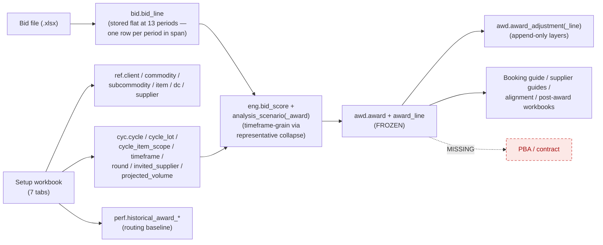

# As-Built Specification — Kroger Produce RFP Platform

> **This is the As-Built Specification: the single authoritative source of truth for what the system
> IS.** The codebase, prompts, workflows, templates, agents, reports, and other docs reconcile to
> this document. Governance rule (`08_RELEASE_GOVERNANCE.md`): **no sprint is complete until this
> specification is updated.** Current-state sections (Parts I–II) describe production reality;
> planned work lives **only** in the Backlog Registry (§20) and Future Roadmap (§21) — current and
> planned functionality are never mixed in the same section.

A faithful, code-verified snapshot of the **RFP lifecycle as actually implemented today** — *every
gate, every loop, every write-point, and how data is mapped*. Every claim is traced to source
(`backend/app/...`, file:line). **Part I** (§1–§13) is the narrative + UX/UI map (system layer +
human layer per stage); **Part II** (§14–§21) is the reference catalog (inventories + registries +
roadmap); the **Appendix** is the versioned change log (the delta history).

> **Reading order:** the [Executive summary](#executive-summary) gives the headline + the material gaps; the [flowchart](#1-end-to-end-lifecycle-flowchart) is the one-page picture; everything after is the evidence.

---

## Executive summary

### Platform maturity snapshot — read this first

The whole platform at a glance. Status vocabulary (the governance set, D39): ✅ **Operational** · 🟡 **Partial** (built, not fully wired) · 🟠 **Defined but Unenforced** · 🔴 **Critical gap** · ⬜ **Missing** (not implemented).

| Domain | Status |
|---|---|
| Bid intake (strict + flexible) | ✅ Operational |
| Analysis engine (5-factor scoring) | ✅ Operational |
| Scenario generation (7 lenses A–G) | ✅ Operational |
| Award freezing + immutability | ✅ Operational |
| Post-award versioning (layers) | ✅ Operational |
| Document generation (workbooks) | ✅ Operational |
| Supplier comms (email drafts, E-37) | 🟡 Partial — deterministic template-merge; the 3 data-ready touchpoints (award · round feedback · non-selection) wired as draft-only HTTP reads; **no send** (draft→SENT lands with G-D/E-24); invite/template/incomplete-bid/PBA gated on data fixes |
| Reproducible / sealed runs + per-run isolation | ✅ Operational |
| Web console (UI) | 🟡 Partial — dashboard, intake, **alignment/scenario/freeze**, and the **full post-award screen (view + record adjustments)** wired; sign-off, close-out, and the documents surface still pending (G-E) |
| Flat-13 period model | ✅ Operational — bids stored flat at 13 periods (G-A closed v1.6) |
| **Audit provenance (decision trail)** | ✅ Operational — every existing decision chained in-txn (IMPORTED/SEALED/FROZEN/SUPERSEDED/adjustment); **G-B closed v1.4**. Sign-off/send events land with G-D. |
| RBAC enforcement | 🟠 Defined, not enforced (G-C) |
| Sign-off workflow | ⬜ Not implemented (G-D) |
| Contract generation (PBA) | ⬜ Not implemented (G-F) |
| External feeds / supplier import | ⬜ Not implemented (E-08/E-09/E-34) |

---

**What works end to end (driven by `PilotService` + the MCP harness):** start run → setup ingest (full cycle/scope creation) → bid template → bid intake (strict *and* flexible) → V3 engine (5-factor scoring, 7 scenario lenses A–G, split allocation) → human-selected award freeze → versioned post-award layers → generated workbooks (alignment, booking guide, per-supplier guides, post-award) → close-out (archive→purge). Sealed analysis runs and frozen awards are immutability-guarded. Per-run isolated databases keep runs apart at the harness runtime.

**The gaps — the critical one (G-B) CLOSED (v1.4) and G-A CLOSED (v1.6); four material remain.** This is the **gap register** (the spec's required fields: description · severity · impact · recommended action · status). Severity = inherent weight if unaddressed; status = where it stands today.

| # | Gap (description) | Severity | Impact | Recommended action | Status |
|---|---|---|---|---|---|
| **G-B** | The audit hash-chain didn't cover award decisions. Now fires in-transaction at ingest (IMPORTED), supersede (SUPERSEDED), engine seal (SEALED), freeze (FROZEN), adjustment (CREATED) — `app/core/audit/recorder.py` + emits in `pilot/service.py`, `awd/service.py`. | 🔴 Critical (existential) | The "why did Supplier A get 35%?" chain (bid → analysis → freeze → adjustment) is tamper-evident and recomputable. | E-05 — wire decision events in-txn; verify chain. | ✅ **Closed (v1.4)** |
| **G-A** | Flat-13 period fan-out was built but not wired. Intake now fans each priced line to one `bid.bid_line` per fiscal period in the timeframe span (`fiscal_period_id` populated); engine/award stay timeframe-grain via a deterministic representative-row collapse (Option B, **D38**); unmappable tf → single NULL-period row. | 🟠 Material | The "data flat at 13 periods" model (D35) is in effect for stored bids; engine/workbook output proven byte-identical to the pre-fan-out grain. | D35/D38 — fan-out + collapse; migrations 0014–0016. | ✅ **Closed (v1.6)** |
| **G-C** | RBAC is defined but not enforced: a full permission matrix + separation-of-duties exists, but **no route uses it** — every route is bare session auth and the dev principal holds all roles. | 🟠 Material | Author≠approver, sign-off/send restrictions, in-gate approval are not actually gated. | E-03 — call `require_permission` on routes; real principals. | 🔴 Open |
| **G-D** | Sign-off is decorative: a workbook tab + an unused permission — no transition, no state, no gate. | 🟠 Material | No portfolio sign-off step (E-22) in the running system. | E-22 — add the sign-off transition/state + gate; wire `SIGNED_OFF`. | 🔴 Open |
| **G-E** | The HTTP API was front-half only. Now wired end to end with web screens: `run_round` + scenario reads + `freeze_award` (alignment screen), the **frozen-award read** + the **post-award adjustment *write*** (`POST /runs/{slug}/awards/{id}/adjustments`, governed, cycle-scoped, off-award + duplicate-cell validation, `CREATED` event), and the **Awards screen now records adjustments** through a cell-selection form. Remaining: the `documents` router (empty stub — generate/send beyond the run-file list) and draft→sent (G-D/E-24). | 🟠 Material | The console can run/compare/freeze, view an award, and **record a governed adjustment from the browser**; only the document-generation/send surface is left for the loop. | E-25 — remaining: the `documents` HTTP surface (+ draft→sent with G-D). | 🟡 Partial (full alignment + post-award read/write/UI shipped; documents/send open) |
| **G-F** | PBA / contract builder is absent, as are external feeds (iTrade/KCMS), the supplier importer, and any deck/letter/email/send path. | 🟠 Material | The post-award final step and supplier-master intake the sponsor flagged don't exist yet. | E-33 (PBA), E-34 (importer), E-08/E-09 (feeds), E-24 (send). | 🔴 Open |

> **✅ G-B CLOSED in v1.4 (was the one existential gap).** The platform's thesis is *AI-generated, not AI-managed* — every number must be defensible by a human-owned, tamper-evident record. The first hard question in production is **"why did Supplier A receive 35% and Supplier B 15%?"**, and the answer must be a chain: **bid received → analysis run → scenario selected → award frozen → adjustment applied**. As of v1.4 each of those decisions appends a hash-chained `audit.event_log` row **in the decision's own transaction** — so an award cannot exist without its event — and the chain recomputes/verifies (tamper-evident; see `tests/audit/test_decision_events.py`). The remaining `SIGNED_OFF` / `SENT` event types stay unwired only because those features don't exist yet (G-D / E-24).

**Two runtimes, two isolation models (important):** the **MCP harness** gives each run its *own database* (D30, `kr_rfp_run_<slug>`); the **web console** runs against the *shared* app database with per-run `cycle_id`/`round_id` scoping (D36) and no per-query RLS yet. Both are real and coexist.

**Where the project stands.** This is not a prototype. It is a functioning RFP lifecycle + analysis engine + versioned awards + immutable analysis + reproducible runs + document generation + an MCP execution surface, with a partially built web console. The core risk is no longer *"can this work?"* — it is **"can governance, traceability, and operational controls catch up before adoption expands?"** The sections below (System of Record, Failure Domains, and the gap analysis) are written to answer that question.

---

## 1. End-to-end lifecycle flowchart

Gates are diamonds; colour = status. **Green = enforced in code · Amber (dashed) = aspirational (defined, not wired) · Red (dashed) = missing · Blue = built process step.**

---

## 2. Stage-by-stage — system layer + human layer

System layer = what the code does. Human layer = who acts, on which **screen** (✅ built · ⬜ missing), doing what. "Persists" key: **V**=commits the vault (git) · **S**=snapshots the run DB (MCP runtime only) · **A**=emits an audit event.

| # | Stage | System: method (file:line) → writes | Persists | Exposure | Human: actor → screen → action |
|---|---|---|:--:|---|---|
| 0 | Start run | `start_run` (service.py:133) → FS scaffold + isolated DB | V | API `POST /runs` · MCP | Analyst → **Dashboard ✅** → "New run" |
| 1 | Setup ingest → cycle | `ingest_setup` (service.py:163) → `ingest_setup_workbook` (setup_ingest.py:171) → `ref.*`/`cyc.*`/`perf.*` | V·S | API `POST /runs/{slug}/setup` · MCP | Analyst → **Intake ✅** → download kickoff, upload filled |
| 2 | Bid template | `generate_bid_template` (service.py:235) → FS `..bid_template.xlsx` (in `inputs/`) | V | API `POST /runs/{slug}/rounds/{n}/template` · MCP | Buyer → **Intake ✅** → generate + download template |
| 3 | Bid intake (strict/flexible) | `ingest_bids` (service.py:261) / `ingest_any` (service.py:303) → `bid.bid_line` | V·S | API `POST /bids/import` · MCP | Buyer → **Intake ✅** → upload bids; confirm mapping |
| 4 | Engine run / scenarios | `run_round` (service.py:341) → `eng.analysis_run`/`bid_score`/`analysis_scenario(_award)` (sealed) | V·S | API `POST /runs/{slug}/rounds/{n}/analysis` + scenario reads · MCP | Buyer → **Alignment screen ✅** → run analysis, compare the 7 lenses, inspect cell-by-cell |
| 5 | Award freeze | `freeze_award` (service.py:470) → `awd.award` FROZEN + `award_line` | V·S | API `POST /runs/{slug}/awards/freeze` · MCP | Buyer/Approver → **Alignment screen ✅** → freeze a chosen lens (governed) |
| 6 | Sign-off | — *(decorative tab + unused permission)* | — | — | Approver → **Sign-off screen ⬜** |
| 7 | Outputs | within run_round / freeze_award → FS workbooks | V | download via `GET /runs/{slug}/files` (partial) | Buyer → **Outputs/Downloads ◐** (file list + zip) |
| 8 | Post-award adjustments | `record_adjustment` (service.py:518) → `awd.award_adjustment(_line)` | V·S | `POST /runs/{slug}/awards/{id}/adjustments` · MCP | Buyer → **Awards screen ✅** → records an adjustment via the cell-selection **form** (pick cells → new $/case → type/date/reason); views the resulting layers + version history |
| 9 | History / versions | `history` (service.py:563); award read layer (`awd/read.py`) | — | API `GET /runs/{slug}/awards` + `…/{id}` · MCP | Buyer → **Awards screen ✅** → frozen award (baseline + effective $/cell) + full version history (v0→vN) |
| 10 | Close-out | `close_run`/`purge_run` (service.py:918/928) → archive zip; drop DB | V | **MCP only** ⛔ | Buyer → **Close-out screen ⬜** |
| — | PBA / contract | **absent** | — | — | → **Contract builder ⬜** |
| — | Supplier master + importer | **absent** (`ingest.py` empty) | — | — | Admin → **Supplier admin ⬜** |
| — | User / role admin | auth + 2FA built; no role enforcement/admin UI | — | API `/auth/*` | Admin → **User admin ⬜** |

**Screens that exist today:** Dashboard ✅, Run detail (kanban) ◐, Bid intake ✅, **Alignment / scenario ✅** (run analysis → compare the 7 lenses → inspect a lens cell-by-cell → freeze a chosen lens), **Awards ✅** (frozen award baseline + effective $/cell + version history v0→vN, **and recording a post-award adjustment** via the cell-selection form), Login + 2FA ✅. **Remaining MCP-only with no web screen:** sign-off and close-out.

---

## 3. Data flow & write-points

**Every governed write is add+flush inside the caller's unit of work — never an internal commit** (the UoW owns the transaction; the vault commit + DB snapshot happen after it closes).

| Write point | file:line | Tables | Scoping |
|---|---|---|---|
| Cycle creation | setup_ingest.py:387–693 | `ref.*`, `cyc.*`, `perf.*`, `norm.normalization_run` | `cycle_id` on all cyc/perf rows; **`ref.dc`/`ref.supplier` reused by natural key** (shared master, D36); `ref.item` per-RFP with collision-safe codes |
| Bid lines | service.py:1071–1199 | `norm.source_artifact`, `bid.bid_submission`, `bid.bid_line` | every row carries `cycle_id`+`round_id`+`supplier_id`; **each priced line fanned to one row per fiscal period in its timeframe span** (`fiscal_period_id`; D38) — `ingested` counts logical lines, not fanned rows |
| Engine seal | runner.py:154–413 | `eng.analysis_run`/`bid_score`/`analysis_scenario`/`analysis_scenario_award` | `cycle_id`+`round_id`; children FK to run/scenario |
| Award freeze | awd/service.py:90–138 | `awd.award`, `awd.award_line` | idempotent on `cycle_id`+`analysis_run_id`+`scenario_code` |
| Post-award layer | awd/service.py:172–203 | `awd.award_adjustment`, `awd.award_adjustment_line` | `award_id`+`version_no` (unique) |
| Audit (commodities only) | ref/service.py:53 | `audit.event_log` | `client_id` + per-tenant `seq` |

---

## 4. System of Record hierarchy

> **The rule.** For every business artifact there is **exactly one authoritative store**. Every other representation — a generated Excel, a JSON export, a cached view, a printout — is a **render** of that store at a point in time, never a source. **If a generated document and its governed record disagree, the record wins** and the document is stale or tampered. Declare this *before* the first production dispute ("the booking-guide Excel says X, the database says Y"), because after it starts there is no neutral way to pick a winner.

| Business artifact | System of record (authoritative) | Renders / exports (subordinate) |
|---|---|---|
| Cycle / RFP definition + scope | `cyc.cycle` + `cyc.*` (Postgres) | setup workbook (input), `run_data.json` |
| Reference master (DC / supplier / item) | `ref.dc` / `ref.supplier` / `ref.item` | setup workbook tabs; supplier import (future) |
| Supplier bid | `bid.bid_line` (+ `bid.bid_submission`) | uploaded bid workbook, normalized workbook |
| Analysis / scenarios | `eng.analysis_run` (sealed) + `eng.bid_score` / `eng.analysis_scenario(_award)` | alignment workbook |
| Award decision | `awd.award` + `awd.award_line` (FROZEN) | booking guide, per-supplier guides |
| Post-award changes | `awd.award_adjustment(_line)` (append-only) | post-award workbook |
| Provenance / who-did-what-when | `audit.event_log` (hash-chained) — **authoritative; G-B closed v1.4** (IMPORTED/SEALED/FROZEN/SUPERSEDED/CREATED fire in-txn) | git history + `run_data.json` (corroborating, not the SoR) |
| Generated document (the file itself) | vault filesystem (git-versioned) | — *(authoritative for the artifact, not for the values inside it)* |
| Official contract | **PBA — future (E-33)** | — |

Two consequences worth stating outright:
- **The database outranks every workbook.** A booking guide is a render of `awd.award`; an alignment sheet is a render of `eng.analysis_run`. The vault filesystem is authoritative for the *document as an artifact* (what was generated/sent), never for the decision values printed inside it.
- **Provenance has a real SoR (since v1.4).** `audit.event_log` is the hash-chained system of record for "who did what when" — every decision (IMPORTED/SEALED/FROZEN/SUPERSEDED/CREATED) appends a row **in the decision's own transaction** (G-B closed v1.4), so an award can't exist without its event and the chain is tamper-evident. Immutable sealed rows + git history + `run_data.json` corroborate it. (The `SIGNED_OFF`/`SENT` event types remain unwired only because those features don't exist yet — G-D/E-24.)

---

## 5. Failure domains (load-bearing vs convenience)

Not every component carries equal weight. Two structural facts shape the blast radius: **(a)** every governed write is *add+flush inside the caller's unit of work — never an internal commit*, so a failure mid-stage **rolls the whole stage back atomically** (no partial/corrupt governed state); **(b)** vault git commit/push failures are **deliberately swallowed** (D34 — git is a persistence convenience, never a blocker).

| Component / failure | Immediate impact | Class |
|---|---|---|
| **Award freeze** (`freeze_award`) | no sealed official award can be produced | **Governance-critical** |
| **Audit writer** (`AuditWriter`) | a decision's provenance event is not recorded | **Governance-critical** (today *latent* — not yet wired, G-B) |
| **Immutability guards** (sealed/frozen) | sealed runs / frozen awards could be mutated | **Governance-critical** (integrity) |
| **Engine** (`run_round`) | no scenarios → award cannot proceed | Operational-blocking |
| **Bid intake** (`ingest_bids`/`ingest_any`) | a round cannot take bids → supplier blocked | Operational-blocking |
| **Post-award adjustment** | a reprice cannot be recorded → contract drift uncaptured | Governance-significant |
| **Vault commit / push** | document + state not persisted off-box | Provenance / recovery (DB still authoritative) |
| **Per-run DB provision / snapshot** (D30/D34) | a run cannot isolate or resume on a fresh box | Availability (harness runtime) |
| **Workbook generation** (`output/*`) | a document isn't produced; the data is intact in the DB and re-renderable | **Convenience** |

**Design implication for closing G-B:** because writes are atomic within the unit of work, **wiring each audit event into the same transaction as its decision makes the event atomic with the decision** — you cannot get a frozen award without its `FROZEN` event, or a sealed run without its `SEALED` event. That is the correct way to close G-B: not a best-effort side log, but an event that shares the decision's commit boundary (and therefore inherits its rollback).

---

## 6. Gates — enforced vs aspirational

| Gate | Status | Where |
|---|---|---|
| Award-select is **human, not engine** | ✅ enforced structurally | `freeze_award` needs explicit scenario+award from a human; engine never auto-freezes |
| Engine **decision-support language** guard | ✅ enforced | `assert_decision_support` on every scenario label/desc (engine/guards.py; v3.py:185) |
| **Frozen award** immutability (no update/delete) | ✅ enforced (app-layer) | SQLAlchemy listeners, guards.py:56/45 wired at main.py:62 |
| **Sealed analysis-run** immutability | ✅ enforced (app-layer) | guards.py:34/45 |
| Bid **key validation / quarantine** | ✅ enforced | bid_ingester.py:489–527 |
| **Double-subtract** price guard | ✅ enforced (app + DB CHECK) | bid_ingester.py:282; migration 0007:64 |
| Premium-ceiling / coverage-floor eligibility | ✅ enforced (engine-internal) | scoring.py:346/351; layered service.py:451 |
| Propose→confirm before flexible write | ✅ enforced | ingest_any (service.py:303) |
| Concentration / max-suppliers-per-DC | ⚠️ **advisory flag only** — never blocks | v3.py:281/113 |
| Tenant scoping | ✅ at the edge (no per-query RLS) | deps.py:21; principal-derived only |
| **In-gate G12** (open on real data) | ❌ aspirational | permission + event type exist; nothing enforces |
| **Round close** | ❌ aspirational | rounds created OPEN (setup_ingest.py:601), never transitioned; `is_final` set, never enforced |
| **Sign-off** | ❌ missing | tab + unused permission only |
| **Draft → SENT** | ❌ aspirational | permission + event type exist; `documents.py` empty |
| **RBAC separation of duties** | ❌ defined, not enforced | full matrix in rbac.py; **no route calls `require_permission`** |

---

## 7. Loops

| Loop | Where | Bound / exit |
|---|---|---|
| **Round loop R1..Rn** | external repeat of template→intake→run_round with `round_no`; rounds made at setup (setup_ingest.py:601) | round_count **2..6**; no auto-advance, no enforced final-round close |
| **Propose→confirm intake** | `ingest_any` (service.py:303) | exits on buyer confirm; ambiguities surfaced, never guessed |
| **Resubmit / supersede** | `_persist_bid_lines` (service.py:1091) | one scoreable submission per (cycle, round, supplier) |
| **Alignment re-run** | `run_round` repeatable; each a new sealed version (service.py:1301) | unbounded; every run sealed + immutable |
| **Post-award reprice** | `record_adjustment` (service.py:518) | unbounded, append-only over the frozen v0 baseline |
| **Close-out present→confirm→purge** | close_run → purge_run | terminal; archive retained |

There is **no optimisation loop inside the engine** — `run_analysis` is single-pass, deterministic, with hashed input/output manifests (runner.py:430/469).

---

## 8. Audit / event-log status (G-B detail)

The hash-chained `audit.event_log` is **mechanically complete and correct**: `prev_event_hash`→`event_hash = sha256(canonical(fields) || prev)`, per-tenant `seq` taken `FOR UPDATE`, genesis = 64 zeros, written in the caller's transaction (writer.py:46–82). Eight `EventType`s are defined (CREATED, SEALED, FROZEN, SUPERSEDED, SIGNED_OFF, SENT, GATE_APPROVED, IMPORTED).

**✅ Closed in v1.4.** Decision events now fire **in the decision's own transaction** at every governed step: `IMPORTED` + `SUPERSEDED` at bid ingest (`pilot/service._persist_bid_lines`), `SEALED` at engine seal (`pilot/service.run_round`), `FROZEN` at award freeze and `CREATED` at adjustment (`awd/service`). The tenant is resolved via `app/core/audit/recorder.py` (cycle/award → commodity → `client_id`); a decision whose tenant can't be resolved **raises** rather than skipping the event (no decision without provenance). The chain is verified end-to-end in `tests/audit/test_decision_events.py` (contiguous `seq`, prev→hash linkage, `compute_event_hash` recompute, and a savepoint-rollback proving the event rides the decision's transaction). Closing the linkage gap (`ref.commodity.client_id` was NULL in the pilot path) also fixed a latent ownership hole. **Still unwired:** `SIGNED_OFF` / `SENT` / `GATE_APPROVED` — only because those features don't exist yet (G-D, G-C in-gate, E-24).

---

## 9. Built · partial · missing (gap analysis → backlog)

**Built (working):** vault scaffold + git + per-run isolated DBs + snapshot/rehydrate · setup ingest → full cycle/scope · bid template gen · strict + flexible intake w/ quarantine · **flat-13 period storage (bids fanned to one row per fiscal period; engine/award stay timeframe-grain via representative collapse) → D35/D38 ✓ (v1.6)** · V3 engine (5-factor scoring, eligibility gates, 7 lenses, split allocator, sealed reproducible runs) → **E-18/E-19/E-20** · award freeze + append-only post-award layers → **E-21** · alignment/booking-guide/supplier-guide/post-award workbooks → **E-23 (booking guide part)** · immutability guards · **decision-point audit events (IMPORTED/SEALED/FROZEN/SUPERSEDED/CREATED), atomic + tamper-evident → E-05 ✓ (v1.4)** · MCP surface covering the full lifecycle · web: auth+2FA, dashboard, run detail, **bid intake**, **alignment/scenario screen (run analysis → compare 7 lenses → inspect cell-by-cell → freeze)**, **post-award Awards screen (frozen baseline + effective $/cell + version history, AND recording a governed adjustment via the cell-selection form)** → **E-25/E-26**.

**Partial / inert:**
- Audit event emission for **sign-off / send** (`SIGNED_OFF`/`SENT`) — pending those features → **G-D / E-24** (decision events themselves are done, v1.4).
- RBAC matrix defined, **no route enforces** it → **E-03**.
- HTTP API + web UI: engine/scenario/freeze, the **frozen-award read**, and the **post-award adjustment *write*** + its **form** now wired end to end; only the `documents` router (generate/send) remains → **E-25 (remainder)**.
- Outputs: workbooks + **supplier email drafts** — the comms layer (E-37) renders outward emails by **deterministic template-merge** (author-owned `[#Name]` templates, NOT AI) for 3 of 7 touchpoints (award · round feedback · non-selection), exposed as draft-only HTTP reads (`GET …/comms/award`, `…/analysis/{id}/comms/feedback`, `…/comms/rejection`). **No send, no draft→SENT, no DB write** (the buyer reviews/edits/sends; SENT audit event lands with G-D/E-24). Remaining touchpoints (invite, template, incomplete-bid, PBA) gated on data fixes (cycle-timeline population, incomplete-line capture, capacity ingest) + no draft-review UI yet → **E-37 (remainder), E-23**.
- `is_awardable` set unconditionally true at ingest — no awardability logic.
- DB-level immutability triggers + tenant RLS — referenced as Platform-team-owned, **not present** here.

**Missing (absent):**
- **PBA / contract builder** → **E-33**.
- **Supplier importer / external feeds** (iTrade/KCMS/normalize) → **E-34, E-08/E-09**.
- **Document send / draft→SENT** → **E-24**.
- **Sign-off** transition/gate → **E-22**.
- **In-gate G12 / round-close** gates → **E-17 / E-16**.

---

## 10. Known issues queued (fix after this review)

Captured here so the audit reflects the true state; queued as the first post-review batch (sponsor: queue, not now):

1. **Intake soft-gating keys off output files** — setup + generated templates live in `inputs/`, so a returning user gets template/import re-locked until analysis outputs exist. Derive "done" from cycle/template state (the round template in `inputs/`), not outputs. *(Codex P2, intake/page.tsx)*
2. **Template section shows only `kind:"output"`** — the generated template is in `inputs/`, so its download table stays empty after "Generate". Show it from the returned filename / input template. *(Codex P2, TemplateSection.tsx)*
3. **Template round error mislabeled** — `generate_bid_template` maps every `ValueError` to `gate_required` ("no cycle yet"); an out-of-range round should be a `validation_error`, pre-validated like the bids endpoint. *(Codex P2, runs.py)*

---

## 11. Recommended priorities (to frame the review)

0. **~~(CRITICAL) Wire audit events into every decision~~ ✅ DONE (v1.4)** (G-B, E-05) — decisions now emit `IMPORTED`/`SEALED`/`FROZEN`/`SUPERSEDED`/adjustment events in-transaction; chain verified by tests.
1. **~~Wire the flat-13 fan-out into intake~~ ✅ DONE (v1.6)** (G-A, D35/D38) — bids stored flat at 13 periods; engine/award stay timeframe-grain via representative collapse; output proven byte-identical.
2. **Alignment ✅ (v1.8); post-award read ✅ (v1.9); adjustment-write API ✅ (v1.10); adjustment form UI ✅ (v1.11)** (G-E, E-25) — the console now runs the full lifecycle browser-side: run/compare/inspect/freeze, view the award, and record a governed adjustment via a form. **Remaining for G-E:** the **`documents`** HTTP surface (generate/send) + draft→sent (with G-D) → **← next**.
3. **Enforce RBAC + sign-off** (G-C/G-D, E-03/E-22) — author≠approver and a real sign-off gate before "official"; wire `SIGNED_OFF`/`SENT` audit events when these land.
4. **Back the app-layer guards with DB-level enforcement** — immutability triggers + tenant RLS; today both rest on app-layer listeners + edge principal only.
5. **Spec the PBA/contract builder + supplier importer** (G-F, E-33/E-34) — the sponsor-flagged post-award step and supplier master intake.

---

## 12. Governance — triggers, questions, and the release gate

This audit is a **living model of reality**, not a statement of intent: it documents the system **as actually implemented**. If implementation and this document disagree, **implementation is reviewed and the audit is corrected to match reality** (ratified in **D39**; release-gate policy in **D37**; operationalized in `02_WAYS_OF_WORKING` §8 + Definition of Done). A calendar audit is mostly noise; an audit **after meaningful architectural change** catches drift while it is still cheap to fix.

### 12.1 Trigger conditions (re-audit on change, scoped to what changed)

| Category | Triggering change | Audit scope |
|---|---|---|
| **Workflow** | New process stage · lifecycle transition · approval path · human interaction · automation | Workflow (§1–§2) |
| **Persistence** | New table · file output · storage location · write path · system of record | State / write-location (§3–§4) |
| **Runtime** | New service · MCP tool · agent · orchestrator logic · execution boundary · integration | Runtime boundaries (§13) |
| **Security & governance** | New user role · permission/RBAC change · approval change · audit-logging change | RBAC + governance (§6, §8) |
| **User experience** | New screen · workflow surface · operator action · user-visible state | UX visibility (§2 human layer) |
| **Architecture** | New subsystem · dependency · runtime · deployment model | Full audit |
| **Major version / rollout** | New major version · pre-production rollout · post-production rollout | Full audit |

### 12.2 The questions every re-run must answer

1. **How does the system actually work?** — inputs → processing → outputs, human vs automated decisions (§1 flowchart, §2 stages).
2. **Where is information written?** — every write path has a defined destination (§3 data flow, §4 System of Record).
3. **Who can read / write / approve it?** — (§6 gates, §2 human layer, RBAC / G-C).
4. **What must be visible to operators?** — required screens, status, approval, and audit visibility (§2 human/UX layer, §13 trust boundaries).
5. **What can fail?** — failure domains, dependency chains, single points of failure, recovery (§5).
6. **Where are the gaps between design and implementation?** — (the gap register, §9).

The objective: any future developer, operator, auditor, or stakeholder can answer *how it works · where the data is · who can change it · what can fail · what changed since last version* **without reading source code**.

### 12.3 Release gate — a major version is not complete until

1. Implementation is complete; **2.** review is complete; **3.** this audit is updated; **4.** the gap register is updated; **5.** critical findings are reviewed. The gate then yields one of three **release states**:

| State | Meaning |
|---|---|
| ✅ **PASS** | The audit accurately reflects implementation; no critical control missing. |
| 🟡 **CONDITIONAL** | Known risks are documented **and explicitly accepted** (recorded in the gap register with an owner). |
| 🔴 **FAIL** | The audit does **not** reflect implementation, or a critical control is missing. **Do not ship.** |

### 12.4 Pre-merge audit-impact review (the review requirement)

On **every** change (PR review, incl. Codex), verify whether it affects: **workflow · state transitions · persistence · runtime boundaries · permissions · governance · auditability · user-visible behavior · failure domains**. If **any** answer is **yes**, `07_AS_BUILT_PROCESS_AUDIT.md` (and the gap register) **must be reviewed and updated before merge** — the audit moves with the code in the same change. This check is part of the Definition of Done (`02_WAYS_OF_WORKING` §8).

---

## 13. Runtime boundaries & trust boundaries

What actually runs, where, and where the trust lines fall. Two runtimes wrap the **same** `PilotService` domain logic; the unit of work owns the transaction (services `add+flush`, never an internal commit).

| Runtime / boundary | What it is | Isolation / trust |
|---|---|---|
| **Web console API** (FastAPI, `app/api`) | The browser-facing surface (auth+2FA, dashboard, run detail, bid intake). Front-half only today (G-E). | Runs against the **shared** app DB; per-run `cycle_id`/`round_id` scoping (D36); auth at the edge (`get_current_user`), **no per-query RLS yet**. |
| **MCP harness** (`PilotService(isolate_db=True)`) | The full-lifecycle execution surface (engine/award/post-award/close-out). | Each run gets its **own database** `kr_rfp_run_<slug>` (D30) — strong runtime isolation. |
| **Engine** (`app/engine`, clean-room v3) | Deterministic single-pass scoring/allocation. **Not an agent**, no optimisation loop, no autonomy. | **Purity boundary**: stdlib + pydantic only; the purity test forbids importing SQLAlchemy here. `app/domain/eng` adapts DB ↔ engine. |
| **Immutability guards** | Sealed analysis runs + frozen awards. | **App-layer** SQLAlchemy listeners (wired at `main.py`); DB-level triggers/RLS are Platform-team-owned and **not present here**. |
| **Audit writer** (`AuditWriter`) | Appends hash-chained `audit.event_log` rows. | **Atomic with the decision** — same transaction, inherits its rollback (G-B). |
| **Vault filesystem** (git per run) | Generated documents + `run_data.json`, git-versioned. | Persistence **convenience** — commit/push failures are deliberately swallowed (D34); the DB stays authoritative. |

**Agents:** none run autonomously in the platform — there is no in-loop AI making or managing decisions at runtime (the thesis is *AI-generated, not AI-managed*). **Supplier comms (E-37)** preserve that thesis: the outward email drafts are produced by **deterministic template-merge** (author-owned `[#Name]` templates filled from governed data — no model in the loop), and they are **draft-only** — rendered on a GET, never persisted, never sent; outward-facing content crosses the trust boundary only when a human buyer manually copies/sends it, at which point the SENT audit event will fire (G-D/E-24, not yet built). **Integrations:** none live yet; iTrade/KCMS feeds (E-08/E-09/E-28) and the supplier importer (E-34) are future. **Execution environments:** Postgres 16 (shared for web, per-run for MCP), Alembic migrations, the git-versioned vault. The principal trust lines are the **auth edge** (no per-query RLS — G-C), the **engine purity boundary**, and the **app-layer-only immutability** (no DB-level enforcement yet — see §11 priority 4).

---

# Part II — As-Built Inventories & Registries

*Reference catalog (current state). Code-verified via inventory sweep 2026-06-21. Planned work is in §20–§21 only.*

## 14. Functional inventory (HTTP surface)

Every route is bare session-auth (RBAC defined, not enforced — G-C) except `/health`, `/ready`, `/auth/login`.

| Area | Endpoint | Purpose |
|---|---|---|
| Health | `GET /health`, `GET /ready` | liveness; readiness (probes the store) |
| Auth | `POST /auth/login` · `/logout` · `GET /auth/me` · `POST /auth/2fa/enroll` · `/2fa/verify` | password + optional TOTP 2FA; session cookie |
| Runs | `GET /runs` · `POST /runs` · `GET /runs/{slug}` · `…/files` · `…/files/{name}` · `…/archive` | list/create runs; kanban; file list/download; zip |
| Setup | `POST /runs/{slug}/setup` | ingest setup workbook → cycle creation |
| Template | `POST /runs/{slug}/rounds/{round}/template` | generate owned bid template for a round |
| Bids | `POST /bids/import` (strict / flexible propose+confirm) · `GET /bids` | ingest round bids; list persisted lines |
| Analysis | `POST /runs/{slug}/rounds/{round}/analysis` · `GET …/analysis` · `…/analysis/{id}/scenarios` · `…/scenarios/{code}` | seal a run; list; compare 7 lenses; lens detail |
| Awards | `POST /runs/{slug}/awards/freeze` · `GET …/awards` · `…/awards/{id}` · `POST …/awards/{id}/adjustments` | freeze a lens → award; list; detail (effective+history); post-award layer |
| Comms (E-37) | `GET …/awards/{id}/comms/award` · `…/comms/rejection` · `…/analysis/{id}/comms/feedback` | draft-only template-merge email drafts |

Source: `backend/app/api/v1/*.py`; lifecycle logic in `backend/app/pilot/service.py`.

## 15. Agent inventory

**No autonomous in-loop AI agent runs at runtime** — the platform is human-in-the-loop; every governed decision (freeze, adjustment, approval) is explicitly actor-asserted (ADR-0006). The only agent surface is the **RFP Pilot MCP server** (`backend/rfp_mcp/rfp_pilot_server.py`), a thin FastMCP wrapper exposing ~17 tools over `PilotService` (run lifecycle + a read-only `history`/`feedback` + a `remember`/`add_memory` notes facility = the "secretary/read-only memory"). Write tools (`setup_ingest`, `ingest_bids`, `ingest_any[confirm]`, `run_round`, `select_award`, `record_adjustment`, `remember`, `add_memory`, `close_run`, `purge_run`) write the run vault + (where DB-touched) the run's **isolated** Postgres DB (D30); the rest are read-only. No recurring scheduler, no background loop.

## 16. Data model (persisted state)

System-of-record per artifact is in §4. **The complete, authoritative schema DDL is `db/baseline/schema.sql`** (Alembic revision `0001` — the full reconciled **M0 baseline: 63 tables** across the eight logical schemas `ref/norm/cyc/bid/eng/awd/perf/audit`, clean-room re-expressed per ADR-0001), **plus** the additive migrations `backend/alembic/versions/0002–0018` (notably: `auth.app_user` [0017], `ref.fiscal_period` [0014], `bid_line.fiscal_period_id` [0015], the **sealed decision-support spine** `eng.analysis_run/bid_score/analysis_scenario/analysis_scenario_award` [0008], the post-award `awd.*` adjustment tables, and `cyc`/tenancy backfills). This section is the *map*, not a re-typing of the DDL (re-typing 63 tables in prose is itself a drift risk — the SQL is the source of truth).

**Crucial distinction — provisioned ≠ wired.** The baseline provisions all 63 tables, but the running app only *writes* a subset today; the rest are **provisioned-but-dormant** (created by the baseline migration, not yet read/written by app code). Follow-on work (esp. E-38) must target the EXISTING table, never create a duplicate store.

**Actively written by the running app** (ORM-mapped under `backend/app/domain/*/models.py`, written by `PilotService`):

| Schema | Active tables |
|---|---|
| **ref** | `client`, `commodity` (tenant root + scoping demonstrator; `client_id`) · masters `dc`, `supplier`, `item` (+ `*_alias`) reused by natural key at setup ingest (D36) · `fiscal_period` (flat-13, mig 0014) |
| **auth** | `app_user` (login + TOTP, mig 0017) |
| **cyc** | `cycle`, `cycle_round`, `cycle_lot`, `cycle_lot_item`, `cycle_timeframe`, `cycle_projected_volume`, `cycle_invited_supplier`, `cycle_item_scope` (+ kickoff term tables where populated) · `cycle_timeline_event` exists but is **not yet populated** |
| **norm** | `source_artifact` (intake provenance) · `normalization_run`(`_source`) (written at setup ingest) |
| **bid** | `bid_line` (priced line; **flat at 13 fiscal periods**, `fiscal_period_id`; components fob/delivery/vegcool/lot_discount; `is_scoreable`/`is_awardable`; supersede flips `is_scoreable`) · `bid_submission` |
| **perf** | `historical_award_assignment` + `historical_awarded_price_basis` — incumbents + the routing/iTrade baseline (D11), **written at setup ingest** (`setup_ingest.py`) and **read by `load_cycle`** into engine inputs (the `delta_vs_historical` baseline) |
| **eng** | `analysis_run` (sealed; hashed manifests + engine version) · `bid_score` (5 factors→rec_score, `is_eligible`, `gate_flags`) · `analysis_scenario` (A–G headers) · `analysis_scenario_award` (split rows: `volume_share`, `awarded_price`, `is_fallback`, `cap_breach_flag`) — **append-only, immutable once sealed** |
| **awd** | `award` (FROZEN) · `award_line` (immutable baseline; `frozen_price` never updated, ADR-0014) · `award_adjustment` (append-only v1..N) · `award_adjustment_line` (per-cell prior→new→delta) |
| **audit** | `event_log` (hash-chained, append-only; per-tenant `seq`; `prev_event_hash`/`event_hash`; G-B closed v1.4) |

**Provisioned-but-dormant** (in the baseline schema, **not yet wired** by app code — available to adopt, not to duplicate):

- **Capacity (directly relevant to E-38):** `bid.capacity_statement` (per cycle/round/supplier/submission header — status, effective_at) + `bid.capacity_constraint` (`scope_type` ∈ CELL/DC_TF/LOT_TF/SUPPLIER_TF/TOTAL_CYCLE, with `max_weekly_cases` / `max_period_cases` + CHECKs). These FK only to **active** tables (cyc/ref/norm/bid_submission), so **E-38 ingests the Capacity sheet into them** — no new store. ⚠️ `eng.scenario_capacity_usage` also exists but its `scenario_run_id` FK targets the **dormant** solver spine (`eng.calculation_run`), **not** the active `eng.analysis_scenario` — so E-38 computes allocation-vs-capacity **usage against the active `eng.analysis_scenario_award`** (read-side), and does **not** persist to that table as-is (using it would require either `calculation_run` rows or a schema change — out of scope for the B-core).
- **The M0 governed-solver spine:** `eng.calculation_run(_input)`, `eng.scenario(_award)`, `eng.scenario_line_detail`, `eng.round_analysis_snapshot`, `eng.engine_release`, `eng.metric_definition_version`, `eng.scenario_config_version` (the heavy solver; the app instead writes the lightweight sealed spine above).
- **Intake/eligibility detail:** `bid.eligibility_result`/`eligibility_gate_result`/`eligibility_exception`, `bid.landed_cost_result`, `bid.supplier_capability`, `bid.normalized_volume_scope`/`volume_scope_*`.
- **Commercial / market / future-feed:** `perf.commercial_*` (pricing model/window/formula audit/market reference/QDP/…), `perf.itrade_receipt` + `perf.historical_awarded_cost_ingestion_issue` (raw feed; importer is future E-08). `ref.fiscal_calendar`, `ref.subcommodity`, `ref.loading_location`, `ref.master_data_quarantine`. `audit.decision_note`, `audit.round_*`. *(NB: `perf.historical_award_assignment`/`historical_awarded_price_basis` and `norm.normalization_run` are NOT here — they are ACTIVE, written at setup ingest / read by `load_cycle`; see the active table above.)*

## 17. Analysis-engine inventory

Clean-room v3 (`backend/app/engine/`); **purity boundary**: stdlib + `Decimal` only (no float/I/O/ORM/clock). Strategy-agnostic — every band/weight/threshold/rule is `EngineConfig`-driven (ADR-0016). Labels screened for banned award-assertion verbs (`assert_decision_support`, `guards.py`).

- **Five scoring factors → RecScore** (`scoring.py`, banded): Price (premium vs cell-low), Coverage (offered/required), Historical (vs incumbent baseline), Z-Risk (price outlier), Continuity (incumbent tie-break). Weighted by a preset (`BALANCED` default; `PRICE_FOCUS`/`COVERAGE_FOCUS`/`RISK_AVERSE`), renormalized to a convex sum.
- **Eligibility gates** (`scoring.py`): hard — `GATE_NO_PRICE`, `GATE_PREMIUM` (premium > ceiling, default 12%, per-lot overrideable), `GATE_COVERAGE` (coverage < floor, default 80%, As-Needed exempt); advisory — `GATE_LOW_OUTLIER`/`GATE_HIGH_OUTLIER` (|z|>2), `GATE_LOW_BIDDER` (<3 bids).
- **Seven scenario lenses A–G** (`allocation.py`): A lowest-cost · **B risk-adjusted (the recommendation, `is_recommended`)** · C incumbent-defense · D max-N-per-DC split (`max_sup_dc`, `is_fallback`, `cap_breach_flag`) · E exclusion · F custom override · G preferred supplier. Plus §4.5 category-concentration flag.
- **Canonical formulas** (`formulas.py`, E-39 — the single "table of calcs"): `construct_price_from_parts`/`construct_price` (§7), `premium_vs_low`, `z_score`, `coverage_ratio`, `delta_vs_historical`, `awarded_cases`, `line_spend`, `savings_dollars`, `savings_fraction`, `premium_dollars`, `weekly_impact`, `price_delta`. Referenced by the scorer, the bid ingester, the scenario workbook + read layer, the booking guide, the award read/service + post-award doc, and the comms drafts.

## 18. Template & generated-output inventory

All generators read **governed sealed records** and render by NAME (D23), deterministically (no clock in body). Source: `backend/app/output/*`, `backend/app/comms/*`, `backend/app/domain/bid/template_generator.py`.

| Artifact | Type | Trigger | Notes |
|---|---|---|---|
| Bid template | xlsx (3 sheets: Instructions / Bids / **Capacity**) | template gen (per round) | the Capacity sheet is collected but **not yet ingested** (E-38) |
| Scenario alignment workbook | xlsx (multi-tab) | analysis seal | 7 lenses + live custom + per-cell grid; numbers shared with the app read layer |
| Booking guide (internal) | xlsx | award freeze | buyers/pricing master, one row per awarded cell |
| Per-supplier award guides (combined) | xlsx (1 sheet/supplier) | award freeze | internal only — **not** safe to send (all suppliers in one file) |
| Per-supplier award guide **files** | xlsx (1 file/supplier) | award freeze | the **sendable** artifact; award-id-stamped filename; attached to the award draft |
| Post-award workbook | xlsx (versions / effective / changes) | adjustment | `Version N · as of DATE` |
| 7 supplier email drafts | draft-only (E-37) | rendered on GET | invitation, template, incomplete-bid, round-feedback, award, non-selection, PBA — **never auto-sent**; visible `[#Placeholder]` holes if data missing |

## 19. Workflow maps

The end-to-end lifecycle, approval points, and data-flow are mapped in **§1 (flowchart)**, **§2 (stage-by-stage, system + human layers)**, and **§3 (data flow & write-points)**. Ordered as-built steps: start run (isolated DB) → setup ingest (cycle/scope) → bid template → bid intake (strict/flexible, supersede flips `is_scoreable` + emits `SUPERSEDED`) → engine seal (`SEALED`) → human scenario select + **freeze** (`FROZEN`) → post-award adjustment layer (`CREATED`) → close-out → purge. **Human decision/approval points** (§6): flexible-mapping confirm (enforced), scenario selection + award freeze (governed, audit-evented), post-award adjustment (governed). **Modeled-but-not-wired:** in-gate G12, sign-off transition + `SIGNED_OFF`, draft→`SENT`, timeline events.

## 20. Registries

### 20.1 Backlog registry (classification per `08_RELEASE_GOVERNANCE.md`)

| Status | Items |
|---|---|
| **Approved for Phase 1 build** | **E-38 capacity accuracy-core** (B: ingest + persist + engine/custom cap flag + workbook control tab) — **wires the EXISTING `bid.capacity_statement` + `bid.capacity_constraint` baseline tables (§16), not a new store**; usage computed against the active `eng.analysis_scenario_award` (the `eng.scenario_capacity_usage` table is keyed to the dormant solver spine, so not used as-is); the only net-new build approved now |
| **Deferred (Category C — Phase-4 review)** | E-38 in-app dashboard · G-D/E-24 sign-off + draft→SENT · E-33 PBA/contract builder · E-34 supplier importer + E-08/09 feeds · E-35 discovery view · E-36 progressive timeframe / continuation RFP · E-28 contracted-vs-effective analytics |
| **Deferred (Category B — Live-Run cycles)** | G-C RBAC route enforcement · misc reporting/validation/UX enhancements |
| **Rejected** | *(none)* |

Full item descriptions: `04_PROGRAM_BACKLOG.md`.

### 20.2 Technical-debt register

| Item | Risk | Status |
|---|---|---|
| RBAC defined but no route enforces it (G-C) | author≠approver / send restrictions not gated | Open — Category B |
| Immutability is app-layer only (SQLAlchemy listeners); no DB triggers/RLS | a direct-DB write could bypass guards | Open — Platform-owned |
| `bid_line.fiscal_period_id` is `varchar(36)` nullable, not a typed FK | weak referential integrity on period grain | Open — low-risk (D38) |
| `cycle_timeline_event` modeled, not populated at kickoff | invite/timeline comms gated | Open — feeds E-37 remainder |
| Sign-off is decorative (tab + unused permission) | no portfolio sign-off step | Open — G-D |
| Incomplete-bid lines classified but not persisted/itemized | incomplete-bid comms gated | Open — feeds E-37 remainder |

### 20.3 Audit-findings register

| Finding | Severity | Resolution |
|---|---|---|
| **G-B** audit chain didn't cover decisions | Critical | ✅ Closed v1.4 (in-txn events) |
| **G-A** flat-13 period storage not wired | Material | ✅ Closed v1.6 |
| Codex PR #18 — superseded-row leaks, alignment race, cross-run award, actor/duplicate-cell, comms stale/leaky guide, market-low hard-gate, sealed-run prices, explicit-zero ceiling, award-id filename (9 across 4 rounds) | P1–P2 | ✅ All resolved (PRs #13–#18) |
| Codex PR #19 — formula registry | — | ✅ Clean (behavior-preserving; byte-identical golden) |
| **Open critical findings** | — | **None** |

## 21. Future roadmap (planned — NOT current state)

The platform target is production-ready execution of live sourcing events, validated over **Live Run #1** then **#2**, followed by a **Feature Consolidation Review** (evaluate every deferred Category-C item → approve/defer/reject), a **Final Audit**, and **Production Lock** (V1 baseline frozen). Major work beyond V1 requires a formal **Version 2** planning cycle. Phases, gates, and the change-classification rules are defined in `08_RELEASE_GOVERNANCE.md`. **Nothing in this section is implemented** — it is the approved direction, kept separate from the current-state catalog above.

---

## Appendix — version history (track the delta)

The value of this audit is the **delta**, not the snapshot. Each entry records **Added** (capabilities), **Closed** (gaps), and **Introduced** (new gaps), so anyone can answer *"when did this capability appear?"* or *"when did this control disappear?"* without reverse-engineering git history.

- **v1.17 (2026-06-21)** — *Corrections (PR #20, second push-basic review round — two more Codex P2):* (1) **Incumbent-baseline tables were mis-bucketed as dormant** — `perf.historical_award_assignment`, `perf.historical_awarded_price_basis`, and `norm.normalization_run` are in fact **active** (written at setup ingest `setup_ingest.py`, read by `load_cycle` into the engine's `delta_vs_historical` baseline, D11); moved to the active table in §16. (2) **`eng.scenario_capacity_usage` is mis-keyed for E-38** — its `scenario_run_id` FK targets the **dormant** solver spine (`eng.calculation_run`), not the active `eng.analysis_scenario`; corrected §16 + §20.1 + `08` + `04` so E-38 ingests into `bid.capacity_statement`/`capacity_constraint` (active-keyed) and computes usage against the **active** `eng.analysis_scenario_award` — it does NOT persist to `scenario_capacity_usage` as-is. *Process:* added the **Review cadence & control points** protocol to `08` — two tiers (push-basic Codex review = automatic on push; the **detailed full-suite auditor = manual**, called by the agent at control points: pre-merge / sprint-close / phase-gate / backstop). *Introduced:* none (documentation accuracy + process).
- **v1.16 (2026-06-21)** — *Corrections (PR #20 review — Codex P2 + the external auditor):* (1) **§16 data-model catalog completed** — the first pass (scoped to ORM models) under-reported the schema; the authoritative source is `db/baseline/schema.sql` (the **63-table M0 baseline**, Alembic 0001) + migrations 0002–0018. §16 now points to the DDL as SoR and splits **actively-written** vs **provisioned-but-dormant** tables — and surfaces that the capacity model **already exists** (`bid.capacity_statement` + `bid.capacity_constraint` + `eng.scenario_capacity_usage`), so **E-38 wires those, not a new store** (08 + 04 corrected to match). Caught a real duplicate-store risk before building. (2) **Front-matter drift fixed** — `version 1.11 → 1.16`, title/status reconciled to "As-Built Specification / Phase 1." (3) **§4 G-B contradiction fixed** — the System-of-Record table + note said provenance "has no real SoR / not wired," contradicting G-B closed v1.4; corrected to state `audit.event_log` IS the authoritative, in-txn, tamper-evident provenance SoR. *Introduced:* none (documentation accuracy).
- **v1.15 (2026-06-21)** — *Governance (sponsor-ratified frameworks):* adopted the **Release Management & Change-Classification framework** (`08_RELEASE_GOVERNANCE.md` — default-to-backlog, A/B/C classification, the 7 phases, decision rules; current phase = **Phase 1, pre–Live Run #1**) and the **Configuration-Management / As-Built rule** (*no sprint is complete until this specification is updated*). This document is **retitled the As-Built Specification — the single source of truth**, restructured into **Part I** (§1–§13 narrative + UX map), **Part II** (§14–§21 reference catalog), and the change-log appendix, with current-state and planned work kept strictly separate. *Added (Part II, code-verified inventory sweep via four scoped read-only agents):* §14 Functional inventory (HTTP surface), §15 Agent inventory (no autonomous runtime AI; the MCP tool surface + read-only memory), §16 Data model (table catalog by schema), §17 Analysis-engine inventory (5 factors · gates · 7 lenses · the canonical formulas), §18 Template & generated-output inventory, §19 Workflow maps, §20 Registries (Backlog classification · Technical-debt · Audit-findings), §21 Future roadmap. *Standing ruling recorded:* E-38 split — build the capacity **accuracy-core** (B), backlog the in-app **dashboard** (C). *Introduced:* none (governance + documentation only).
- **v1.14 (2026-06-21)** — *Advanced (E-39 sweep, sponsor-directed):* the **canonical formula registry** (`app/engine/formulas.py`) is now the single home for the platform's cross-layer calculations, each defined once and referenced everywhere. Beyond the v1.13 seed (`construct_price` + `premium_vs_low`), it now also holds: the **price arithmetic** `construct_price_from_parts` — which **unified the two `construct_price` implementations** (the engine's §7 and the bid ingester's component-price; the ingester keeps only its ingest-side basis classification + double-subtract quarantine guard around the shared formula); the **scoring ratios** `z_score` (§2.3), `coverage_ratio` (§2.2), `delta_vs_historical` (§2.5) — pulled out of the scorer's inline loop; the **spend/savings family** `awarded_cases`, `line_spend`, `savings_dollars`, `savings_fraction` — referenced by the scenario-comparison rollups, the lens detail, the alignment-workbook award details, the scenario read layer, and the booking guide (so the workbook and the app can't report a different savings %); and the **post-award/comms deltas** `premium_dollars`, `weekly_impact`, `price_delta` (effective−frozen / new−prior). Call sites updated across the engine scorer, the bid ingester, `scenario_workbook`, `eng/read`, `booking_guide`, `awd/read`, `awd/service`, `post_award_doc`, and the comms resolvers. **Every migration is behavior-preserving** — the engine golden/reproducibility + alignment-workbook tests pass byte-identical — and the registry is covered by pure unit tests (`tests/engine/test_formulas.py`). Full gate green (ruff/format/mypy/**207 pytest**). *Audit-impact:* a pure refactor — no new write path, stored state, or workflow surface; it **reduces** divergence risk (the root cause of the PR #18 comms price bug). *Left inline by design:* bare single-operation expressions that carry no logic and can't diverge (e.g. `delta_vs_a = spend − a_spend`) and the synthetic `_STLY_UPLIFT` proxy constant — over-abstracting these would cost readability for no correctness gain. *Next (E-39 remainder, optional):* none material — the meaningful cross-layer formulas are centralized.
- **v1.13 (2026-06-21)** — *Added (architecture, sponsor-directed E-39):* a **canonical formula registry** — `app/engine/formulas.py`, a pure (stdlib + `Decimal`) "table of calcs" in the engine purity layer so **any** layer can import it. Every cross-layer calculation is defined ONCE and referenced everywhere, so no view/draft/document re-derives a value inline and drifts. Seeded with `construct_price` (V3 §7 price construction, moved here from `scoring.py`) and the new `premium_vs_low` (§2.4); the engine scorer and the comms drafts both import them now (the scorer's inline premium ratio is gone). *Codex review (PR #18, round 2 — both P2 addressed):* (1) **comms used the canonical price** — `_round_prices` now builds each supplier's price with `construct_price` instead of requiring a non-NULL All-In, so a **component-basis bid** (FOB + surcharges, no All-In) still counts in the market-low benchmark + the supplier rows (it was silently dropped, skewing feedback/rejection); (2) **every breached hard gate is reported** — `_hard_ask_rows` emits one row per gate, so a bid over BOTH the premium ceiling and the coverage floor tells the supplier to fix price AND raise volume (it previously named only the premium). New pure unit tests (`tests/comms/test_formulas.py`); the engine reproducibility suite proves the formula extraction is byte-identical. *Codex review (PR #18, round 3 — P1 + P2 addressed):* (1) **comms drafts render the SEALED run's prices** — `_round_prices` now joins the run's `eng.bid_score` to the exact `bid.bid_line` it scored (by `bid_line_id`) rather than reloading "current scoreable by round", so a resubmission that supersedes the scored rows after a seal can't make a sealed run's feedback/rejection draft show newer prices/market-lows or a different supplier set (price + eligibility now both come from the same sealed run); (2) **explicit-zero thresholds honored** — the premium-ceiling / coverage-floor fallbacks use `is not None` (not truthiness), so a cycle that sets a `0` ceiling — which the engine honors — gets that threshold in the hard-ask guidance instead of the 12% default. A **resubmission-after-seal regression test** (`tests/api/test_comms.py`) proves a sealed run's feedback draft is byte-identical before/after a later higher-priced resubmission. *Codex review (PR #18, round 4 — P2):* the per-supplier guide filename now carries the **award_id** (the unique PK), not just the `award_code` — two awards in a run can reuse a code (it isn't enforced unique), which would have let a later same-coded freeze overwrite the earlier award's guide and misdirect its draft's attachment; a duplicate-code regression test locks it. Full gate green (ruff/format/mypy/**198 pytest**). *Introduced (tracked, E-39):* the registry is seeded but not yet exhaustive — the scorer's other inline ratios (`z_score`/coverage/`delta_vs_hist`), the alignment/scenario view formulas (spend, Δ-vs-A, savings %), the award formulas (line spend/effective/delta), and the **duplicate `construct_price`** (engine §7 vs the bid ingester's component-price) remain to be migrated into the registry (each behavior-preserving, verified by reproducibility tests). *Audit-impact:* no new write path or stored state (pure refactor + comms read fixes).
- **v1.12 (2026-06-21)** — *Added:* the **supplier communications layer (E-37)** — a deterministic, author-owned email **template-merge** engine (NOT AI): a pure scalar merge (`app/comms/merge.py`, `[#Name]` tokens), a table-aware render (`app/comms/render.py`, expands `[#XxxTable]` blocks + a machine-readable subject with bracket routing tags first — `[RFP:[#CycleID]] [SUP:[#SupplierID]] <Type> – [#CycleName]` — so a downstream parser, e.g. Power Automate, routes on a stable key even if the wording moves), the 7 buyer-authored templates stored verbatim as `.txt` data (`app/comms/templates/`), and per-touchpoint resolvers (`app/comms/resolvers.py`) that fill the context from the governed store. **The 3 data-ready touchpoints are wired end to end as draft-only HTTP reads:** **award notification** (`GET /runs/{slug}/awards/{award_id}/comms/award`, one draft per awarded supplier — DC/lot counts, delivery window, and the supplier's OWN **individual** award-guide file as the attachment — see the per-supplier files note below), **round feedback** (`…/analysis/{analysis_run_id}/comms/feedback`, one draft per supplier above the cell market-low — hard asks = ineligible "fix to keep participating" via the engine's GATE_PREMIUM/GATE_COVERAGE, soft asks = eligible-but-above, + a per-DC $/% premium summary), and **non-selection / "RFP Results"** (`…/awards/{award_id}/comms/rejection`, one draft per supplier with a lot they did not win — their price, the anonymous market-low benchmark, the % gap, a data-centered reason). Each draft carries the supplier's OWN data + an anonymous benchmark only (never a competitor's name/price); the authenticated user is the draft's `[#BuyerName]`; PilotService wrappers + the same cycle-scope/404 guards as the post-award reads; API tests in `tests/api/test_comms.py` (per-supplier drafts, machine-tag subject, data-filled body, `BuyerTitle` left in `missing`, auth + unknown-id 404). Full backend gate green (ruff/format/mypy/**189 pytest**). *New output (per-supplier award files):* freezing an award now also writes one **individual** award-guide workbook **per awarded supplier** (`write_supplier_award_guide_files`, award-code-stamped filename) carrying only that supplier's data — so the award notification can attach a supplier's OWN guide and never the combined all-suppliers workbook (which would leak every supplier's awarded volumes/prices); the combined internal workbook is still written for the buyer/pricing master. *Codex review (PR #18, both addressed):* (1) the award draft now attaches the per-supplier file (above) instead of globbing the fixed-name combined guide — which was both a confidentiality leak and, across multiple awards on one run, a stale-filename bug (regression test added); (2) round-feedback now fires a HARD ask on **ineligibility regardless of price position**, so a market-low bidder that fails a coverage gate still gets "fix to keep participating" feedback (previously the above-benchmark guard skipped them before the eligibility check). *Governance:* **draft-only — no send, no DB write, no audit event** (the buyer reviews/edits/sends; the `SENT` event lands with G-D/E-24); the merge is reproducible/byte-stable, no model in the loop. *Audit-impact (new outward-facing workflow surface + new HTTP runtime, per D39):* the maturity snapshot (new comms row), §9 (Partial), and §13 (trust boundary — outward draft content crosses only on a human send) updated. *Introduced:* none — no new write path or stored state. *Remaining (E-37):* invite/template/incomplete-bid/PBA touchpoints (gated on cycle-timeline population, incomplete-line capture, and capacity ingest), and the draft-review/edit/send UI + draft→SENT lifecycle.
- **v1.11 (2026-06-21)** — *Added:* the **record-adjustment form UI** on the Awards screen (`components/awards/RecordAdjustmentModal.tsx` + the page/detail-panel wiring) — a cell-selection list (each picked cell seeds its current effective price into an editable new-$/case input), with `adjustment_type` (free-text + a few suggestions, per D28), effective date, and reason. Submit posts the PR #16 endpoint, then re-fetches the now-updated award + list and shows a success notice with a one-click download of the regenerated post-award document. Typed client `recordAdjustment` + `AwardLineView` cell-key ids added to the frontend types; the detail loader keeps the v1.8 race-safe pattern. `npm run typecheck` clean; `npm run build` green. *Advanced:* **G-E** — the console now drives the **full lifecycle browser-side** (run → compare → freeze → view award → record adjustment); only the `documents` HTTP surface (+ draft→sent with G-D) remains. *UX-visibility audit (new operator action, per D39):* §2 stage 8, "screens that exist today," the maturity snapshot, the G-E gap row, §9, and §11 updated. *Introduced:* none.
- **v1.10 (2026-06-21)** — *Added:* the **post-award adjustment *write* API** — `POST /runs/{slug}/awards/{award_id}/adjustments` wraps `PilotService.record_adjustment` to append a governed, append-only versioned layer (the `CREATED` audit event fires in-txn). Boundary-hardened: the award is scoped to the run's cycle (cross-run id → 404, reusing the v1.9 scoping) and **every change must reference a cell that exists on the award** (off-award cell → clean 400, no phantom layer); `≥1` change + `new_price > 0` enforced by the request model. `AwardLineView` now also carries the cell-key ids (`dc_id`/`lot_id`/`tf_id`/`supplier_id`) so a client can reference a cell without name matching. *Codex follow-ups:* the **authenticated user** is now threaded through BOTH governed writes (freeze + adjustment) as `frozen_by`/`created_by` and the audit `actor` (the HTTP path was hard-coding `"pilot"`, so the trail couldn't tell users apart; the MCP path still defaults to `"pilot"`); a **repeated cell** in one layer is rejected as a clean 400 before it can hit the DB's one-line-per-cell unique index (a 500). New API tests (`tests/api/test_post_award.py`: read + adjust e2e incl. the actor + CREATED-event assertions, off-award-cell 400, duplicate-cell 400, unknown-award 404, empty-changes 422) — full suite **162 passed**. *Advanced:* **G-E** — the post-award *write* is now wired (HTTP + MCP parity); the record-adjustment **form** UI + the `documents` router remain. *Audit-impact (new write path, per D39):* §2 stage 8, the G-E gap row, §9, §11, and the maturity snapshot updated. *Introduced:* none.
- **v1.9 (2026-06-21)** — *Added:* the **post-award read surface** — a frozen-award read layer (`app/domain/awd/read.py`: `list_awards`, `award_detail`, reusing `effective_award` + `award_versions`, so the numbers match the post-award workbook by construction), two GET endpoints (`/runs/{slug}/awards`, `…/{award_id}`), PilotService wrappers, an integration test (`tests/awd/test_award_read.py` — freeze → adjust → read, asserting the effective price + delta + history reflect the layer), and a web **Awards screen** (`frontend/app/(app)/runs/[slug]/awards` + `components/awards/*`) showing the frozen baseline, current effective $/cell + Δ, and the version history (v0 FROZEN → vN). Reachable from run detail. The detail loader uses the race-safe pattern from v1.8's Codex fix. *Closed / advanced:* **G-E** — the post-award *read* is now wired (HTTP + screen); the **adjustment write** (`record_adjustment`) + the `documents` router remain MCP-only (the next G-E increment). *UX-visibility audit (new UI surface, per D39):* §2 stages 8–9 re-mapped to the Awards screen; "screens that exist today" + maturity snapshot updated. *Introduced:* none. *Triggers:* New UI surface + new read/write-location (read path) — scoped re-verify of §2 + the G-E row.
- **v1.8 (2026-06-21)** — *Added:* the **alignment / scenario web screen** (`frontend/app/(app)/runs/[slug]/alignment` + `frontend/components/alignment/*` over a typed `lib/api/alignment` client) — the console can now **run a round's analysis, compare the seven lenses side by side (B pre-selected), inspect a lens cell-by-cell (per-cell competitive supplier grid + savings), and freeze a chosen lens into a governed award**, all from the browser against the PR #12 read layer (numbers identical to the alignment workbook by construction). Reachable from run detail. *Closed / advanced:* **G-E** moves 🔴 Open → 🟡 Partial — engine run + scenario reads + freeze are now wired end to end (HTTP + screen); **post-award adjustments + document/send remain MCP-only** (the next G-E increment). *UX-visibility audit (triggered by a new UI surface, per D39's pre-merge review):* §2 stages 4–5 re-mapped to the alignment screen; "screens that exist today" + the maturity snapshot updated. *Introduced:* none. *Triggers:* New UI surface added (scoped: UX-visibility + the G-E gap row re-verified).
- **v1.7 (2026-06-21)** — *Added (governance structure, ratified in D39):* this audit is now formally maintained as a **living model of reality** with a fixed required-section set. New **§13 Runtime boundaries & trust boundaries** (web vs MCP runtimes, engine purity boundary, app-layer immutability, auth edge); the gap summary is now a formal **gap register** (description · severity · impact · recommended action · status); **§12** reworked into the governance hub — categorized trigger conditions, the six standing questions, the **release-gate states** (PASS / CONDITIONAL / FAIL) + completion checklist, and the **pre-merge audit-impact review** requirement (any change touching workflow/state/persistence/runtime/permissions/governance/auditability/UX/failure-domains updates this audit before merge). Status vocabulary aligned to Operational / Partial / Defined-but-Unenforced / Critical / Missing. *Closed:* none (process/structure change). *Introduced:* none. *Triggers:* governance-process change — no implementation delta.
- **v1.6 (2026-06-21)** — *Added:* flat-13 period storage wired into intake (Option B, **D38**) — `_persist_bid_lines` fans each priced line to one `bid.bid_line` per fiscal period in its timeframe span (`fiscal_period_id` populated), `_representative_lines` collapses period rows back to timeframe grain for the engine, and the workbook/list/read paths dedupe per cell (`DISTINCT ON`); `tests/bid/test_period_import.py` proves engine + workbook output is byte-identical to the pre-fan-out grain, plus an unmappable-timeframe NULL-period fallback. Caught two latent workbook dedupe bugs (Detailed Scoring stats, Coverage rows) that would otherwise have inflated ×n_periods. Follow-up (Codex P2 + a self-found regression-test catch): **every `bid.bid_line` render read now filters to ACTIVE (`is_scoreable`) rows**, mirroring the engine's `_read_bid_lines` — the bids list, the `run_data` per-round count, and all five workbook reads (price grid, Detailed Scoring stats, Coverage, transit-by-lane MAX, round-evolution, Landed & Hidden Costs). This closes a latent superseded-leak (a re-submission supersedes prior rows but never deletes them, so an unfiltered dedupe could surface a stale price). A new resubmission regression test (`test_resubmission_supersedes_prior_period_rows_in_every_read`) scans the whole alignment workbook end-to-end and proves no superseded price reaches any sealed score or rendered tab. *Closed:* **G-A** — bids are now stored flat at the 13 fiscal periods (D35 in effect); the engine/award builder stay timeframe-grain by construction. *Introduced:* (minor, tracked in D38) `bid_line.fiscal_period_id` is `varchar(36)` nullable rather than a `uuid` FK — a deliberate low-risk choice (matches the existing text-id convention; no engine change); future cleanup to a typed FK + NOT NULL once tf→period mapping is universal. *Triggers:* New write-location grain change (scoped: §3 data flow + §2 stages re-verified). Next State/write-location + UX-visibility audit fires with the scenario screen frontend (G-E).
- **v1.5 (2026-06-21)** — *Added:* `RunSummary.has_cycle` (durable post-setup unlock signal); migration 0018 backfilling pre-G-B commodities' `client_id` (a per-orphan legacy client, so duplicate codes don't collide). *Closed:* the G-B backward-compat hole (pre-G-B cycles are no longer stranded by the now-mandatory tenant resolver); three Codex P2 intake findings (soft-gating signal, template-list source, round-error labeling). *Introduced:* none. *Triggers:* none major — the next State/write-location + UX-visibility audit fires with the engine/award HTTP surface + scenario screen (G-E).
- **v1.4 (2026-06-21)** — *Added:* decision-point audit events (`app/core/audit/recorder.py` + in-txn emits at ingest/seal/freeze/adjust) and `tests/audit/test_decision_events.py`; `ref.commodity.client_id` now populated at setup ingest (latent NULL fixed). *Closed:* **G-B** — the audit chain now covers every existing decision (IMPORTED/SEALED/FROZEN/SUPERSEDED/CREATED), atomic with the decision and tamper-evident. *Introduced:* none. *Note:* `SIGNED_OFF`/`SENT` events remain pending their features (G-D/E-24).
- **v1.3 (2026-06-21)** — *Added:* re-audit trigger table + five standing questions (§12); release-gate policy (D37, WAYS_OF_WORKING §8); this delta-format history. *Closed:* none. *Introduced:* none.
- **v1.2 (2026-06-21)** — *Added:* Platform maturity snapshot at the top. *Closed:* none. *Introduced:* none.
- **v1.1 (2026-06-21)** — *Added:* §4 System of Record hierarchy, §5 Failure domains, "where the project stands" framing. *Reclassified:* G-B → CRITICAL / existential. *Closed:* none. *Introduced:* none.
- **v1.0 (2026-06-21)** — Initial as-built audit at commit `d563aad`. *Baseline gaps opened:* G-A (flat-13 not wired), G-B (audit chain not on decisions), G-C (RBAC not enforced), G-D (sign-off decorative), G-E (HTTP API front-half only), G-F (PBA / importer / external feeds absent).
