# Data & Process Map

> **Purpose.** The lifecycle's *ends* are well-documented; this map makes the **middle** visible.
> It surfaces three things the other docs leave implicit per-step: **(1) where a human asserts /
> chooses** (DECISION points — diamonds), **(2) where a user actually touches the system** (ACCESS
> points — screen + endpoint), and **(3) the reconciliation seams** — the in-between mappings between
> grains (lot ↔ item ↔ SKU ↔ period) and systems (RFP ↔ iTrade ↔ supplier master) that **no single
> screen owns** (`RECONCILIATION_SEAMS.md`). The web-console path is the spine; the MCP harness
> mirrors it as the live-run verification **oracle** (ADR-0018 / E-42; 07 §13).

> **Naming seam, read first.** The live engine/award spine runs on the ORM tables
> `eng.analysis_run` / `eng.bid_score` / `eng.analysis_scenario` / `eng.analysis_scenario_award`
> (migration 0008) and `awd.award` / `award_line` / `award_adjustment` / `award_adjustment_line`
> (migration 0010) — these are the **ACTIVE** stores (07 §16). The **baseline** `db/baseline/schema.sql`
> ships an *older, DORMANT* solver spine under different names (`eng.calculation_run`, `eng.scenario`,
> `eng.scenario_award`, `eng.scenario_capacity_usage`) and does **not** contain `awd.*` or
> `eng.bid_score` at all (they are net-new M7/M8 migrations). Both diagrams below use the **live ORM
> names** (what runs today); the dormant baseline names are flagged where they collide.

---

## Legend (applies to both diagrams)

| Marker | Meaning |
|---|---|
| **Rounded box** (Diagram 2) | System / automated step (engine, ingest, persistence) |
| **Diamond** (Diagram 2) | **USER DECISION point** — a human asserts or chooses (governed) |
| **Hexagon / `((seam))`** | **Reconciliation seam** — an in-between mapping across a grain or system boundary |
| **Dashed box / `(gap)`** | **Gap** — designed/needed but not built or not wired (see 07 gap register) |
| **`SCR:`** | the **ACCESS point** screen (one of the 6 handoff screens) |
| **`EP:`** | the **endpoint** behind that access point (HTTP route; MCP tool noted where it mirrors) |
| **`→DB:`** | the **data written** (governed tables) |
| **`A:`** | the **audit event** emitted (hash-chained `audit.event_log`; 07 §8) |

**The 6 access-point screens** (`project/design/handoff/`): **Login**, **Dashboard**, **Run Detail**,
**Bid Intake**, **Alignment Workspace**, **Awards**. (No screen exists for: capacity, comms-draft
review, sign-off, close-out, documents — 07 §2.)

---

## Diagram 1 — Data relationship map (the spine + seams)

Entities grouped by schema layer (ref / cyc / bid / eng / awd / norm / perf / audit / pilot / auth),
showing PK→FK relationships and cardinality. The `((SEAM))` nodes are the reconciliation seams from
`RECONCILIATION_SEAMS.md` placed where entities meet an external/identity grain — the explicit
"middle" joins.

```mermaid
erDiagram
    %% ---- pilot (console run identity) ----
    PILOT_RUN ||--o| CYC_CYCLE : "cycle_id link (text, not FK)"

    %% ---- ref (master / dimensions + tenant) ----
    REF_CLIENT ||--o{ REF_COMMODITY : "client_id (tenant root)"
    REF_COMMODITY ||--o{ REF_SUBCOMMODITY : "commodity_id"
    REF_SUBCOMMODITY ||--o{ REF_ITEM : "(subcommodity_id, commodity_id)"

    %% ---- cyc (cycle keystone + scope) ----
    CYC_CYCLE ||--o{ CYC_CYCLE_LOT : "cycle_id"
    CYC_CYCLE ||--o{ CYC_CYCLE_TIMEFRAME : "cycle_id"
    CYC_CYCLE ||--o{ CYC_CYCLE_ROUND : "cycle_id"
    CYC_CYCLE ||--o{ CYC_CYCLE_ITEM_SCOPE : "cycle_id"
    CYC_CYCLE ||--o{ CYC_CYCLE_INVITED_SUPPLIER : "cycle_id (the denominator)"
    CYC_CYCLE ||--o{ CYC_CYCLE_PROJECTED_VOLUME : "cycle_id (dc x item x tf demand)"
    CYC_CYCLE_LOT ||--o{ CYC_CYCLE_LOT_ITEM : "lot_id"
    CYC_CYCLE_ITEM_SCOPE ||--o{ CYC_CYCLE_LOT_ITEM : "(cycle_id, item_id)"
    REF_ITEM ||--o{ CYC_CYCLE_ITEM_SCOPE : "item_id"
    REF_DC ||--o{ CYC_CYCLE_PROJECTED_VOLUME : "dc_id"
    REF_SUPPLIER ||--o{ CYC_CYCLE_INVITED_SUPPLIER : "supplier_id"

    %% ---- norm (lineage) ----
    NORM_SOURCE_ARTIFACT ||--o{ NORM_NORMALIZATION_RUN_SOURCE : "artifact_id"
    NORM_NORMALIZATION_RUN ||--o{ NORM_NORMALIZATION_RUN_SOURCE : "normalization_run_id"
    CYC_CYCLE ||--o{ NORM_NORMALIZATION_RUN : "cycle_id"

    %% ---- bid (intake + capacity) ----
    NORM_SOURCE_ARTIFACT ||--o{ BID_BID_SUBMISSION : "source_artifact_id (identity quad)"
    CYC_CYCLE_ROUND ||--o{ BID_BID_SUBMISSION : "(round_id, cycle_id)"
    REF_SUPPLIER ||--o{ BID_BID_SUBMISSION : "supplier_id"
    BID_BID_SUBMISSION ||--o{ BID_BID_LINE : "submission_id (fan to 13 periods)"
    CYC_CYCLE_LOT ||--o{ BID_BID_LINE : "(lot_id, cycle_id)"
    CYC_CYCLE_LOT_ITEM ||--o{ BID_BID_LINE : "(lot_id, item_id)"
    CYC_CYCLE_TIMEFRAME ||--o{ BID_BID_LINE : "(tf_id, cycle_id)"
    REF_DC ||--o{ BID_BID_LINE : "dc_id"
    BID_BID_SUBMISSION ||--o| BID_CAPACITY_STATEMENT : "submission_id (E-38)"
    BID_CAPACITY_STATEMENT ||--o{ BID_CAPACITY_CONSTRAINT : "capacity_statement_id (CELL ceiling)"

    %% ---- eng (sealed decision-support; ACTIVE 0008 names) ----
    BID_BID_LINE ||--o{ ENG_BID_SCORE : "bid_line_id (logical; no DB FK)"
    ENG_ANALYSIS_RUN ||--o{ ENG_BID_SCORE : "analysis_run_id"
    ENG_ANALYSIS_RUN ||--o{ ENG_ANALYSIS_SCENARIO : "analysis_run_id (7 lenses A-G)"
    ENG_ANALYSIS_SCENARIO ||--o{ ENG_ANALYSIS_SCENARIO_AWARD : "analysis_scenario_id (split shares)"
    CYC_CYCLE ||--o{ ENG_ANALYSIS_RUN : "cycle_id + round_id (logical)"

    %% ---- awd (frozen award + versioned layers; ACTIVE 0010) ----
    ENG_ANALYSIS_RUN ||--o{ AWD_AWARD : "analysis_run_id + scenario_code (human selects)"
    AWD_AWARD ||--o{ AWD_AWARD_LINE : "award_id (immutable baseline cell)"
    AWD_AWARD ||--o{ AWD_AWARD_ADJUSTMENT : "award_id (append-only v1..N)"
    AWD_AWARD_ADJUSTMENT ||--o{ AWD_AWARD_ADJUSTMENT_LINE : "adjustment_id (prior->new->delta)"

    %% ---- perf (routing / STLY baseline) ----
    CYC_CYCLE ||--o{ PERF_HISTORICAL_AWARD_ASSIGNMENT : "cycle_id"
    PERF_HISTORICAL_AWARD_ASSIGNMENT ||--o{ PERF_HISTORICAL_AWARDED_PRICE_BASIS : "assignment_id"

    %% ---- audit (cross-cutting, hash-chained) ----
    REF_CLIENT ||--o{ AUDIT_EVENT_LOG : "client_id + seq (per-tenant chain)"

    %% ---- auth (console identity, out-of-band) ----
    AUTH_APP_USER {
        uuid id PK
        text username "unique; actor stamped on audit events (G-J: no tenant/role)"
    }

    %% ================= RECONCILIATION SEAMS (the middle joins) =================
    SEAM_LOT_SKU }o--o{ CYC_CYCLE_LOT : "headline seam - RFP lot/item 1-to-many iTrade SKU (E-11+E-08, OPEN)"
    SEAM_LOT_SKU }o--o{ PERF_HISTORICAL_AWARD_ASSIGNMENT : "prereq for real STLY baseline"
    SEAM_SUPPLIER_ID }o--o{ REF_SUPPLIER : "file name -> ref.supplier natural key (E-34; no dedup/fuzzy)"
    SEAM_DC_ID }o--o{ REF_DC : "file name -> ref.dc natural key (E-34-adj; name-variant risk)"
    SEAM_UNIT_PACK }o--o{ BID_BID_LINE : "units/pack cases vs weight vs pack (UNMODELED; new)"
    SEAM_DATE_PERIOD }o--o{ CYC_CYCLE_TIMEFRAME : "setup dates -> fiscal periods (fabricate-fallback, deferred)"
    SEAM_COLUMNS }o--o{ BID_BID_LINE : "messy columns -> bid fields (confirm-only; no editable mapper)"

    SEAM_LOT_SKU {
        note seam "lot/item to iTrade SKU (1-to-many) - sticky+human-confirmed - OPEN"
    }
    SEAM_SUPPLIER_ID {
        note seam "supplier identity (n-to-1) - natural key D36 - partial"
    }
    SEAM_DC_ID {
        note seam "DC identity (n-to-1) - natural key D36 - partial"
    }
    SEAM_UNIT_PACK {
        note seam "unit/pack normalization - silent mismatch risk - OPEN"
    }
    SEAM_DATE_PERIOD {
        note seam "dates to timeframes (1-to-n) - month-13 fallback breaks - deferred"
    }
    SEAM_COLUMNS {
        note seam "column mapping (n-to-1) - propose+confirm; not editable - partial"
    }
```

**Diagram-1 reading notes**

- **The spine (left to right / top to bottom):**
  `pilot.run` → `cyc.cycle` → {lots / lot_items / timeframes / rounds / item_scope / invited_suppliers /
  projected_volume} → `bid.bid_submission` → `bid.bid_line` (+ `capacity_statement` → `capacity_constraint`)
  → `eng.analysis_run` → {`bid_score` / `analysis_scenario` → `analysis_scenario_award`} →
  `awd.award` → `award_line` → `award_adjustment` → `award_adjustment_line`. `audit.event_log` is
  cross-cutting (every decision event chains under `ref.client`).
- **`pilot.run.cycle_id` is text, NOT a DB FK** (0019): the row must exist before a cycle does, and cycle
  ids are text throughout the pilot path. Drawn as a soft link.
- **`eng.*` carry `cycle_id`/`round_id`/`bid_line_id` as plain columns, not enforced FKs** in the live
  ORM (`app/domain/eng/models.py`) — the relationships shown are **logical** (resolved in code, not
  by a database constraint). Flagged below under "unsure / left for review."
- **The `((SEAM))` nodes are not tables** — they are the reconciliation seams placed at the join where
  a representation must be mapped to another grain/system. The two headline OPEN seams are **lot/item
  → iTrade SKU** (1→many; blocks the real STLY baseline) and **unit/pack normalization** (unmodeled).

---

## Diagram 2 — Process & data-flow flowchart (decision + access points)

Each step carries its ACCESS point (`SCR:`/`EP:`), data written (`→DB:`), and audit event (`A:`).
Diamonds are USER DECISION points; hexagons are reconciliation seams; dashed nodes are gaps.

```mermaid
flowchart TD
    classDef system fill:#e8f0fe,stroke:#1a73e8,color:#174ea6;
    classDef decision fill:#fff4d6,stroke:#b06000,color:#7a4f01,font-weight:bold;
    classDef seam fill:#e9d8fd,stroke:#6b46c1,color:#44337a;
    classDef gap fill:#fdeaea,stroke:#c5221f,color:#a50e0e,stroke-dasharray:5 4;
    classDef oracle fill:#f1f3f4,stroke:#5f6368,color:#3c4043,stroke-dasharray:2 2;

    START(["Start run / kickoff<br/>SCR: Dashboard -> 'New run'<br/>EP: POST /runs (MCP run_start)<br/>--&gt;DB: pilot.run row (no folder)"]):::system

    G12{"In-gate G12<br/>'open on real data'<br/>(gap: never emitted)"}:::gap

    SETUP["Setup ingest -> cycle (once-per-run)<br/>SCR: Bid Intake -> upload kickoff<br/>EP: POST /runs/{slug}/setup (MCP setup_ingest)<br/>--&gt;DB: ref.* / cyc.* / perf.* / norm.normalization_run<br/>A: (none - setup emits no event)"]:::system

    SCFG{"Cycle setup / strategy authoring<br/>lots, scope, dates, invitees, targets<br/>(gap: no setup/strategy SCREEN - workbook only)"}:::gap

    SEAM_DATE(["SEAM: setup dates to fiscal periods<br/>1-to-n; fabricate-fallback breaks past 4 date-less tf"]):::seam
    SEAM_ITEMLOT(["SEAM: items -> lots grouping<br/>via setup workbook; no sticky regroup"]):::seam

    TMPL["Generate bid template (round n)<br/>SCR: Bid Intake -> 'Generate'<br/>EP: POST /runs/{slug}/rounds/{round}/template (MCP bid_template)<br/>--&gt;DB: none (renders on request; 3 sheets incl. Capacity)"]:::system

    DMODE{"DECISION: strict vs flexible intake?<br/>SCR: Bid Intake (Strict | Flexible toggle)"}:::decision

    STRICT["Strict intake (our template)<br/>EP: POST /bids/import?mode=strict (MCP ingest_bids)"]:::system

    SEAM_COL(["SEAM: messy columns -> bid fields<br/>infer mapping (n->1)"]):::seam
    DMAP{"DECISION: confirm the mapping<br/>SCR: Bid Intake -> 'Confirm &amp; import'<br/>EP: POST /bids/import?mode=flexible&amp;confirm=true<br/>(gap: confirm-only, NO editable override - G-seam)"}:::decision

    SEAM_SUP(["SEAM: supplier/DC identity -> ref.supplier/ref.dc<br/>natural-key match (n->1); no dedup/fuzzy (E-34)"]):::seam
    SEAM_UNIT(["SEAM: units/pack -> bid_line cases<br/>UNMODELED; silent mismatch risk (new)"]):::seam

    KEYVAL{"Key validation / quarantine<br/>bids + capacity (never guess)<br/>EP: same import route"}:::system

    PERSIST["Persist bids + capacity<br/>--&gt;DB: norm.source_artifact, bid.bid_submission,<br/>bid.bid_line (fan to 13 periods),<br/>bid.capacity_statement + bid.capacity_constraint (E-38)<br/>A: IMPORTED / SUPERSEDED (actor=user)"]:::system

    ENG["Engine run -> SEAL eng.*<br/>SCR: Alignment Workspace -> 'Run analysis'<br/>EP: POST /runs/{slug}/rounds/{round}/analysis (MCP run_round)<br/>--&gt;DB: eng.analysis_run (SEALED) + bid_score<br/>+ analysis_scenario + analysis_scenario_award<br/>A: SEALED (actor=user)"]:::system

    DLENS{"DECISION: inspect / choose a scenario lens<br/>compare 7 lenses A-G (B = default rec)<br/>SCR: Alignment Workspace<br/>EP: GET .../scenarios , .../scenarios/{code}<br/>(deep workbench is Excel-only - G-I)"}:::decision

    RCLOSE{"Round close gate<br/>(gap: is_final set, never enforced; more rounds -> loop)"}:::gap

    DFREEZE{"DECISION: FREEZE the award (ASSERT)<br/>human selects lens; engine never asserts<br/>SCR: Alignment Workspace (FreezeAwardModal)<br/>EP: POST /runs/{slug}/awards/freeze (MCP select_award)<br/>--&gt;DB: awd.award + award_line (FROZEN)<br/>A: FROZEN (actor=user)"}:::decision

    SIGNOFF{"Sign-off gate<br/>(gap: SIGNED_OFF never emitted - G-D)"}:::gap

    OUT["Outputs render on request<br/>SCR: Run Detail / Awards (file list + zip)<br/>EP: GET .../files , .../files/{name} , .../archive<br/>booking guide + per-supplier guides + Capacity Check tab"]:::system

    COMMS["E-37 comms drafts (draft-only)<br/>EP: GET .../comms/award , .../comms/rejection , .../comms/feedback"]:::system
    COMMSUI["Supplier comms review / SEND<br/>(gap: no review UI, no draft->SENT - G-H / E-24)"]:::gap

    DADJ{"DECISION: record post-award adjustment<br/>pick cells -> new $/case -> type/date/reason<br/>SCR: Awards (RecordAdjustmentModal)<br/>EP: POST /runs/{slug}/awards/{id}/adjustments (MCP record_adjustment)<br/>--&gt;DB: awd.award_adjustment(_line) append-only v1..N<br/>A: CREATED (actor=user)"}:::decision

    SEAM_STLY(["SEAM: prior award -> current STLY baseline<br/>synthetic proxy (incumbent x 1.04) until iTrade lands (E-08/E-28)"]):::seam

    PBA["PBA / contract builder<br/>(gap: absent - E-33)"]:::gap

    DFIN{"DECISION: finalize / close-out (ASSERT)<br/>design: Awards 'Finalize &amp; close run' -> CLOSED event<br/>(gap: CLOSED type absent; route is MCP-only<br/>close_run/purge_run - no close-out SCREEN)"}:::decision

    CLOSE(["Close-out: archive -> confirm -> purge<br/>EP: MCP-only close_run / purge_run<br/>--&gt;DB: drop run DB (harness)"]):::gap

    ORACLE(["MCP harness MIRRORS this spine<br/>(verification ORACLE; file vault retained;<br/>same engine + E-39 -> identical analysis)"]):::oracle

    START --> G12 --> SETUP
    SETUP -.-> SCFG
    SETUP --> SEAM_DATE --> SEAM_ITEMLOT --> TMPL
    TMPL --> DMODE
    DMODE -->|strict| STRICT --> KEYVAL
    DMODE -->|flexible| SEAM_COL --> DMAP -->|confirm| KEYVAL
    KEYVAL --> SEAM_SUP --> SEAM_UNIT --> PERSIST
    PERSIST --> ENG
    ENG -->|re-run = new sealed version| ENG
    ENG --> DLENS --> RCLOSE
    RCLOSE -->|more rounds -> next round| TMPL
    RCLOSE -->|final round| DFREEZE
    DFREEZE --> SIGNOFF --> OUT
    OUT --> COMMS --> COMMSUI
    OUT --> DADJ
    DADJ -->|reprice loop| DADJ
    DADJ --> SEAM_STLY
    SEAM_STLY --> PBA --> DFIN --> CLOSE
    ENG -.mirrors.-> ORACLE
```

---

## Enumerated DECISION points (the human assertions / choices)

| # | Decision | Screen (ACCESS) | Endpoint | Writes / event | Status |
|---|---|---|---|---|---|
| D1 | **Strict vs flexible** intake mode | Bid Intake (toggle) | `POST /bids/import?mode=…` | routes to strict or propose path | ✅ built |
| D2 | **Confirm the messy-file mapping** | Bid Intake → "Confirm & import" | `POST /bids/import?mode=flexible&confirm=true` (MCP `ingest_any`) | bids persisted on confirm | ✅ confirm-only (no in-app edit/override — seam gap) |
| D3 | **Inspect / choose a scenario lens** (A–G; B default) | Alignment Workspace | `GET …/scenarios`, `…/scenarios/{code}` | read-only; informs D4 | ✅ thin slice (deep workbench Excel-only, G-I) |
| D4 | **Freeze the award (ASSERT)** | Alignment Workspace (FreezeAwardModal) | `POST …/awards/freeze` (MCP `select_award`) | `awd.award`+`award_line` FROZEN · **A: FROZEN** | ✅ built (governance-critical; not RBAC-gated, G-C) |
| D5 | **Record a post-award adjustment** | Awards (RecordAdjustmentModal) | `POST …/awards/{id}/adjustments` (MCP `record_adjustment`) | `awd.award_adjustment(_line)` v1..N · **A: CREATED** | ✅ built |
| D6 | **Finalize / close-out (ASSERT)** | *(designed on Awards "Finalize & close run"; no live screen)* | MCP-only `close_run`/`purge_run` | drops run DB (harness) | ⬜ **gap** — design writes a `CLOSED` event that does not exist; no HTTP route, no screen |
| D7 | **Sign-off** (approver) | *(none)* | *(none)* | `SIGNED_OFF` never emitted | ⬜ **gap (G-D)** |
| D8 | **In-gate G12 / round close** | *(none)* | *(none)* | `GATE_APPROVED` never emitted; `is_final` never transitioned | ⬜ **gap** (aspirational) |

The five **wired, audit-evented** governed decisions are D1/D2 (intake) and D4/D5 plus the SEALED
engine seal (system-triggered by D3's "Run analysis"). D6–D8 are gaps.

---

## Enumerated ACCESS points (screen → endpoint)

| Screen | Primary actions | Endpoints (HTTP · MCP mirror) |
|---|---|---|
| **Login** | password + TOTP 2FA | `POST /auth/login`, `/auth/logout`, `/auth/me`, `/auth/2fa/enroll`, `/auth/2fa/verify` |
| **Dashboard** | list runs, start a run | `GET /runs`, `POST /runs` (MCP `run_list`/`run_start`) |
| **Run Detail** | run overview/kanban, file list + zip | `GET /runs/{slug}`, `…/files`, `…/files/{name}`, `…/archive` (MCP `run_status`) |
| **Bid Intake** | upload kickoff, generate template, upload bids (strict/flex), confirm mapping | `POST …/setup`, `…/template`, `POST /bids/import`, `GET /bids` (MCP `setup_ingest`/`bid_template`/`ingest_bids`/`ingest_any`) |
| **Alignment Workspace** | run analysis, compare 7 lenses, inspect cell, freeze | `POST …/analysis`, `GET …/analysis`, `…/scenarios`, `…/scenarios/{code}`, `POST …/awards/freeze` (MCP `run_round`/`select_award`) |
| **Awards** | view frozen award + history, record adjustment, (designed) finalize, read comms drafts | `GET …/awards`, `…/awards/{id}`, `POST …/awards/{id}/adjustments`, `GET …/comms/{award,rejection,feedback}` (MCP `select_award`/`record_adjustment`/`history`/`feedback`) |

**Access-point gaps (no screen):** capacity surface (E-38c), comms-draft review/send (G-H), sign-off
(G-D), close-out (MCP-only), documents (`documents.py` router empty, G-E). The `awards`/`cycles`/
`documents`/`ingest` HTTP routers are **empty stubs** — the live analysis/award/adjustment/comms
routes actually live under the **`runs`** router (07 §14 mount-point note).

---

## Reconciliation seams marked on the diagrams (the MIDDLE steps)

From `RECONCILIATION_SEAMS.md` — the in-between mappings, with where they sit on the flow:

| Seam | Cardinality | On Diagram 2 between | Status |
|---|---|---|---|
| **Lot/item → iTrade SKU** (headline) | 1→many | (depends on E-08 feed; surfaces at setup + STLY) | ⬜ OPEN (E-11+E-08) — blocks real STLY, contracted-vs-effective, discovery |
| **Units / pack-size** normalization | — | KEYVAL → PERSIST (`SEAM_UNIT`) | ⬜ OPEN — likely unmodeled; silent mismatch risk |
| Messy columns → bid fields | n→1 | flexible mode → confirm (`SEAM_COL`) | ◐ partial — infer+confirm; **no editable mapper** |
| Supplier / DC identity → `ref.*` | n→1 | KEYVAL → PERSIST (`SEAM_SUP`) | ◐ partial — natural key; no dedup/fuzzy (E-34) |
| Items → lots (grouping) | many→1 | setup → template (`SEAM_ITEMLOT`) | ◐ partial — workbook; no sticky regroup |
| Setup dates → fiscal periods | 1→n | setup → template (`SEAM_DATE`) | ◐ partial — fabricate fallback breaks at month-13 |
| Prior award → STLY baseline | 1→1 | post-adjustment (`SEAM_STLY`) | ◐ synthetic proxy (×1.04) until iTrade |
| Bid timeframe → flat-13 periods | 1→n | inside PERSIST (fan-out) | ✅ done (G-A) |
| Capacity statement → award cells | 1→1 | OUT (Capacity Check tab) | ✅ done (E-38) |
| Price basis → scored price | n→1 | inside ENG (`construct_price_from_parts`) | ✅ done (E-39) |

---

## Gaps flagged (dashed on Diagram 2)

| Gap | Where on the flow | 07 ref |
|---|---|---|
| Cycle **setup/strategy screen** missing (workbook-only) | `SCFG` after SETUP | 07 §2 (no setup screen) |
| **Editable column mapper** (override/resolve ambiguity) | `DMAP` (confirm-only) | SEAMS §1 (new) |
| **Unit/pack** normalization (unmodeled) | `SEAM_UNIT` | SEAMS §2 (new) |
| **Round close / in-gate G12** never enforced | `RCLOSE`, `G12` | 07 §6 |
| **Sign-off** never emitted | `SIGNOFF` | G-D |
| **Supplier comms** review + send (draft→SENT) | `COMMSUI` | G-H / E-24 |
| **PBA / contract** absent | `PBA` | G-F / E-33 |
| **Close-out route** HTTP-missing (MCP-only) + no `CLOSED` event type | `DFIN`, `CLOSE` | 07 §2, HANDOFF_NOTES |
| **Lot ↔ SKU** feed (iTrade) dormant | (upstream of STLY) | E-08 / E-11 |

---

## Relationships I was unsure of (left annotated for review)

1. **`eng.*` foreign keys are logical, not enforced.** In the live ORM (`app/domain/eng/models.py`)
   `eng.analysis_run`/`bid_score`/`analysis_scenario`/`analysis_scenario_award` carry
   `cycle_id`/`round_id`/`bid_line_id`/`analysis_run_id`/`analysis_scenario_id` as plain columns with
   **no declared FK constraint** (unlike the rich composite-identity FKs in the baseline `bid`/`cyc`).
   Diagram 1 draws these edges as relationships because they are real in code, but they are **not
   database-enforced**. Flagged for a maintainer to confirm whether migrations 0008/0010 add the FKs
   (the baseline schema.sql does not contain these tables at all).

2. **`awd.award.analysis_run_id` → `eng.analysis_run`.** Drawn as the selection edge (a human promotes
   a scenario to an award). Same caveat as #1 — the relationship is enforced in the service layer
   (`awd/service.py`), not visibly by a DB FK in the ORM.

3. **`bid.capacity_statement` ↔ `bid.bid_submission` cardinality.** The schema allows `submission_id`
   NULL (capacity can arrive without a bid submission), but in practice one statement rides the SAME
   `submission_id`+`source_artifact_id` as that supplier's bids (07 §3). Drawn `||--o|` (zero-or-one);
   confirm whether a capacity-only artifact (no bids) is a real path.

4. **`pilot.run` ↔ `cyc.cycle` is intentionally NOT a DB FK** (0019 migration comment) — text link,
   insertable before the cycle exists. Drawn as a soft/optional link, not a hard FK.

5. **Naming collision (eng/awd):** the baseline `db/baseline/schema.sql` ships DORMANT
   `eng.calculation_run`/`eng.scenario`/`eng.scenario_award` and has **no** `awd.*` or `eng.bid_score`.
   The diagrams use the **live ACTIVE** names (`eng.analysis_*`, `awd.*`) per 07 §16. If a future reader
   greps the baseline file for `awd.award` they will not find it — it is a net-new M8 migration. Left
   explicit in the header note so the two name-sets are not conflated.

6. **Finalize/close-out semantics.** The Awards handoff screen designs a "Finalize & close run" button
   that asserts a `CLOSED` audit event — but no `CLOSED` `EventType` exists, and the only built
   close-out is the MCP-only `close_run`/`purge_run` (no HTTP route, no screen). Modeled as a DECISION
   diamond (D6) that is currently a **gap**; whether finalize maps to `SIGNED_OFF`/`SENT` or gets a new
   `CLOSED` type is an open product call (HANDOFF_NOTES.md).
